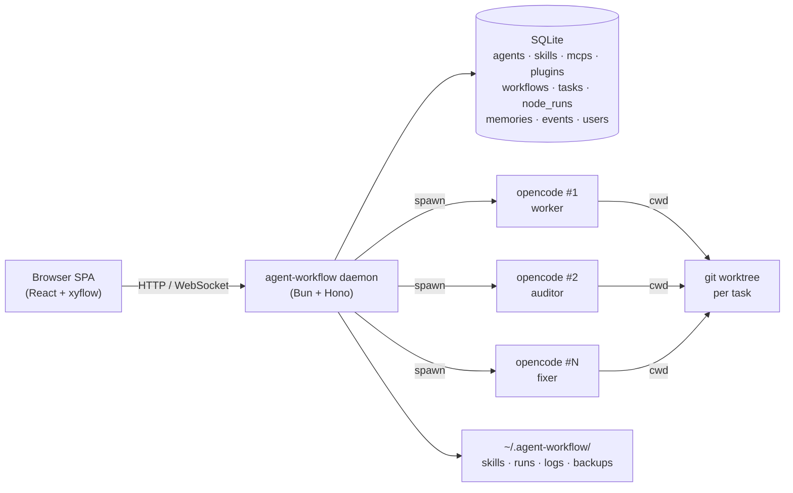
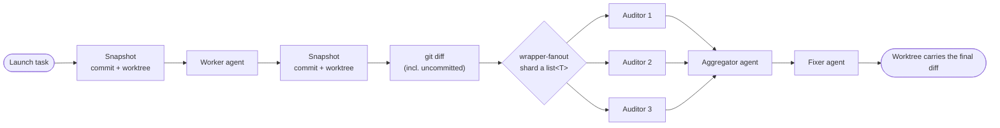

# Agent Workflow

Local-first orchestration platform that drives multiple `opencode` CLI
processes as collaborating agents. Each agent runs in its own subprocess with a
small, focused context, so audit-style fan-out stays accurate as the diff grows
— instead of one ballooning session whose accuracy degrades.

The canonical workflow it was built around is **Code → Audit → Fix**: snapshot
the repo, run a worker agent in a per-task `git worktree`, diff the result, fan
it out to parallel auditor agents, then feed the audit into one or more fixer
agents. From that core, the platform has grown a full surface: a visual workflow
editor, human-in-the-loop review and clarify gates, long-term agent memory,
agent dependencies (skills / MCP servers / opencode plugins), multi-repo and
remote-URL launches, framework-managed commit & push, and multi-user auth.

> **Status.** Actively developed; latest release **v0.9.5**. The product is
> driven by an RFC catalog (RFC-001 … RFC-082, see [`design/plan.md`](./design/plan.md)),
> nearly all of which has shipped.

---

## How it works

The daemon is one Bun process. It serves the (auth-gated) SPA, owns the SQLite
database, and spawns one `opencode` subprocess per node. Each subprocess gets
its own private `OPENCODE_CONFIG_DIR`, an inline `OPENCODE_CONFIG_CONTENT` JSON
(the agent + its dependent agents, MCP servers, plugins, and a global
permission), and runs with the task's `git worktree` as `cwd` — so concurrent
agents never step on each other's `.opencode/` directories, yet `git diff` works
naturally.



The canonical pipeline — `Code → Audit → Fix` — composes a `git` wrapper, a
`fan-out` wrapper, and an aggregation step:



The scheduler executes a workflow as a recursive DAG of **scopes** (the root,
plus one inner scope per wrapper), dispatching nodes whose whole transitive
upstream chain has settled. Freshness is **provenance-based**: every `node_run`
records which upstream run it consumed, so an upstream rerun automatically
re-fires its descendants without stale data leaking through.

---

## What it does

**Agents, skills & dependencies**

- **Virtual agents** stored in the database (frontmatter fields + markdown body),
  injected per-run via `OPENCODE_CONFIG_CONTENT` — highest precedence in
  opencode's merge order, so the platform's definition always wins.
- **Skills** from the filesystem: managed skills are **copied** into the per-run
  `OPENCODE_CONFIG_DIR/skills/`, external skills are **symlinked**, repo-local
  `.opencode/skills/` are left for opencode's own discovery.
- **Agent dependency closures** (`dependsOn`) merge dependent agents + skills so
  a primary agent can invoke them; plus first-class **MCP servers** (local stdio
  / remote http+sse, with capability probing) and **opencode plugins** (eagerly
  installed on save, injected as zero-network `file://` specs).
- **Runtime inventory snapshot** — a framework-injected plugin records what
  opencode _actually_ loaded (agents / skills / MCPs / plugins) per node run.

**Workflow editor & node model**

- Dify-style **xyflow** canvas: drag agents and wrappers from the palette,
  wire output → input ports, auto-save (debounced), multi-tab sync over a
  WebSocket. Node kinds: `agent-single`, `input`, `output`, `wrapper-git`,
  `wrapper-loop`, `wrapper-fanout`, `review`, `clarify`, `clarify-cross-agent`.
- **Output-kind grammar** — ports declare a kind: base (`string`, `markdown`,
  `signal`), `path<ext>` (`path<md>`, `path<json>`, `path<*>`, …), or nested
  `list<…>` (e.g. `list<path<md>>`). `signal` is control-flow-only (no data);
  `markdown_file` is a legacy alias for `path<md>`.
- **Wrappers**: `git` (snapshots HEAD + worktree before/after the inner scope
  and emits a `git_diff`, untracked files included), `loop` (`max_iterations` +
  a built-in exit condition), and `fan-out` (shards a `list<T>` across an inner
  subgraph and converges through an optional `aggregator` agent). Wrappers nest.

**Human-in-the-loop**

- **Review gate** — pauses the workflow on a generated markdown port for an
  Approve / Iterate / Reject decision, with selection-anchored comments,
  history/version browsing, and inline diff. **Multi-document review** accepts a
  `list<path<md>>` / `list<markdown>` input and lets a human curate a per-document
  accepted subset.
- **Clarify** — an agent can pause and ask the human a structured question set
  instead of guessing; answers feed its next round (same-session resume
  supported). **Cross-agent clarify** lets a downstream agent send feedback
  questions back to an upstream agent through a human gate.

**Repos & tasks**

- Launch from a recent path, a pasted path, or a **remote SSH/HTTPS git URL**
  (cached mirror with batch import and recursive submodule clone). A single
  task can span **multiple repositories**.
- Each task runs in its own `git worktree`; optionally on a **named working
  branch** (created off base, or reused + merged), with the base branch pulled
  at launch and an optional per-task Git identity.
- **Framework-managed auto commit & push** (opt-in): after a writer node
  finishes, the framework stages, commits with an LLM-generated message, and
  pushes (never force) — with a bounded LLM repair loop on rejected pushes.
- Full **retry / resume / cancel** lifecycle over a CAS-guarded status state
  machine, a stuck-task detector, and a Diagnose panel with one-click fixes.

**Long-term memory**

- A background **distiller** turns clarify answers, review decisions, and task
  feedback into reusable memories (candidate → approved), scoped to
  agent / workflow / repo / global, and **injects** them (budget-trimmed) into
  agent prompts at run time.

**Multi-user**

- Optional multi-user auth: local username/password, **OIDC** single-sign-on,
  and per-user **Personal Access Tokens**, with role/permission-gated APIs.
  Single-user stays zero-touch via the daemon token.

---

## A look at the UI

Screenshots were taken against a freshly seeded daemon with stub agents — the
names, IDs and review body are sample content, not data from a real workspace.

**Home** — task-driven landing page: what's running, what's waiting on you,
what just finished (first run shows an onboarding card instead).


**Workflow editor** — three columns: a draggable palette of agents + wrappers
on the left, the xyflow canvas in the middle, and an Edit/Preview inspector
drawer on the right. The pipeline below covers a
**Doc → Clarify → Review → Code → Review** loop: `doc-writer` paired with a
`clarify` node via the `__clarify__` / `__clarify_response__` system ports
drafts a design doc; a markdown `review` gate human-approves it; `code-writer`
(wrapped in a `git` wrapper, so its file changes become the wrapper's
`git_diff`) implements the approved doc; finally `code-reviewer` flags issues
on the resulting diff. The palette also offers `wrapper-fanout` (sharded
fan-out) and `clarify-cross-agent`.


**Task detail** — each task opens to a tabbed view: a read-only workflow-status
canvas, the per-node run table, details, outputs, a worktree file browser, the
worktree diff, and a feedback thread. The **diff** tab lists touched files and
renders the unified diff against the base branch; node rows can open the full
opencode conversation (including nested subagents) for that run.


**Markdown review** — `review` nodes pause the workflow on a generated markdown
port and surface it here for an Approve / Iterate / Reject decision. Highlighted
spans are reviewer comments anchored to the doc; each card on the right pins to
its anchor so iterations can fold them back into the regen prompt.


**Clarify** — an agent can pause the workflow and ask the human a structured
question set instead of guessing. The Clarify inbox lists every awaiting
session (node + asking agent + round + question count):


Opening one shows the agent-emitted questions. Each option is a digit-numbered
radio (`single`) or checkbox (`multi`), with a free-form note field and a
"submit & keep clarifying" / "submit & stop" pair at the bottom:


Ticking options highlights the chosen rows; the answers feed back into the
asking agent's next round via the `__clarify_response__` system port:


**Agent catalog** — virtual agents stored in the database, injected per-run
via `OPENCODE_CONFIG_CONTENT`.


**The rest of the app** (not screenshotted here) follows the same design
system: a sidebar with four groups — **Agents** (Agents / Skills / MCPs /
Plugins), **Workflows**, **Tasks** (Tasks / Repos), and **Memory** — plus a
footer **Inbox** drawer that aggregates pending reviews, clarify sessions, and
memory candidates. The **Settings** page is organized into runtime, limits, GC,
network, appearance, memory, connection, rendering, and authentication tabs.

---

## Requirements

| Tool         | Supported version                            | Why                                    |
| ------------ | -------------------------------------------- | -------------------------------------- |
| **opencode** | ≥ 1.14.0 and < 1.17.0 (verified to 1.15.5)   | Spawned as the agent subprocess        |
| **git**      | 2.5+                                         | `git worktree`, snapshots, stash, diff |
| **OS**       | macOS, Linux, or Windows 10/11 / Server 2022 | Windows needs WSL2 — see below         |

The daemon enforces a supported **range**: it refuses to start if opencode is
below `1.14.0` _or_ at/above the `1.17.0` ceiling (every `1.14.x`, `1.15.x`, and
`1.16.x` is accepted). `opencode` must be on `PATH`, or set `opencodePath` in
`config.json`. The same range is reported by `agent-workflow doctor` and the
**Settings → Runtime** tab.

> **Windows note (RFC-windows).** The daemon runs natively on Windows 10/11 and
> Windows Server 2022, and spawns `opencode` directly — opencode is a Node CLI
> (npm `opencode-ai`) that runs natively on Windows (verified with 1.15.5). No
> WSL is required. The daemon builds, runs, and launches agent tasks on
> Windows; `agent-workflow doctor` checks opencode + git + long-path + ACL
> presence and reports any missing piece. See the Windows setup section below.

---

## Install

Download the binary for your platform from
[Releases](https://github.com/wangbinquan/agent-workflow/releases) and mark it
executable:

```bash
# macOS (Apple Silicon)
curl -L -o agent-workflow \
  https://github.com/wangbinquan/agent-workflow/releases/latest/download/agent-workflow-macos-arm64
chmod +x agent-workflow

# Linux (x86_64)
curl -L -o agent-workflow \
  https://github.com/wangbinquan/agent-workflow/releases/latest/download/agent-workflow-linux-x86_64
chmod +x agent-workflow

# Linux (arm64)
curl -L -o agent-workflow \
  https://github.com/wangbinquan/agent-workflow/releases/latest/download/agent-workflow-linux-arm64
chmod +x agent-workflow
```

```powershell
# Windows (x86_64) — PowerShell
Invoke-WebRequest `
  https://github.com/1589701052p-alt/agent-workflow/releases/latest/download/agent-workflow-windows-x86_64.exe `
  -OutFile agent-workflow.exe
```

The binary is one self-contained executable (≈ 78 MiB on macOS, ≈ 107 MiB on
Linux) that bundles the Bun runtime, the backend, the SPA, and the database
migrations.

### Windows setup

The Windows binary runs the daemon natively and spawns `opencode` directly
(opencode is a Node CLI that runs natively on Windows — no WSL needed). You
need Node.js + git installed, then opencode:

```powershell
# 1. Install opencode (>= 1.14.0, < 1.17.0) globally via npm.
npm install -g opencode-ai@1.15.5

# 2. Verify opencode + git are on PATH.
opencode --version
git --version

# 3. Verify the daemon can see them.
.\agent-workflow.exe doctor
```

`doctor` checks the opencode version, git, long-path support, and the ACL on
the daemon token file. It also recommends enabling `LongPathsEnabled` for
deep worktree paths (`reg query HKLM\SYSTEM\CurrentControlSet\Control\FileSystem
/v LongPathsEnabled`); even without it, the daemon falls back to the `\\?\`
prefix for long paths.

---

## Quick start

```bash
./agent-workflow start
# agent-workflow ready — open this URL in your browser:
#   http://127.0.0.1:51234/?token=…
```

Click the URL. The token in the query string authenticates you for the session;
it is a 64-char hex string written to `~/.agent-workflow/token` (mode 0600) on
first run, and accepted via either `?token=` or an `Authorization: Bearer`
header. (For a team, enable multi-user auth — see below.)

From the UI:

1. **Agents** → New agent. Pick a name, set the model (or leave blank for
   `defaultModel` / opencode's installed default), and declare the agent's
   output ports and their kinds. Optionally attach skills, MCP servers,
   plugins, and dependent agents.
2. **Skills** → New skill. Markdown body + frontmatter (managed) or register an
   external directory; ZIP / parent-directory bulk import is supported.
3. **Workflows** → New workflow. Drag agents and wrappers from the palette onto
   the canvas, connect output → input handles, and wrap a region in a `git`,
   `loop`, or `fan-out` wrapper as needed. Add `review` / `clarify` gates.
4. **Workflows → Launch task**. Pick a repo from the recent list, paste a path,
   or paste a remote git URL (one or several repos per task); choose the base
   branch and optionally a working branch + auto commit & push; fill the
   workflow's launcher inputs (enum / files / git / upload), and Start.
5. **Tasks** → click a row to watch live node status, browse the worktree, see
   the diff, replay a node's opencode conversation, and review outputs/stats.

All persistent state lives under `~/.agent-workflow/`:

```
~/.agent-workflow/
├── db.sqlite              # agents, skills, mcps, plugins, workflows,
│                          #   tasks, node_runs, memories, events, users
├── config.json            # editable in Settings page
├── token                  # 64-char hex daemon token, mode 0600
├── secret.key             # AES-256-GCM key sealing OIDC secrets (mode 0600)
├── .daemon.lock           # single-instance PID lock
├── .daemon.info           # running daemon's pid / host / port / url
├── skills/                # managed skills' SKILL.md + files
├── worktrees/<repo>/<id>/ # per-task git worktree (multi/<id>/ for multi-repo)
├── runs/<task>/<node>/    # per-process OPENCODE_CONFIG_DIR
├── logs/                  # daemon.log + archived event JSONL
└── backups/               # `agent-workflow backup` output
```

> **Back up `secret.key`.** Losing it makes any stored OIDC client secrets
> unreadable.

The daemon runs a single-instance PID lock, probes opencode on startup, reaps
orphaned runs from a crashed prior daemon, and runs background tickers at
several cadences (resource limits at 1 Hz; worktree GC + events archival
hourly; a stuck-task detector every few minutes). On `SIGTERM`/`SIGINT` it
drains running tasks for up to 30 s, then marks survivors `interrupted`.

---

## CLI

```bash
agent-workflow start [--port N] [--host H]   # foreground daemon
agent-workflow stop                          # SIGTERM the running daemon
agent-workflow status                        # PID + /health snapshot
agent-workflow doctor                        # 6 health checks (does not start the daemon)
agent-workflow config get [key]              # print config or one key
agent-workflow config set <key> <value>      # JSON-parsed value if possible
agent-workflow migrate                       # apply pending DB migrations
agent-workflow backup                        # tar.gz under ~/.agent-workflow/backups/
agent-workflow version

# Multi-user bootstrap (RFC-036) — writes the DB directly:
agent-workflow user create --username <name> [--admin] [--display ..] [--email ..] [--password ..]
agent-workflow user reset-password --username <name> --new-password <pw>
agent-workflow user list
agent-workflow user disable --username <name>
```

`doctor` checks the opencode binary + version range, git (≥ 2.5), a writable app
home, a loadable config, the token file mode, and the migrations folder.

---

## Configuration

`~/.agent-workflow/config.json` is the source of truth. The Settings page edits
it via `PUT /api/config`. **Only `bindHost` and `bindPort` require a daemon
restart** — every other field hot-applies on save. The schema has ~38 fields;
the table below is a curated subset (see the Settings page or
[`packages/shared/src/schemas/config.ts`](./packages/shared/src/schemas/config.ts)
for the full list).

| Field                               | Default           | Notes                                                     |
| ----------------------------------- | ----------------- | --------------------------------------------------------- |
| `opencodePath`                      | _(PATH lookup)_   | Override the opencode binary; no value = `which opencode` |
| `defaultModel`                      | _(unset)_         | Used by agents without an explicit `model`                |
| `maxConcurrentNodes`                | `4`               | Global node-execution semaphore                           |
| `multiProcessSubprocessConcurrency` | `4`               | Per fan-out node sub-pool                                 |
| `defaultPerNodeTimeoutMs`           | `1800000`         | 30 min; overridable per node                              |
| `defaultPerTaskMaxDurationMs`       | `3600000`         | 1 h; `0` = unlimited                                      |
| `defaultPerTaskMaxTotalTokens`      | `0`               | `0` = unlimited                                           |
| `largeOutputThresholdBytes`         | `1048576`         | 1 MB; larger outputs spill to a log file pointer          |
| `worktreeAutoGc`                    | `{enabled:false}` | Hourly background sweep                                   |
| `eventsArchiveThresholds`           | 50k / 1M          | Per-node-run / global event row caps                      |
| `gitCloneTimeoutMs`                 | `1800000`†        | Remote clone/fetch budget (RFC-024)                       |
| `gitFetchOnReuse`                   | `true`†           | Re-fetch a cached mirror on reuse                         |
| `gitRecurseSubmodules`              | `auto`†           | `auto / always / never` (RFC-034)                         |
| `memoryDistillerEnabled`            | `true`†           | Master switch for the memory distiller (RFC-041)          |
| `memoryDistillModel`                | _(opencode dflt)_ | Model the distiller agent uses                            |
| `commitPushModel`                   | _(opencode dflt)_ | Model for auto commit-message + push repair               |
| `commitPushMaxRepairRetries`        | `3`†              | Bounded LLM push-repair cycles (RFC-075)                  |
| `commitPushDiffMaxBytes`            | `16384`†          | Diff bytes fed to the commit-message session              |
| `plantumlEndpoint`                  | _(unset)_         | kroki-compatible diagram renderer (RFC-005)               |
| `publicBaseUrl`                     | _(unset)_         | OIDC callback base URL behind a proxy (RFC-036)           |
| `bindHost`                          | `127.0.0.1`       | **restart required**                                      |
| `bindPort`                          | `0`               | `0` = OS-assigned free port; **restart required**         |
| `theme`                             | `system`          | `system / light / dark`                                   |
| `language`                          | `zh-CN`           | `zh-CN / en-US`                                           |
| `logLevel`                          | `info`            | `debug / info / warn / error`                             |

† Optional fields with **no on-disk default**: the listed value is what the
consuming service falls back to when the field is absent — it is not written
into `config.json` unless you set it.

---

## Authentication & multi-user

By default the daemon is single-user: the auto-generated daemon token (the one
in the startup URL) maps to a built-in admin actor — nothing to configure.

For teams, the API supports three auth tracks (RFC-036): **session tokens**
(web login with local password or **OIDC** SSO), per-user **Personal Access
Tokens**, and the legacy daemon token. APIs are role/permission-gated; admin-only
areas (Settings, backup, Users) are protected. Bootstrap the first admin with
`agent-workflow user create --admin …`, configure an OIDC provider in Settings,
and manage members from the **Users** page; users self-serve passwords,
sessions, PATs, and linked identities from **Account**.

---

## Docs

Operator-facing references:

- [`docs/architecture.md`](./docs/architecture.md) — process model + data flow
- [`docs/agent.md`](./docs/agent.md) — agent frontmatter reference
- [`docs/skill.md`](./docs/skill.md) — SKILL.md frontmatter + dir layout
- [`docs/workflow-yaml.md`](./docs/workflow-yaml.md) — workflow YAML import/export schema
- [`docs/performance-notes.md`](./docs/performance-notes.md) — perf tuning + benchmarks
- [`docs/troubleshooting.md`](./docs/troubleshooting.md) — common issues

Product & technical design (and the shipped-feature changelog) live in
[`design/`](./design/):

- [`design/proposal.md`](./design/proposal.md) — product spec (Chinese)
- [`design/design.md`](./design/design.md) — technical design (Chinese)
- [`design/plan.md`](./design/plan.md) — milestone roadmap + the RFC index
  (RFC-001 … RFC-082); most RFC subdirectories carry their own
  `proposal` / `design` / `plan` trio.

---

## Building from source

```bash
# bun >= 1.3.0
curl -fsSL https://bun.sh/install | bash

git clone https://github.com/wangbinquan/agent-workflow.git
cd agent-workflow
bun install

# Tests (as of v0.9.5): ~3040 backend + ~970 shared (bun:test) + ~2290 frontend (vitest)
bun test                                          # backend + shared
bun run --filter @agent-workflow/frontend test    # frontend (vitest)
bun run typecheck && bun run format:check         # gates CI also runs
bun run e2e                                        # Playwright e2e (needs a built binary)

# Dev: backend on a random port + vite dev server on :5174
bun dev

# Production single-binary (dist/agent-workflow-<platform>-<arch>)
bun run build:binary
```

CI runs format / lint / typecheck / tests on macOS + Linux, a single-binary
build smoke (`version` + `doctor`), and a 4-way-sharded Playwright e2e suite;
pushing a `v*` tag builds and publishes all three release binaries. The repo's
version comes from the git tag (`package.json` versions are placeholders).

---

## License

Licensed under the [Apache License, Version 2.0](./LICENSE).

Copyright 2026 WangBinquan.
