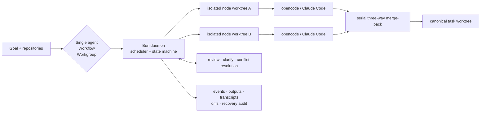

# Agent Workflow

[**English**](./README.md) | [简体中文](./README.zh-CN.md)

[](https://github.com/wangbinquan/agent-workflow/releases/latest)
[](https://github.com/wangbinquan/agent-workflow/actions/workflows/ci.yml)
[](./LICENSE)

**A local-first orchestration platform for running CLI coding agents as reliable,
inspectable teams.**

Agent Workflow launches agents as separate CLI processes and, for Git-backed runs,
isolates their normal work in Git worktrees. A deterministic Bun daemon keeps
coordination, data flow, retries, human decisions, and recovery under control.
Agents keep focused contexts; users get a visual control plane instead of a single,
ever-growing parent conversation.

The flagship pattern is **Code → Audit → Fix**: let one agent implement, fan the
diff out to independent auditors, aggregate their findings, and send the result to
fixers. The same primitives also support documentation pipelines, test generation,
scheduled maintenance, adaptive workgroups, and one-off agent tasks.

> **Project status:** actively developed. The latest published binary is
> [v0.14.1](https://github.com/wangbinquan/agent-workflow/releases/tag/v0.14.1)
> (2026-07-15); the RFC index on `main` currently reaches
> [RFC-193](./design/plan.md). This README describes `main`, so changes merged
> after the latest tag may require a source build.

## Choose how agents work

Every launch becomes a task on the same execution substrate: persisted history,
files and diffs, recovery controls, and access-control checks.

| Execution model  | Best for                               | Behavior                                                                                                    |
| ---------------- | -------------------------------------- | ----------------------------------------------------------------------------------------------------------- |
| **Single agent** | Focused one-off work                   | Run one configured agent directly against one or more repositories.                                         |
| **Workflow**     | Repeatable, reviewable automation      | Execute a versioned visual DAG with typed ports, wrappers, and human gates.                                 |
| **Workgroup**    | Goals whose plan must adapt at runtime | Let a roster of agents and humans coordinate through rounds, assignments, messages, or an AI-generated DAG. |

Scheduled tasks can launch any of the three models on an interval or a daily,
weekly, or monthly calendar.

## How execution works



A Git-backed task owns one canonical worktree. Agent-backed runs normally branch
from that state into temporary node worktrees, so independent DAG branches can
write in parallel without sharing a working directory. Successful deltas merge
back under a short lock; failed attempts are not merged automatically. Clean
merges are automatic, real conflicts go to a built-in merge agent, and unresolved
cases pause for a human. This is Git/worktree isolation, not an operating-system
sandbox: an agent explicitly given an absolute path outside its run directory can
still reach that path subject to its process permissions.

The daemon persists task and node state in SQLite. If it restarts, it reconciles
orphaned processes and can resume interrupted work; optional auto-recovery rules
are guarded by audit records and circuit breakers.

## Core capabilities

### Visual workflows

- Build versioned DAGs in an xyflow editor with drag-and-drop nodes, validation,
  preview, auto-save, YAML import/export, and multi-tab synchronization.
- Connect typed ports using `string`, `markdown`, `signal`, `path<ext>`, and
  parameterized `list<T>` kinds such as `list<path<md>>`. Prompt templates consume
  upstream values explicitly.
- Compose nestable wrappers:
  - **git** snapshots the inner scope and emits its complete diff;
  - **loop** repeats a scope under a bounded exit policy;
  - **fan-out** shards `list<T>` through an arbitrary inner graph and can converge
    through an aggregator agent.
- Add **review**, **clarify**, and **cross-agent clarify** gates without embedding
  human coordination logic in agent prompts.
- Re-run stale descendants from provenance: every node run records the upstream
  runs it consumed, so retries propagate without reusing stale outputs.

### Adaptive workgroups

Workgroups are reusable rosters with agent or human members, a shared goal, a room,
and task-scoped history. They have three execution modes:

| Mode               | Coordination model                                                                                                                                                                   |
| ------------------ | ------------------------------------------------------------------------------------------------------------------------------------------------------------------------------------ |
| `leader_worker`    | A leader plans in rounds, dispatches assignments, waits at a barrier, and continues from member deliveries. Optional fan-out lets one member agent run several concurrent instances. |
| `free_collab`      | Members share a task board and room, claim work, exchange outputs, and converge without a leader.                                                                                    |
| `dynamic_workflow` | A built-in orchestrator selects from the group's agent pool, generates a constrained DAG, lets a human approve or regenerate it, then hands it to the deterministic workflow engine. |

In `leader_worker` mode, visibility switches control shared outputs, direct
messages, and the blackboard; `free_collab` treats all three channels as enabled.
An autonomous option suppresses routine human interruptions and completion gates
while retaining bounded safety fallbacks.

### Agents, runtimes, and tools

- Define agents with a system prompt, declared inputs and outputs, permissions,
  runtime/model selection, dependent agents, skills, MCP servers, and plugins.
- Use the built-in `opencode` and `claude-code` runtime protocols or register
  additional CLI profiles that speak one of those protocols. Runtime profiles can
  carry their own binary, model and execution parameters, plus config-directory
  environment-variable and directory-name mappings.
- Manage skills as versioned, framework-owned directories; edit files in the UI
  or import multiple skills from ZIP with explicit conflict handling.
- Register local stdio or remote HTTP/SSE MCP servers, including remote OAuth
  settings and capability probes.
- Install npm, file, or Git-based opencode plugins once, cache them locally, and
  inject `file://` references without reinstalling them for every agent run. A
  plugin may still perform its own network activity at runtime.
- For opencode runs, inspect the runtime inventory actually loaded, not only the
  resources the agent was configured to receive.

### Repositories and task reliability

- Launch from a local path, a cached SSH/HTTPS Git URL, or several repositories in
  one task. Remote imports support batch cloning and recursive submodules.
- Use a generated task branch or an existing working branch; optionally set a
  per-task Git identity.
- Retry a node, resume or relaunch a task, cancel safely, and diagnose lifecycle
  invariant failures from the task UI.
- Opt into framework-managed commit and push. The daemon generates the commit
  message, never force-pushes, and uses a bounded repair loop for policy or
  non-fast-forward rejections.
- Schedule single-agent, workflow, or workgroup launches; disable, run now, or
  inspect consecutive failures from the scheduler UI.

### Review, questions, and observability

- Review one markdown document or a collection, attach selection-anchored comments,
  accept a subset, and choose Approve / Iterate / Reject with full version history.
- Let agents ask structured single- or multi-choice questions. The unified question
  board supports assignment, defer/re-answer flows, and self or cross-agent
  clarification.
- Inspect live node status, full CLI conversations, tool calls, token usage,
  outputs, runtime inventory, worktree files, unified diffs, and task feedback.
- Explore structural code changes for C++, Java, Python, Rust, Go, JavaScript,
  TypeScript, and Scala: symbol trees, dependency changes, impact analysis, class
  graphs, forward call chains, and sequence diagrams. The bundled tree-sitter
  baseline works without a build; optional SCIP indexers deepen cross-file results.

### Memory, teams, and access control

- Distill clarify answers, review decisions, and task feedback into reusable
  memories scoped to an agent, workflow, repository, or the whole installation.
- Inject approved memories under per-scope budgets and inspect every distillation
  job and source event.
- Start in zero-configuration single-user mode, then add local users, OIDC SSO,
  Personal Access Tokens, roles, per-resource ownership, visibility, and grants.
- Use the unified inbox for pending reviews, questions, workgroup actions, and
  memory administration.

## Interface

The SPA is bundled into the release binary and is available in Chinese and English,
with light, dark, and system themes.

**Workflow editor** — compose agents, wrappers, ports, and human gates on a visual
canvas.


**Task diff** — follow node execution, inspect the canonical worktree, and review
the accumulated change.


**Markdown review** — comment on anchored selections and drive iterative
regeneration.


**Clarify** — answer structured questions without leaving the task's execution
history.


## Requirements

| Dependency      | Requirement                                      | Notes                                                                                                  |
| --------------- | ------------------------------------------------ | ------------------------------------------------------------------------------------------------------ |
| **OS**          | macOS on Apple Silicon, or Linux on x86_64/arm64 | Windows is not currently supported.                                                                    |
| **git**         | **2.38.0 or newer**                              | Required for isolated merge-back via `git merge-tree --write-tree`.                                    |
| **opencode**    | **1.14.0 or newer**                              | Hard-required at daemon startup; there is no upper version cap. Set `opencodePath` to override `PATH`. |
| **Claude Code** | **2.0.0 or newer**, optional                     | Additional runtime; set `claudeCodePath` or a runtime profile to use it.                               |
| **Bun**         | **1.3.0 or newer**, source builds only           | Release binaries bundle Bun.                                                                           |

Run `agent-workflow doctor` before starting the daemon to check opencode, Git, the
data directory, config, token-file permissions, migrations, and lifecycle health.

## Install a release binary

Download the asset for your platform from
[GitHub Releases](https://github.com/wangbinquan/agent-workflow/releases/latest):

Run the download command for your platform, then the shared `chmod` and `doctor`
commands at the end.

```bash
# macOS, Apple Silicon
curl -L \
  https://github.com/wangbinquan/agent-workflow/releases/latest/download/agent-workflow-macos-arm64 \
  -o agent-workflow

# Linux, x86_64
curl -L \
  https://github.com/wangbinquan/agent-workflow/releases/latest/download/agent-workflow-linux-x86_64 \
  -o agent-workflow

# Linux, arm64
curl -L \
  https://github.com/wangbinquan/agent-workflow/releases/latest/download/agent-workflow-linux-arm64 \
  -o agent-workflow

chmod +x agent-workflow
./agent-workflow doctor
```

Each release is a self-contained executable containing the daemon, SPA, Bun
runtime, and database migrations.

## Quick start

```bash
./agent-workflow start

# The daemon prints a URL similar to:
# http://127.0.0.1:51234/?token=...
```

Open the printed URL. On first run, the daemon creates
`~/.agent-workflow/token` with mode `0600`; the query token authenticates the
built-in single-user admin.

A practical first run is:

1. Open **Agents** and create or import an agent. Give it a focused prompt and
   declare the ports it produces.
2. Attach any managed skills, MCP servers, plugins, or dependent agents it needs.
3. Either run the agent directly, compose it under **Workflows**, or add it to a
   **Workgroup**.
4. Launch against a local repository or Git URL, then follow the task's live
   status, conversations, outputs, files, and diffs.

## CLI

```text
agent-workflow start [--port N] [--host H]   Start the foreground daemon
agent-workflow stop                          Stop the running daemon
agent-workflow status                        Print PID, address, and health
agent-workflow doctor                        Run checks without starting
agent-workflow config get [key]              Print all config or one field
agent-workflow config set <key> <value>      Update a field; parses JSON values
agent-workflow migrate                       Apply pending DB migrations
agent-workflow backup                        Create a state archive under backups/
agent-workflow version                       Print the embedded CLI version string

agent-workflow user create --username <name> [--admin] [--password <pw>]
agent-workflow user reset-password --username <name> --new-password <pw>
agent-workflow user list
agent-workflow user disable --username <name>
agent-workflow user enable --username <name>
```

Database migrations also run automatically on daemon startup.

## Configuration and data

The Settings UI is the preferred configuration surface. Global settings live in
`~/.agent-workflow/config.json`; CLI automation can use `config get` and
`config set`, while runtime profiles and product resources live in SQLite.
Important config groups include the default runtime, concurrency and retry limits,
recovery policy, scheduled-task policy, Git/cache behavior, internal-agent
runtimes, memory budgets, rendering, network binding, appearance, and OIDC.

The daemon binds to `127.0.0.1` on an OS-assigned port by default. Treat changing
the bind address as a deployment decision: enable multi-user authentication and
put the service behind an appropriate trusted proxy before exposing it to a
network.

All local state is rooted at `~/.agent-workflow/`. Set `AGENT_WORKFLOW_HOME` to
use another directory. Key paths are shown below; the daemon also creates transient
lock and runtime entries as needed.

```text
~/.agent-workflow/
├── db.sqlite          Resources, tasks, runs, events, users, and memories
├── config.json        Global configuration
├── token              Single-user daemon token
├── secret.key         Key that encrypts stored OIDC client secrets
├── skills/            Managed skill content and files
├── plugins/           Installed plugin cache
├── repos/             Cached remote Git repositories
├── worktrees/         Canonical task worktrees
├── runs/              Per-run runtime config and artifacts
├── snapshots/         Git snapshot material used by execution/recovery
├── scratch/           Transient upload and task staging
├── logs/              Daemon and archived event logs
└── backups/           CLI and Settings backups
```

The built-in backup archive does not include `secret.key`. Copy it separately with
the database backup; losing it makes existing encrypted OIDC client secrets
unreadable.

## Documentation

- [Architecture](./docs/architecture.md) — process model and data flow
- [Agent reference](./docs/agent.md) — agent frontmatter and fields
- [Skill reference](./docs/skill.md) — `SKILL.md` and managed file layout
- [Workflow YAML](./docs/workflow-yaml.md) — import/export schema
- [Runtime config layering](./docs/OPENCODE_CONFIG.md) — injected and discovered
  opencode configuration
- [Troubleshooting](./docs/troubleshooting.md) — startup and runtime problems
- [Performance notes](./docs/performance-notes.md) — tuning and benchmarks
- [Why an AI-native workflow](./docs/blog/01-ai-native-workflow-why.md) and
  [how Agent Workflow is built](./docs/blog/02-agent-workflow-how.md)

The product specification, technical design, roadmap, and shipped-feature history
live under [`design/`](./design/):

- [Product proposal](./design/proposal.md)
- [Technical design](./design/design.md)
- [Roadmap and RFC index](./design/plan.md)

Each substantial product change has a dedicated `design/RFC-NNN-*/` directory
with a proposal, design, and implementation plan.

## Build from source

```bash
git clone https://github.com/wangbinquan/agent-workflow.git
cd agent-workflow

bun install --frozen-lockfile

# Development servers
bun run dev

# Repository gates
bun run typecheck
bun run test # backend (root Bun discovery is scoped by bunfig.toml)
bun run --filter @agent-workflow/shared test
bun run --filter @agent-workflow/frontend test
bun run lint
bun run format:check

# Root README formatting (outside the fixed package/repo-UI format gates)
bunx prettier --check README.md README.zh-CN.md

# Playwright end-to-end suite (requires its browser dependencies)
bun run e2e:install
bun run e2e
bun run test:visual -- --retries=0 # opt-in Chromium snapshots at 1280x800

# Self-contained binary under dist/
bun run build:binary
```

CI runs formatting, lint, typechecking, explicit backend/shared tests, frontend tests,
single-binary smoke checks, and sharded Playwright coverage on macOS and Linux.
Nightly jobs add live opencode compatibility, WebKit, visual regression, and real
SSH/HTTPS Git protocol coverage.

Git tags and GitHub Releases are the release identity. Workspace `package.json`
versions and the current CLI `version` string remain `0.0.0` placeholders.

## License

Licensed under the [Apache License, Version 2.0](./LICENSE).

Copyright 2026 WangBinquan.
