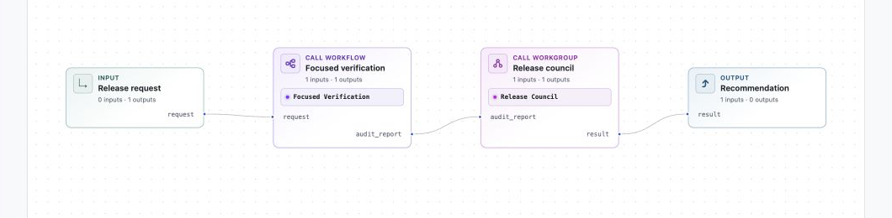
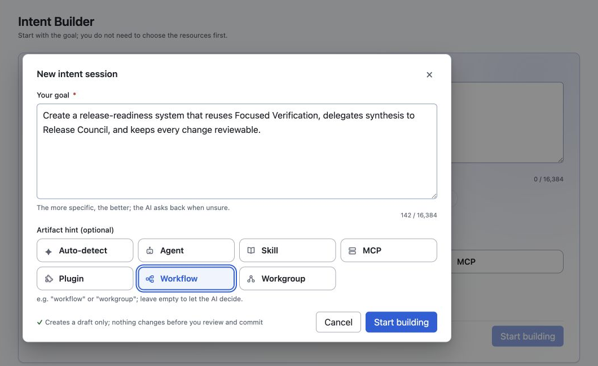
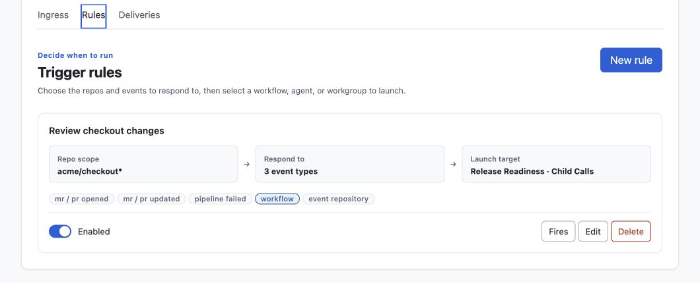
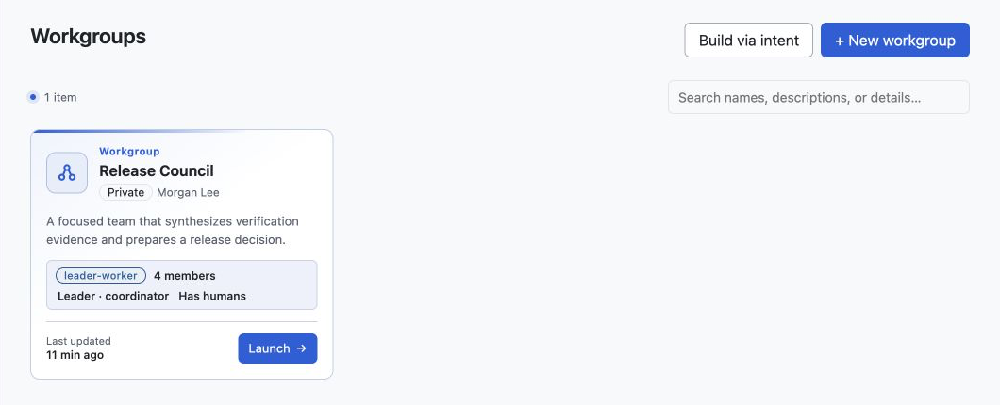
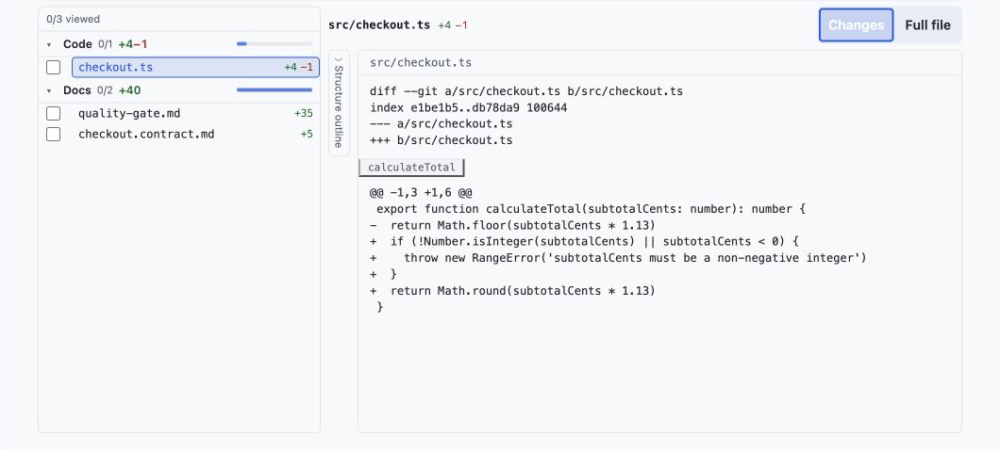

# Agent Workflow

[**English**](./README.md) | [简体中文](./README.zh-CN.md)

[](https://github.com/wangbinquan/agent-workflow/releases/latest)
[](https://github.com/wangbinquan/agent-workflow/actions/workflows/ci.yml)
[](./LICENSE)

## A local-first control plane for AI engineering work

Run CLI coding agents in independent processes, coordinate them through
deterministic workflows or adaptive workgroups, and keep human decisions, Git
changes, recovery, and governed knowledge connected through the same control
plane.

**AI reasons. The framework coordinates. Humans govern.**

[Quick start](#quick-start) · [Product tour](#product-tour-from-intent-to-evidence) ·
[Documentation](#documentation) · [Design essays](#design-essays)



<sub>Composition without visual clutter: the parent receives a release request,
calls <strong>Focused Verification</strong>, delegates synthesis to
<strong>Release Council</strong>, and returns one recommendation. Every card and
connection is visible.</sub>

> **Project status:** Agent Workflow is under active development. This README
> describes <code>main</code>; the
> [latest release](https://github.com/wangbinquan/agent-workflow/releases/latest)
> can lag behind it.

## Why Agent Workflow

Coding agents are good at reasoning inside a task. They are a poor place to hide
cross-agent routing, retries, recovery, and approval policy. Agent Workflow
separates those responsibilities:

- **Agents are workflow nodes, not toolbar buttons.** Each run gets an independent
  process and focused context instead of growing one parent conversation forever.
- **The model reasons; the framework coordinates.** Typed ports, persisted state,
  retries, wrappers, and recovery make data movement explicit and inspectable.
- **Fan-out controls scope.** A list can drive focused parallel runs and an
  aggregator can converge their findings; this is about task granularity, not a
  promise that parallelism automatically improves accuracy.
- **Humans are first-class participants.** Review and clarify are explicit
  workflow nodes; conflict resolution and dynamic-workflow confirmation are
  durable gates on their respective execution paths.
- **Memory is governed, not treated as truth.** Clarify answers, review decisions,
  and feedback become candidates; only approved memories are injected as
  advisory context under scope and budget limits.

## Choose the right execution model

Every launch becomes a task with the same history, artifacts, recovery controls,
and access checks.

| Model            | Best for                               | What it does                                                                                                                                                  |
| ---------------- | -------------------------------------- | ------------------------------------------------------------------------------------------------------------------------------------------------------------- |
| **Single agent** | Focused, one-off work                  | Runs one configured agent against one or more repositories.                                                                                                   |
| **Workflow**     | Repeatable delivery and quality gates  | Executes a versioned visual DAG with typed ports, wrappers, calls, and human nodes.                                                                           |
| **Workgroup**    | Goals whose plan must adapt at runtime | Starts from a task-owned launch snapshot with supported mid-run adjustments, then runs leader-worker, free collaboration, or a human-confirmed generated DAG. |

Scheduled launches and webhooks can start any of these models.

## How execution stays controlled

> **A typical Git-backed governed path:** goal + repositories → execution model
> → deterministic daemon → independent agent runs → merge-back → optional human
> gate → durable result

For a Git-backed task, an agent run normally works in an isolated node worktree.
Successful changes are three-way merged into the task's canonical worktree under
a short lock; a failed attempt is not merged. Independent DAG branches can
therefore write concurrently without sharing a working directory.

This is **Git isolation**, which protects task state and merge semantics. It is
not an operating-system security boundary. Runtime children execute as ordinary
processes with the daemon account's file and network access. See
[Platform and safety](#platform-and-safety).

The daemon persists task and node state in SQLite, records events and runtime
conversations, reconciles interrupted processes after restart, and keeps review
and clarification decisions attached to the execution that produced them.

## Product tour: from intent to evidence

These are representative states from the current product, chosen to explain one
job each. They do not imply that every launch must traverse all five stages.

### 1. Propose from intent

Intent Builder turns a natural-language goal into a validated, reviewable
changeset for Agents, Skills, MCPs, Plugins, Workflows, and Workgroups. It creates
a draft first: nothing is applied until the user reviews and commits the exact
draft. Human, naming, secret, and modify-versus-copy decisions remain explicit;
real secret values are bound at confirmation rather than sent through the model.



### 2. Compose with nested calls

The workflow at the top of this README uses both call kinds. A workflow call
mirrors the selected child workflow contract; a workgroup call converts its
inputs into a goal and returns one result. Each call launches an independent
child Task rather than inlining a subgraph. The referenced closure is frozen at
launch, with cycle, depth, input, and concurrency gates.

### 3. Trigger on repository events

GitHub HMAC-signed and GitLab secret-token-authenticated webhook deliveries can
match repository scope, event, branch, command prefix, and author rules, then
launch an Agent, Workflow, or Workgroup. A launch can use the event repository
or fresh scratch Git space; deliveries and fires remain auditable.



### 4. Collaborate when the plan must adapt

Workgroups support leader-led dispatch, leaderless free collaboration, and a
dynamic mode that generates a DAG for human review before handing it to the
normal workflow engine. The card below deliberately shows one valid
Leader-Worker resource: four members, a named coordinator, and explicit human
presence. Other modes enforce their own roster and interaction rules; dynamic
mode uses a compatible agent-only roster.



### 5. Verify concrete evidence

A separate controlled-release Task shows the reviewer side of the control
plane. Task-wide structural changes group code and documentation while the
selected file shows its real unified diff, so the approval decision can be tied
to inspectable evidence.



## Core capabilities

### Orchestrate explicitly

- Visual workflows with <code>string</code>, <code>markdown</code>,
  <code>signal</code>, <code>path&lt;ext&gt;</code>, and
  <code>list&lt;T&gt;</code> ports.
- Git, loop, and fan-out wrappers; fan-out runs supported inner agent workers per
  list item and can converge through one aggregator. Chained per-shard subgraphs
  are not supported today.
- Workflow and workgroup call nodes that launch independent child Tasks, plus
  reusable launcher forms and scheduled launches.
- GitHub HMAC-signed and GitLab secret-token-authenticated webhook rules for
  audited Agent, Workflow, or Workgroup launches from supported repository
  events.
- Intent Builder for proposing and validating multi-resource changes before the
  user commits the exact draft.

### Execute, observe, and recover

- OpenCode and Claude Code runtimes, plus custom profiles that implement one of
  those protocols.
- Per-node worktrees, provenance-aware retry, task resume/relaunch, cancellation
  with persisted recovery state, and optional framework-managed commit and push.
- Live node state, CLI conversations, tool calls, token usage, outputs, runtime
  inventory, worktree files, unified diffs, and task feedback.
- Structural change analysis for C++, Java, Python, Rust, Go, JavaScript,
  TypeScript, and Scala, with a built-in tree-sitter baseline and optional SCIP
  depth. C++ and Scala analysis is best-effort.

### Put people and policy in the loop

- Markdown and multi-document review with anchored comments, selective acceptance,
  version history, and Approve / Revise / Reject decisions.
- Structured clarify questions, handler routing and reassignment, defer and
  re-answer flows, and self- or cross-agent clarification.
- Unified inbox, local users, OIDC, Personal Access Tokens, roles, ownership,
  visibility, and resource grants.
- Memory candidates distilled from clarifications, reviews, and feedback, then
  approved and injected by scope and budget.

### Move portable resource configurations

Configuration packages export an Agent, Skill, MCP, Plugin, Workflow, or
Workgroup together with its resolvable recursive resource dependency closure;
external requirements and dangling call references remain explicit. Import
starts with a preview and makes create/reuse/overwrite decisions explicit. See
[Configuration packages](./docs/resource-packages.md).

Known structured credential fields are redacted and re-entered at import.
Managed Skill file trees are copied verbatim and are not scanned for hard-coded
secrets.

## Quick start

Before starting the daemon:

- Install **Git 2.38 or newer**. Startup is refused when Git is missing or too
  old; Windows requires Git for Windows.
- A coding runtime can be configured after startup, but at least one supported
  runtime is required before launching agent work.

### 1. Install a release binary

Choose the asset for your machine from the
[latest release](https://github.com/wangbinquan/agent-workflow/releases/latest):

| Platform            | Release asset                                  |
| ------------------- | ---------------------------------------------- |
| Apple Silicon macOS | <code>agent-workflow-macos-arm64</code>        |
| Linux x86_64        | <code>agent-workflow-linux-x86_64</code>       |
| Linux arm64         | <code>agent-workflow-linux-arm64</code>        |
| Windows x86_64      | <code>agent-workflow-windows-x86_64.exe</code> |

macOS example:

```bash
curl -L https://github.com/wangbinquan/agent-workflow/releases/latest/download/agent-workflow-macos-arm64 -o agent-workflow
chmod +x agent-workflow
./agent-workflow start
```

Windows PowerShell example:

```powershell
Invoke-WebRequest https://github.com/wangbinquan/agent-workflow/releases/latest/download/agent-workflow-windows-x86_64.exe -OutFile agent-workflow.exe
.\agent-workflow.exe start
```

The daemon prints a loopback URL. Open that URL in a browser; the SPA, daemon,
database migrations, and Bun runtime are already bundled in the executable.

### 2. Install a coding runtime

Install at least one supported runtime before launching agent work:

- **OpenCode:** supported without a version-string gate; compatibility is
  qualified from direct API behavior.
- **Claude Code:** version 2.0.0 or newer.

The daemon can start without either runtime so that configuration and diagnosis
remain available. Runtime profiles support custom executables, models, and
config-directory mappings. Extra argv is driver-dependent and is currently
available for Claude Code profiles.

### 3. Run the first task

In the UI:

1. Add or import an Agent.
2. Launch it directly, place it in a Workflow, or add it to a Workgroup.
3. Choose a local repository, cached Git URL, or scratch workspace.
4. Follow execution in Tasks and answer pending actions from the Inbox.

## Platform and safety

| Platform              | Release | Runtime execution                                  |
| --------------------- | ------- | -------------------------------------------------- |
| macOS, Apple Silicon  | Yes     | Ordinary child processes under the daemon account. |
| Linux, x86_64 / arm64 | Yes     | Ordinary child processes under the daemon account. |
| Windows, x86_64       | Yes     | Ordinary child processes under the daemon account. |

- **Git 2.38 or newer** is a daemon startup requirement and provides isolated
  merge-back through <code>git merge-tree --write-tree</code>.
- Runtime children are not OS-sandboxed. They can access files and networks that
  the daemon account can access, so only run trusted Agent, Skill, Plugin and MCP
  definitions.
- A Claude runtime profile can opt in to the <code>IS_SANDBOX=1</code> CLI
  compatibility marker. It is off by default and does not enable an OS sandbox
  or add platform protections.
- Explicit Agent permissions, ACLs, secret redaction, path validation, Git
  credential handling and bounded process-tree cleanup remain enforced.
- A read-only Script node uses a disposable worktree and never merges its changes
  back; it is not a filesystem sandbox. Script network policy is no longer a
  runtime control.
- Windows requires Git for Windows to start the daemon.

Read [OpenCode runtime configuration](./docs/OPENCODE_CONFIG.md) for the current
execution contract, and [Disaster recovery](./docs/disaster-recovery.md) before
deploying a long-lived installation.

## Build from source

Source builds require Bun 1.3.0 or newer.

```bash
git clone https://github.com/wangbinquan/agent-workflow.git
cd agent-workflow
bun install --frozen-lockfile
bun run dev
```

Before contributing:

```bash
bun run gate:local
```

<code>bun run test</code> runs the backend, shared, and frontend test suites. See
[CLAUDE.md](./CLAUDE.md) and [developer gotchas](./docs/dev-gotchas.md) for the
repository's current working agreements.

## Documentation

| Topic               | Guide                                                                                                  |
| ------------------- | ------------------------------------------------------------------------------------------------------ |
| Workflow definition | [Live workflow schema](./docs/workflow-yaml.md)                                                        |
| Portable resources  | [Configuration packages](./docs/resource-packages.md) · [Resource bundles](./docs/resource-bundles.md) |
| Runtime behavior    | [OpenCode configuration](./docs/OPENCODE_CONFIG.md) · [Disaster recovery](./docs/disaster-recovery.md) |
| Integrations        | [Webhook triggers](./docs/webhook-triggers.md) · [Code-host calls](./docs/code-host-calls.md)          |
| Design evolution    | [RFC index and implementation plans](./design/plan.md)                                                 |

## Design essays

- [为什么 AI 时代需要原生的工作流平台](./docs/blog/01-ai-native-workflow-why.md)
- [Agent Workflow 是如何构建出来的](./docs/blog/02-agent-workflow-how.md)

These essays explain the product philosophy and its history. Their feature
snapshots can age; this README, current docs, and source are authoritative for
today's behavior.

## License

[Apache License 2.0](./LICENSE)
