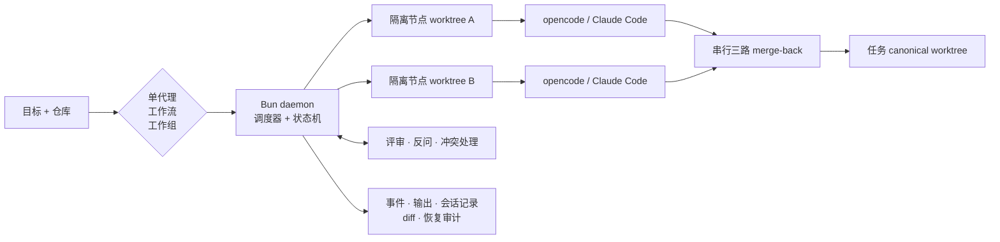

# Agent Workflow

[English](./README.md) | [**简体中文**](./README.zh-CN.md)

[](https://github.com/wangbinquan/agent-workflow/releases/latest)
[](https://github.com/wangbinquan/agent-workflow/actions/workflows/ci.yml)
[](./LICENSE)

**一个本地优先的编排平台，让 CLI 编码代理组成可靠、可检查的团队。**

Agent Workflow 把代理作为独立 CLI 进程启动，并在由 Git 支撑的运行中用 Git worktree
隔离其常规工作。一个确定性的 Bun daemon 统一管理协作、数据流、重试、人工决策与恢复。
代理可以保持聚焦的小上下文，用户则通过可视化控制面管理整个执行过程，而不是把所有工作
塞进一个不断膨胀的父会话。

平台的代表性模式是 **编码 → 审计 → 修复**：先由一个代理实现，再把 diff 扇出给多个
独立审计代理，聚合发现后交给修复代理。相同的基础能力也可用于文档流水线、测试生成、
定时维护、自适应工作组和一次性代理任务。

> **项目状态：** 持续开发中。最新发布的二进制版本是
> [v0.14.1](https://github.com/wangbinquan/agent-workflow/releases/tag/v0.14.1)
> （2026-07-15）；`main` 上的 RFC 索引当前已到
> [RFC-193](./design/plan.md)。本 README 描述的是 `main`，因此最新 tag 之后合入的
> 功能可能需要从源码构建。

## 选择代理协作方式

每次启动都会成为一个任务，并使用同一套执行底座：持久化历史、文件与 diff、恢复控制，
以及访问控制检查。

| 执行模型   | 适用场景                           | 行为                                                    |
| ---------- | ---------------------------------- | ------------------------------------------------------- |
| **单代理** | 聚焦的一次性工作                   | 直接让一个已配置代理针对一个或多个仓库执行任务。        |
| **工作流** | 可重复、可评审的自动化             | 执行带类型端口、wrapper 和人工门禁的版本化可视 DAG。    |
| **工作组** | 需要在运行时动态调整计划的复杂目标 | 让代理与人类通过轮次、派单、消息或 AI 生成的 DAG 协作。 |

定时任务可以按间隔，或按每日、每周、每月日历启动上述任一种执行模型。

## 执行原理



Git-backed 任务拥有一个 canonical worktree。由代理执行的 run 通常从该状态分支到临时
节点 worktree，因此相互独立的 DAG 分支可以并行写入，而不共享工作目录。只有成功且完成
settle 的增量才会在短暂加锁窗口中合回；失败尝试不会被自动合并。干净变更自动合并，真实
冲突交给内置 merge agent，仍无法解决时停泊给人工处理。这里提供的是 Git/worktree
隔离，不是操作系统沙箱：如果代理被明确提供了运行目录之外的绝对路径，它仍可在进程权限
允许的范围内访问该路径。

daemon 把任务和节点状态持久化到 SQLite。重启后，它会对账孤儿进程并支持继续中断任务；
可选的自动恢复由审计记录、次数窗口和熔断规则约束。

## 核心能力

### 可视化工作流

- 在 xyflow 编辑器中搭建版本化 DAG，支持拖放节点、校验、预览、自动保存、YAML
  导入/导出和多标签页同步。
- 使用 `string`、`markdown`、`signal`、`path<ext>` 与参数化
  `list<T>` 端口（例如 `list<path<md>>`）；prompt 模板显式消费上游值。
- 组合可嵌套 wrapper：
  - **git**：对内部范围做前后快照并输出完整 diff；
  - **loop**：在有界退出策略下重复执行内部范围；
  - **fan-out**：把 `list<T>` 分片送入任意内部图，并可通过聚合代理收敛结果。
- 加入 **review**、**clarify** 和 **cross-agent clarify** 门禁，而无需把人工协调逻辑
  写入代理 prompt。
- 根据 provenance 重跑过期下游：每个 node run 都记录它消费的上游 run，重试不会复用
  已过期输出。

### 自适应工作组

工作组是可复用的成员花名册，包含代理或人类成员、共享目标、房间和任务级历史。支持三种
执行模式：

| 模式               | 协作方式                                                                                                 |
| ------------------ | -------------------------------------------------------------------------------------------------------- |
| `leader_worker`    | leader 按轮规划与派单，在 barrier 等待成员交付后继续；可选 fan-out 允许同一成员代理并发运行多个实例。    |
| `free_collab`      | 成员共享任务板和房间，自主认领工作、交换产物并在无 leader 的情况下收敛。                                 |
| `dynamic_workflow` | 内置 orchestrator 从代理池中选择成员、生成受约束 DAG，等待人工批准或重新生成后，再交给确定性工作流引擎。 |

在 `leader_worker` 模式中，可见性开关分别控制共享输出、私信和黑板；
`free_collab` 会把三个通道都视为开启。自治模式可以关闭常规人工打断和完成门禁，同时保留
有界安全兜底。

### 代理、运行时与工具

- 代理可配置 system prompt、输入输出、权限、运行时/模型、依赖代理、技能、MCP server
  和插件。
- 使用内置 `opencode`、`claude-code` 协议，或注册遵循其中一种协议的自定义 CLI
  profile。运行时 profile 可配置二进制、模型、执行参数，以及 config 目录的环境变量名
  和目录名映射。
- 管理版本化、由框架托管的技能目录；可在 UI 中编辑文件，或从 ZIP 批量导入并显式处理
  冲突。
- 注册本地 stdio 或远程 HTTP/SSE MCP server，并配置远程 OAuth 与能力探测。
- 一次安装 npm、文件或 Git 来源的 opencode 插件，缓存在本地，后续 run 通过
  `file://` 引用注入，不必每次重新安装；插件自身在运行期仍可能访问网络。
- 对 opencode run 可检查实际加载的运行时 inventory，而不只是配置上计划注入的资源。

### 仓库与任务可靠性

- 从本地路径、缓存的 SSH/HTTPS Git URL 或多个仓库启动任务；远程导入支持批量 clone
  与递归 submodule。
- 使用自动生成的任务分支或现有工作分支，并可为每个任务设置 Git identity。
- 重试节点、恢复或重新启动任务、安全取消，并从任务 UI 诊断生命周期不变量错误。
- 可选择由框架执行 commit 与 push。daemon 生成 commit message，从不 force-push，
  并通过有界修复循环处理策略拒绝或 non-fast-forward。
- 为单代理、工作流或工作组配置定时启动；可禁用、立即运行并查看连续失败次数。

### 评审、反问与可观测性

- 评审单个 Markdown 文档或文档集合，添加选区锚定评论、采纳部分意见，并使用
  Approve / Iterate / Reject 驱动完整版本历史。
- 代理可以提出结构化单选或多选问题；统一反问队列支持指派、延后、重新回答，以及
  self/cross-agent clarify。
- 查看实时节点状态、完整 CLI 会话、工具调用、token 用量、输出、运行时 inventory、
  worktree 文件、统一 diff 和任务反馈。
- 分析 C++、Java、Python、Rust、Go、JavaScript、TypeScript 与 Scala 的结构化代码
  变化，包括符号树、依赖变化、影响分析、类图、正向调用链和时序图。内置 tree-sitter
  基线无需构建索引；可选 SCIP indexer 可补充更深的跨文件结果。

### 记忆、团队与访问控制

- 把 clarify 回答、review 决策和任务反馈蒸馏为可复用记忆，作用域可绑定到代理、工作流、
  仓库或整个安装实例。
- 在各作用域预算内注入已批准记忆，并检查每个蒸馏任务与来源事件。
- 从零配置单用户模式开始，再启用本地用户、OIDC SSO、Personal Access Token、角色、
  资源所有权、可见性与授权。
- 通过统一收件箱处理待评审、反问、工作组动作和记忆管理事项。

## 界面

发布二进制内置 SPA，支持中文与英文，以及浅色、深色和跟随系统主题。

**工作流编辑器** — 在可视画布上编排代理、wrapper、端口和人工门禁。


**任务 Diff** — 跟踪节点执行、查看 canonical worktree 并评审累计变更。


**Markdown 评审** — 对选区发表评论并驱动迭代生成。


**反问** — 在任务执行历史内回答结构化问题。


## 环境要求

| 依赖            | 要求                                       | 说明                                                                 |
| --------------- | ------------------------------------------ | -------------------------------------------------------------------- |
| **操作系统**    | Apple Silicon macOS，或 x86_64/arm64 Linux | 当前不支持 Windows。                                                 |
| **git**         | **2.38.0 或更高**                          | 隔离 merge-back 依赖 `git merge-tree --write-tree`。                 |
| **opencode**    | **1.14.0 或更高**                          | daemon 启动时硬性要求，无版本上限；可用 `opencodePath` 覆盖 `PATH`。 |
| **Claude Code** | **2.0.0 或更高**，可选                     | 额外运行时；可设置 `claudeCodePath` 或运行时 profile。               |
| **Bun**         | **1.3.0 或更高**，仅从源码构建时需要       | 发布二进制已内置 Bun。                                               |

启动 daemon 前建议运行 `agent-workflow doctor`，检查 opencode、Git、数据目录、
配置、token 文件权限、migration 和生命周期健康状态。

## 安装发布二进制

从 [GitHub Releases](https://github.com/wangbinquan/agent-workflow/releases/latest)
下载对应平台资产：

```bash
# macOS，Apple Silicon
curl -L https://github.com/wangbinquan/agent-workflow/releases/latest/download/agent-workflow-macos-arm64 -o agent-workflow

# Linux，x86_64
curl -L https://github.com/wangbinquan/agent-workflow/releases/latest/download/agent-workflow-linux-x86_64 -o agent-workflow

# Linux，arm64
curl -L https://github.com/wangbinquan/agent-workflow/releases/latest/download/agent-workflow-linux-arm64 -o agent-workflow

chmod +x agent-workflow
./agent-workflow doctor
```

每个 release 都是自包含可执行文件，包含 daemon、SPA、Bun runtime 和数据库 migration。

## 快速开始

```bash
./agent-workflow start

# daemon 会输出类似地址：
# http://127.0.0.1:51234/?token=...
```

在浏览器中打开输出的 URL。首次运行时，daemon 会创建权限为 `0600` 的
`~/.agent-workflow/token`；URL query 中的 token 用于认证内置单用户管理员。

建议按以下顺序完成第一次运行：

1. 打开 **Agents**，创建或导入一个代理，编写聚焦的 prompt，并声明它产生的端口。
2. 绑定所需的托管技能、MCP server、插件或依赖代理。
3. 直接运行该代理，或把它编入 **Workflows**，或加入 **Workgroup**。
4. 针对本地仓库或 Git URL 启动任务，然后查看实时状态、会话、输出、文件和 diff。

## CLI

```text
agent-workflow start [--port N] [--host H]   前台启动 daemon
agent-workflow stop                          停止运行中的 daemon
agent-workflow status                        输出 PID、地址与健康状态
agent-workflow doctor                        不启动 daemon，执行环境检查
agent-workflow config get [key]              输出全部配置或单个字段
agent-workflow config set <key> <value>      更新字段；value 会尝试按 JSON 解析
agent-workflow migrate                       应用待执行的数据库 migration
agent-workflow backup                        在 backups/ 下创建状态归档
agent-workflow version                       输出内置 CLI 版本字符串

agent-workflow user create --username <name> [--admin] [--password <pw>]
agent-workflow user reset-password --username <name> --new-password <pw>
agent-workflow user list
agent-workflow user disable --username <name>
agent-workflow user enable --username <name>
```

daemon 启动时也会自动执行数据库 migration。

## 配置与数据

Settings UI 是首选配置入口。全局配置位于
`~/.agent-workflow/config.json`；CLI 自动化可使用 `config get` 和
`config set`，运行时 profile 与产品资源存储在 SQLite 中。主要配置组包括默认运行时、
并发与重试上限、恢复策略、定时任务策略、Git/cache 行为、内部代理运行时、记忆预算、
渲染、网络绑定、外观和 OIDC。

daemon 默认绑定 `127.0.0.1`，并使用操作系统分配的端口。修改绑定地址应被视为部署
决策：暴露到网络前，请启用多用户认证，并将服务放在合适的可信代理之后。

所有本地状态都位于 `~/.agent-workflow/`。可设置 `AGENT_WORKFLOW_HOME`
切换目录。下面列出主要路径；daemon 还会按需创建临时 lock 和 runtime 条目。

```text
~/.agent-workflow/
├── db.sqlite          资源、任务、run、事件、用户和记忆
├── config.json        全局配置
├── token              单用户 daemon token
├── secret.key         加密 OIDC client secret 的密钥
├── skills/            托管技能内容与文件
├── plugins/           已安装插件缓存
├── repos/             远程 Git 仓库缓存
├── worktrees/         任务 canonical worktree
├── runs/              每个 run 的运行时配置与产物
├── snapshots/         执行与恢复使用的 Git snapshot
├── scratch/           临时上传与任务 staging
├── logs/              daemon 日志与归档事件
└── backups/           CLI 与 Settings 生成的备份
```

内置 backup 归档不包含 `secret.key`。请把它与数据库备份分开复制保存；丢失该密钥后，
已有加密 OIDC client secret 将无法读取。

## 文档

- [架构](./docs/architecture.md) — 进程模型与数据流
- [代理参考](./docs/agent.md) — agent frontmatter 与字段
- [技能参考](./docs/skill.md) — `SKILL.md` 与托管文件布局
- [工作流 YAML](./docs/workflow-yaml.md) — 导入/导出 schema
- [运行时配置分层](./docs/OPENCODE_CONFIG.md) — opencode 配置的注入与发现
- [故障排查](./docs/troubleshooting.md) — 启动与运行时问题
- [性能说明](./docs/performance-notes.md) — 调优与 benchmark
- [为什么需要 AI-native workflow](./docs/blog/01-ai-native-workflow-why.md)，以及
  [Agent Workflow 如何构建](./docs/blog/02-agent-workflow-how.md)

产品规格、技术设计、路线图与已发布功能历史位于 [`design/`](./design/)：

- [产品提案](./design/proposal.md)
- [技术设计](./design/design.md)
- [路线图与 RFC 索引](./design/plan.md)

每个实质性产品变更都在 `design/RFC-NNN-*/` 目录中包含 proposal、design 和
implementation plan。

## 从源码构建

```bash
git clone https://github.com/wangbinquan/agent-workflow.git
cd agent-workflow

bun install --frozen-lockfile

# 开发服务器
bun run dev

# 仓库门禁
bun run typecheck
bun run test
bun run --filter @agent-workflow/frontend test
bun run lint
bun run format:check

# 根目录 README 格式检查（仓库 format script 只覆盖 packages/）
bunx prettier --check README.md README.zh-CN.md

# Playwright 端到端测试（需安装浏览器依赖）
bun run e2e:install
bun run e2e

# 在 dist/ 下生成自包含二进制
bun run build:binary
```

CI 在 macOS 与 Linux 上执行格式、lint、类型检查、backend/shared 测试、frontend
测试、单二进制 smoke 和分片 Playwright。Nightly 任务额外覆盖真实 opencode 兼容性、
WebKit、视觉回归，以及真实 SSH/HTTPS Git 协议。

Git tag 与 GitHub Release 是发布版本的事实源。workspace `package.json` 版本和当前
CLI `version` 字符串仍是 `0.0.0` 占位值。

## 许可证

项目使用 [Apache License, Version 2.0](./LICENSE)。

Copyright 2026 WangBinquan.
