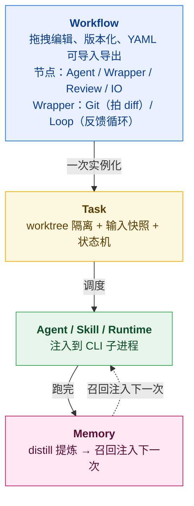
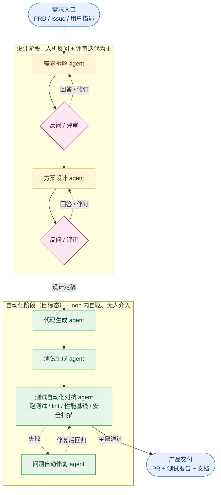
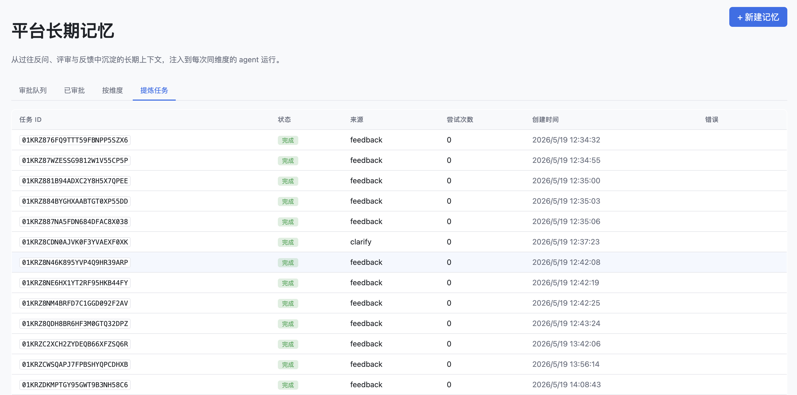
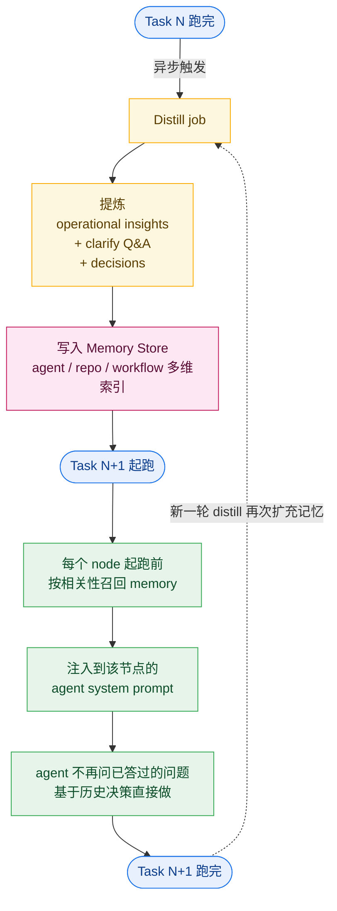

# Agent Workflow：AI Native 交付工作流的框架落地实践

## ——架构、能力与团队飞轮

> 这是 **AI Native 交付工作流** 系列的下篇。[上篇](./01-ai-native-workflow-why.md) 解释了为什么"AI 推给每个人"在几百人团队会失败，以及"AI Native 工作流"的三层定义（最小闭环 / 端到端 pipeline / 长期记忆飞轮）。下篇我们讲我们正在做的 Agent Workflow 平台如何把这一切落到地上。


*图 1：首图 / 封面（SVG 占位版）—— 四层架构纵向堆叠：Workflow（拖拽编辑）→ Task（worktree 隔离）→ Agent/Skill/Runtime（注入到 CLI 子进程）→ Memory（distill 提炼 + 召回注入下一次）。右侧粉色虚线箭头是飞轮回路：Memory 把上一次任务沉淀的反问 Q&A / 决策 / 经验，按相关性召回注入下一次任务的 Agent 层。和上篇封面（工作流横轴）形成"横轴 × 纵轴"的对照。可替换为 AI 生图产出的高清版。*

---

## 引子

过去 **8 天**（2026-05-13 → 2026-05-20），我和 AI （全程Opus 4.7）一起 vibe code 写出了这个开源项目——**Agent Workflow**

**仓库地址： <https://github.com/wangbinquan/agent-workflow>**

目标只有一个：

> 把上篇讲的 AI Native 交付工作流三层定义（闭环 / pipeline / 飞轮），变成一个真的能下载、能跑、能让团队拿去用的产品。

先把过程打开（数据均来自仓内 git log 与 `wc -l`）：

- **8 天 / 422 个 commit**——日均 ~50 个，最高峰一天 100 个，单人作者；
- **~17 万行代码**——backend 7.9 万 / frontend 7.6 万 / shared 1.4 万（统计 ts、tsx、css，未含依赖与产物）；
- **552 个测试文件**——把仓内 `CLAUDE.md` 强制要求的"每次改动随测试落地"的纪律落到了实处；
- **50 篇 RFC**——三件套（`proposal.md` + `design.md` + `plan.md`）齐全，所有 v1 范围外的变更都先 RFC 后实现。

这不是"独立完成"的传统含义——它是**一个工程师 + AI 协作**的产出。架构选型、产品取舍、关键节点的对错全部我自己来判断；样板代码、测试覆盖、文档同步、跨文件重构交给 AI；每个 RFC 都是和 AI 一来一回反复对齐意图后再让它落地的，最后我 review、调整、守质量结果。

如果换成两年前的范式，这套规模的项目要按**月**计。这次用 8 天时间从零快速迭代了这个系统，前提只是：**你要把架构想清楚、把 RFC 写清楚、把测试纪律守住**——剩下的，AI 替你完成。

> **在 AI 时代，从灵感到实现之间的距离，只剩"行动"这一步。**

下面把这套产品一层一层拆开讲。它今天的形态是：一个**本地 daemon + 浏览器 UI**，驱动多个 CLI 子进程作为协作 agent。但它的架构从第一行代码起就是为**云端多人协作 + 事件驱动**的目标形态准备的。

---

## 一、能力八件套

Agent Workflow 的核心抽象有八个，对应八个一级模块：

| 模块 | 角色 |
| --- | --- |
| **Agent** | 一段被工作流调用的执行能力。frontmatter + system prompt 描述一个 agent |
| **Skill** | agent 可调用的可复用技能包 |
| **Runtime** | 本机的 AI CLI 可执行环境，当前只支持Opencode；为未来多 runtime 预留 |
| **Workflow** | 可视化拖拽编排的有向图；节点 = agent，边 = 数据流；可嵌套 wrapper |
| **Task** | workflow 的一次执行实例；绑定一个 worktree 和一组启动输入 |
| **Wrapper** | 容器型节点；git wrapper 输出 diff，loop wrapper 反馈循环 |
| **Memory** | 长期记忆资产；按 agent / 仓 / workflow 维度，自动 distill、按需召回 |
| **Review** | 人作为工作流一等公民的节点；workflow 在这里暂停等人 approve / 打回 |

这八件套不是平铺的清单，而是有清晰的分层关系：



下面挑几个**对 AI Native 工作流来说是关键差异**的能力详细说。

---

## 二、参考项目：Vibe Kanban 与 Multica

在我们走到"多 agent 工作流编排"这一步之前，业界已经有两个非常优秀的开源项目做了重要的铺路工作——**Vibe Kanban**（BloopAI）和 **Multica**（multica-ai）。我站在它们的成果之上往前走，所以在讲我做了什么之前，先把它们解决了什么、又把什么留给我继续解决讲清楚。

### Vibe Kanban：把 "卡片 → agent执行" 流程化

[Vibe Kanban](https://github.com/BloopAI/vibe-kanban) 用 Kanban 管理 coding agent 的执行。核心交互：拖一张卡到 *In Progress* → 系统自动开 **git worktree + 独立分支 + 终端 + dev server**、起 agent，把卡片描述作为 prompt 喂给 agent → 卡片落到 *Review*，人看 diff、留 inline 评论，评论再回流给 agent 跑下一轮 → 从 UI 内直接发起 PR + 合并。它原生支持十多种 coding CLI（Claude Code、Codex、Gemini CLI、GitHub Copilot CLI、Amp、Cursor、OpenCode、Droid、CCR、Qwen Code 等），内置浏览器预览（含 DevTools / 设备模拟 / inspect mode），部署形态从本地 npx、Docker 自部署、到 Cloud + tunnel 模式都覆盖。

> 项目方已宣布 [Vibe Kanban sunset](https://www.vibekanban.com/blog/shutdown)，继续作为社区开源维护。我们在这里把它作为"前序工作"致敬。

它解决了这些痛点：

- **多 CLI 厂商接入差异**——一套 executors 抽象把 10+ 种 coding agent CLI 统一封装；
- **单次 agent 跑动流程化**——worktree 隔离 + 分支 + dev server + 浏览器预览一步起跑，告别复制粘贴 prompt；
- **Diff review 闭环**——人 review 后的 inline 评论作为反馈直接喂回 agent 跑下一轮；
- **PR 全链路**——从看板内一键开 PR、AI 生成描述、GitHub review、merge。

**和我们实际痛点的差距**：

- **多 agent 自动协同**——"Code → Audit → Fix"这种 pipeline 在 vibe-kanban 里要人手把上一卡的产出粘贴成下一卡的描述，多 agent 之间没有内生衔接，团队规模化使用时这一步就成了人肉中转站；
- **并发 fan-out**——30 个变更文件需要 30 个 audit agent 并发审计时，vibe-kanban 只能起一张卡、串行跑；大 PR 一来要么排队、要么塞给一个 agent 一次吞下。**我们反复观察到的真实失败模式**：当一个 session 一次性看到几百条问题（几百行 diff / 几百条 finding / 几百个待修复点），模型会直接"躺平"——只挑最显眼的几条认真处理，后面的全部省略，最后给一句"剩余问题类似处理"草草收尾。**fan-out 在我们这里不是性能优化，是质量保证**：把任务切片到独立 session（每片只看自己那一份），是目前绕开这个失败模式最可靠的手段（实现细节和仍待摸索的部分见 §八）；
- **自动审-改 loop**——审计 finding 出来后想自动让 fix agent 修、再审、再修，需要人手反复拖卡；"AI 自己跑到收敛"这件事落不下来；
- **跨任务记忆沉淀**——评论作为反馈传回 agent 是单次的，下一张卡起跑时 agent 不知道上一张卡里人 review 过什么、做过什么决策；优秀实践依然锁在某次 review 评论里、被新任务一次次重新发明。

> **共享的工程底座**：vibe-kanban 也用 git worktree 做 agent 执行隔离、也做多 CLI 厂商抽象——这两点上我们的工程选择和它一致，可以理解为我们在它已经验证过的底座上往上加"多 agent 工作流"和"记忆飞轮"这两层。

### Multica：把"Agent 当队友"放进项目看板

[Multica](https://github.com/multica-ai/multica) 走得更远——它把 agent 升格为"一级队友"：分配 Issue 给 agent 就像分配给同事，agent 有个人档案、在看板上有位置、能在 Issue 下评论、报 blocker、更新状态。它带着团队协作视角设计：多 workspace、SSO 鉴权、多人角色、Skills 库作为团队可复用资产、daemon 自动发现本机所有 coding CLI、云端 + 自部署两种形态。

它解决了这些痛点：

- **AI 工具的单人使用升级为 AI 队友的团队协作**——人和 AI 同一个看板上工作；
- **Skills 库作为团队级可复用资产**沉淀解决方案；
- **完整的任务生命周期管理**（enqueue / claim / start / complete / fail）+ WS 实时进度；
- **多 CLI 厂商中立、可自部署**、企业治理友好（workspace 隔离 + SSO + 角色）。

**和我们实际痛点的差距**：

- **多 agent 工作流编排** vs 任务分配——Multica 的"一 Issue 派一个 agent"是单线程任务分配范式，没有"多 agent 通过 port 协同的有向图"这种一等抽象；端到端的"需求→设计→编码→审计→修复→文档" pipeline 在 Multica 里要靠多个 Issue 串接 + 人工分派，缺一份可视化、可版本化、可复用的 workflow 定义；
- **自动 distill 出的记忆** vs 人工写的 Skill——Skills 是需要团队主动把经验写成 Skill 包放进库里的人工资产；我们要的是从历史任务的 events / 反问 Q&A / 决策中**自动 distill** 出记忆，下次类似任务起跑时按相关性自动召回——这是飞轮转起来的前提；
- **多轮自动审改 / 并发审计内生**——Multica 没有 fan-out / loop wrapper 这类把"30 个 audit agent 并发 + 自动 audit→fix 到收敛"作为内生原语的能力，要靠人手分多个 Issue 拼出来；
- **反问 Q&A 作为一类一等资产**——反问的答案散落在 Issue 评论里，没有结构化的"反问 Q&A"被提炼和注入；[上篇](./01-ai-native-workflow-why.md) 讲的"反问是被严重低估的金矿"这条主线，在 Multica 里仍以非结构化形态存在。

### 目标态系统构想

把我们想要建成的目标态、与两位参照系并列摆出来，构想就清楚了——下表 Agent Workflow 列描述的是**目标态**：

| 维度 | Vibe Kanban | Multica | Agent Workflow（目标态） |
| --- | --- | --- | --- |
| 抽象单位 | 一张卡 / 一次 agent run | 一个 Issue / 一个 agent 队友 | 一份 workflow / 多 agent 有向图 |
| 多 agent 协同 | 无（人手拖卡串联） | 无（人手分派下一步） | **内生**（port + edge + wrapper） |
| 自动审-改循环 | 无 | 无 | **Loop wrapper 内生** |
| 并发 fan-out | 无 | 无 | **Multi-process 节点内生（抗"模型躺平"）** |
| 团队记忆来源 | — | 人工写 Skill 包 | **自动 distill events + 反问 Q&A** |
| 反问知识沉淀 | — | 散落在 Issue 评论 | **clarify Q&A 一类一等资产** |
| 部署形态 | 本地 / Docker / Cloud / tunnel | 本地 daemon + Cloud / 自部署 | **云沙箱 + 多人协作** |
| 触发方式 | 人手拖卡 | 人手分派 Issue | **MR / issue / cron / webhook 事件触发** |

简化讲：

> **Vibe Kanban 让"用 AI 跑一次"流程化；Multica 让"AI 加入团队"协作化；Agent Workflow 让"多个 AI + 关键人在一张工作流上协同"工程化，并让团队的反问、决策、经验作为飞轮资产自动复用。**

这不是在说我们比它们好——它们在各自的抽象层级上做得很扎实，所以我们才能直接站在"agent 已经能被托管为队友、kanban 已经能跑 agent run"这个前提之上，去解决"多 agent 工程化协同 + 团队记忆飞轮"这一层。

---

## 三、Workflow 编辑器：把"协作"画出来

Agent Workflow 的编辑器是一张**可视化拖拽画布**：左侧栏拖拽节点、画布上连线、右侧抽屉编辑节点配置。看起来跟很多 LLM 编排工具类似——其中 **Loop Wrapper** 这个一等公民让"AI 多轮自动审改"成为内生能力，下面单独讲；另外两类我们已经实现、但**使用模式仍在摸索**的原语（Git Wrapper / Multi-process 节点）放在 §八 单独讲，避免与已经定型的能力混在一起。

### 一条端到端的交付工作流长什么样

以"需求 → PR 交付"为例，一条 AI Native 交付工作流通常分**两个阶段**，对人和 AI 的参与节奏差别很大：

- **设计阶段**：以**人机反问 + 评审迭代**为主——人参与节奏密、决策密度高；agent 反问关键约束、人回答、agent 出方案、人评审，迭代到设计定稿才离开；
- **自动化阶段（目标态）**：**理想态**是**代码生成 / 测试生成 / 测试自动化对抗 / 问题自动修复**全部在 loop 内自驱、人不进入、跑到收敛才出来交付。**v1 现实**是这条链路上每一步都还需要人审核兜底——代码生成完人要 review、测试覆盖人要补判、修复方案人要拍板对错；loop 内自驱在大体量任务上还做不到稳定收敛。下面这张图画的是目标态的形状，不是 v1 已经做到的能力。



两阶段的**连接点**是这张图的关键设计：**设计阶段沉淀下来的结构化产物**（拆解后的需求、设计决策、反问 Q&A）作为端口数据直接喂给自动化阶段的代码生成 agent；这些反问 Q&A 在被使用的同时也写进 **记忆飞轮**，**下一次类似需求起跑时自动召回——agent 不会再问已经被答过的问题**。这就是上篇"反问金矿"在产品里的真实落点。

> **📌 备注：自动化阶段"无人介入"只是理想态，当前看还很远**
>
> 上图绿色 subgraph 里没画 Human Review 卡口——那是我们瞄准的形状。**v1 现实里，每一个绿色节点之后实际上还都要补一个 Human Review 卡口**：代码生成完人 review、测试生成完人补判、自动化对抗失败人定性、修复方案人拍板。
>
> 把目标态明确画出来不是为了假装已经做到——是要把"自动化阶段往哪走"作为一个可量化的产品目标：**这条链路上每减少一处人卡口，就是一次产品进步**。让 agent 自驱到收敛、让人只在设计阶段密集介入，这是我们和早期使用者要一起打磨的方向。

下面看具体的"loop 内自驱"是怎么实现的——它是 Loop Wrapper 这个一等公民的能力，目标态画的就是它跑到极致的样子。

### Loop Wrapper：让"审-改"成为内生循环

Loop wrapper 包裹一个子图，让它反复执行直到退出条件满足。内置三种退出条件：

- `port_empty`：内层某节点的某端口为空（"审计无 finding 就退出"）；
- `port_equals`：某端口等于指定字符串；
- `port_count_lt`：按分隔符切分后条数 < N（"审计 finding 少于 N 条就退出"）。

最经典的用法就是把 Audit → Fix 包在一个 loop 里，`max_iterations = 5`，退出条件 = `port_count_lt(audit_findings, 3, "\n")`——意思是 AI 自己审、自己改，直到 audit 觉得 ok 了或者迭代了 5 轮，才出来让人介入。

> **⚙️ 备注· 跨轮状态全部走 worktree**
> Loop 的 body 每轮独立——跨轮状态全部通过 worktree 文件传递，框架不提供"上一轮 port → 这一轮 port"的隐式通道。这是个刻意的设计取舍：worktree 文件本身就是天然的、可观察的状态载体；如果再叠一层 hidden port，调试就成噩梦。


---

## 四、工程底座：进程隔离与并发安全

很多 AI 编排工具在演示里看起来很顺，一上规模就出问题——多 agent 同时跑的时候，文件冲突、配置打架、worktree 互相覆盖。Agent Workflow 在这块做了一些设计：

### 每个 task 一个 git worktree

启动一个 task 时，框架自动 `git worktree add ~/.agent-workflow/worktrees/{repo-slug}/{task-id}`，给这个 task 开一个独立的工作目录、独立的 branch（`agent-workflow/{task-id}`）。

这意味着：

- 同一个仓允许同时跑 N 个 task，互不干扰；
- 每个 task 的所有子进程都在自己的 worktree 里工作，git diff 是该 task 自己的；
- task 跑完 worktree 默认保留，方便人 review 产物；可以手动删，也可以配置 GC 策略自动清理（"超过 N 天" 或 "已合并主分支"）。

### 进程级配置隔离

每个 AI CLI 子进程启动时，框架注入两个环境变量：

- `OPENCODE_CONFIG_DIR=~/.agent-workflow/runs/{task-id}/{node-run-id}/.opencode/`
  ——每个子进程独立的配置目录，平台管理的 skill 会拷贝/链接到这里；
- `OPENCODE_CONFIG_CONTENT={"agent": {<name>: {...}}}`
  ——本次执行的 agent 定义以 inline JSON 注入。CLI 的 config merge 顺序保证 inline JSON 在所有目录扫描完成后**最后**合并，所以平台 agent 的定义恒胜过仓内 / 全局的同名 agent。

> **⚙️ 备注 · 为什么不禁用任何目录扫描**
> 我们刻意**不**关闭任何 CLI 自身的 skill / agent 加载路径。仓内 `.opencode/skills/` 的业务 skill、`~/.claude/skills`、全局 `~/.opencode/`（含 auth 凭据）都正常加载——agent 在执行时可以使用仓内既有 skill；平台 agent 只是借助 inline JSON 的最高优先级"压在最上面"而已。这个设计让平台和现有 AI CLI 生态完全兼容，不要求团队抛弃既有 skill 资产。

### Read-only 节点并发 / 写入节点串行

每个 agent 在 frontmatter 里声明 `readonly: true / false`：

- **readonly: true** 的 agent（如 audit / analyze）不会写仓里的文件，框架允许它们之间**并发**执行；
- **readonly: false** 的 agent（如 code / fix）会写文件，框架强制**全局串行**——同一 task 内任一时刻最多 1 个写入节点在跑。

这是一个简单而关键的设计——它让我们在不引入分布式锁、不引入复杂依赖图的前提下，安全地支持了"多 agent 并行审计 + 串行修复"这种最常见的工作流形态。

> **⚙️ 备注 · readonly 不可被节点级覆盖**
> `readonly` 强制从 agent.md 继承，节点上不可手动改成 `false` 或 `true`——避免节点配置谎报导致并发写入冲突。如果同一个 agent 有时只读、有时要写，建议拆成两个 agent，而不是依赖节点级开关。

---

## 五、Output XML Envelope：让 agent 之间有"接口契约"

agent 与 agent 之间的数据传递不能依赖 LLM 自己描述"我做了什么"——这种描述既不结构化也不稳定。我们让每个 agent 在 stdout 末尾输出一段标准化的 XML 信封：

```xml
<workflow-output>
  <port name="audit_findings">
    file: auth.go
    line 42: SQL injection
    ...
  </port>
  <port name="summary">Found 2 high, 1 low severity issues.</port>
</workflow-output>
```

机制：

- agent 在 frontmatter 里声明 `outputs: [audit_findings, summary]`；
- 框架在每次执行时**自动**在 user prompt 末尾追加一段英文协议块，告知 agent 必须以这种格式收尾（用户和 agent 编写者都不需要手动写这段，框架 inject）；
- agent stdout 中**最后一段**完整的 `<workflow-output>` 被采用为有效输出（允许 agent 在思考过程中输出多次草稿）；
- 框架解析后按 port name 把内容拆给下游节点。

这一层信封是 Agent Workflow 让 agent 之间真正"协议化"的关键。

> **没有这一层，agent 之间的数据传递就只能依赖一个更上层 LLM 把每个 agent 的自然语言输出读一遍——这又退回到我们最初想避免的"上层 LLM 调度"陷阱。**

XML envelope 的核心价值是：**它把不可控的 LLM 自然语言输出，绑定到一个可控的、结构化的、确定性的接口契约上**。整个工作流引擎从此可以是确定性的，只有节点内部是非确定性的——这是这套架构重要的切分。

---

## 六、Human Review：人是工作流的一等公民

很多 AI 编排工具把"人审"做成"workflow 失败时弹一个浏览器通知"。我们的做法不一样：

> **Human Review 节点本身就是工作流上的一个标准节点。**

它和 agent 节点的区别只有一个：执行的不是 CLI 进程，而是**等人**。具体行为：

- 工作流跑到这个节点时，**整条 task 暂停**，状态变成 `awaiting_review`；
- UI 上对应节点高亮，桌面通知 推送到其他打开的浏览器 tab，任何被授权的人都可以接手；
- 人在 review 节点里写评论、approve / reject；approve 之后工作流继续往下走；reject 之后工作流可以回退到指定节点重跑（带上 reject 的理由作为新的 user prompt 补充）；
- 评论、approve 历史、reject 理由、回退到哪个节点——这些全部被结构化记录，进入 Memory distill 的输入。

这个设计的深层含义是：

> **人不是工作流之外的"管理员"，而是工作流之内的"节点"。**

工作流编辑器在画布上看到的就是 "agent 节点 → review 节点 → agent 节点"——人是被工作流主动召唤过来的，而不是工作流跑出错让人去救场的。

这件事的实际效果：人审不再是"任务的延迟成本"，而是"任务的内置质量门禁"。


---

## 七、记忆飞轮：反问、沉淀、注入的工程实现

这是 Agent Workflow 和大部分 AI 编排工具最不同的能力。上篇我们说过反问的金矿价值；下面讲它的工程实现。

### 反问的捕获：Live Capture

AI CLI 自己可以起 subagent，比如一个 code agent 内部可能调用一个 clarify subagent 去问开发者问题。在传统 IDE 形态下，这个对话只活在 session 里，关掉就没了。

我们在 Agent Workflow 里做的事是：**所有子进程的事件流（包括 subagent 反问、用户回答）都被实时捕获到结构化事件存储**。

每个节点详情页有一个 Events tab，按 kind 过滤（text / tool / reasoning / clarify_question / clarify_answer / step / error），可以完整重现这次任务中所有的对话。


> **⚙️ 工程注脚 · 流式事件订阅**
> 我们订阅 CLI 的 `--format json` 流式事件，前端用 200ms throttle 渲染避免 WS 风暴；同一节点的所有 subagent 反问/回答按时间序聚合显示。事件流落地到 SQLite 的 `node_run_events` 表，长期归档策略可在 settings 配置。

### 沉淀：Distill Job

每个 task 跑完之后，框架自动触发一个**异步 distill job**。它本身也是一个 AI CLI 子进程，跑一个专门的 `distiller` agent。这个 agent 的任务是：

- **输入**：本次任务的所有 events + outputs + 最终 diff；
- **输出**：三类结构化资产：
  - **operational insights**（这次跑出来的经验、可以避免的坑）；
  - **clarify Q&A**（agent 反问 + 人的回答，分类归档）；
  - **decisions**（关键节点上人做了什么决定、为什么）。

这些资产被写入 memory store，按 agent / 仓 / workflow 多维索引。



> **⚙️ 工程注脚 · Distill 不是黑箱**
> Distill job 本身是一个普通的 Agent Workflow 任务，跑在主任务的产物之上。它的 distiller agent 也是一份普通 agent.md，团队可以自己调整提炼策略——比如让它特别关注"性能相关的 Q&A"或"安全相关的决策"。把记忆提炼的 prompt 暴露给团队修订，本身就是产品的一部分。

### 注入：Node Session Injected Memory

下一次起跑某个 task 时，框架在每个 node 启动前**按相关性召回**对应的 memory 条目，作为 system prompt 的补充上下文注入到该 agent 的子进程。

> **⚙️ 工程注脚 · 召回与人工修订**
> 召回维度是组合的：当前 agent name + 当前仓 ID + 当前 workflow ID 都可以单独或组合查询。memory 条目有版本，人可以在 Memory 页手动修订——这点对治理至关重要，因为有些 distill 出来的"经验"可能是错的、过时的，或者粒度不对，需要人介入纠正。同时支持把 memory 条目标记为"团队级 / 仓级 / 个人级"做权限分层。

### 飞轮的完整闭环

把上面三步串起来：



跑得越多，平台越聪明；平台越聪明，每个新任务的起点越高。

这就是上篇说的飞轮——它在 Agent Workflow 里是有具体代码、可以被打开看的，不是 buzzword。


*图 5：反问 / 记忆场景截图 —— Memory 面板里看到的就是 distill job 自动从历史 task 提炼出的 clarify Q&A 候选条目；人审批一次进入"已审批"后，下次同维度（agent / 仓 / workflow）任务起跑时由框架按相关性自动注入到 agent system prompt 的 `## Learned context` 块。*

---

## 八、还在探索中的功能：Git Wrapper 与 Multi-process 节点

前面六节讲的能力（八件套 / 编辑器 / 工程底座 / XML envelope / Human Review / 记忆飞轮）是我们目前比较有把握的部分。下面这两类**功能节点**——Git Wrapper 和 Multi-process 节点——底层机制已经实现、能跑通最经典的 Code→Audit→Fix 例子；但**在真实工作流里如何组合使用、什么粒度最划算，我仍在摸索**。这一节记录它们的当前状态：能力先规划在这，使用模式不下结论。

### Git Wrapper：把"代码状态变化"作为一等数据

一个 git wrapper 包裹住若干内层节点。它做一件事：

- 进入第一个内层节点前，框架拍快照（commit-id + 工作区状态）；
- 最后一个内层节点 done 后，再拍一次；
- wrapper 暴露的输出端口 `git_diff` 内容 = 两个快照之间的 diff（含未提交变更 + untracked 文件转 `+file` 形式）。

这意味着工作流里的下一个 agent **不需要自己去 `git status` / `git diff`**——它只要把上游 wrapper 的 `git_diff` 端口接到自己的输入上，就拿到了完整的代码变化。

这背后是一个简单的想法：

> **git diff 是我们这个领域天然的"数据交换格式"。**

Code agent 写代码，Audit agent 不需要知道"code agent 在哪个文件加了什么"，它只需要看 diff——这就让两个 agent 完全解耦。

**仍待摸索的部分**：在真实工作流里 `git_diff` 端口接到哪种下游 agent 上效果最好？是直接整段塞、按文件切、还是再过一层结构化解析（按 hunk / 按 symbol）？不同语言、不同变更体量、不同审计/修复任务可能各有最优解，我们没有 silver bullet——只把"把代码变化打包成端口数据"这件事做完了，剩下交给具体工作流的设计者。

### Multi-process 节点：按上游 port 切片起多个子进程

一个普通节点起 1 个子进程；一个 **multi-process 节点** 根据上游某个 port（通常是 `git_diff`）按内置策略切片，起 N 个子进程并发执行：

- `per-file`：每个变更文件 1 个进程；
- `per-N-files`：每 N 个文件 1 个进程（N 可调）；
- `per-directory`：同一顶级目录的变更 1 个进程。

每个分片是一个独立的子进程，独立的 system prompt + 独立的 git diff 切片。结束后框架按分片字典序聚合到下游端口。

> **⚙️ 工程注脚 · 分片边界**
> 重命名作为 1 个 shard，不拆 delete + add；二进制文件跳过分片，作为"包含 N 个二进制文件"提示跟随其他 shard 输出；空 diff 节点直接 done，下游正常联动。失败 shard 的错误自动汇入父节点的 `errors` port，下游可以选择对接它去做修复。子进程并发上限**独立于**全局并发上限，避免单个 fan-out 把全局名额吃尽。

这个能力直接对应上篇讲的 **Code→Audit→Fix 闭环** 里的"Audit ×N"。我们不再依赖一个 audit agent 把 1000 行 diff 一次性吞下——而是让 30 个 audit agent 并发，每个看自己那部分。**fan-out 核心目标是模型准确度提升**：它是上篇文章提到的"模型在大体量任务上躺平"那个失败模式的对策。

**仍待摸索的部分**：切到什么粒度才划算？切得太细每个进程上下文太少、可能漏掉跨文件的问题；切得太粗又退化回单 session 失败模式。`per-file` / `per-N-files` / `per-directory` 哪个策略合适，取决于任务类型（审计 vs 修复 vs 文档生成）和代码组织方式。原语我们提供了，配方还在摸索——希望和早期使用者一起把这套用法想清楚。

---

## 九、云端目标形态

Agent Workflow 的目标产品形态是一个 **云端部署、多人协作、被事件驱动** 的 AI Native 交付平台。我们直接描述它的目标态。

### 1. 每个 task 跑在云端独立沙箱

每一次 task 触发，平台在云端拉起一个隔离容器：

- 该 task 的 git worktree 在容器内（不依赖任何工程师的本地文件系统）；
- 该 task 的所有 agent 子进程跑在该容器里，子进程之间通过进程隔离 + 独立配置目录互不干扰；
- task 结束容器即销毁；所有结构化产物（events / outputs / memory / 最终 diff）落库到平台 DB；
- 大规模并发执行天然成立——一次 release 触发 50 个 MR 的并行审计。

### 2. 团队级工程记忆，全员共享资产

- agents / skills / workflows / memory 全部存于团队级 DB，每一位成员看到的都是同一份；
- 团队 SSO 鉴权，按角色控制谁能编辑 workflow、谁能在 review 节点 approve；
- WS 实时多端协同，多人同时编辑同一份 workflow 不互相覆盖；
- Workflow YAML 导入导出，团队之间可以共享、沉淀模板库；
- Memory 条目按"团队级 / 仓级 / 个人级"三级权限分层管理。

### 3. 工作流被事件驱动，AI 真正进入交付链路

Workflow 不再依赖"人手动启动"。平台对接代码协作平台的真实事件：

- `MR opened` → 触发 Code Review workflow（审计结论自动评论到 MR）；
- `issue commented with /implement` → 触发 Code → Audit → Fix 闭环 workflow；
- `release tag pushed` → 触发文档生成 workflow；
- `cron schedule` → 触发夜间技术债扫描 workflow；
- `webhook` → 对接团队自有系统（需求平台、运维平台、安全扫描结果等）。

**这一步是 AI 从"工具"升级为"协作参与者"的关键节点**：AI 不再等待某个工程师召唤，而是和 CI/CD 一样被代码生命周期事件直接驱动。

### 4. 企业治理就绪

- 模型 token 集中托管，平台层做配额、限速、出域控制；
- 全量审计日志：哪个 task 用了哪个 agent、跑了什么 prompt、产出了什么、人在哪些节点做了什么决定——全部可追溯；
- 数据出域策略可配置：哪些代码不能进入模型、哪些 skill 不能在外部模型上跑、哪些 task 必须用本地模型；
- 凭证轮换、密钥托管走标准企业安全设施，AI 不再是企业安全的盲区。

### 5. 工作流定义是一份"产品级资产"

无论是一位工程师在云端起跑一次 task、整个团队共享一份 workflow 模板、还是 CI 系统由 PR 事件触发同一份 workflow——**workflow 定义本身是同一份资产**（节点、边、wrapper、agent 引用、port 路由完全统一）。

团队沉淀的工作流和记忆，跨场景、跨触发方式、跨使用者地直接复用——这是 AI Native 交付平台最值钱的一根钉子。

### 6. 支撑云端形态成立的关键架构选择

- **进程隔离** —— 每个 task 一个独立的执行环境，多 task 互不干扰；
- **Worktree per task** —— 每个 task 一个独立的代码工作区，并发安全；
- **Deterministic engine** —— agent 之间通过结构化 port 通信，不依赖共享状态、不依赖上层 LLM 调度；
- **结构化产物落库** —— events / outputs / memory 全部体系化管理，不依赖本地文件系统语义。

---

## 十、当前状态与召集

Agent Workflow 目前正处于 v1 实施阶段，RFC 工作流已经积累了 50+ 个改进提案（每个都是 proposal + design + plan 三件套，公开在仓里），覆盖了从画布连边到长期记忆的全部能力线。

它今天**已经能让你在本地跑通**：

- ✅ Code → Audit → Fix 闭环；
- ✅ Git wrapper + Loop wrapper 任意嵌套；
- ✅ Multi-process 并发节点（per-file / per-N-files / per-directory）；
- ✅ Human Review 节点 + 多 tab WS 协同；
- ✅ 长期记忆 distill / 召回 / 手工修订 / 自动注入；
- ✅ Workflow YAML 导入导出，团队间可共享；
- ✅ 任务详情四 tab（Prompt / Events / Output / Stats）+ 实时事件流；
- ✅ 失败处理 + retry / resume / single-node 重跑 + worktree 自动回滚到节点 start 前快照；
- ✅ 资源限额（per-task 耗时 / per-task token / per-node 耗时）。

它还有很多没做完——多人团队部署、云端沙箱执行、事件触发器、企业治理这些云端目标态的关键能力，都还在路上。

如果你是工程负责人，正在被上篇描述的那些问题困扰，我们邀请你：

- **试用**：`git clone https://github.com/wangbinquan/agent-workflow && cd agent-workflow && bun install && bun test`，然后跑一下内置的 Code→Audit→Fix demo workflow；
- **共建**：仓里的 RFC 工作流是开放的，所有产品/技术变更都先 RFC 后实现——把你团队的 use case 写成 RFC，我们一起讨论；
- **反馈**：如果你的团队是 100+ 人规模，特别欢迎你来讨论云端目标态的落地需求——我们希望产品方向和真实团队的痛点对齐。

我们相信 AI Native 交付工作流是一个被低估的方向。它不轻、不快、不性感，没有"装上就出活"的演示效果。但它是 AI 在几百人团队真正发挥价值的唯一可持续路径。

> **从"流程驱动人把 AI 当工具"，到"工作流驱动 AI 和人协作"——这条路我们刚走了一小段，欢迎你和我们一起走完它。**

---

> 系列文章：
> - [上篇：让工作流驱动 AI 和人 —— 为什么 AI 推广在几百人团队会失败](./01-ai-native-workflow-why.md)
> - [下篇：Agent Workflow —— 把 AI Native 交付工作流真的落到地上](./02-agent-workflow-how.md) ← 你正在读
