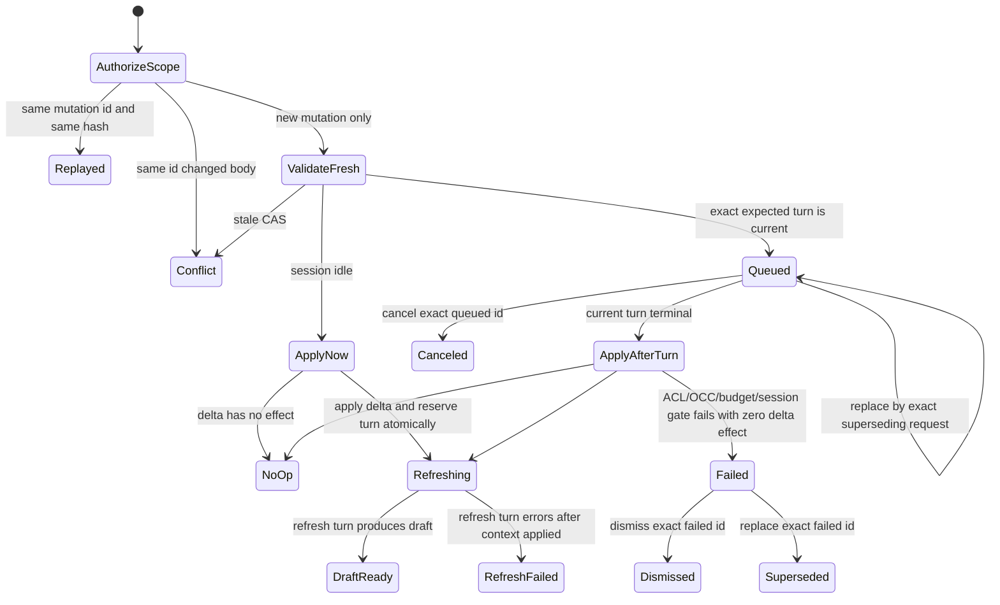

# RFC-293 技术设计：Intent Workbench 与 Working Context

> 2026-08-12 修订：已吸收第一轮 Codex source-backed 设计门的 12 个 P1 与 1 个 P2；
> 复审通过与用户批准前，本文件仍是 Draft contract，不授权生产实现。

## 0. 设计原则与术语

### 0.1 术语

- **applied working set**：`intent_sessions.context_manifest_json` 中 `root=true` 的资源集合。
- **working-set delta**：一次用户确认的 `{add[], removeHandles[]}`，只描述 root 变化。
- **queued change**：当前 agent turn 尚未 terminal 时持久化、等待交接的 working-set delta。
- **refresh turn**：应用 effectful delta 后自动预留的下一条 agent `running` turn。
- **current action**：最新 agent turn 尚待用户处理的 questions / mount requests 的统一界面区。
- **after-current**：默认让当前 turn 完成，再应用 queued change。
- **interrupt**：先持久化 change，再请求 exact 当前 turn 终止；终止完成后应用。

### 0.2 不变量

1. 已启动的模型进程只读取启动 epoch 的 manifest；工作上下文不热注入。
2. 一个 session 同时至多一个 `inFlightTurnId`；exact `turnId+claimId` 同时至多一个 runtime owner，
   successor 只能在 predecessor process group 已确认退出后 spawn。
3. effectful working-set delta 与 refresh turn reservation 原子提交；没有“已挂载、未安排刷新”的新主路径中间态。
4. queued change 的 terminal handoff 与旧 turn settle 在同一事务；没有可提交旧 draft 的缝隙。
5. add/remove 全部成功或全部失败；effectful delta 只 bump 一次 `contextRevision`。
6. 所有 add 在最终事务内复验 actor active、`intent:write`、资源存在与可见；remove 只允许 exact current root handle。
7. owner 同形授权后，request replay ledger 必须先于 archive/writable/OCC/in-flight/apply 等易变门；
   replay 不依赖“现在看起来已经挂上了”的猜测。
8. raw resource id 可存在于 owner-authorized HTTP machine field 与持久审计 receipt，但不得被 React
   渲染、进入 turn model text / prompt / WS / ordinary log；secret 永不进入这些面。
9. failed、no-op、applied、superseded、canceled、dismissed 都是可 exact 查询/重放的收口状态；历史
   failed 不得在更新后的 terminal row 之后重新成为当前状态。
10. reservation 绑定 fresh run-as user 与 authoritative generation policy；模型 seed 释放前必须做
    claim-bound final disclosure admission，禁止普通 owner 回退 system/daemon actor。
11. `wake()` 只是 non-throwing hint；durable reconciler、abortable wait、process fencing 与 shutdown/reap
    才构成执行活性和 no-overlap 证明。
12. RFC-291 的 handle identity、高水位、copy root 退位与不可用条目保留规则不变。
13. legacy add/remove API 不能与 queued change 并行改 manifest，且旧 status/body/response 不变。

## 1. 现行结构与修订点

### 1.1 前端

`packages/frontend/src/routes/intent.detail.tsx` 当前同时承担 query、所有 mutation、timeline、
questions、mount suggestions、mount list、composer、draft review 与 commit dialog，已达 1400+ 行。
关键接线为：

- `:74-79`：只有 `session.inFlight` 时 1.5s detail polling；
- `:98-138`：message/answers/retry/cancel/rebase/add-remove 都由 route 各自持有；
- `:282-305`：移动 Tab 与两栏 workspace；
- `:324-370`：timeline 普通文档流；
- `:372-444`：mount suggestions 与 questions 是两个顺序动作；
- `:446-500`：mounts 在 timeline 之后，运行中禁用；
- `:638-659`：draft stale / inFlight 只禁用 commit。

本 RFC 将 feature 组件拆到 `components/intent/`，route 只保留 query、顶层状态和 dialog/commit
编排。不会为本页 fork `Dialog`、`ResourcePicker`、`TabBar`、表单或 banner。

### 1.2 后端

- `services/intent/session.ts:addIntentMount/removeIntentMount` 是逐项即时变更，且运行中 409；
- `services/intent/turnEngine.ts:settle` 以 `inFlightTurnId + contextRevision` CAS 安装 draft；
- `routes/intentSessions.ts:fireTurn` 是 route-local fire-and-forget closure，不能在 boot 或 turn
  terminal 后由持久化队列统一唤醒；
- `maintenance.ts:recoverIntentTurnsOnBoot` 把所有 `inFlightTurnId` 一概判为旧 daemon orphan，
  无法区分“已持久化但尚未 claim”的 reservation；
- `shared/schemas/intentSession.ts:IntentSessionDetailSchema` 只有 `inFlight:boolean`，前端没有 exact
  turn id，也没有 queued change 投影。

本 RFC 新增 working-set journal、可恢复的 turn dispatch claim 与 daemon-scoped Intent dispatcher。

## 2. 页面布局

### 2.1 DOM

读屏与 DOM 顺序保持：

```text
main.page.intent-session-page
  PageHeader
  IntentJourneyProgress
  IntentWorkingContextBar
  TabBar (compact only)
  div.intent-workbench
    section.intent-workbench__conversation[role=tabpanel]
      header
      div.intent-workbench__conversation-scroll[role=region][tabIndex=0]
        ol timeline
        CurrentAction
        Composer
    aside.intent-workbench__review[role=tabpanel]
      div.intent-workbench__review-scroll[role=region][tabIndex=0]
        draft summary/action
        op browser/preview
        commit history
```

CSS 只改变视觉 tracks，不把 review 在 DOM 中移到 conversation 前。

### 2.2 Viewport ownership

桌面：

```css
.content:has(.intent-session-page) {
  overflow: hidden;
}

.intent-session-page {
  display: flex;
  flex-direction: column;
  width: 100%;
  max-width: none;
  block-size: 100%;
  min-height: 0;
  overflow: hidden;
  container: intent-page / inline-size;
}

.intent-workbench {
  display: grid;
  grid-template-columns: clamp(360px, 32cqw, 620px) minmax(560px, 1fr);
  grid-template-rows: minmax(0, 1fr);
  flex: 1 1 0;
  min-height: 0;
  min-width: 0;
  overflow: hidden;
}

.intent-workbench__conversation,
.intent-workbench__review {
  display: grid;
  min-height: 0;
  min-width: 0;
  overflow: hidden;
}

.intent-workbench__conversation {
  grid-template-rows: auto minmax(0, 1fr);
}

.intent-workbench__review {
  grid-template-rows: minmax(0, 1fr);
}

.intent-workbench__conversation-scroll,
.intent-workbench__review-scroll {
  block-size: 100%;
  min-height: 0;
  min-width: 0;
  overflow: auto;
  overscroll-behavior: contain;
}
```

- `.intent-session-page` 建立 named inline-size container；断点查询它的实际内容宽度，避免 sidebar
  使 viewport media query 错判。
- header / journey / context bar / compact tabs 是 `flex:0 0 auto`；workspace 的
  `minmax(0,1fr)` 得到剩余高度。pane wrapper 自身不滚动、不按内容扩张。
- scroll region 使用 `role="region"`、`aria-labelledby`、`tabIndex=0`，focus ring 不能被 panel border
  clip；使用既有 `--focus-ring-gutter`。
- `intent-session__op-outline` 取消桌面纵向 `max-height + overflow-y:auto`；右栏是唯一纵向滚动 owner。
  workflow outline 保留横向滚动。
- workflow canvas 宽度 100%；inline 高度使用 `clamp(28rem, 62vh, 48rem)`，expanded Dialog 合同不变。
- 真实几何验收不只检查 computed `overflow`：长 fixture 必须证明两 scroll region 都有
  `clientHeight < scrollHeight`，且 review rect 的 top/bottom 始终在可视内容区内。

### 2.3 Compact layout

当 page container `<=1100px`：

- `intent-workbench` 单列；继续用 keep-mounted Build/Review tabpanel；inactive panel `display:none`；
- active panel 的 `*-scroll` 占剩余高度并成为唯一纵向滚动 owner；
- review action 不 sticky，避免短 viewport 占住内容；
- Composer 位于 conversation scroll region 内、不 fixed；输入 focus 时
  `scrollIntoView({block:'nearest'})`；
- working context chips 在 `<=560px` 隐藏细项，只留计数/状态/Manage。

短可视高度另有 block-axis 合同：`useIntentVisualViewport` 监听 `visualViewport.resize/scroll`
（无 API 时退回 `window.resize`），在 visible height `<520px` 时设置 `data-short-viewport`。该状态下：

- PageHeader 只保留单行标题与 lifecycle overflow menu；
- journey 只保留当前阶段可访问名称，隐藏四段解释；
- working context 只保留计数、状态与 Manage；compact TabBar 仍保留；
- 上述 chrome 总高度有 browser assertion `<180px`，workspace 仍是 `minmax(0,1fr)`；
- resize 完成后只对已聚焦 Composer 调 `scrollIntoView`，不抢未聚焦用户的 pane 位置。

### 2.4 Timeline scroll controller

新增 `usePinnedScroll` 纯 DOM hook。scroll/ResizeObserver 在 React 改写 DOM 前持续保存
`wasPinned = distanceToBottom <= 80px`；render 后的 layout effect 消费这个旧快照，而不是用新增高度反推：

- `distanceToBottom <= 80px` 视为 pinned；
- `turnRenderSignature` 覆盖 turn count、latest turn id/kind/captureState/updatedAt、execution event count、
  current draft identity 与 terminal error identity；任一变化时，仅旧快照 pinned 才在下一帧滚到底；
- 非 pinned 时累计 `unseenCount`，显示“回到最新（N）”；
- 点击或 End shortcut 滚到底并清零；
- ordinary refetch、i18n、theme、mount chip 更新不得改变 scrollTop；
- new session id 时重置；同 session 的 Tab 切换保留。

## 3. Shared wire contract

### 3.1 Delta

```ts
const IntentWorkingSetDeltaSchema = z
  .object({
    add: z.array(IntentMountRefSchema),
    removeHandles: z.array(IntentHandleSchema),
  })
  .strict()
  .superRefine(/* exact duplicate and contradictory target checks */)

const PostIntentWorkingSetChangeSchema = z
  .object({
    clientMutationId: z.string().min(10).max(64),
    expectedContextRevision: z.number().int().min(0),
    expectedTurnSeq: z.number().int().min(0),
    expectedInFlightTurnId: z.string().min(1).max(128).nullable(),
    supersedesChangeId: z.string().min(1).max(128).nullable(),
    mode: z.enum(['after-current', 'interrupt']),
    delta: IntentWorkingSetDeltaSchema,
  })
  .strict()
```

- `add` 按 `(resourceType,resourceId)` canonical sort/dedupe；`removeHandles` 按 handle sort/dedupe；
- 不新增业务数量上限；仍受全局 HTTP body 上限保护；
- 同一 current root 不能同时 add/remove；backend 以 canonical request 计算 SHA-256 fingerprint；无
  secret，因此不需 HMAC。

### 3.2 Response DTO

```ts
type IntentWorkingSetChangeDto = {
  id: string
  clientMutationId: string
  state: 'queued' | 'applied' | 'no-op' | 'failed' | 'superseded' | 'canceled' | 'dismissed'
  stateVersion: number
  mode: 'after-current' | 'interrupt'
  baseContextRevision: number
  additions: Array<{
    resourceType: AclResourceType
    resourceId: string // owner-authorized machine identity; never render
    displayName: string | null
    ownerDisplayName: string | null
  }>
  removals: Array<{
    handle: string
    resourceType: AclResourceType
    displayName: string | null
  }>
  resultingContextRevision: number | null
  refreshTurnId: string | null
  resolvedByChangeId: string | null
  errorCode: IntentWorkingSetErrorCode | null
  createdAt: number
  updatedAt: number
}
```

Detail 增加：

```ts
{
  inFlightTurnId: string | null,
  workingSetChange: IntentWorkingSetChangeDto | null,
  latestWorkingSetChangeId: string | null,
  mounts: Array<ExistingMountDto & { ownerDisplayName: string | null }>
}
```

- 服务端先按不可变创建序列取 latest row；只有它仍是 `queued|failed` 时才投影
  `workingSetChange`，否则返回 null。禁止先过滤状态再取 row，避免更早 failed 复活；
- 任意 row 可由 exact change id 或 client mutation id actor-safe 查询；POST replay 返回 row 的当前
  terminal state，而不是首次响应的陈旧快照；
- admin audit detail 可读，但 mutation gate 仍无管理动作；
- `resourceId` 只供 owner-authorized Dialog 重建 picker selection；不得进入可见 DOM/accessibility tree、
  analytics、WS、turn model text 或 ordinary log。actor-safe 名称/type/handle 才可展示。

### 3.3 Combined current-action request

```ts
const PostIntentCurrentActionSchema = z
  .object({
    clientMutationId: z.string().min(10).max(64),
    sourceTurnId: z.string().min(1).max(128),
    expectedTurnSeq: z.number().int().min(1),
    expectedContextRevision: z.number().int().min(0),
    answers: z.array(IntentAnswerSchema),
    mountDecisions: z.array(IntentMountSuggestionDecisionSchema),
  })
  .strict()
```

服务端从 exact source turn 推导哪些 questions / mount requests 必须回答：

- wire 不含某一类时对应数组必须空；
- 存在时必须完整覆盖、不得 extra/duplicate；
- 一个事务中按 `mount-approval → answers → agent running` 的序列写 turn；
- 任一 approved mount effectful 时 context revision 总共 +1；
- reject-only/already-mounted 不 bump，但仍 reserve 后续生成；
- response receipt 持久化到 `intent_generation_requests`，HTTP replay 不再靠历史文本猜。

旧 `/answers` 与 `/mount-approvals` 保持兼容；新前端只用 combined endpoint。

## 4. 数据模型与迁移

### 4.1 `intent_working_set_changes`

```text
id                       TEXT PK (ULID)
session_id               TEXT NOT NULL FK intent_sessions ON DELETE CASCADE
client_mutation_id       TEXT NOT NULL
request_hash             TEXT NOT NULL (64 lowercase hex)
supersedes_change_id     TEXT NULL FK same table
base_context_revision    INTEGER NOT NULL
expected_turn_id         TEXT NULL
expected_turn_seq        INTEGER NOT NULL
mode                     TEXT NOT NULL CHECK after-current|interrupt
additions_json           TEXT NOT NULL
remove_handles_json      TEXT NOT NULL
run_as_user_id           TEXT NOT NULL
run_as_policy            TEXT NOT NULL CHECK current-session-owner-v1
state                    TEXT NOT NULL CHECK queued|applied|no-op|failed|superseded|canceled|dismissed
state_version            INTEGER NOT NULL DEFAULT 1
receipt_json             TEXT NULL
error_code               TEXT NULL
resolved_by_change_id    TEXT NULL FK same table
created_at               INTEGER NOT NULL
updated_at               INTEGER NOT NULL
```

索引：

- `UNIQUE(session_id, client_mutation_id)`；
- partial `UNIQUE(session_id) WHERE state='queued'`；
- `(state, updated_at)` 供 maintenance / diagnostics；
- `request_hash` 必须 64 hex；JSON 必须由 shared canonicalizer 生成，读时 Zod parse，损坏 fail closed。

Rows immutable except state/stateVersion/receipt/error/resolution/updatedAt。replace transaction 可把 exact
latest `queued|failed` row 标 `superseded` 并回填 `resolvedByChangeId`，再 insert 新 row；cancel 只做
`queued→canceled`，dismiss 只做 `failed→dismissed`，每次 exact state CAS 都递增 version。已经在目标
terminal state的重复动作返回原 receipt；其它 terminal state返回 typed current receipt。partial unique
index 是并发最后一道门。

### 4.2 `intent_generation_requests`

combined current action 的轻量 ledger：

```text
id, session_id, client_mutation_id, request_hash,
source_turn_id, receipt_json, created_at
UNIQUE(session_id, client_mutation_id)
```

它只有 committed rows，因为所有效果都在一个 SQLite transaction；owner scope授权后先查 ledger，
same body 返回当前 receipt，changed body 409，后续 archive/turn推进不改变 replay 结果。

### 4.3 dispatch claim

`intent_turns` 增加：

```text
run_as_user_id                 TEXT NULL
run_as_policy                  TEXT NULL
generation_policy_json         TEXT NULL
generation_policy_fingerprint  TEXT NULL
dispatch_claim_id              TEXT NULL
dispatch_daemon_id             TEXT NULL
dispatch_claimed_at            INTEGER NULL
dispatch_phase                 TEXT NULL CHECK claimed|waiting|launching|spawned
cancel_requested_at            INTEGER NULL
runtime_lease_token            TEXT NULL
runtime_pid                    INTEGER NULL
runtime_pgid                   INTEGER NULL
runtime_birth_token            TEXT NULL
dump_admission_digest          TEXT NULL
dump_admitted_at               INTEGER NULL
```

- 新 reservation 插入 `kind='running'`、claim/runtime NULL，并绑定
  `runAsUserId=session.ownerUserId`、`runAsPolicy='current-session-owner-v1'` 与 canonical generation policy；
- generation policy 只持久化非 secret 的 runtime identity/knobs、`maxGenerateRounds` 与 SHA-256
  fingerprint；dispatcher fresh resolve 后必须 exact match。context apply 后配置再变化会 typed start-fail，
  不得偷换 policy；
- dispatcher 以 exact session/turn/kind/claim-null/cancel-null CAS 写 claim；claim 后每个 await 与 spawn
  前都复验 exact cancellation；
- spawn 不能留下“子进程已活、DB还没有 identity”的窗口：spawn前先 CAS写 `phase='launching'` 与随机
  `runtimeLeaseToken`，由 managed-process supervisor完成 §7.4 handshake；model exec/release前，exact OS
  identity `{pid,pgid,birthToken}` 必须已持久化。birthToken来自平台进程创建身份，signal前必须匹配以防
  PID reuse；无法验证时 boot fail closed；
- migration 将升级瞬间已有的 legacy `running` row 标为 synthetic claimed，boot recovery 仍按旧规则
  settle，不能把可能已经 spawn 的旧 turn 当成未执行重新跑；
- legacy nullable run-as/policy row 只允许 recovery terminal，不能 resume；新 row缺字段是 schema-admission
  failure；
- unclaimed row 在 boot 可安全 dispatch；claimed row必须先完成 live owner/process fencing，不能只凭旧
  daemon id直接清 DB slot。

迁移编号在实现开工前按 live journal 顺序分配（当前观察下一号为 0151，但共享 main 不预占号码）。

## 5. Working-set 纯函数

新增 `services/intent/workingSet.ts`：

```ts
applyIntentWorkingSetDelta(input: {
  manifest: IntentContextManifest
  watermark: IntentHandleWatermark
  add: readonly IntentMountRef[]
  removeHandles: readonly string[]
}): {
  manifest: IntentContextManifest
  watermark: IntentHandleWatermark
  effectful: boolean
  added: Array<{ resourceType; resourceId; handle }>
  removed: Array<{ resourceType; resourceId; handle }>
}
```

规则：

1. 先验证全部 remove 是 exact root；不存在/非 root 是 stale，而不是静默 no-op；
2. add 已是 root 为 satisfied；已有 closure entry 则只 `root=true` 并保留 handle/fence；新 entry 用
   RFC-291 persisted watermark 分配；
3. remove 将 `root=false`，不删除 entry，保留历史 handle；
4. 先 remove 后 add，且禁止同一 identity 两边出现；
5. 输出新对象，不原地改调用方输入；
6. same input deterministic；replay same request 由 journal 返回 receipt，不二次调用来“猜”成功；
7. legacy add/remove 包装成单项 delta，消除第三份 handle 逻辑。

## 6. 请求状态机

### 6.1 提交 working-set change



请求顺序固定为：

1. authentication/coarse `intent:write` 与 wire parse；
2. `authorizeIntentMutationScopeV1` 只查询
   `session.id=routeId AND ownerUserId=actor.user.id`，missing/foreign/admin audit同形 404；此步不检查
   status、revision、turnSeq、inFlight 或 apply；
3. canonicalize request并计算 hash；
4. 在 `(sessionId,clientMutationId)` ledger reconcile：same hash返回 row 的**当前** receipt，即使它已
   terminal、session后来 archived、revision/turn已推进或 apply unsettled；changed hash 409；
5. 仅对新 mutation fresh验证 owner active/current permission、session writable、无 unsettled apply、
   `expectedContextRevision===session.contextRevision`、
   `expectedTurnSeq===session.turnSeq` 与 exact supersedes row；
6. 先针对 current manifest运行纯函数 admission：invalid remove整批失败；全 add-satisfied且无 remove
   直接持久化 `no-op` receipt，即使 session仍 running也不 queue、不 interrupt；
7. if inFlight：要求 exact current turn属于本 session、role agent、kind running、
   `id===expectedInFlightTurnId` 且 `seq===expectedTurnSeq`，insert queued；
8. if idle：`expectedInFlightTurnId===null` 可直接 immediate drain；若 request捕获的是刚 terminal race，
   该 id必须是本 session `seq===expectedTurnSeq` 的 latest terminal agent turn，且其后不存在任何
   user/agent turn。古老 id、跨 session id或任意后来 turn一律 stale；
9. apply/queue row绑定 `runAsUserId=session.ownerUserId` 与 current-session-owner policy，不持久化
   cookie、PAT id/secret/scopes。

cancel/dismiss/GET receipt 都先执行同一个 owner-scope授权，再按 exact change id 查询；cancel already
canceled 与 dismiss already dismissed 幂等返回原 receipt，其他 terminal state返回 typed current
receipt，不把“已经不是 queued/failed”伪装成丢失。

### 6.2 interrupt

route 只有在 queued transaction committed 后才请求取消：

```ts
dispatcher.requestCancelExact({
  sessionId,
  turnId: expectedInFlightTurnId,
  expectedTurnSeq,
})
```

取消不是单纯查内存 map：

- exact `(sessionId,turnId,turnSeq)` DB CAS首先写 `cancelRequestedAt`；不匹配返回 typed stale，不碰后来 turn；
- unclaimed reservation 在同一 DB transaction terminal，并立即 drain queued；
- claimed row无论 controller是否已注册都保留 durable cancel flag；dispatcher 在 claim 后的 config、actor、
  disclosure、semaphore 等每个 await 后与 spawn 前复验，未 spawn就原位 terminal；
- `Semaphore.acquire(signal)` 被 abort时必须从 waiter queue移除并 reject，不能等其它 session释放 slot；
- live registry 是 `Map<turnId,{sessionId,claimId,controller,phase}>`；存在 exact owner 时同时 abort；
- settle/finally删除 registry须 compare turnId+claimId，旧 owner不得删除/终结后来 owner。

### 6.3 drain

`prepareIntentGenerationPolicy()` 在 terminal transaction 之前 fresh `loadConfig + resolve runtime`，产出
canonical non-secret snapshot/fingerprint或 typed failure。所有 terminal path都先准备该结果，避免“先看
没有 queue、随后才插 queue”的竞态；然后 `drainQueuedWorkingSetChangeInTx` 在 session idle 的事务内调用：

1. 读取唯一 queued row并 parse canonical JSON；
2. 校验 row 的 `runAsPolicy/current owner`，从 `users` fresh row构造
   `buildActor({user,source:'session'})`；只有 owner id确为 `SYSTEM_USER_ID` 的既有 system session可用
   daemon source，绝不 fallback；要求 active + `intent:write`；
3. session active、base revision exact、expected turn seq/id exact、无 unsettled apply；
4. 对 additions 在同一 tx 按 `ACL_TABLES + canViewResourceInTx` 复验；removals 允许移除已失效 root；
5. generation policy必须已成功解析；在任何 manifest write 前按其中 authoritative
   `maxGenerateRounds` 检查 fresh budget；
6. 调 `applyIntentWorkingSetDelta`；
7. no-op：row → no-op receipt，不 bump、不插 turn；
8. effectful：写 manifest/watermark、contextRevision +1；插一条 user `context-change` turn；插 agent
   `running` turn（claim NULL、new nonce、run-as+policy snapshot/fingerprint）；更新 session
   `turnSeq/inFlightTurnId`；row → applied receipt；
9. 返回 refresh turn id，事务外 `IntentTurnDispatcher.wake(sessionId)`。

如果 step 2–5 失败，row 在同一事务标 `failed` + allowlisted error code，context/turn/draft 均不变；
failed可 exact dismiss或作为新 change的 supersedes target。Detail只根据 latest row判断 banner。
损坏 JSON 是 schema-admission 级错误：row failed + diagnostic log（只含 id/hash/error code），不把
payload 打进 log。

### 6.4 与 agent turn settle 合并

所有清理 `inFlightTurnId` 的路径必须调用同一 async terminal wrapper：先准备 fresh generation policy
result，再在一个 terminal transaction 中调用 helper：

- normal questions/changeset/error settle；
- config resolution / spawn start failure；
- exact cancel of unclaimed reservation；
- daemon boot orphan recovery。

顺序为：

1. settle old turn、安装其合法 draft、更新 budget；
2. clear exact old slot；
3. 在**同一 transaction** 用预解析 policy result drain queued change；
4. 若 effectful，new running row 立即占住 slot；
5. commit 后广播 old finished + session updated；dispatcher 唤醒 new turn。

因此即便 old turn 产出 draft，也没有 `idle + clean current draft + queued` 的外部可见瞬间。

### 6.5 Combined current action reservation

`POST /current-action` 与 working-set change 使用同一安全顺序，不另造较弱路径：

1. coarse auth/wire parse 后先取得 owner-only scope；只有 scope成功才能按
   `sourceTurnId + scope.sessionId` 读取/safe-parse私有 questions/mount requests；
2. normalize完整 answers/decisions并 hash；先查 generation ledger。same body返回 current receipt且不受
   后来 archive/turn推进影响，changed body 409；
3. 只对新 mutation在事务外成功解析 authoritative generation policy；事务内 fresh检查 owner
   session actor、active、permission、session active、无 unsettled apply/unresolved working-set、
   expected context/turn seq、source仍是 latest unresolved current action；
4. approved candidates逐项 final ACL验证；按绑定 max检查 fresh budget，任一失败在 audit/context/turn/
   ledger 均零副作用；
5. 一个 transaction写 generation ledger、审计 `mount-approval`、`answers`、最多一次 context bump与一个
   绑定 run-as/policy 的 running reservation；reject-only/already-mounted仍 reserve但不 bump；
6. receipt与 `turnModelText` 分离；事务外只 non-throwing wake dispatcher。

## 7. IntentTurnDispatcher

### 7.1 归位

把 `routes/intentSessions.ts` 内 `fireTurn` 搬到 `services/intent/dispatcher.ts`，route 只做：

```ts
const receipt = await reserveWithPolicy...()
dispatcher.wake(sessionId) // non-throwing hint
return response
```

Dispatcher 依赖：`db/appHome/configPath/runFn?/managedProcess/broadcaster/log/clock/daemonId`。不依赖 Hono
route。`wake()` 自己吸收并记录 callback/listener异常，绝不把已 commit reservation变成 HTTP 500。

### 7.2 Claim 与执行

1. `wake(sessionId?)` 合并重复唤醒并 schedule microtask；boot scan与短周期 poll也进入同一队列；
2. in-memory registry 以 exact turn/claim singleflight，不以 session-only map推断 owner；
3. short tx校验 session current turn、new reservation fields、turn kind running、claim/cancel null；fresh查询
   owner user，要求 `runAsUserId===ownerUserId`、active、current role有 `intent:write`；普通 owner显式
   `buildActor({source:'session'})`，只有真实 system-owned session可 daemon；不满足直接 typed settle；
4. principal合法时 exact CAS写 ULID claim+daemon id；预建 AbortController，claim commit后立即注册
   `{turnId,claimId,controller,phase:'claimed'}`，并在每个 await后检查 DB cancel flag；
5. fresh resolve current generation policy并要求 fingerprint等于 reservation；不等则 typed
   `intent-generation-policy-changed`，context已应用的场景走 Retry；
6. 构造 §11.1 frozen disclosure snapshot；进入 abortable semaphore wait并把 phase写 `waiting`；
7. 获取 slot 后重验 cancel/claim与 final disclosure admission；只有 admission CAS成功才准备模型 seed；
   随后通过 §7.4 launch handshake，在 DB持久化 exact process identity后才 release supervisor执行模型；
8. 所有 config/claim/admission/spawn错误走统一 exact typed settlement；finally compare claim删除 registry并
   wake，terminal handoff可能已预留 next turn。

route wake + boot scan + terminal wake + reconciler poll都走一个入口。禁止 route自己
`void runIntentTurn`，禁止 catch后只 log不 settle。

### 7.3 Daemon-alive reconciler

fake-clock 可测的短周期 ticker（默认 5s，handoff grace 默认 15s；仅运维参数，不是产品语义）负责：

- current running、claim NULL 且超过 grace：重新 dispatch；因此 route wake丢失不会永久假运行；
- claimed row连续两个 grace scan不在当前 daemon exact live registry：先检查 persisted runtime identity；
  无 runtime则原位 typed `intent-runner-owner-lost` settlement并drain，有匹配进程则进入 process fence，
  不能直接启动 successor；
- registry中 exact live owner绝不按墙钟回收；合法长任务只由 runtime timeout/exact cancel收口；
- registry entry与 DB claim/phase不一致时 fail closed、abort owner并走 CAS settlement；
- poll/timer unref，单轮不重叠；hourly maintenance只做诊断，不承担核心活性。

### 7.4 Launch handshake、shutdown 与 process fence

现有 `managedProcess` 的 detached child前增加 task-scoped supervisor handshake，关闭 spawn→DB 窗口：

1. exact claim先在 DB写 `phase='launching'`、`runtimeLeaseToken`，lease文件路径由
   `{appHome,turnId,claimId,token}` 确定且权限 0600；
2. daemon spawn supervisor并保留唯一 control pipe。supervisor建立自己的 process group、取得
   `{pid,pgid,birthToken}`，原子写 lease文件后阻塞，**尚不 exec模型**；
3. daemon校验 token/birth identity，以 exact claim transaction写 runtime identity与
   `phase='spawned'`；commit成功后才通过 pipe发送 release，supervisor才 exec模型；
4. daemon在 DB commit前死亡会关闭 pipe；supervisor在 EOF或短 handshake deadline时自杀并清 lease，
   因而不存在无 DB identity的模型 survivor；daemon在 commit后/release前死亡时，boot能从 DB+lease
   fence仍未 exec的 supervisor；release后死亡时同一 identity指向模型 process group；
5. cancel在 launching阶段先写 durable flag、关闭 pipe并验证 supervisor退出；旧 claim不得 release。

测试 seam必须能在“写 launch token后、supervisor写 lease后、DB identity commit后、release后”四个
barrier停住并杀 daemon。生产路径禁止绕过 supervisor直接 detached spawn Intent runtime。

`IntentTurnDispatcher.shutdown(budgetMs)` 接入 daemon既有 shutdown aggregate：

1. 标记 stopping，`wake` no-op、ticker停止、拒绝新 claim；
2. 对 exact live registry 持久化 cancel并 abort controller/semaphore wait；
3. 对已 spawn identity验证 birth token后先 TERM process group，预算尾部 KILL，逐个 await exit并 reap；
4. 可在预算内完成的 exact row typed settle/drain；超预算保留 claimed+identity给下次 boot fence，不能清 row后假装进程已死；
5. shutdown resolve前断言没有本 daemon可验证的 Intent child survivor。

SIGKILL 无法执行 graceful hook，所以 boot在 HTTP listener/dispatcher启动前扫描 claimed
`runtimeLeaseToken + DB identity + lease file`：launching且只有 token时等待 handshake deadline并证明
supervisor已自杀；identity匹配则先 TERM/KILL/reap并再次证明不存在；DB/file不一致或无法安全验证
（含 PID reuse歧义）则 daemon boot fail closed并给运维诊断，不启动 successor。

### 7.5 Boot

启动顺序：

1. migrate；
2. `fenceClaimedIntentProcessesOnBoot`：收敛 launch handshake，再按 token+birth identity证明/终止/reap
   旧 process groups；失败则 boot fail closed；
3. `recoverClaimedIntentTurnsOnBoot`：只 settle已证明无 runtime的 claimed/legacy current rows，并在同 tx
   drain queued；每个 drain先准备 fresh authoritative generation policy；
4. converge apply journals；
5. start dispatcher + short reconciler；它 dispatch所有 unclaimed current rows，包括 boot drain新建 turn；
6. 最后启动 HTTP listener；hourly maintenance只报告长期异常，不代替 short reconciler。

不再把 unclaimed reservation 误报 `intent-run-daemon-restart`。

## 8. HTTP API

### 8.1 新路由

| Method | Path                                                             | 行为                                                                     |
| ------ | ---------------------------------------------------------------- | ------------------------------------------------------------------------ |
| POST   | `/api/intent-sessions/:id/working-set-changes`                   | create/replace/replay；idle apply+reserve，running queue                 |
| GET    | `/api/intent-sessions/:id/working-set-changes/:changeId`         | 查询 exact row的 current queued/terminal receipt                         |
| GET    | `/api/intent-sessions/:id/working-set-changes/by-mutation/:mid`  | 响应丢失时按 client mutation id对账                                      |
| POST   | `/api/intent-sessions/:id/working-set-changes/:changeId/cancel`  | exact queued→canceled；重复返回原 receipt，其它返回 typed current state  |
| POST   | `/api/intent-sessions/:id/working-set-changes/:changeId/dismiss` | exact failed→dismissed；重复返回原 receipt，其它返回 typed current state |
| POST   | `/api/intent-sessions/:id/current-action`                        | 一次提交 current questions + mount decisions并 reserve                   |

全部 `intent:write`、token allow、owner-only 404 shape。Response 先 shared schema parse 再给前端。

### 8.2 Legacy 路由

- `/mounts`、`/mounts/:handle` 改为单项 delta wrapper；仍 idle-only、旧 response shape、无 auto turn；
  add-existing继续 409，remove known-non-root/unknown继续 404，不能直接透传新 batch no-op receipt；
- 有 queued change 时返回 `intent-working-set-pending`；
- `/answers`、`/mount-approvals` 保留旧行为；新前端有 current action 时不得调用；
- `/cancel-turn` 继续接受 legacy empty body；新 UI 常规 Cancel 与 interrupt 内部路径都传/使用 exact
  current turn id。后端 empty legacy cancel 仍 owner-gated，但不能用于 working-set interrupt 的安全证明。

## 9. Journey、提交与写门

### 9.1 Journey

增加 reason：

- `working-set-queued`：kind 仍 `generating`（当前 turn 在跑），summary 追加“本轮后刷新”；
- `working-set-refreshing`：kind `generating`（refresh turn current）；
- `working-set-failed`：kind `error`，step 2，context 未改变；
- context 已应用而 refresh turn error 继续使用 `generation-failed` + stale draft。

server projection先取 latest change row，再按优先级：apply unsettled > inFlight（区分 queued/refresh
turn） > latest row仍 failed > questions > draft > prior generation error。latest row若已经
applied/no-op/superseded/canceled/dismissed，则更早 failed 永不回显。

### 9.2 写门

抽 `assertNoUnresolvedWorkingSetChange(tx,sessionId)`：queued 与 failed（直到 exact dismiss/supersede）
都阻止其它 context-sensitive 写入，用于：

- commit 最早事务、任何外部副作用前；
- message/answers/retry/rebase；
- legacy add/remove；
- archive；
- apply journal start。

正常 handoff 原子占住新 `inFlightTurnId`，该 guard 是异常/维护窗口与未来调用点的纵深防御。
failed 的 context未改变；用户 dismiss后若原 draft其它 fence仍 clean，可直接提交，不强迫再生成。

### 9.3 前端 action reason

纯函数 `deriveIntentActionAvailability(detail)` 返回：

```ts
{
  canManageContext,
  canSendMessage,
  canSubmitCurrentAction,
  canCommit,
  contextMode,
  reason: 'audit' | 'archived' | 'apply-running' | 'turn-running' |
          'working-set-queued' | 'working-set-failed' | 'draft-stale' |
          'validation' | 'ready'
}
```

工作上下文允许在 `turn-running` 时打开与 queue；在 `apply-running` 时只读。commit、message、current
action 均消费同一投影，不再各写一套 boolean。

## 10. Frontend 组件

### 10.1 新/改组件

- `IntentWorkbench.tsx`：布局、keep-mounted panels、scroll regions；
- `IntentWorkingContextBar.tsx`：applied/queued/failed 状态与 Manage；
- `IntentWorkingContextDialog.tsx`：staged delta、resource type/picker、footer modes；取代前端使用
  `IntentMountDialog`；
- `IntentConversationPane.tsx`：timeline、pinned scroll、current action、composer；
- `IntentCurrentAction.tsx`：questions + mount requests 一次提交；
- `IntentReviewPane.tsx`：draft/outline/preview/history/action reason；
- `usePinnedScroll.ts`：feature hook；
- `intent-action-availability.ts`、`intent-working-set-draft.ts`：纯函数测试面。

`IntentMountDialog` 保留给 legacy call site/test；若已无生产调用，后续按 depcheck 删除，不在本 RFC
为了“看起来干净”提前删公共可见 API。

### 10.2 Dialog state

Dialog 打开时 pin：

```ts
{
  ;(sessionId,
    contextRevision,
    inFlightTurnId,
    turnSeq,
    unresolvedChangeId,
    unresolvedChangeStateVersion,
    appliedRoots,
    stagedAdd,
    stagedRemove,
    clientMutationId)
}
```

- detail identity 改变且本地无 dirty：同步；
- 有 dirty 时出现“会话状态已更新，重新载入后再保存”，禁止静默覆盖；
- mutation pending 锁关闭、类型切换、picker 与 remove；
- response loss 保留 clientMutationId，refetch 后 exact reconcile；
- queued及任意 terminal receipt exact reconcile后才清 staged state；failed保留 staged供调整，dismissed清理；
- secret 不参与，允许 UnsavedChangesGuard 仅存安全 delta。

### 10.3 Current action

- latest source turn safe-parse questions 与 mount requests；
- 同一 card 按资源决定在前、问题在后，footer 一个“提交决定并继续”；
- incomplete 时按钮 disabled 并列出尚缺数量；
- submit pin source id/seq/context/id/body；
- exact receipt 后清表单；refetch 发现 source superseded 时清并聚焦新 current action；
- read-only audit 渲染同一语义摘要但无 controls。

## 11. 安全与隐私

### 11.1 Run-as 与 disclosure admission

- accepted reservation只绑定 `runAsUserId=session.ownerUserId` 与
  `current-session-owner-v1`；dispatcher fresh hydrate current user。普通 user使用 `source:'session'`，
  `source:'daemon'` 只允许 exact system-owned session，不存在 owner缺失回退；
- claim 后 `prepareIntentDisclosureSnapshotInTx` 用 exact turn/claim重读 current user/session、mounts、
  六类完整 resource row与 grants，冻结 canonical token set：
  `{type,id,owner,visibility,aclRevision,contentFence}`；identity只在内存/digest输入，不能投影；
- transaction外 dump只消费 frozen catalog；seed先留内存，不提前写 model scratch/store；
- 紧邻 semaphore已取得且准备调用 `runSystemAgent` 前，`admitIntentDisclosureInTx` 重读 exact
  turn/claim/principal与全 token set，digest必须完全相等，并以 claim CAS写 non-sensitive admission digest；
- disable user、role变化、ACL grant撤销、owner transfer、visibility/content fence变化或任一 mounted root
  不再可见，都丢弃 held seed、typed settle、spawn=0；admission commit后的变化不追溯终止已启动 run。

### 11.2 ACL/OCC

- list/picker 只是候选，不是授权；final apply transaction 逐 add 查询 canonical ACL table；
- same-name 不自动选，identity 仍 canonical id；
- remove 依据 handle 映射 current manifest，不接受 client resource id；
- queued 后到 apply 前 ACL 变化以 apply-time 为准；失效整批 failed；
- existing unavailable root 允许 exact remove，不允许以其 raw id重新 add；
- base context revision、expected turn seq/current id、supersedes id/state version、client fingerprint 五组
  fence缺一不可。

### 11.3 Prompt

新增 user `context-change` turn 的 `turnDisplayText` 只包含：

```text
The user changed the mounted working context. Added: agent res#agent#3.
Removed: workflow res#workflow#1. Re-evaluate the latest goal and produce a fresh complete draft.
```

可带 actor-safe name；不得含 resource id、owner id、ACL、queue id或 request hash。实际资源正文仍只
来自 new epoch dump。

`mount-approval` / `answers` 的持久审计 JSON 可以保留 owner-authorized machine identity，但
`turnModelText` 不再对它们 `JSON.stringify`。它从 safe-parsed receipt生成独立 semantic text，只允许
`resourceType/displayName/handle/decision` 与 answer文本；candidate/session/change/owner id全部省略。
combined-action 的 approve、already-mounted、reject-only、questions+requests 都走该 helper。

### 11.4 日志/WS

- log：sessionId/changeId/state/errorCode/counts，不记 additions/removals JSON；
- WS 复用 `intent.session.updated` 与 turn started/finished，message 不带 delta；
- HTTP DTO 的 addition/removal projection由服务端 actor-safe resolve；owner-authorized machine id只用于
  picker重建，不把 journal JSON原样回显；
- token audit / route audit 继续记录 endpoint，不记录 body。

## 12. 失败矩阵

| 时点                 | 失败/竞态                                       | 数据结果                                      | UI                             |
| -------------------- | ----------------------------------------------- | --------------------------------------------- | ------------------------------ |
| scope/replay         | exact replay after turn/archive/apply变化       | 返回 ledger current receipt；不走 freshness门 | 恢复 exact queued/terminal状态 |
| request validate     | body/duplicate/changed replay                   | 零 row / 原 row不变                           | 就地错误，保留 staged          |
| queue insert         | stale epoch/seq/different or cross-session turn | 零 row                                        | refetch，说明会话已推进        |
| queued wait          | page refresh/response loss                      | queued row 保留                               | detail 恢复 +N/-N              |
| queued wait          | another tab replace                             | old superseded/new queued                     | 本页 reload，不覆盖            |
| queued terminal      | no-op/cancel/supersede response loss            | exact terminal receipt可 GET/replay           | 对账而非提示“丢失”             |
| apply gate           | owner disabled/archive/permission lost          | row failed；context 不变                      | 调整或 exact放弃               |
| apply gate           | addition deleted/invisible                      | row failed；全部 delta 不变                   | 调整资源                       |
| apply gate           | policy resolve/budget exhausted                 | row failed；context/epoch/turn不变            | 指向设置/放弃                  |
| apply gate           | apply journal unsettled                         | 不接受/不 drain                               | 等待 apply settlement          |
| no-op                | empty/all additions already roots, no remove    | no-op receipt                                 | 关闭 Dialog，不生成            |
| pure delta           | remove non-root/unknown/mixed invalid           | 整批失败；legacy保持404                       | refetch mounts                 |
| post-apply           | bound policy changed/runtime start fails        | context 已变、draft stale、error turn         | Retry generation               |
| current turn         | cancel during claim/config/semaphore            | durable cancel；spawn=0或exact runtime终止    | “正在停止”，不假报已刷新       |
| daemon alive         | wake lost / claim后owner注册前异常              | reconciler收敛；single spawn                  | 最终自动继续或typed error      |
| graceful shutdown    | live detached model process                     | exact process group TERM/KILL/reap            | 重启后不双跑                   |
| hard restart         | claimed row + matching old process              | boot先fence/reap，再settle/drain              | successor只在旧进程死后启动    |
| disclosure admission | user/ACL/owner/content在dump后变化              | held seed丢弃、typed settle、spawn=0          | 安全失败/可重试                |
| malformed journal    | parse fail                                      | row failed，context 不变                      | generic safe error + log id    |
| combined action      | stale item或model-safe projection失败           | 全部 rollback、无 running                     | refetch current action         |

## 13. 测试策略

### 13.1 Shared

- delta/request/DTO/current-action strict parse；expectedTurnSeq、所有 terminal states、unknown keys、
  duplicate、contradiction、long values；
- journey tuple additions与非法组合；
- WS schema仍不携资源 detail；
- bilingual i18n key parity。

### 13.2 Backend pure/unit

- `applyIntentWorkingSetDelta`：六类型、add existing/new、remove exact root、known non-root、unknown、
  valid+invalid mixed rollback、handle stability、watermark、unavailable root remove、精确 no-op、input immutable、
  无数量上限；legacy add-existing 409 与 remove non-root/unknown 404 单独锁定；
- journal fingerprint：owner scope → ledger-before-freshness ordering；same replay覆盖
  applied/no-op/failed/superseded/canceled/dismissed、later turn、archive、unsettled apply；changed body、
  cross-owner 404、replace/cancel/dismiss CAS、partial unique；
- gate：owner/status/permission/ACL/delete/OCC/unsettled/budget；每条失败断言 manifest bytes、epoch、
  watermark、turn count、draft pointer均未变；
- exact turn gate：running→terminal race、同 session古老 turn、terminal后新 prompt、跨 session id；
- exact cancel：unclaimed、claim committed/pre-controller、config await、abortable semaphore waiting、spawned
  process、later-turn mismatch、conditional registry delete；cancel后旧 runtime spawn count=0或已启动者退出；
- settle handoff：questions/changeset/error/start-failure/cancel/boot 五条 terminal path；
- draft install + delta + new reservation 同 transaction；制造异常证明全 rollback；
- generation policy：queue后 terminal前降额、boot后降额均零 manifest/epoch/turn/spawn；apply后 fingerprint
  改变 typed start failure；
- dispatcher：double wake single spawn、claim CAS、fresh session actor（非 daemon fallback）、disabled owner、
  lost wake、claim后owner注册前异常、unclaimed grace redispatch、claimed-without-owner连续 scan、live owner
  不按墙钟回收、next refresh wake；
- shutdown/process fence：graceful TERM/KILL/reap、birth token mismatch fail closed、daemon PID SIGKILL 后 boot
  清旧 child再 successor；
- disclosure：frozen catalog + final digest；dump后/spawn前 disable user、role change、ACL revoke、owner
  transfer、visibility/content fence change均 spawn=0；
- combined current action：questions-only/request-only/both/reject/no-op/invalid item/replay；
- commit/message/retry/rebase/legacy mount pending guards；
- prompt/DTO/log no visible raw id source guard + behavioral assertions；捕获真实 `INTENT.md` 覆盖 combined
  approve/already-mounted/reject/questions并对候选 ULID负断言；authorized HTTP machine id不得渲 DOM；
- migration from live legacy running row, schema drift admission。

### 13.3 Frontend

- action availability 全矩阵；
- working context bar applied/queued/interrupt/failed/read-only/unavailable；
- Dialog staged add/remove 不发逐项请求、running 两 CTA、replace/cancel、dirty remote update；
- current action 合并 questions + requests，只发一次 API；
- response loss reconcile、409 refetch、no-op；
- pending/stale/validation/apply/read-only commit reason；
- pinned scroll near-bottom/up-reading/refetch/tab remount；same-id/same-event-count 的
  running→changeset与 running→error/start-failure分别验证 pinned跟随、unpinned保位+unseen；
- layout source guard：完整 min-height chain、pane `auto minmax(0,1fr)`、viewport fill、two scroll owners、
  container fallback、no vertical nested outline、short-viewport chrome；
- role/name/focus/keyboard/reduced-motion。

### 13.4 Browser E2E

1. 1536×960、2560×1440：内容利用率、right > left；两栏都断言
   `clientHeight < scrollHeight`，滚动互不影响，review rect始终在 viewport、canvas可见；
2. 长 timeline + live events：near-bottom follow、up-reading “回到最新”与 same-turn terminal refetch；
3. long-running stub：queue add，当前 turn 不被中止，release 后自动第二轮、新 draft可提交，零人工 message；
4. interrupt：在 claim/pre-controller/semaphore/spawned各 barrier取消 exact old turn，无 runtime overlap、自动新轮；
5. idle draft：mixed add/remove 一次 request → stale+running → fresh draft；
6. combined questions + mount requests 一次 continue；
7. two tabs replace conflict；
8. 390×568/844 touch、可视高度压至约300px的 soft-keyboard模拟、Build/Review keep-mounted、Composer/
   submit可达、无 horizontal overflow；
9. light/dark screenshots、axe serious/critical、focus ring clip；
10. daemon-alive lost wake/claim exception不重启自愈；
11. 只 SIGKILL daemon PID，记录 detached child PID/PGID/birth token；boot后旧 PID不存在，successor才
    spawn，runtime probe `maxConcurrent=1`；
12. dump→admission barriers撤权/disable/owner transfer/content change，模型调用次数为0。

Hosted Linux visual baseline为权威；Darwin 本地用于交互与截图检查。Intent scene 必须使用新构建的
e2e binary，不得拿旧 `dist/agent-workflow-e2e-*` 刷图。

## 14. 兼容与上线

- DB additive migration；旧 sessions 默认无 journal、claim fields NULL；boot migration guard处理 live
  legacy row；
- shared DTO additive字段由同版本 frontend/backend一起发布，schema strict tests同步更新；
- legacy endpoints 和 CLI/token callers保持；batch pure fn外保留 legacy response adapter；frontend source
  guard锁定新主路径；
- 不 backfill 历史 mount turns或自动创建 queued row；
- rollout 无 feature flag：新 UI依赖新 API，同一单二进制原子发布；
- 若 dispatcher 启动自检发现 schema/partial index 缺失，daemon boot fail closed，不以“退回手工重跑”
  静默降级。
- managed-process adapter若不能提供可验证 birth token，带 claimed runtime identity的 boot fail closed，
  不以清 DB row掩盖可能存活的 detached child。

## 15. 与相邻 RFC 的边界

- RFC-235：保留 journey、draft/commit、turn Session、ACL/OCC安全合同；本 RFC只取代滚动和上下文
  恢复交互。
- RFC-273：执行证据展示不变；pinned left scroll覆盖 live Session 展开后的新事件。
- RFC-291：commit-created/copy资源自动挂载、高水位、失效跳过不变；workingSet pure fn必须复用其
  manifest helpers。
- RFC-284：不得重新引入 route-local dispatcher/DB直写；新服务落 `services/intent/`。
- RFC-286：若同期修改 `api/client.ts` 或 query key，先串行合并；本 RFC不新造第三套 API error
  decoder。
