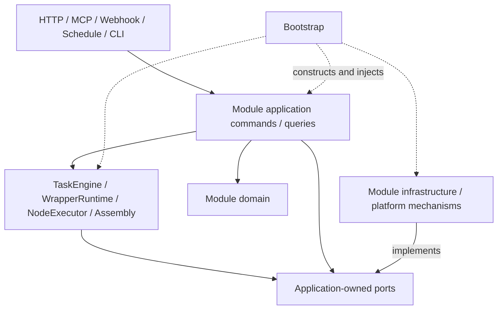
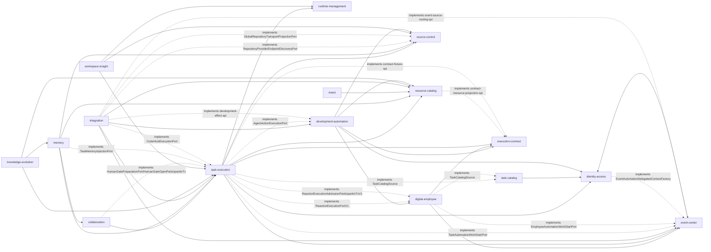

# RFC-294 技术设计：后台最终层次架构

> 本文描述目标态合同，不是一次性目录搬迁清单。实施期允许旧路径 facade，但不允许旧行为内核与新行为
> 内核长期并存。初稿接口锚为 `dde063510dd4b252d3f5f17680113d3cff0b5b3e`；RFC-287 与 RFC-297～332 的已发布批次已在其后
> 改变 production shape，因此“当前已落事实、量化基线、前置偏差与下一步顺序”统一以 `plan.md` §1/§3.2 的
> 2026-08-27 刷新为准。N1a/N1b、RFC-328 P0-D 与 RFC-331 W2-A topology cut 已落；
> [RFC-332](../RFC-332-task-engine-decomposition/proposal.md) / W2-B TaskEngine 也已发布并完成 provenance/hosted closeout，
> canonical value SCC 保持 `4/6`；最终 containing SHA `4dd30d034f1bcb0c6532301cec11bdd288702105` 的
> CI `33052994260`（35/35）、git-protocols-e2e `33052994263`（1/1）与 integration-opencode
> `33052994318`（2/2）均为 terminal `success`。P0-C residual 已由
> [RFC-333](../RFC-333-human-gate-atomic-park-and-continuation/proposal.md) 承接；D1～D12 与 T2～T12 已于
> 2026-08-27 获用户批准；T2～T7 已完成，当前进入 T8，W2-C/D 仍未授权。
> 本文件中的终局业务接口仍是 target contract，不得把治理账本、局部纵切或 durable authority 反推为所有 production consumer 已切换。

## 1. 设计原则

### 1.1 Feature-first，模块内分层

若继续把所有 transport 放 `routes/`、所有业务放 `services/`、所有持久化放 `db/`，一个功能变化必然横穿
多个全局目录，模块 owner 无法从路径判断。目标态先按 bounded context 聚合，再在模块内部区分 domain、
application、engine、ports 和 adapters。

### 1.2 统一机制，不抹平领域差异

- 要统一：trusted authority/command envelope、OCC、transaction、outbox、apply recovery、process supervision、run
  assembly、resource visibility query 形态。
- 不强行统一：六类资源自己的不变量、call 与 wrapper、review 与 clarify 的内容模型、workgroup assignment
  与 NodeRun 生命周期。

抽象只有同时满足以下条件才进入共享内核：至少两个真实生产 consumer、语义和失败/恢复合同相同、旧实现可被
删除、存在防止第二实现再长出的棘轮。否则留在领域模块。

### 1.3 依赖倒置以源码 import 为准

运行时会从 application 调到 engine/infrastructure，但源码依赖方向相反：application 定义 port，外层实现 port，
bootstrap 注入。不能靠动态 import 或 module-global setter 假装“消环”。

### 1.4 单写源、可重建读模型

- 每个聚合只有一个 command writer；
- query projection 可独立优化或重建；
- 不以“双写旧表和新表、以后再删”为常态迁移方式；
- schema 迁移需要 expand/backfill 时，新旧读取必须互 oracle，并明确删 fallback 的波次。

### 1.5 提交与外部效果分相

事务回调只做 durable state、audit 和 durable event。事务成功后再执行：

- `critical`：必须最终发生，durable outbox + 幂等 consumer；
- `rebuildable`：可从事实表重建，reconcile + 可选即时消费；
- `ephemeral`：WS invalidate/telemetry，commit 后 best-effort。

“全部上 outbox”与“全部 fire-and-forget”都不对；事件类别必须由事件注册表穷尽声明。

## 2. 目标物理结构

```text
packages/backend/src/
├── modules/
│   ├── task-execution/
│   │   ├── domain/
│   │   ├── application/
│   │   │   ├── commands/
│   │   │   ├── queries/
│   │   │   └── ports/
│   │   ├── engine/
│   │   │   ├── task/
│   │   │   ├── wrapper/
│   │   │   ├── node/
│   │   │   └── kernel/
│   │   ├── infrastructure/
│   │   │   └── cross-context-adapters/  # ledger 逐适配器放行一个 provider surface
│   │   ├── application/adapters/        # 本域实现下游 required SPI 的领域适配器
│   │   ├── public/{commands,queries,participants,events,types}.ts
│   │   ├── composition/required-ports.ts
│   │   └── composition.ts
│   ├── identity-access/
│   ├── task-catalog/
│   ├── digital-employee/
│   ├── event-center/
│   ├── execution-contract/
│   ├── development-automation/
│   ├── resource-catalog/
│   │   ├── core/{domain,application,infrastructure}/
│   │   ├── agent/
│   │   ├── skill/
│   │   ├── mcp/
│   │   ├── plugin/
│   │   ├── workflow/
│   │   ├── workgroup/
│   │   ├── public/{commands,queries,participants,events,types}.ts
│   │   ├── composition/required-ports.ts
│   │   └── composition.ts
│   ├── collaboration/
│   ├── knowledge-evolution/
│   ├── memory/
│   ├── intent/
│   ├── integration/
│   ├── source-control/
│   ├── runtime-management/
│   ├── workspace-insight/
│   └── system-operations/
├── platform/
│   ├── contracts/
│   ├── persistence/sqlite/
│   ├── runtime/
│   ├── process/
│   ├── filesystem/
│   ├── events/
│   ├── atomic-apply/
│   ├── background/
│   ├── config/
│   ├── errors/
│   └── observability/
├── adapters/
│   └── inbound/{http,mcp,webhook,schedule,cli,websocket}/
└── bootstrap/
    ├── composition.ts
    ├── http.ts
    ├── workers.ts
    └── shutdown.ts
```

每个 module 另有仅 bootstrap 可 import 的 `composition.ts` 精确入口，只导
`create<Context>Module(deps) → {commands,queries,offeredPorts,jobDefinitions}` 等构造结果；它可以 import 本模块
infrastructure，但不得 query DB、做业务 if/switch 或翻译 DTO。Concrete implementation 仍不从 public surface 导出，
bootstrap 也不能任意 deep import `modules/*/infrastructure/**`。Composition entrypoint 进入 public-surface ledger，
category=`composition`、allowed consumer 只能是 bootstrap。

当前 committed tree 另有 `modules/code-capability/` 19 个 production 文件。它不是目标态 active execution context：RFC-310
已把五条 code capability 的写模型、执行编排与新配置 owner 切到 `development-automation`。这 19 个文件按
legacy history/query + capability-template compatibility island 入 `facades/module-symbol-owners` 账本。唯一仍活跃的写例外是
RFC-309 `capability_templates` 的 upstream merge；临时 owner 明确为 `code-capability/template-compatibility`，W4-E8 把其
command/query/writer 收成 exact compatibility surface，并在 migration analyzer 与 legacy template consumer=0 后迁入
`development-automation` 的 ActionTemplate 或退役。除此之外不得恢复 code-round admission/writer。

RFC-331 前的历史基线为 `158b67296b05a11f22a92ab64b2045643f895f9f`，report digest 为
`sha256:4aa0818694f4fbf267e27dc0b62233bde60b110ca8d4b303ae066469ac0a3592`。当前已发布 RFC-332 shape 由
payload commit `b63733a4f77c232d0cb9b285281953f89cea9d8a` 固定，canonical source digest 为
`sha256:db8ee412d9cb1d96fede43392faa65095ccd2447f5af16f88dd805325daa6084`；归一化快照
`a36fd94c28d1b8300e9b67c0b0ca5c3dcc6d0761` 与 provenance repin/final containing SHA
`4dd30d034f1bcb0c6532301cec11bdd288702105` 已发布。该 SHA 的 CI `33052994260`（35/35）、
git-protocols-e2e `33052994263`（1/1）与 integration-opencode `33052994318`（2/2）均为 terminal `success`。下表是该已发布 shape：

| current module           | production TS/TSX | architecture interpretation                                                                                          |
| ------------------------ | ----------------: | -------------------------------------------------------------------------------------------------------------------- |
| `development-automation` |               113 | active writer/type package；aggregate、工具合同与功能闭环已落，public/required/inbound/bootstrap cutover 未完成      |
| `identity-access`        |                33 | role/grant/authority、presence、profile/email/Git identity slices landed；route 直读与 full Actor facade 未退役      |
| `integration`            |                31 | webhook/code-host、adapter definition/connection + Event Center adapter；仍有 schema/inbound 装配债                  |
| `task-execution`         |                73 | RFC-331 topology 与 RFC-332 TaskEngine/DAG owner 已落；node/wrapper mechanics 仍待 W2-C/D                            |
| `digital-employee`       |                23 | EmployeeCase/Context/Reaction/authoring/runtime + frozen adapter binding landed；TE required-port cutover 未完成     |
| `source-control`         |                22 | candidate/commit/publication transport/credential slices；WorkspaceRef/repo/cache/worktree owner 未收口              |
| `event-center`           |                20 | catalog/subscription/observer/delivery/automation-rule writer landed；canonical outbox/background/root 收口未完成    |
| `code-capability`        |                19 | legacy history/template island；仅 upstream merge 为有账临时 writer，非 active execution owner                       |
| `execution-contract`     |                 7 | executor-neutral guide/fixture/exact-output contract landed；legacy resource/script provider adapter 未退役          |
| `task-catalog`           |                 4 | 多来源目录读模型 landed；当前仍传 full Actor/string filter 且 route 直取 composition，未达最终 public query contract |
| `collaboration`          |                 3 | RFC-326 review-anchor/public-query seed 已落；review 主体、route/MCP/continuation 仍在 legacy                        |
| `intent`                 |                 1 | pure domain seed                                                                                                     |

物理 module 已增至 349 个 production TS/TSX 文件，但增长没有自动形成唯一 bootstrap：当前 CLI `start.ts`、HTTP `server.ts` 与 MCP dispatch 各自装配一部分 context，
Integration 还用 deferred participant 避免重复 composition 覆盖；54 个 route/MCP 文件继续导入 `AppDeps`，15 条 route→DB 与两条
transport→DB 继续存在。目标 `DaemonContainer/AppCompositionRoot` 仍归 W9，HTTP/MCP/Webhook/Schedule 只能是 inbound adapters，
不得把当前多 root 形状倒签为目标已完成。

RFC-310 新增的 `digital-employee`、`event-center` 与 `execution-contract` 已形成独立 vertical slice：前者拥有
EmployeeCase/Context/Attention/Reaction/Channel，中者拥有 catalog/subscription/observer/event/delivery 与来源中性的事件自动化规则，
后者拥有 executor-neutral schema guide/transport/compatibility/fixture/exact-output receipt；`development-automation` 只通过类型包
注册代码员工规则和业务合同指南。三域的 root/public/external-import exact 清单由
`design/RFC-310-rule-driven-development-digital-employee/os-architecture-manifest.json` 与
`rfc310-digital-employee-os-architecture.test.ts` 双向锁定，跨 context internal import 与宽 public port 继续由本 RFC
preflight gate 阻断。统一任务创建另落 `task-catalog`：它只合并 task-execution/digital-employee 的 actor-filtered source page，
业务启动仍由来源 owner 的 command 完成。该专项账本现作为 N1 全仓 canonical owner/import/public projection 的受约束子集，
不能成为平行真值，也不能把专项纵切误报为 production cutover 完成。

RFC-317 已 Done：`commons-manifest.json` 登记 82 个公共 kernel（31 core），`commons-debt.json` 逐条锁住 legacy
inbound→module internal 94 条边/28 文件与 module→legacy outbound 23 条边/13 文件；R1/R2 exact equality、R3 模块形状、
R12 type 语料扩面、账本高水位、guard classification 与 negative fixture 均已落。N1a 已把四份账本升级为
`originSha + currentSnapshotSha + sha256 payload digest`，pin-tree replay/tamper gate 取代 ancestor-only 判据；历史短 SHA 只保留为
origin，不再冒充 current snapshot。T10～T73/AC-1～14 是后续必须保持的 oracle，不再作为 RFC-294 下一批重开。

RFC-318～332 又增加了若干必须继承、但不能误算为整 wave exit 的纵切：`development@9` 引入九份最小 v2 工具合同，当前
`development@10` 继承它们并加入 RFC-323 的 exact-lane adapter binding；RFC-320/321/324 分别落 `0207` creator identity、
`0208` publication transport credential、`0209` graded grants；RFC-322 落 14-phase `maintenanceTicker`；RFC-323 落 Integration-owned
adapter revision + DE frozen binding；RFC-326 落 review persistence transaction 与 `collaboration` seed；RFC-327～330 又分别补齐
后续产品纵切、task-execution ownership fence、MCP gate surface 与 ACL catalog；RFC-331/332 则分别关闭 W2-A/W2-B。
RFC-319 只扩测试/治理账本，RFC-325 只改前端 Select，均不给 backend ownership wave 计 credit；RFC-328 只关闭 P0-D，明确不给 W2 解环 credit。

N1b 已把这些资产生成/投影进唯一 `module-symbol-owners/cross-context-imports/facades/public-surfaces` 真值，guard 只保留补充
registry。global owner/symbol/edge FK、mutation/transaction/background/public-surface inventory、required-port liveness 分类与
ambient wiring 全分母已闭合；当前 20 条 required-port `declared-debt` 与最终 consumer/provider cutover 仍归 W4/W5/W9，不能复制
一套新 owner/debt，也不能把“已建账”误写成“已迁完”。

current report 的机器分母为：865 个 backend production 文件、349 个 module 文件、17622 个 production file/top-level symbol
owner、911 个 mutation entrypoint、245 个 transaction callback、215 个 background entry、440 个 ambient seam、1049 条 observed
cross-context edge、64 条 target edge、23 个 required port（3 active/20 declared debt）、1023 条 exact exception、371 个 facade、
300 个 public symbol与 5 条 edge-neutral field-growth ledger；
target implementation SCC=0，unresolved first-party=0。数字只从 committed manifests/report 重放，不在本文另设分母。

RFC-317 已落的 P1/P2 修复是目标架构的行为 oracle，但不是边界 cutover credit：

- 五类 development configuration resource 的 command/admission 仍归 `development-automation`；owner/current-authority 判定应由
  identity/resource authority 的 purpose-specific participant 提供。当前 route 直接调 `requireResourceOwner`、持有 full `Actor/AppDeps` 只是
  W4-E0/E8 必须保真后删除的 legacy seam。
- task archive 中“传递 FK closure 必须导出 `review_comments`”是 TaskExecution 业务选择；platform/storage 只提供导出与 artifact
  机制。当前 flat `services/taskArchive.ts` 是 W4-E1/W9 artifact-lifecycle 迁移时的接受 oracle，不能下沉为读全库的 platform god service。
- T42/T43 把 registry guard 从“表是否被引用”扩到“每个 key/dimension 是否有 direct/via consumer”，并删除零消费者的
  `NodeKindBehavior.isProcess` 与 ref-resolution domain/export 假合同。目标共享面据此只保留真实调用的
  `retryCascade/isAgent/settlesWithoutRow` 与调用级 `purpose/onMissing/failureOwner`；`code-round` 只是 decode/history compatibility row，
  不能再进入 active executor 或 W2 admission。这个收缩是 W0-R registry oracle，不是新 bounded context 或 owner transfer。

因此验收必须分别回答：领域事实/单写是否落地、模块内 layer 是否落地、最终 public interface 与所有 consumer 是否切完。
只有第三项 consumer=0/ledger 全绿后，才可以把对应 RFC-294 vertical slice 记为完成。

此前 `9ec2a469` 的 composition 半边已修，mission `(created_at,id)` 复合索引、统一分页消费与 admission preview 已进入当前
干净基线；旧 NOT-CLEAN/pending-delta 判断作废。它们只证明 DA query 行为和统一 UI 已落，不证明 route 已切到 DA public query，
也不证明 bootstrap-only composition 或全局 W4 退出门。

RFC-310 后续 migration `0205`/`0206` 又落了两条跨域事实：`tasks.digital_employee_case_id` 是 TaskExecution-owned Task row 上的
EmployeeCase provenance ref，`employee_cases.name` 仍由 DigitalEmployee 单写。Task detail 只可用前者定位、再通过 DE actor-filtered
query 投影最小 Case link；不能把 Case 名称/状态复制进 Task row，也不能让 DE 直接更新 Task。Expand-only 列与存量 NULL 可在
W4-E1/E9、W7 切 reader 时保留，回滚不得删已写引用。

运行时调用与源码 import 必须分开看：



上图是 runtime call。源码 import 的箭头则是：inbound→public application；application→domain/本域 ports/
`platform/contracts`；engine→domain/ports/assembly contract；infrastructure→ports/vendor mechanism；bootstrap→public
contracts + exact module composition entrypoints。Domain 永不 import port，application/engine 永不 import concrete
infrastructure；bootstrap 也不能 deep import module infrastructure。

说明：

- `modules/` 是业务 owner；模块内可以有自己的 SQLite adapter，但共享连接、migration 和 outbox plumbing
  归 `platform/persistence`。
- `resource-catalog/core` 只共享 ACL/ref/revision/catalog 合同；六类资源仍是独立 aggregate 子模块，禁止用
  `switch(resourceType)` 堆成一个 CRUD god module。
- 当前 shared ACL catalog 已覆盖 15 类 resource kind；grant-addressable 分母为 16，额外包含
  `scheduled_task`。RFC-324 把判据闭合为 `none/read/write/own`，RFC-330 又扩齐最新资源种类，但这里只提供统一
  ref/revision/access 机制；
  新增七类 aggregate 的 writer 分别留在 compatibility island、development-automation、integration、digital-employee，不能因共用
  ACL 就转交 resource-catalog。
- 当前 shared permission catalog 已有 113 个闭合 permission（admin/user/manager/guest = 113/86/99/7）；这是
  identity-access role/grant 单写的输入分母，
  不是给各 bounded context 自建 permission switch 的授权。每次 W4-E0 切换都从 catalog/operation descriptor 派生并重采数量。
- `platform/` 只放领域中性的机制，禁止出现“某资源是 manager 才能改”之类业务判断。
- outbound port 的**领域实现**放对应 module 的 `infrastructure/`；跨域复用的 DB connection、runtime、process、
  FS 等 vendor mechanism 放 `platform/`，不再另建一个与两者重叠的全局 outbound 目录。
- inbound adapter 的目标路径可在最终阶段从旧 `routes/` 迁入；迁移期旧 route 文件允许薄壳。
- 旧 `services/*` 每个 facade 只能 re-export 或把旧参数适配为新 command；不得继续持有授权、事务、查询或广播。
- 不建 `common/`、`misc/`、`helpers/` 新垃圾桶。共享物必须有 owner 和消费者清单。

## 3. 层次与禁止依赖矩阵

| 层                            | 可以依赖                                                                                                              | 禁止依赖                                                                                                                         |
| ----------------------------- | --------------------------------------------------------------------------------------------------------------------- | -------------------------------------------------------------------------------------------------------------------------------- |
| module `domain`               | shared 中性值对象、本模块 domain                                                                                      | Hono、Drizzle/schema、DbClient、FS/Git/Runtime/WS、Paths、config、其他模块 internal                                              |
| module `application`          | 本模块 domain/ports、`platform/contracts`、其他模块受控 public entrypoint                                             | Hono、route/server、具体 DB table、FS/Git/process、WS broadcaster、platform implementation、engine/infrastructure implementation |
| module `engine`               | 本模块 domain、application ports、kernel contract                                                                     | route/server/Hono、具体 DB、WS、ambient config、其他模块 internal application                                                    |
| module `infrastructure`       | 本模块 ports、platform vendor adapter；`cross-context-adapters/*` 仅可按 ledger 依赖一个 provider offered participant | route、业务 command 调度、跨模块 schema/internal service、未登记外域 public surface                                              |
| module `application/adapters` | 本模块 domain/internal ports + ledger 指定的一个 consumer required SPI                                                | 其他 consumer SPI、外域 command/query、DB/schema、bootstrap 业务翻译                                                             |
| inbound adapter               | module public command/query、transport codec                                                                          | DB/schema、engine/kernel internal、领域算法、手写授权/OCC/saga                                                                   |
| platform                      | 中性 contract、vendor library                                                                                         | 任一具体资源/任务/协作策略                                                                                                       |
| bootstrap                     | 所有 public contract 与 exact module `composition.ts`                                                                 | concrete infrastructure deep import、业务 if/switch、DB query、状态迁移                                                          |

新增常驻规则：

1. `domain/**` 禁 `hono|drizzle|@/db|node:fs|@/ws|@/routes|@/server|Paths`；
2. `application/**` 禁上述具体 adapter，并禁 `infrastructure/**`；
3. `adapters/inbound/**` 禁 `@/db` 和 module internal；
4. 跨业务 application 只能 import provider 的
   `public/{commands,queries,participants,events,types}` 精确入口；consumer-owned required SPI 只能由 bootstrap 和
   ledger 指定的 adapter import `composition/required-ports`。若 consumer 已依赖 provider 的 offered surface（如
   task-execution→source-control/runtime-management），adapter 必须放 consumer
   `infrastructure/cross-context-adapters/<provider>-adapter.ts`，只可 import 本域 required SPI 与该 provider 的一个
   offered participant，再调用 provider offered
   participant；只有 provider→consumer 本来就是单向边（如 collaboration/memory/integration→task-execution）时，provider
   `application/adapters/<consumer>-adapter.ts` 才能实现 consumer required SPI，且只可依赖本域 domain/internal ports 与
   该 SPI。Bootstrap 只构造和注入，不能靠 translation callback 隐藏双向环。上述两类 adapter 是 manifest 中的闭合
   layer category，不代表普通 infrastructure/application 可任意访问外域 public surface；
5. `bootstrap/**` 之外禁止 production `registerX/setXProvider` ambient wiring；
6. 禁止事务回调内 `publish/broadcast/send`；
7. 既有 `no-routes-to-db`、`no-services-to-routes`、`no-util-to-upper`、`no-auth-to-services`、
   `no-circular` 保留，账本只能递减。

`domain` 与 port 是兄弟边界，不允许把上图误读成 `domain → application port`。Port 由需要外部能力的
application/engine 拥有；domain 保持纯净。Infrastructure 可以实现 port，但 application/engine 不反向 import
implementation。

### 3.1 Bounded-context 允许方向

受控 `public/*` entrypoint 不是“随便互相 import”的豁免。同步依赖必须服从以下 DAG：



实线箭头表示“左侧消费右侧受控 offered `public/*` entrypoint”；虚线箭头仅表示 provider adapter 实现右侧
consumer-owned required SPI，不是 application 同步反向依赖。同一对 context 若同时存在 offered 消费与 required-SPI 实现，必须像
`INTEG → DA` / `INTEG ⇢ DA`、`COL → TE` / `COL ⇢ TE`、`MEM → TE` / `MEM ⇢ TE`、`INTEG → TE` /
`INTEG ⇢ TE` 一样把两条 edge 分别登记，不能因源码方向相同而折叠成一个万能接口。DA 不反向 import task/integration public type来实现
这些 effect seam，TaskCatalog 也不反向 import source provider。Integration 与 SC 之间没有无 consumer 的 offered 实线；两条虚线分别
表示 Integration exact adapter 实现 SC-owned `RepositoryProviderEndpointDiscoveryPort` 与
`GlobalRepositoryTransportProjectionPort`。SC 不反向 import Integration public/implementation，也不取得 mutable API connection/client。
`platform` 不在业务 DAG 中：各模块只依赖自己拥有的 platform-facing port，bootstrap 再注入 platform 实现。

`WI → RM` 是 WorkspaceInsight 消费 RuntimeManagement purpose-specific immutable runtime snapshot participant 的 offered edge；
它不暴露 process handle、provider secret、ambient config 或 vendor SDK，也不允许 WorkspaceInsight 直接启动/控制 runtime。

上图只画 value/offered 与 required-SPI implementation 两类 edge。所有含 command/query 的 context 还必须登记到
`identity-access/public/types` 的第三类 **type-only authority edge**；它不做模块初始化，也不能被误记为 required-port implementation：

| edge class                           | exact consumer contexts                                                                                                                                                                                                                                                                               | 约束                                                                                                     |
| ------------------------------------ | ----------------------------------------------------------------------------------------------------------------------------------------------------------------------------------------------------------------------------------------------------------------------------------------------------- | -------------------------------------------------------------------------------------------------------- |
| IA `public/types` type-only          | `task-execution`、`task-catalog`、`collaboration`、`memory`、`intent`、`integration`、`knowledge-evolution`、`workspace-insight`、`development-automation`、`digital-employee`、`event-center`、`execution-contract`、`resource-catalog`、`source-control`、`runtime-management`、`system-operations` | 只取 `AuthorizationSubjectRef` 与 opaque request/tx authority types；不得取得 role/permission policy     |
| value/offered consumption            | 上图全部实线 edge                                                                                                                                                                                                                                                                                     | consumer 只能 import provider exact `public/*` symbol                                                    |
| required-SPI provider implementation | 上图全部虚线 edge                                                                                                                                                                                                                                                                                     | provider adapter 只能 import consumer-owned required SPI 与本域 internal ports；bootstrap 只实例化和注入 |

context DAG、这份 type-only matrix 与终局 `cross-context-imports/public-surfaces/module-symbol-owners` manifests 合起来才是完整依赖规范。
三者必须双向相等：图/表有而 manifest 无、manifest 有而图/表无、同一 context pair 的 offered/required role 被折叠，均视为架构缺口。
`system-operations` 只出现在 authority type matrix 和外围 platform coordinator 消费面，不进入业务事实 DAG；`platform` 是中性机制层，
不进入任一业务 edge class。

`TE ⇢ TC` 与 `DE ⇢ TC` 是 composition implementation edge：task-execution 与 digital-employee 的 provider adapter
分别实现 task-catalog consumer-owned `TaskCatalogSource`。运行时 catalog 扇出到注入的 source；源码上 catalog 不反向
import 两个 provider，也不读取 Task/EmployeeCase table。四个公开 `TaskSourceId`（agent/workflow/workgroup/digital-employee）
各有且只有一个 adapter；TaskSourceId 是目录来源，不是 ExecutionKind。

DigitalEmployee 启动/恢复 Reaction 时只消费本域拥有的 `ReactionExecutionPortV1` 与 tx-bound
`ReactionExecutionAdmissionParticipantInTxV1`；TaskExecution 的 exact provider adapters 分别实现 execution 与同事务 claim-fence/admission
SPI，输入/回执都使用 DE-owned closed DTO，bootstrap 只装配。当前 DE adapter 直接 import
`task-execution/public/participants.DigitalEmployeeExecutionParticipant`，同时 TE public/required/implementation 又 import
DE-owned `WorkspaceFailureClass`，是已落的双向 contract/type debt，不是目标 DAG：W4-E9 必须先以
两套 DE-owned required SPI 收口，再删除两侧反向 public import；禁止用 shared 复制 DTO 或把 bootstrap callback 当第三份合同。

Event Center 的 observation/catalog 是 offered capability，因此 task-execution、digital-employee、integration 到 EC 的实线
分别登记它们的真实 consumer/type edge；自动化启动和 code-host source/routing 则是相反方向的 required-SPI implementation edge。
`EC → IA` 实线只消费 delegated authority resolver/types；`IA ⇢ EC` 虚线只表示 IA exact provider adapter 实现 EC-owned
`EventAutomationDelegatedContextFactory` required SPI，不是 identity-access application 反向消费 Event Center。该 adapter 是唯一
能把 current delegated authority、origin 与 closed port id 绑定成 event-only context 的实现者，bootstrap 只负责注入。
目标合同把宽 `EventAutomationWorkStartPort` 拆成 task 与 employee 两个 target-specific port，Event Center 只按已冻结
`EventResponseTarget` 判别调用哪一个；provider 收不到另一种 target，也不返回 task/case 二选一 receipt。Integration 只实现自己
拥有的 code-host source/routing/delivery adapter，不取得来源中性 rule 或 Task/EmployeeCase mutation 权限。

`XC` 不拥有执行器或员工业务：`DE → XC` 只消费 guide/validation participant，`TE → XC` 只消费 prompt/port/exact-output
机制，`DA → XC` 只注册业务 schema guide。Agent/Workflow projection 与真实 Script fixture 在终局通过 XC consumer-owned
required ports 由 resource-catalog/task-execution provider adapter 实现；兼容期对 legacy `services/agent|workflow|scriptRun` 的
adapter 必须留在 infrastructure 并在 W4-E9 收口，不能进入 domain/application 或成为第二执行器。

- `identity-access`、`resource-catalog`、`source-control`、`runtime-management` 不反向依赖上层业务 context。
- 所有含 command/query 的 context 对 `identity-access/public/types` 有显式 **type-only edge**，只取
  `AuthorizationSubjectRef` 与 opaque request/tx authority types；对 `identity-access/public/participants` 只按实际 consumer 取 context/
  delegated resolver。Type-only edge 仍进入依赖图和账本，不能因不执行初始化就隐身。Permission/role policy 不搬到
  platform；`platform/contracts` 的 transaction/event plumbing 通过 generic authority/audience ref 保持中性。
- task engine 若需要 human gate、memory injection 或 code-host execution，只依赖自己定义的 required
  `HumanGateOpenParticipantInTx` / `TaskMemoryInjectionPort` / `CodeHostExecutionPort`；collaboration、memory、integration
  各自实现并因而依赖 task public port，task-execution 不反向 import这些模块。Bootstrap 只实例化/注入实现。
- collaboration 可以依赖 task-execution 公开的 tx-bound transition participant，但不能 import scheduler internal；
  它同事务写 durable `ContinuationIntent`，由 task worker 在提交后消费。
- 必须跨 context 原子完成的 use case 归发起 context application 所有，通过 tx-bound port 调用；同一个 SQLite
  `dbTxSync` 承载，不把业务顺序塞进 bootstrap bridge。
- 若出现 DAG 外双向同步需要，必须新 RFC 证明是遗漏的共同 aggregate；默认改为 port/event，而不是互 import。
- `development-automation` 只拥有 Mission/ActionRun/AgentAttempt、策略、事实快照、evidence/effect intent 与 MR-care 状态；
  Agent task、Git/workspace、code-host/pipeline、subject authority 分别由 task-execution/source-control/integration/
  identity-access 提供 purpose-specific participant 或实现 consumer-owned required SPI。不得 import legacy
  `code-capability` writer，也不得让 route/service 充当跨域翻译与第二 composition root。

### 3.2 受控 public entrypoints 合同

每个模块使用 `public/commands.ts`、`public/queries.ts`、`public/participants.ts`、`public/events.ts`、`public/types.ts`，
由 generated depcheck + TypeScript AST exact-entrypoint gate 约束所有包内 alias/relative/dynamic import；package exports 只作
包外辅助，不能替代内部门。值级 facade 与 type-only surface 分开，避免 eager barrel 导入一个 event
却初始化全部 command。只允许导出 application facade、跨域 DTO/value、outbound/tx-bound participant port 和 versioned
domain event。Provider offered tx/capability 放 `public/participants`；consumer-owned outbound SPI 放
`composition/required-ports`，只能由 composition 和 exact provider adapter 实现，其他 application 不可 import。模块内部
repository/engine ports 留 internal。禁止导出 Drizzle table/row、repository implementation、内部 aggregate、Hono type、module singleton；
禁止 `export *` 形成隐形耦合。文中的“public contract”均指这些精确入口，不是单一 `public.ts` 大桶。

### 3.3 边界接口最小化规则

模块边界不以“这个模块目前有哪些函数”为依据，而以**已知 consumer 完成一个业务目的所需的最小信息**为依据。
每个 public symbol 必须登记 owner、direction（offered/required）、生产 consumer、字段级 purpose、authority、
transaction/fence、serialization/lifetime、data classification、version；没有生产 consumer 的 symbol/field 不公开。
“无 commands/events/ports”是合法且更好的 public surface，不要求五个目录都有内容。

| 出口类型 | 最小合同                                                                                             | 禁止                                                                                  |
| -------- | ---------------------------------------------------------------------------------------------------- | ------------------------------------------------------------------------------------- |
| command  | context 与业务 input 分离；只收目标 id、实际决策、必要 expected revision/idempotency                 | `DbClient`、Actor 来自 body、deps/callback、内部状态枚举、为未来预留的 optional bag   |
| result   | 完成当前交互所需的 actor-filtered view 或 opaque receipt                                             | events、continuation、worker/lease id、DB row、stack/cause、把整个 aggregate 原样返回 |
| query    | 一个 projection 一个 DTO；filter/page/sort 显式且下推                                                | `Record<string,unknown>`、全表后 JS 过滤、summary/detail 共用万能 view                |
| port     | required SPI 由 consumer 拥有；offered participant 由 invariant owner 拥有；跨事务能力明确 `...InTx` | generic repository/UoW/service locator、暴露实现、让调用者自己拼授权/状态迁移         |
| event    | id/version/revision/最小事实；敏感内容用 ref 后再 actor-filtered query                               | secret、prompt/document body、完整 before/after row、private error、把事件当 DTO 总线 |
| type     | branded id、版本化 discriminated union、JSON-safe value                                              | Drizzle/Hono/vendor type、`any/unknown`、`Partial<T>`、字符串哨兵代替 tagged union    |

具体约束：

1. public command/query facade 每个 operation 只有一个 `execute`；跨域 capability 默认不超过三个高度内聚方法。若两个
   consumer 使用的方法集合不相交，必须拆 interface，不以 mega service 注入。
   `public/commands`、`public/queries` 默认只允许 inbound operation binding；跨 context 默认只能按 symbol allowlist
   消费 `public/{participants,events,types}`，不能直接拿另一模块全部用户 command。
2. Input 不重复 context 字段；Actor/authority、now、correlation、server-calculated hash 永不由业务 payload 传入。
3. 可选字段必须表示真实 wire 兼容或判别联合的某个 variant；“以后可能用”不是理由。互斥形态必须用 tagged union。
4. Summary 只给选择/列表所需标识、显示名、kind、revision；detail 按 aggregate typed query 返回。Cross-context command
   默认只返回 receipt，不为了少一次 query 携带整个 view/aggregate。为保持现有 wire，operation facade 可在 command
   成功后调用 actor-filtered query 组装 response，但 cross-context port 看不到该 view。
5. Required outbound SPI 由需要能力的 consumer 定义、provider 实现；offered application/tx participant 由保护
   aggregate invariant 的 provider 定义、named consumer 调用。Ledger 的 direction 必须与 import/implementation edge
   一致。Port 不导出 `getRaw/listAll/save/delete` 泛型 CRUD 给别的 context。跨域只暴露语义操作，例如
   `assertUsableInTx`、`acceptGateDecisionInTx`、`loadFrozenSnapshot`。
6. 事件 payload 每个字段必须有已知 consumer；消费者若只是 invalidate，只发 `{}`，id/revision/sequence 由 typed
   aggregate envelope 承载，不在 payload 重复。增加字段要更新 schemaVersion、consumer matrix 和
   data-classification review。
7. Public surface 使用 API snapshot + exact import allowlist；禁止 deep import、`export *`、公开 unused export、
   public type 引用 internal/vendor symbol。Interface consumer-method matrix 检测“只用极少方法”的 god interface。

机器账本 `architecture/public-surfaces.json` 每项格式：

```ts
type PublicEntrypoint =
  | 'commands'
  | 'queries'
  | 'participants'
  | 'events'
  | 'types'
  | 'required-ports'
  | 'composition'

interface ConsumerRef {
  ownerEntryId: string
  module: ModuleId
  entrypoint: PublicEntrypoint
  symbol: string
  method?: string
}

type AuthorityRequirement =
  | { kind: 'none' }
  | { kind: 'request-authority'; mode: 'direct' | 'delegated'; subjectBinding: 'context' }
  | {
      kind: 'event-delegated-authority'
      subjectBinding: 'context'
      originBinding: 'context'
      portId: EventAutomationPortId
    }
  | { kind: 'current-authority-in-tx'; scopeBinding: string }
  | {
      kind: 'ownership-epoch'
      ownerModule: 'task-execution'
      targetFieldPath: string
      capability: string
    }
  | { kind: 'system-effect'; effectId: SystemEffectId } // owner-qualified branded string, JSON codec 可验证
  | { kind: 'integration-signature' }
  | { kind: 'admin-recovery'; capability: string; operationBinding: string }

interface PublicSurfaceLedgerEntry {
  ownerEntryId: string // FK -> module-symbol-owners.json
  symbolId: string // stable exact AST symbol id
  module: ModuleId
  entrypoint: PublicEntrypoint
  symbol: string
  direction: 'offered' | 'required' | 'composition-only'
  owner: string
  productionConsumers: readonly ConsumerRef[]
  allowedImplementers?: readonly ConsumerRef[] // required SPI only
  adapterOwner?: ModuleId // required SPI implementation; generated graph must remain acyclic
  purpose: string
  authority: AuthorityRequirement
  transaction: 'none' | 'caller-tx' | 'own-tx' | 'after-commit'
  serialization: 'ephemeral' | 'wire' | 'durable'
  dataClass: 'public' | 'metadata' | 'confidential' | 'secret'
  version: number
  fields: readonly {
    fieldPath: string // recursive leaf path；union variant 也必须入账
    purpose: string
    consumers: readonly ConsumerRef[]
    sensitivity: 'public' | 'metadata' | 'confidential' | 'secret'
  }[]
  capabilityBindings?: readonly {
    capability: string
    boundFieldPaths: readonly string[]
    duplicateFieldPolicy: 'forbidden' | 'exact-equality-check'
  }[]
  methods: readonly {
    name: string
    purpose: string
    consumers: readonly ConsumerRef[]
    authority: AuthorityRequirement
    transaction: 'none' | 'caller-tx' | 'own-tx' | 'after-commit'
  }[]
  budget: {
    maxMethods: number
    maxTopLevelFields: number
    maxTransitiveLeafFields: number
    maxUnionVariants: number
  }
  exceptionId?: string // references the single exact architecture-exceptions ledger
}
```

Data-class 还受 entrypoint kind 约束：event 永不允许 `secret`；query/result 默认最高 confidential，secret 结果只允许
明确 one-shot transport DTO（例如一次性 token plaintext）且 no-log/no-event/no-persist；command input 可接受 secret 但
必须是 one-way sink、字段 exact codec、redaction test。不能因为 ledger 支持 `dataClass:'secret'` 就让 token/password/
cookie/header 穿普通 event/type/result。

CI 做 stale/unknown 双向检查：代码新增 public export 未记账会红；账本 symbol/consumer/recursive leaf field 已消失也会红。
`module-symbol-owners.json` 是 canonical context/layer/root registry，production path root 不重叠；public-surface 每项以
`ownerEntryId/symbolId` 外键关联它，cross-context import edge 也必须以两端 `symbolId + entrypoint` 关联。CI 要求每个
production file 恰有一个 owner、每个 AST public export 恰有一个 surface、每条 edge 两端都可解析，referential
integrity 必须 100%；legacy god file 按 symbol 拆 owner，不能两张表各自自洽却互相矛盾。递归展开
public type graph 做 taint：Drizzle/table/DbClient/Hono/AppDeps/SecretBox/AbortController/process/fs/path/config implementation/
module singleton 通过 alias/generic 泄漏也会红。Wire/durable/event 类型禁止 `any/unknown/object/Function`、open-key 宽
index、`Record<string,unknown>`、open-shape `Partial`、Date/Error/Map/Set/BigInt/Buffer/function/class，必须 readonly、
JSON-safe、exact-key codec、round-trip 与 unknown-key rejection。有限 literal-union mapped type 只有同时由单一 closed
constant 生成 strict exact codec 时允许（RFC-292 `TriggerContext` / `TriggerContextSchema` 属此类）；变异测试必须证明未知 key 仍被拒绝，不能
借此放行任意 string-key record。

God-interface review budget：cross-context port 方法数 >5、DTO top-level fields >12、transitive leaf/union variant 超过
账本 budget、consumer 只使用 interface 极小不交叠子集时默认阻断；例外必须登记同一状态机/协议为何不可拆、owner、consumer
与复核/删除时点。一个 `{payload:{...100 fields}}` 不能绕过 top-level budget：recursive `fieldPath` 的 purpose/consumer/
sensitivity 必须逐 leaf 对拍，nested payload 与新增 union variant 变异都必须打红。AtomicApply provider 属有状态机证据的
显式例外，不能把纯数字门当架构判断替代品。

Capability 与 tx-scope 还有一条统一、不可例外的防伪造规则：所有 capability/token/ref/context 与 `...Tx` scope 的字段
均为 deep-readonly；owner factory 对 JSON payload deep-freeze，opaque capability 不能 wire/durable serialize。禁止对象字面量、
cast、spread-rewrap、property assignment/delete 或把合法 brand 与另一 target/epoch/authority 重新组合。Capability 已绑定的
task/node/workspace/source/action/operation 不得在 request 再传；确有兼容理由时必须登记 exact-equality check 与负向变异。
Prepared payload 在 enqueue/act 前还要重算 canonical hash，不能只相信浅 `Readonly` 或 brand。

### 3.4 各模块最小 public surface

下表是目标**上限**而非要求一次实现的占位 API。只有对应 vertical slice 有真实 consumer 时才落 symbol。

| 模块                     | `public/commands`                                                                                                                      | `public/queries`                                                                                               | offered participants / composition-only required ports                                                                                                                                                                                                                                                                                                                                                                                      | 最小 event/types                                                                                                                   | 明确不跨界                                                                                                                                                                                                    |
| ------------------------ | -------------------------------------------------------------------------------------------------------------------------------------- | -------------------------------------------------------------------------------------------------------------- | ------------------------------------------------------------------------------------------------------------------------------------------------------------------------------------------------------------------------------------------------------------------------------------------------------------------------------------------------------------------------------------------------------------------------------------------- | ---------------------------------------------------------------------------------------------------------------------------------- | ------------------------------------------------------------------------------------------------------------------------------------------------------------------------------------------------------------- |
| identity-access          | inbound auth/session/token/profile 管理与 WS `TrackPresenceConnection` 各自 typed command；不提供万能 `mutateUser`                     | `GetCurrentIdentity/GetUserGitCommitIdentity`、authority-filtered `ListUserSummaries/GetUserPresence`          | `DirectOperationContextFactory` / `DelegatedOperationContextFactory`、`DelegatedAuthorityResolver`、`CurrentAuthorityInTx`；exact adapter 实现 EC-owned `EventAutomationDelegatedContextFactory` required SPI；system-effect factory 归各 platform worker family                                                                                                                                                                            | aggregate-bound `AuthorityRevisionChanged {}`；opaque `RequestAuthority`、`AuthorizationSubjectRef`、二态 `UserOnlineState`        | token hash/secret、session row、full Actor/permission snapshot、连接数/设备/时长、presence 进 prompt、任意 SystemActor constructor                                                                            |
| task-execution           | `Launch/Resume/RetryTask/RetryNode/Cancel/SyncWorkflow`                                                                                | `GetTaskView/ListTaskSummaries/GetExecutionView`；task-owned `ListTaskWorkspaceFiles/ReadTaskWorkspaceContent` | offered source-specific `RepositoryStepTaskLaunchIntentParticipantInTx` / `PreMaterializedTaskLaunchIntentParticipantInTx`、`TaskDecisionParticipantInTx`；required `WorkspacePreparationExecutionPort`、`HumanGatePreparationPort` / `HumanGateOpenParticipantInTx`、`TaskMemoryInjectionPort`、`CodeHostExecutionPort`、`ExecutionWorkspacePort/RepositoryExecutionPort/TaskWorkspaceReadPort`；ownership/ledger ports 仅 composition     | `TaskTerminalCommitted` / `TaskInvalidated` / `NodeInvalidated`；`TaskRef/NodeRunRef/TaskMutationReceipt`                          | scheduler state、frontier、OwnershipToken、AbortController、node row、worktree path                                                                                                                           |
| task-catalog             | 无 mutation/create；任务启动始终调用来源 owner 的 typed command                                                                        | `ListTaskSources/ListTaskCatalogPage`，typed source/filter/page/cursor                                         | required `TaskCatalogSource` 由 task-execution/digital-employee exact adapter 实现；每个 sourceId 唯一且启动期闭合                                                                                                                                                                                                                                                                                                                          | `TaskSourceId/TaskCatalogItem/TaskCatalogPage`；只读 projection 不发业务 event                                                     | full Actor、JSON string response、raw string filter、Task/EmployeeCase row、来源详情/mutation、万能 StartAnything                                                                                             |
| digital-employee         | type/tool/job/employee publish；Case launch/resume/terminate 与显式 policy upgrade                                                     | 分类/职责图/节点工具箱/员工/Case Context·Attention·Queue·Round·Channel 投影                                    | consumes execution-contract offered `ExecutionContractParticipant` 与 Event Center split participants；本域 required `ReactionExecutionPortV1` + `ReactionExecutionAdmissionParticipantInTxV1` 及 tool/program/work-item exact SPI，TE adapters 实现前两者；claim CAS 与 TE fence/admission journal 同 tx，只提交 factory-built frozen request，不得 optional 回退到资源/fixture 探测                                                       | `EmployeeTypeRef/EmployeeCaseRef/ContextRef` 与 projection invalidation；正文/日志只用 artifact ref                                | 代码员工 schema、Git/code-host credential、Task/NodeRun row、任意工具 picker、retry 字段、按 type 分支                                                                                                        |
| event-center             | idempotent `ObserveEvent`；来源中性 automation rule 的 typed create/update/delete                                                      | localized catalog/subscriptions/rules/observer health                                                          | 分拆的 subscription、delivery、observer-control participants；required observer/source adapters、target-specific `TaskAutomationWorkStartPort` / `EmployeeAutomationWorkStartPort`、EC-owned `EventAutomationDelegatedContextFactory` 与 consumer-specific `EventDeliveryRetryConfigProjection`                                                                                                                                             | `EventExactRef/EventSubjectRef/EventObservationReceipt/EventDeliveryEnvelope` 与 projection invalidation                           | Webhook endpoint/secret/trigger row、EmployeeCase/Reaction、代码员工事件判断、provider credential、大日志、跨 target 启动 union、Task/DE retry state、常驻无订阅轮询                                          |
| execution-contract       | Agent 契约托管端口 create/update 规整命令；无业务 mutation command                                                                     | list/get 只返窄 `RuntimeView`；完整 exact guide 为平台校验后的序列化只读文档                                   | offered `ExecutionContractParticipant`：get/list/validateExecutor/validateAgentCandidates/validateEnvelope(input/output)；required exact resource projection 与 Program fixture ports                                                                                                                                                                                                                                                       | `ExecutionContractRef/RuntimeView/ValidationReceipt`、固定 Agent/Script port 名与 exact-envelope validator；注册只传 ref+guideJson | EmployeeCase/WorkItem 路由、开发 schema literal、retry policy、完整 guide mega DTO、Agent/Workflow 写模型、Script runtime、Git/Token/Effect 实现                                                              |
| development-automation   | `Launch/Retry/Cancel/Resume/HandoffMission`、`SubmitMissionAnswers/ConfirmNoChange/AttachMergeRequest` 与四类 config 的 typed commands | actor-filtered `PreviewMissionAdmission` 与 mission/activity/config/readiness/evidence projections             | required `AgentActionExecutionPort` / `RequirementAcquisitionPort` / `RequirementInteractionPort` / `MergeRequestFactsPort` / `PipelineEvidencePort` / `RepositoryDeliveryPort` 等 use-case-specific SPI；provider adapter 只实现自己的一小面                                                                                                                                                                                               | `DevelopmentMissionRef/ActionRunRef/AgentAttemptRef`；`MissionInvalidated` 与 effect receipt/invalidate，正文/日志不进 event       | Task/NodeRun row、Git/code-host credential、absolute path/URL、raw prompt/log、provider SDK、legacy code-round writer、26-option service locator                                                              |
| resource-catalog/core    | 无 universal CRUD；各 aggregate 自己 typed command                                                                                     | 横向 `ResourceCatalogQuery` 只返 summary；完整查询归六子模块                                                   | purpose-specific `TaskExecutionResourceSnapshotInTx` / `IntentApplyResourceParticipantInTx` / `IntegrationTriggerResourceSnapshotInTx`、actor-filtered `ResourceAccessQuery` / `ResourceBlockerQuery` / `SkillProvenanceVisibilityQuery`；统一判据只返 `none/read/write/own`                                                                                                                                                                | internal receipt events / public invalidate；`ResourceRef/VersionedResourceRef/ResourceSummary`                                    | `ACL_TABLES`、owner/grant row、generic repository、六类 detail union；第 14 grant kind 不授权 generic writer                                                                                                  |
| resource 子模块          | 每类明确 `Create/Update/Rename/Delete/UpdateAcl` 的实际集合                                                                            | 每类 typed list/detail/filter                                                                                  | 仅真实跨域需要的 participant，如 `SkillVersionParticipantInTx`                                                                                                                                                                                                                                                                                                                                                                              | kind-specific DTO/event payload                                                                                                    | 其他资源的不变量、`switch(resourceType)` CRUD                                                                                                                                                                 |
| resource-catalog/package | typed package inspect/admit/apply command；不是六类 universal CRUD                                                                     | package preview/receipt                                                                                        | `ResourcePackageApplyProvider` 消费六子模块 typed package mutation participants                                                                                                                                                                                                                                                                                                                                                             | package ref/version/opaque receipt                                                                                                 | resource row、generic repository、AtomicApply journal/claim                                                                                                                                                   |
| collaboration            | `SubmitClarifyAnswers/SubmitReviewDecision/SubmitQuestionAnswers`                                                                      | `GetGateView/ListPendingGateSummaries`                                                                         | implements task required preparation/open ports；consumes task-offered `TaskDecisionParticipantInTx`；module transaction port internal                                                                                                                                                                                                                                                                                                      | `GateDecisionCommitted` / `GateInvalidated`；公开 view 不含 continuation                                                           | document row、ContinuationIntent、resume failure、worker id、terminal closer command                                                                                                                          |
| knowledge-evolution      | `StartFusion/ApproveFusion/RejectFusion/RetryFusion/RestoreSkillVersion`                                                               | `GetFusionView/ListFusionSummaries/GetSkillProvenance`                                                         | consumes task launch + skill/memory tx participants；对外仅 versioned recovery/provenance query                                                                                                                                                                                                                                                                                                                                             | internal apply/provenance receipt / `FusionInvalidated`；`FusionRef/FusionProvenanceRef`                                           | memory/skill row、task internal、raw artifact/journal、module transaction scope                                                                                                                               |
| memory                   | `Create/PatchContent/Move/Promote/Archive/Unarchive/Delete/RetryFailedDistill/CancelPendingDistill`                                    | typed visible list/detail + distill list/job/session view（注入正文不是 public query）                         | implements task required `TaskMemoryInjectionPort`；offered、KE-only `MemoryMembershipParticipantInTx` / `MemoryProvenanceVisibilityQuery`；consumes RC/SC scope visibility filters + task/collaboration distillation snapshots + memory-required distiller execution                                                                                                                                                                       | internal membership receipt / `MemoryInvalidated` / `DistillJobInvalidated`；exact v1 injection snapshot 只给 task port            | prompt consumer list、author/ACL row、fusion engine、raw distill queue/runtime handle                                                                                                                         |
| intent                   | `StartSession/SubmitTurn/UpdateWorkingSet/ApplyDraft/ArchiveSession`                                                                   | `GetJourney/GetSessionView`                                                                                    | 通常不向外导 port；内部消费 catalog/apply contract                                                                                                                                                                                                                                                                                                                                                                                          | aggregate-bound closed state fact / `IntentSessionInvalidated {}`；`IntentSessionRef`                                              | changeset journal/artifact、resource repository、agent runner handle                                                                                                                                          |
| integration              | webhook endpoint/trigger rule/schedule 与 provider REST/API connection aggregate 的 typed commands、trigger admission                  | delivery/webhook-rule/provider-connection typed queries                                                        | consumes task launch-intent participant；implements task required `CodeHostExecutionPort`、Event Center provider/observer adapters，以及 SC-owned `RepositoryProviderEndpointDiscoveryPort` / `GlobalRepositoryTransportProjectionPort`；不交出 mutable connection/provider client                                                                                                                                                          | internal `DeliveryCommitted` / `DeliveryInvalidated`；RFC-292 task launch projection                                               | 来源中性 EventResponseRule、webhook secret/raw API token、Task deps、server/Hono handler、generic operation catalog                                                                                           |
| source-control           | repo/group、personal/global repository transport credential 的真实 typed commands                                                      | repo-owned UI summary/tree/file；task workspace query 不在此授权                                               | offered `PublicRepositorySourceSealPort` / `RepositoryLaunchSnapshotInTx` / `RepositoryPreparationParticipant` / `RepositoryPublicationTransport` / `WorkspaceMaterializationParticipant` / `RepositoryActionParticipant` / bounded `WorkspaceContentParticipant`；required `RepositoryProviderEndpointDiscoveryPort` / `GlobalRepositoryTransportProjectionPort` 由 Integration exact adapters 实现；task adapter 实现 task required ports | opaque `RepositoryRef/RepositoryCredentialRef/SealedPublicRepositorySourceRef/WorkspaceRef/SnapshotRef`；revision-only events      | one-shot seal sink 之外的 raw URL、credential-bearing URL、task membership、absolute path、raw token/provider client、mutable Integration API connection、git client、mutable worktree object、OwnershipToken |
| runtime-management       | runtime profile/admin commands                                                                                                         | inventory/status/probe/diagnostic typed views                                                                  | offered `RuntimeSelectionParticipantInTx`；process/runtime mechanism 属 platform contract                                                                                                                                                                                                                                                                                                                                                   | internal capability fact / public invalidate；opaque frozen runtime ref                                                            | provider secret、process handle、ambient/full config、vendor SDK object                                                                                                                                       |
| workspace-insight        | idempotent `StartChangeNarrative/CancelInsightJob`；纯结构查询不伪装 mutation                                                          | `GetInsightStatus/GetInsightArtifact/GetStructuralDiff/GetSymbols`                                             | consumes task/source-control/runtime purpose-specific immutable snapshot participants；durable job claim internal                                                                                                                                                                                                                                                                                                                           | `InsightArtifactReady` / `InsightInvalidated`；bounded result 或 `InsightArtifactRef`                                              | repo path、DB client、live worktree mutation、unbounded file bodies、process/model handle                                                                                                                     |
| system-operations        | admin `RequestBackup/StageRestore/ActivateRestore` 仅做 orchestration；limits/GC job 仍归 task/source-control owner                    | `GetRecoveryStatus/GetRecoveryOperationDiagnostics`，只看 platform coordinator 自己的 operation                | consumes platform backup/restore coordinator；不取得 contributor registry                                                                                                                                                                                                                                                                                                                                                                   | safe phase/status invalidate；`BackupRef/RestoreRef/DaemonGeneration`                                                              | public liveness、跨业务统计、任何业务事实表、通用跨库 repository、task limit/GC policy、把 health/GC 收成 misc domain                                                                                         |
| platform/contracts       | 无业务 command                                                                                                                         | 无业务 query                                                                                                   | `Transaction/Clock/Id/Event/Audit/Config/Job/AtomicApply` 中性机制                                                                                                                                                                                                                                                                                                                                                                          | 只含中性 envelope/opaque refs                                                                                                      | Actor/resource/task policy、业务 DTO、任何 module implementation                                                                                                                                              |

`development-automation` 的 committed aggregate、单写与模块内层次是 RFC-310 的受保护行为基线，但上表描述的是**尚未完成的最终
边界**。当前 `public/participants.ts` 已导出 RFC-318 的 agent templates/pipeline classifier，`public/types.ts` 导出 approval subject 与
status-changed event ref；仍没有最终 public commands/queries/events，声明的 `composition/required-ports.ts` 也没有 production
consumer。真实运行依赖仍集中在带 26 个 optional port 的 `application/ports/ReconcilerPorts`，并跨 seam 传
path/URL/prompt/callback。W4-E8/W5 必须先让上表合同成为唯一生产事实，再删除 dead/duplicate contract；不得把已有 public 常量、
专项 architecture lock 或 RFC-318 行为合同当作全域 cutover evidence。

边界的“最小”还体现在方向：例如 task 的 review/clarify executor 只解释 node kind 与 park outcome，并调用 task 自己定义的
`HumanGatePreparation/Open` required ports；gate policy/存储在 collaboration。Collaboration module 提供满足 ports 的 facade，bootstrap 只实例化并
注入，不写 if/switch 或 DTO translation。类似地，system-operations 只是无事实表的 administration orchestration；
physical backup/restore mechanism 属 platform/persistence，workspace GC policy 仍属 source-control/task，readiness 属
bootstrap/platform。

### 3.5 关键跨模块接口的精确定义

以下接口锁住最容易再次长成 mega-context 的跨域接缝。省略的内部字段不得由实现“顺便”加进 public DTO。

Event Center 的自动化启动先拆成两条互不重叠的 required SPI。Rule owner、delivery/subscription id、rule revision 与
target digest 只封进 Event Center 铸造的 durable `EventAutomationOriginRef`；provider 不接这些可错绑字段，也不接
`targetKind` 或 task/case 二选一 union：

```ts
declare const eventAutomationOriginBrand: unique symbol
declare const boundedAutomationNameBrand: unique symbol
declare const boundedAutomationTextBrand: unique symbol
declare const boundedAutomationInputKeyBrand: unique symbol
declare const boundedAutomationInputListBrand: unique symbol
declare const automationMachineFieldIdBrand: unique symbol
declare const boundedEmployeeTargetValueBrand: unique symbol
declare const boundedAutomationBodyBrand: unique symbol
declare const boundedAutomationExternalIdBrand: unique symbol
declare const boundedEmployeeTargetListBrand: unique symbol

type EventAutomationOriginRef = string & {
  readonly [eventAutomationOriginBrand]: 'event-delivery+subscription+rule-revision+target-digest-v1'
}
type EventAutomationPortId = 'task-automation-work-start.v1' | 'employee-automation-work-start.v1'
declare const eventAutomationDelegatedContextBrand: unique symbol
interface EventAutomationDelegatedContext<
  TPort extends EventAutomationPortId,
> extends IdempotentCommandContext {
  readonly [eventAutomationDelegatedContextBrand]: TPort
  readonly portId: TPort
  readonly origin: EventAutomationOriginRef
}
type BoundedAutomationName = string & {
  readonly [boundedAutomationNameBrand]: 'trimmed-1..255-code-points'
}
type BoundedAutomationText = string & {
  readonly [boundedAutomationTextBrand]: 'max-64-kib-utf8'
}
type BoundedAutomationInputKey = string & {
  readonly [boundedAutomationInputKeyBrand]: 'trimmed-1..160-code-points'
}
type AutomationMachineFieldId = string & {
  readonly [automationMachineFieldIdBrand]: 'machine-id-1..160'
}
type BoundedEmployeeTargetValue = string & {
  readonly [boundedEmployeeTargetValueBrand]: '1..1000-code-points'
}
type BoundedAutomationBody = string & {
  readonly [boundedAutomationBodyBrand]: '1..2-mib-utf8'
}
type BoundedAutomationExternalId = string & {
  readonly [boundedAutomationExternalIdBrand]: 'trimmed-1..500-code-points'
}
interface EventAutomationInputEntryV1 {
  readonly key: BoundedAutomationInputKey
  readonly value: BoundedAutomationText
}
type EventAutomationInputListV1 = readonly EventAutomationInputEntryV1[] & {
  readonly [boundedAutomationInputListBrand]: 'unique-key-sorted-max-256'
}

type TaskAutomationTargetV1 =
  | {
      readonly kind: 'workflow'
      readonly workflow: ResourceRef<'workflow'>
      readonly name: BoundedAutomationName
      readonly inputs: EventAutomationInputListV1
    }
  | {
      readonly kind: 'agent'
      readonly agent: ResourceRef<'agent'>
      readonly name: BoundedAutomationName
      readonly description: BoundedAutomationText | null
      readonly inputs: EventAutomationInputListV1
    }
  | {
      readonly kind: 'workgroup'
      readonly workgroup: ResourceRef<'workgroup'>
      readonly name: BoundedAutomationName
      readonly goal: BoundedAutomationText
    }

interface TaskAutomationWorkStartV1 {
  readonly version: 1
  readonly target: TaskAutomationTargetV1
  readonly trigger: TriggerContext // RFC-292 canonical exact codec; confidential
}
interface TaskAutomationWorkStartReceipt {
  readonly task: TaskRef
}
interface TaskAutomationWorkStartPort {
  start(
    ctx: EventAutomationDelegatedContext<'task-automation-work-start.v1'>,
    input: TaskAutomationWorkStartV1,
  ): Promise<TaskAutomationWorkStartReceipt>
}

interface EmployeeAutomationTargetFieldV1 {
  readonly fieldId: AutomationMachineFieldId
  readonly value: BoundedEmployeeTargetValue
}
type EmployeeAutomationTargetFieldListV1 = readonly EmployeeAutomationTargetFieldV1[] & {
  readonly [boundedEmployeeTargetListBrand]: 'unique-field-sorted-max-256'
}
type EmployeeAutomationIntakeV1 =
  | { readonly kind: 'body'; readonly value: BoundedAutomationBody }
  | { readonly kind: 'external-id'; readonly value: BoundedAutomationExternalId }

interface EmployeeAutomationWorkStartV1 {
  readonly version: 1
  readonly employee: ExactResourceRef
  readonly target: EmployeeAutomationTargetFieldListV1
  readonly intake: EmployeeAutomationIntakeV1
}
interface EmployeeAutomationWorkStartReceipt {
  readonly employeeCase: EmployeeCaseRef
}
interface EmployeeAutomationWorkStartPort {
  start(
    ctx: EventAutomationDelegatedContext<'employee-automation-work-start.v1'>,
    input: EmployeeAutomationWorkStartV1,
  ): Promise<EmployeeAutomationWorkStartReceipt>
}
```

两个 `start` 都只接受 event-automation 专用 delegated factory 从 rule owner **当前** authority、durable origin 与闭合 port id
构造的 branded context；通用 direct/delegated `IdempotentCommandContext` 在类型上都不能代入。Event Center 不传
`ownerUserId`/permission snapshot，provider 在自己的事务里重验 target 可见、可用与
launch 权限。幂等 key 由 `EventAutomationOriginRef + target port id` 确定性派生，provider 以 origin 唯一键返回同一 receipt，不能由
Event Center 另传随机 key。Event Center 在外调前同事务写 target-specific work intent 并 claim epoch；provider 成功后只允许同一
claim epoch 结算 delivery，crash-after-start 重放得到同一 Task/EmployeeCase，旧 worker 即使拿到 receipt 也不能结算新 claim。

Task 输入只允许已经按 Event Center rule exact codec 物化的 name/description/goal/inputs 与 canonical `TriggerContext`；Employee
输入只允许 employee ref、最多 256 个唯一 target field 和闭合 intake。`BoundedAutomationBody` 沿用既有 2 MiB 上限，
`BoundedAutomationExternalId` 使用 employee owner 的 exact external-id codec；切 V2 前必须为超过新 collection budget 的存量 rule
提供显式兼容/修复报告，不能静默截断。字段分级固定为：origin/ref/revision 为 internal，task inputs/trigger 与 employee target/intake
为 confidential，receipt 为 internal；raw event payload、rule/delivery/subscription id、template body、Actor、credential、absolute path、
另一 target 的 ref/receipt 均不得进入 port。两方法分别登记 recursive field consumer、transitive budget、delegated authority 与
data-class ledger；wrong-target、direct-context substitution、owner 重绑、context origin/key/port mismatch、stale claim、unknown field 与
超预算变异必须打红。

Task catalog 的接口先锁目录语义，避免“统一入口”重新长成万能 task service：

```ts
type TaskSourceId = 'agent' | 'workflow' | 'workgroup' | 'digital-employee'
type ActiveExecutionKind = 'workflow' | 'agent' | 'workgroup'
type PersistedExecutionKind = ActiveExecutionKind | 'code-round' // decode/history only; new admission rejects it

declare const pageSizeBrand: unique symbol
declare const searchTextBrand: unique symbol
declare const catalogCursorBrand: unique symbol
declare const sourceCursorBrand: unique symbol
declare const taskCatalogSourceIdListBrand: unique symbol
declare const taskCatalogSourceItemsBrand: unique symbol
declare const taskCatalogAggregateItemsBrand: unique symbol
type BoundedPageSize = number & { readonly [pageSizeBrand]: 'integer-1..100' }
type BoundedSearchText = string & { readonly [searchTextBrand]: 'trimmed-max-100-code-points' }
type TaskCatalogCursor = string & {
  readonly [catalogCursorBrand]: 'hmac-authenticated-task-catalog-cursor-v2'
}
type TaskCatalogSourceCursor = string & { readonly [sourceCursorBrand]: 'source-owned-cursor-v1' }

type TaskCatalogSourceIdListV2 = readonly TaskSourceId[] & {
  readonly [taskCatalogSourceIdListBrand]: 'unique-sorted-max-4'
}
type NonEmptyTaskCatalogSourceIdListV2 = readonly [TaskSourceId, ...TaskSourceId[]] &
  TaskCatalogSourceIdListV2

interface TaskCatalogItemRef<TId extends TaskSourceId = TaskSourceId> {
  readonly sourceId: TId
  readonly id: string
}

type TaskCatalogView = 'all' | 'active' | 'attention' | 'finished'
type TaskCatalogScope = 'mine' | 'shared' | 'all'
type TaskCatalogOrigin = 'all' | 'manual' | 'scheduled' | 'event' | 'webhook' | 'api'
type TaskCatalogStatusSelection =
  | { readonly kind: 'all' }
  | { readonly kind: 'only'; readonly statuses: readonly [TaskStatus, ...TaskStatus[]] }

interface TaskCatalogFiltersV2 {
  readonly view: TaskCatalogView
  readonly search:
    | { readonly kind: 'none' }
    | { readonly kind: 'text'; readonly text: BoundedSearchText }
  readonly statuses: TaskCatalogStatusSelection
  readonly scope: TaskCatalogScope
  readonly origin: TaskCatalogOrigin
}

type TaskCatalogSourceSelection =
  | { readonly kind: 'all' }
  | { readonly kind: 'only'; readonly sourceIds: NonEmptyTaskCatalogSourceIdListV2 }

type TaskCatalogPageRequest =
  | { readonly kind: 'first'; readonly perSourceLimit: BoundedPageSize }
  | {
      readonly kind: 'after'
      readonly cursor: TaskCatalogCursor
      readonly perSourceLimit: BoundedPageSize
    }

type TaskCatalogHierarchyRequest =
  | { readonly kind: 'root' }
  | { readonly kind: 'children'; readonly parent: TaskCatalogItemRef }

interface TaskCatalogQueryV2 {
  readonly sources: TaskCatalogSourceSelection
  readonly page: TaskCatalogPageRequest
  readonly hierarchy: TaskCatalogHierarchyRequest
  readonly filters: TaskCatalogFiltersV2
}

interface TaskCatalogLocalizedTextV2 {
  readonly 'zh-CN': string
  readonly 'en-US': string
}

type TaskCatalogOwnerV2 =
  | { readonly kind: 'none' }
  | { readonly kind: 'label'; readonly label: string }
  | {
      readonly kind: 'user'
      readonly userRef: UserRef
      readonly username: string
      readonly displayName: string
    }

interface TaskCatalogItemV2<TId extends TaskSourceId = TaskSourceId> {
  readonly ref: TaskCatalogItemRef<TId>
  readonly display: {
    readonly title: string
    readonly subject: {
      readonly resourceRef: string | null
      readonly label: TaskCatalogLocalizedTextV2
    }
    readonly targetLabel: string | null
  }
  readonly state: {
    readonly status: TaskStatus
    readonly detail: TaskCatalogLocalizedTextV2 | null
    readonly failureCode: FailureCode | null
    readonly safeErrorSummary: string | null
  }
  readonly clock: {
    readonly startedAt: number
    readonly updatedAt: number
    readonly finishedAt: number | null
    readonly runningMs: number
    readonly runningSince: number | null
  }
  readonly owner: TaskCatalogOwnerV2
  readonly counts: {
    readonly children: number
    readonly repositories: number
    readonly openAlerts: number
  }
  readonly scheduledTask:
    | { readonly kind: 'none' }
    | { readonly kind: 'ref'; readonly task: TaskRef }
  readonly hierarchy: {
    readonly parent:
      | { readonly kind: 'none' }
      | { readonly kind: 'ref'; readonly item: TaskCatalogItemRef }
    readonly invocationDepth: number
    readonly matchKind: 'self' | 'context'
    readonly parentAvailability: 'none' | 'visible' | 'unavailable'
    readonly qualifyingChildCount: number
    readonly matchingDescendantCount: number
    readonly branchStartedAt: number
  }
}

type TaskCatalogSourceItemListV2<TId extends TaskSourceId> = readonly TaskCatalogItemV2<TId>[] & {
  readonly [taskCatalogSourceItemsBrand]: 'length-lte-requested-limit'
}
type TaskCatalogAggregateItemListV2 = readonly TaskCatalogItemV2[] & {
  readonly [taskCatalogAggregateItemsBrand]: 'length-max-400'
}

interface TaskCatalogFacetsV2 {
  readonly all: number
  readonly active: number
  readonly attention: number
  readonly finished: number
}

interface TaskCatalogSourceAvailabilityV2 {
  readonly canList: boolean
  readonly canCreate: boolean
}

interface TaskCatalogSourceDescriptorV2<
  TId extends TaskSourceId = TaskSourceId,
> extends TaskCatalogSourceAvailabilityV2 {
  readonly sourceId: TId
  readonly order: number
  readonly hierarchy: TaskCatalogHierarchyCapability
  readonly catalogPath: string
  readonly detailPath: string
  readonly labelKey: string
  readonly descriptionKey: string
}

interface TaskSourceListV2 {
  readonly schemaVersion: 2
  readonly sources: readonly TaskCatalogSourceDescriptorV2[]
}

interface TaskCatalogPageV2 {
  readonly schemaVersion: 2
  readonly sourceIds: TaskCatalogSourceIdListV2
  readonly items: TaskCatalogAggregateItemListV2
  readonly nextCursor: TaskCatalogCursor | null
  readonly facets: TaskCatalogFacetsV2
}

type TaskCatalogSourcePageRequest =
  | { readonly kind: 'first'; readonly limit: BoundedPageSize }
  | {
      readonly kind: 'after'
      readonly cursor: TaskCatalogSourceCursor
      readonly limit: BoundedPageSize
    }

type TaskCatalogHierarchyCapability =
  | { readonly kind: 'none' }
  | { readonly kind: 'parents-from'; readonly sourceIds: NonEmptyTaskCatalogSourceIdListV2 }

interface TaskCatalogSourceQueryV2 {
  readonly filters: TaskCatalogFiltersV2
  readonly hierarchy: TaskCatalogHierarchyRequest
  readonly page: TaskCatalogSourcePageRequest
}

interface TaskCatalogSourcePageV2<TId extends TaskSourceId> {
  readonly items: TaskCatalogSourceItemListV2<TId>
  readonly nextCursor: TaskCatalogSourceCursor | null
  readonly facets: TaskCatalogFacetsV2
}

interface TaskCatalogQueryService {
  listSources(ctx: QueryContext): Promise<TaskSourceListV2>
  list(ctx: QueryContext, input: TaskCatalogQueryV2): Promise<TaskCatalogPageV2>
}

// Consumer-owned required SPI. Provider adapters do current-authority filtering in their own owner context.
interface TaskCatalogSource<TId extends TaskSourceId> {
  readonly sourceId: TId
  readonly hierarchy: TaskCatalogHierarchyCapability
  availability(authority: RequestAuthority): Promise<TaskCatalogSourceAvailabilityV2>
  list(
    authority: RequestAuthority,
    input: TaskCatalogSourceQueryV2,
  ): Promise<TaskCatalogSourcePageV2<TId>>
}
```

V2 只含 catalog UI 已登记 consumer 的 stable ref、display/status/clock/owner summary、hierarchy、facets 与 cursor；不含 source row、
完整 Task/EmployeeCase view、JSON 字符串、permission name/set/snapshot 或启动参数。`availability` 由每个 source owner 按 current
authority 返回两个布尔能力，Catalog 不复制权限 switch；`canCreate` 只控制目录 affordance，启动仍调用来源 command。现有 v1 wire
中 `canList=false && canCreate=false` 的来源继续从 listSources 结果省略，且结果不回传 permission 名称；
先按 recursive leaf ledger 对拍再经 versioned adapter 迁 V2，不借“最小化”静默删兼容字段。Catalog aggregate cursor 的 exact
codec 内含 `schemaVersion/queryHash/subjectBinding/四来源 cursor map/keyId/mac`；它是 server-issued HMAC authenticated envelope，
不是可改写的 base64 JSON；先验 codec/version/keyId/MAC，再对拍 subject/query，轮换期只接受 current + bounded previous key。
签名 key 只能经 platform secret use-port 使用，永不进入 DTO/log。`only.sourceIds` 与结果 sourceIds 由 strict codec 铸为
unique/sorted/max-4，重复、未知或超量在调用 provider 前拒绝。aggregate `perSourceLimit` 是每个被选来源的独立上限，
source query 再映射成自己的 `limit`，因此一页最大 item 数为 `selectedSourceCount × perSourceLimit`（当前绝对上限 400）；Catalog
对每个 provider receipt 重验 `items.length <= requested limit`，over-return 时 fail-closed 且不签发/推进 aggregate cursor；通过后返回
所有已推进 source page 的 item，不再做会越过未返回项的二次全局截断。decode 后必须用 canonical V2 query hash 与
`ctx.authority.subjectRef` 对拍，mismatch 在调用 source 前 fail-closed，cursor 本体不暴露给 provider。Hierarchy capability 是来源注册合同：task-execution 的 agent/workflow/workgroup
adapter 都声明 `parents-from` 这三个 source，因而 workflow 父任务可以展开 agent/workgroup 异源 child；digital-employee 声明
`none`，只接受 root。Catalog 只把 child query 发给显式接受该 parent source 的 adapter，provider act 前重复校验；不能把 parent
强绑成 child adapter 自己的 sourceId。Availability receipt 不重复携带 sourceId，避免真 authority 配错来源。
Catalog 启动时校验四个 source id 唯一且齐全；新增来源必须
同时更新 closed union、provider adapter、wire codec、consumer/field ledger。`TaskSourceId` 只回答“目录由谁提供”，不得用来扩张
`ExecutionKind`、`NodeKind` 或绕过来源 owner 的 typed launch command。

TaskExecution 另独占 persisted `TaskCatalogVisibility = 'public' | 'internal'`：普通 root 默认 `public`，内部执行 adapter 只能
显式铸 `internal`，call child 在同一 task INSERT 事务读取并继承 parent 值；migration `0203` 递归回填既有数字员工内部任务树。
该字段是 catalog membership，不是权限 grant；internal 任务仍可在既有 task authority 下按 exact ref 查看。`TaskCatalogSource.list`
不得接 caller-supplied visibility，provider adapter 必须恒定只投影 `public`，facets/hierarchy/cursor 也在同一 predicate 内计算，避免
只隐藏 item 却从 count/parent/cursor 泄漏内部执行。当前 landed 行为已覆盖 `/api/task-catalog`、`/tasks` 目录、legacy
`GET /api/tasks` 与首页 Running/RecentlyDone；direct-id lookup 保留 actor-filtered 审计语义。该 behavior oracle 不等于结构切换：
Catalog v1 仍接 full Actor/string filter/JSON，route 仍直取 composition，server→Catalog 与 adapter→legacy service 债仍在。终局要把
目录型 consumer 全切 typed Catalog V2；确需包含 internal 的运维视图归 task-execution admin query + 独立 DTO。

DigitalEmployee → TaskExecution 的 Reaction 执行也必须收成一个 consumer-owned、无 raw JSON/path 的精确 required SPI。当前
committed 兼容链尚不是该合同：DE 的 `ReactionExecutionPort` 仍传 `previousError?: string`，`inspectHumanReview?` 仍是 optional；
DE adapter 直接 import TE offered participant，而 TE public participant 又反向 import DE 的 `WorkspaceFailureClass`。因此下列 V1 是
W4-E9 的迁移退出合同，不是已落 public API：

```ts
declare const reactionOperationBrand: unique symbol
declare const reactionExecutionBrand: unique symbol
declare const reactionRoundBrand: unique symbol
declare const reactionPlanBrand: unique symbol
declare const reactionClaimFenceReceiptBrand: unique symbol
declare const reactionAdmissionReceiptBrand: unique symbol
declare const reactionAccessBrand: unique symbol
declare const reactionHashBrand: unique symbol
declare const reactionInputArtifactBrand: unique symbol
declare const reactionWorkspaceBrand: unique symbol
declare const reactionPolicyBrand: unique symbol
declare const reactionOutputArtifactBrand: unique symbol
declare const reactionDiagnosticsBrand: unique symbol
declare const reactionStopReceiptBrand: unique symbol
declare const reactionReviewArtifactBrand: unique symbol
declare const reactionReviewApprovalBrand: unique symbol
declare const reactionRetryFeedbackBrand: unique symbol
declare const programArtifactBrand: unique symbol
declare const platformWorkItemBrand: unique symbol
declare const collaborationWorkItemBrand: unique symbol
declare const reactionSafeCodeBrand: unique symbol
declare const reactionClaimEpochBrand: unique symbol
declare const authorityRevisionBrand: unique symbol

interface EmployeeCaseRef {
  readonly id: string
  readonly revision: number // exact codec: positive integer
}
interface ExecutionContractRef {
  readonly contractId: string
  readonly version: number // exact codec: positive integer
}
type WorkspaceFailureClass = 'boundary' | 'semantic' | 'infrastructure'
type ReactionSafeCode = string & {
  readonly [reactionSafeCodeBrand]: 'allowlisted-reaction-safe-code-v1'
}
type ReactionClaimEpoch = number & {
  readonly [reactionClaimEpochBrand]: 'positive-monotonic-reaction-claim-epoch'
}
type AuthorityRevision = number & {
  readonly [authorityRevisionBrand]: 'positive-current-authority-revision'
}

type ReactionExecutionOperationRef = string & {
  readonly [reactionOperationBrand]: 'digital-employee-reaction-operation-v1'
}
type ReactionExecutionRef = string & {
  readonly [reactionExecutionBrand]: 'digital-employee-reaction-execution-v1'
}
type ReactionRoundRef = string & { readonly [reactionRoundBrand]: 'reaction-round-v1' }
type ReactionRequestHash = string & {
  readonly [reactionHashBrand]: 'sha256-canonical-reaction-request-v1'
}
type ReactionInputArtifactRef = string & {
  readonly [reactionInputArtifactBrand]: 'validated-content-addressed-reaction-input-v1'
}
type FrozenReactionWorkspaceRef = string & {
  readonly [reactionWorkspaceBrand]: 'authorized-frozen-reaction-workspace-v1'
}
type FrozenReactionExecutionPolicyRef = string & {
  readonly [reactionPolicyBrand]: 'frozen-reaction-execution-policy-v1'
}
type ReactionOutputArtifactRef = string & {
  readonly [reactionOutputArtifactBrand]: 'validated-content-addressed-reaction-output-v1'
}
type ReactionDiagnosticsRef = string & {
  readonly [reactionDiagnosticsBrand]: 'actor-filtered-reaction-diagnostics-v1'
}
type ReactionExecutionStopReceipt = string & {
  readonly [reactionStopReceiptBrand]: 'reaction-execution-stopped-v1'
}
type ReactionReviewArtifactRef = string & {
  readonly [reactionReviewArtifactBrand]: 'actor-filtered-reaction-review-artifact-v1'
}
type ReactionReviewApprovalRef = string & {
  readonly [reactionReviewApprovalBrand]: 'reaction-review-approval-v1'
}
type ReactionRetryFeedbackArtifactRef = string & {
  readonly [reactionRetryFeedbackBrand]: 'sanitized-content-addressed-reaction-retry-feedback-v1'
}
type ProgramArtifactRef = string & { readonly [programArtifactBrand]: 'program-artifact-v1' }
type PlatformWorkItemRef = string & { readonly [platformWorkItemBrand]: 'platform-work-item-v1' }
type CollaborationWorkItemRef = string & {
  readonly [collaborationWorkItemBrand]: 'collaboration-work-item-v1'
}

type ReactionImplementationV1 =
  | { readonly kind: 'agent'; readonly agent: ResourceRef<'agent'> }
  | { readonly kind: 'workflow'; readonly workflow: ResourceRef<'workflow'> }
  | { readonly kind: 'program'; readonly program: ProgramArtifactRef }
  | { readonly kind: 'system'; readonly workItem: PlatformWorkItemRef }
  | { readonly kind: 'collaboration'; readonly workItem: CollaborationWorkItemRef }

interface ReactionExecutionRequestMaterialV1 {
  readonly version: 1
  readonly operation: ReactionExecutionOperationRef
  readonly employeeCase: EmployeeCaseRef
  readonly reaction: ReactionRoundRef
  readonly authority: {
    readonly subject: AuthorizationSubjectRef
    readonly revision: AuthorityRevision
  }
  readonly attempt: {
    readonly ordinal: number // exact codec: nonnegative integer; initial=0; bounded by frozen policy
    readonly mode: 'initial' | 'same-scene' | 'fresh-scene'
    readonly retryFeedback:
      | { readonly kind: 'none' }
      | { readonly kind: 'artifact'; readonly ref: ReactionRetryFeedbackArtifactRef }
  }
  readonly implementation: ReactionImplementationV1
  readonly executionContract: ExecutionContractRef
  readonly input: ReactionInputArtifactRef
  readonly workspace: FrozenReactionWorkspaceRef
  readonly policy: FrozenReactionExecutionPolicyRef
}

interface PreparedReactionExecutionV1 {
  readonly [reactionPlanBrand]: 'factory-built-deep-frozen-reaction-request-v1'
  readonly request: DeepReadonlyJson<ReactionExecutionRequestMaterialV1>
  readonly requestHash: ReactionRequestHash
}

interface ReactionClaimActivationV1 {
  readonly employeeCase: EmployeeCaseRef
  readonly reaction: ReactionRoundRef
  readonly expectedPreviousEpoch: ReactionClaimEpoch | null
  readonly nextEpoch: ReactionClaimEpoch
  readonly authority: {
    readonly subject: AuthorizationSubjectRef
    readonly revision: AuthorityRevision
  }
}

interface ReactionClaimClosureV1 {
  readonly employeeCase: EmployeeCaseRef
  readonly reaction: ReactionRoundRef
  readonly expectedCurrentEpoch: ReactionClaimEpoch
  readonly reason: 'completed' | 'canceled' | 'superseded'
}

interface ReactionClaimFenceReceiptV1 {
  readonly [reactionClaimFenceReceiptBrand]: 'te-journal-backed-reaction-claim-fence-v1'
  readonly employeeCase: EmployeeCaseRef
  readonly reaction: ReactionRoundRef
  readonly claimEpoch: ReactionClaimEpoch
  readonly authority: {
    readonly subject: AuthorizationSubjectRef
    readonly revision: AuthorityRevision
  }
  readonly fenceRevision: number // exact codec: positive monotonic integer
}

interface ReactionExecutionAdmissionReceiptV1 {
  readonly [reactionAdmissionReceiptBrand]: 'te-journal-backed-reaction-admission-v1'
  readonly fence: ReactionClaimFenceReceiptV1
  readonly operation: ReactionExecutionOperationRef
  readonly requestHash: ReactionRequestHash
  readonly execution: ReactionExecutionRef
}

// Owned by digital-employee/composition/required-ports and exposed only inside the live
// DE claim transaction scope. The TE adapter writes its fence/admission journal in that same tx.
interface ReactionExecutionAdmissionParticipantInTxV1 {
  activateClaim(input: ReactionClaimActivationV1): ReactionClaimFenceReceiptV1
  admitLaunch(input: {
    readonly fence: ReactionClaimFenceReceiptV1
    readonly operation: ReactionExecutionOperationRef
    readonly requestHash: ReactionRequestHash
  }): ReactionExecutionAdmissionReceiptV1
  closeClaim(input: ReactionClaimClosureV1): void
}

interface ReactionExecutionAccessV1 {
  readonly [reactionAccessBrand]: 'current-reaction-execution-access-v1'
  readonly admission: ReactionExecutionAdmissionReceiptV1
  readonly execution: ReactionExecutionRef
}

interface ReactionExecutionLaunchReceiptV1 {
  readonly execution: ReactionExecutionRef
}

type ReactionExecutionSnapshotV1 =
  | { readonly kind: 'pending' }
  | { readonly kind: 'running' }
  | { readonly kind: 'completed'; readonly output: ReactionOutputArtifactRef }
  | {
      readonly kind: 'failed'
      readonly errorClass: WorkspaceFailureClass
      readonly safeCode: ReactionSafeCode
      readonly diagnostics: ReactionDiagnosticsRef
    }
  | { readonly kind: 'stopped'; readonly receipt: ReactionExecutionStopReceipt }

type ReactionHumanReviewSnapshotV1 =
  | { readonly kind: 'not-applicable' }
  | { readonly kind: 'planning' }
  | { readonly kind: 'waiting'; readonly artifact: ReactionReviewArtifactRef }
  | { readonly kind: 'approved'; readonly approval: ReactionReviewApprovalRef }
  | {
      readonly kind: 'failed'
      readonly safeCode: ReactionSafeCode
      readonly diagnostics: ReactionDiagnosticsRef
    }

// Owned by digital-employee/composition/required-ports; one TE provider adapter implements all methods.
interface ReactionExecutionPortV1 {
  launch(
    input: PreparedReactionExecutionV1,
    admission: ReactionExecutionAdmissionReceiptV1,
  ): Promise<ReactionExecutionLaunchReceiptV1>
  inspect(access: ReactionExecutionAccessV1): Promise<ReactionExecutionSnapshotV1>
  inspectHumanReview(access: ReactionExecutionAccessV1): Promise<ReactionHumanReviewSnapshotV1>
  cancel(access: ReactionExecutionAccessV1): Promise<ReactionExecutionStopReceipt>
}
```

`PreparedReactionExecutionV1` 只能由 DigitalEmployee allowed factory 生成：exact codec 先冻结 `request` 中的 implementation、
ExecutionContract、content-addressed input、authorized workspace 与 execution policy，再只对 `request` 做 canonical hash（hash material
明确排除 envelope brand 与 `requestHash` 自身），最后 deep-freeze `{request, requestHash}`。外部
caller/route/bootstrap/TaskExecution 均不能 object-literal、spread-rewrap 或 cast 铸造。

DE 对 Case/Reaction claim 做 durable CAS 的同一 transaction scope 必须注入 TE adapter 实现的
`ReactionExecutionAdmissionParticipantInTxV1`：每次首次 claim/takeover 都以 `expectedPreviousEpoch → nextEpoch` 调 `activateClaim`，
随后以返回 fence + operation + requestHash 调 `admitLaunch`；release/terminal 同事务调 `closeClaim`。这些 participant 写点与 DE claim row
共享同一个 live DB transaction，scope 退出即失效，不是 callback，也不允许逃逸或接裸 DB handle。TE journal 因而在 DE claim 可见前已原子
登记 current epoch/authority/op/hash；claim advance 与 launch CAS 争用同一 fence row，不存在“先回调验 claim、后 journal”的 TOCTOU 窗口。

`operation` 对同一个逻辑 Reaction attempt 稳定；technical retry/takeover/replay 复用同一个 operation 和 requestHash，并得到同一个
`ReactionExecutionRef`；只有用户或 policy 创建新的逻辑 attempt 才铸新 operation。provider 的 launch transaction 逐字段对拍 admission、
`input.request`、`input.requestHash` 与 TE-owned current fence，再把 `admitted → starting` CAS 和 record-before-act journal 同写；同 operation
不同 hash、不同 case/reaction/subject/epoch、receipt mismatch 或被 supersede 的 admission 都 fail-closed；TE 还须经 IA current-authority
participant 对拍 admission 中的 subject/revision，不能把 DE 采样的 authority 当永久授权。`starting/acting` 尚未取得 durable
stop/takeover receipt 时，新的 `activateClaim` 必须 conflict；crash takeover 复用 P0-D expired-owner/fence receipt，不能仅提高 epoch。
外部 effect 与结果提交都携 operation + claimEpoch 并在 TE journal 重验，已成功启动后的纯 receipt replay 不重新执行 effect；若 authority
已撤销且尚未 act，则拒绝并由 DE owner 结算该 attempt。

行为兼容固定为 0-based：`initial` 必须 `ordinal=0 + retryFeedback:none`；`same-scene/fresh-scene` 必须携与该 attempt 绑定的
sanitized/content-addressed retry-feedback artifact。artifact 保留现有 `previousError` 生成纠错提示所需的 safe 信息，但 raw error/detail
不跨 required port；mode/ordinal/feedback mismatch、跨 attempt 复用或 artifact digest 不符在 provider effect 前拒绝。

TaskExecution provider adapter 只把 closed implementation/ref/artifact 映射进自己的 execution command，并在服务端强制
`TaskCatalogVisibility='internal'`、持久化 Case/Reaction provenance；DE 不能传 TaskRef、visibility、workspace path、tool credential 或
provider config。输出正文、plan、review、error detail 与日志只落 content-addressed/actor-filtered artifact，由 DE query 再授权读取；port
只返 tagged state、safe code 与 opaque ref。`inspect` / `inspectHumanReview` / `cancel` 要求 `access.execution === access.admission.execution`，
并只对拍 TE journal 中的 current admission/fence，
不回调或回读 DE；
`inspectHumanReview` 永远存在，不适用时返回 `not-applicable`，禁止 optional method/fallback。

启动 liveness gate 要求 `ReactionExecutionPortV1` 与 `ReactionExecutionAdmissionParticipantInTxV1` 各恰有一个 TE provider adapter，
四个 execution method 与三条 tx-bound admission method 全实现、optional method=0；唯一允许的源码 implementation edge 是 TE provider
adapters → DE-owned required SPI。切换时只切 bootstrap binding，不并存双 writer；旧
`DigitalEmployeeExecutionParticipant` facade 保留到唯一 production consumer=0 后删除。回滚只回 binding，已创建的 execution/task row
继续由新 owner forward-converge。wrong brand/hash/operation reuse、nested mutation、stale claim/access、非 internal stamp、raw JSON/path/
Actor 泄漏、optional fallback、重复 launch 与 stop/complete 竞态均须有变异测试；同刀删除 DE→TE public participant import 和 TE→DE
`WorkspaceFailureClass` public/required reverse import，consumer-method/recursive-field ledger 必须归零。

```ts
// identity-access owns request/delegated authority; each platform worker family owns its effect capability factory.
declare const idempotencyKeyBrand: unique symbol
type ValidatedIdempotencyKey = string & {
  readonly [idempotencyKeyBrand]: 'validated-idempotency-key'
}

declare const currentAuthorityBrand: unique symbol
declare const requestAuthorityBrand: unique symbol
interface RequestAuthority {
  readonly [requestAuthorityBrand]: 'current-request-authority'
  readonly subjectRef: AuthorizationSubjectRef // factory-bound; context has no replaceable actorRef
}

interface CurrentAuthorityInTx {
  readonly [currentAuthorityBrand]: 'current-authority-in-live-tx'
  readonly subjectRef: AuthorizationSubjectRef // same live tx binding; never a permissions snapshot
}

type DelegatedAuthoritySource =
  | 'schedule'
  | 'webhook'
  | 'call-workflow'
  | 'call-workgroup'
  | 'code-host'
  | 'event'

interface DelegatedAuthorityResolver {
  resolve(
    source: DelegatedAuthoritySource,
    subject: AuthorizationSubjectRef,
  ): Promise<DelegatedAuthorityRef> // subject active/current effective permissions rebuilt here
}

interface DirectOperationContextFactory {
  fromAuthenticatedPrincipal(
    principal: AuthenticatedPrincipal,
    transport: 'http' | 'mcp' | 'cli',
  ): CommandContext
  fromAuthenticatedPrincipalWithIdempotency(
    principal: AuthenticatedPrincipal,
    transport: 'http' | 'mcp' | 'cli',
    key: ValidatedIdempotencyKey,
  ): IdempotentCommandContext
  queryFromAuthenticatedPrincipal(
    principal: AuthenticatedPrincipal,
    transport: 'http' | 'mcp' | 'cli',
  ): QueryContext
}

interface DelegatedOperationContextFactory {
  fromDurableAttempt(
    authority: DelegatedAuthorityRef,
    source: Exclude<DelegatedAuthoritySource, 'event'>,
    attempt: DurableSourceAttemptRef,
  ): IdempotentCommandContext
}

interface EventAutomationDelegatedContextFactory {
  fromOrigin<TPort extends EventAutomationPortId>(
    authority: DelegatedAuthorityRef,
    origin: EventAutomationOriginRef,
    portId: TPort,
  ): EventAutomationDelegatedContext<TPort>
}

interface SystemEffectContextFactory<TId extends SystemEffectId> {
  fromClaim(
    authority: SystemEffectAuthority<TId>,
    claim: SystemEffectClaim<TId>,
  ): SystemEffectContext<TId>
}

type SystemEffectKind =
  | 'task-continuation'
  | 'terminal-gate-closer'
  | 'outbox-consumer'
  | 'reconcile'
  | 'apply-converger'
  | 'background-maintenance'

declare const systemEffectIdBrand: unique symbol
type SystemEffectId = string & {
  readonly [systemEffectIdBrand]: 'owner-qualified-job-or-consumer-id'
}

declare const systemEffectAuthorityBrand: unique symbol
declare const systemEffectClaimBrand: unique symbol
interface SystemEffectAuthority<TId extends SystemEffectId> {
  readonly [systemEffectAuthorityBrand]: TId
}
interface SystemEffectClaim<TId extends SystemEffectId> {
  readonly [systemEffectClaimBrand]: TId
}
declare const systemEffectContextBrand: unique symbol
interface SystemEffectContext<TId extends SystemEffectId> {
  readonly [systemEffectContextBrand]: TId
  readonly effectId: TId
  readonly kind: SystemEffectKind
  readonly claim: SystemEffectClaim<TId>
  readonly operationId: string
  readonly correlationId: string
  readonly causationId?: string
  readonly now: number
}

type RepositoryStepTaskLaunchSource =
  | { kind: 'direct-json'; sourceId: string; sourceRevision: number }
  | {
      kind: 'webhook'
      sourceId: string
      sourceRevision: number
      trigger: TriggerContext // existing shared value from RFC-292; one canonical codec
    }
  | { kind: 'schedule'; sourceId: string; sourceRevision: number }

type PreMaterializedTaskLaunchSource =
  | { kind: 'direct-multipart'; sourceId: string; sourceRevision: number }
  | { kind: 'fusion'; sourceId: string; sourceRevision: number }
  | {
      kind: 'call-workflow'
      sourceId: string
      sourceRevision: number
      parentTask: TaskRef
      parentNodeRun: NodeRunRef
    }
  | {
      kind: 'call-workgroup'
      sourceId: string
      sourceRevision: number
      parentTask: TaskRef
      parentNodeRun: NodeRunRef
    }

type TaskLaunchSource = RepositoryStepTaskLaunchSource | PreMaterializedTaskLaunchSource
type RepositoryStepTaskLaunchKind = RepositoryStepTaskLaunchSource['kind']
type PreMaterializedTaskLaunchKind = PreMaterializedTaskLaunchSource['kind']

interface RepositoryStepTaskLaunchIntentFor<TSource extends RepositoryStepTaskLaunchKind> {
  readonly source: Extract<RepositoryStepTaskLaunchSource, { kind: TSource }>
  readonly launchSpec: TaskLaunchSpecV1
  readonly workflow: VersionedResourceRef<'workflow' | 'workgroup'>
}

type RepositoryStepTaskLaunchIntent<
  TSource extends RepositoryStepTaskLaunchKind = RepositoryStepTaskLaunchKind,
> = TSource extends RepositoryStepTaskLaunchKind
  ? RepositoryStepTaskLaunchIntentFor<TSource>
  : never

declare const preMaterializedLaunchArtifactBrand: unique symbol
type PreMaterializedLaunchArtifactRef<TSource extends PreMaterializedTaskLaunchKind> = string & {
  readonly [preMaterializedLaunchArtifactBrand]: TSource
}

interface PreMaterializedTaskLaunchIntentFor<TSource extends PreMaterializedTaskLaunchKind> {
  readonly source: Extract<PreMaterializedTaskLaunchSource, { kind: TSource }>
  readonly prepared: PreMaterializedLaunchArtifactRef<TSource>
  readonly workflow: VersionedResourceRef<'workflow' | 'workgroup'>
}

type PreMaterializedTaskLaunchIntent<
  TSource extends PreMaterializedTaskLaunchKind = PreMaterializedTaskLaunchKind,
> = TSource extends PreMaterializedTaskLaunchKind
  ? PreMaterializedTaskLaunchIntentFor<TSource>
  : never

declare const preparedRepositoryStepTaskLaunchIntentBrand: unique symbol
declare const preparedPreMaterializedTaskLaunchIntentBrand: unique symbol
declare const requestHashBrand: unique symbol
type RequestHash = string & { readonly [requestHashBrand]: 'canonical-request-hash' }
type JsonPrimitiveValue = string | number | boolean | null
type DeepReadonlyJson<T> = T extends JsonPrimitiveValue
  ? T
  : T extends readonly (infer U)[]
    ? readonly DeepReadonlyJson<U>[]
    : T extends object
      ? { readonly [K in keyof T]: DeepReadonlyJson<T[K]> }
      : never
type PreparedRepositoryStepTaskLaunchIntent<TSource extends RepositoryStepTaskLaunchKind> =
  DeepReadonlyJson<RepositoryStepTaskLaunchIntent<TSource>> & {
    readonly [preparedRepositoryStepTaskLaunchIntentBrand]: TSource
    readonly requestHash: RequestHash
  }

type PreparedPreMaterializedTaskLaunchIntent<TSource extends PreMaterializedTaskLaunchKind> =
  DeepReadonlyJson<PreMaterializedTaskLaunchIntent<TSource>> & {
    readonly [preparedPreMaterializedTaskLaunchIntentBrand]: TSource
    readonly requestHash: RequestHash
  }

interface RepositoryStepTaskLaunchIntentPreparationPort<
  TSource extends RepositoryStepTaskLaunchKind,
> {
  prepare(
    invocation: LaunchInvocationMeta,
    intent: RepositoryStepTaskLaunchIntent<TSource>,
  ): PreparedRepositoryStepTaskLaunchIntent<TSource>
}

interface PreMaterializedTaskLaunchIntentPreparationPort<
  TSource extends PreMaterializedTaskLaunchKind,
> {
  prepare(
    invocation: LaunchInvocationMeta,
    intent: PreMaterializedTaskLaunchIntent<TSource>,
  ): PreparedPreMaterializedTaskLaunchIntent<TSource>
}

interface TaskLaunchSpecCommonV1 {
  readonly version: 1
  readonly display: { readonly name: string }
  readonly inputs: FrozenWorkflowInputsV1
  readonly limits: TaskExecutionLimitsV1
  readonly runtimePolicy: FrozenLaunchRuntimePolicyV1
  readonly collaboration: FrozenTaskCollaborationV1
  readonly git: TaskGitPolicyV1
}

interface TaskLaunchSpecV1 extends TaskLaunchSpecCommonV1 {
  readonly workspace: { readonly kind: 'plain'; readonly source: TaskWorkspaceSourceV1 }
}

type TaskWorkspaceSourceV1 =
  | { readonly kind: 'scratch' }
  | {
      readonly kind: 'repository'
      readonly repository: VersionedRepositoryRef
      readonly base: CommitRef
    }
  | { readonly kind: 'repository-group'; readonly group: VersionedRepositoryGroupRef }
  | { readonly kind: 'sealed-public-repository'; readonly source: SealedPublicRepositorySourceRef }
  | { readonly kind: 'source-task'; readonly task: TaskRef; readonly snapshot: SnapshotRef }

interface InternalWorkspacePreparationPort {
  prepare(
    invocation: LaunchInvocationMeta,
    spec: InternalWorkspacePreparationSpec,
  ): Promise<PreMaterializedLaunchArtifactRef<'fusion'>>
}

interface MultipartLaunchPreparationPort {
  prepare(
    ctx: IdempotentCommandContext,
    input: BoundedMultipartLaunchInput,
  ): Promise<PreMaterializedLaunchArtifactRef<'direct-multipart'>>
}

interface CallLaunchPreparationPort<TSource extends 'call-workflow' | 'call-workgroup'> {
  prepare(
    capability: CallLaunchPreparationCapability<TSource>,
    input: CallLaunchPreparationSpec<TSource>,
  ): Promise<PreMaterializedLaunchArtifactRef<TSource>>
}

type TaskLaunchIntentReceipt = {
  readonly kind: 'queued'
  readonly intent: TaskLaunchIntentRef
  readonly revision: number
}

interface TaskAdmissionReceipt {
  readonly intent: TaskLaunchIntentRef
  readonly task: TaskRef
  readonly taskRevision: number
}

interface RepositoryStepTaskLaunchIntentParticipantInTx<
  TSource extends RepositoryStepTaskLaunchKind,
> {
  enqueueRepositoryStep(
    invocation: LaunchInvocationMeta,
    authority: CurrentAuthorityInTx,
    intent: PreparedRepositoryStepTaskLaunchIntent<TSource>,
  ): TaskLaunchIntentReceipt
}

interface PreMaterializedTaskLaunchIntentParticipantInTx<
  TSource extends PreMaterializedTaskLaunchKind,
> {
  enqueuePrepared(
    invocation: LaunchInvocationMeta,
    authority: CurrentAuthorityInTx,
    intent: PreparedPreMaterializedTaskLaunchIntent<TSource>,
  ): TaskLaunchIntentReceipt
}

interface LaunchInvocationMeta {
  readonly operationId: string
  readonly correlationId: string
  readonly causationId?: string
  readonly idempotencyKey: ValidatedIdempotencyKey
}

interface RepositoryStepAdmissionTx extends TransactionScope {
  readonly authority: CurrentAuthorityInTx
  readonly launchIntents: RepositoryStepTaskLaunchIntentClaimInTx
  readonly resources: TaskExecutionResourceSnapshotInTx
  readonly events: TaskEventsInTx
  readonly audit: TaskAuditInTx
}

interface PreMaterializedTaskAdmissionTx extends TransactionScope {
  readonly authority: CurrentAuthorityInTx
  readonly launchIntents: PreMaterializedTaskLaunchIntentClaimInTx
  readonly resources: TaskExecutionResourceSnapshotInTx
  readonly prepared: PreMaterializedLaunchArtifactInTx
  readonly tasks: TaskRepositoryInTx
  readonly events: TaskEventsInTx
  readonly audit: TaskAuditInTx
}

const REPOSITORY_PREPARATION_NODE_ID = '__repo_prep__' as const

declare const workspacePreparationExecutionCapabilityBrand: unique symbol
interface WorkspacePreparationExecutionCapability {
  readonly [workspacePreparationExecutionCapabilityBrand]: 'workspace-preparation-execution-v1'
}

interface WorkspacePreparationExecutionPort {
  execute(
    capability: WorkspacePreparationExecutionCapability,
  ): Promise<WorkspacePreparationExecutionOutcome>
}

declare const repositoryPreparationEffectCapabilityBrand: unique symbol
interface RepositoryPreparationEffectCapability {
  readonly [repositoryPreparationEffectCapabilityBrand]: 'source-control-repository-preparation-effect-v1'
}

type WorkspacePreparationExecutionOutcome =
  | { readonly kind: 'prepared'; readonly receipt: WorkspacePreparationReceipt }
  | {
      readonly kind: 'failed'
      readonly safeCode: RepositoryPreparationSafeCode
      readonly diagnostics: RepositoryPreparationDiagnosticsRef
    }
  | { readonly kind: 'stopped'; readonly receipt: RepositoryPreparationStopReceipt }

interface RepositoryPreparationNodeTx extends TransactionScope {
  readonly run: RepositoryPreparationNodeRunInTx
  readonly ownership: OwnershipInTx
  readonly workspace: TaskWorkspaceBindingInTx
  readonly tasks: TaskRepositoryInTx
  readonly events: TaskEventsInTx
  readonly audit: TaskAuditInTx
}

interface RepositoryPreparationClaimTx extends TransactionScope {
  readonly claim: RepositoryPreparationClaimInTx
  readonly ownership: OwnershipInTx
  readonly tasks: TaskRepositoryInTx
  readonly events: TaskEventsInTx
  readonly audit: TaskAuditInTx
}

interface RepositoryLaunchSnapshotInTx {
  resolveAuthorized(
    authority: CurrentAuthorityInTx,
    source: RepositoryLaunchSource,
  ): FrozenRepositoryPreparationRef
}

interface PublicRepositorySourceSealPort {
  seal(
    ctx: IdempotentCommandContext,
    input: PublicRepositorySourceInput,
  ): Promise<SealedPublicRepositorySourceRef>
}

interface RepositoryPreparationParticipant {
  prepare(
    capability: RepositoryPreparationEffectCapability,
    operation: RepositoryPreparationOperationRef,
    source: FrozenRepositoryPreparationRef,
  ): Promise<WorkspacePreparationExecutionOutcome>
}

type PublicRepositorySourceInput = {
  readonly kind: 'url'
  readonly url: string // transient one-shot input；exact codec 禁 user-info/embedded credential/file scheme
  readonly requestedRef?: string
}

type RepositoryLaunchSource =
  | { kind: 'repository'; repository: VersionedRepositoryRef; base: CommitRef }
  | { kind: 'repository-group'; group: VersionedRepositoryGroupRef }
  | { kind: 'sealed-public-repository'; source: SealedPublicRepositorySourceRef }

declare const sealedPublicRepositorySourceBrand: unique symbol
type SealedPublicRepositorySourceRef = string & {
  readonly [sealedPublicRepositorySourceBrand]: 'source-control-public-repository-source-v1'
}

declare const frozenRepositoryPreparationBrand: unique symbol
type FrozenRepositoryPreparationRef = string & {
  readonly [frozenRepositoryPreparationBrand]: 'source-control-repository-preparation-v1'
}

declare const repositoryPreparationOperationBrand: unique symbol
type RepositoryPreparationOperationRef = string & {
  readonly [repositoryPreparationOperationBrand]: 'source-control-preparation-operation-v1'
}

declare const workspacePreparationPlanBrand: unique symbol
type WorkspacePreparationPlanRef = string & {
  readonly [workspacePreparationPlanBrand]: 'task-workspace-preparation-plan-v1'
}

declare const workspacePreparationReceiptBrand: unique symbol
type WorkspacePreparationReceipt = string & {
  readonly [workspacePreparationReceiptBrand]: 'task-workspace-preparation-receipt-v1'
}

declare const repositoryPreparationStopReceiptBrand: unique symbol
type RepositoryPreparationStopReceipt = string & {
  readonly [repositoryPreparationStopReceiptBrand]: 'repository-preparation-stop-receipt-v1'
}

interface RepositoryPreparationClaimInTx {
  assertTaskAndRunPending(): RepositoryPreparationNodeRunSnapshot
  claimTaskAndRun(): WorkspacePreparationExecutionCapability
}

interface RepositoryPreparationRetryInTx {
  retryFailed(
    failedRun: NodeRunRef,
    expectedTaskRevision: number,
    expectedRunRevision: number,
  ): RepositoryPreparationRetryReceipt
}

interface RepositoryPreparationNodeRunInTx {
  assertCurrent(): RepositoryPreparationNodeRunSnapshot
  commit(receipt: WorkspacePreparationReceipt): TaskMutationReceipt
  fail(
    safeCode: RepositoryPreparationSafeCode,
    diagnostics: RepositoryPreparationDiagnosticsRef,
  ): TaskMutationReceipt
  settleStopped(receipt: RepositoryPreparationStopReceipt): TaskMutationReceipt
}

interface RepositoryScopeVisibilityQuery {
  filterVisible(
    ctx: QueryContext,
    targets: readonly (VersionedRepositoryRef | VersionedRepositoryGroupRef)[],
    purpose: 'memory-list' | 'memory-detail',
  ): Promise<VisibleRepositoryScopeSet>
}

interface RepositoryStepTaskLaunchIntentClaimInTx {
  assertCurrent(): RepositoryStepTaskLaunchIntentSnapshot
  // Internally resolves the bound intent's whole TaskWorkspaceSourceV1 and atomically writes
  // task + first synthetic run + WorkspacePreparationPlanRef; callers cannot omit/mismatch them.
  admitPendingWithFirstPreparationRun(deterministicTask: TaskRef): TaskAdmissionReceipt
}

interface PreMaterializedTaskLaunchIntentClaimInTx {
  assertCurrent(): PreMaterializedTaskLaunchIntentSnapshot
  admit(deterministicTask: TaskRef): TaskAdmissionReceipt
}

interface PreMaterializedLaunchArtifactInTx {
  assertUsable(): PreMaterializedLaunchSnapshot
  consumeFor(task: TaskRef): PreMaterializedLaunchConsumeReceipt
}
```

Identity-access 只重建 subject/delegation authority，不检查 workflow/repo/trigger target；目标 context 在自己的 transaction
里用对应 `...AuthorizationInTx` 检查 target existence/usability/expected revision，避免 identity-access 反向依赖全部业务域。
`DelegatedAuthorityRef` 不可由业务代码构造、不含 displayName、PAT id 或可持久化 permissions snapshot；展示身份另走
actor-filtered identity query。
Context factory 也不做一个 `{actor,transport,initiator,...}` generic constructor：HTTP/MCP/CLI adapter只注入 direct
factory，integration只注入普通 durable-attempt delegated factory，Event Center delivery consumer 只注入
`EventAutomationDelegatedContextFactory`，bootstrap worker只注入 private system-effect factory。Method 固定允许的
initiator/source，now/operation/correlation ids 服务端生成；普通 adapter 无法把自己标成 recovery/background/system。
需要幂等的 direct operation 只有一个 wire key 来源：binding 明确指定 header **或** body 字段，codec 校验长度、字符集后
铸成可比较、可持久化但 no-log 的 branded string `ValidatedIdempotencyKey`，禁止两处择一或 route 手工 spread。普通 delegated key 由
durable source attempt ref 确定性派生；event-automation key 只由专用 factory 的 origin + closed port id 派生，不能为每次 retry
随机生成或由 caller 另传。每个 event family/job 只注入自己 private-branded 的
`SystemEffectAuthority<EffectId>`；`SystemEffectId` 是 owner-qualified、exact-codec 校验的 branded string，账本只持其
canonical string，authority/claim brand 本身不可序列化。Claim 绑定 consumerId/eventId/claim epoch/target revision，factory
不接受调用者传入任意 effect string，也不存在可复用的万能 `SystemOperationAuthority`。

任务启动分成两个**类型上不相交**的 lane，不能靠 prose 或 runtime `if` 区分：

- `RepositoryStepTaskLaunchIntent` 只允许 `direct-json/webhook/schedule`。它携 task-owned、versioned、closed
  `TaskLaunchSpecV1`，把 name/inputs/workspace source/limits/runtime policy/collaboration/git policy 冻结为 tagged values；
  `RepositoryStepAdmissionTx` 在任何 clone/fetch/materialize 前创建 `pending` task，并在同一事务铸造第一个可见、同为
  `pending` 的 synthetic NodeRun `__repo_prep__` 与 task-owned `WorkspacePreparationPlanRef`。该 opaque plan 穷尽覆盖
  `scratch/repository/repository-group/sealed-public-repository/source-task`；repository 三 variant 内封 SC-owned frozen source，
  scratch/source-task 则由 task owner 冻结自己的 exact plan，不能留下 optional “无计划”分支。
  Admission 不写 `runningSince`，更不绕过既有 `pending → running` 单驱动 claim CAS。
- `PreMaterializedTaskLaunchIntent` 只允许 `direct-multipart/fusion/call-workflow/call-workgroup`，只携 task-owned opaque
  `PreMaterializedLaunchArtifactRef<SourceKind>`。对应 preparation 已完成 workspace/upload/call handoff，
  `PreMaterializedTaskAdmissionTx` 重授权并原子 consume artifact 后才创建 task，绝不生成无 workspace 的 task 行。

两路都不携 DB、workspace path、runtime driver、resource rows 或 20+ `StartTaskDeps`；上游在 enqueue 前映射自己的事实，
worker 不回读 integration/fusion internal table。Ref/spec 只含 expected-version refs/snapshots，不含 resource row、absolute
path、credential/secret、driver/process 或 mutually-optional deps bag。唯一键
`(lane,sourceKind,sourceId,sourceRevision,invocation.idempotencyKey)` + server canonical request hash；重放返回同一 receipt，
不同 actor/payload conflict。不同 launch face 用 tagged source ref 与 source-specific context factory 固定 provenance，
不把 transport/initiator 字符串传进所有 domain handler。新增 source 必须先选择一个 lane、升级 closed union/codec 与
recursive field ledger；`direct-multipart` 或 call 类型无法传给 repository-step participant，错 source-kind/cross-lane cast 变异必须打红。

Integration/knowledge-evolution 在**自己的事实事务**中同时写 webhook fire/fusion row 与对应 lane 的 durable launch intent，
避免“task 已起、来源事实未落”，不顺序调用多个 transaction 去冻结资源。Intent claimant 在一个
`RepositoryStepAdmissionTx.launchIntents.admitPendingWithFirstPreparationRun` 内闭包绑定同一 SQLite transaction 的 current
authority、intent、resource snapshot、task writer 与 purpose-specific workspace resolvers，并原子写 task + first run + plan；
调用方不能把“admit task / mint run / freeze plan”拆成三个可遗漏调用。Repository-backed variant 才经
`RepositoryLaunchSnapshotInTx` 解析 SC source；scratch/source-task 不伪装成 repository ref，也不迫使 SC 理解 task source。
Pre-materialized claimant 则只在 `PreMaterializedTaskAdmissionTx` 验证 resource 合同并 consume exact
artifact。Artifact participant 在内部按其封存的 source-control descriptor 重验同一 launchability/revision 合同，调用方既拿不到
通用 repository snapshot participant，也不能替换 artifact 绑定的 source。两者都不能调用另一 lane 的 claim/admit participant；
Raw public URL 只进入 source-control `PublicRepositorySourceSealPort` 的 one-shot exact codec；该 port 先拒绝 `file://`、
userinfo/embedded credential 与非 allowlist scheme，按 idempotency key 持久化 normalized descriptor 并返回 opaque
`SealedPublicRepositorySourceRef`。Raw URL 不进入 task launch intent/event/log，失败的未引用 seal 由 SC journal GC。
Direct launch 先 seal，schedule/webhook 在保存来源事实时 seal；fire/admission 仍重验 sealed descriptor。
`RepositoryLaunchSnapshotInTx` 在 admission 的同一事务解析 sealed public source 或 versioned repo/group ref，完成
existence/authority/revision、scheme launchability 与 group-member revalidation，再返回 source-control-owned opaque snapshot；
它不发网络/FS effect。Schedule save 的 seal 只提供提前反馈，fire/admission 必须再次走 tx-bound resolver，不能信任
save-time receipt。Raw URL 因而不由 route/parser 各自解释，也不要求 route 预建 cache row；
source-control 在生成 `FrozenRepositoryPreparationRef` 时把有效 retry policy/config revision 与 `gitCloneTimeoutMs` 封进自己
opaque snapshot，task 不能传/改 retry window/timeout；launch path 必须实际把 frozen timeout 接到 cold clone、warm fetch 的
`runGit`/`spawnGit`，不能只在配置面声明。若策略采用 hot-at-act，也只由 SC 内部 `HotConfigProjection` 读取，不把 config DTO 越界。

Admission commit 后先把 task-owned AbortController 登记进 `activeTasks`；随后 `startTask`、`resumeKick`、`retryNode` 三个入口都
只调用同一 `runTask`。`runTask` 在 `RepositoryPreparationClaimTx` 复用既有 task `pending → running` claim CAS，并在同一 scope
把无 parent 的 `__repo_prep__` 从 `pending → running`；synthetic run 必须先 pending mint 再 transition，不能放宽
`mintNodeRun` 对 root running row 的守卫。Claim 不成立即不执行第 0 步，禁止 `running → running` 自环或第二 driver 接管。

`WorkspacePreparationExecutionCapability` 由该 claim factory 铸造，绑定 exact task、synthetic NodeRun、opaque workspace plan、
logical preparation generation/operation、ownership epoch、run generation 与 task-owned cancellation。Task adapter 对
scratch/source-task 走各自窄实现；只有 plan 的 repository variant 才解析其中 SC-owned source/operation，调用
`RepositoryPreparationParticipant`。
Required port 不再重复传 task/source。Task infrastructure private closure 从 active handle 绑定 `handle.signal`，只铸 brand-only、
不可序列化/不可 unwrap 的 `RepositoryPreparationEffectCapability`，再调用 offered
`RepositoryPreparationParticipant(capability,operation,source)` 执行 clone/fetch/materialize/worktree。Generic
`AbortController/AbortSignal` 不进入跨 context public DTO/port；source-control application/domain 始终看不到 signal，只把
SC-specific opaque effect ref 线程化到 git-process required port，最终由 platform managed-process adapter 私下解析成 signal，
在 spawn 前最后一次检查 aborted、无窗启动可杀进程组。取消完成 receipt 返回前必须已 signal、终止整个 git 子进程组并 await
exit/reap，不能只停止等待或留下后台 clone/fetch。上述步骤属于 normal task execution ownership，不是独立 managed worker。

Preparation effect 只返回 closed `prepared | failed | stopped`：`failed` 仅表示 repository preparation 业务/技术失败；abort/shutdown
必须返回带 process-exit/reap 证据的 `stopped` receipt，不能伪装 auth/network/repository failure。Task owner 再依据自己持有的
scope-bound `AbortReason`，由 `RepositoryPreparationNodeRunInTx.settleStopped` 原子把 task/run 归约为 `canceled` 或
`interrupted`；调用方不能传目标 status/reason，SC 也不接 task status/reason、不能替 task 决定生命周期终态。

每个 logical preparation generation 的 operation 都在 admission/retry 的 mint transaction 中 record-before-act。SC 第一次
admission 以 `(operation,source)` 建唯一绑定，之后同 operation 换 source 必须 conflict，同一绑定重放返回同一 terminal receipt。
Crash-after-effect-before-task-receipt、takeover/resume/同 generation 的 technical attempt 共用原 operation，不能再建第二份
workspace；用户对失败 `__repo_prep__` 执行 `RetryNode` 时，独立 `RepositoryPreparationRetryInTx` 以 current authority + expected
task/run revisions 原子完成 failed task→`pending`、铸新的 logical preparation generation + `pending` successor run + 新 operation，
随后仍由 `runTask` 的同一 claim CAS/第 0 步推进，避免把已终结的失败 receipt 当成新尝试。W2 行为切片若尚无 canonical
`generationSeq`，先持久化 versioned preparation-generation ref/legacy projection，W7 只迁身份表示、不改变 operation 语义。
服务端必须在任何 task transition/
effect 前拒绝 retry 已 `done` 的 prep run，不能只靠前端 gate。Ownership epoch/run generation 只 fence 谁能提交，不改变当前
attempt 的 effect identity；未被任何 live run 引用的 artifact 由同一 journal GC。
G6 的 error classifier/frozen policy 可先 additive 落地，但 total retry window 只在 G7 execution-local path 已切换后启用，避免
同步启动请求按仓串行阻塞 N×window。网络类在 synthetic node execution 内按窗口退避，auth/not-found/permission/branch/unknown
立即硬失败，绝不 warning 后继续 stale mirror。

成功在 `RepositoryPreparationNodeTx` 同事务验 task 仍 `running`、current ownership/run generation，绑定 workspace 并标
`__repo_prep__` done；只在 commit 后放行 workflow frontier。失败同事务标 synthetic run + task `failed`，公开 safe reason，
并以 actor-filtered diagnostics artifact 保留凭据脱敏后的 exact git stderr。Cancel 与 completion 竞争也走同一 CAS；stale
completion 不得复活 task、绑定 workspace 或 kick scheduler；prep 失败明确**不得写 `workspacePrunedAt`**，让既有 terminal →
pending retry CAS 可达，GC/reconcile 对空 worktree 也必须保持不写该墓碑。该事务只经 canonical lifecycle writer 写 audit 与 closed task
committed-event；W2-B 可先用 W3-compatible task event family + 记账的一跳 legacy after-commit WS facade，W3 切
emitter/dispatcher 后删 facade，禁止 W2-B 直接在事务内 publish。Repository-step lane 明确允许 task 在 synthetic run 完成前尚无
worktree；所有 workspace consumer 在 receipt 前 fail-closed。Resume/boot/reap 先按既有 lifecycle 把可恢复任务送回可 claim 状态，
再统一调用 `runTask`；第 0 步按 prep receipt/attempt 判断 skip 或幂等重放，而不是另起恢复 worker或读取空 path 返回 410。
Direct JSON/schedule/webhook 同语义。

Knowledge-evolution 必须先调用 KE-only `InternalWorkspacePreparationPort` 得到
`PreMaterializedLaunchArtifactRef<'fusion'>`，再经 source-specific
`PreMaterializedTaskLaunchIntentParticipantInTx<'fusion'>.enqueuePrepared` 入队；call engine 与 direct multipart 分别只能由
自己的 preparation port 铸造 `<call-*>` / `<direct-multipart>` artifact。任何其他 consumer 拿不到这些 method/ref。
Prepared workspace 是 task-owned record-before-act artifact；intent cancel、重授权失败或 admission crash 由 artifact journal
compensation/GC，不能把 orphan workspace 留给下一次启动。Task-owned
`RepositoryStepTaskLaunchIntentPreparationPort<S>` / `PreMaterializedTaskLaunchIntentPreparationPort<S>` 都是纯、无外部副作用的
source-specific factory：服务端计算 canonical hash 并铸造 exact prepared intent。Direct JSON adapter只注入 `<direct-json>`，
direct multipart只注入 `<direct-multipart>`，integration 分别只注入 `<webhook>` / `<schedule>`，call/fusion 也只拿各自
pre-materialized variant；字段 consumer matrix 若不重叠就拆 builder，不给上游一个可填任意 lane/source 的 options bag。
公开仓库 URL 的 parse/seal 与 launch-time revalidation 分别由 source-control `PublicRepositorySourceSealPort` 和
`RepositoryLaunchSnapshotInTx` 唯一判定；direct/schedule/webhook adapter 不各写 parser。Schedule save 可提前 seal，
fire/admission 仍重验；internal/test source 通过不对公开 consumer 导出的独立 capability，不给 public port 一个
`allowFile` 开关。
Intent claim 使用 durable monotonic lease/epoch；scope factory 把 exact claim/intent/lane 绑定进
`RepositoryStepAdmissionTx` 或 `PreMaterializedTaskAdmissionTx`。Claim participant 方法不再接 token/intent/receipt 三份可错绑事实；
`assertCurrent()` 只验当前 scope，`admitPendingWithFirstPreparationRun(deterministicTask)` / `admit(deterministicTask)` 内部从 bound
intent 生成 receipt，并以 intent unique key +
deterministic task id 做 `intent→task` CAS。Crash/takeover/retry 返回同一 `TaskAdmissionReceipt`，旧 worker 不能再创建第二个
task；wrong-token/wrong-intent/wrong-task 与 tx-scope rewrap 变异必须打红。

Multipart 不是 RFC-287 G7 的 pending task + `runTask` synthetic prep 生产切换范围，继续保持“预物化 workspace/上传物，再创建 task”的现有语义；
目标接口仍把它收成 **direct-only** task prestage，而不是给 webhook/schedule/fusion/call 的通用 optional bag。Task-owned
`MultipartLaunchPreparationPort` 按 byte/count/content-type budget 与现有 workspace ownership handoff 写 record-before-act
artifact、digest 与 idempotency key，只返回 `PreMaterializedLaunchArtifactRef<'direct-multipart'>`；crash/retry 返回同一
artifact，cancel/admission rejection 由 journal compensation/GC。上传 bytes、client filename、temp/absolute path 不进
event/public task DTO。RFC-287/T13 只清点并锁住 legacy
multipart ownership handoff 与空 worktree 防护；把 multipart 也改成 post-admission preparation 必须另立行为 RFC，不能借结构迁移顺手改变。

```ts
// Pre-transaction preparation SPI owned by task-execution and implemented by collaboration.
declare const gatePreparationCapabilityBrand: unique symbol
interface GatePreparationCapability {
  readonly [gatePreparationCapabilityBrand]: 'gate-preparation-effect-v1'
}

interface HumanGatePreparationPort {
  prepare(
    capability: GatePreparationCapability,
    spec: GatePreparationSpec,
  ): Promise<PreparedHumanGateRef>
}

type GatePreparationSpec =
  | { readonly kind: 'clarify'; readonly questions: QuestionArtifactRef }
  | { readonly kind: 'review'; readonly documents: ReviewArtifactSetRef }
  | { readonly kind: 'questions'; readonly board: QuestionBoardArtifactRef }

interface HumanGateOpenParticipantInTx {
  open(prepared: PreparedHumanGateRef): GateOpenReceipt
}

declare const authorizedGateDecisionBrand: unique symbol
interface AuthorizedGateDecisionInTx {
  readonly [authorizedGateDecisionBrand]: 'authorized-gate-decision-in-live-tx'
  readonly task: TaskRef
  readonly nodeRun: NodeRunRef
}

interface TaskDecisionParticipantInTx {
  acceptGateDecision(input: GateTaskTransitionFence): TaskDecisionReceipt
}

interface TaskGateVisibilityQuery {
  filterVisible(
    ctx: QueryContext,
    targets: readonly { task: TaskRef; gate: GateRef }[],
  ): Promise<VisibleGateTargetSet>
}

interface GateTaskTransitionFence {
  readonly decision: AuthorizedGateDecisionInTx
  readonly expectedTaskRevision: number
  readonly expectedNodeProjection: GateNodeProjectionFence
}

interface GateNodeProjectionFence {
  readonly digest: string // canonical exact node-run ids + statuses + source identities
  readonly memberCount: number
}
```

`TaskLaunchSource` 是 task-owned closed union；上游 adapter 把自己的 domain ref 映射为 opaque source id/revision，task
不 import integration/knowledge-evolution types。Webhook trigger 只存在 webhook variant，直接复用 RFC-292 live shared
symbol `TriggerContext` / `TriggerContextSchema` 这一套 neutral、bounded confidential value object/codec；integration 构造、
task 持久/消费，禁止再造 `TriggerContextV2` 别名背后的第二份 byte-equivalent Zod 或 migration。Fusion/call 不能误带
trigger，webhook 也不能缺 namespace。

Gate payload 使用 task-owned private-branded `PreparedHumanGateRef`；collaboration adapter prestage 并铸造 ref，bound
participant 消费它，task 不 import collaboration type、不读文档/答案正文。Participant scope 已绑定当前 task transaction
与 ownership fence，所以不把 `OwnershipToken` 暴露给 collaboration。Collaboration decision 反向只得到一个 tx-bound
transition participant，不得到 cancel/retry/scheduler service。
Gate open participant 与 decision participant 是两个方向、两个接口：开门在同一 task transaction 提交 gate/doc manifest、
node+task park 与 event；大正文/文档先 record-before-act prestage，WS 只在 commit 后发送。二者不能合并成
`HumanGateService`，也不能先 mint/逐文档写/再 park task。
`HumanGatePreparationPort` 是 tx 前外部效果 seam：private-branded capability 已绑定 task/node/ownership epoch，spec 只带
gate-kind 对应的 bounded opaque artifact ref，不重复 task/node，不收 path/正文 bag；collaboration 先写 durable journal/claim
再 stage，返回 prepared ref。
InTx open 只同步消费 ref；prepare 失败或 prepared 未消费由同一 journal compensation/GC，不能把 async FS 放 tx 里。
Capability 只由 task engine 为一个 task/node/ownership epoch 铸造，provider 看不到 worker/lease 字段；每个 artifact act
前由 adapter 重验 epoch，且它不能复用于 code-host、workspace 或其他 system effect。
Prepared ref 已绑定 gate kind/task/node/artifact manifest；open 不再重复接受 caller 可错配的 kind/task/node。Decision 侧由
collaboration 在同一 tx 校验 gate target/revision/answers 后铸 `AuthorizedGateDecisionInTx`；task participant只验证自己的
task/node revisions，并由 task transition oracle 决定 continuation 或 terminal、原子 append continuation。Caller 不能
选择 `next`，task 也不读取 collaboration gate 表。
Collaboration 的 `GetGateView/ListPendingGateSummaries` 通过 task offered `TaskGateVisibilityQuery` 批量验证 task membership/
target visibility；它不复制 `requireTaskMember`、不先列全部 gate 后 JS 过滤，也拿不到 TaskView 或 task writer。

```ts
declare const taskMemoryCapabilityBrand: unique symbol
interface TaskMemoryScopeCapability {
  readonly [taskMemoryCapabilityBrand]: 'task-memory-scope-v1'
  // opaque; only task execution scope adapter can mint/resolve
}

interface MemoryInjectionBudgetV1 {
  readonly globalTokens: number
  readonly repositoryTokens: number
  readonly repositoryGroupTokens: number
  readonly workflowTokens: number
  readonly agentTokens: number
}

interface TaskMemoryInjectionPort {
  loadForRun(
    capability: TaskMemoryScopeCapability,
    budget: MemoryInjectionBudgetV1,
  ): Promise<FrozenMemoryInjectionSnapshot>
}

interface FrozenMemoryInjectionSnapshot {
  readonly version: 1
  readonly snapshotId: string
  readonly loadedAt: number
  readonly renderedBlock: string
  readonly entries: readonly {
    readonly memoryId: string
    readonly revision: number
    readonly scope: MemoryScopeSnapshotV1
    readonly title: string
    readonly bodyMd: string
    readonly tags: readonly string[]
    readonly sourceKind: MemorySourceKind
    readonly approvedAt: number
  }[]
}
```

Memory 正文只通过这个 task-runner 专用 confidential port 越界；caller 不能传任意 scope ids，capability 只能由 task
scope adapter 从 frozen scope facts + current ownership/continuation 铸造，unique-symbol brand 防结构伪造且 public fields
不可观察。保持当前行为：每次实际 agent run 按其 agent/workflow/
repo/group 冻结事实加载当时 approved memory，并把 snapshot 持久到该 NodeRun；同 generation followup 继承同 snapshot。
把它改成 task-launch 全程固定内容属于能力变化，需另立 RFC。Snapshot 不含 author、ACL row、内部 status history 或
“有哪些用户会消费”信息。Memory 负责选择、预算与 exact v1 confidential DTO；Task-execution 拥有“本次 run 实际看到
什么”的 immutable input provenance，原子把该副本写进 NodeRun，并通过现有 actor-filtered execution view 保持完整
`injectedMemories` wire/UI。`MemoryScopeSnapshotV1` 是 closed tagged union（global 无 id，其余 kind 必须有对应 ref）；
Task wire mapper 再确定性投影为现有 scopeType/scopeId。它必须完整保留 scope/title/bodyMd/tags/sourceKind/approvedAt/revision 与五档
裁剪次序；不得依赖原 Memory 日后仍存在才能解释历史。Event/WS 仍只给 snapshotRef/count/version，不广播正文。若未来
改成 opaque artifact，artifact owner 仍是 task-execution，且须独立 schema/API compatibility RFC，不能夹在结构迁移里。

```ts
declare const workspacePrepareCapabilityBrand: unique symbol
declare const workspaceSettleCapabilityBrand: unique symbol
declare const repositoryExecutionCapabilityBrand: unique symbol
interface WorkspacePrepareCapability {
  readonly [workspacePrepareCapabilityBrand]: 'workspace-prepare-v1'
}
interface WorkspaceSettleCapability {
  readonly [workspaceSettleCapabilityBrand]: 'workspace-settle-v1'
}
interface RepositoryExecutionCapability<TAction extends RepositoryExecutionAction> {
  readonly [repositoryExecutionCapabilityBrand]: TAction['kind']
}

// Required port owned by task-execution; adapter holds the task fence and calls source-control.
interface ExecutionWorkspacePort {
  prepare(
    capability: WorkspacePrepareCapability,
    request: WorkspacePreparationRequest,
  ): Promise<WorkspaceRef>
  settle(capability: WorkspaceSettleCapability, outcome: WorkspaceOutcome): Promise<SnapshotRef>
}

interface RepositoryExecutionPort {
  execute<TAction extends RepositoryExecutionAction>(
    capability: RepositoryExecutionCapability<TAction>,
    action: TAction,
    idempotencyKey: ValidatedIdempotencyKey,
  ): Promise<RepositoryActionReceipt<TAction['kind']>>
}

declare const workspaceReadCapabilityBrand: unique symbol
interface WorkspaceReadCapability {
  readonly [workspaceReadCapabilityBrand]: 'task-workspace-read-v1'
}

interface TaskWorkspaceReadPort {
  list(
    capability: WorkspaceReadCapability,
    request: { relativeDirectory: RepoRelativePath; page: PageRequest; maxEntries: number },
  ): Promise<WorkspaceEntryPage>
  read(
    capability: WorkspaceReadCapability,
    request: { relativeFile: RepoRelativePath; offset: number; maxBytes: number },
  ): Promise<BoundedWorkspaceContent>
}

declare const authorizedWorkspaceSnapshotBrand: unique symbol
type AuthorizedWorkspaceSnapshotRef = string & {
  readonly [authorizedWorkspaceSnapshotBrand]: 'source-control-authorized-workspace-snapshot-v1'
}

interface WorkspaceContentParticipant {
  list(
    snapshot: AuthorizedWorkspaceSnapshotRef,
    request: { relativeDirectory: RepoRelativePath; page: PageRequest; maxEntries: number },
  ): Promise<WorkspaceEntryPage>
  read(
    snapshot: AuthorizedWorkspaceSnapshotRef,
    request: { relativeFile: RepoRelativePath; offset: number; maxBytes: number },
  ): Promise<BoundedWorkspaceContent>
}

declare const nodeRunRuntimeSelectionBrand: unique symbol
interface NodeRunRuntimeSelectionCapabilityInTx {
  readonly [nodeRunRuntimeSelectionBrand]: 'node-run-runtime-selection-in-live-tx'
}

interface RuntimeSelectionParticipantInTx {
  freeze(
    capability: NodeRunRuntimeSelectionCapabilityInTx,
    input: NodeRunRuntimeSelection,
  ): FrozenRuntimeRef
}

declare const codeHostExecutionCapabilityBrand: unique symbol
interface CodeHostExecutionCapability {
  readonly [codeHostExecutionCapabilityBrand]: 'code-host-execution-effect-v1'
}

type CodeHostExecutionRequest = {
  [K in keyof CodeHostActionParamsMap]: {
    kind: K
    connection: VersionedCodeHostConnectionRef
    params: CodeHostActionParamsMap[K]
    idempotencyKey: ValidatedIdempotencyKey
  }
}[keyof CodeHostActionParamsMap]

interface CodeHostExecutionPort {
  execute(
    capability: CodeHostExecutionCapability,
    request: CodeHostExecutionRequest,
  ): Promise<CodeHostExecutionReceipt>
}

type CodeHostExecutionReceipt =
  | { kind: 'succeeded'; artifact: ArtifactRef }
  | { kind: 'failed'; artifact: ArtifactRef; safeCode: CodeHostSafeErrorCode }
```

Workspace/runtime/repository refs 都是 opaque branded ids。`RepositoryTransportActionPort` 在 source-control 内部解析并使用
credential；永不返回 token、header/env、credential callback 或 vendor client。`ExecutionWorkspacePort` 与
`RepositoryExecutionPort` 是 task-owned required ports；`task-execution/infrastructure/source-control-adapter` 实现它们并
调用 source-control offered `WorkspaceMaterializationParticipant/RepositoryActionParticipant`，从而保持 TE→SC 单向依赖。
Source-control 自己只见 source-control-owned request/ref，不 import task required SPI 或 `OwnershipToken`。用户/admin repo mutation 仍走 source-control typed command，
不与 execution system effect 混用 `CommandContext`。`RuntimeSelectionParticipantInTx` 绑定 `NodeRunMintTx`，只接
task-owned、tx/NodeRun/ownership-epoch bound capability，不要求 continuation 伪造 current user。它在每个 NodeRun
首次 dispatch 的同一事务读取 agent runtime override 或 task-captured default policy、重验当前 profile revision
并写入无 secret 的 `FrozenRuntimeRef`；same-session resume 继承该 run snapshot。Task launch 只冻结当前 launch runtime
policy/config slice，不提前把全 task 压成一个 profile，也不改变 dependent agent 对 profile 编辑的现有可见性。若未来
要全 task 固定 runtime，必须另立能力 RFC。Node process 接收 `WorkspaceRef +
FrozenRuntimeRef + SpawnPlanRef`，由 infrastructure 在最后一跳解析实际 path/process handle。
`CodeHostExecutionPort` 同样由 task 拥有、integration 实现：`CodeHostExecutionRequest` 是 action-discriminated closed union，
每个 action 绑定自己的 bounded exact params；它只收 versioned code-host connection ref、
task effect capability 与 idempotency key；只返 sanitized artifact/receipt ref。Integration 独占 secret、raw headers/body、
private URL 与 provider response，port 不返回 fetch/client 或任意 request primitive。
Workspace prepare、settle 与 repository action 使用三个不可互换 capability；task adapter 分别绑定 task/node/ownership
epoch，settle capability 还绑定 exact workspace ref，repository capability 绑定 action-family。Provider 看不到这些字段，
但每次 act/receipt 都在 task side 重验 epoch；因此 prepare token 不能拿去 push，settle 也不能错绑另一 workspace。
`/tasks/:id/worktree-*` 是 task-execution query：task 先按 current authority 重验 membership/visibility，再铸绑定 exact
task/workspace/snapshot 的 `WorkspaceReadCapability` 调 task-owned required `TaskWorkspaceReadPort`。Task infrastructure adapter
解析并重验这个 capability，取得 source-control-owned `AuthorizedWorkspaceSnapshotRef` 后才调用 offered
`WorkspaceContentParticipant`；caller 不能另传/替换 workspace ref。Source-control 只做 relative-path
normalization、symlink boundary、page/byte/content-type budget，不接 Actor、不读 task table、不返回 absolute path；`/repos/*`
仍走 source-control 自己的 repo-authorized query。三类 UI/task/workspace-insight content surface 不共用一个宽
`read(ref,path)`。

```ts
declare const backupArtifactCapabilityBrand: unique symbol
interface BackupArtifactCapability<
  TModule extends ModuleId,
  TOperation extends BackupOperationRef,
> {
  readonly [backupArtifactCapabilityBrand]: readonly [TModule, TOperation]
}

interface BackupExportParticipant<TModule extends ModuleId, TOperation extends BackupOperationRef> {
  readonly version: number
  export(
    ctx: BackupExportContext<TModule, TOperation>,
    capability: BackupArtifactCapability<TModule, TOperation>,
  ): BackupManifestReceipt<TModule>
}

interface RestoreParticipant<TModule extends ModuleId> {
  readonly version: number
  verify(ctx: RestoreVerifyContext<TModule>): RestoreCheck
  rebuild(ctx: RestoreRebuildContext<TModule>): RestoreReceipt
}

interface RestoreVerifyContext<TModule extends ModuleId> {
  operationId: string
  stagedGeneration: StagedGenerationRef
  manifest: ModuleRestoreManifestSlice<TModule>
}

interface RestoreRebuildContext<TModule extends ModuleId> {
  operationId: string
  activeGeneration: ActiveGenerationRef
  daemonGeneration: DaemonGenerationRef
}
```

这些是 `platform/persistence` consumer-owned、composition-only 的 neutral SPI；每个 stateful module 通过自己的
`composition.ts` 只实现本域 versioned participant，bootstrap 注册到 platform coordinator，system-operations 不 import、
枚举或调用 registry。Backup export 与 restore verify/rebuild 分开：返回 staged artifact ref + manifest receipt，不返回 table
row、DbClient、absolute path 或 callback；task/source-control 捕获 worktree 还必须持 task ownership/workspace fence。Participant
的 module id 由 exact composition registration 固定，不信任实现自报字符串；coordinator 为每个 module + operation 铸隔离
artifact namespace capability，receipt/manifest slice 绑定 module/version/digest，restore context 的 module 必须与 registry key
相同。启动时 module 唯一、supported version/codec 闭合，否则 fail boot。
只能验证/重建自己 owner 的 projection/provenance，不得到 swap、删除其他模块行、开启 ingress 或读取 raw credential 的
能力。Platform restore coordinator 掌握 artifact workspace/generation switch；system-operations 只启动/查询 operation。

接口演进规则：新增 method 优先新增更窄 interface；新增 DTO 字段必须证明所有目标 consumer 都需要，否则新增 projection；
破坏性变更以 `V2` 并行 codec + 明确 contract wave 迁移，不能给旧类型不断叠 optional 字段。

## 4. 公共应用合同

### 4.1 Operation context

```ts
declare const operationContextBrand: unique symbol
interface OperationContext {
  readonly [operationContextBrand]: 'trusted-operation-context'
  readonly authority: RequestAuthority
  readonly operationId: string
  readonly correlationId: string
  readonly causationId?: string
  readonly now: number
}

interface CommandContext extends OperationContext {}

interface IdempotentCommandContext extends CommandContext {
  readonly idempotencyKey: ValidatedIdempotencyKey
}

interface QueryContext {
  readonly [operationContextBrand]: 'trusted-operation-context'
  readonly authority: RequestAuthority
  readonly operationId: string
  readonly correlationId: string
}

declare const credentialAuthenticationBrand: unique symbol
interface CredentialAuthenticationContext {
  readonly [credentialAuthenticationBrand]: 'identity-authentication-flow'
  readonly operationId: string
  readonly correlationId: string
  readonly now: number
}

declare const verifiedIntegrationIngressBrand: unique symbol
interface VerifiedIntegrationIngressContext<TSource extends IntegrationIngressSource> {
  readonly [verifiedIntegrationIngressBrand]: TSource
  readonly deliveryAttempt: DurableSourceAttemptRef
  readonly operationId: string
  readonly correlationId: string
  readonly now: number
}

interface PublicLivenessQueryContext {
  readonly kind: 'public-liveness'
  readonly now: number
}

declare const bootstrapAuthorityBrand: unique symbol
interface BootstrapAuthorityContext {
  readonly [bootstrapAuthorityBrand]: 'bootstrap-admin-authority'
  readonly operationId: string
  readonly correlationId: string
  readonly now: number
}
```

- direct/delegated 业务 command 必须有 trusted request authority；internal maintenance/outbox/continuation 不伪装
  `SystemActor`，而使用 event-family/job-scoped system-effect capability。不以 `undefined` 代表系统。
- context 必须由可信 `OperationContextFactory` 基于认证结果、ClockPort 与服务端生成的 id 构造；adapter 不能从
  request body 接受 actor/source/now/correlation authority。
- transport/initiator 是 inbound binding metadata，不进入所有 application context；只有某个 use case 确有生产 consumer
  时才以 source-specific tagged input 投影。领域代码不得按 `'http'|'mcp'|'background'` 字符串分支授权或恢复语义。
- HTTP/MCP adapter 只能把已认证 principal 交给 direct factory；webhook/schedule/call 把 durable
  `AuthorizationSubjectRef + sourceAttempt` 交给普通 delegated factory；Event Center 自动化启动把当前 rule-owner
  `DelegatedAuthorityRef + EventAutomationOriginRef + closed port id` 交给 event-only factory。Recovery/continuation/outbox worker 每个只注入自己
  family 的 private authority + durable claim，不存在 composition-wide 万能 `SystemOperationAuthority`，业务代码也不能
  公开 `new SystemActor(...)` 逃逸口。
- `RequestAuthority` / `CurrentAuthorityInTx` 是不可解构、不可序列化的 live capability；调用方不能从中读取或替换 subject、
  transaction id 或 permission snapshot。跨异步边界需要持久化 subject 时，只接受 identity-access 为本次 admission 返回的
  独立 `AuthorizationSubjectRef` / delegated attempt receipt，并连同 operation/correlation/causation 与授权所需 resource refs
  持久化；不能把宽泛权限快照当新授权。不同异步面必须保持当前能力语义，不得泛化成“全部重建原用户”或“全部 SystemActor”：

| 异步面                          | Actor/authority 合同                                                                                   |
| ------------------------------- | ------------------------------------------------------------------------------------------------------ |
| schedule、webhook、call 新启动  | 保留各入口 delegated-owner contract：重读 owner active/current effective permissions 与目标可用性      |
| Event Center 自动化启动         | event-only delegated context 绑定 rule owner、origin、target port；provider 当前重授权并按 origin 幂等 |
| code-host inbound/continuation  | 由 integration 明确绑定 triggering connection/owner；每次触发重验，不升级成通用 system                 |
| 人工 resume/retry/cancel        | 使用本次请求 current actor，并在 command 内按当前目标重授权                                            |
| 已运行 task 的内部 continuation | task ownership epoch + 窄化 `SystemEffectCapability`；保留现有 Q6 resume 豁免                          |
| outbox consumer                 | event family 的窄化 system-effect capability；业务效果仍重读目标/受众当前状态                          |
| apply converger                 | journal claim epoch + engine capability；receipt 可见性仍按发起 `actorRef` 重授权                      |

任何改变 Q6、schedule/call 继承或 task owner disabled 后 resume 行为的方案都属于独立能力 RFC。事务内安全决策由
policy port 按上述 authority 重读当前授权；旧 Actor snapshot 本身不授予新业务写权限。

- `operationId` 标识一次 application invocation；`correlationId/causationId` 贯穿 request→task→node→event。
- expected revision/epoch 属于具体 command 输入，不能藏在 context 可选字段后让调用点忘填。

### 4.2 Command/Query

```ts
interface CommandHandler<C, R> {
  execute(ctx: CommandContext, command: C): Promise<R>
}

interface IdempotentCommandHandler<C, R> {
  execute(ctx: IdempotentCommandContext, command: C): Promise<R>
}

interface QueryHandler<Q, R> {
  execute(ctx: QueryContext, query: Q): Promise<R>
}

interface SystemEffectHandler<TId extends SystemEffectId, E, R> {
  execute(ctx: SystemEffectContext<TId>, effect: E): Promise<R>
}
```

Command 内执行授权、目标存在性、OCC、状态机、事务、audit/event。RouteMeta 仍做 transport 粗粒度 admission，
但不是资源/行级授权的最终 owner。HTTP/MCP/webhook 若表达同一用例，必须调同一 handler。

Query 返回 actor-filtered projection，不返回 Drizzle row/table；pagination/filter/排序由 query port 下推，而非 route
全表读取后 JS 过滤。
System-effect handler 只能由对应 family 的 managed worker 调用，context 无 actorRef/transport/request body，claim/family
不可由 input 覆盖；业务 authorization 需要时仍通过目标 participant 读取当前状态，而不是把 effect capability当用户权限。
Password login/OIDC start/callback 使用 identity-access-only `CredentialAuthenticationContext`（内含 flow/rate-limit
capability，绝无 user authority）；验签后的 webhook/code-host ingress 使用 source-branded
`VerifiedIntegrationIngressContext<S>`；anonymous `/health` 只调用 bootstrap/platform
`PublicLivenessQueryContext` 并返回 safe liveness/readiness DTO。三者不是 optional-authority `QueryContext`，也不能访问普通
业务 query；admin diagnostics 仍需 authenticated `QueryContext`。

### 4.3 事务合同

```ts
declare const txScopeBrand: unique symbol

interface TransactionScope {
  readonly [txScopeBrand]: 'live-transaction-scope'
  readonly transactionId: string
  readonly isOpen: true // adapter invalidates the branded scope after callback
}

type TransactionResult = JsonValue | DomainReceipt | readonly DomainReceipt[] | void

interface TransactionPort<TScope extends TransactionScope> {
  run<TResult extends TransactionResult>(fn: (scope: TScope) => TResult): TResult
}
```

SQLite adapter 必须由现有 `dbTxSync` 一比一实现。禁止把同步事务回调改成 async；预 stage 的 FS/安装副作用通过
AtomicApply journal 的 record-before-act 管理，而不是在事务中 `await`。

`TransactionScope` 不是可以随手拿任意 repository 的 service locator。每个跨 aggregate 用例必须定义
capability-scoped transaction port，例如：

```ts
interface CollaborationDecisionTx extends TransactionScope {
  readonly authority: CurrentAuthorityInTx
  readonly gates: HumanGateRepositoryInTx
  readonly documents: ReviewDocumentRepositoryInTx
  readonly tasks: TaskDecisionParticipantInTx // task-execution/public/participants 导出
  readonly events: CollaborationEventsInTx
  readonly audit: CollaborationAuditInTx
}

interface CollaborationDecisionTransactionPort {
  run<TResult extends TransactionResult>(fn: (scope: CollaborationDecisionTx) => TResult): TResult
}
```

所有 `...InTx` participant 在 scope 构造时已经绑定同一个 live SQLite transaction，方法不再接裸 transaction object；
adapter 在 callback 结束后把 scope 置为 closed，任何逃逸调用 fail-fast。`txScopeBrand` 与 participant private brand 防止
结构错配；lint 禁止 callback 返回/闭包捕获 `TransactionScope`、`...InTx` 或 `CurrentAuthorityInTx`。`TransactionPort` 的结果
只允许 JSON-safe DTO/domain receipt/void，不得返回 repository、iterator、lazy query 或 tx-bound对象。

SQLite composition adapter 在同一个 `dbTxSync` 中装配这些 tx-bound capability；collaboration application 拥有
业务顺序。不得先调一个模块的 transaction，再调另一个模块的 transaction，也不得为原子性 import 对方 table。
`ContinuationIntent` 是 task-execution 的执行事实；`TaskDecisionParticipantInTx` 在自己的 bound slice 内同时做
gate-allowed task/node transition 与 continuation append，并只把 opaque `TaskContinuationRef` receipt 交回 collaboration
事件。Collaboration 不取得 continuation repository，task worker 也不反向读取 collaboration 表。
同理，knowledge-evolution 必须按用例使用最小 `FusionLaunchTx/FusionDecisionTx/SkillRestoreTx`；decision/restore 在
同一事务维护 skill version、fusion/provenance receipt 与 memory membership，launch 则只持 task launch participant。

### 4.4 错误合同

```ts
type AppErrorCategory =
  | 'not-found'
  | 'forbidden'
  | 'validation'
  | 'conflict'
  | 'stale'
  | 'unavailable'
  | 'internal'

interface PublicErrorDetailMap {
  'resource-stale': { expectedRevision: number; actualRevision: number }
  'validation-failed': { fields: readonly { field: string; code: string }[] }
  // every public code is explicit; codes without safe details map to undefined
}

type PublicErrorDTO<TCode extends PublicErrorCode> = {
  code: TCode
  category: AppErrorCategory
  message: string
  details?: TCode extends keyof PublicErrorDetailMap ? PublicErrorDetailMap[TCode] : never
  correlationId: string
}
```

Domain/application `AppError extends Error` 不携 HTTP status；它内部的 `cause`、path/SQL/debug fields 为不可枚举
private diagnostics，不能与 public DTO 共用 shape。唯一 `toPublicError(error, correlationId)` 按 code→public message
template + exact detail codec allowlist 生成
JSON-safe `PublicErrorDTO`，再由 HTTP/MCP/WS mapping 转换 transport status。禁止 spread/`JSON.stringify(error)` 上 wire。
Public message 不复用 `error.message`，避免 path/SQL/private target 经文案泄漏；unknown code fail-closed 为 generic 500。
现有错误码保持兼容，迁移不是顺手重命名错误码的授权。该最小隔离合同在 W0/W4 adapter 切换前落地；W9 只完成
全量收编。

## 5. Task Execution 模块

### 5.1 四级执行结构

```text
TaskEngine
  ├── DagTaskEngine
  ├── WorkgroupTaskEngine
  └── DynamicWorkflowTaskEngine
          │
          ▼
WrapperRuntime
  ├── LoopRuntime
  ├── GitRuntime
  └── FanoutRuntime
          │
          ▼
NodeExecutorRegistry
  ├── AgentExecutor
  ├── ScriptExecutor
  ├── CallWorkflowExecutor
  ├── CallWorkgroupExecutor
  ├── CodeHostExecutor
  ├── ReviewExecutor
  └── ClarifyExecutor
          │
          ▼
ExecutionKernel / RunAssembly
  ├── RunLedgerPort
  ├── WorkspacePort
  ├── NodeProcessPort
  ├── ProcessSlotPort
  ├── NodeLifecyclePort
  └── RuntimeDriverPort
```

`NODE_KIND_BEHAVIORS` 仍是 kind 行为单表；executor registry 必须从它派生或以穷尽 oracle 锁住，不另造第二张
能力表。call-workflow 不进入 WrapperRuntime，workgroup assignment 也不进入 NodeRun 状态机。
`WorkgroupTaskEngine` 不是 `DagTaskEngine` 的配置项：它继续拥有独立 round/assignment 领域状态机，只在执行单个
host member 时消费共同 NodeExecutor/ExecutionKernel。归一的是 execution mechanism，不抹掉 workflow DAG 与 workgroup
round engine 的不同业务语义。

### 5.2 Task application commands

```ts
type TaskCommand = LaunchTask | ResumeTask | RetryTask | RetryNode | CancelTask | SyncTaskWorkflow

interface LaunchTaskHandler extends CommandHandler<LaunchTask, TaskMutationReceipt> {}
interface ResumeTaskHandler extends CommandHandler<ResumeTask, TaskMutationReceipt> {}
interface RetryTaskHandler extends CommandHandler<RetryTask, TaskMutationReceipt> {}
interface RetryNodeHandler extends CommandHandler<RetryNode, TaskMutationReceipt> {}
interface CancelTaskHandler extends CommandHandler<CancelTask, TaskMutationReceipt> {}
interface SyncTaskWorkflowHandler extends CommandHandler<SyncTaskWorkflow, TaskMutationReceipt> {}
```

Handler 的真实 domain result 是 `TaskMutationReceipt {task,revision,status}`；为 wire compatibility，inbound operation
facade 可在同一 use case 后用 actor-filtered query 组装当前 `TaskView`。跨 context 只可用前述
`RepositoryStepTaskLaunchIntentParticipantInTx` / `PreMaterializedTaskLaunchIntentParticipantInTx` receipt，不能 import这些用户
command handler 或获得 cancel/retry 能力。

`ClaimTaskOwnership` 与 `TransitionTask` 是 application worker/internal participant，不是用户可提交的 public
command union。Transport 无法通过 operation catalog 直接 claim ownership 或任意 transition；recovery/worker 经
受控 `TaskDriverPort` 和 tx-bound participant 调用。

所有入口（HTTP、MCP、schedule、webhook、call child、recovery）都获得不可构造的 request/effect authority 与明确
launch source，再走同一用例。
`StartTaskDeps` 不再作为 20+ 字段到处 spread 的 application API；bootstrap 生成结构化 service instance，per-task
配置则冻结进 `ResolvedLaunchConfig`。

### 5.3 Task ownership

```ts
declare const ownershipTokenBrand: unique symbol
interface OwnershipToken {
  readonly [ownershipTokenBrand]: 'task-ownership-token-v1'
  readonly taskId: string
  readonly ownerId: string
  readonly epoch: number
  readonly leaseUntil: number
}

interface TaskOwnershipPort {
  claim(
    taskId: string,
    owner: WorkerIdentity,
    expectation: { kind: 'unowned' } | { kind: 'expired-epoch'; epoch: number },
  ): Promise<OwnershipToken>
  heartbeat(token: OwnershipToken): Promise<OwnershipToken>
  assertCurrent(scope: TransactionScope, token: OwnershipToken): void
  release(token: OwnershipToken): Promise<OwnershipReleaseReceipt>
}

interface WorkspaceFencePort {
  withFence<T>(token: OwnershipToken, fn: () => Promise<T>): Promise<T>
}

interface TaskRuntimeRegistry {
  attach(token: OwnershipToken, handle: ActiveTaskHandle): void
  get(taskId: string): { token: OwnershipToken; handle: ActiveTaskHandle } | null
  detach(token: OwnershipToken): void
  abortAll(reason: TaskAbortReason): string[]
}

interface TaskDriverSupervisor {
  requestStop(token: OwnershipToken, reason: TaskAbortReason): Promise<StopRequestedReceipt>
  awaitStopped(taskId: string, epoch: number): Promise<TaskStoppedReceipt>
}
```

- `WorkerIdentity` 由 bootstrap 为 daemon/worker instance 铸造，不接受 HTTP/MCP input；claim 的 expectation 必填，
  初始 insert 与 expired takeover 都是明确 CAS，调用者不能传任意 ownerId/省略 epoch 覆盖现 owner；
- ownership authority 是持久 lease/epoch；DB mutation 必须在**同一事务的 WHERE/CAS** 中验 token epoch，禁止
  `assertCurrent()` 后另起一次写造成 TOCTOU；
- worktree/Git/child spawn 必须经持有 task-scoped exclusive lock 的 `WorkspaceFencePort`，在获得锁后重验 epoch，
  同一 live daemon 的 takeover 先由 `TaskDriverSupervisor` requestStop→awaitStopped，再在旧 handle 已停止/锁释放后生效；
  仅 lease 超时不能证明旧 child process 已死；daemon restart 则由新 daemon generation 证明旧进程代不可提交；
- registry 只缓存本进程 AbortController/coroutine handle，不证明 ownership；
- scheduler、人工 resume/retry 产生的 continuation、auto repair/recovery 最终启动的 worker 共用同一 claim；请求
  线程本身不伪装 worker；
- `abortAll(reason)` 的 reason 是非可选 `TaskAbortReason`，保留 RFC-202 daemon shutdown→interrupted 语义；用户
  cancel 走 `CancelTask`，不复用 daemon abort reason。

持久 ownership adapter 至少有：`taskId PK / ownerId / epoch / leaseUntil / revision`。initial claim 用唯一 insert；
takeover 只能 `WHERE epoch=? AND lease_until<=now` 后 `epoch=epoch+1`。**execution-plane** mutation（node mint/settle、
frontier 推进、workspace receipt、worker terminal commit）的同一事务 predicate 必须包含 epoch；仅在调用前
`assertCurrent` 不构成 fence。

Ownership row/epoch 对 task lifetime 单调持久，release 只允许按完整
`(taskId,ownerId,epoch)` CAS 到 released/expired 并 bump 或保留单调 epoch；不得 delete/reset/reuse epoch。restore/daemon
restart 还叠加持久 `daemonGeneration` fence，防止旧 DB generation 中的 claim 在新进程复活造成 ABA。

control-plane 不得伪造 `WorkerIdentity`。边界如下：

| mutation 来源                    | 必需 fence                                                                                              |
| -------------------------------- | ------------------------------------------------------------------------------------------------------- |
| scheduler/recovery worker 执行写 | `OwnershipToken`，同事务 epoch CAS                                                                      |
| 人工 cancel/kill                 | current Actor + expected task revision/status；同事务写 desired-control 并使旧 epoch 失效               |
| 人工 resume/retry                | current Actor + expected task revision/status；只写 durable launch/continuation intent，worker 再 claim |
| human-gate decision              | expected gate/task/node revision；只允许 parked/awaiting→pending intent，不 mint/run                    |
| outbox/reconcile control effect  | event claim epoch + 目标 revision；不能借 system capability 直接执行 workspace 写                       |

`TaskDecisionParticipantInTx` 明确接收 expected gate/task/node revisions，并只暴露允许的 gate transition +
continuation append。cancel 使 ownership epoch 失效后，committed event 通知本进程 abort；旧 worker 即使继续运行也无法
提交。新执行必须重新 claim 新 epoch。

FS/Git/process side effect 使用 record-before-act：先以当前 epoch 写 durable intent，再获得 task-scoped exclusive
workspace/process fence，锁内重验 epoch并持续 heartbeat，执行后以相同 epoch 提交 receipt。新 owner 只有在旧 handle
已终止且 exclusive fence 已释放后才能进入；无法证明旧 process 已停时将 task 标为 recovery-required，禁止两个 epoch
同时写 worktree。

**2026-08-27 landed reconciliation（RFC-328/331/332）**：上述 P0-D 合同已形成 production 实现，但实际合同比早期概念
snippet 更精确：owner/intent/effect/attempt/fence/maintenance/lineage 八类 ledger、exact-token
`InMemoryTaskRuntimeRegistry`、closable claim→attach gate、`TaskExecutionContext` 与 lifecycle outbox 已落在
`modules/task-execution`；`driverLease.ts` 已无 production authority consumer。目标段落继续描述终局方向，后续 RFC 不得
按旧伪代码再造第二个 `TaskOwnershipPort`/registry/outbox。RFC-331 已完成 task↔scheduler topology，RFC-332 已完成
task-level coordinator/TaskEngine/DAG owner；尚未完成的是 W2-C node mechanics、W2-D wrapper mechanics 与后续
application/public consumer cutover。

### 5.4 Lifecycle 与事件

```ts
interface TaskTransitionResult {
  from: TaskStatus
  to: TaskStatus
  task: TaskSnapshot
  events: readonly TaskDomainEvent[]
}
```

transition domain oracle 唯一决定合法 from/event/to、revival 和 terminal。repository 在同一事务做 CAS、accounting、
audit、event append。调用者不能长期继续手填 `allowedFrom`。

事件消费分类：

| 事件/效果                          | 类别                                    | 处理                                    |
| ---------------------------------- | --------------------------------------- | --------------------------------------- |
| child budget release/recount       | rebuildable                             | committed event + boot/hourly reconcile |
| terminal human-gate sweep          | critical                                | outbox、幂等 closer                     |
| execution watch completion         | rebuildable                             | event + facts projection                |
| task/node WS invalidate            | ephemeral                               | commit 后 publish，丢失靠 refetch       |
| index/materialized projection 更新 | rebuildable/critical 按 projection 声明 | registry 穷尽                           |

全局 single-slot `registerTerminalTaskHook` 和业务 singleton 不进入终局。

Durable event 使用中性 envelope + 模块 closed registry，而不是让每个 producer 自填字符串/payload/受众：

```ts
interface AggregateEventRef<TKind extends string = string> {
  readonly kind: TKind
  readonly id: string
  readonly revision: number
  readonly sequence: number
}

type AggregateOf<TDefinition> =
  TDefinition extends EventDefinition<string, number, infer TAggregate, JsonValue>
    ? TAggregate
    : never
type PayloadOf<TDefinition> =
  TDefinition extends EventDefinition<string, number, AggregateEventRef, infer TPayload>
    ? TPayload
    : never

interface EventEnvelope<
  TDefinition extends EventDefinition<string, number, AggregateEventRef, JsonValue>,
> {
  readonly eventId: string
  readonly type: TDefinition['type']
  readonly schemaVersion: TDefinition['schemaVersion']
  readonly aggregate: AggregateOf<TDefinition>
  readonly operationId: string
  readonly correlationId: string
  readonly causationId?: string
  readonly occurredAt: number
  readonly payload: PayloadOf<TDefinition>
}

interface EventDefinition<
  TType extends string,
  TVersion extends number,
  TAggregate extends AggregateEventRef,
  TPayload extends JsonValue,
> {
  readonly type: TType
  readonly schemaVersion: TVersion
  readonly aggregateKind: TAggregate['kind']
  readonly aggregateCodec: VersionedExactCodec<TAggregate>
  readonly payloadCodec: VersionedExactCodec<TPayload>
  readonly classification: 'critical' | 'rebuildable' | 'ephemeral'
  readonly ordering: 'aggregate-seq' | 'commutative'
  readonly audienceResolver: AudienceResolverId
  readonly consumers: readonly ConsumerRef[]
  readonly dataClass: 'metadata' | 'confidential'
  readonly maxBytes: number
}
```

每个 context 以 discriminated union + `EventDefinitionRegistry satisfies Record<EventType,...>` 固定
type/version/aggregate kind+codec/payload exact codec/classification/ordering/audience/consumer/data class/size。Producer 只调用
typed `events.append(scope, definitionKey, brandedAggregateRef, payload)`；registry 校验 scope owner、aggregate kind 与 sequence，
不能把 task event 挂到 memory id，也不能传 `eventType:string`、任意 JsonValue 或自行把 critical 改 ephemeral。

同一事实按 consumer 语义拆 event，而不是万能 `StateChanged`：

| context                       | critical/rebuildable internal fact                                                                        | ephemeral invalidate                        |
| ----------------------------- | --------------------------------------------------------------------------------------------------------- | ------------------------------------------- |
| task                          | `TaskTerminalCommitted {status}`、execution-watch/budget fact                                             | `TaskInvalidated {}` / `NodeInvalidated {}` |
| collaboration                 | `GateDecisionCommitted {continuationRef}`                                                                 | `GateInvalidated {}`                        |
| resource/memory/intent/fusion | apply/provenance receipt ref 或 closed change fact                                                        | 每个 aggregate 自己的 `...Invalidated {}`   |
| integration                   | `DeliveryCommitted {outcome:{kind:'queued'}\|{kind:'rejected';safeCode}\|{kind:'launched';task:TaskRef}}` | `DeliveryInvalidated {}`                    |
| identity                      | `AuthorityRevisionChanged {}`（internal audience）                                                        | 必要时 user-list invalidate                 |
| source/runtime/system-op      | opaque ref + phase/status/safe code                                                                       | actor-filtered invalidate                   |

Aggregate id/revision 已在 envelope 时 payload 不重复；gate event 不含答案/文档，memory move 不含 old/new content/scope，
trigger snapshot 不进 notification，SC/runtime/system event 不含 path/token/probe output。WS projector 永远由
actor-filtered query 补内容。

```ts
declare const eventClaimTokenBrand: unique symbol
interface EventClaimToken {
  readonly [eventClaimTokenBrand]: 'event-claim-token-v1'
  readonly consumerId: string
  readonly eventId: string
  readonly epoch: number
  readonly leaseUntil: number
}
```

Critical outbox 状态为 `pending → leased(epoch) → delivered | retryable | dead-letter`。Claim/renew/release 采用 lease
epoch CAS；同 aggregate 默认按 revision 有序，确需乱序的 event family 必须显式声明 commutative。DB 内效果必须在
同一事务完成业务写与 `(consumerId,eventId)` dedupe；外部效果携 `eventId` 作为 idempotency key，得到明确 ack 后才
mark delivered。ack 不确定时重试，禁止 mark-before-effect 丢效果；poison 进入可观测 dead-letter，不静默跳过。
Critical event 的 dead-letter 只是“自动重试暂停”而非业务终态：必须告警、保留 artifact/cause、支持幂等人工/自动
replay，并由 reconcile 证明最终效果；只有效果已由事实重建或明确完成后才能关闭事件。

WS 只消费 committed event，但不能把 durable event payload 原样广播。`AudiencePolicyPort` 在**每次发送**按当前
连接用户、resource visibility revision 与 membership/ACL 重授权，失败或不确定默认 drop；role/ACL 变化继续触发
现有 live revalidation/连接收缩。WS projection 默认只含 id、revision、invalidate kind，secret、prompt/content、
private error 不进入 envelope。需要发送内容时由 actor-filtered query 重新加载。上述合同保留现有逐帧可见性检查，
不能因“event adapter 化”降级为连接建立时一次授权。

### 5.5 RunAssembly 边界

```ts
interface RunAssembly {
  execute<TResult>(spec: AssemblySpec<TResult>): Promise<TResult>
}

interface AssemblySpec<TResult> {
  ownership: OwnershipToken
  // kind-specific plan and hooks omitted
}

interface RunLedgerPort {
  mint(scope: TransactionScope, ownership: OwnershipToken, spec: RunMintSpec): NodeRun
  settle(scope: TransactionScope, ownership: OwnershipToken, result: RunSettleSpec): NodeRun
}

interface WorkspacePort {
  withExecutionFence<T>(ownership: OwnershipToken, fn: () => Promise<T>): Promise<T>
}
```

唯一职责顺序：pool acquire → iso create/persist → run-row resolve → spawn → merge → settle → cleanup。

- 双模式窗口（per-attempt / 跨-attempt）保留；
- 默认 merge disposition 与真实 L1 覆写保留；
- clarify park 是正式 outcome；
- assembly 不拥有 task status、WS payload、resource auth、human gate、fanout topology；
- `resolveSchedulerRunRow` 最终拆成 RunLedgerPort；broadcast 从 assembly 中移到 committed event consumer。
- ownership token 从 TaskEngine 一直线程化到 RunAssembly、RunLedgerPort、WorkspacePort、spawn receipt 与 terminal
  commit；禁止 kernel 自己从全局 Map 猜当前 owner。

## 6. NodeRun 身份与 provenance

### 6.1 目标模型

```ts
type RunRole =
  | { kind: 'node-attempt'; nodeKind: NodeKind }
  | { kind: 'container'; containerKind: 'loop' | 'git' | 'fanout' }
  | {
      kind: 'synthetic'
      syntheticKind: 'repository-preparation'
      owner: { kind: 'task' }
    }
  | {
      kind: 'synthetic'
      syntheticKind: Exclude<SyntheticRunKind, 'repository-preparation'>
      owner: { kind: 'host-node'; hostNodeId: string; repoKey?: string }
    }

interface RunIdentity {
  identityVersion: 2
  identitySource: 'canonical' | 'legacy-derived'
  taskId: string
  logicalNodeId: string
  role: RunRole
  seq: number
  generationSeq: number
  containerRunId: string | null
  scopePath: readonly ScopeSegment[]
  iteration: number
  shardKey: string | null
  attemptIndex: number
  purpose: RunPurpose
  ownershipEpoch: number
}

interface ConsumedEdge {
  consumerRunId: string
  inputPort: string
  producerNodeId: string
  producerRunId: string
  outputPort: string
}

interface NodeRunRepositoryRef {
  nodeRunId: string
  repoIndex: number
  repository: VersionedRepositoryRef
  repoKey: string
}
```

- `seq` 是每个 physical run row 的 task-scoped 单调号，`UNIQUE(taskId,seq)`；由唯一 mint writer 在事务内分配，替代
  ULID 顺序猜测。`generationSeq` 是逻辑 execution generation，同一 generation 的技术 retry 共用它，`attemptIndex`
  从 0 递增；二者不能混为同一个字段；
- `generationSeq` 是 task-scoped 数据库持久单调序：每个新的逻辑 execution generation 从
  `tasks.nextRunGenerationSeq` 在 mint 事务内原子取号；同一 generation 的技术 retry 共用 generationSeq，
  `attemptIndex` 从 0 递增。它不依赖 ULID 字典序；
- 唯一约束至少覆盖
  `(taskId,generationSeq,logicalNodeId,role,scopeKey,shardKey,attemptIndex)`；`scopeKey/shardKey` 使用
  length-prefixed/canonical encoding，NULL 采用固定 sentinel，禁止字符串拼接歧义；
- `RunRole` 区分业务 node attempt、container 与 synthetic row；task-scoped `repository-preparation` 明确写
  `owner.kind='task'`，不得伪造 host/parent；commit-push/merge-agent/workgroup-member 等 host-scoped synthetic 明确写
  `owner.kind='host-node'` 与 `hostNodeId`，需要时再写 `repoKey`。物理 schema 以 `synthetic_owner_kind` 加 nullable
  `host_node_id/repo_key` 表达，并用 CHECK 约束：task owner 的二者均为 NULL，host-node owner 的 `host_node_id` 必填。
  多 repo 归属另写 `node_run_repos(nodeRunId,repoIndex,repository,repoKey)`，不再从 nullable parent 或 node kind 猜；
- 无法证明 scope/role 的历史行标 `identitySource='legacy-derived'` 并继续走 versioned legacy codec，不能伪造 canonical
  字段后宣称 shadow oracle 一致；只有 canonical v2 row 可启用依赖新身份的新能力；
- `containerRunId` 表示物理历史 parent，selected run 另由 generation plan 表达；
- `scopePath` 支持任意嵌套与查询；
- provenance 按 edge/port 记录，不能仅以 `{nodeId: runId}` JSON 覆盖同节点多端口或 scope 语义；
- retry/clarify/review generation 等 `purpose` 与技术 attempt 正交。

### 6.2 迁移方式

1. inventory 并负扫描所有 `node_runs INSERT`；把 mint 收成单一 writer，尚未具备时不得进入 schema cutover；
2. additive `identityVersion` + canonical columns/tables；legacy row 显式为 v1，不靠 NULL 猜版本；
3. **先切唯一 writer**：新 row 同事务写 v2 canonical + deterministic legacy projection，并持久 writer cutover
   watermark；
4. 对 watermark 前的 v1 row 幂等 backfill；cutover 后持续 catch-up scan，直到 eligible row canonical NULL=0、
   identityVersion 未知=0，再用旧判据 vs 新 identity 全表互 oracle；
5. freshness/read model shadow read 一轮并记录 mismatch=0；
6. 切读到 generationSeq/identity/provenance；
7. 在 rollback horizon 内继续维护 deterministic legacy projection；确认所有 reader 和在途任务迁完后，删除
   ULID/parent 推断 hot-path fallback；
8. 收紧源码棘轮，裸 parent/null/ULID freshness 只允许 versioned legacy codec。

在途任务、历史 archived rows 与 legacy NULL 必须有显式兼容策略；不能先删 fallback 再希望旧任务不 resume。
NodeRun identity reader 的 rollback horizon 是“post-W7 新号 fanout capability activation”（当前规划为可选 W8）：在此之前
v2 writer 继续维护 deterministic legacy projection，可切回旧 reader；新能力一旦允许保存/运行依赖新 provenance 的
workflow，旧 reader 不再是合法回滚，只能 forward-fix 并保留 v2 reader。legacy projection 停写/列删除必须另过
contract RFC 和至少一个稳定发布窗口。

### 6.3 Fanout selected-run 合同

```ts
interface FanoutRunKey {
  planRunId: string
  logicalNodeId: string
  scope: { kind: 'shared' } | { kind: 'shard'; key: string }
}

interface SelectedRun {
  runId: string
  outputFingerprint: string
  consumedFingerprint: string
}

interface SelectedRunMap {
  get(key: FanoutRunKey): SelectedRun | undefined
}
```

Map adapter 使用结构化三元组或 collision-free canonical codec；禁止 `${nodeId}:${shardKey}`，因为合法 id/key
都可能含分隔符而碰撞；禁止 `__shared__` 等字符串哨兵。Resolver 必须接具体 input edge 与 declared boundary ref，
只能按该 edge 的 same-shard→legal shared→declared boundary 查找，不能按 nodeId 泛查任意 top-level。Resume 从持久化
selection/consumed edges 重建 map，不能依赖进程内偶然选择。

fanout driver 每次 dispatch 返回实际 selected run（新执行或跨代复用）并写 map。B 的输入解析次序：

1. 当前 plan 同 shard selected run；
2. 合法 shared-scope selected run；
3. wrapper 外部 boundary/top-level；
4. 没有合法来源则响亮失败，禁止无意静默变 `''`。

B child 持久记录 exact A consumed edge。reuse 必须同时比较 logical identity、shard value fingerprint、
consumed fingerprint、status/output eligibility。历史 `parentNodeRunId` 不因被新 generation 选中而改写。

## 7. Resource Catalog 模块

### 7.1 合同

```ts
interface ResourceCatalogQuery {
  listVisible(ctx: QueryContext, query: ResourceSummaryQuery): Promise<ResourceSummaryPage>
  getVisibleSummary(ctx: QueryContext, ref: ResourceRef): Promise<ResourceSummary | null>
}

interface ResourceAuthorizationInTx {
  assertUsable(
    authority: CurrentAuthorityInTx,
    ref: ResourceRef,
    expectedRevision: number,
    purpose: ResourceUsePurpose,
  ): void
}

interface TaskExecutionResourceSnapshotInTx {
  loadAuthorized(
    authority: CurrentAuthorityInTx,
    refs: readonly TaskExecutionResourceRequest[],
  ): readonly FrozenTaskExecutionResourceSnapshot[]
}

interface IntentApplyResourceParticipantInTx {
  authorizeAndCommit(
    authority: CurrentAuthorityInTx,
    plan: VersionedResourceChangesetPlan,
  ): ResourceChangesetReceipt
}

interface IntegrationTriggerResourceSnapshotInTx {
  loadAuthorized(
    authority: CurrentAuthorityInTx,
    refs: readonly IntegrationTriggerResourceRequest[],
  ): readonly FrozenIntegrationTriggerResourceSnapshot[]
}

interface ResourceCatalogInternalTx extends TransactionScope {
  readonly authorization: ResourceAuthorizationInTx
  readonly references: ReferenceGraphInTx
  // aggregate-specific repositories stay internal
}

interface ReferenceGraphInTx {
  dependants(ref: ResourceRef): readonly ResourceRef[]
  assertRefsUsable(authority: CurrentAuthorityInTx, refs: readonly ResourceRef[]): void
}

interface ResourceBlockerQuery {
  listVisibleBlockers(ctx: QueryContext, ref: ResourceRef): Promise<VisibleResourceBlockerPage>
}

interface ResourceScopeVisibilityQuery {
  filterVisible(
    ctx: QueryContext,
    targets: readonly VersionedResourceRef<'agent' | 'workflow'>[],
    purpose: 'memory-list' | 'memory-detail',
  ): Promise<VisibleResourceScopeSet>
}
```

ACL algorithm/authority semantics 保留，但 `ACL_TABLES` 只存在 SQLite adapter 内。六类 route 的 visible loader 和 Intent 的两份
catalog 改用同一 query port。统一的是 envelope/policy/repository shape；六类 Create/Update/Delete 不变量仍分别实现。

`ResourceCatalogQuery` 只服务跨资源 selector/Intent 等横向消费者，返回最小
`ResourceSummary {ref,kind,name,revision,visibilityHint}`；六个 aggregate 的完整 list/get/filter 仍各有 typed QueryService，
不把全部详情塞进一个 `resourceType` switch god port。Catalog query 只用于 UI/选择，不作为 command 的授权依据。
Task launch、Intent apply、Integration trigger 各拿命名且字段闭合的 participant；`loadAuthorized` 在一个方法内以 current
authority、expected revisions 与固定 purpose 完成授权和最小 snapshot 加载，Intent 则只得到 typed changeset apply。
禁止 `TSnapshot` 泛型、六类 detail union 或通用 raw `loadExact(refs)`，避免调用者把 DB row 实例化成 snapshot 或跳过授权。Memory scope
若只需存在/管理权，只拿 `ResourceAuthorizationInTx.assertUsable`，不获得 snapshot。由此同事务重读 Actor/revision/
purpose，避免 `query → prestage → commit` TOCTOU，也避免六类详情/secret god union。

`ReferenceGraphInTx` 是 resource-catalog internal capability，不从 public entrypoint 暴露裸 dependency ids；跨域/UI 只能使用
actor-filtered `ResourceBlockerQuery` 或 opaque blocker count，避免枚举不可见资源。完整 detail 是各 resource kind
typed QueryService 的 discriminated DTO/codec，不把六类内部 row 塞进宽松 `unknown` union。
Memory visible list/detail 分别消费 RC 的 `ResourceScopeVisibilityQuery` 与 source-control 的同型
`RepositoryScopeVisibilityQuery`；global 规则留 memory。两端返回 opaque visible scope set/predicate，memory query adapter 将
scope filter 与 pagination 下推 SQLite，不先拉全 memory 再 JS 过滤；不可见 scope 的 id/name/count 均不通过分页总数形成
侧信道。

### 7.2 ResourcePackage 与 MCP diagnostics 子模块

ResourcePackage 不是“六资源万能 CRUD”，而是有自己 manifest/admission/receipt 的跨聚合 use case；它是
`resource-catalog/package` 的 application 子模块，AtomicApply 只驱动生命周期：

```ts
interface InspectResourcePackageHandler extends CommandHandler<
  InspectResourcePackage,
  ResourcePackagePreviewReceipt
> {}
interface ApplyResourcePackageHandler extends IdempotentCommandHandler<
  ApplyResourcePackage,
  ResourcePackageApplyReceipt
> {}
interface GetResourcePackagePreviewQuery extends QueryHandler<
  GetResourcePackagePreview,
  ResourcePackagePreviewView
> {}
interface GetResourcePackageApplyReceiptQuery extends QueryHandler<
  GetResourcePackageApplyReceipt,
  ResourcePackageApplyReceiptView
> {}

interface ResourcePackageApplyTx extends ApplyScenarioTx {
  readonly operation: ResourcePackageOperationInTx
  readonly agents: AgentPackageMutationParticipantInTx
  readonly skills: SkillPackageMutationParticipantInTx
  readonly mcps: McpPackageMutationParticipantInTx
  readonly plugins: PluginPackageMutationParticipantInTx
  readonly workflows: WorkflowPackageMutationParticipantInTx
  readonly workgroups: WorkgroupPackageMutationParticipantInTx
  readonly events: ResourcePackageEventsInTx
  readonly audit: ResourcePackageAuditInTx
}

interface ResourcePackageApplyProvider extends ApplyScenarioProvider<
  ResourcePackageScenarioId,
  ApplyResourcePackage,
  ResourcePackagePlanV1,
  ResourcePackageArtifactV1,
  ResourcePackageApplyReceipt,
  ResourcePackageApplyResult,
  ResourcePackageApplyTx
> {}
```

六个 mutation participant 各自只接受本 aggregate 的 exact versioned package mutation + expected revision，并在同一 tx
执行授权/不变量/CAS；不得合并成 `ResourceRepository<T>`、`apply(kind,payload)` 或公开给 package provider 以外的 consumer。
Scenario 只能使用继承自 `ApplyScenarioTx.currentAuthority` 的唯一 authority；不得再加同义 `authority` 字段。Composition
变异必须证明无法把 journal/receipt actor A 与六 resource participant actor B 错绑。
这是有明确跨六聚合业务事务的例外，methods/fields 仍逐 consumer 记账。Untrusted package artifact 先 inspect/exact-codec
parse；secret input 只进 one-shot sink，不进 preview/journal/event。Public event 只含 package operation aggregate + phase/status/
safe code，receipt 不含 resource row 或 AtomicApply claim/artifact。

MCP runtime test 归 `resource-catalog/mcp/application/diagnostics`，不是 runtime-management 的通用 probe，也不是测试目录：

```ts
interface StartMcpRuntimeTestHandler extends IdempotentCommandHandler<
  StartMcpRuntimeTest,
  McpRuntimeTestReceipt
> {}
interface SubmitMcpRuntimeTestTurnHandler extends IdempotentCommandHandler<
  SubmitMcpRuntimeTestTurn,
  McpRuntimeTurnReceipt
> {}
interface CancelMcpRuntimeTestTurnHandler extends CommandHandler<
  CancelMcpRuntimeTestTurn,
  McpRuntimeTurnReceipt
> {}
interface EndMcpRuntimeTestSessionHandler extends CommandHandler<
  EndMcpRuntimeTestSession,
  McpRuntimeTestReceipt
> {}
interface GetMcpRuntimeTestSessionQuery extends QueryHandler<
  GetMcpRuntimeTestSession,
  McpRuntimeTestSessionView
> {}
interface GetMcpRuntimeTestTranscriptQuery extends QueryHandler<
  GetMcpRuntimeTestTranscript,
  McpRuntimeTestTranscriptPage
> {}

interface McpRuntimeTestTx extends TransactionScope {
  readonly authority: CurrentAuthorityInTx
  readonly sessions: McpRuntimeTestSessionInTx
  readonly turns: McpRuntimeTestTurnInTx
  readonly lease: McpRuntimeTestLeaseInTx
  readonly mcp: McpRuntimeTestResourceSnapshotInTx
  readonly runtime: McpRuntimeTestRuntimeSelectionInTx
  readonly events: McpRuntimeTestEventsInTx
  readonly audit: McpRuntimeTestAuditInTx
}

interface McpRuntimeTestExecutionPort {
  execute(
    capability: McpRuntimeTestEffectCapability,
    input: FrozenMcpRuntimeTestInput,
  ): Promise<McpRuntimeTestArtifactReceipt>
}

interface McpRuntimeTestResourceSnapshotInTx {
  loadAuthorized(
    authority: CurrentAuthorityInTx,
    mcp: VersionedResourceRef<'mcp'>,
  ): FrozenMcpRuntimeTestResourceSnapshot
}

interface McpRuntimeTestRuntimeSelectionInTx {
  freeze(authority: CurrentAuthorityInTx, requested: VersionedRuntimeProfileRef): FrozenRuntimeRef
}
```

Session/turn lease/epoch 与 status writer 属该子模块；runtime/process adapter 只收 frozen MCP/runtime snapshot 与 exact effect
capability，不拿 DB/config/secret resolver。Actor-filtered transcript query 可返回 bounded model/tool transcript page；event/WS
只发 session/turn aggregate ref、status/revision/safe code，不含 config、stdout、prompt、tool payload 或 raw runtime error。

### 7.3 跨域规则

- Intent 只能经 `ResourceCatalogQuery` 看资源，经 `AtomicApplyEngine` 变更资源；
- task launch 经 frozen resource snapshot/port，不直接读各资源内部表；
- memory scope policy 经 resource public authorization port，不 import ACL tables；
- resource package/backup/import adapter 也走公开 codec/command，不成为第二 writer。

## 8. AtomicApplyEngine

### 8.1 状态机

```text
admit(prepared, requestHash, actorRef, engine/provider version)
  → lease + prestaging → staged
  → lease + authorize/revalidate + domain commit + receipt + committed [one DB transaction]
  → lease + idempotent roll-forward → succeeded

prepared/prestaging/staged crash → compensating → retryable-failed | compensated
committed/rolling-forward crash  → replay roll-forward
compensation failure             → remain retryable, never false-terminalize
```

每个 phase change、artifact/receipt、claim epoch 都先 durable 再做对应外部 act。`failed` 只表示已证明无需再补偿且
不会漏 durable domain commit；未知/补偿异常必须留在可收敛状态。

### 8.2 Ports

```ts
interface AtomicApplyCommandPort<I, R> {
  apply(ctx: IdempotentCommandContext, input: I): Promise<R>
}

declare const applyWorkerCapabilityBrand: unique symbol
interface ApplyWorkerCapability {
  readonly [applyWorkerCapabilityBrand]: 'apply-worker'
}

interface AtomicApplyConvergerPort {
  converge(worker: ApplyWorkerCapability, limit: number): Promise<ConvergeResult>
}

interface ApplyScenarioTx extends TransactionScope {
  readonly journal: ApplyJournalInTx
  readonly lease: ApplyLeaseInTx
  readonly currentAuthority: CurrentAuthorityInTx
}

declare const artifactEffectCapabilityBrand: unique symbol
interface ArtifactEffectCapability<TScenario extends ApplyScenarioId> {
  readonly [artifactEffectCapabilityBrand]: TScenario
}

interface ApplyScenarioProvider<
  TScenario extends ApplyScenarioId,
  I,
  Plan,
  Artifact,
  Receipt,
  R,
  TTx extends ApplyScenarioTx,
> {
  readonly scenarioId: TScenario
  readonly providerVersion: number
  readonly transaction: TransactionPort<TTx>
  canonicalRequest(ctx: IdempotentCommandContext, input: I): CanonicalApplyRequest<TScenario>
  plan(request: CanonicalApplyRequest<TScenario>): Promise<Plan> // 无外部副作用，非最终授权判据
  authorizeAndRecordInTx(
    scope: TTx,
    request: CanonicalApplyRequest<TScenario>,
    plan: Plan,
  ): PreparedJournal<TScenario, Artifact>
  prestage(
    effect: ArtifactEffectCapability<TScenario>,
    prepared: PreparedJournal<TScenario, Artifact>,
  ): Promise<StagedArtifact<TScenario, Artifact>>
  authorizeAndCommitInTx(
    scope: TTx,
    staged: StagedArtifact<TScenario, Artifact>,
  ): { receipt: ApplyReceipt<TScenario, Receipt>; result: R }
  compensate(
    effect: ArtifactEffectCapability<TScenario>,
    artifact: VersionedApplyArtifact<TScenario, Artifact>,
  ): Promise<CompensationReceipt<TScenario>>
  rollForward(
    effect: ArtifactEffectCapability<TScenario>,
    receipt: ApplyReceipt<TScenario, Receipt>,
  ): Promise<RollForwardReceipt<TScenario>>
}

declare const applyClaimTokenBrand: unique symbol
interface ApplyClaimToken {
  readonly [applyClaimTokenBrand]: 'apply-claim-token-v1'
  readonly journalId: string
  readonly serializationKey: string
  readonly ownerId: string
  readonly epoch: number
  readonly leaseUntil: number
}

interface ApplySerializationLeasePort {
  claim(worker: ApplyWorkerIdentity, row: ApplyJournalRef, expectedEpoch: number): ApplyClaimToken
  renew(token: ApplyClaimToken): ApplyClaimToken
  assertCurrent(scope: TransactionScope, token: ApplyClaimToken): void
  release(token: ApplyClaimToken): void
}

interface ApplyJournalPort
interface ArtifactCodec
```

Application modules只注入 `AtomicApplyCommandPort.apply`；`AtomicApplyConvergerPort`、worker capability、claim token、
Journal/Lease/Codec/provider registry 只在 platform atomic-apply implementation、bootstrap/job composition 可见，不从
domain module public surface 导出。`ArtifactEffectCapability<Scenario>` 由当前 journal claim/epoch 铸造，只允许对该
scenario 已记录 artifact 做 typed prestage/compensate/roll-forward；provider 拿不到任意 DB/path/fs/client/secret service
locator，每步 adapter 内再次验证 claim epoch。

例如 Intent 资源提交必须声明：

```ts
interface IntentApplyTx extends ApplyScenarioTx {
  readonly intents: IntentChangesetInTx
  readonly resources: IntentApplyResourceParticipantInTx
}
```

`IntentApplyResourceParticipantInTx` 由 resource-catalog application 拥有，表达经过版本化、分类型验证的 changeset，
不是 platform generic CRUD。Platform engine 只驱动 provider/typed scope，不 import resource table、Intent policy 或
领域 command；provider 也不能拿裸 DB 绕过 participant。

`platform/atomic-apply` 是上述 lifecycle、claim、lease 与 version dispatch 的唯一 owner；domain provider 归各自模块，
但不得另写 converge loop。不同场景可保留 journal table adapter；每行必须持久
`scenarioId/engineVersion/providerVersion/artifactVersion/actorRef/authorityScope/idempotencyKey/requestHash/serializationKey`，
artifact JSON 必须带 version 并 round-trip parse。

幂等唯一键是 `(scenarioId, authorityScope, idempotencyKey)`；`requestHash` 对 canonical input、actor subject 与目标
版本做 hash。同 key 重放必须先重新认证并在事务内验证当前 actor 对既有 receipt 的可见/操作权，再返回同一 versioned
receipt；actor 或 payload hash 不同一律 conflict，不能猜 key 取得他人结果。

所有 engine version/legacy adapter 共用同一 durable serialization lease。每次 prestage artifact act、compensate、
domain commit 与 roll-forward 前都持有 `ApplyClaimToken`；DB commit 的同一事务 CAS epoch。lease 过期 takeover 必须
increment epoch，旧 worker 的后续 receipt 因 stale epoch 被拒绝。`engineVersion` 只选择 codec/handler，不代表 ownership。
同一个 serialization key 在任何时刻只有一个 active claim，防止一代 compensate、另一代 roll-forward。

迁移时以 BundleApply 合同为 oracle：Intent provider characterization 全绿后，只把**新 admission**路由到新 engine；
旧 Intent 非终态 journal 继续由 legacy codec/converger 收敛。回滚只能把新 admission 路由回 legacy；已由新 engine
拥有的行仍由新 engine/codec 收敛到终态，归零后才能删该 engine。禁止假设旧 codec 能读取新 journal。

knowledge-evolution 的 fusion approve 与 **knowledge-evolution 拥有的 skill-restore coordinator** 先做状态/故障点
characterization；能满足同一 lifecycle 时接 provider。resource-catalog/skill 只导出 tx-bound version participant，
Memory 只导出 membership participant；coordinator 在 `FusionDecisionTx/SkillRestoreTx` 内同时提交新 skill version 与 memory
membership，不能把 un-fuse/re-fuse 作为 post-commit 修补，也不形成 resource-catalog→knowledge-evolution 逆依赖。

## 9. Collaboration / Human Gate

```ts
interface SubmitClarifyAnswersHandler extends IdempotentCommandHandler<
  SubmitClarifyAnswers & GateFence,
  GateDecisionReceipt
> {}
interface SubmitReviewDecisionHandler extends IdempotentCommandHandler<
  SubmitReviewDecision & GateFence,
  GateDecisionReceipt
> {}
interface SubmitQuestionAnswersHandler extends IdempotentCommandHandler<
  SubmitQuestionAnswers & GateFence,
  GateDecisionReceipt
> {}

interface GateFence {
  expectedGateRevision: number
  expectedTaskRevision: number
}

type TerminalGateCloserEffectId = SystemEffectId & {
  readonly purpose: 'collaboration.terminal-gate-close.v1'
}
interface TerminalGateConsumer {
  sealOpenOnTaskTerminal(
    ctx: SystemEffectContext<TerminalGateCloserEffectId>,
    event: TaskTerminalEvent,
  ): Promise<void>
}
```

共同机制：authorize、durable decision、park/release、continuation intent、idempotency、terminal sweep。不同 gate 的题目、
文档、review verdict 仍是各自 domain policy。

RFC-333 的 current source 对账确认 `node_runs` 没有可直接复用的 generic revision；P0-C 不为所有 node run 夹带一列。
客户端 fence 只提交 gate/task revisions，application 在 prepare 阶段生成 exact node-run id/status/source identity 集合的
`GateNodeProjectionFence`，task participant 在 final transaction 重算 digest。它是服务端内部 CAS 输入，不进入 REST/MCP wire。

route 不再做“写答案→rollback/mint→resume→把 resumeFailure 填响应”的 saga。durable decision、文档快照、node/task
transition、continuation intent 必须同事务；FS/output 用 prepare+journal/roll-forward。worker 消费 continuation；重复消费
由 operation id/epoch 幂等。

RFC-333 对 review rollback 的 current residual 进一步固定为：事务前只做 snapshot check-only 并准备幂等 plan；
`CollaborationDecisionTx` 通过 task participant 把 plan、唯一 continuation 与现有 RFC-328
`task_execution_effects(kind='workspace-rollback')` 同时落库；RFC-332 coordinator 在进入 rerun engine 前结算 effect receipt 与
`rolledBack` projection。这样不在事务中做 Git I/O，也不新造 continuation/effect worker。

Application command result 只返回 `GateDecisionReceipt {gate,revision,status}`；需要保持现有 wire 时，inbound facade 再调用
actor-filtered query 组装 `HumanGateView`，不暴露 `ContinuationIntent`、worker id 或内部 resume failure。
Continuation 由 `CollaborationDecisionTx` 内部落库并通过 committed event 唤醒；adapter 不二次 dispatch。
`TerminalGateConsumer` 是 critical event consumer，不进入 public operation catalog。

Client 只提交 idempotency key 与 expected revisions；application 在认证后对 canonical gate target、decision/answers、
current actor subject 服务端计算 request hash，并在同一事务比较。相同 key 不同 actor/payload 必须 conflict，不能信任
request body 自带 hash。

## 10. Knowledge Evolution / Fusion

`knowledge-evolution` 唯一拥有 fusion aggregate、iteration/最终 approve/reject 状态机、skill-restore coordinator 与
memory↔skill provenance；它通过 task-execution public port 启动普通 task，不 import scheduler、memory table 或
skill table。fusion task 内若出现普通 clarify/review，仍由 task-execution 的 `HumanGatePreparationPort` +
`HumanGateOpenParticipantInTx` 接 collaboration；最终
fusion approve/reject 是 knowledge-evolution 自己的 command，不通过 collaboration 伪装 generic gate decision。

```ts
interface FusionLaunchTx extends TransactionScope {
  readonly authority: CurrentAuthorityInTx
  readonly fusions: FusionRepositoryInTx
  readonly taskLaunch: PreMaterializedTaskLaunchIntentParticipantInTx<'fusion'>
  readonly events: KnowledgeEvolutionEventsInTx
  readonly audit: KnowledgeEvolutionAuditInTx
}

interface WebhookDeliveryTx extends TransactionScope {
  readonly authority: CurrentAuthorityInTx
  readonly deliveries: IntegrationDeliveryRepositoryInTx
  readonly taskLaunch: RepositoryStepTaskLaunchIntentParticipantInTx<'webhook'>
  readonly events: IntegrationEventsInTx
  readonly audit: IntegrationAuditInTx
}

interface ScheduleFireTx extends TransactionScope {
  readonly authority: CurrentAuthorityInTx
  readonly fires: ScheduleFireRepositoryInTx
  readonly taskLaunch: RepositoryStepTaskLaunchIntentParticipantInTx<'schedule'>
  readonly events: IntegrationEventsInTx
  readonly audit: IntegrationAuditInTx
}

interface TaskParkTx extends TransactionScope {
  readonly ownership: OwnershipInTx
  readonly runs: RunLedgerInTx
  readonly gates: HumanGateOpenParticipantInTx
  readonly tasks: TaskRepositoryInTx
  readonly events: TaskEventsInTx
  readonly audit: TaskAuditInTx
}

interface NodeRunMintTx extends TransactionScope {
  readonly ownership: OwnershipInTx
  readonly runtime: RuntimeSelectionParticipantInTx
  readonly runs: RunLedgerInTx
  readonly events: TaskEventsInTx
}

interface FusionDecisionTx extends TransactionScope {
  readonly authority: CurrentAuthorityInTx
  readonly fusions: FusionRepositoryInTx
  readonly skills: SkillVersionParticipantInTx
  readonly memories: MemoryMembershipParticipantInTx
  readonly events: KnowledgeEvolutionEventsInTx
  readonly audit: KnowledgeEvolutionAuditInTx
}

interface SkillRestoreTx extends TransactionScope {
  readonly authority: CurrentAuthorityInTx
  readonly provenance: SkillFusionProvenanceInTx
  readonly skills: SkillVersionParticipantInTx
  readonly memories: MemoryMembershipParticipantInTx
  readonly events: KnowledgeEvolutionEventsInTx
  readonly audit: KnowledgeEvolutionAuditInTx
}

interface MemoryMembershipParticipantInTx {
  replaceForSkillVersion(
    authority: CurrentAuthorityInTx,
    change: VersionedFusionMembershipChange,
  ): FusionMembershipReceipt
}

interface VersionedFusionMembershipChange {
  readonly skillVersion: VersionedSkillVersionRef
  readonly provenance: FusionProvenanceRef
  readonly expectedMembershipRevision: number
  readonly members: readonly {
    readonly memory: VersionedMemoryRef
    readonly expectedRevision: number
  }[]
}

interface SkillProvenanceVisibilityQuery {
  assertVisible(ctx: QueryContext, skill: VersionedSkillVersionRef): Promise<VisibleSkillVersionRef>
}

interface MemoryProvenanceVisibilityQuery {
  filterVisible(
    ctx: QueryContext,
    candidates: readonly FusionProvenanceMemoryCandidate[],
  ): Promise<readonly VisibleFusionProvenanceMemory[]>
}
```

`WebhookDeliveryTx` / `ScheduleFireTx` 分别证明本 source fact 与对应 source-kind launch intent 同一事务；它们不共享一个
可构造任意 source 的 integration mega-scope。`FusionLaunchTx` 提供同型但更窄的 fusion source writer；`TaskParkTx` 证明
run park + gate manifest + task status + event 原子；`NodeRunMintTx` 把 ownership fence、
runtime selection 与 run mint 绑定同一 transaction。所有 participant 在 scope 创建时闭包绑定 live tx，不能被另一个
scope 的结构相似对象替换。

Start/Retry fusion 只能取得 `FusionLaunchTx`，原子写 fusion source fact + task launch intent，拿不到 skill/memory writer；
Approve/Reject 使用 `FusionDecisionTx`，skill restore 使用 `SkillRestoreTx`，二者也不获得 task launch capability。Fusion
approve 在同一 decision tx 重读 authority、skill token/owner、memory status/scope，提交 skill version、
fusion receipt 与每个 incorporated memory 的 membership。`skill_versions`（或等价 provenance 表）持久 exact
incorporated-memory set；skill restore 到任意目标版本时据此在同一事务**双向** un-fuse/re-fuse，使
“memory fused ⇔ knowledge present in current skill version”可证明。当前只会 restore-below un-fuse、restore-forward
不能 re-fuse 的已知行为不能在目录迁移中静默改变；补齐双向语义须独立能力 RFC、数据 backfill 与注入重复性测试。
Membership 是 exact set replacement，不是可留下半集的逐 memory toggle；Memory participant 在同一 tx 验证所有 member
status/scope/revision 与 expected membership revision，成功只返回 opaque provenance/revision receipt，不回正文。Public
`GetSkillProvenance` 先用 resource-catalog offered `SkillProvenanceVisibilityQuery` 验 skill，再把 KE 自有 provenance candidates
交给 memory offered `MemoryProvenanceVisibilityQuery` 做 batch current-authority filter；两者不返回 row、ACL、hidden id/name/
count。KE 只组合 visible entries；必要时最多返回不可用于推导数量的 redacted “存在不可见来源”布尔事实，不能 deep-read
skill/memory ACL 或消费对方用户 detail query。

backup/restore 只经 module composition 提供的 `RestoreParticipant<'knowledge-evolution'>` 做 provenance verify/repair；
system-operations 不直读 fusion/memory/
skill 表。Fusion 的 task launch、decision recovery 和 apply provider 均列入 owner/wave 账本。

## 11. Memory 模块

### 11.1 Command 划分

```text
CreateMemory
PatchMemoryContent       # title/body/tags only
MoveMemory               # scope only，独立授权/版本/审批合同
PromoteMemory
ArchiveMemory
UnarchiveMemory
DeleteMemory
```

```ts
type MemoryScopeTargetV1 =
  | { kind: 'global' }
  | { kind: 'agent'; target: VersionedResourceRef<'agent'> }
  | { kind: 'workflow'; target: VersionedResourceRef<'workflow'> }
  | { kind: 'repository'; target: VersionedRepositoryRef }
  | { kind: 'repository-group'; target: VersionedRepositoryGroupRef }

interface MemoryMoveTx extends TransactionScope {
  readonly authority: CurrentAuthorityInTx
  readonly memories: MemoryRepositoryInTx
  readonly resourceScopes: ResourceScopeAuthorizationInTx // agent/workflow only
  readonly repositoryScopes: RepositoryScopeAuthorizationInTx // repository/group only
  readonly events: MemoryEventsInTx
  readonly audit: MemoryAuditInTx
}

interface ResourceScopeAuthorizationInTx {
  assertManageable(
    authority: CurrentAuthorityInTx,
    target: VersionedResourceRef<'agent' | 'workflow'>,
  ): void
}

interface RepositoryScopeAuthorizationInTx {
  assertManageable(
    authority: CurrentAuthorityInTx,
    target: VersionedRepositoryRef | VersionedRepositoryGroupRef,
  ): void
}
```

通用 PATCH 永远不能改变 scope。MoveMemory 在同一 `dbTxSync` 事务内：读取 current row、验证 expected version、旧 scope
manage、新 scope manage、目标存在、状态允许、写 audit/event。candidate 是否可移动与 approved/archived 是否必须重新审批
由独立安全 RFC 决定；不得在结构迁移中暗改。
`MemoryMoveTx` 是唯一可见这些 participant 的 capability scope：resource-catalog 只验证 agent/workflow，source-control
只验证 repository/group，global policy 留在 memory；每个 participant 同时校验 existence、manage authority 和 expected
target revision。Memory 以 expected memory revision 保存，不能先 query 后 move，也不能把 repo ref 伪装成
`ResourceRef<'repository'>`。这两个 authorization participant 不作为通用 catalog API 暴露给其他 caller。

Memory 注入选择器是 memory-internal application handler，仅作为 task-owned required `TaskMemoryInjectionPort` 的实现，
不从 memory public query 暴露正文。它按 task capability/frozen scope facts 为每个实际 run 生成 v1 snapshot，不由 route ACL
绕行。事务内不 publish；memory invalidation 在 commit 后消费。

Distill 也必须从现有跨表 service 收成明确边界：

```ts
interface TaskDistillationSourceSnapshotParticipant {
  load(
    capability: DistillationSourceCapability,
    request: DistillationSourceRequest,
  ): TaskDistillationSnapshot
}

interface CollaborationDistillationSourceSnapshotParticipant {
  load(
    capability: DistillationSourceCapability,
    request: DistillationSourceRequest,
  ): CollaborationDistillationSnapshot
}

interface DistillerExecutionPort {
  execute(
    capability: DistillerEffectCapability,
    input: FrozenDistillationInput,
  ): Promise<DistillationArtifactReceipt>
}

interface MemoryDistillJobPort {
  tick(claim: MemoryDistillClaimToken, limit: number): Promise<MemoryDistillTickReceipt>
}
```

Task/collaboration 各自只返回按 source ref/revision + budget 过滤的 bounded confidential immutable snapshot，不给 memory
DB row、session secret、worktree path 或全量 event stream。Memory 唯一拥有 distill job/claim epoch/idempotency/backoff、
sanitized prompt artifact、candidate create transaction、audit/event；platform registry 只调用 `tick`，runtime/process adapter
只拿 frozen runtime ref 与 effect capability。Source provenance 持久 refs+revision+hash；`MemoryCandidateCreated`/WS 只发
id/revision/invalidate，不广播 body/prompt/raw model error。

Fusion/unfuse 不是 Memory public CRUD command；仅通过 `MemoryMembershipParticipantInTx` 暴露给获准的
knowledge-evolution/skill-restore coordinator，避免任意调用者直接伪造 fused 状态。

## 12. Integration

Integration 只拥有 webhook/schedule/code-host 等触发/供应商规则，不拥有通用 transport registry。

- HTTP 与 MCP 不再通过 MCP 内建第二套 Hono app 来复用业务 handler；两者调用同一 application use case。
- RouteMeta 可继续生成 docs/admission，但 registry 下沉为 transport metadata，不让 `apiDocs`/MCP 反向依赖 server。
- webhook/schedule/code-host 只拥有触发/集成规则；task launch 走 Task application port。
- WS 是 event adapter，不是业务事实源。

`AppDeps` 拆为 context-specific facade；mount 函数只接本域 command/query 和 transport concerns，不见全局 DB/secret/fetch/
test seam 混合对象。

### 12.1 Code-host execution seam

Task-execution 的 `CodeHostExecutor` 只调用自己定义的 required `CodeHostExecutionPort`；integration adapter 实现并独占
connection secret/provider protocol。Integration 因而依赖 task public port，task 不反向 import integration。Webhook/
schedule/fusion 等启动任务则同事务写 task offered launch-intent participant，不获取 cancel/retry command。

## 13. Inbound operation metadata

所有 ingress 只完成：协议校验 → 把认证凭据/受控 authority 交给窄 ContextFactory → typed command/query → transport
error/DTO 映射；adapter 自己不能铸造 Actor。

### 13.1 Operation catalog

```ts
interface AdmissionPolicy {
  permissions: readonly Permission[] // AND
  publicReason?: string
}

interface CommandOperationDescriptor<I, O> {
  id: string
  kind: 'command'
  contextKind: 'command'
  admission: AdmissionPolicy
  inputCodec: VersionedExactCodec<I>
  outputCodec: VersionedExactCodec<O>
  publicErrorCodes: readonly PublicErrorCode[]
  invoke(ctx: CommandContext, input: I): Promise<O>
}

interface IdempotentCommandOperationDescriptor<I, O> {
  id: string
  kind: 'command'
  contextKind: 'idempotent-command'
  admission: AdmissionPolicy
  idempotency: { wireSource: 'header' | 'body'; name: string; maxLength: number; charset: string }
  inputCodec: VersionedExactCodec<I>
  outputCodec: VersionedExactCodec<O>
  publicErrorCodes: readonly PublicErrorCode[]
  invoke(ctx: IdempotentCommandContext, input: I): Promise<O>
}

interface QueryOperationDescriptor<I, O> {
  id: string
  kind: 'query'
  contextKind: 'query'
  admission: AdmissionPolicy
  inputCodec: VersionedExactCodec<I>
  outputCodec: VersionedExactCodec<O>
  publicErrorCodes: readonly PublicErrorCode[]
  invoke(ctx: QueryContext, input: I): Promise<O>
}

interface CredentialAuthenticationOperationDescriptor<I, O> {
  id: string
  kind: 'credential-authentication'
  contextKind: 'credential-authentication'
  inputCodec: VersionedExactCodec<I>
  outputCodec: VersionedExactCodec<O>
  publicErrorCodes: readonly PublicErrorCode[]
  invoke(ctx: CredentialAuthenticationContext, input: I): Promise<O>
}

interface VerifiedIngressOperationDescriptor<TSource extends IntegrationIngressSource, I, O> {
  id: string
  kind: 'verified-integration-ingress'
  contextKind: TSource
  inputCodec: VersionedExactCodec<I>
  outputCodec: VersionedExactCodec<O>
  publicErrorCodes: readonly PublicErrorCode[]
  invoke(ctx: VerifiedIntegrationIngressContext<TSource>, input: I): Promise<O>
}

interface BootstrapAdminOperationDescriptor<I, O> {
  id: string
  kind: 'bootstrap-admin'
  contextKind: 'bootstrap-admin'
  inputCodec: VersionedExactCodec<I>
  outputCodec: VersionedExactCodec<O>
  publicErrorCodes: readonly PublicErrorCode[]
  invoke(ctx: BootstrapAuthorityContext, input: I): Promise<O>
}

interface PublicLivenessOperationDescriptor<O> {
  id: 'platform.get-liveness'
  kind: 'public-liveness'
  contextKind: 'public-liveness'
  publicReason: 'daemon-liveness'
  outputCodec: VersionedExactCodec<O>
  publicErrorCodes: readonly PublicErrorCode[]
  invoke(ctx: PublicLivenessQueryContext): Promise<O>
}

interface HttpBinding {
  operationId: string
  method: string
  path: string
  tokenAccess: 'allow' | 'never'
}

interface McpBinding {
  operationId: string
  toolName: string
}
```

完整 transport-neutral admission（permissions AND、publicReason）只在 operation descriptor 声明一次；账户角色只选择
默认 permission preset，不构成并行 identity gate。HTTP
binding 只补 method/path/tokenAccess，MCP binding 补 tool/purpose access。RouteMeta 由 operation + HTTP binding 生成或降为
binding type，不能再手写第二份权限事实。Startup 双向 self-check 验证 operation、binding、schema、handler、
publicReason、tokenAccess 全闭合，并保留空 permissions 必须有 publicReason 的门。Transport 粗粒度 gate 后，command 仍在
事务内执行资源/行级授权与 OCC。API docs 从同一 descriptor/binding 派生，MCP 不重挂 Hono app。
HTTP/MCP input schema 与输出 sanitizer 只从 descriptor 的 exact versioned codecs 派生；wire 前再次 parse/unknown-key
reject。Domain receipt→wire projection mapper 归 operation binding，bootstrap 只收集 metadata、不翻译业务 DTO。
Idempotent handler 只能绑定 `contextKind:'idempotent-command'` descriptor；binding 必须声明唯一 wire source、长度与字符集，
factory 铸造 validated key。普通 command descriptor 不能通过 cast 调幂等 handler，HTTP header/body 也不能成为双来源。
`PublicLivenessOperationDescriptor` 只能由 bootstrap exact liveness registry 绑定 `GET /health`，不进入业务 QueryCatalog、
不允许 MCP/任意 path 复用，也不能调用 module query；输出只含 safe liveness/readiness/version policy。Bootstrap-admin 是另一个
带 private authority 的 surface，绝不与 anonymous health 或 credential-authentication 混用。

Operation catalog 归 inbound application metadata/bootstrap composition，不从 integration public surface 导出 generic
invoker。Bootstrap 只收集 descriptor/binding 并验证闭包，不实现业务 branch/translation；实际 invoke 仍绑定各模块
typed handler。

## 14. System Operations 与物理 restore

`system-operations` 只拥有 admin backup/restore/recovery/diagnostic **编排**，不拥有其他模块数据。Public liveness/readiness
属于 bootstrap/platform safe projection；task limits job 归 task-execution，workspace GC candidate/claim policy 归
task-execution + source-control。System-operations 不以 `RunMaintenance` 读取 task/worktree path。物理 restore 不是把 N 个
模块 command 顺序调用一遍，而是 daemon generation 切换协议：

1. admin/recovery authority + operation id 审核，停止新 admission；
2. durable `pending_restore` 标记目标 generation，fence background/outbox/apply workers，drain 或以明确 reason abort
   task ownership；
3. 在 live generation **之外**创建并 fsync `pending_restore` marker 与 recovery manifest；checkpoint WAL，完整 stage
   DB/config/skills/worktree manifest，验证 checksum/schema/path/quick-check；
4. 生成可恢复 safety backup；任何 pre-swap 失败保持 live generation 原样；
5. 优先用单一 generation manifest/pointer 原子切换；若现平台只能 DB→config→skills 多步 swap，则明确记录每步并由
   外置 marker 驱动 roll-forward，不能把多文件序列宣称原子。首个 live component swap 后，任何失败都 fail-closed，
   不能继续开放旧 readiness；
6. forward migration 后生成新的 durable `daemonGeneration/bootEpoch`，使恢复 DB 内的 ownership/outbox/apply lease
   全部失效；再由 platform coordinator 调用 bootstrap 注册的 versioned `RestoreParticipant` 做 provenance verify/rebuild（包括 skill identity、fusion、
   task recovery suspension 与 claim fencing）；
7. 写 durable receipt/recovery event，只有全部 blocking contributor ready 才恢复 ingress/workers。

restore 不跨模块开启 nested transaction，不通过公开 CRUD 重放所有行，也不让 contributor 自行 swap 文件。旧/新
generation、post-swap repair 与 rollback horizon 必须由独立 restore RFC 锁定；数据库 downgrade 不是回滚手段。

## 15. Platform 合同

### 15.1 Config

```ts
type ConfigReadMode = 'boot-snapshot' | 'operation-snapshot' | 'hot-read'

interface ConfigSlice<TSettings extends JsonValue> {
  readonly revision: number
  readonly settings: TSettings
}

interface BootConfigProjection<TSettings extends JsonValue> {
  read(): ConfigSlice<TSettings>
}

interface OperationConfigProjection<TSettings extends JsonValue> {
  read(): ConfigSlice<TSettings>
}

interface HotConfigProjection<TSettings extends JsonValue> {
  current(): ConfigSlice<TSettings>
  subscribeHot(listener: (slice: ConfigSlice<TSettings>) => void): Unsubscribe
}
```

Bootstrap 解析全量配置/secret 后按 consumer 字段 allowlist 注入 typed immutable projection；模块不得取得全局
`BootConfig/OperationConfig` 或任意 key reader。Boot/operation/hot 是三个窄接口，consumer 只注入实际模式；hot
subscription 也只发该 projection。Credential/secret 使用专用 one-way use port，不进 config DTO。禁止深层
`loadConfig()` 或 module provider setter；迁移必须保持原热
生效时机，不借机改产品行为。

### 15.2 Background jobs

```ts
interface BackgroundJobDefinition {
  id: BackgroundJobId
  phase: 'boot-recovery' | 'pre-listen' | 'pre-ready' | 'post-ready'
  dependsOn: readonly BackgroundJobId[]
  readiness: 'blocking' | 'degraded' | 'non-blocking'
  cadence: Cadence
  overlap: 'skip' | 'queue-one' | 'parallel'
  configReadMode: ConfigReadMode
  retry: RetryPolicy
  health: HealthPolicy
  failurePolicy: 'fail-boot' | 'degraded' | 'retry-background'
  run(ctx: JobRunContext): Promise<JobRunReceipt>
}

interface ManagedWorkerDefinition {
  id: ManagedWorkerId
  phase: 'boot-recovery' | 'pre-listen' | 'pre-ready' | 'post-ready'
  dependsOn: readonly (BackgroundJobId | ManagedWorkerId)[]
  readiness: 'blocking' | 'degraded' | 'non-blocking'
  configReadMode: ConfigReadMode | 'none'
  restart: RetryPolicy
  health: HealthPolicy
  failurePolicy: 'fail-boot' | 'degraded' | 'retry-background'
  start(ctx: WorkerContext): Promise<Stoppable>
}

interface JobRunContext {
  readonly jobId: string
  readonly clock: ClockPort
  readonly abort: AbortSignal
  readonly heartbeat: JobHeartbeatReporter
  readonly health: JobHealthReporter
}

interface WorkerContext {
  readonly workerId: ManagedWorkerId
  readonly clock: ClockPort
  readonly abort: AbortSignal
  readonly heartbeat: JobHeartbeatReporter
  readonly health: JobHealthReporter
}
```

Registry 是唯一 cadence/retry/overlap/start/stop/health owner：周期 job 只有 `run`，不得内部再 `setInterval`；只有 outbox
dispatcher 等 daemon-lifetime long-running worker 使用无 cadence 的 `ManagedWorkerDefinition.start`。启动前验证 id 唯一、所有 dependency
存在且 DAG 无环，health 只含 safe code/last success/lag，不带 raw error。Registry 按依赖 DAG 与 phase 启动；blocking pre-ready 失败必须阻止
readiness，degraded/non-blocking 明确暴露 health。shutdown 对已 active handle 按依赖逆序停止，不能再手列 timer。
每个 `setInterval` 必须归一个 job 或 execution-local timer；前者有 stop/health/config mode，后者有 owner 生命周期。
`JobRunContext/WorkerContext` 不是 DaemonContainer/service locator，不含 DB、config、logger registry 或 resolveService；业务依赖在 bootstrap
构造 job definition 时以窄 ports 闭包注入。

状态守恒按 job eligibility 计数：disabled 单列；eligible job 在任一时刻恰处于
`registered|starting|active|start-failed|stopping|stopped`。shutdown 完成时 active/starting/stopping=0，每个曾 active 的
job 都有 stop receipt；不能用 `registered===started===stopped` 或 no-op handle 凑覆盖率。W2/W3/W6 及之后新增的
dispatcher/converger 从出生起即注册该合同；`__repo_prep__` 明确按 task execution-local owner + AbortController/NodeRun lifecycle
管理，不进入 managed-worker registry。W9 只收编 `background-jobs.json` 中的存量 scattered background work（periodic +
long-running），execution-local timer 只补 owner/lifecycle，不伪装 daemon registry member。

### 15.3 Observability/Audit

OperationContext 贯穿结构化 logger、metrics、audit：operationId/correlationId/causationId/taskId/nodeRunId/sessionId
可选递进；HTTP requestId 若另有值只留 inbound adapter，并映射到 operationId，不成为跨域第二套 correlation key。
AuditPort 是 durable security record；`console.log('[memory-edited]...')` 不是审计实现。日志不得承担机器恢复判据。

- 每个 module 定义 closed `AuditEvent` union，payload 仅含 actorRef/action/targetRef/outcome/safeCode/revisions/correlation；
  platform 只实现 append mechanism。业务 audit 与状态写在同一 typed tx collector，producer不能传 `message`、任意
  record、Error 或伪造别域 action；
- Logger fields 服从 key registry + data class；禁止直接 log command/query/DTO/event/Actor/headers/body/artifact，private
  diagnostic 只能进 secure sink 并先 redaction；
- Metrics label 只允许低基数 closed allowlist，禁止 user/task/resource id、raw error/path/prompt 成为 label 或 trace baggage；
- W0 建 secret canary 与 serializer/logger capture 负测，W9 收口时再加 audit reconcile 和 label-cardinality 门。

### 15.4 Test boundary

- 每个模块可提供 `testing/` factories/fakes，但不从受控 `public/*` 导出、不进入生产组合根；
- application/engine 测试通过实例 port 注入 fault/clock/id，不使用 production global setter；
- domain white-box test 可直接 import 本模块 domain，不能为测试在生产文件保留转发 export；
- 跨模块集成测试只走双方 public contracts 或 bootstrap test container；
- production bundle/source gate 证明 testing symbols 与 reset hooks 不可达。

### 15.5 Persistence schema ownership

- 每个 module infrastructure 拥有自己的 table/mapper/schema contribution，业务层看不到 Drizzle symbol；
- 只有 bootstrap 的 persistence composition 可收集 schema contributions、迁移与 FK 顺序；
- 跨 context 代码不 import 对方 table 做 join；需联合查询时走 projection/query port。确需高性能联合投影时，
  由读模型 adapter 明确拥有且只返回 projection DTO；
- 迁移编号、schema admission、connection/transaction 仍由 `platform/persistence` 统一治理。

## 16. RFC-287 与已关闭 RFC-288/289 的承接合同

### 16.1 RFC-287

保留全部关键行为合同：默认 disposition + L1 覆写、单一 keep、park、双窗口、L2/L3/L8/L9 豁免和 golden 对拍。
迁移落点允许先建 `services/scheduler/assembly.ts`，但 facade/实现最终归
`modules/task-execution/engine/kernel/assembly/`。Assembly 拥有 task-specific phase/disposition/park/merge policy；中性的
runtime/process/filesystem mechanism 仍归 platform 并实现 assembly ports，不能把两者合成一个 platform kernel。
run row resolve/broadcast 后续通过 port/event 解耦。

RFC-287 G4/T10 的三个设置项是同 RFC 的正交尾批：frontend/inbound settings adapter 调 task-execution quota policy 的
typed command/config projection，平台只提供 consumer-specific hot config slice；默认值与即时生效 oracle 沿 RFC-287。
它不得给 `RunAssembly` 增加 quota/settings optional fields，也不得让 kernel 读取全局 config。

G5/T11、G6/T12、G7/T13 也是同 RFC 的正交行为批，不属于 assembly：G5 的 public `file://` gate 属 source-control
launchability policy；G6 是“既有 hard-fail 前的 total-window retry”，属 source-control repository-preparation policy；G7 属
task admission + normal task execution ownership。**目标合同**是 admission 落 `pending` task/synthetic `__repo_prep__` 后由
execution claim 把 preparation 作为第 0 步推进，绝不是独立 daemon worker；**当前 committed behavior** 已由
RFC-332 将 initial/resume/retry/boot 在各自 admission 后统一提交 `TaskDriveCoordinator`，repository preparation 作为
phase 0 复用 RFC-328 authority/effect ledger。这是 W2-B 已实现合同，不能倒签为 RFC-287 交付；W4-E1/W5 只把已批准合同迁入最终 owner，不顺手重写语义。
负扫描必须证明 URL parser、retry config、worktree/preparation phase 均不进入 `RunAssembly`/ExecutionKernel。

### 16.2 RFC-288（CLOSED）

RFC-288 已于 2026-08-14 关闭，未实现且零生产改动。三轮门后其有效内容已完全收敛到本节/W2，因此旧三件套不再
修订、不再执行、不再作为 gate。`b6d325a4` 已把六条 depcheck ledger 的 owner 转给 RFC-294 W2；关闭文档保留的九条
结论是 successor 的输入，不是第二套 authority。

current 承接路径为：N1/W0-R 已落；RFC-328 已完成 P0-D、`TaskExecutionModule`、exact-token registry、同一
`TaskExecutionContext` 四 kick 线程化与 durable lifecycle outbox。RFC-331 已把
`SchedulerDriverPort`、ephemeral `TaskStatusPublisher` 与 purpose-specific read model 的 consumer/import topology 切换完成，
复用已落 authority，未新建 lease/schema/registry/outbox；A1+B1～B4 前五条与 E3 第六条 exact debt 均已从账本删除。
RFC-331 / W2-A 与 RFC-332 / W2-B 已发布并完成 hosted closeout；P0-C residual 已由 RFC-333 重取 current source、
形成 open/decision 两条原子事务合同与 fault matrix，D1～D12 与 T2～T12 已获用户批准、T2～T7 已完成且当前进入 T8；只有 RFC-333 完成后才能按新 RFC/
明确批准继续 W2-C/D 与 W3。非可选 abort reason、bootstrap fail-fast、child recovery 与功能保真继续作为后续 oracle。
W9 只做全局 container/facade 清仓，不回头重做 RFC-328。

### 16.3 RFC-289（CLOSED）

RFC-289 已于 2026-08-14 关闭，未实现且零生产改动。保留产品目标、拓扑派发、shard 并行、fail-all、empty source 和
executor 边界；废弃“current wrapper parent 查上游”与“既有 wrapper consumed gate 自然覆盖 child chain”的断言。只有
W7 identity/provenance 完成后才可另立新编号：以 SelectedRunMap + exact child provenance + consumed-aware reuse 为核心，
aggregator feedback 明确拒绝或纳入 topology，validator 只表达真实可达不变量。未获独立批准时保持能力挡板并跳过 W8，
不阻塞核心 W9 清仓。

## 17. 架构不变量与终局指标

| 不变量                                                     |                           当前基线 |                                     终局 |
| ---------------------------------------------------------- | ---------------------------------: | ---------------------------------------: |
| backend 值级 SCC                                           |                                  4 |                                        0 |
| 全仓值级 SCC                                               |                                  6 |                                        0 |
| `KNOWN_VIOLATIONS`                                         |                                 31 |                                        0 |
| route→DB 值级文件                                          |                                 15 |                                        0 |
| transport→DB 值级边                                        |                                  2 |                                        0 |
| route/MCP 反向 import `server.AppDeps`                     |                                 54 |                                        0 |
| `modules/**` production TS / 已存在 context                |                           349 / 12 |                    全量 owner/layer 100% |
| direct native `setInterval`（AST Identifier call）         |                      20 / 19 files | 由 managed background manifest 解释 100% |
| production ambient wiring seam                             |                                440 |                                        0 |
| 通用 AtomicApply lifecycle 实现                            |                                  2 |                                        1 |
| resource visible loader/canonical catalog                  | 6 route loaders + 2 Intent catalog |                             1 query port |
| task ownership authority                                   |      RFC-328 durable authority = 1 |               1 durable epoch/lease port |
| route human-gate resume saga                               |                                  3 |                                        0 |
| review durable persistence transaction                     |          RFC-326 review slice 已落 |     三类 gate 共用 continuation contract |
| transaction external-effect candidate                      |                                245 |                               risk set 0 |
| background work lifecycle声明分母                          |                                215 |                                     100% |
| business mutation control inventory / `node_runs INSERT`   |                            911 / 2 |                                     100% |
| observed cross-context edge / exact architecture exception |                        1049 / 1023 |                                        0 |

中间指标只能下降，不能通过新增 `KNOWN_VIOLATIONS`、pathNot 或 dynamic import 把违规藏起来。

N1 已生成下列机器可复算 canonical manifests，并让 RFC-317 subset 通过稳定 FK/生成投影引用它们：

- `mutation-entrypoints.json`：所有生产 mutation 入口为分母，逐项标 request/effect authority、authorization、OCC/fence、tx、audit、event；
- `transaction-external-effects.json`：所有 transaction callback 为分母，列 publish/broadcast/send/FS/process 调用；
- `background-jobs.json`：所有 production background execution entrypoint 全量分类（periodic job、long-running
  loop/worker、execution-local timer、disabled），并记录 `lifetime=daemon|execution-local`、kind/phase/dependencies/
  start-run/stop/health/owner；只有 daemon lifetime 进入 managed registry，execution-local 验 owner+lifecycle；
- `cross-context-imports.json` 与 `facades.json`：exact from/to/symbol/owner/removeAfterWave。
- `public-surfaces.json`：exact entrypoint/symbol/method/field/consumer/authority/transaction/data-class/API snapshot；
- `module-symbol-owners.json`：每个 production file/symbol 的唯一 context+layer，以及 legacy facade 的 target/remove wave。

从 N1 起上述指标使用确切 `N/M`，每波只能改善；终局按 manifest 证明 `0` 或 `100%`，不能以抽样和人工宣称验收。

## 18. 现有能力到目标 owner 的映射

| 现有能力/散点                                                  | 目标唯一 owner                                                                                       | 迁移波次                                                                                                 | 终局消费方式                                                                                        |
| -------------------------------------------------------------- | ---------------------------------------------------------------------------------------------------- | -------------------------------------------------------------------------------------------------------- | --------------------------------------------------------------------------------------------------- |
| `scheduler.ts` frontier / scope / drive                        | `task-execution/engine/task`                                                                         | W2、W7                                                                                                   | `TaskEnginePort`                                                                                    |
| RFC-306 branch activation / `skipped` / consumed trace         | `task-execution/domain` + application                                                                | domain slice Done；W2/W7 callpoint/provenance                                                            | pure activation policy + selected-generation provenance                                             |
| RFC-304/309 code-round writer 与 stage engine                  | RFC-310 已退役；历史事实由 compatibility read island 保留                                            | writer retirement Done；retention/W9 contract                                                            | 新 admission 永久 fail-closed；只保留 versioned history reader                                      |
| RFC-309 `capability_templates` upstream merge                  | 临时 `code-capability/template-compatibility`；目标为 DA ActionTemplate/退役                         | W4-E8 exact surface + consumer-zero sunset                                                               | 唯一有账兼容 writer；禁止借此恢复 code-round 或 generic template CRUD                               |
| RFC-310 DevelopmentMission/ActionRun/AgentAttempt              | `development-automation`                                                                             | aggregate/internal layering Done；W4/W5/W9 cutover                                                       | exact command/query + purpose-specific required/offered ports                                       |
| RFC-310 EmployeeCase/Context/Attention/Reaction/Channel        | `digital-employee`                                                                                   | OS vertical slice Done；W4 inbound/public 与 W9 worker 收编                                              | type-neutral command/query + exact Event/Task/platform participants                                 |
| RFC-310 Event catalog/subscription/observer/delivery           | `event-center`                                                                                       | OS vertical slice Done；W3 committed event/W4 inbound/W9 job 收编                                        | idempotent observation + split subscription/delivery/control participants                           |
| RFC-318 minimal tool contracts / `development@9→@10`           | `development-automation` business contracts + `execution-contract` neutral projection                | contract behavior Done；W4-E8/E9 runner/provider cutover                                                 | 九份最小 direct-JSON contract；当前 `@10` 继承并绑定 exact lane adapter，TE 不读 legacy DB/service  |
| RFC-310 代码员工职责图、WorkContract 与规则                    | `development-automation` code employee type package                                                  | type package Done；legacy Mission 冻结新 admission并 drain                                               | registration contract；通用 OS/UI 无 development 类型分支                                           |
| RFC-310 unified task creation / task source registry           | `task-catalog` 只读 federation + 各来源 command owner                                                | behavior Done；W4-E10 public/authority/adapter cutover                                                   | typed catalog query + one `TaskCatalogSource` adapter per source；无万能启动命令                    |
| task catalog membership (`0203`)                               | `task-execution` 单写 `public` / `internal`；`task-catalog` 只消费 public projection                 | 所有 public feed behavior landed；W2 保 launch/继承，W4-E10 收 exact source seam                         | visibility 不进 transport/filter；item/facets/hierarchy/cursor 共用 public predicate                |
| Task↔EmployeeCase link / Case name (`0205/0206`)               | TE 单写 Task provenance ref；DE 单写 EmployeeCase/name                                               | behavior landed；W4-E1/E9 reader/authority，W7 identity mapping                                          | Task detail 只经 actor-filtered DE projection取最小 link；expand-only rollback保列                  |
| RFC-317 T10～T73 / AC-1～14                                    | 各业务 owner + architecture governance                                                               | RFC-317 Done；N1 current provenance/canonical RI Done，W4/W9 迁边界                                      | 82/31 kernels、94/23 debt、155 guards、52 ledgers 作为 machine oracle；不重开 RFC-317               |
| mission preview/keyset paging                                  | `development-automation/application` + query projection                                              | behavior/index/UI consumer Done；W4-E8 public-query cutover                                              | preview 与 launch 共用 selector；route 不再 deep import infrastructure                              |
| RFC-310 evidence、decision trace、effect intent、MR care       | `development-automation`                                                                             | behavior Done；W3/W4/W9 mechanism cutover                                                                | mission tx + typed effect receipt/reconcile                                                         |
| 五条 spawn/iso/merge 装配线                                    | `task-execution/engine/kernel/assembly`                                                              | RFC-287 behavior Done；W2-A 归位                                                                         | `RunAssembly`                                                                                       |
| RFC-287 三项配额 settings surface                              | task-execution quota policy + settings adapter                                                       | RFC-287 T10 behavior；W4-E4b/W9-A projection                                                             | typed command + consumer-specific hot config projection                                             |
| public repository source seal/launchability / `file://`        | source-control policy；task admission consumer                                                       | RFC-287 T11 behavior；W4-E1/W5 interface                                                                 | `PublicRepositorySourceSealPort` + `RepositoryLaunchSnapshotInTx`                                   |
| repository baseline retry / hard-fail                          | source-control repository-preparation policy                                                         | RFC-287 T12 behavior；W4-E1/W5 policy                                                                    | exact retry classifier + hot config projection                                                      |
| task 落库后的 background repo prep + `__repo_prep__`           | task admission/normal execution owner + source-control adapter                                       | RFC-287 T13 behavior；W2-B/W4-E1/W5 迁位                                                                 | task/run claim + attempt operation journal → SC participant                                         |
| multipart pre-materialization/upload artifact                  | task-execution direct-launch prestage                                                                | W4-E1                                                                                                    | task-owned upload journal；现有 pre-materialized 语义                                               |
| loop/git/fanout                                                | `task-execution/engine/wrapper`                                                                      | W2-D；W8 仅可选能力                                                                                      | `WrapperRuntime`                                                                                    |
| agent/script/call/code-host kind 分发                          | `task-execution/engine/node`                                                                         | W2-C                                                                                                     | `NodeExecutorRegistry`                                                                              |
| `activeTasks` / `driverLease` / status claim                   | `task-execution/application/ports` + infrastructure                                                  | P0-D、W2                                                                                                 | `TaskOwnershipPort` + `TaskRuntimeRegistry`                                                         |
| lifecycle writer + hook/watch/budget/WS                        | `task-execution/domain` + `platform/events`                                                          | W3                                                                                                       | transition + classified committed events                                                            |
| RFC-326 review persistence / review anchor                     | `collaboration/application`                                                                          | persistence transaction seed landed；P0-C/W3/W4 收 common continuation/public/MCP                        | 保 batch 全量预校验与单事务；clarify/questions/三类 route resume saga → durable continuation worker |
| 15 类 ACL/ref catalog、16 类 grant addressability              | `resource-catalog/core` 仅统一 `none/read/write/own` ACL/ref/summary；各 aggregate writer 留原 owner | RFC-324/330 behavior landed；W4 module/consumer cutover                                                  | public summary + owner-specific typed query/command；`scheduled_task` 是额外 grant 类               |
| capability/development/integration/DE 的七类新增 ACL kind      | 各 aggregate owner；`resource-catalog/core` 仅共享 ACL/ref 机制                                      | RFC-305/309/310/317 landed；W4 surface cutover                                                           | owner-specific command/query + common visibility participant                                        |
| HTTP/MCP route 复用、API docs registry                         | inbound adapters + application operation catalog                                                     | W4                                                                                                       | transport mapping → same use case                                                                   |
| BundleApply / Intent apply 两台通用恢复机                      | `platform/atomic-apply`                                                                              | P0、W6                                                                                                   | one lifecycle engine + domain providers                                                             |
| memory CRUD/scope/inject/distill                               | `memory`                                                                                             | P0、W4                                                                                                   | typed commands + task injection/distillation ports                                                  |
| ResourcePackage/Bundle manifest、admission、receipt            | `resource-catalog/package`                                                                           | W4、W6                                                                                                   | typed package participants + AtomicApply provider                                                   |
| fusion aggregate/decision/apply/provenance                     | `knowledge-evolution`                                                                                | P0、W4、W6                                                                                               | fusion commands + use-case-specific tx + apply provider                                             |
| skill restore 与 memory fused membership                       | `knowledge-evolution`                                                                                | W4、W6                                                                                                   | skill/memory tx participants + exact provenance                                                     |
| Intent session/draft/working set                               | `intent`                                                                                             | W4、W6                                                                                                   | Intent commands；资源提交调 AtomicApply port                                                        |
| webhook/schedule/code-host                                     | `integration`                                                                                        | W4                                                                                                       | trigger commands + Task application port                                                            |
| repo/cache/submodule/worktree/git                              | `source-control` + execution workspace port                                                          | W5                                                                                                       | source-control commands/queries + pure Git adapter                                                  |
| RFC-308 exclude/candidate/commit/CAS publish/conflict          | `source-control` + task-execution participant                                                        | vertical slice Done；W5 owner/path cutover                                                               | path-free offered participant + opaque WorkspaceRef                                                 |
| RFC-321 publication transport + encrypted credentials (`0208`) | `source-control`                                                                                     | behavior/call-site ledger Done；W5 required discovery/fallback/path/root cutover                         | user/global credential selector + session participant；personal auth failure 不 fallback global     |
| user/OIDC/session/token/role/request authority                 | `identity-access`                                                                                    | RFC-305 core Done；W4、W9 facade cutover                                                                 | opaque authority/context factory + public auth use cases                                            |
| RFC-320 profile/email/Git commit identity (`0207`)             | `identity-access`；TaskExecution 只冻结 creator snapshot                                             | behavior Done；W4-E0 legacy route/service consumer cutover                                               | purpose-specific query/current subject；入口不再自报 Git identity                                   |
| RFC-312 user presence / grace / batch projection               | `identity-access`                                                                                    | behavior Done；W4-E0 public/WS cutover、W9 timer lifecycle                                               | dedicated WS inbound → presence command/query；二态 view，不入 prompt/ACL kind                      |
| RFC-313 envelope retry/session escalation                      | `platform/contracts` neutral cap arithmetic；task-execution 与 digital-employee 各自 policy/state    | behavior Done；neutral contract 抽取后 W2-C 迁 TE、W9 注入 config projection                             | 两 consumer 共用钳制算术，不共享 followup/restart/reaction/outbox 状态；不增加 ExecutionKind        |
| RFC-314 NodeRun event read/write access shapes                 | task-execution event ledger/query + platform persistence mechanism                                   | behavior Done；W2/W7/W9 owner/path cutover                                                               | bounded per-run reads + chunk append/flush oracle；不新增 context/schema owner                      |
| RFC-315 source-neutral automation rules                        | EventResponseRule 归 `event-center`；WebhookTrigger 归 `integration`                                 | authority behavior Done；E0 为前置，EventResponseRule 归 W4-E9，WebhookTrigger 归 W4-B integration slice | 共用 `event-automation-rules:*` vocabulary，不共享 aggregate/table/repository                       |
| runtime registry/status/probe/diagnostic                       | `runtime-management` + `platform/runtime`                                                            | W4、W9                                                                                                   | admin use cases + frozen runtime/kernel port                                                        |
| structuralDiff/codeIntel/changeNarrative                       | `workspace-insight`                                                                                  | W4、W5                                                                                                   | pure query + durable insight job/artifact                                                           |
| MCP runtime test session/continuation                          | `resource-catalog/mcp/application/diagnostics`                                                       | W4                                                                                                       | typed test commands/query + runtime/process ports                                                   |
| admin backup/restore/recovery diagnostics                      | `system-operations` orchestration + `platform/persistence` mechanism                                 | W4、W9-E                                                                                                 | admin use case → generation coordinator                                                             |
| task limits / workspace GC / public readiness                  | `task-execution` / `source-control` / bootstrap-platform                                             | W4、W9                                                                                                   | owner jobs/participants + safe liveness projection                                                  |
| runtime/injection/managed process                              | `platform/runtime` / `platform/process`                                                              | 已有资产；W2/W4/W9 接口化                                                                                | kernel ports                                                                                        |
| config/timers/global setters/shutdown                          | `platform/config` / `platform/background` / `bootstrap`                                              | W3、W6、W9                                                                                               | instance-based container + managed background registry                                              |
| RFC-322 `maintenanceTicker` / 14 hourly phases                 | `platform/background` target；当前仍在 legacy services/bootstrap                                     | cadence mechanism Done；W9 registry/owner/readiness/stop receipt cutover                                 | direct native timer 19/18 + 1 timer-port call；eligible work 100% registered                        |
| RFC-323 adapter definition/revision + frozen binding           | `integration` owns adapter/connection；`digital-employee` owns binding                               | behavior landed；W4-E8/E9 RC visibility/secret projection/provider cutover                               | immutable `development@9/@10` replay + exact adapter revision；禁止 provider deep-read grants       |
| RFC-311 index/query/archive/retention/maintenance              | 各事实 owner + platform persistence/background mechanism                                             | query/archive slices Done；W4/W9 lifecycle                                                               | typed projection/archive command + managed job/worker                                               |
| RFC-311 T21 NodeRun prompt 分档外置与永久双读                  | `task-execution` immutable run-input projection + platform filesystem/persistence mechanism          | behavior Done；W4 task query、W7 provenance、W9 artifact lifecycle                                       | `promptText/promptPath` versioned dual codec + relative prompt artifact manifest                    |
| HTTP-coupled errors、散点 log/audit                            | `platform/errors` / `platform/observability`                                                         | W0、W4、W9                                                                                               | transport-neutral error + OperationContext/AuditPort                                                |
| `node_runs` nullable axes / ULID freshness / JSON consumed     | `task-execution/domain/run-identity`                                                                 | W7                                                                                                       | generationSeq + scope/container + consumption edges                                                 |
| WS broadcaster/revalidation/global hook                        | inbound WS adapter + `platform/events`                                                               | W3、W9                                                                                                   | live audience policy + sanitized event projection                                                   |
| RFC-292 trigger namespace                                      | `integration` public contract，task snapshot consumer                                                | 保持现状                                                                                                 | 作为纵切归一范例，不重写                                                                            |

该表是 owner 账本。新增能力如果无法落到某一行的 owner，必须先补设计；不得暂存到 `services/common.ts`。

## 19. 兼容与回滚模型

### 19.1 API/MCP/WS

- adapter 切换前后保持 endpoint、wire schema、error code、404 同形、WS payload/顺序；
- old handler 可调用新 command，不能新 command 回调 old route；
- 同一用例先做 HTTP/MCP 双 adapter parity，再删复用 Hono 的旧面。

### 19.2 DB/在途任务

- schema additive；存量 backfill 有数量/checksum/mismatch oracle；
- 在途 task/resume 先继续读旧 snapshot/identity，直到新 writer 和双读 oracle稳定；
- cutover 以 persisted format version/row capability 判定，不以部署时间猜测；
- migration 后异常只能向前修复，不把数据库 downgrade 当常规回滚。

### 19.3 Facade

每个 facade 登记：owner、旧消费者数、删除波次、允许行为（re-export/shape adapter）、负扫描。删除条件：生产和测试
consumer=0、dependency edge=0、对拍通过。facade 禁止含 DB query、授权、状态、重试、广播或 fallback。

### 19.4 单波回滚

纯代码切换：保留旧 implementation 一个未被写入的 commit 边界；失败时 revert 当波，不在 runtime 加开关双跑。
schema 波：additive 可停用新 reader；已经写入的新字段保持，无损向前修。能力变化：依独立 RFC rollback contract。

### 19.5 当前已发布 data/behavior horizon

- `0207` 已从 schedule/webhook launch payload 移除 client-owned Git identity；旧 Task 的 frozen pair 继续可读。rollback 不能恢复入口
  自报 identity，只能停新 reader、保 snapshot 并 forward-repair。
- `0208` 的 transport/global+personal credential rows、ciphertext 与 binding digest 永久保留。personal credential 已配置后认证失败
  不得 fallback global，被明确清除的 token 不得因 rollback 复活；SC 只消费 purpose-limited sealed global transport projection，
  不取得 Integration mutable API connection/client/raw token。
- `0209` 已把存量 grant backfill 为 `read` 并加入 revision；停新 writer 也不得删 column/row/revision、降 schema，或把
  `write/own/govern` 混回二值。
- RFC-323 的 immutable `development@9/@10` 与 frozen adapter revision/binding/digest 必须继续 replay；不得把 `@10` 暗投影成
  `@9` 或回写已冻结 binding。
- RFC-326 的 batch 全量预校验与 review durable transaction 是行为下限，不能回滚为部分文档 mutation。三类 route resume
  saga 尚未消失，后续只能前向迁到 durable continuation，不能把未落的目标写成回滚资产。
