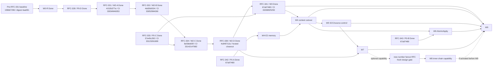

# RFC-294 实施路径：从散点 services 到分层 bounded contexts

- 目标架构状态：Approved（2026-08-30 review 记账：D1～D9 已由各 successor RFC 的逐项用户批准实质确认，见 `review-2026-08-30.md` §A1；本文刷新不授权任何未立项 wave）
- 迁移进度状态：Out-of-order in progress（RFC-287、RFC-297～343 已按各自范围形成
  production/architecture vertical slices；RFC-317/319/326～330 已 Done；RFC-328 完成 N2/P0-D 但不领取 W2 credit；
  RFC-329/330 只作为 W4 输入/纵切，不抵扣整波；RFC-288/289 已关闭且未实现；RFC-294 N1a/N1b 治理基线已落，
  RFC-331 T3～T12 / W2-A 与 RFC-332 T3～T13 / W2-B 均已发布并完成 provenance/exact-SHA hosted closeout；
  [RFC-333](../RFC-333-human-gate-atomic-park-and-continuation/proposal.md) 已关闭 P0-C residual 并完成 exact-SHA 主 CI/全部
  scheduled closeout；[RFC-334](../RFC-334-node-executor-registry/proposal.md) 已完成 T0～T12、hosted/scheduled closeout并关闭 W2-C；
  [RFC-339](../RFC-339-wrapper-runtime-cutover/proposal.md) 已完成 T0～T11、canonical 与 hosted/scheduled closeout并关闭 W2-D；
  [RFC-341](../RFC-341-lifecycle-committed-events-collaboration-commands/proposal.md) 已完成完整 W3；
  [RFC-342](../RFC-342-memory-scope-move-correctness/proposal.md) 与
  [RFC-343](../RFC-343-intent-apply-recovery-correctness/proposal.md) 已分别关闭 P0-A/P0-B）
- 规划单位：历史偏差收口 + P0 正确性阻断 + W0-R～W9 迁移波次
- 总原则：承认已落事实、前向修复前置偏差；单写源、逐 consumer 切换、每波可独立验收/回退；禁止
  big-bang 搬树

## 0. 批准边界与实施纪律

批准 RFC-294 只表示批准目标架构和以下路线，不等于一次性批准所有行为变化。执行时：

1. P0 的权限/恢复/原子性修复分别立 RFC，列能力影响并单独批准；
2. RFC-287 已按自己的批准范围落地并标记 Done，本计划把其 production behavior 当成受保护基线，不重新打开
   RFC-287。RFC-294 后来写入、但不属于 RFC-287 已交付合同的 durable ownership、source-control seal、原子 task
   admission、committed event 与模块归位，分别归入 P0-D、W0-R、W2～W5 的新合同，不能倒签成“RFC-287 已完成”；
3. RFC-288/289 保持 `CLOSED`，旧 plan 不得执行；W2 与 post-W7 fanout 能力分别使用新编号 RFC 重新取当前锚、过门和批准；
4. W3～W9 任何涉及 schema、行为、错误码、恢复或能力面的批次，按范围拆独立 RFC；
5. 每一波只允许一个 in-progress 高冲突批；共享 `main` 上精确暂存，不 broad-stage/stash/reset；
6. 目录迁移遵守 CLAUDE.md D18：逐域迁、旧路径留薄 facade、消费者归零后再删。

RFC-294 本身仍只授权设计，不授权后续生产迁移；但仓库已经通过各自获批的 RFC-287、RFC-297～337 产生生产变化。
本文因此把“架构批准状态”与“迁移事实”分开记录，不能再用“RFC-294 零生产改动”推导“目标架构尚无
任何落点”。

P0 correctness 不等待 W0-R 全量门落地；但任何 P0 新增/修改的 public/cross-context contract 在合并前必须附 exact 临时
surface ledger + API snapshot + field/method consumer + authority/tx/data-class，并运行与 W0-R 等价的 type-taint/capability-forge/
god-port 变异。N1/W0-R 已落，这些记录必须直接进入 canonical manifests，不能以“安全修复优先”为由先造无账接口。

## 1. 当前基线与量化口径

`3bfd5be87ba98e329e49432d2e59bff918a878ec` 继续作为本计划历史 measurement seed，不再充当 current snapshot。
N1 已把采集入口统一为 `bun run architecture:report` / `bun run architecture:write`：七份 canonical manifest 与
`architecture/current-report.json` 从同一 production AST corpus 生成。RFC-331 前的历史 source pin 为
`158b67296b05a11f22a92ab64b2045643f895f9f`，基线 digest 为
`sha256:4aa0818694f4fbf267e27dc0b62233bde60b110ca8d4b303ae066469ac0a3592`。W2-C production
payload/provenance 为 `1271ecb20ab1fdd1b58bc2903d4ddbc4c2d92e4e` →
`cfe1326b4e948c24772b06708f91e2526ba7022b`，digest 为
`sha256:4d0850a7315ac0064fc244ae9d040c92302d2d1d72f6ff5e5ed10eefae3c877e`。当前全仓 latest payload/pin/final SHA 为
`f94290d715365ee6c46e927c211a00326834157b` → `d2a4cc742c6dbb318b237ede15155b354cd79584` →
`67a97480c5944c723d3ee08490631e4db768a5c6`，digest 为
`sha256:3714450fee40135133fb94fb846d6f4f32369d00625d8f7249e6049a80c73805`。四份 RFC-317 治理 artifact 另保留
`originSha`，并以 `provenance.currentSnapshotSha + contentDigest` 指向 current payload；因此历史 seed、current content 与 hosted
exact-SHA verdict 已分栏，后续不得再把 ancestor-only、父提交、queued 或 cancelled CI 当作 current 证据。下列数字由已发布
report 生成；final implementation SHA `67a97480c5944c723d3ee08490631e4db768a5c6` 的 Main CI `33268925250` 与
8 个定时 workflow 均为 terminal `success`。

自本快照起采用 architecture-significance filter：只在 production context owner、public/required contract、schema/single-writer、
composition root、cross-context edge 或 worker/lifecycle owner 发生变化时重采 architecture baseline。纯 test/e2e/fixture、文档、
视觉原语和边角功能只更新质量/行为证据，不触发全量架构重采，也不给 W0-R～W9 wave credit。

> **指标只在生成文件里维护（2026-08-30 review §A2）**：下表「基线」列是 2026-08-30 前的手抄快照，已冻结不再更新；当前值以
> [`status.md`](./status.md)（`bun run architecture:status` 从 committed `architecture/*.json` 渲染，投影相等由守卫钉死）为唯一事实源。

| 指标                                |           基线 | 采集口径                                                                 |
| ----------------------------------- | -------------: | ------------------------------------------------------------------------ |
| dep graph modules                   | current replay | latest landed graph；31 accepted known、first-party unresolved=0         |
| backend production TypeScript       |            997 | `packages/backend/src/**/*.ts` production corpus；services=378           |
| `modules/**` production TS/TSX      |       454 / 12 | 12 个非空物理模块；`task-execution=125`、`collaboration=54`              |
| `scheduler.ts` / `task.ts`          |    523 / 7,396 | god-module 行数只作形状指标，不替代 symbol owner/consumer 账             |
| backend value SCC                   |              4 | RFC-331 已消除 task family；RFC-332 保持不回升；排除 type-only 后 Tarjan |
| repo value SCC                      |              6 | backend 4 + shared 1 + frontend 1                                        |
| `KNOWN_VIOLATIONS`                  |             31 | task-family 六条 exact `(rule,from,to)` debt 已删                        |
| route→DB value imports              |             15 | `no-routes-to-db`；另有 type-only，不计值通路                            |
| transport→DB value imports          |              2 | RFC-317 T41 把 WS registry/server 的 schema/client 直连纳入独立规则      |
| route/MCP files importing `AppDeps` |             53 | transport 反向依赖 composition root                                      |
| production ambient wiring seams     |            448 | register/global setter exact source inventory；后续只许按 owner 波次收敛 |
| background work entries             |            265 | periodic/long-running/execution-local/disabled 统一生命周期分母          |
| direct native `setInterval` calls   |  24 / 21 files | AST Identifier 口径                                                      |
| AtomicApply lifecycle engines       |              2 | BundleApply + Intent Apply                                               |
| human-gate route resume saga        |              0 | RFC-333 已切 canonical continuation；负扫描锁零                          |

`KNOWN_VIOLATIONS=31` 的已发布分类：

```text
circular ledger edges 11（backend 4 SCC families + shared/frontend 各 1 family）
services→routes 1
routes→DB 15
transport→DB 2
util→upper 2
```

`modules/**` 当前已发布 shape 有 454 个 production TS/TSX 文件、12 个非空物理模块：
`development-automation=115`、`identity-access=33`、`integration=31`、`task-execution=125`、
`digital-employee=23`、`source-control=22`、`event-center=20`、`code-capability=19`、
`execution-contract=7`、`task-catalog=4`、`collaboration=54`、`intent=1`。N1 已生成 W0-R 七份 canonical manifests；
“放进 modules”仍不等于完成 bounded-context cutover。RFC-317 B0 已把公共内核边界
重采成正式 census；current canonical report 为 inbound **89** 条、outbound **23** 条；
另有 cross-context/internal pilot debt。N1 将其投影到唯一 canonical 真值并建立全局 FK、required-port liveness 分类及
ambient/background/public-surface 全分母；物理 consumer/provider cutover 仍按各自 `removeAfterWave` 在 W4/W5/W9 前向收口。

N1 current canonical 分母：mutation **1016**、`node_runs INSERT` **2**、transaction external effect **281**、background **265**、
ambient **448**、observed cross-context import **1504**、exact architecture exception **1468**、facade/service owner **378**、
public surface **403**、governed field growth **5**、production module symbol owner **18780**；target implementation SCC=0，
unresolved first-party=0。required-port/target-edge 分栏继续由对应 canonical manifest 重放，不从旧文档常量推导。

每波开始重新采集；若基线因并发 RFC 合法下降，以新值为上限并同步本文实施记录。指标上升一律阻断，不能拿本表的
旧数字作为新增债务额度。

### 1.1 已落事实与 RFC-294 wave 判定

| 区域 | 当前判定                                | 已落事实 / 仍缺退出门                                                                                                                                                                                                                                                                                                                                                                              |
| ---- | --------------------------------------- | -------------------------------------------------------------------------------------------------------------------------------------------------------------------------------------------------------------------------------------------------------------------------------------------------------------------------------------------------------------------------------------------------- |
| P0-A | Done（RFC-342）                         | content-only PATCH、candidate-only Move、trusted RequestAuthority、双 scope transaction、version CAS、durable receipt、commit 后 WS 与 UI cutover 已落；`67a97480` hosted closeout 全绿                                                                                                                                                                                                            |
| P0-B | Done（RFC-343）                         | actual-chain lock、retryable compensation、V1 artifact codec 与 prepared/committed convergence 已落；`67a97480` hosted closeout 全绿                                                                                                                                                                                                                                                               |
| P0-C | Done（RFC-333）                         | 三类 open/decision 原子提交、canonical continuation、慢 sibling handoff、deferred-question 交接与 route direct resume=0 均已落；`57e45c292` 主 CI 35/35、七条 scheduled 19/19 success                                                                                                                                                                                                              |
| P0-D | Done（RFC-328）                         | durable owner/intent/effect/fence/maintenance/lineage、exact-token registry、TaskExecutionContext 与 lifecycle outbox 已落；W2 credit=0                                                                                                                                                                                                                                                            |
| P0-E | 已收束                                  | RFC-287 Done；RFC-288/289 CLOSED，结论分别转交 W2 新号实现 RFC 与 W7 后新号能力 RFC                                                                                                                                                                                                                                                                                                                |
| W0-R | N1 governance baseline Done             | 七份 canonical manifest/report、四 artifact current provenance、global FK、23 required-port liveness 分类、ambient/background/public 全分母已落；物理 debt cutover 不计本波 credit                                                                                                                                                                                                                 |
| W1   | behavior landed / architecture residual | RFC-287 的 assembly 与 G4～G7 产品行为作为既有基线；target module、ownership、admission/event/SC 边界仍待后续波次                                                                                                                                                                                                                                                                                  |
| W2   | Done（W2-A/B/C/D）                      | RFC-328 durable authority、RFC-331 topology、RFC-332 coordinator/DAG、RFC-333 P0-C、RFC-334 NodeExecutorRegistry 与 RFC-339 WrapperRuntime 均已满足并完成 hosted closeout；其余 wave 未完成                                                                                                                                                                                                        |
| W3   | Done（RFC-341）                         | task lifecycle 与 review/clarify/questions 已切 closed committed events/per-consumer delivery，continuous continuation owner、Event Center retry 与 legacy extinction 已闭合；`67a97480` 全绿                                                                                                                                                                                                      |
| W4   | A/C/E0/E7 Done；其余未开工              | RFC-344 关 W4-A、RFC-345 关 W4-C、RFC-346 关 W4-E7、RFC-347 关 W4-E0（W4-C 于 2026-09-02 完成 T9/T10，取证见其 `plan.md §7.6`）。**route→DB 与 AppDeps consumer 现均为 0**（2026-09-02 `current-report.json`；由 RFC-349 的 application-owned DB ports 顺带打掉，不等于 W4-B/W4-D 的正式退出，其 facade 22/exception 280 仍在）；W4-B、W4-D 余项与 E1/E2/E3/E4a/E4b/E5/E6/E8/E9/E10 仍须逐个立 RFC |
| W5   | partial vertical slices                 | RFC-308/310/321 已落 source-control candidate/commit/publication transport/credential seam；git SCC、repo/cache/workspace owner、SC endpoint/transport required SPI 与 opaque WorkspaceRef 未收口                                                                                                                                                                                                  |
| W6   | 未落                                    | RFC-310 development effect journal 属领域恢复，不是共享 AtomicApply；Bundle/Intent lifecycle 仍为 2                                                                                                                                                                                                                                                                                                |
| W7   | seed inputs only                        | RFC-306 consumed/skipped、DA/DE→Task provenance 与 RFC-314 per-run event oracle 已落；NodeRun v2 writer/backfill 尚未落                                                                                                                                                                                                                                                                            |
| W8   | deferred / optional                     | RFC-289 旧设计已关闭；只有 W7 后新号 fanout RFC 获独立批准才进入，不阻塞核心 W9                                                                                                                                                                                                                                                                                                                    |
| W9   | partial vertical slice / no exit        | RFC-322 收编 14 个 hourly phase；current background=364/ambient=492（2026-09-02，见 `status.md`；08-30 时为 265/448）；DA/DE/Event Center 等 worker 仍散落，ManagedBackgroundRegistry/readiness/stop receipt 未落                                                                                                                                                                                  |

### 1.2 前置偏差账

旧版路线要求 W0 + P0-A/B/C/D 全部先于 W1；历史实施并未按该顺序发生。RFC-287 已经落地，这个事实不回滚，也不能
伪造为“旧前置已完成”。处置只有前向修复：

1. RFC-287 已交付行为全部进入兼容 oracle，不以 RFC-294 名义重写；
2. P0-A/B/C 重新绑定其真实消费者，分别阻断 W4-E2、W6、W2-C/W3；
3. N1/W0-R、P0-D（RFC-328）、RFC-331 W2-A、RFC-332 W2-B、RFC-333 P0-C、RFC-334 W2-C 与 RFC-339 W2-D 已发布并完成 exact-SHA hosted closeout；
4. RFC-300～337 的已发布临时 seam 进入 facade/owner/background ledger，不因已有 module 文件、专项 architecture lock 或行为 Done 而豁免；
5. 任何新 schema/worker/port 都必须满足 W0-R 最小 surface/authority/forge gate，不能继续扩大偏差。

### 1.3 RFC-304～337 landed reconciliation

| landed slice                                | 对目标架构的确定输入                                                                                                   | 仍归 RFC-294 后续波次的 residual                                                                                                                                                |
| ------------------------------------------- | ---------------------------------------------------------------------------------------------------------------------- | ------------------------------------------------------------------------------------------------------------------------------------------------------------------------------- |
| RFC-304/307/309                             | 历史 code-capability 行为与查询 oracle                                                                                 | RFC-310 已退役 writer/executor；只保留 history/template compatibility，不得在 W2 恢复 code-round                                                                                |
| RFC-305                                     | identity-access role+grant 单写、access revision CAS/audit、opaque direct/delegated authority、WS revision fence       | full `Actor.permissions` 消费、public→infrastructure export、非 bootstrap composition 归 W4-E0/W9                                                                               |
| RFC-306                                     | branch activation、`skipped`、join/consumed semantics                                                                  | scheduler callpoint、selected generation 与 NodeRun provenance 归 W2/W7                                                                                                         |
| RFC-308                                     | source-control exclude/candidate/commit/CAS publish/conflict participants                                              | composition path binder、repo/cache/workspace owner 与 SCC 清零归 W5                                                                                                            |
| RFC-310                                     | `development-automation` 聚合/单写/内部层次、普通 agent host task、mission effect ledger/worker                        | exact public/required SPI 生产切换、inbound/bootstrap、WorkspaceRef 与 managed background 归 W2/W3/W4/W5/W9                                                                     |
| RFC-310 OS 与后续批次                       | `digital-employee` Case/Context/Attention/Reaction/Channel、`event-center`、`execution-contract` 与研发类型包/工具 I/O | 专项 manifest 已投影进 N1 canonical 真值；TE↔DE required SPI、provider/bootstrap/public cutover、managed worker 仍归 W4/W9                                                      |
| RFC-310 unified task creation/catalog       | 四个 TaskSource、统一 UI、`task-catalog` federation 与 TE/DE source adapter                                            | Catalog 仍传 full Actor/string filter/JSON string，route 直取 composition；归 W4-E10，不改变 active ExecutionKind                                                               |
| TaskCatalog visibility (`0203`)             | `public` / `internal` task membership、root stamp/child inheritance 与所有 public feed 共用 predicate                  | classification 归 TaskExecution，direct-id 保持审计语义；Catalog 仍传 full Actor/string filter/JSON，W2 保 launch/inheritance，W4-E10 收 typed public seam                      |
| Task↔EmployeeCase / Case name (`0205/0206`) | Task row 上 DE Case provenance ref、Case 单写 name 与详情 link                                                         | TE 只存 ref、DE 单写 Case；actor-filtered link projection 与 reader cutover归 W4-E1/E9，identity/backfill归 W7，expand-only rollback保留列                                      |
| RFC-311 committed PR-1～PR-7 + G4 + T20/T21 | index/query/archive/retention/maintenance 与 NodeRun prompt 大正文分档外置/永久双读 behavior oracle                    | prompt 仍在 root flat service；task query/provenance 与相对 artifact lifecycle 归 W4/W7/W9                                                                                      |
| RFC-312                                     | IA presence domain/application/infra、专用 WS、可撤销 grant 与二态 projection                                          | composition 仍直连 WS/WeakMap；public/inbound 归 W4-E0，grace/batch timer lifecycle 归 W9                                                                                       |
| RFC-313                                     | envelope retry/session restart 行为与 neutral attempt-cap oracle                                                       | neutral cap 算术先抽到 `platform/contracts`；TE/DE 各自 policy/state 不合并，TE NodeExecutor 迁位归 W2-C、config projection 归 W9                                               |
| RFC-314                                     | NodeRun event 有界读、session 窗口与 chunk append/flush 行为 oracle                                                    | 物理实现仍在 legacy services；task read/write owner 归 W2/W7，persistence/lifecycle 归 W9                                                                                       |
| RFC-315                                     | 统一 `event-automation-rules:*` 授权词汇；EventResponseRule/WebhookTrigger 各自 owner 语义保持                         | E0 仅供 authority 前置；EventResponseRule 收口归 W4-E9，WebhookTrigger route/table/service 收口归 W4-B integration slice                                                        |
| RFC-317（Done）                             | T10～T73/AC-1～14 全落；82 kernels/31 core、94 inbound/23 outbound、R1/R2/R3/R12 与 P1/P2 修复                         | N1 已统一四 artifact current provenance 并投影进 canonical RI；当前 155 guard/52 ledger 继续作为补充 oracle，边界 cutover归 W4/W9                                               |
| RFC-318（Done）                             | DA 九个 v2 business tool contract、最小 direct JSON I/O 与 XC projection oracle                                        | 未切 TaskEngine runner/startTask；XC projection 仍可选、TE catalog 仍读 legacy DB/service；归 W4-E8/E9                                                                          |
| RFC-319（Done）                             | user-facing E2E 840 capabilities 全 covered；endpoint uncovered 96、frontend route 4，四层高水位/负 fixture已落        | 是测试/覆盖治理线，不新增业务 context，也不抵扣 owner/consumer wave                                                                                                             |
| RFC-320（Done，`0207`）                     | IA 单写 profile/email 与 purpose-specific Git commit identity；Task 冻结 creator identity                              | auth/task 等 legacy consumer 与 route 直读仍在；current/delegated authority public cutover归 W4-E0                                                                              |
| RFC-321（Done，`0208`）                     | SC publication transport、用户/全局加密 credential、6 个 publication call-site ledger                                  | `RepositoryProviderEndpointDiscoveryPort` / `GlobalRepositoryTransportProjectionPort` 由 Integration adapter 实现；legacy/local/file fallback、path/central schema/root 债归 W5 |
| RFC-322（Done）                             | `maintenanceTicker` + 14 个 deterministic hourly phase；direct native timer 从 32/25 降到 19/18                        | 是 cadence/stop/slow-telemetry oracle，不是 ManagedBackgroundRegistry；业务 worker 与 local timer 全量注册归 W9                                                                 |
| RFC-323（Done，production landed）          | Integration-owned adapter definition/revision/connection + DE default/override frozen binding                          | Integration adapter 仍直查 resource grant schema/环境；RC visibility participant、secret projection 与 provider/bootstrap cutover归 W4-E8/E9                                    |
| RFC-324（Done，`0209`）                     | 13 类 ACL 的 `none/read/write/own`、14 类 grant addressability、task observer 与 scheduled-task read/write             | 已被 RFC-330 扩为 15/16；policy 仍在 legacy service、resource-catalog module 未形成，consumer cutover归 W4                                                                      |
| RFC-325（Done）                             | 前端 Select 搜索机制归一                                                                                               | 无 backend ownership/wave credit                                                                                                                                                |
| RFC-326（Done）                             | review anchor、批量 mutation/decision transaction、MCP 工具与网页 source-offset highlight；`collaboration` seed        | RFC-333 已关闭 P0-C；其余 collaboration public cutover 与 committed events 仍归 W3/W4                                                                                           |
| RFC-327（Done）                             | memory 多标签 any/all、facets 与 MCP query 透传；共享 tag matcher                                                      | 是 query/transport 纵切；Memory owner/public cutover与 P0-A 仍归 W4-E2                                                                                                          |
| RFC-328（Done，`0210`）                     | durable owner/intent/effect/fence/maintenance/lineage、exact-token registry/context、task lifecycle outbox             | 完成 P0-D/N2、W2 credit=0；task SCC 六边与四级 engine 归 RFC-331/W2-B～D                                                                                                        |
| RFC-329（Done）                             | 470-route current audit、四向 route/tool guard、23 新具名工具、368 exact leaf debt                                     | 是 W4-A replayable inventory；未建 operation id/catalog、未合并 handler、不抵扣 W4-A exit                                                                                       |
| RFC-330（Done，`0211`）                     | ACL 15/grant 16、DE tool/template ACL、EmployeeCase membership/owner 与 unified task-list projection                   | DE/ACL 功能纵切已落；resource-catalog owner、public/required SPI、route/bootstrap cutover仍归 W4                                                                                |
| RFC-331（Done）                             | instance-bound task topology contracts；四 drive、三 child-control、status/query 已断开 task SCC family                | W2-A 已关闭；frontier/engine 已交 RFC-332，node 已交 RFC-334；wrapper/status/completion 仍分属 W2-D/W3/W5                                                                       |
| RFC-332（Done）                             | 唯一 `TaskDriveCoordinator`、prep phase 0、三路 TaskEngine registry、DAG scope/graph/frontier 唯一 owner               | 只关闭 W2-B；`taskDriveLegacy` 在 W4 前保留单一 exact seam，W2-D/W3/W5 不因本 RFC 自动获批                                                                                      |
| RFC-333（Done）                             | 三类人工门原子 open/decision、canonical continuation、慢 sibling 与 deferred-question handoff；route resume saga=0     | 只关闭 P0-C；RFC-334 已消费该前置并关闭 W2-C，wrapper mechanics、committed events 与 public/legacy bridge 仍归 W2-D/W3/W4                                                       |
| RFC-334（Done）                             | 14-key closed NodeExecutorRegistry、typed workgroup host lane、neutral retry cap 与 legacy node selector extinction    | 只关闭 W2-C；当时保留给 W2-D 的三条 wrapper bridge后续已由 RFC-339 归零，后续 wave 未授权                                                                                       |
| RFC-335（implementation landed）            | IA 分离 `display_name` 与 `git_name`，新任务冻结 Git name/email，不再把产品显示身份误作提交身份                        | 是 identity-access/W4 纵切；各 RFC closeout 状态由其三件套维护，不倒签 W4 public/bootstrap consumer cutover                                                                     |
| RFC-336（implementation landed）            | 数字员工任务创建补协作者、工作分支、时长与 token 限额，参数进入 EmployeeCase/runtime owner                             | 是 DE/DA/W4 纵切；不提供自动提交推送开关，未完成 resource/public/required SPI 与 bootstrap 全量切换                                                                             |
| RFC-337（implementation landed）            | Case detail projection 与五页签可见性落地；detail DTO 最终收在 development-automation 私有 composition                 | 是读投影/UI 纵切；不扩宽 digital-employee public DTO，也不领取 W4 整波 credit                                                                                                   |

统一判定：上表只说明 capability/domain/internal-layering 已有真实落点；没有一行单独满足 W0-R～W9 的整波退出门。

## 2. 每波统一切换协议

每个 wave/sub-wave 必须使用同一五步：

1. **Baseline/Oracle**：先锁当前 API、状态、事件顺序、恢复、依赖图和异常路径；
2. **Additive contract**：落 domain/application port 和未接线实现，不改生产 writer；
3. **Single-consumer cutover**：一个 consumer/vertical slice 原子切到新实现；同步缩 debt ledger；
4. **Facade stabilization**：旧 import 只剩一跳无状态适配；新增代码禁止再依赖旧路径；
5. **Contract**：消费者归零且稳定后删 facade/legacy reader，收紧负扫描。

每波“输入”统一定义为：所有 DAG 前驱的 exact exit evidence + 当前 exact-SHA architecture baseline + 本波 scoped
behavior/wire/data oracle；后续章节只列该波的增量前置与动作，不重复抄通用输入。缺任一前驱证据或 oracle 时不得开工。

禁止两套独立业务 writer 双写。schema expand 兼容期允许**同一 writer、同一事务**维护 canonical 字段和确定性的
legacy projection；这不是两套业务实现。禁止以 runtime feature flag 长期双跑旧/新引擎。

### 2.1 Facade 账本

每个 facade 必须记录：

```text
oldPath | newOwner | allowedShape | productionConsumers | testConsumers
introducedBy | removeAfterWave | owner | negativeScan
```

`allowedShape` 仅可为 re-export 或参数/返回 shape 适配；不得含 DB query、状态、授权、重试、branch、broadcast、
fallback 或 module-level mutable state。新 module 禁止反向 import facade。

### 2.2 Schema 波规则

- 只 expand，不在同波 drop/rename；
- backfill 幂等、可中断、可重复；
- new vs legacy oracle mismatch 必须为 0；
- reader cutover 可 `git revert`，已应用 migration 不回滚；
- contract 前必须证明在途 task/resume 兼容，legacy archive 由 versioned codec 读；
- Linux/macOS SQLite migration 与 schema admission 双平台验证。

当前已发布 data horizon 还增加以下不可倒退 oracle：

- `0207` 已移除 schedule/webhook launch payload 中 client-owned Git identity；旧 Task 的 frozen pair 保留，rollback 只能停新 reader
  并 forward-repair，不能恢复入口自报 identity；
- `0208` 的 publication transport/credential rows 与密文必须保留；personal credential 已配置后认证失败不得静默 fallback global，
  被明确清除的 token 不得借 rollback 复活；
- `0209` 已把存量 grant backfill 为 `read` 并加入 revision；停新 writer 也不得降 schema 或把 `write/own/govern` 混回二值；
- RFC-323 的 immutable `development@9/@10` revision 与 frozen adapter binding/digest 都须可 replay，不得把 `@10` 暗投影回 `@9`；
- RFC-326 PR-A 无 migration，但 batch wire 的全量预校验与 review durable transaction 是行为下限，不得回滚为部分文档 mutation；
  route continuation saga 仍是存量 residual，不能反向宣称它已经消失。

## 3. P0：正确性与一致性阻断（独立 RFC，不计迁移 wave）

### P0-A Memory scope move 与 ghost event

**实施 successor**：[RFC-342 Memory scope move 事务正确性](../RFC-342-memory-scope-move-correctness/proposal.md)。
已于 2026-08-30 Done：content-only PATCH、candidate-only Move、可信 RequestAuthority、双 scope 同事务授权、version CAS、
durable move receipt、commit 后 WS 及现有编辑 UI Move cutover 均已发布；目标删除/权限漂移/版本竞争/rollback/prompt
audience/UI command-plan proof 已进入 hosted corpus。实现链 `9dc7e6ea8` → `74c0e72bb` → `e0ef3e51c`；final exact SHA
`67a97480c5944c723d3ee08490631e4db768a5c6` 的 Main CI `33268925250` 与 8 个定时 workflow 全部 terminal success。

**前置**：独立安全 RFC，用户拍板 candidate/approved/archived 的 move 能力。

**任务**：

- [x] `PatchMemoryContent` 只允许 title/body/tags，wire schema 与 service 双层禁止 scope 字段；
- [x] 新建 `MoveMemory` command；`CommandContext.RequestAuthority` 由可信 factory 构造，command input 只含 target、
      expected memory revision 与新 scope，不接收 Actor/permission snapshot；
- [x] 同一 `dbTxSync` 内重读 row、旧 scope 授权、新 scope 授权、目标存在性、状态 policy、audit/event；
- [x] approved/archived 不得静默改变注入受众；按批准结果禁止或变新 candidate 再审批；
- [x] `memory.updated` 移出事务，rollback 不得产生 ghost WS；
- [x] 覆盖跨 agent/workflow/repo/global 授权矩阵、目标删除竞争、版本竞争、rollback、prompt 注入 E2E。

**退出门**：generic patch scope move=0；新旧 scope 双授权全矩阵；事务 rollback 后 durable/WS 均无变化。
RFC-342 AC-1～AC-11 与 exact-SHA hosted closeout均已满足，P0-A 为 Done；只解除 W4-E2 前置，不倒签 W4。

**回滚**：恢复旧 content PATCH 但保持 scope 字段拒绝；Move endpoint 可不暴露。不能恢复已证实的越权面。

**冲突面**：memory route/service/shared schema/injection/broadcaster；与 W3/W4 同文件时排它。

### P0-B Intent Apply 立即正确性

**实施 successor**：[RFC-343 Intent Apply 恢复正确性](../RFC-343-intent-apply-recovery-correctness/proposal.md)。
已于 2026-08-30 Done：actual-chain lock cleanup、retryable compensation、V1 完整 artifact codec、
prepared/committed convergence 与 corruption/mutation corpus 已发布。主实现 `f21d6142a3c15f93a51fb21dcac063f22d3a94f3`；final exact SHA
`67a97480c5944c723d3ee08490631e4db768a5c6` 的 Main CI `33268925250` 与 8 个定时 workflow 全部 terminal success。

**前置**：不等待 W6 泛化引擎，先修已知恢复缺陷。

**任务**：

- [x] session lock 以 map 中实际 chain identity 清理；
- [x] compensation 任一失败时 journal 保持 retryable，禁止无条件 failed；
- [x] `skill-version-stage` 使用完整 versioned artifact codec，prepared/committed convergence 全覆盖；
- [x] post-commit throw 不补偿 durable commit；
- [x] lock 基数、crash points、重复 convergence、artifact parse corruption 有 mutation tests。

**退出门**：Intent 合同不弱于 BundleApply；W6 前仍可有两套代码，但不存在已知错误语义。
RFC-343 AC-1～AC-8 与 exact-SHA hosted closeout均已满足，P0-B 为 Done；只解除 W6 前置，不倒签 W6。

**回滚**：逐修复点 revert 只在 oracle 仍绿时允许；不得回到不可恢复终态。

**冲突面**：`intent/applyChangeset`、boot/hourly converger、skill/plugin artifacts；W6 排它。

### P0-C Human-gate open + Review decision 原子化

**完成 successor**：[RFC-333 人工门原子停驻与持久续跑](../RFC-333-human-gate-atomic-park-and-continuation/proposal.md)
已于 2026-08-28 Done。它把本节 residual 重取为 review/clarify/questions 两条链：open 通过
`PreparedHumanGateRef + TaskParkTx` 原子提交 gate/node/task，decision 通过 `CollaborationDecisionTx` 原子提交
领域决定、node/task transition 与 RFC-328 canonical continuation；T12 又闭合 claimed→pending handoff 与
auto-dispatch-deferred question 交接。payload/provenance `dda58935e` → `57e45c292`，主 CI 35/35 与七条 scheduled
workflow 19/19 jobs 全部 success。P0-C 为 Done；只解除 W2-C/W3 的该项前置，不倒签后续 wave 完成或生产授权。

**已落 baseline（不计 exit）**：

- [x] RFC-326 已落 simplified review anchor、批量 comment/selection/decision 的全量预校验与单 DB transaction，并种下
      `modules/collaboration` 的 review-anchor/public-query slice；这些只抵扣 review transaction seed，不等于 common continuation 已完成。

**任务**：

- [x] durable decision claim、doc snapshot、node/task transition、continuation intent 同事务；
- [x] clarify/review/questions 三类 gate open 先 durable prepare journal/claim，再以 `TaskParkTx` 同事务消费 prepared ref、
      提交 gate/doc manifest + node/task park + event；prepared 未消费/失败可补偿与 GC；
- [x] FS/output 用 prepare+journal/roll-forward，不在事务中 await；
- [x] review rollback 事务前只做 snapshot check-only；final tx 将 plan 与 continuation 一起写入现有 RFC-328
      `workspace-rollback` effect，RFC-332 coordinator 在 rerun 前结算 receipt/projection，不新增 worker；
- [x] WS 只在 commit 后发；review/clarify executor 的 W2-C cutover 必须等待 gate-open oracle 全绿；
- [x] route 只返回 actor-filtered gate view，不暴露 continuation/worker id，也不自己 mint/rollback/resume；
- [x] crash-at-every-boundary、重复 request、stale doc、部分 doc failure、resume failure 全矩阵均有 deterministic assertion 或真实进程 E2E。

**退出门**：不存在 parked run + partial docs、created ghost WS、“部分 doc 已决定、部分未决定”或“答案已存但永远未
continuation”的半态；三 gate open + review decision crash/replay 矩阵全绿。

**回滚**：保留 additive journal；cutover 可 revert 到旧 reader，但不能恢复非原子多写，必要时 fail-closed。

**冲突面**：review/lifecycle/task/routes/schema；与 W3 串行。

### P0-D 最小 durable Task ownership fence

**状态：Done（RFC-328，production 主实现 `650ced252`，修复链收口 `6af560df7`；containing SHA
`5c762c197` 的 CI `32998902223` / visual `32998902239` 均 success）。** 原计划要求它先于 RFC-287，历史顺序没有满足；
现已以前向修复完成，不重写 RFC-287 历史。

**任务**：

- [x] additive durable owner/intent/effect/fence/maintenance/lineage schema；epoch/revision 与 claim/takeover CAS；
- [x] daemon/worker identity 只由内部 factory 铸造，外部不能构造 current token；
- [x] manual resume/retry 先写 continuation intent，worker/scheduler/recovery 走同一 claim；
- [x] execution-plane task/node mutation 同事务 exact-token fence；control/recovery writer均有分类；
- [x] FS/Git/process/outbound 使用 record-before-act + multi-resource fence + epoch heartbeat；无法证明旧 handle 停止则
      recovery-required，禁止 takeover；
- [x] `TaskExecutionContext`/token 线程化进四 kick、mutation/effect/receipt 与 terminal path；
- [x] cancel/source-terminal 撤销 exact epoch，提交后 stop exact handle；shutdown reason保持非可选；
- [x] manual/auto/scheduler 并发 claim、lease expiry、stale commit、daemon crash、process/workspace/outbound recovery矩阵已锁。

**退出证据**：durable authority=1；stale epoch authoritative DB delta=0；同 resource acting attempt≤1；
production `driverLease` authority consumer=0；Task/NodeRun wire零 breaking delta。RFC-328 明确 W2 credit=0。

**回滚**：schema additive 保留；reader/driver 可停用新调度，但不能恢复已证实的并发写窗口。若无法安全恢复旧行为，
fail-closed 停止新执行并 forward-fix。

**后续边界**：schema/authority 不重做；task/scheduler 六边、read-model 与 driver port 由 RFC-331 承接，四级 engine 归 W2-B/C/D。

### P0-E 大件状态收束（已完成）

- [x] RFC-287 已按其批准范围完成并进入兼容基线；不再以 RFC-294 追补前置或扩充其 Done 定义；
- [x] 把 RFC-287 之后出现的架构 residual 逐项重新归属：assembly 物理归位进 W2，durable ownership 进 P0-D，
      repository/task admission 与 SC seal 进 W2/W4/W5，committed event 进 W3；不得继续挂在 RFC-287 名下；
- [x] RFC-288 标记 `CLOSED`（未实现、零生产改动）；九条稳定结论与六条 exact depcheck ledger 转入 RFC-294 W2，
      旧 plan 永久停用；
- [x] RFC-289 标记 `CLOSED`（未实现、零生产改动）；产品目标保留，五条 identity/provenance 要求转为 W7 后新号
      fanout 能力 RFC 的输入；
- [x] 关闭项不再充当 DAG gate：W2 与 post-W7 fanout 分别另立新编号、按届时真实源码过门。

### 3.1 Wave/sub-wave 依赖 DAG



RFC-303 已是 committed Done baseline，不再保留 `C0`；历史 N0 build repair 也已由后续 clean containing commits 关闭。
历史 pin `158b67296` 已包含 RFC-317/319/326～330 Done 与 RFC-328 P0-D；基线 report digest 为 `4aa081…`。
RFC-331 current payload `262f34bf7` 的 digest 为 `e9f8a0…`，provenance repin 为 `89b19057d`；最终 containing SHA
`4152b377a` 的 exact-SHA CI `33034946053` terminal `success`（35/35 jobs）。source pin、current exact-SHA verdict、containing evidence 与
architecture counts 始终分栏，不用任一祖先结论代替当前提交的判定。
N1/W0-R、N2/P0-D、RFC-331 W2-A、RFC-332 W2-B、RFC-333 P0-C、RFC-334 W2-C、RFC-339 W2-D、RFC-341 W3、
RFC-342 P0-A 与 RFC-343 P0-B 均已满足并完成 exact-SHA hosted closeout。RFC-344 已关闭 W4-A 与 W4-D duplicate-root residual；
RFC-347 已关闭 W4-E0；RFC-346 已关闭 W4-E7；三者均有 published exact-SHA Main + 8 schedules 终态成功证据。W4-C 的
RFC-345 仍为 In Progress，T4～T9 继续按独立 cohort 推进；W4-B、W4-E 其余 slices 与完整 W4-D 仍须另立 RFC 并单独获批。
RFC-288/289 只作历史输入，不是节点。W5 的每个 SCC family 需 W4 已断 transport/root 回边；W6 在 W4 +
P0-B 后可与 W5/W7 的设计准备并行，但 schema/start owner 必须排队。W8 是 post-W7 独立能力线：未获批时保留挡板并
跳过，不阻塞 W9；若同一 release 激活，则必须在 W9 清仓前汇入。

### 3.2 从当前 HEAD 起的执行队列

| 顺序 | 批次                                | 本轮产出                                                                                                                                                                                                            | 开工/停止门                                                                                                                |
| ---- | ----------------------------------- | ------------------------------------------------------------------------------------------------------------------------------------------------------------------------------------------------------------------- | -------------------------------------------------------------------------------------------------------------------------- |
| B0   | baseline refresh（本设计已完成）    | 保留 `158b67296` / `4aa081…` 为 RFC-331 前历史基线；current payload `262f34bf7` / digest `e9f8a0…`，containing SHA `4152b377a` CI success                                                                           | source/hosted/behavior/architecture evidence 分开归因                                                                      |
| N1a  | current manifest provenance（Done） | 保留 RFC-317 Done oracle，统一 commons manifest/debt、guard、ledger baseline 的 origin/current SHA + content digest；补 replay/tamper equality                                                                      | 已落：ancestor-only 判据升级为四份 content-addressed current snapshot                                                      |
| N1b  | W0-R canonical completion（Done）   | 把 RFC-317 subset 生成/投影进七份 canonical manifest，补 owner/symbol/edge FK、required-port liveness、ambient/public/background 全分母                                                                             | 已落：唯一 canonical 真值、global referential integrity 与 mutation gate；不计 production cutover credit                   |
| N2   | P0-D / RFC-328（Done）              | durable owner/intent/effect/fence/maintenance/lineage、exact registry/context/outbox已落                                                                                                                            | containing SHA `5c762c197` hosted CI/visual success；W2 credit=0                                                           |
| N3   | RFC-331 三件套（Done）              | current四kick/三child-control/status/call-graph/六账 inventory，锁 D1～D8、两刀切换、零能力影响与DEV-1                                                                                                              | 文档与用户批准门已完成                                                                                                     |
| N4   | RFC-331 W2-A（Done）                | A1+B1～B4 与 E3 已切，`KNOWN 37→31`、task SCC family 消失；payload/provenance 已真实固定，exact-SHA CI 35/35 success                                                                                                | `81d97d060` → `262f34bf7` → `89b19057d` → `4152b377a` / `33034946053`                                                      |
| N5   | RFC-332 W2-B（Done）                | 唯一 drive coordinator、repository preparation phase 0、三路 TaskEngine、DAG owner、exact W2-C/D/W3/W5 bridge 与 canonical scheduler owner 已形成；value SCC 保持 `4/6`                                             | `b63733a4f` → `a36fd94c2` → `4dd30d034`；CI `33052994260` 35/35 success                                                    |
| N6   | RFC-333 / P0-C residual（Done）     | 三类 open/decision 原子 participant、canonical continuation、boot recovery、真实 SIGKILL、慢 sibling/deferred-question handoff 均已落                                                                               | `dda58935e` → `57e45c292`；CI 35/35、七条 scheduled 19/19 success；W2-C 前置解除                                           |
| N7   | RFC-334 / W2-C（Done）              | 14-key NodeExecutorRegistry、typed host lane、neutral cap、legacy node selector/host body 与两条 W2-C exception 归零；三条 wrapper bridge 留 W2-D                                                                   | `1271ecb20` → `cfe1326b4`；`8e58eb05f` CI `33142147682` 35/35；七条 scheduled 19/19 success                                |
| N8   | RFC-339 / W2-D（Done）              | closed WrapperRuntime、Loop/Git/Fanout strategies、ExecutionScopeIndex、ExecutionMergeRecovery 与 bootstrap-only composition 已落；legacy wrapper/replay owner/bridge 归零                                          | `0c9c48e68` 主实现；payload/pin `5ac1e1c64` → `4c8497c2a`，digest `a0fd3ea9…`；exact-SHA hosted/scheduled closeout success |
| N9   | RFC-341 / W3（Done）                | task lifecycle + review/clarify/questions committed events、per-consumer delivery、持续 continuation worker、Event Center运维面与 legacy extinction 已完成                                                          | final `67a97480`；Main CI `33268925250` 与 8 个定时 workflow terminal success                                              |
| N10  | RFC-342 / P0-A（Done）              | content-only PATCH、candidate Move、双 scope transaction、OCC receipt、commit 后 WS、UI cutover 与 prompt audience proof 已完成                                                                                     | `9dc7e6ea8` → `74c0e72bb` → `e0ef3e51c`；final `67a97480` hosted closeout success                                          |
| N11  | RFC-343 / P0-B（Done）              | actual-chain lock、retryable compensation、V1 artifact 与 prepared/committed convergence 已完成                                                                                                                     | `f21d6142a`；final `67a97480` hosted closeout success                                                                      |
| N12  | RFC-344 / W4-A（Done）              | stable OperationCatalog、52/52 MCP closed binding、single handler root、identity/development pilots 与 API docs projection 已落                                                                                     | final `c5c4faafc`；Main `33298828254` 与同 SHA 8 schedules terminal success；只额外关闭 W4-D duplicate-root residual       |
| N13  | RFC-347 / W4-E0（Done）             | trusted direct/delegated request authority factory、presence/WS 收编、central `Actor` constructor 与 DB-keyed module cache 退役；remaining legacy projection按 E1/E2/E3/E8/E9/E10 精确入账                          | final `7ede76a8`；Main `33317698270` 与同 SHA 8 schedules terminal success；不等于其余 W4-E slices Done                    |
| N14  | RFC-345 / W4-C（Done）              | 四 roster、`ResourceCatalogQuery`、四 named participant、六 aggregate cohort、package 七 participant 与 operation binding 已落；T9 退役 11 条 exact debt edge 并删掉第 11 个 facade，其余 11 条按 consumer 归属转交 | 功能链 `50e2b3e47` → `f4c1e4ceb`；Main CI `33633631833`（`78dcc5999`，35/35）与 8 条定时 workflow terminal success         |
| OPT  | W7 后新号 fanout capability RFC     | SelectedRunMap、exact consumed edge、consumed-aware reuse 与能力扩张矩阵                                                                                                                                            | 仅 W7 exit 后；未批准则保持挡板、跳过 W8                                                                                   |

P0-A、P0-B、W3、W4-A、W4-E0 与 W4-E7 已关闭各自 successor；它们不再被错误地用作其它 wave 已经落地的证明，也不倒签后续
slice。RFC-345 / W4-C 已于 2026-09-02 Done（T9 的「RC 侧退役 / consumer 侧转交」口径由用户当日裁定，逐条见其
`plan.md §7.5`；hosted 取证见 §7.6）。当前无 active production migration；W4-E2 可消费 P0-A，W6 可消费 P0-B，但各自仍须通过本 wave 的功能、
transaction、compatibility 与 exact-SHA hosted gate。

## 4. W0-R：重建架构基线、owner 账本与机器栅栏

**前置/完成记录**：`3bfd5be87` 只保留为历史 measurement seed。N1a 已把四份 RFC-317 artifact 统一为
`originSha + currentSnapshotSha + sha256 payload digest`，并以 pin-tree replay/tamper equality 证明 current payload；N1b 已把 RFC-317
subset 投影进唯一 canonical manifests/report。P0-D 设计可提前并行；所有生产 cutover 仍需各自批准。

这是已完成的**历史治理主线**。cross-context/exact-entrypoint/type-taint/capability-forge/god-surface pilot 与 RFC-317 完整
公共内核 subset 已完整收口；本波复用 RFC-317 Done 输出，把 subset 合并成唯一 canonical 分母，而不是
重开 RFC-317 或再造第四份 owner/debt 真值。

**已落 pilot（不计 wave exit）**：

- [x] `rfc294-architecture-preflight` 已覆盖 module→module static/type/dynamic/re-export/import-type、exact public entrypoint、
      recursive type-taint、capability cast/spread/mutation/serialization 与 recursive god-surface 反事实；
- [x] 当前 module ratchet 精确钉住两条 integration→task internal debt与一个
      `integration/public/mrTerminalControl.ts` 非 exact 入口；新增同类债会红；
- [x] RFC-305/308/310 有各自专项 owner/layer/cutover lock，可作为全局 gate 的 characterization；
- [x] RFC-317 T10～T73/AC-1～14 已落；`architecture/{commons-manifest,commons-debt,guard-manifest,ledger-baselines}.json`、正式 census、
      R1/R2 exact edge equality、R3 shape、R12 type 扩面与账本高水位：82 kernels/31 core、94 inbound/23 outbound；N1 后为
      155 guards/52 governed ledgers，历史 pins 只作 `originSha`，current payload 由 full SHA + digest 重放；
- [x] 同批已落 owner/archive/ACL13、identity dispatch、spawn/fs/tx/path/nonce/prompt fence、
      registry reverse-completeness、terminal kind/schema/migration-ledger 修复；guard 当前分母 155，全部 classified/fixture-mapped；
- [x] N1 已补齐七份 canonical manifests、owner/symbol/edge foreign key、required-port production liveness 分类、
      ambient/background/public-surface 全分母与 CI 变异门；最终 consumer/provider cutover 仍按 20 条 `declared-debt` 的 owner/wave 推进，
      不作为 N1 production credit。

**动作**：

- [x] 已统一四份 artifact 的 provenance：显式 `originSha` +
      `currentSnapshotSha/digest`；replay/tamper gate 必须验证 pin-tree 与当前 manifest/debt/guard/ledger 内容，不得仅改短 SHA或只验 ancestor；
- [x] 已把本计划 §1 指标与 RFC-317 census 做成同一可复跑 architecture report；`commons-manifest` 每项外键到
      `module-symbol-owners`，`commons-debt` 外键到 canonical import/facade/symbol ids，`guard-manifest` 保持补充性守卫 registry；
- [x] 已从 production source 重新采集 modules/SCC/KNOWN/route→DB/AppDeps/background/ambient/facade，并把
      当前 snapshot 变成仓内可复跑报告；published full SHA 由 provenance 指向，任何差异按 exact edge 解释；
- [x] 已对 repo/backend SCC、KNOWN 分类、route→DB、AppDeps、ambient wiring、facade、cross-context internal import 建棘轮；
- [x] 已修正两条 `no-transport-to-db` 的 stale successor：分别重绑到 W4 的
      inbound/WS visibility port cutover 与 W9 的 bootstrap/auth-helper 收口，并登记 owner/removeWave，不得继续挂在关闭批次下；
- [x] 已把“edge 不变但 surface 增长”纳入 symbol/field ledger：登记 shared
      `TaskCatalogVisibility`、`tasks.catalog_visibility`、`StartTaskDeps.catalogVisibility`、四个 internal writer 与一个 Catalog source
      consumer，以及 `tasks.digital_employee_case_id` / `employee_cases.name` 的 owner、projection consumer 与 rollback；R1/R2 总数
      未增不能抵扣这组新 field/method consumer；
- [x] 已生成七份 exact manifest：mutation entrypoints（authority/auth/OCC/tx/audit/event）、transaction external effects、
      background jobs/timers、cross-context imports、facades、`architecture/public-surfaces.json`、
      `architecture/module-symbol-owners.json`；每份有机器分母、owner 与
      最终判据，public surface 另做 API snapshot、exact consumer allowlist、consumer-method + recursive-field matrix、
      transitive leaf/union budget 与 stale/unknown gate；
- [x] 新 `modules/**` 已启用层级规则，domain/application 立即 fail-closed；
- [x] 机器已区分普通 infrastructure、consumer required-port use 与 provider `application/adapters`：每个 active port
      ledger 只放行“本域 required SPI + 一个 provider offered participant”或“一个 consumer required SPI + 本域 internal
      ports”，consumer owner、provider adapter owner/edge、唯一 composition 都有 FK，生成的 target implementation graph 无 SCC；
- [x] type-only 仅可指向 exact `public/{types,events,participants}`；required SPI 只经
      `composition/required-ports`，禁止借类型 import 暴露 internal shape；
- [x] 已建 current file→target owner map，当前 366 个 service 文件各有 owner 或明确 legacy facade 归属；正式分母由
      干净 SHA 报告生成，不把 366 写成永久常量；
- [x] 已把 RFC-297～326 已发布的 `modules/**`、CLI、timer、register、migration/column 全部入账；特别锁住
      integration composition→task composition、integration application→task application/internal、application 直接 new
      infrastructure 三类 pilot 越界，修正或登记 exact、到期可删除的临时 exception；
- [x] 已把 gate source 从 `modules/**` 扩到 inbound/legacy callers：`routes|services|cli|server → modules/*/(domain|application|engine|infrastructure)`
      未记账边必须为 0；当前 RFC-317 census 的 94 条 inbound 与 23 条 outbound 逐 exact symbol 归 owner/remove wave，
      不能由“module 内部 depcheck 全绿”洗白；
- [x] 已给 required-port 增 liveness/provider gate：`active` SPI 必须有 production consumer owner、exact provider adapter owner/edge 与唯一 composition；
      不完整的 20 条合同全部为有 remove wave 的 `declared-debt`，其中 RFC-310 required ports 与实际 `ReconcilerPorts` 的物理收敛归 W4/W5；
- [x] 已建 `architecture/module-symbol-owners.json`：每个 production file 恰属一个 context+layer；legacy god file 按 exported/
      private symbol/capability 分解目标 owner/layer，不能用“scheduler 整文件归 task”掩盖 Task/Wrapper/Executor/Assembly 混居；
- [x] `module-symbol-owners` 已作为 canonical non-overlap root/owner registry；public surface 以 `ownerEntryId/symbolId` 外键、
      cross-context edge 以两端 `symbolId+entrypoint` 外键关联，AST export/import 双向闭合，referential integrity=100%；
- [x] 已从 canonical manifests 生成/校验三类 context edge：offered consumption、required-SPI provider implementation、IA authority
      type-only；与 design §3.1 DAG/type-only matrix、§3.4 public-surface 表双向相等。同一 context pair 同时承担 offered 消费和
      required implementation 时保留两个 exact edge id，不得按相同 from/to 折叠；缺边、多边、错 role/direction 的变异必须红；
- [x] 已 inventory 所有 `node_runs INSERT` 并加“新 INSERT path 不得出现”负扫描，为 W2/W7 单 writer 提供基线；
- [x] 已落最小 `PublicErrorDTO + toPublicError` allowlist，阻止后续 adapter cutover 复制可枚举 private cause；
- [x] 已定义 periodic `BackgroundJobDefinition` + long-running `ManagedWorkerDefinition` 的
      phase/dependency/readiness/state contract；W2/W3/W6 及之后任何新 daemon background work 必须从出生注册，
      W9 只收编 manifest 中的存量 scattered background work（periodic + long-running；execution-local 只归 owner 生命周期）；
- [x] 每模块 composition exact entrypoint 只允许 bootstrap consumer；bootstrap deep-import infrastructure 和业务 branch
      负扫描；
- [x] 已扩 exact exception schema：`rule/fromPath+symbol/toPath+symbol/edgeKind/owner/why/introducedByRFC/removeAfterWave/
expiresOn/mutationTest`；禁 glob/pathNot/目录豁免，unknown/stale/expired 全红。Unresolved first-party、forbidden type
      taint、capability伪造、export\*、未分类 context/layer 不得豁免；
- [x] capability forge gate：production object literal/`as`/deserialize 不能铸 Actor/current authority/ownership/apply/
      task-effect/tx capability；只有 owner factory可构造，capability 不得进入 wire/event/durable codec；dynamic import/
      re-export/`import('x').T` 同样进入依赖和 type-taint 图；“复用真 RequestAuthority/claim 后 spread 改 subjectRef/
      now/kind/ids”变异必须红；
- [x] 已给新 dependency/FK/provenance rule 做配置与 artifact 变异测试，证明规则真的能红；
- [x] CI/static scan 已接线，保持 depcheck unknown/stale/first-party-unresolved 三判据。

**N1 实施记录（2026-08-26；以下分母已由 current report 续采）**：

- 唯一生成入口为 `scripts/architecture-census.ts`；`report` 只读，`write` 原子刷新七份 canonical manifest、current report 与
  RFC-317 四份 projection，CI 使用同一 `buildCanonicalArtifacts/validateCanonicalArtifacts`，不存在独立测试分母；
- provenance 用两提交协议闭合：payload commit 固化全部 N1 内容，紧随的 metadata-only commit 把四份 artifact 的
  `currentSnapshotSha` 钉到 payload commit；fresh checkout 可用 `git show <sha>:<path>` 重放，tamper/non-full/dangling pin 均红；
- global FK 当前覆盖 18186 个 file/symbol owner、1339 条 observed edge、1304 条 exact exception、379 个 facade、358 个 public symbol、
  23 个 required port、5 条 governed field growth 及 RFC-317 kernel/debt projection；
- N1 新增的 production 文件只定义 `PublicErrorDTO/toPublicError` 与 background lifecycle contract，未切换现有调用方、未迁 schema、
  未改变 runtime 行为；20 条 required-port `declared-debt` 和现有 legacy/facade debt 继续由 W4/W5/W9 消债。

**退出门**：基线、RFC-317 subset projections 与七份 canonical manifest 可重复且无双 owner/双 debt 真值；所有 current snapshot
pin/digest 均可从 fresh clone 重放为当前 artifact，origin seed 另栏解释，non-ancestor/dangling/mismatched `recordedAtSha` 为 0；所有现有 `modules/**`
与 legacy production symbol 无未分类入口；规则变异必红；新增违规/ambient/facade/public export 无法
静默进入；账本 stale consumer/symbol 必红；
context DAG/type-only matrix/public-surface 表与 manifests 双向相等；public/private error 隔离有序列化负测；生产行为零变化。

**回滚点**：整批 gate 可 revert；不得先搬代码再撤规则。

**冲突面**：`.dependency-cruiser.cjs`、depcheck、gate/CI、architecture tests 单 owner。

## 5. W1：RFC-287 已交付基线与 residual 重新归属

RFC-287 已标记 Done，本计划不重新定义其批准范围，也不把后来形成的 RFC-294 目标合同倒签给 RFC-287。W1 现在只承担
两件事：保护已经上线的行为 oracle，以及把尚未落地的**架构 residual**送到正确的后续 owner。

### 5.1 已吸收的 production baseline

- [x] T1～T9：五条 assembly consumer 已统一走 `runAssembly(spec)`；run-row resolver、豁免与灭绝锁已落；
- [x] T10/G4：RFC-287 已批准并交付的配额设置面与池/child-budget 修复作为兼容基线；
- [x] T11/G5：公共 `file://` 拒绝与 HTTP Git fixture 作为不可回退的安全收缩；
- [x] T12/G6：失败分类、`LC_ALL=C`、timeout/config 与窗口化重试作为当前行为基线；
- [x] T13/G7：task 落库后准备、可见 `__repo_prep__`、失败留痕、无错误 prune tombstone、metadata 回填与可取消 Git
      进程作为当前行为基线；multipart/pre-created/call 继续预物化；
- [x] `3030d36e` 第四轮实现门：source-task 同步 lane、ref/Git identity 重试保真、stale preparation artifact 回收、
      abort/auto-resume/superseded guard、partial-clone GC 与 warm-submodule signal 接线已进入 published oracle；后续发布仍须按
      exact containing SHA 验证远端 ancestry 与 CI；
- [x] RFC-287 索引状态与实现提交已进入历史，不因 RFC-294 前置偏差而回滚。

当前实现形状也必须如实冻结：assembly 仍在 `services/schedulerAssembly.ts`；G7 preparation 仍由 `startTaskImpl` 推进，
synthetic run 与 task admission 不是同一事务，且 stronger “所有入口共用 runTask 第 0 步 + durable operation/receipt”合同尚未
成为生产事实。它们不是 RFC-287 回归，而是 RFC-294 后续行为/边界候选；若保留目标，必须单独 RFC、单独能力影响与
crash/replay oracle。

### 5.2 Residual 去向（不再挂 RFC-287 名下）

| Residual                                                                                  | 新 owner / wave                                                   | 开工门                                                     |
| ----------------------------------------------------------------------------------------- | ----------------------------------------------------------------- | ---------------------------------------------------------- |
| `runAssembly` port、target module、legacy import/facade                                   | W2-A topology cut，最终归 `task-execution/engine/kernel/assembly` | W0-R + P0-D + 新号 W2 implementation RFC                   |
| process-local active handle 与 durable execution authority 分离                           | P0-D；RFC-303 supervisor 只作 handle cache seed                   | RFC-303 已落 oracle + W0-R capability gate                 |
| task + repository step 的原子 admission、claim、operation/receipt、retry/resume/boot 同路 | P0-D + W2-B TaskEngine，另立行为 RFC                              | 不得以“目录迁移”夹带；先锁 RFC-287 当前 wire/status oracle |
| raw repository source seal、fire-time revalidation、SC frozen preparation policy          | W4-E1 + W5 source-control                                         | task admission 与 SC purpose-specific participant 获批     |
| task/prep transition 的 audit + committed event、after-commit WS                          | W3                                                                | P0-C + W2-D                                                |
| quota/config typed projection 与 ambient lookup 清理                                      | W4-E4b / W9-A                                                     | 保持 RFC-287 已上线默认值和可见行为                        |

**W1 判定**：RFC-287 产品交付为 Done；RFC-294 原 W1 architecture exit 为“未满足、已重分配”，不再保留一个假装可
补勾的 W1 checklist。W0-R 必须为当前实现重做 behavior/source inventory，后续每个 residual 只在其新 wave 的退出门计账。

**不可回退项**：不得恢复公开 `file://`，不得恢复 stale source 静默启动，不得删除现有 `__repo_prep__` 可见性或让既有
task stranded。后续重构只能行为对拍或通过独立 RFC 明确改变能力。

## 6. W2：Topology、Driver 与四级引擎

**前置状态**：W0-R 与 P0-D/RFC-328 已完成；基于 RFC-287/300/301/303/306/310/328 committed 事实建立的
RFC-331 已获批准并完成发布，W2-A 为 Done；RFC-332 已完成发布与 hosted closeout，W2-B 为 Done。RFC-288 只提供关闭时保存的
九条结论，不再修订、不再充当 gate。W2 不等待“补做 W1”，只消费 §5 已冻结的 production baseline；RFC-331 只批准 W2-A，
RFC-332 的批准只覆盖 W2-B，不自动批准 W2-C/D。

> **执行种类刷新（RFC-304 → RFC-310）**：持久 schema/history 的 `ExecutionKind` 仍能解码
> `workflow | agent | workgroup | code-round` 四个 discriminant，但当前可准入 `StartExecutionRequest` 只有前三种。
> RFC-310 已删除 code-round writer/executor；新 launch/webhook fail-closed，历史 interrupted row 以
> `code-round-retired` 可见失败结算。`development-automation` 的 AgentAttempt 复用普通合成 workflow/agent host task，
> 不形成第五种 execution kind。为兼容历史 snapshot，`code-round` 也仍是 `NodeKind` closed catalog 中唯一
> synthesized-only/retired kind；W2 必须保留 versioned history reader 与 fail-closed retired outcome，禁止重建其 executor。

### W2-A 四合同 topology cut

- [x] RFC-328 已把同一个 `TaskExecutionContext` 线程化进 initial/resume/retry-prep/retry-node 四个 kick；
- [x] RFC-328 已落 exact-token `TaskRuntimeRegistry`、durable ownership/intent/effect/fence 与非可选 shutdown reason；
      `driverLease.ts` production authority consumer=0，不再新建或替换 backing；
- [x] RFC-331：`SchedulerDriverPort` 由 composition factory 实例构造并作为必填依赖注入；禁止
      `registerSchedulerDriver`、module-global mutable locator、production optional fallback；
- [x] RFC-331：`TaskStatusPublisher` 只做现有 ephemeral WS projection；RFC-328 durable lifecycle outbox保持唯一，
      不再把 W3 写成“未来才第一次有 outbox”；
- [x] RFC-331：拆成 status projection 与 call-graph workspace 两个 purpose-specific read model；不搬 full `getTask`，
      workspace materialization 终局迁位仍归 W5；
- [x] RFC-331 Cut A 已发布：A1 + B1～B4 与四 kick cohesive cut，前 5 条 task circular exact ledger 已删；
- [x] RFC-331 Cut B 已发布：E3 call-graph query 已切，第 6 条 ledger 已删；两个逻辑 cut 都未新增临时 KNOWN；
- [x] RFC-328 已锁 `abortAll(reason)`、shutdown interrupted、orphan/recovery 与 exact handle 行为；RFC-331 保持 oracle；
- [x] RFC-331 的无状态 legacy topology adapter 按 facade ledger 登记 removeAfterWave；W2-B 才迁 frontier/graph 纯核，
      不夹入本次六边 topology cut。

### W2-B TaskEngine decomposition

> 承载 RFC：[RFC-332 TaskEngine 拆分](../RFC-332-task-engine-decomposition/proposal.md)（Done，2026-08-27；
> baseline source `b598d4a35e681d3623f44c15ef632d50a2b710d9`；最终功能快照
> `4dd30d034f1bcb0c6532301cec11bdd288702105`，CI `33052994260` 35/35 success）。

- [x] inventory DAG task、workgroup round、dynamic workflow 的所有生产入口、resume/recovery/terminal 路径；
- [x] 把 RFC-287 `__repo_prep__`、RFC-301 immutable `launch_origin`、RFC-300 prune claim、RFC-303 source termination、
      RFC-306 branch `skipped/consumed` 与 RFC-310 AgentAttempt host task 纳入同一 admission/drive/settle inventory；
      不得在拆 engine 时丢失任一 fence/历史终态；
- [x] 保持已落的 TaskCatalog membership：root admission 只能由 task-owned trusted launch adapter 铸
      `public|internal`，call child 在同一 INSERT 事务继承 parent，普通 transport 不接受 visibility；禁止从 ExecutionKind/space kind/
      `digital_employee_round_id` 动态反推，后者只供一次性 legacy backfill；以现有两值 codec、root/child 行为 oracle 与 storage decode
      保持数据域，禁止拆 engine 时默认回 public；本波不新增权限策略或写点加固；
- [x] 提炼 `TaskEngine` 最小 interface；workflow/agent/workgroup 三个 active admission 分支保留各自 domain state machine，
      只共享 ownership/lifecycle/kernel ports；不得把 TaskSourceId 或历史 code-round 当成第四个 active engine；
- [x] 按 single consumer 切换，旧 scheduler/task inline frontier/drive body 归零；
- [x] workgroup host execution 只调用共同 NodeExecutor/Assembly，不把 round assignment 混入 DAG。

最终证据：canonical denominator 为 mutation `911`、cross-context `1049`、exception `1023`、facade `371`、
public surface `300`、owner `17622`；新增 bridge 全部具名 RFC-332 与 remove wave，backend/repo value SCC 保持 `4/6`，
没有恢复 task SCC 或新增 `KNOWN_VIOLATIONS`。四份 N1a provenance 已重放到
`a36fd94c28d1b8300e9b67c0b0ca5c3dcc6d0761`，canonical source digest 为
`sha256:db8ee412d9cb1d96fede43392faa65095ccd2447f5af16f88dd805325daa6084`。

### W2-C NodeExecutorRegistry

2026-08-28：successor [RFC-334](../RFC-334-node-executor-registry/proposal.md) 已在开工 source pin `0d296ff1b` 完成
14-kind、`runOneNode`、workgroup host、review/clarify 与 RFC-313 neutral-cap consumer 调研，并完成 proposal/design/plan、
T2～T12 生产实施与 hosted/scheduled closeout。W2-C 正式 Done；W2-D 后续已由 RFC-339 完成并关闭。

- [x] 在迁 NodeExecutor policy 前，把 RFC-313 的 `retryAttemptCap` 纯算术、ceiling 与 exact codec 抽成
      `platform/contracts` 中性 value/policy contract，登记 task-execution 与 digital-employee 两个真实 consumer；它不读取配置、
      不决定 followup/restart/reaction/outbox，也不持有 attempt/session 状态；
- [x] inventory 当前 closed catalog 的 14 个 `NodeKind` dispatch，并单列 user-authored、synthesized-only 与 retired kind；历史
      `code-round` 同时存在于兼容 `ExecutionKind/NodeKind`，只注册 fail-closed `code-round-retired` compatibility arm，绝不执行 stage engine；
- [x] registry 与 `NODE_KIND_BEHAVIORS satisfies Record<NodeKind,...>` 同源或以穷尽 compile oracle 对拍；
- [x] review/clarify executor 只负责 task-side request/park outcome，gate policy 仍在 collaboration；
- [x] review/clarify executor production cutover 等 P0-C 完成，禁止把旧 route resume saga 搬进 executor；
- [x] 逐 kind cutover，旧 switch/inline body 与旁路（含 workgroup host）生产命中=0。

最终证据：production payload/provenance `1271ecb20` → `cfe1326b4`，digest `4d0850…`；W2-C
mutation/import/exception/owner=`951/1329/1297/18139`，value SCC=`4/6`。最终功能 SHA `8e58eb05f` 的主 CI
`33142147682` attempt 2 为 35/35 success；production-equivalent SHA `0a0df74c4` 的七条 scheduled workflow 为
19/19 jobs success。当前全仓 latest payload/pin `5ac1e1c64` → `4c8497c2a` 与 digest `a0fd3ea9…` 另栏记录，不改写
W2-C 自身候选。

### W2-D WrapperRuntime

2026-08-29：successor [RFC-339](../RFC-339-wrapper-runtime-cutover/proposal.md) 已在开工 source pin `251b5d725`
完成 T0～T11、canonical replay 与 hosted/scheduled closeout，W2-D 正式 Done。调研与落地均确认 task-execution 不在 value SCC，
因此没有重复领取 RFC-331 的 task SCC / `KNOWN 37→31` credit；只按 exact edge extinction 与不回归门记账。

- [x] inventory loop/git/fanout 外壳、hydrate/park/merge/terminal/retry/replay，并登记 10 个 W2-D scheduler symbol、
      6 条正向 bridge、17 条 scheduler→nodeMechanics reverse import 与 2 条 adjacent task-internal edge；
- [x] 把 loop/git 的公共序幕/收尾/merge/park 收进 template，strategy 仅实现真正差异；
- [x] fanout 只迁现有能力的 outer shell；内链仍须新号 RFC 独立批准后才可由可选 W8 扩张；call-workflow 未并入 wrapper；
- [x] 统一 container membership/scope contract，为 W7 `scopePath`/backfill 建唯一语义；
- [x] 旧 loop/git/fanout wrapper inline shell 归零，能力表/park map 穷尽门生效。

**退出门**：scheduler 零 import task internal；ownership 只有一个 durable authority；TaskEngine/NodeExecutorRegistry/
WrapperRuntime 各有唯一生产入口，旧 switch/inline shell 归零；无新 service locator；
RFC-339 source-lock 中登记的 W2-D exact bridge/reverse family 全部归零且不新增 KNOWN/exception；task-execution-containing value SCC
继续为 0，global backend/repo SCC 不高于 current `4/6`，`KNOWN_VIOLATIONS` 不高于 current `31`。不得重复领取 RFC-331 已完成的
task SCC / `37→31` credit。

**回滚点**：per-kind 正常反向 commit恢复唯一旧 path；本波无 schema migration，不保留双 runtime/feature flag。禁止新增临时
KNOWN 来容忍同一环换了一条报告边。

**冲突面**：scheduler/task/execution/gc/workspace/shutdown，W2-A～D 严格串行且各自独立 RFC/commit/rollback。

**最终证据**：主实现 `0c9c48e68`；W2-D closeout canonical payload/provenance `98a547795` → `17e6ded68`，digest
`sha256:083c95fc42aaff37ad12366413672ce534d45991813073e934159da147cf8ff6`；mutation/cross-context/
exception/facade/public/owner=`967/1435/1398/377/392/18585`，backend/repository value SCC=`4/6`、
task-execution-containing SCC=`0`、KNOWN=`31`。`services/scheduler.ts` 已从 3,816 行收缩到 543 行，W3/W5 owner 保持。

## 7. W3：Lifecycle committed events + Collaboration commands

> Successor：[RFC-341 生命周期已提交事件与协作命令收口](../RFC-341-lifecycle-committed-events-collaboration-commands/proposal.md)
> 已于 2026-08-30 Done。其 current-source 调研、用户确认的产品口径与完整 cutover取代本节旧的粗粒度实施描述；
> final implementation SHA `67a97480c5944c723d3ee08490631e4db768a5c6` 的 Main CI `33268925250` 与同一 SHA 的 8 个定时
> workflow 全部 terminal success。本节据此关闭 W3，但不倒签 W4/W5/W6/W7/W8/W9。

**前置**：W2-D 提供不成环的 driver/ownership/engine ports；P0-C 完成；RFC-300/303 的 active claim/effect、RFC-305
authority revision、RFC-310 mission effect ledger 与 RFC-326 review persistence transaction 已收口到可复现 committed baseline。
这些只是 producer/recovery/transaction oracle，不是 canonical platform outbox 或 common continuation 已完成的证明。

**现行实施合同**：以 RFC-341 proposal D1～D12、design §1～§14 与 plan T2～T14 为唯一权威。旧版 W3 在 current-source
调研前写下的 envelope/consumer/测试细节不再作为待办；尤其不继承任何安全类检查、加固或策略工作。本波只验证功能、恢复、
顺序和用户可见行为。

**动作摘要**：

- [x] task-execution 与 collaboration 各自拥有 closed event union/codec；neutral platform只提供 store/delivery/cutover机制；
- [x] covered domain mutation、operation receipt、event与 continuation intent（适用时）同一 transaction；
- [x] per-consumer delivery有claim/lease/retry/dead-letter/FIFO，WebSocket保持可重建projection；
- [x] task lifecycle覆盖terminal/watch/budget/prune/source termination/WS，review/clarify/questions覆盖open/decision/comment/
      selection/question dispatch全部current direct-broadcast writes；
- [x] 正常路径保持 `DB commit < immediate projection/worker nudge < HTTP response`；故障由durable worker补偿；
- [x] 持续 `HumanGateContinuationWorker` 消费RFC-333 intent，三类request-owned wake归零；
- [x] Event Center原页显示producer/consumer状态、错误与人工retry；
- [x] 按 task→review→clarify→questions 的 shadow/cutover顺序推进，最终删除旧task outbox publisher与legacy emitters；
- [x] W3-owned worker符合 managed definition，但不倒签W9全局registry。

**退出门**：RFC-341 AC-1～AC-14全部成立；covered事务外补写event=0；`registerTerminalTaskHook`、重复task status
publisher、三类request wake与covered direct broadcaster归零；critical/rebuildable delivery可观察/retry；正常顺序、crash恢复、
current REST/MCP/UI/WS功能与exact-SHA hosted evidence完整；旧outbox/legacy active owner=0。

**退出证据**：主实现与修复链全部进入 `67a97480` ancestry；current canonical payload/provenance 为 `f94290d71` →
`d2a4cc742`，source digest `sha256:3714450fee40135133fb94fb846d6f4f32369d00625d8f7249e6049a80c73805`；Main CI
`33268925250` 及 e2e-full/webkit、evidence、git-protocols、integration-opencode、maintenance-soak、visual、windows-platform
八条定时 workflow 全部 terminal success。RFC-341 AC-1～AC-14 与 W3 exit 均为 Done。

**回滚点**：legacy code未删阶段按family停claim、drain或handoff current epoch、原子切新epoch回legacy，任何时刻只允许一个
delivery owner active；legacy cleanup后只做forward fix/consumer replay，不恢复第二套direct emitter。

**冲突面**：lifecycle/task/review/clarify/taskQuestions/schema/start 单owner排它。

## 8. W4：Application use cases、OperationCatalog 与 transport 截断

**前置**：W0-R 新路径规则生效；W3 command/event 模式有一个成熟范例。

子波依赖不是章节顺序：`A → E0`；`E0 + C + source-control thin seams → E1/E2`；`E1 + E2 → E3`；
`C → E4a`；`C + E4b → E6`；`E0 + task/source-control/integration exact seams → E8`；
`E0 + C → E9`；`E0 + E9 + task query seam → E10`。E5 可独立落 contract，
但生产 cutover 等 W5 的 SC/runtime seam；E7 可独立。
每个 context contract 再流向自己的 `B(adapter cutover) → D(AppDeps/root contraction)`，所有 mutation B cutover 还必须有
E0 trusted authority + 本域 event codec；public liveness/credential-auth/verified-ingress 用各自 exact context 例外。
不依赖 C/E 的低风险 read-only query 可提前做 B。W4 先为 E2
落 source-control offered `RepositoryScopeAuthorizationInTx` 薄 participant；E1 必须保留 RFC-287 已上线的公共
`file://` 拒绝，但 `PublicRepositorySourceSealPort + RepositoryLaunchSnapshotInTx` 尚不是 production seam：它们要作为
W4-E1/W5 的 purpose-specific additive contract 单独呈批（one-shot raw URL seal / current authority + sealed-or-versioned
source → 无 path/secret frozen ref），不得谎称是 W1 已完成迁位；
W4-B task worktree route 切换前另落 task-owned `TaskWorkspaceReadPort` + SC offered `WorkspaceContentParticipant` 薄 facade；
E5 的完整 insight cutover 留在 W5 与 SC
snapshot 一起完成，避免 W4↔W5 循环；其 W4 子波只以 additive contract、exact API/field ledger、characterization oracle 与
W5-owned debt transfer 完成，不执行对应 B/D，也不要求 W5-owned route/consumer/import/facade ids 在 W4 归零。任何 mutation route
只有对应 use case/participant/event codec 已落后才切；D
只在该 context 旧 consumer=0 后收缩。

### W4-A Operation catalog 与 adapter parity

**实施 successor**：[RFC-344 OperationCatalog 与 transport cutover](../RFC-344-operation-catalog-transport-cutover/proposal.md)（Done）。
final functional SHA `c5c4faafc91ad3cb8c5a3c10f5187a9a69f96c68` 的 Main `33298828254` 与同 SHA 8 个 scheduled
workflows 全部 terminal success；以下退出项据此闭合。

- [x] 定义 command/query 判别的 transport-neutral operation descriptor，完整 admission 含 permissions AND 与
      publicReason；账户角色只选择 permission preset，不设 identity gate；RouteMeta 从 operation + HTTP binding 派生，
      tokenAccess 仍是 HTTP binding 独立门；
- [x] HTTP RouteMeta 与 MCP tool 映射引用同一 operation id/handler；
- [x] 保留 transport admission，行级 auth/OCC 在 command 内；
- [x] API docs 从 transport descriptor 派生，不让 service import route registry；
- [x] HTTP/MCP 同 input/actor 的 result/error parity 与权限矩阵。
- [x] 把 development mission/config/activity 与 user-access 的 HTTP/CLI bindings 登入同一 catalog；不得再由 route
      deep import module command/store 或另造 RouteMeta/handler registry；
- [x] code→transport exact golden 覆盖既有 404/409/410/412；unknown code fail-closed 500，public DTO exact codec
      不含 private cause；
- [x] 建 authority matrix：direct current actor；schedule/webhook/call/code-host delegated owner 每次重建 active/current
      effective permissions 并在目标 tx 重验 usability；manual resume 维持 Q6；maintenance/outbox/apply 用窄 capability，
      不伪装 Actor。

### W4-B 15 个 route→DB vertical slices

按“低风险读 → task/collaboration → intent/auth/integration”推进，每类一刀：

- [ ] health / repos / task-owned worktree-files / port-artifacts query；worktree route 先由 task 授权，再经 task required
      `TaskWorkspaceReadPort` → SC offered `WorkspaceContentParticipant` 两跳读取；
- [ ] task detail 保留 RFC-298 已落的最小 `webhookSourceLink` projection：只从 task 冻结 context 派生，不回查
      integration，不把 raw TriggerContext 扩进 query DTO；
- [ ] tasks / taskFeedback / taskClarifyDirective / taskQuestions / reviews / clarify；
- [ ] intentSessions / auth / oidc-auth；
- [ ] webhook ingress / deliveries / Integration-owned WebhookTrigger command/query：保持 RFC-315 owner∨override、PAT 与
      target launch permission，route/table/service consumer 在本 slice 归零，不挂到 Event Center E9；
- [ ] 每刀 route 只 decode/call/map，DB/ACL/OCC/audit 下沉 use case/repository。

### W4-C Resource Catalog

**实施 successor**：[RFC-345 Resource Catalog 与 ResourcePackage 合同归位](../RFC-345-resource-catalog-contract-cutover/proposal.md)（**Done，2026-09-02**）。
功能链 `50e2b3e47` → `f4c1e4ceb`；Main CI `33633631833`（`78dcc5999`，35/35 attempt 1）与 8 条定时 workflow 全部
terminal success（`postgresql-evidence` 属 RFC-349 owned 例外，按用户裁决不阻塞）。以下退出项据此闭合。

- [x] 六类 selector summary 收为 `ResourceCatalogQuery`，仅返回 `ResourceSummary`；每类完整 List/Get/Filter 保留
      typed QueryService，filter/pagination 下推 SQLite；
- [x] `ACL_TABLES` 限 infrastructure；跨模块用 resource public authorization port；
- [x] 按 named consumer 落 `TaskExecutionResourceSnapshotInTx`、`IntentApplyResourceParticipantInTx`、
      `IntegrationTriggerResourceSnapshotInTx`、`ResourceScopeAuthorizationInTx` 四个字段闭合 participant；禁止 generic
      `ResourceService/ResourceAuthorizationPort` 或 unconstrained snapshot generic；
- [x] Intent 两份 catalog 改同一 query；
- [x] Create/Update/Delete 逐资源 command 化，不做 universal CRUD switch；
- [x] public DTO 与 repository row 分离。
- [x] `resource-catalog/package` 落 Inspect/Preview/Apply/Receipt、`ResourcePackageApplyTx`、七类 exact mutation
      participants 与 scenario provider contract；本波只落/适配合同，W6 才切 AtomicApply admission owner；
- [x] catalog/ACL inventory 采用当前 15 个 resource kind；原六类 aggregate 仍归 RC；capability-template、development 四类
      config + development adapter、DE-owned `employee_definition` / `employee_tool` / `employee_job_template` 分别归自己的 writer，
      禁止把共用 ACL 误写成 RC universal CRUD；

### W4-D 拆 `AppDeps`

- [ ] mount 函数只接本域 command/query + transport concern；
- [ ] test seam 注入实例 handler/port，不挂全局 optional mega-context；
- [x] MCP 不再 mount 第二套 Hono route table；
- [ ] server/bootstrap 只装配，无业务 query/switch。
- [ ] `composeDevelopmentAutomation`、identity composition 等每模块只在 bootstrap 构造一次；route/CLI/services 不得
      直接 import composition/infrastructure，worker 与 inbound bindings 共享同一 injected module instance；

### W4-E 其余 bounded contexts vertical slices

W4-E 不是一笔“大 context move”，按下列子波独立呈批/提交。每个子波都必须列 public symbol+field ledger、tx participant
集合、closed event codec、authority matrix、schema expand/backfill/cutover（如有）、crash/replay oracle、wire oracle 与自己的
rollback/admission owner；先落 domain/application contract，再切该 context 的单个 adapter consumer。

**E0 实施 successor**：[RFC-347 Identity Access authority / presence cutover](../RFC-347-identity-access-authority-presence-cutover/proposal.md)
（Done；final `7ede76a8` 的 Main `33317698270` 与同 SHA 8 schedules terminal success，只领取 W4-E0）。

- [x] **E0 identity-access**：可信 direct/delegated request authority factory，保留 schedule/webhook/call 现授权语义；
      以 RFC-312 已落的 presence domain、二态 projection、专用 WS 与可撤销 grant 为 oracle，把 composition 对 WS broadcaster/
      revalidation 的直连和 WeakMap module cache 收回 bootstrap/inbound adapter；grace/batch demand timer 纳入 W9 lifecycle；
      sealed system-effect contract/forge gate 在 W0-R，event-family factory 随 W3 producer/worker 落，不等 E0；
- [ ] **E1 task launch admission**：消费 W2-B 已获批并稳定的 task admission 合同，不在 W4 偷改 RFC-287 行为。
      必须统一 RFC-301 immutable `launch_origin`/child inheritance、RFC-303 `SourceTerminationSnapshot` + launch/effect revision +
      durable guard/revival fence、已落的 `catalog_visibility` root stamp/child inheritance，以及 RFC-287 当前
      `__repo_prep__` wire/status oracle。visibility 只能由 task-owned purpose-specific launch policy 铸造，不保留 transport 可传的
      generic optional flag。若 W2-B 另行批准
      `source fact + durable intent`、intent claim epoch、原子 task/synthetic run/closed workspace plan 与 normal `runTask` step-0，
      E1 只做 owner/adapter 迁位；未批准前不得在 transport cutover 中夹带。Repository preparation 仍由 normal task execution
      ownership 推进，不能迁成独立 daemon worker；`PreMaterializedTaskAdmissionTx` 只消费
      direct-multipart/fusion/call 的 opaque prepared artifact，准备完成后才建 task，不能进入 repository-step lane；integration/
      code-host secret/provider response 不越界，knowledge-evolution internal workspace 有 artifact compensation；direct multipart
      迁入 task-owned preparation journal/port但保持“预物化后建 task”语义，任何改成 post-admission preparation 另行呈批；
      wrong source-kind/cross-lane 编译与变异门必红；
      migration `0205` 的 `tasks.digital_employee_case_id` 只作 TaskExecution-owned provenance ref：Task detail 通过 DE
      actor-filtered query 投影最小 Case link，不复制 Case name/status，不允许 DE 直接写 Task；expand-only rollback 保留已写 ref；
- [ ] **E2 memory**：内容/move/query 拆分，`MemoryMoveTx` 跨 RC/SC 同 tx 双授权；RC/SC scope visibility 批量过滤且
      pagination 下推、不可见 count 无侧信道；distill retry/cancel/query + job/source snapshot；
      `TaskMemoryInjectionPort` 只供 runner 且保持 per-run current-approved 语义；
- [ ] **E3 knowledge-evolution**：fusion aggregate、decision、task launch intent 与 skill/memory exact-set tx participants
      收口；落 RC `SkillProvenanceVisibilityQuery` + Memory `MemoryProvenanceVisibilityQuery`，provenance query 逐 skill/memory
      批量重授权，不泄不可见 id/count；
- [ ] **E4a intent**：session/draft/working-set commands/queries 与 legacy apply adapter 收口；复用 RFC-302 已落的 pure domain
      normalizer，锁 `parse → normalize → canonicalize/hash → validate → settle`，apply 不得二次 layout；只落新 AtomicApply
      required port/provider contract，`ApplyDraft` 新 admission/provider 的生产切换留 W6，避免 W4↔W6 循环；
- [ ] **E4b runtime-management**：profile/admin/probe 与 runtime-selection participant 独立切换/回滚，保持 per-NodeRun
      首次 dispatch 语义；RFC-297 的 driver declaration/profile/probe 归 runtime-management，而 per-NodeRun observed inventory、
      provenance history 与 task ACL query 归 task-execution，禁止一个 runtime inventory port 跨两种 authority；
- [ ] **E5 workspace-insight contract**：先落 pure query / durable narrative-artifact job 合同，以及 SC/RM 各自 purpose-specific
      immutable workspace/runtime snapshot participant；生产 cutover 在 W5 随 source-control/runtime seam 完成，claim/receipt/GC/recovery
      完整；WorkspaceInsight 不取得 live worktree mutation、process handle、provider secret 或 ambient config。W4 exit 只验 additive contract、字段账本、
      旧行为 oracle、全局债务不增，以及所有 deferred exact ids 已带 owner/removeWave=`W5` 转交；不得据此宣称 B/D 或 consumer-zero；
- [ ] **E6 resource-specific tools**：MCP runtime test 归 `resource-catalog/mcp/application/diagnostics`；落
      Start/SubmitTurn/Cancel/End + Session/Transcript、session/turn lease tx、exact MCP/runtime snapshot 与 process effect
      port，event 仅 ref/status；`testing/` 仅 fake/factory，不承载生产 use case；
- [x] **E7 system-operations adapter**：只切 admin command/query 与 platform coordinator port；把 RFC-295 downgrade audit 的
      CLI 直连 DB 记为一次性兼容命令与 sunset ledger，不据此创造 generic cross-domain audit port；physical restore generation
      protocol 不在普通 context revert 内实施，留 W9-E 独立 RFC。

  **实施 successor**：[RFC-346 System Operations 管理编排与 adapter cutover](../RFC-346-system-operations-adapter-cutover/proposal.md)。
  Done；final `7ede76a8` 的 Main `33317698270` 与同 SHA 8 schedules terminal success。只关闭 E7，physical restore generation
  继续留 W9-E，且不触碰 RFC-345 路径。

- [ ] **E8 development-automation**：以 RFC-310 已落 Mission/ActionRun/AgentAttempt、四类 immutable config、fact/evidence/
      effect ledger 为行为 oracle；落真实 `public/{commands,queries,participants,events,types}`，让 mission/config/activity route
      只调用 public application surface；把零生产 consumer 的 `composition/required-ports.ts` 与 26-option
      `ReconcilerPorts` 收敛成一套 use-case-specific、non-optional required SPI + exact provider adapter，禁止 path/URL/prompt/
      callback 穿 public seam；legacy `code-capability` 的 code-round writer 永不复活，history 只读；现存
      `capability_templates` upstream merge 是唯一有账兼容 writer，先收成 exact compatibility command，再在 migration analyzer/
      legacy consumer=0 后迁入 DA ActionTemplate 或退役；当前 mission admission preview、统一分页消费与 `(created_at,id)`
      复合索引已作为 clean-baseline 行为 oracle，继续用绑定参数 EXPLAIN、大 tie-group 与前端 cursor contract 防回归。route 最终只调
      public query，不再 deep import application/infrastructure 或自行 compose module。
- [ ] **E9 digital-employee / event-center / execution-contract**：以 RFC-310 OS 已落的 Case/Context/Attention/Reaction/Channel、
      catalog/subscription/observer/delivery，以及 executor-neutral guide/compatibility/fixture/exact-output receipt 作为行为 oracle；
      保留 `os-architecture-manifest.json` 对三个 context 的唯一 owner、
      root/public entrypoint 和全量 external import exact 对拍，任何模块内穿透、bootstrap 类型分支或 >5 方法 public port 都阻断；
      route 从 composition view 迁到 public command/query，Event observer 进入 W9 managed job registry，类型包只经注册合同接入，
      不把研发 Context/Event/schema guide 或仓库范围复制进通用 OS。`execution-contract` 的 Agent/Workflow 检视和真实 Script fixture
      改由 consumer-owned required ports + resource-catalog/task-execution exact provider adapter 提供；删掉对 legacy
      `services/agent|workflow|scriptRun` 的兼容 infrastructure seam，但保持同一 validation receipt/wire oracle。当前 vertical slice
      已先删除 digital-employee 内部旧 resource/fixture duplicate 与 optional participant 路径，authoring/runtime/reaction host 均强制
      注入同一 `ExecutionContractParticipant`；完整 guide 已收为 ref+strict guideJson 注册与窄 RuntimeView，Agent 契约托管端口由平台
      规整命令覆盖全部保存入口。数字员工 Agent/Workflow/Script host launch 必须经 purpose-specific task adapter 铸 internal catalog
      membership，DE 不拥有 visibility enum/Task row，也不能把一个通用可选 flag 暴露给其他 caller。把当前跨 task/employee target 的
      `EventAutomationWorkStartPort` 拆为两个 target-specific required
      ports，由 TE/DE exact provider adapter 分别实现；Integration 的 code-host source/routing/delivery adapter 单独登记，不让 bootstrap
      持有 target switch 或让任一 provider 收到另一类 target/receipt。两条 port 必须逐字实现 design §3.5 的 exact V1：只接
      绑定 `EventAutomationOriginRef + closed port id` 的 event-only delegated context 与本 target 物化输入，确定性 dedupe 后只返 TaskRef 或
      EmployeeCaseRef；owner/delivery/subscription/rule id、raw event/template、另一 target 字段与随机 key 均不得出现，stale delivery
      claim 不能结算 provider receipt。RFC-315 在 E9 只收 Event Center-owned source-neutral `EventResponseRule`；它与 Integration-owned
      WebhookTrigger 仅共享 `event-automation-rules:*` 授权词汇。WebhookTrigger 的 route/table/service cutover 明确归上方 W4-B
      integration slice；两边分别重验 owner/override、PAT policy 与 target launch permission，绝不合并 aggregate/table/ingress。
      这不等于 E9 provider adapter cutover 已完成。
      DE 启动/恢复 Reaction 只消费本域 `ReactionExecutionPortV1` 与 tx-bound
      `ReactionExecutionAdmissionParticipantInTxV1`，TE exact adapters 分别实现 execution 与 claim-fence/admission required SPI；当前
      DE→TE public participant 与 TE→DE `WorkspaceFailureClass` 的双向 import 必须作为两条 exact debt 同刀删除。合同逐字采用
      design §3.5：factory-built、deep-frozen `PreparedReactionExecutionV1.request` 闭合携带
      operation/Case/Reaction、current authority subject+revision、0-based typed attempt（initial=0；retry 以 tagged
      sanitized/content-addressed feedback artifact ref 取代 raw `previousError`）、closed implementation、ExecutionContract、frozen
      input/workspace/policy refs；canonical requestHash 在 envelope 外层并明确排除自身。`launch/inspect/inspectHumanReview/cancel`
      四方法全必选；tx-bound participant 的 `activateClaim/admitLaunch/closeClaim` 三方法也全必选，结果为 closed tagged receipt/snapshot。
      `planJson/attemptJson/outputJson/errorDetail`、TaskRef、catalog visibility、absolute path、Actor/permission snapshot 与 optional fallback
      必须为 0；DE claim row CAS 与 TE fence/admission journal 必须在同一 live transaction scope，以
      `expectedPreviousEpoch→nextEpoch` 原子推进；TE launch 只凭 journal-backed admission receipt 做 current fence CAS +
      operation/requestHash record-before-act，同逻辑 attempt replay 返回同一 execution ref。`starting/acting` 无 durable stop/takeover
      receipt 时 claim advance 必须 conflict，crash takeover 复用 P0-D expired-owner fence，禁止 callback 或 TE 回读 DE。
      启动 liveness 要求两套 SPI 各 provider=1、4+3 methods 全实现；wrong hash/operation、自指 hash、nested mutation、stale epoch/
      superseded admission、跨 tx/tx-scope escape、重复 launch、non-internal stamp 与 stop/complete race 变异必红。切换只换 bootstrap
      binding，不并存双 writer；旧 participant facade 在
      production consumer=0 后删除，已创建 task/execution row 只 forward-converge。migration `0206` 的 `employee_cases.name` 仍由 DE
      单写；`0205` Task ref 与该字段的 actor-filtered link projection 在 E1/E9 汇合，W7 只管身份映射。
- [ ] **E10 task-catalog**：以 RFC-310 已落的统一来源列表/目录页和四来源覆盖为行为 oracle；Catalog 只拥有跨来源只读
      discovery/list federation，不拥有 create/detail/mutation/provider DB。public query 接 `QueryContext + TaskCatalogQueryV2`，
      返回 typed `TaskSourceListV2/TaskCatalogPageV2`，闭合覆盖 view/status/scope/origin/search/hierarchy/facets 与 query-bound cursor；
      禁止 full `Actor`、permission name/set、raw JSON string 或来源私有 row。consumer-owned `TaskCatalogSource` 只暴露
      `sourceId/hierarchy/availability/list`，TE/DE provider adapter 从自己的 current-authority query 投影 canList/canCreate 与 page；
      agent/workflow/workgroup 明确允许三者间异源 parent→child，digital-employee 只允许 root。aggregate page limit 按每来源计，
      当前四来源最大响应预算 400，禁止推进 source cursor 后再做丢项的全局截断。
      route 只依赖 Catalog public query，bootstrap 注入 exact source set；未知/重复/缺失 source、越权 filter 与 cursor mismatch
      fail-closed；aggregate cursor 同时绑定 canonical query hash 与 authority subject，跨查询/跨用户重放在调用 provider 前拒绝。
      已落的 `catalog_visibility` 是 TaskExecution-owned membership，不是 Catalog permission：普通 root
      默认 public，内部 adapter 只能铸 internal，call child 同事务继承；Catalog provider 恒定只读 public，item/facets/hierarchy/cursor
      必须共用 predicate，transport/Catalog 不得传 visibility。W4-E10 将该行为收进 exact source contract，不改其语义；
      当前 `/tasks` 目录、legacy `GET /api/tasks` 与首页 Running/RecentlyDone 已共用 public predicate，direct-id lookup 保留审计语义，
      因而“public feed 泄漏 internal”的旧缺口已关闭；但这只抵扣 behavior oracle。E10 仍须逐 exact consumer 裁决：目录 consumer
      统一切 Catalog；若保留 admin
      operational overview，则归 task-execution actor-filtered admin query 并使用独立 DTO，不得复用/污染 Catalog membership。
      当前 server→catalog adapter 与 adapter→legacy `services/taskOperations` 两条已登记 R1/R2 debt 均未减少，cutover 前不得记 credit；
      `TaskSourceId` 不得被误作 `ExecutionKind`，active execution admission 仍只有 workflow/agent/workgroup。

**W4 全局退出门**（所有 C/E、对应 B adapter 与 D root contraction 汇合后；E5 明确转交 W5 的 production-cutover exact ids
不在本门分母）：route→DB `15→0`；AppDeps imports `54→0`；
services→routes `1→0`；MCP/server SCC 消失；W4 owner 的 exact ledger ids 全部归零，repo/backend SCC 与 KNOWN 只按本波 exact ids
下降，不复用旧快照的 `6/5/29/12` 中间数；原六类 selector loaders + Intent 双 catalog → 1 summary query，15 类
ACL kind 的 detail query 仍由各 aggregate owner typed 提供且无 route DB。

**每个子波退出门**：仅要求该 context 自己的 route/consumer/import/facade exact ids 归零、全局指标不回升，以及已切 public
surface 的 unknown/stale symbol/method/field/consumer=0；不要求单个 E0～E10 独自完成全仓 route→DB/AppDeps/SCC；只按本波
开工时的 exact ledger ids 归零，禁止复用 `53→0`、`29→12` 等旧快照中间数。
E5 是唯一延迟切换例外：W4 只要求 contract/ledger/oracle 绿且 W5-owned exact ids 全量、唯一 owner、removeWave=`W5`，这些 ids
只在 W5 exit 归零；不得以该例外豁免其他 context 的 B/D 或 consumer-zero。
consumer-method/recursive-field matrix、transitive-field/union budget、exception expiry、recursive type-taint、capability-forge、
exact API snapshot 与 owner/surface/import 外键 referential integrity 全绿，
未记账 optional bag=0。E1 的错 source-kind builder/
prepared/nested-payload mutation、E2 的不可见 count、E3 的 membership partial commit/hidden provenance、E6 的
transcript/event secret 变异均必须打红。

**回滚点**：C/E additive contract 在未切 consumer 前可整批 revert；B 只切 binding/admission，不让新旧 writer 同时处理；
D 仅在 consumer=0 后删 root/facade，回滚时先恢复 facade 再切 binding。新增 schema 只 expand、不 downgrade，已被新
engine/worker claim 的 row 由原版本 forward-converge。OperationCatalog 根切换独立一刀；public API/wire 不回滚；
physical restore 不适用本回滚。

**冲突面**：server/mcp/catalog root 单 owner；不同领域 route/application 可并行，但不得同时改 root 注册文件。

## 9. W5：剩余依赖图债与 Source-control 边界

> **RFC-308 协调账（Done，2026-08-17）**：
> [RFC-308](../RFC-308-unified-task-git-commit-exclusions/proposal.md) 已提前交付 W5 的“平台工作目录 + per-worktree exclude
> profile + 任务工作区 preview/freeze/commit/publish/history”vertical slice：`source-control` 成为 workspace convention/
> hard-exclude/candidate/index/commit/push/submodule/outgoing-history 的唯一机制 owner；RFC-248/Fusion 不再写业务 `.gitignore`
> 或 common `.git/info/exclude`；`task-execution` 暴露四方法 path-free participant，`code-capability` production 对 SC internal
> import=0。Fusion 在正式 `InternalWorkspacePreparationPort` 落地前保留一条 composition-only profile adapter。
> 该批**不**代表 W5 的 repo/cache/group/worktree/content/SCC 全部完成，W5 指标与退出门一项不减。当前 absolute
> `repoPath/worktreePath` 仍只经有账的 composition binder 进入 SC；W5 `WorkspaceRef` cutover 必须删除 binder，不能把它升级成
> public path API，也不能重建第二套 task commit engine。普通 auto-publish orchestrator 的文件物理搬迁也留在 W5；其 Git
> mechanism 已归 SC，不再构成第二实现。

> **RFC-310 协调账（Done behavior oracle）**：development-automation 已通过 source-control participant 完成 candidate、commit、
> CAS publish、conflict 与 MR delivery 的真实行为纵切，但当前运行 seam 仍在 composition/application ports 传
> `workspacePath/baselineRepoPath/remoteUrl`，并由 legacy service 做 credential/DB/FS 翻译。它是 W5 的行为 oracle，
> 不是 opaque `WorkspaceRef`、repo/cache/worktree owner 或依赖图退出门已经完成。

> **RFC-321 协调账（Done behavior oracle）**：SourceControl 已拥有 publication transport/session、用户/全局加密 credential 与
> 6 个 publication call-site ledger。仍须由 Integration exact adapters 实现 SC consumer-owned
> `RepositoryProviderEndpointDiscoveryPort` / `GlobalRepositoryTransportProjectionPort`，移除 legacy/local/file fallback、
> central schema 与多 composition root 的装配债；`0208` 密文与“personal auth failure 不 fallback global”语义进入 rollback horizon。

**动作（每族独立 commit）**：

- [ ] util/git 改纯参数/port 注入，销 git circular 5 + util→upper 2；
- [ ] agentDeps/agentResourceIntegrity 注入 lookup port，销 agent 2；
- [ ] workflow validator 注入 reference lookup，销 workflow 1；
- [ ] shared outputKinds handler registry DI，销 shared 1；
- [ ] frontend recursive renderer 用 children/render callback，销 frontend 1；
- [ ] source-control context 收编 repo/cache/submodule/group/worktree，util 保持叶子；
- [ ] 吸收 RFC-300 terminal workspace 协议：task 拥有 prune candidate/claim/final stamp，SC 只执行 physical delete 并返回
      幂等 receipt；driver ownership release、stale claim、删除失败重试与 `worktreeAutoGc` 关闭时的 terminal cleanup 不得丢；
- [ ] 吸收 RFC-287/303 的 repository preparation/cancellation seam：task 只持 purpose-scoped capability，SC 不见 task
      ownership token/AbortController/terminal reason；Git/process kill receipt 与 workspace mutation fence 在 adapter 两侧闭合；
- [ ] 落 UI/task/workspace-insight 各自 purpose-specific snapshot/content participant；task 路径固定
      `TaskWorkspaceReadPort(capability,no workspace arg) → task adapter → WorkspaceContentParticipant(authorized SC snapshot)`，
      错绑 workspace/capability 变异必红；WI 同步 pure query 与 durable
      narrative/artifact job 在此切生产 consumer，禁止一个 `read(ref,path)` 混三种 authority/data class；
      同刀归零 W4-E5 转交的全部 route/consumer/import/facade exact ids；缺失、重复或新增长期例外均阻断 W5 exit；
- [ ] 每族 source behavior oracle + dep graph oracle，删旧 dynamic-import 消环民俗。
- [ ] development-automation 的 candidate/delivery/conflict adapter 迁为 exact provider surface + opaque WorkspaceRef；
      `services/developmentDeliveryDeps.ts` 不再充当 DB/secret/path/跨域 service locator，mission route 也不能自行装配 SC store；

**退出门**：repo SCC=0、backend SCC=0，W5 owner 的 circular/util/source-control exact ledger ids=0；其余 KNOWN 只能是已明确
归后续波次的 exact ids，并在 W9 前归零。unknown/stale/first-party unresolved=0；允许的 external unresolved 继续作为 exact
诊断分母、不得新增；动态 import 不被用作 service locator。

**回滚点**：每 SCC family 独立 revert；不跨族做大提交。

**冲突面**：util/git 族排它；agent/workflow/shared/frontend 可按文件面并行。

## 10. W6：唯一 AtomicApplyEngine

**前置**：P0-B 已把 Intent 恢复合同修正确；Resource application ports 可用。

RFC-310 的 `development_effects` 是 development-automation 自己的 record-before-act effect journal/reconciler，不能因为同样
有 claim/retry 就计作第三台 AtomicApply，也不能被本波强行搬入通用 engine。只有 resource package/Intent 等满足同一
authorize→stage→commit/compensate lifecycle 的 provider 才进入本波。

**动作**：

- [ ] 从 BundleApply 提炼 neutral lifecycle，不先写万能泛型；
- [ ] engine + typed scenario tx/JournalInTx + shared durable `ApplySerializationLeasePort` + versioned ArtifactCodec +
      provider contract characterization；
- [ ] Bundle provider 先接入并逐 crash point 对拍；
- [ ] Intent provider 通过 `IntentApplyTx + IntentApplyResourceParticipantInTx` 复用同 engine，platform 不做资源 writer；
- [ ] journal row 持久 `scenarioId/engineVersion/providerVersion/artifactVersion/actorRef/authorityScope/idempotencyKey/
requestHash/serializationKey`；canonical request hash 服务端计算，duplicate 返回前当前重授权；
- [ ] 所有版本/legacy 共用 serialization key durable lease，claim/renew/release 用 epoch CAS；每次 artifact act、
      compensation、domain commit、roll-forward 前 fence，stale receipt/旧 release 必须失败；
- [ ] cutover 只改变新 admission owner；旧 Intent 非终态 journal 由 legacy codec/converger 收敛，新 engine 只处理
      明确归属的新行，计数各自可观测；
- [ ] knowledge-evolution 的 fusion approve/skill-restore 做故障点 characterization；符合 lifecycle 后接 provider，
      skill version 与 memory membership 同一 typed tx。Restore-forward re-fuse 能力/历史 provenance backfill 另 RFC 呈批；
- [ ] boot/hourly/tick converger 注册 `BackgroundJobDefinition.run`；若采用常驻 claim loop则注册
      `ManagedWorkerDefinition.start/stop`，两者从出生声明 phase/dependency/health；legacy/new 两代共用 claim port；
- [ ] legacy/new nonterminal 都归零并过稳定窗口后，才删除对应旧 engine/codec；
- [ ] duplicate/same-key-different-payload-or-actor/authority transfer、lock cardinality、concurrent converger/takeover/
      lease expiry、record-before-act、post-commit throw、compensation retry、artifact corruption、boot/hourly converge 全矩阵。

**退出门**：AtomicApply lifecycle `2→1`；Intent/Bundle 各自 journal wire 可不同但状态机实现唯一；无双写、无双 converger。

**回滚点**：不能假设原 provider/codec 可读新 journal。回滚只把**新 admission**切回 legacy；已归属新 engine 的行仍
由兼容新 engine 收敛。new-owned nonterminal=0 后才允许代码级撤除；journal schema/rows永久向前兼容。

**冲突面**：intent apply / bundle apply / resource providers / boot converger / schema 排它。

## 11. W7：NodeRun identity、sequence 与逐边 provenance

**前置**：W2 已形成唯一 TaskEngine/NodeExecutor/WrapperRuntime execution seams，P0-D ownership 单权威，W5 backend
零环；独立 schema RFC 获批。

**阶段**：

- [ ] W7.0 inventory 所有 row semantic/synthetic rows/repo physical shape 与 `node_runs INSERT`；负扫描证明 mint 单 writer；
- [ ] W7.1 expand `identityVersion/identitySource/RunRole(node-attempt|container|synthetic)/syntheticKind/
syntheticOwnerKind(task|host-node)/hostNodeId(nullable)/repoKey(nullable)/seq/containerRunId/scopePath/generationSeq/
attemptIndex/ownershipEpoch`，以 CHECK 锁住 task owner 无 host/repo、host-node owner 必有 `hostNodeId`；
      `node_run_repos(repoIndex,repository,repoKey)` 与 consumption-edge 表；
- [ ] W7.2 **先切 writer**：nodeRunMint 从 per-task counters 在同一事务分配 physical row `seq` 与 logical
      `generationSeq`，写 v2 canonical + deterministic legacy projection，持久 cutover watermark；锁
      `UNIQUE(taskId,seq)`、logical identity uniqueness 与 length-prefixed scope codec；
- [ ] W7.3 watermark 前幂等 backfill + watermark 后 catch-up；不可证明历史行为标 `legacy-derived` 走 versioned codec，
      不伪造 scope；canonical NULL/unknown version/eligible unbackfilled 精确归零后再跑旧判据 vs 新 identity oracle；
- [ ] W7.4 freshness/selected-run/read model shadow read，记录 mismatch=0；
- [ ] W7.5 retry/resume/wrapper/call/review/clarify readers 切新模型；
- [ ] W7.6 production hot path 删除 ULID/nullable-parent freshness 推断；legacy archive 只经 versioned codec；
- [ ] W7.7 source gate 限制裸 parent/ULID comparison。
- [ ] 把 RFC-311 T21 的 `promptText/promptPath` 作为 NodeRun immutable input provenance 的 versioned dual codec：大正文只持
      `runs/{taskId}/prompts/{nodeRunId}.md` 相对 artifact ref，小正文/写文件失败保留 DB column，旧行不强制回填；所有 reader
      只走 task-owned resolver，缺失 artifact 返回 actor-filtered unavailable projection，不把绝对路径或正文送入 event；
- [ ] 把 RFC-310 `DevelopmentMission → ActionRun → AgentAttempt → Task → NodeRun` 与 fact/evidence/effect receipt 纳入
      provenance matrix：各域保留自己的 id，持久 exact refs/revisions，不用 NodeRun id 代替 mission/action identity；
- [ ] 把 RFC-306 `skipped`、selected generation 与 consumed edge 纳入 freshness/backfill oracle，避免新 identity reader
      把合法 skipped 当“无 producer”或复用旧 generation。

**退出门**：新增/存量/in-flight/synthetic/multi-repo 矩阵全绿；`__repo_prep__` 为 task-scoped synthetic、
`hostNodeId/repoKey` 均为空且不能伪造 host，其他 host-scoped synthetic 违反 owner CHECK 必红；per-task physical `seq` 持久单调且
`UNIQUE(taskId,seq)`，logical generationSeq/attemptIndex 可解释；每个 input 的
producer run 可解释；生产 freshness 不猜 ULID；canonical NULL/unknown version=0；schema admission + Linux/macOS
migration 全绿。

**回滚点**：新号 fanout capability activation 前（当前规划为 W8）reader 可切回 legacy oracle且 writer继续 legacy
projection；additive columns/table 保留，single writer 不回退成两套 mint。一旦新能力开始生成 provenance data，只能
forward-fix，不能切旧 reader。

**冲突面**：schema/migration/nodeRunMint/freshness/scheduler/task/session views，整个 W7 排它。

## 12. W8（可选能力线）：新号 FanoutPlan / 内链 RFC

**前置**：W2/W7 完成；基于 RFC-289 关闭时五条结论另立的**新编号** fanout RFC 已重新设计、过门并独立批准。
RFC-289 旧 plan 永久不可执行。未获批准时保留 `fanout-inner-chain-unsupported`，跳过本波；核心 W0-R～W7/W9 不等待它。

**动作**：

- [ ] 纯函数 FanoutPlan/topological order/scope transitions；
- [ ] dispatch 返回并持久维护结构化 `{planRunId,nodeId,scope:{shared}|{shard,key}} → SelectedRun`，禁止字符串/sentinel；
- [ ] input resolver 接具体 edge source 与 declared boundary ref，只按该 edge 的 same-shard → legal shared → declared
      boundary → fail 顺序；不泛查任意 top-level；resume 从 persisted selection/consumption edges 重建；
- [ ] child 持久 exact consumed edges/fingerprint；
- [ ] reusable 同时比较 identity、shard hash、consumed fingerprint、output eligibility；
- [ ] aggregator feedback 明确拒绝或纳入 plan，不能留隐式数组后置；
- [ ] validator 只检查真实可表达的不变量，运行时同码防御；
- [ ] workflow snapshot 持久明确的 fanout-inner-chain capability/schema version，reader/resume 按版本选择兼容合同；
- [ ] 最后一刀才解除 `fanout-inner-chain-unsupported`；
- [ ] 真实 audit→fix inner-chain E2E。

**强制回归**：

- [ ] A 跨 generation 复用、保留旧 parent 时 B 仍读到 A；
- [ ] A 输出变化但原 shard value 不变时 B 失效；
- [ ] shared→per-shard 与 boundary fallback；
- [ ] inverse nodeIds 仍拓扑派发；
- [ ] aggregator feedback、cycle/illegal scope；
- [ ] empty source、partial shard failure fail-all、resume/replay/crash、shard collision。

**退出门**：能力扩张矩阵全绿；不存在 silent empty/stale input；validator/runtime/selected-run 同一 FanoutPlan 事实。

**回滚点**：挡板解除前可整批 revert。对外开放后形成持久兼容边界，不能删除 reader/executor 再把已保存 workflow
变成 stranded data；紧急回退只能停止**新建/新启动**该 capability，保留既有 snapshot 的读取、诊断与 in-flight/resume
执行，或以前向 migration 明确降级。所有受影响 task/workflow 可枚举且 UI/API 返回稳定状态后，才允许进一步 contract。

**冲突面**：scheduler/validator/shared/i18n/frontend target 排它。

## 13. W9：Composition root、Background、Errors/Observability 与 facade 清仓

### W9-A DaemonContainer

- [ ] bootstrap 创建 stateful services/ports/registries；
- [ ] 以 consumer-specific config projection 分别注入 task-execution 的 envelope followup/session-restart policy 与
      digital-employee 的 reaction/outbox retry policy；W9 只拥有配置投影/热读机制，不拥有或合并两域 retry policy；
- [ ] Event Center 另持自己的 `EventDeliveryRetryConfigProjection` 与 additive delivery-retry state；兼容期可从同两项配置映射，
      但它不消费 neutral `retryAttemptCap`，也不复用 TaskExecution/DigitalEmployee 的 policy 或 attempt/session 状态；
- [ ] HTTP/MCP/workers 仅在 required dependencies ready 后开放；
- [ ] 删除 W0-R ambient-wiring manifest 中全部 production register/set provider exact entries；测试用实例注入；
- [ ] 禁止 DB-keyed/global service locator。

### W9-B ManagedBackgroundRegistry

- [ ] 从 `background-jobs.json` inventory 所有 production background execution entrypoint：当前 clean SHA 扫到
      direct native `setInterval` AST Identifier call 19 处 / 18 文件，另有 `maintenanceTicker` 注入式 timer-port call 1 处（terminal-name
      总计 20/18）+ 非
      interval long-running loop/worker + execution-local timer + disabled entrypoint，并区分 lifetime；
- [x] RFC-322 已用 `maintenanceTicker` 收编 14 个 deterministic hourly phase，并提供 reentry/stop/slow telemetry；这是 cadence
      mechanism oracle，不是全量 registry/owner/readiness/stop-receipt exit；
- [ ] 以 W0-R 刷新的实际分母替换上述 raw 数字；至少点名 RFC-300 boot reconcile/stale-prune job/execution-local
      finalizer、RFC-303 terminal-control worker、RFC-310 development-automation/digital-employee/event-center workers、
      RFC-311 retention/archive/backup/maintenance jobs，以及 RFC-312 demand-armed presence grace/batch timer，不能让新 RFC
      在 W9 前继续新增散点 loop；presence 的 `setTimeout` 不计 interval 分母，但必须登记 owner/lifecycle/stop；
- [ ] RFC-311 T21 的相对 prompt artifact 进入 task archive/backup/restore/GC manifest：搬迁保持相对路径可解析，删除遵守
      task retention owner，restore verify 检出 DB ref→missing file；该同步文件 effect 不伪装 background job，也不归 W5 source-control；
- [ ] periodic job 全声明 cadence/overlap/config-read/retry/health/run，long-running worker 另用无 cadence 的
      `ManagedWorkerDefinition.start/stop`，禁止 start 内私设 timer；
- [ ] 按 boot-recovery/pre-listen/pre-ready/post-ready phase + dependency DAG 启动；blocking pre-ready job 成功才开放
      readiness，shutdown 从同一 handle registry 逆序停止且有 timeout；
- [x] RFC-322 已把 intent/token-audit hourly work 接入 `maintenanceTicker` 的 stop handle；W9 必须保真并禁止回归散点 timer；
- [ ] RFC-303 worker 从 private `setInterval + stop(): void` 迁为 registry-owned cadence/lease 与
      `stop(): Promise<StopReceipt>`，shutdown 等待 drain；storage/clock/scan 只经窄 ports；
- [ ] id 唯一、dependency 存在且无环；disabled 单列，eligible job 状态守恒，shutdown 后
      active/starting/stopping=0，所有曾 active worker 都有 stop receipt。

### W9-C Errors、OperationContext 与 Audit

- [ ] Domain/App error 去 HTTP status；唯一 adapter mapping；
- [ ] operationId/correlationId/causationId 贯穿 task/node/event；HTTP requestId 仅 adapter-local 映射，不造第二套链；
- [ ] logger/metrics/audit ports；public/private detail 隔离；
- [ ] `console.log` security audit 清零；机器恢复不读日志文案。

### W9-D Facade/legacy contract

**前置**：W9-A/B/C 与 W9-E 完成；这是最终清仓，不得早于 generation/facade consumer cutover。

- [ ] facade ledger 逐条生产/test consumer=0；
- [ ] 删除到期旧路径和临时 export；
- [ ] cross-context internal import=0；
- [ ] 更新 backend code map、architecture docs、RFC 状态与 onboarding。

### W9-E Physical restore generation protocol（独立 RFC）

**前置**：W3 outbox fence、W6 apply claim、W7 ownership/identity、W9-A/B container/background registry 全完成；独立 restore RFC
按 design §14 重新审批。

- [ ] platform coordinator + module-scoped BackupExport/Restore participants；system-operations 只启动/查询；
- [ ] admission stop、task/worker/outbox/apply drain/fence、WAL checkpoint、stage/verify/safety backup；
- [ ] live generation 外 fsync marker、manifest/pointer switch、daemon generation fence、post-swap fail-closed/forward repair；
- [ ] crash-before/at/after swap、旧 claim 复活、include-worktrees consistency、blocking contributor failure 全矩阵；
- [ ] rollback horizon 为 pre-swap abandon 或 post-swap forward repair；不以 DB downgrade/普通 context revert 回滚。

W9 内部依赖为 `A/B → E → D`，C 可与 A/B/E 并行但必须在 D 前汇合。章节排版不代表 D 可先于 E 删除 restore/facade
consumer；W9 公共“逐 service revert”回滚不覆盖 E，E 只按上条 generation 协议处理。

**退出门**：W0-R ambient wiring ledger 全部 `→0`；eligible periodic job 与 managed worker 的 registration/phase/health/stop 覆盖 100%，
execution-local timer owner/lifecycle 覆盖100%；facade ledger=0；cross-context internal
import=0；终局指标全绿。

**回滚点**：逐 service factory/worker切换 revert；root/start/ws 改动分小批，不一刀重写 bootstrap。

**冲突面**：start/server/ws/config/shutdown 单 owner排它。

## 14. 量化里程碑

> 下表各行是各 wave 收尾时的手抄快照，2026-08-30 起冻结（review §A2）；current 值以 [`status.md`](./status.md) 为准，本表只保留「时点 → 目标」合同。

| 时点                         |                         Repo SCC |                      Backend SCC |                              KNOWN | route→DB | AppDeps imports | Ambient wiring / background                                                                                      |
| ---------------------------- | -------------------------------: | -------------------------------: | ---------------------------------: | -------: | --------------: | ---------------------------------------------------------------------------------------------------------------- |
| published source `158b67296` |                                7 |                                5 |                                 37 |       15 |              54 | ambient 440/background 215；direct native interval 20/19；baseline report digest `4aa081…`                       |
| N1/W0-R（Done）              |                                7 |                                5 |                                 37 |       15 |              54 | 七份 canonical manifest + content-addressed provenance/global RI 已建立；不抵扣 production cutover               |
| RFC-328 / P0-D（Done）       |                                7 |                                5 |                                 37 |       15 |              54 | durable execution authority/context/outbox已落；SCC/KNOWN不降且W2 credit=0，符合范围                             |
| RFC-331 W2-A（Done）         |                                6 |                                4 |                                 31 |       15 |              54 | task SCC family/六条 exact ids 已消失；digest `e9f8a0…`；CI `33034946053` terminal success（35/35）              |
| RFC-332 W2-B（Done）         |                                6 |                                4 |                                 31 |       15 |              54 | 唯一 coordinator/三 engine/DAG owner 已落；digest `db8ee412…`；CI `33052994260` terminal success（35/35）        |
| RFC-333 P0-C（Done）         |                                6 |                                4 |                                 31 |       15 |              54 | gate route resume 3→0；background 218；digest `5b8ec81f…`；CI `33123261690` 35/35 + scheduled 19/19 success      |
| W2 后                        |             销 task SCC family 1 |             销 task SCC family 1 |              销六条 task exact ids | 不得上升 |        不得上升 | 不得上升                                                                                                         |
| RFC-341 W3 + P0-A/B（Done）  |                                6 |                                4 |                                 31 |       15 |              53 | ambient 448/background 265；digest `3714450f…`；`67a97480` Main CI + 8 scheduled success                         |
| W4 后                        | 按 transport/root exact ids 下降 | 按 transport/root exact ids 下降 |    按 route/service exact ids 下降 |        0 |               0 | 不得上升                                                                                                         |
| W5 后                        |                                0 |                                0 | 仅允许已明确归后续波次的非 SCC ids |        0 |               0 | 不得上升                                                                                                         |
| W6/W7 后                     |                                0 |                                0 |                           不得上升 |        0 |               0 | AtomicApply=1；identity/provenance 100%                                                                          |
| W9 终局                      |                                0 |                                0 |                                  0 |        0 |               0 | 未登记 ambient wiring=0；eligible job/worker 100% managed，execution-local timer 100% owner/lifecycle classified |

> **2026-09-02 记账事实（不是本表的目标修订，是必须在下一个 wave 立项时裁决的输入）**：`4aa832064`(08-31) → `ea9a30187` 之间，
> RFC-349 的双 provider 落地把 canonical 分母整体抬高约三倍——cross-context edge 1926→6248、exception 1881→6044、
> public surface 596→946、module symbol owner 19960→25631、mutation entrypoint 1163→1911；**ambient wiring 460→492、
> background 273→364 已越过本表 W4/W5 行“不得上升”的约束**。新增 4800 条 exception 里 1745 条落在 `postgresql*` 文件，
> 其余大头是被拆出的 `sqlite*` legacy 与 `server.ts`(+124)/`cli/start.ts`(+83)；按 wave 摊为 W4-E1 +1643、W4-C +703、
> W9 +409、W4 +244、W4-E0 +241、W4-B +199。同时 `no-routes-to-db` 15→0、`no-transport-to-db` 2→0、
> backend 值级 SCC 4→1（只剩 git 家族）、`KNOWN` 31→8。**下一个 wave 的 exit gate 不能直接照抄膨胀后的 exact id 总数**：
> 双 provider 里同一条逻辑债有两份镜像，且 RC→`db/schema.ts`/`util/errors.ts` 这类平台原语边应归 W9 平台合同，
> 不由 W4 子波承担。处置二选一（须呈用户裁决）：把 provider adapter 归为 infrastructure 层不计 `legacy-outbound`，
> 或显式重设各 wave 的分母与目标。

所有 architecture debt 必须逐 exact id 不增、new violation/edge=0，不能靠“总数没升”用新债替换旧债。N1 已把
RFC-297～343 的已发布 module/register/worker/facade 纳入分母；这只建立 lifecycle 分类与 debt owner，不宣称 265 个存量
background entry 已全部 managed。W2-A/RFC-331 的真实退出是删除 RFC-288 转交的六条 exact ledger id，W4/W5/W9
同理按 owner/wave 的 exact ids 销账；不再把旧快照推导出的 6/4/29/12 当永久中间目标。若前置 RFC 提前销账，后续目标改为
保持 0/不回升，而不是制造同数目新债。

## 15. 并发与冲突矩阵

| 高冲突面                             | 必须串行的 waves                      | 允许并行的面                          |
| ------------------------------------ | ------------------------------------- | ------------------------------------- |
| scheduler/task/freshness/nodeRunMint | P0-D → 新号 W2 RFC/W2 → W7；W8 如获批 | W0-R 工具面、非执行域 P0/W4 设计      |
| lifecycle/review/clarify/questions   | P0-C → W3                             | W5 非 lifecycle SCC 族                |
| server/mcp/route catalog             | W4 → W9 root 收口                     | W4 内不同域实现，root 单 owner        |
| schema/migrations                    | P0/W3/W6/W7 单 owner排队              | 无并行 migration 编号分配             |
| util/git/repository                  | P0-D/W2 admission → W5                | agent/workflow/shared/frontend SCC 族 |
| design/plan.md + STATE.md            | 每次收尾单 owner                      | 实现文件可分工                        |

任何 wave 开工前必须发 owner/文件面公告；发现同文件并发 WIP 时停该切片，不能 stash/reset/checkout 他人改动。

## 16. 每波验证栈

按风险逐级选择，不能只以 LOC/文件数下降作为完成证据。当前仓库以干净 checkout 上的 GitHub Actions 为唯一强制门禁；本地
`gate:local` 只作诊断入口，不再是 push 前置：

1. scoped pure/oracle tests；
2. affected context full tests；
3. architecture/depcheck/negative scans；
4. 秒级 scoped typecheck/lint/format（可选；文档批至少做 Prettier）；
5. CI 红灯需要单进程/顺序诊断时，才运行 `bun run gate:local` 或对应 serial test；
6. 涉及 boot/graph/driver 时 binary build + startup/shutdown integration；
7. 涉及 migration 时 fresh/upgrade、Linux/macOS 双平台；
8. 涉及用户流程时真实 E2E；
9. 独立实现门（合同核实 + 对抗破坏）；
10. 精确提交/push 后按 exact SHA 等 terminal CI；parent/containing green 不代替当前 SHA 的终态。

文档-only wave 可不跑产品测试，但仍做 Prettier、链接、RFC 索引和 dirty-scope 检查。

## 17. 全计划完成判据

- [ ] proposal AC-1～AC-11 全部兑现；
- [x] 所有 P0 独立 RFC Done；
- [ ] RFC-287 Done；RFC-288/289 保持 CLOSED；新号 W2 implementation RFC Done；仅在 W8 获批时要求新号 fanout RFC Done；
- [ ] backend/repo value SCC、KNOWN、route→DB、AppDeps、ambient wiring 全为 0；
- [ ] 所有业务 mutation 经 command + trusted authority，internal effect 经 family-scoped capability；OCC/tx/audit/event
      符合适用合同；
- [ ] Task ownership、lifecycle、AtomicApply、NodeRun identity/freshness 均只有一个权威实现；
- [ ] HTTP/MCP/webhook/schedule 只做 adapter，不持有业务 saga；
- [ ] daemon job、shutdown、observability、error mapping 归统一 platform contract；
- [ ] facade 与 cross-context internal import 清零；
- [ ] 在途 task、历史 rows、API/MCP/WS compatibility 和完整 E2E 有证据；
- [ ] `STATE.md`、design index、code map、architecture ledger 与终态源码一致。
