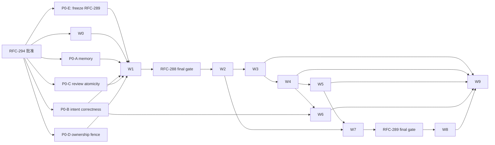

# RFC-294 实施路径：从散点 services 到分层 bounded contexts

- 状态：Draft（等待 RFC-294 架构决策批准；本计划尚未授权执行）
- 规划单位：P0 安全阻断 + W0～W9 十个迁移波次
- 总原则：单写源、逐 consumer 切换、每波可独立验收/回退；禁止 big-bang 搬树

## 0. 批准边界与实施纪律

批准 RFC-294 只表示批准目标架构和以下路线，不等于一次性批准所有行为变化。执行时：

1. P0 的权限/恢复/原子性修复分别立 RFC，列能力影响并单独批准；
2. RFC-287 仍需单独批准，但批准前其三件套必须同步本总纲的承重门：任何 consumer cutover 前完成 P0-D，
   review/clarify 切换前完成 P0-C；G6 classifier/config 可 additive 先落，生产行为顺序固定为 G5 → G7 → G6 window
   enablement，且不得回退到公开 `file://` 或 stale-mirror 语义；
3. RFC-288/289 必须先修订三件套、重新过设计门、再分别批准；
4. W3～W9 任何涉及 schema、行为、错误码、恢复或能力面的批次，按范围拆独立 RFC；
5. 每一波只允许一个 in-progress 高冲突批；共享 `main` 上精确暂存，不 broad-stage/stash/reset；
6. 目录迁移遵守 CLAUDE.md D18：逐域迁、旧路径留薄 facade、消费者归零后再删。

本 RFC 当前文档批的完成边界仅为：三件套 + `design/plan.md` 索引 + `STATE.md` 顶部登记，零生产改动。

P0 correctness 不等待 W0 全量门落地；但任何 P0 新增/修改的 public/cross-context contract 在合并前必须附 exact 临时
surface ledger + API snapshot + field/method consumer + authority/tx/data-class，并运行与 W0 等价的 type-taint/capability-forge/
god-port 变异。W0 落地后这些记录并入 canonical manifests，不能以“安全修复优先”为由先造无账接口。

## 1. 当前基线与量化口径

源码锚：`dde063510dd4b252d3f5f17680113d3cff0b5b3e`；本文最后同步 HEAD
`6ff1e84f57da5606f4fbfb898b2ab18795a57b95`。其间只有 RFC-287/audit-backlog 文档决策，backend/shared/frontend/门禁源码未变。
表内量化采集于 `b2e0a79920e1672129cd944c5201053d5891c29c`。

| 指标                                  |          基线 | 采集口径                                                                                                      |
| ------------------------------------- | ------------: | ------------------------------------------------------------------------------------------------------------- |
| dep graph modules                     |         1,404 | `bun run depcheck` 同一解析配置                                                                               |
| backend value SCC                     |             5 | 排除 type-only 后 Tarjan                                                                                      |
| repo value SCC                        |             7 | backend 5 + shared 1 + frontend 1                                                                             |
| `KNOWN_VIOLATIONS`                    |            36 | exact `(rule,from,to)` ledger                                                                                 |
| route→DB value imports                |            15 | `no-routes-to-db`；type-only 不计值通路                                                                       |
| route/MCP imports of `server.AppDeps` |            45 | transport 反向依赖 composition root                                                                           |
| production ambient wiring seams       |             5 | terminal hook / git credential provider / memory lang provider / WS revalidation / expired credential handler |
| daemon `setInterval` call sites       | 24 / 22 files | 区分 daemon-lifetime job 与 execution-local timer                                                             |
| AtomicApply lifecycle engines         |             2 | BundleApply + Intent Apply                                                                                    |
| human-gate route resume saga          |             3 | clarify / questions / review                                                                                  |

`KNOWN_VIOLATIONS=36` 的固定分类：

```text
task SCC 6
git SCC 5 + util→services 3
MCP 1 + agent 2 + workflow 1 + shared 1 + frontend 1
services→routes 1
routes→DB 15
```

每波开始重新采集；若基线因并发 RFC 合法下降，以新值为上限并同步本文实施记录。指标上升一律阻断，不能拿本表的
旧数字作为新增债务额度。

## 2. 每波统一切换协议

每个 wave/sub-wave 必须使用同一五步：

1. **Baseline/Oracle**：先锁当前 API、状态、事件顺序、恢复、依赖图和异常路径；
2. **Additive contract**：落 domain/application port 和未接线实现，不改生产 writer；
3. **Single-consumer cutover**：一个 consumer/vertical slice 原子切到新实现；同步缩 debt ledger；
4. **Facade stabilization**：旧 import 只剩一跳无状态适配；新增代码禁止再依赖旧路径；
5. **Contract**：消费者归零且稳定后删 facade/legacy reader，收紧负扫描。

每波“输入”统一定义为：所有 DAG 前驱的 exact exit evidence + 当前 exact-SHA architecture baseline + 本波 scoped
behavior/wire/data oracle；后续章节只列该波的增量前置与动作，不重复抄通用输入。缺任一前驱证据或 oracle 时不得开工。

禁止两套独立业务 writer 双写。schema expand 兼容期允许**同一 writer、同一事务**维护 canonical 字段和确定性的
legacy projection；这不是两套业务实现。禁止以 runtime feature flag 长期双跑旧/新引擎。

### 2.1 Facade 账本

每个 facade 必须记录：

```text
oldPath | newOwner | allowedShape | productionConsumers | testConsumers
introducedBy | removeAfterWave | owner | negativeScan
```

`allowedShape` 仅可为 re-export 或参数/返回 shape 适配；不得含 DB query、状态、授权、重试、branch、broadcast、
fallback 或 module-level mutable state。新 module 禁止反向 import facade。

### 2.2 Schema 波规则

- 只 expand，不在同波 drop/rename；
- backfill 幂等、可中断、可重复；
- new vs legacy oracle mismatch 必须为 0；
- reader cutover 可 `git revert`，已应用 migration 不回滚；
- contract 前必须证明在途 task/resume 兼容，legacy archive 由 versioned codec 读；
- Linux/macOS SQLite migration 与 schema admission 双平台验证。

## 3. P0：安全与一致性阻断（独立 RFC，不计迁移 wave）

### P0-A Memory scope move 与 ghost event

**前置**：独立安全 RFC，用户拍板 candidate/approved/archived 的 move 能力。

**任务**：

- [ ] `PatchMemoryContent` 只允许 title/body/tags，wire schema 与 service 双层禁止 scope 字段；
- [ ] 新建 `MoveMemory` command；`CommandContext.RequestAuthority` 由可信 factory 构造，command input 只含 target、
      expected memory revision 与新 scope，不接收 Actor/permission snapshot；
- [ ] 同一 `dbTxSync` 内重读 row、旧 scope 授权、新 scope 授权、目标存在性、状态 policy、audit/event；
- [ ] approved/archived 不得静默改变注入受众；按批准结果禁止或变新 candidate 再审批；
- [ ] `memory.updated` 移出事务，rollback 不得产生 ghost WS；
- [ ] 覆盖跨 agent/workflow/repo/global 越权、目标删除竞争、版本竞争、rollback、prompt 注入 E2E。

**退出门**：generic patch scope move=0；新旧 scope 双授权全矩阵；事务 rollback 后 durable/WS 均无变化。

**回滚**：恢复旧 content PATCH 但保持 scope 字段拒绝；Move endpoint 可不暴露。不能恢复已证实的越权面。

**冲突面**：memory route/service/shared schema/injection/broadcaster；与 W3/W4 同文件时排它。

### P0-B Intent Apply 立即正确性

**前置**：不等待 W6 泛化引擎，先修已知恢复缺陷。

**任务**：

- [ ] session lock 以 map 中实际 chain identity 清理；
- [ ] compensation 任一失败时 journal 保持 retryable，禁止无条件 failed；
- [ ] `skill-version-stage` 使用完整 versioned artifact codec，prepared/committed convergence 全覆盖；
- [ ] post-commit throw 不补偿 durable commit；
- [ ] lock 基数、crash points、重复 convergence、artifact parse corruption 有 mutation tests。

**退出门**：Intent 合同不弱于 BundleApply；W6 前仍可有两套代码，但不存在已知错误语义。

**回滚**：逐修复点 revert 只在 oracle 仍绿时允许；不得回到不可恢复终态。

**冲突面**：`intent/applyChangeset`、boot/hourly converger、skill/plugin artifacts；W6 排它。

### P0-C Human-gate open + Review decision 原子化

**任务**：

- [ ] durable decision claim、doc snapshot、node/task transition、continuation intent 同事务；
- [ ] clarify/review/questions 三类 gate open 先 durable prepare journal/claim，再以 `TaskParkTx` 同事务消费 prepared ref、
      提交 gate/doc manifest + node/task park + event；prepared 未消费/失败可补偿与 GC；
- [ ] FS/output 用 prepare+journal/roll-forward，不在事务中 await；
- [ ] WS 只在 commit 后发；review/clarify executor 的 W1 cutover 必须等待 gate-open oracle 全绿；
- [ ] route 只返回 actor-filtered gate view，不暴露 continuation/worker id，也不自己 mint/rollback/resume；
- [ ] crash-at-every-boundary、重复 request、stale doc、部分 doc failure、resume failure 全矩阵。

**退出门**：不存在 parked run + partial docs、created ghost WS、“部分 doc 已决定、部分未决定”或“答案已存但永远未
continuation”的半态；三 gate open + review decision crash/replay 矩阵全绿。

**回滚**：保留 additive journal；cutover 可 revert 到旧 reader，但不能恢复非原子多写，必要时 fail-closed。

**冲突面**：review/lifecycle/task/routes/schema；与 W3 串行。

### P0-D 最小 durable Task ownership fence

**前置**：独立 correctness RFC；必须在 RFC-287 切换第一个 mint/worktree/spawn consumer 前完成。

**任务**：

- [ ] additive ownership table：`taskId PK/ownerId/epoch/leaseUntil/revision`，initial insert 与 expired takeover 明确 CAS；
- [ ] daemon/worker identity 只由 bootstrap 注入，HTTP/MCP 不能传 ownerId，expected epoch 不可省略；
- [ ] manual resume/retry 只写 authorized continuation，真正 worker 与 scheduler/recovery 走同一 claim；
- [ ] execution-plane task/node mutation 同事务 CAS epoch；control/gate command 用 expected revisions，不能伪造 worker；
- [ ] FS/Git/process 使用 record-before-act + task exclusive fence + epoch heartbeat；无法证明旧 handle 停止则
      recovery-required，禁止 takeover；
- [ ] token 线程化进现有 mint、RunAssembly seam、RunLedger、workspace、spawn receipt 和 terminal commit；
- [ ] cancel 使旧 epoch 失效，committed event 再 abort 本进程 handle；shutdown reason 使用非可选 `TaskAbortReason`；
- [ ] manual/auto/scheduler 并发 claim、lease expiry、stale commit、daemon crash、unkillable process、worktree collision tests。

**退出门**：durable authority=1；任何 stale epoch DB receipt=0；任何 task 同时可写 workspace/process 的 epoch≤1；
manual path 不再依赖 `activeTasks + status CAS` 约定。

**回滚**：schema additive 保留；reader/driver 可停用新调度，但不能恢复已证实的并发写窗口。若无法安全恢复旧行为，
fail-closed 停止新执行并 forward-fix。

**冲突面**：task/scheduler/driverLease/nodeRunMint/workspace/process/shutdown；与 W1/W2 串行。

### P0-E 大件设计修订

- [ ] RFC-287 三件套补齐 P0-C/P0-D 前置、T11→T13→T12 production switch（T12 classifier/config 可 additive 先落）、
      G5/G6 fail-closed 回滚边界；未同步前不得把
      “RFC-287 自身获批”视为 W1 入场证据；
- [ ] RFC-288 按 TaskRuntimeRegistry / TaskOwnershipPort / SchedulerDriverPort / TaskStatusPublisher 重写；
- [ ] 补 `abort(reason): ids`、bootstrap fail-fast、D18 facade、export inventory、无临时 KNOWN 合同；
- [ ] RFC-289 当前版明确冻结为不可实施；W7 identity/provenance 合同稳定后，再按 SelectedRunMap + child
      provenance + consumed-aware reuse 重写；
- [ ] RFC-288 在 W2 前、RFC-289 在 W8 前分别重新跑设计门并单独请批。

### 3.1 Wave/sub-wave 依赖 DAG



章节顺序不代替依赖：W1 只需要 P0-E 对 RFC-289 的**冻结结论**，不需要终版 RFC-289；终版 288 在 W1 后用稳定
assembly 锚过门，终版 289 在 W7 后用稳定 identity 锚过门。W5 的每个 SCC family 需 W4 已断 transport/root 回边；
W6 在 W4 + P0-B 后可与 W5/W7 的设计准备并行，但 schema/start owner 必须排队；W9-D/E 等所有前驱完成。

## 4. W0：架构观测、owner 账本与机器栅栏

**前置**：RFC-294 目标决策获批；P0 可以并行，但 W1 前安全阻断须完成。

**动作**：

- [ ] 把本计划 §1 指标做成可复跑 architecture report；
- [ ] 对 repo/backend SCC、KNOWN 分类、route→DB、AppDeps、ambient wiring、facade、cross-context internal import 建棘轮；
- [ ] 生成七份 exact manifest：mutation entrypoints（authority/auth/OCC/tx/audit/event）、transaction external effects、
      background jobs/timers、cross-context imports、facades、`architecture/public-surfaces.json`、
      `architecture/module-symbol-owners.json`；每份有机器分母、owner 与
      最终判据，public surface 另做 API snapshot、exact consumer allowlist、consumer-method + recursive-field matrix、
      transitive leaf/union budget 与 stale/unknown gate；
- [ ] 新 `modules/**` 启用层级规则，domain/application 立即 fail-closed；
- [ ] 机器区分普通 infrastructure、consumer `cross-context-adapters`、provider `application/adapters`：每个 adapter
      ledger 只放行“本域 required SPI + 一个 provider offered participant”或“一个 consumer required SPI + 本域 internal
      ports”，`allowedImplementers/adapterOwner` 生成的 implementation graph 必须无 SCC；
- [ ] type-only 仅可指向 exact `public/{types,events,participants}`；required SPI 只经
      `composition/required-ports`，禁止借类型 import 暴露 internal shape；
- [ ] 建 current file→target owner map，所有 343 个 service 文件必须有 owner 或明确 legacy facade 归属；
- [ ] 建 `architecture/module-symbol-owners.json`：每个 production file 恰属一个 context+layer；legacy god file 按 exported/
      private symbol/capability 分解目标 owner/layer，不能用“scheduler 整文件归 task”掩盖 Task/Wrapper/Executor/Assembly 混居；
- [ ] `module-symbol-owners` 作为 canonical non-overlap root/owner registry；public surface 以 `ownerEntryId/symbolId` 外键、
      cross-context edge 以两端 `symbolId+entrypoint` 外键关联，AST export/import 双向闭合，referential integrity=100%；
- [ ] inventory 所有 `node_runs INSERT` 并加“新 INSERT path 不得出现”负扫描，为 W1/W7 单 writer 提供基线；
- [ ] 先落最小 `PublicErrorDTO + toPublicError` allowlist，阻止后续 adapter cutover 复制可枚举 private cause；
- [ ] 定义 periodic `BackgroundJobDefinition` + long-running `ManagedWorkerDefinition` 的
      phase/dependency/readiness/state contract；W1/W3/W6 及之后任何新 daemon background work 必须从出生注册，
      W9 只收编 manifest 中的存量 scattered background work（periodic + long-running；execution-local 只归 owner 生命周期）；
- [ ] 每模块 composition exact entrypoint 只允许 bootstrap consumer；bootstrap deep-import infrastructure 和业务 branch
      负扫描；
- [ ] 扩 exact exception schema：`rule/fromPath+symbol/toPath+symbol/edgeKind/owner/why/introducedByRFC/removeAfterWave/
expiresOn/mutationTest`；禁 glob/pathNot/目录豁免，unknown/stale/expired 全红。Unresolved first-party、forbidden type
      taint、capability伪造、export\*、未分类 context/layer 不得豁免；
- [ ] capability forge gate：production object literal/`as`/deserialize 不能铸 Actor/current authority/ownership/apply/
      task-effect/tx capability；只有 owner factory可构造，capability 不得进入 wire/event/durable codec；dynamic import/
      re-export/`import('x').T` 同样进入依赖和 type-taint 图；“复用真 RequestAuthority/claim 后 spread 改 subjectRef/
      now/kind/ids”变异必须红；
- [ ] 给每条新 dependency rule 做配置变异测试，证明规则真的能红；
- [ ] CI/static scan 接线，保持 depcheck unknown/stale/first-party-unresolved 三判据。

**退出门**：基线与七份 manifest 可重复、无未分类入口；规则变异必红；新增违规/ambient/facade/public export 无法
静默进入；账本 stale consumer/symbol 必红；
public/private error 隔离有序列化负测；生产行为零变化。

**回滚点**：整批 gate 可 revert；不得先搬代码再撤规则。

**冲突面**：`.dependency-cruiser.cjs`、depcheck、gate/CI、architecture tests 单 owner。

## 5. W1：RFC-287 / Assembly kernel + orthogonal launch tails

**前置**：P0-A/B/C/D 完成；RFC-287 逐锚刷新并获单独批准；RFC-288/289 不得同时改 scheduler。P0-E 中
RFC-289 的终版设计刻意等 W7，不阻塞 W1；这里只要求当前版已 frozen。

W1 内部依赖不是编号顺序：assembly W1.0～W1.7 与 G4 在冲突面允许时可独立准备。启动半场先切 G5；G6 的 error
classifier/config/frozen-policy contract 可 additive 准备，G7 synthetic repository-preparation NodeRun 切换后才允许启用 G6 的生产 retry window，
即行为顺序为 W1.9 → W1.11 → W1.10 enablement。所有分支在 W1 exit 汇合后才允许 RFC-288 final gate / W2。

**切片**：

- [ ] W1.0 九线 inventory、≥20 源码文本锁处置表、行为 golden；
- [ ] W1.1 落未接线 `RunAssembly`、ports 与双窗口/disposition/park 单测；
- [ ] W1.2 L6 aggregator 切换；
- [ ] W1.3 L5 shard 切换；
- [ ] W1.4 L7 script 切换，单独提交 merge-throw/cleanup bug 修复；
- [ ] W1.5 L1 workgroup host 切换；
- [ ] W1.6 L4 agent-single 切换并保持 same-session 跨 attempt iso；
- [ ] W1.7 L2/L3/L8/L9 豁免锁、facade 与负扫描。
- [ ] W1.8 / RFC-287 T10 配额设置面尾批：三个既有配额补 settings UI+i18n+exact config projection，保持默认值/
      即时生效 oracle；独立 commit，负扫描证明 `RunAssembly`/ExecutionKernel 零 settings/quota 字段。
- [ ] W1.9 / T11 `file://` 公开面下线：先把真实 commit-push E2E 换为本地 `git http-backend` 提供的 HTTP remote，再由 source-control offered
      `PublicRepositorySourceSealPort + RepositoryLaunchSnapshotInTx` 唯一拒绝/重验；raw URL 只进 one-shot SC codec，
      task intent 只持 sealed ref。Direct/schedule/webhook 走同一 task admission，schedule save 可提前 seal 但 fire 仍重验。
      Adapter 不自写 parser；internal/test source 保留，存量启动不 grandfather；独立行为 commit。
- [ ] W1.10 / T12 repository baseline sync：先 additive 落 source-control error classifier、frozen retry policy/config、
      `gitCloneTimeoutMs` launch-path projection 与夹具；
      等 W1.11 execution-local prep 切换后才启用生产总窗口。网络类在 synthetic node execution 内退避重试，鉴权/不存在/无权限/分支错误立即硬失败；
      未知错误 fail-closed，窗口耗尽保持现有拒绝 stale source 的硬失败；独立行为 commit。
- [ ] W1.11 / T13 repository preparation 异步化：`RepositoryStepAdmissionTx` 同 tx 创建 `pending` task、第一个可见且同为
      `pending` 的 synthetic NodeRun `__repo_prep__`，并原子冻结覆盖 scratch/repository/group/sealed/source-task 的 closed
      workspace plan 与 logical preparation generation/operation；admit/mint/freeze 不得拆成可遗漏调用。Synthetic root run 必须
      先 pending mint，不放宽 `mintNodeRun` 的 parentless-running guard。INSERT commit 后、任何 SC/FS
      effect 前先把 task-owned AbortController 登记进 `activeTasks`；`startTask/resumeKick/retryNode` 都调用同一 `runTask`，其
      `RepositoryPreparationClaimTx` 复用既有 task `pending → running` claim CAS，并把 prep run `pending → running`，再将仓库
      准备作为第 0 步推进。不得增加 `running → running` 自环或独立 daemon worker。Execution capability 绑定 exact
      task/run/plan/logical-generation/operation/ownership generation 与 task cancellation；scratch/source-task 走 task-owned 窄实现，
      只有 repository variants 才由 adapter 调 SC。Adapter 持 AbortSignal 并转成 SC opaque effect capability，不把 generic
      AbortController 跨域；task infra private closure 绑定 active `handle.signal`，SC application/domain
      只线程化 opaque effect ref，最终 platform managed-process adapter 才解成 signal，并以 spawn-before-abort check 消除启动窗。
      SC offered `RepositoryPreparationParticipant` 必须把 cancellation 与 frozen `gitCloneTimeoutMs` 接到底层
      `runGit/spawnGit` 可杀进程组；取消 receipt 返回前已 kill + await/reap 全组。Effect outcome 是 closed
      `prepared | failed | stopped(stopReceipt)`；abort 不伪装 repository failure，task owner 按自身 AbortReason 落
      canceled/interrupted。SC 对同
      `(operation,source)` 重放同 receipt。成功时同 tx 重验 task/ownership/run、绑定 workspace、标 synthetic run done，commit
      后才放行 frontier；失败时同 tx 标 synthetic run + task failed，保留可见、凭据脱敏的原始 git stderr，且绝不写
      `workspacePrunedAt`。取消后的 stale completion 不得复活 task/绑定 workspace。`RetryNode(__repo_prep__)` 仅接受 failed run，
      并在 current-authority + expected task/run revisions 的单一 tx 中把 terminal task 转回 `pending`、铸新 logical generation +
      pending successor run + 新 operation；同 generation 的 boot/resume/takeover/technical attempt 共用 operation，再由同一
      `runTask` 第 0 步推进；done prep 服务端在任何 transition/effect 前拒绝 retry。Resume/boot/reap 也只回到可 claim 状态并调用同一
      `runTask`，不以空 worktree 返回 410。Canonical lifecycle writer 同 tx 写 audit + W3-compatible closed task event，WS 仅走
      记账的一跳 after-commit facade（W3 删除），不得事务内 publish。Direct JSON/schedule/webhook 同语义。Multipart、
      `materializedSpace`、`preCreatedWorktree` 与
      call launch 保持现有 pre-materialized lane，本批只完成 ownership-handoff inventory、空 worktree 防护与行为 oracle；其
      task-owned staged-upload journal/port 在 W4-E1 按零行为迁移，若要改成 post-admission preparation 另立行为 RFC。完整
      inventory 所有“task row ⇒ worktree exists”及 multipart ownership-handoff consumer并逐项 early-state oracle；独立最大批。

**退出门**：五条线只有一个 assembly；pool 逆序释放、keep/park/merge 三态、广播序列、discard warn、followup/session
行为对拍；配额 UI 六项覆盖与即时生效对拍；公开 `file://`=0、启动 stale mirror fallback 保持 0；pending admission、task/run
双 `pending → running` claim、第 0 步 prep、`__repo_prep__` 未完成态查询/取消/`RetryNode`/恢复均不会进入要求 workspace 的
executor；done prep retry 服务端拒绝、prep failure `workspacePrunedAt` 不变、AbortController-before-effect、brand-only opaque
effect、SC application/domain 无 AbortSignal、spawn-before-abort 无窗、`stopped` 与 repo failure 分流、cancel 返回前 git 进程组
已退出、frozen `gitCloneTimeoutMs` 真接线、cancel-vs-completion CAS、crash-after-SC-effect-
before-task-receipt、duplicate/takeover 同 receipt、三入口/boot/resume 同路重放、legacy multipart handoff/空路径防误写全绿；
transaction external effect=0，临时 WS facade 已入账。G4～G7 与 assembly import/DTO 交集=0；W1 architecture debt 每项 ≤
exact W0 baseline、新 violation/edge=0、G7 execution-local owner/lifecycle=100%。

**回滚点**：每个 assembly consumer switch 与 G4 有独立 revert；G5/G6 是独立部署切换但不得恢复公开 `file://` 或允许
stale source 启动。G5 故障时停相关新 admission并 forward-fix；G6 可扩大/暂停 retry window 或 fail-closed 停仓库启动。
未使用 kernel 可暂留。G7 若已产生 `pending/running` 且 `__repo_prep__` 未完成的 task，旧 reader 不安全时不能代码回退，
只能停相关 admission，并保留兼容 `runTask` 第 0 步将 synthetic run forward-prepare 或连同 task fail terminal；禁止把新行 stranded，
也禁止 runtime 双路随机选择。

**冲突面**：scheduler / isolatedAgentRun / nodeRunMint / pools / task admission / gitRepoCache / worktree / config / launch routes
排它；W1.9～W1.11 完成并固定 oracle 后才进入 W2 TaskEngine 拆分。

## 6. W2：修订 RFC-288 / Ownership、Driver 与大 SCC

**前置**：W1 完成；新版 RFC-288 设计门和批准完成。

### W2-A RFC-288 topology cut

- [ ] additive 实例化 `TaskRuntimeRegistry`，只管 active handle/abort reason；
- [ ] **复用 P0-D canonical ownership table/port**，迁移 consumer/owner/facade并删除 legacy Map/lease authority；禁止
      新建第二张 lease 表、第二个 claim API或重置 epoch；
- [ ] `SchedulerDriverPort` 由 application instance 构造注入，不用 `registerSchedulerDriver` global locator；
- [ ] `TaskStatusPublisher` 先定义 committed-event port，W3 再切 outbox；
- [ ] 拆 `TaskReadModel`、workspace materialize、workspace leases；按 export inventory 搬，不按过期行号切片；
- [ ] frontier/graph 纯核归 task engine，删除测试为生产 re-export 定边界的做法；
- [ ] 最后一刀 cohesive cutover：断 task↔scheduler A/B 回边，同一 commit 删除前 6 条 ledger；
- [ ] `abortAllActiveTasks(reason): ids`、shutdown interrupted、orphan/recovery 行为对拍；
- [ ] 旧路径按 D18 留一跳 facade，登记最早稳定 `removeAfterWave`；W9 只清理经批准仍未到期的例外。

### W2-B TaskEngine decomposition

- [ ] inventory DAG task、workgroup round、dynamic workflow 的所有生产入口、resume/recovery/terminal 路径；
- [ ] 提炼 `TaskEngine` 最小 interface；三种 engine 保留独立 domain state machine，只共享 ownership/lifecycle/kernel ports；
- [ ] 按 single consumer 切换，旧 scheduler/task inline frontier/drive body 归零；
- [ ] workgroup host execution 只调用共同 NodeExecutor/Assembly，不把 round assignment 混入 DAG。

### W2-C NodeExecutorRegistry

- [ ] inventory 全部 `NodeKind` 及 agent/script/call-workflow/call-workgroup/code-host/review/clarify 生产 dispatch；
- [ ] registry 与 `NODE_KIND_BEHAVIORS satisfies Record<NodeKind,...>` 同源或以穷尽 compile oracle 对拍；
- [ ] review/clarify executor 只负责 task-side request/park outcome，gate policy 仍在 collaboration；
- [ ] 逐 kind cutover，旧 switch/inline body 与旁路（含 workgroup host）生产命中=0。

### W2-D WrapperRuntime

- [ ] inventory loop/git/fanout 外壳、hydrate/park/merge/terminal/retry；
- [ ] 先把 loop/git 的公共序幕/收尾/merge/park 收进 template，strategy 仅实现真正差异；
- [ ] fanout 先迁现有能力的 outer shell，内链能力仍由 W8 扩张；call-workflow 明确不并入 wrapper；
- [ ] 统一 container membership/scope write contract，为 W7 `scopePath`/backfill 建唯一语义；
- [ ] 旧 loop/git/fanout wrapper inline shell 归零，能力表/park map 穷尽门生效。

**退出门**：scheduler 零 import task internal；ownership 只有一个 durable authority；TaskEngine/NodeExecutorRegistry/
WrapperRuntime 各有唯一生产入口，旧 switch/inline shell 归零；无新 service locator；
repo SCC `7→6`、backend `5→4`、KNOWN `36→30`（若前序已下降则等量销 6）。

**回滚点**：revert 最终 cutover，additive modules/facade 保留；lease schema 只 forward。禁止新增临时 KNOWN 来容忍
同一环换了一条报告边。

**冲突面**：scheduler/task/execution/gc/workspace/shutdown，W2-A～D 严格串行且各自独立 RFC/commit/rollback。

## 7. W3：Lifecycle committed events + Collaboration commands

**前置**：W2 提供不成环的 driver/ownership ports；P0-C 完成。

**动作**：

- [ ] 定义每个 producer context 的 closed event union + exact codec registry；envelope 锁
      `eventId/type/schemaVersion/exact aggregate-kind+codec+aggregateId+aggregateSeq/operation+correlation+causation/
deliveryClass/audience`，每个
      payload 有 fixture/size gate/secret-content taint test/known consumer matrix；
- [ ] migration 加 critical outbox、consumer dedupe、claim epoch/lease/retry/dead-letter、不可变
      `deliveryMode=shadow|dispatchable`、producer epoch 与每事件族
      durable cutover ledger；transition 与 event/audit 同一 `dbTxSync`；
- [ ] 先部署双模式 producer 但 ledger 保持 `legacy`：append 的 row 永远标 `shadow`，dispatcher 永不 claim；旧 effect
      暂留，用 transition id 对拍完整性；
- [ ] 按事件族在数据库原子翻 cutover epoch；之后 writer 只产 `dispatchable` 且旧 emitter 不发。历史 shadow row 永不
      重放，严禁用“启动 dispatcher 扫全表”完成切换；
- [ ] dispatcher claim `(deliveryMode,producerEpoch,state,leaseEpoch)`；DB effect + `(consumer,eventId)` dedupe 同事务，
      external effect 用 eventId idempotency；critical dead-letter 告警、replay/reconcile，不作为完成终态；
- [ ] childBudget/executionWatch 改 event + reconcile；terminal gate sweep 改 durable consumer；
- [ ] WS 只从 event 生成最小 invalidate projection，每帧按当前 audience/ACL/role live revalidate，失败 default-drop；
- [ ] collaboration 建统一 command envelope/continuation protocol；先 review，再 clarify，再 questions；
- [ ] 删除三 route 的 rollback/mint/resume saga 与 `resumeFailure` 拼装；
- [ ] dispatcher/continuation 常驻 loop 从出生注册 `ManagedWorkerDefinition`；周期 reconcile 注册
      `BackgroundJobDefinition.run`，各自声明 phase/dependency/overlap（适用时）/health/stop；
- [ ] crash/replay/duplicate/same-key-different-payload-or-actor/out-of-order/consumer poison/daemon restart 测试；
- [ ] 锁每个 event family 可观察偏序：至少 `DB commit < publish` 与同 aggregate seq FIFO；若现合同要求
      `publish < command response` 必须保持。允许 response 后 publish 属行为变化，另 RFC 呈批。

**退出门**：事务内外发事件=0；`registerTerminalTaskHook`=0；route human saga `3→0`；每次 successful transition 有
且仅有一组 closed-schema committed events；WS payload/逐帧 authorization/可观察偏序兼容；critical pending/dead-letter
可观测且可 replay；把 task event 绑定 memory aggregate/错误 sequence、wrong payload codec/unknown key 的变异必红；
ambient wiring `5→≤4`。

**回滚点**：不能直接 revert 代码。先停 admission/worker、冻结该事件族 cutover、让当前 epoch 的 dispatchable row
全部 delivered 或由兼容 dispatcher 接管，再原子切回 legacy epoch；确认 pending=0 后才可撤新 emitter。additive
outbox/shadow row 不回滚；任何时刻只能一个 delivery owner active。

**冲突面**：lifecycle/task/review/clarify/taskQuestions/schema/start 单 owner排它。

## 8. W4：Application use cases、OperationCatalog 与 transport 截断

**前置**：W0 新路径规则生效；W3 command/event 模式有一个成熟范例。

子波依赖不是章节顺序：`A → E0`；`E0 + C + source-control thin seams → E1/E2`；`E1 + E2 → E3`；
`C → E4a`；`C + E4b → E6`。E5 可独立落 contract，但生产 cutover 等 W5 的 SC/runtime seam；E7 可独立。
每个 context contract 再流向自己的 `B(adapter cutover) → D(AppDeps/root contraction)`，所有 mutation B cutover 还必须有
E0 trusted authority + 本域 event codec；public liveness/credential-auth/verified-ingress 用各自 exact context 例外。
不依赖 C/E 的低风险 read-only query 可提前做 B。W4 先为 E2
落 source-control offered `RepositoryScopeAuthorizationInTx` 薄 participant；E1 必须**复用并迁位** W1.9 已完成行为切换的
`PublicRepositorySourceSealPort + RepositoryLaunchSnapshotInTx`（one-shot raw URL seal / current authority + sealed-or-versioned
source → 无 path/secret 的 frozen ref），不得在 W4 首次创建 seam 或重写 launchability 语义；
W4-B task worktree route 切换前另落 task-owned `TaskWorkspaceReadPort` + SC offered `WorkspaceContentParticipant` 薄 facade；
E5 的完整 insight cutover 留在 W5 与 SC
snapshot 一起完成，避免 W4↔W5 循环。任何 mutation route 只有对应 use case/participant/event codec 已落后才切；D
只在该 context 旧 consumer=0 后收缩。

### W4-A Operation catalog 与 adapter parity

- [ ] 定义 command/query 判别的 transport-neutral operation descriptor，完整 admission 含 permissions AND、identity、
      publicReason；RouteMeta 从 operation + HTTP binding 派生，tokenAccess 仍是 HTTP binding 独立门；
- [ ] HTTP RouteMeta 与 MCP tool 映射引用同一 operation id/handler；
- [ ] 保留 transport admission，行级 auth/OCC 在 command 内；
- [ ] API docs 从 transport descriptor 派生，不让 service import route registry；
- [ ] HTTP/MCP 同 input/actor 的 result/error parity 与权限矩阵。
- [ ] code→transport exact golden 覆盖既有 404/409/410/412；unknown code fail-closed 500，public DTO exact codec
      不含 private cause；
- [ ] 建 authority matrix：direct current actor；schedule/webhook/call/code-host delegated owner 每次重建 active/current
      role 并在目标 tx 重验 usability；manual resume 维持 Q6；maintenance/outbox/apply 用窄 capability，不伪装 Actor。

### W4-B 15 个 route→DB vertical slices

按“低风险读 → task/collaboration → intent/auth/integration”推进，每类一刀：

- [ ] health / repos / task-owned worktree-files / port-artifacts query；worktree route 先由 task 授权，再经 task required
      `TaskWorkspaceReadPort` → SC offered `WorkspaceContentParticipant` 两跳读取；
- [ ] tasks / taskFeedback / taskClarifyDirective / taskQuestions / reviews / clarify；
- [ ] intentSessions / auth / oidc-auth；
- [ ] webhook ingress / deliveries；
- [ ] 每刀 route 只 decode/call/map，DB/ACL/OCC/audit 下沉 use case/repository。

### W4-C Resource Catalog

- [ ] 六类 selector summary 收为 `ResourceCatalogQuery`，仅返回 `ResourceSummary`；每类完整 List/Get/Filter 保留
      typed QueryService，filter/pagination 下推 SQLite；
- [ ] `ACL_TABLES` 限 infrastructure；跨模块用 resource public authorization port；
- [ ] 按 named consumer 落 `TaskExecutionResourceSnapshotInTx`、`IntentApplyResourceParticipantInTx`、
      `IntegrationTriggerResourceSnapshotInTx`、`ResourceScopeAuthorizationInTx` 四个字段闭合 participant；禁止 generic
      `ResourceService/ResourceAuthorizationPort` 或 unconstrained snapshot generic；
- [ ] Intent 两份 catalog 改同一 query；
- [ ] Create/Update/Delete 逐资源 command 化，不做 universal CRUD switch；
- [ ] public DTO 与 repository row 分离。
- [ ] `resource-catalog/package` 落 Inspect/Preview/Apply/Receipt、`ResourcePackageApplyTx`、六类 exact mutation
      participants 与 scenario provider contract；本波只落/适配合同，W6 才切 AtomicApply admission owner；

### W4-D 拆 `AppDeps`

- [ ] mount 函数只接本域 command/query + transport concern；
- [ ] test seam 注入实例 handler/port，不挂全局 optional mega-context；
- [ ] MCP 不再 mount 第二套 Hono route table；
- [ ] server/bootstrap 只装配，无业务 query/switch。

### W4-E 其余 bounded contexts vertical slices

W4-E 不是一笔“大 context move”，按下列子波独立呈批/提交。每个子波都必须列 public symbol+field ledger、tx participant
集合、closed event codec、authority matrix、schema expand/backfill/cutover（如有）、crash/replay oracle、wire oracle 与自己的
rollback/admission owner；先落 domain/application contract，再切该 context 的单个 adapter consumer。

- [ ] **E0 identity-access**：可信 direct/delegated request authority factory，保留 schedule/webhook/call 现授权语义；
      sealed system-effect contract/forge gate 在 W0，event-family factory 随 W3 producer/worker 落，不等 E0；
- [ ] **E1 task launch admission**：迁移而非重写 W1.11 已固定的 JSON-body pending admission + `runTask` step-0
      `__repo_prep__` 语义；source fact + durable intent 同 tx，intent claim epoch + `RepositoryStepAdmissionTx` 原子写 `pending`
      task、pending synthetic NodeRun、closed workspace plan/logical-generation operation；`RepositoryPreparationClaimTx` 复用既有 task claim CAS
      并绑定 prep run transition。Repository preparation 继续由 normal task execution ownership 推进并经 NodeRun lifecycle
      participant 原子提交 workspace/run/task，不能迁成独立 daemon worker；`PreMaterializedTaskAdmissionTx` 只消费
      direct-multipart/fusion/call 的 opaque prepared artifact，准备完成后才建 task，不能进入 repository-step lane；integration/
      code-host secret/provider response 不越界，knowledge-evolution internal workspace 有 artifact compensation；direct multipart
      迁入 task-owned preparation journal/port但保持“预物化后建 task”语义，任何改成 post-admission preparation 另行呈批；
      wrong source-kind/cross-lane 编译与变异门必红；
- [ ] **E2 memory**：内容/move/query 拆分，`MemoryMoveTx` 跨 RC/SC 同 tx 双授权；RC/SC scope visibility 批量过滤且
      pagination 下推、不可见 count 无侧信道；distill retry/cancel/query + job/source snapshot；
      `TaskMemoryInjectionPort` 只供 runner 且保持 per-run current-approved 语义；
- [ ] **E3 knowledge-evolution**：fusion aggregate、decision、task launch intent 与 skill/memory exact-set tx participants
      收口；落 RC `SkillProvenanceVisibilityQuery` + Memory `MemoryProvenanceVisibilityQuery`，provenance query 逐 skill/memory
      批量重授权，不泄不可见 id/count；
- [ ] **E4a intent**：session/draft/working-set commands/queries 与 legacy apply adapter 收口；只落新 AtomicApply required
      port/provider contract，`ApplyDraft` 新 admission/provider 的生产切换留 W6，避免 W4↔W6 循环；
- [ ] **E4b runtime-management**：profile/admin/probe 与 runtime-selection participant 独立切换/回滚，保持 per-NodeRun
      首次 dispatch 语义；
- [ ] **E5 workspace-insight contract**：先落 pure query / durable narrative-artifact job 合同；生产 cutover 在 W5 随
      source-control immutable snapshot participant 完成，claim/receipt/GC/recovery 完整；
- [ ] **E6 resource-specific tools**：MCP runtime test 归 `resource-catalog/mcp/application/diagnostics`；落
      Start/SubmitTurn/Cancel/End + Session/Transcript、session/turn lease tx、exact MCP/runtime snapshot 与 process effect
      port，event 仅 ref/status；`testing/` 仅 fake/factory，不承载生产 use case；
- [ ] **E7 system-operations adapter**：只切 admin command/query 与 platform coordinator port；physical restore generation
      protocol 不在普通 context revert 内实施，留 W9-E 独立 RFC。

**退出门**：route→DB `15→0`；AppDeps imports `45→0`；services→routes `1→0`；MCP/server SCC 消失；
repo SCC `6→5`、backend `4→3`、KNOWN `30→13`；六 selector loaders + Intent 双 catalog → 1 summary query，六类
detail query 仍 typed 且无 route DB。每个已切 context 的 public surface unknown/stale symbol/method/field/consumer=0；
consumer-method/recursive-field matrix、transitive-field/union budget、exception expiry、recursive type-taint、capability-forge、
exact API snapshot 与 owner/surface/import 外键 referential integrity 全绿，
未记账 optional bag=0；E0-E3、E4a/E4b、E5-E7 每个子波自己的退出门都继承此条。E1 的错 source-kind builder/
prepared/nested-payload mutation、E2 的不可见 count、E3 的 membership partial commit/hidden provenance、E6 的
transcript/event secret 变异均必须打红。

**回滚点**：C/E additive contract 在未切 consumer 前可整批 revert；B 只切 binding/admission，不让新旧 writer 同时处理；
D 仅在 consumer=0 后删 root/facade，回滚时先恢复 facade 再切 binding。新增 schema 只 expand、不 downgrade，已被新
engine/worker claim 的 row 由原版本 forward-converge。OperationCatalog 根切换独立一刀；public API/wire 不回滚；
physical restore 不适用本回滚。

**冲突面**：server/mcp/catalog root 单 owner；不同领域 route/application 可并行，但不得同时改 root 注册文件。

## 9. W5：剩余依赖图债与 Source-control 边界

**动作（每族独立 commit）**：

- [ ] util/git 改纯参数/port 注入，销 git circular 5 + util→services 3；
- [ ] agentDeps/agentResourceIntegrity 注入 lookup port，销 agent 2；
- [ ] workflow validator 注入 reference lookup，销 workflow 1；
- [ ] shared outputKinds handler registry DI，销 shared 1；
- [ ] frontend recursive renderer 用 children/render callback，销 frontend 1；
- [ ] source-control context 收编 repo/cache/submodule/group/worktree，util 保持叶子；
- [ ] 落 UI/task/workspace-insight 各自 purpose-specific snapshot/content participant；task 路径固定
      `TaskWorkspaceReadPort(capability,no workspace arg) → task adapter → WorkspaceContentParticipant(authorized SC snapshot)`，
      错绑 workspace/capability 变异必红；WI 同步 pure query 与 durable
      narrative/artifact job 在此切生产 consumer，禁止一个 `read(ref,path)` 混三种 authority/data class；
- [ ] 每族 source behavior oracle + dep graph oracle，删旧 dynamic-import 消环民俗。

**退出门**：repo SCC `5→0`、backend `3→0`、KNOWN `13→0`；unknown/stale/unresolved=0；动态 import 不被用作
service locator。

**回滚点**：每 SCC family 独立 revert；不跨族做大提交。

**冲突面**：util/git 族排它；agent/workflow/shared/frontend 可按文件面并行。

## 10. W6：唯一 AtomicApplyEngine

**前置**：P0-B 已把 Intent 恢复合同修正确；Resource application ports 可用。

**动作**：

- [ ] 从 BundleApply 提炼 neutral lifecycle，不先写万能泛型；
- [ ] engine + typed scenario tx/JournalInTx + shared durable `ApplySerializationLeasePort` + versioned ArtifactCodec +
      provider contract characterization；
- [ ] Bundle provider 先接入并逐 crash point 对拍；
- [ ] Intent provider 通过 `IntentApplyTx + IntentApplyResourceParticipantInTx` 复用同 engine，platform 不做资源 writer；
- [ ] journal row 持久 `scenarioId/engineVersion/providerVersion/artifactVersion/actorRef/authorityScope/idempotencyKey/
requestHash/serializationKey`；canonical request hash 服务端计算，duplicate 返回前当前重授权；
- [ ] 所有版本/legacy 共用 serialization key durable lease，claim/renew/release 用 epoch CAS；每次 artifact act、
      compensation、domain commit、roll-forward 前 fence，stale receipt/旧 release 必须失败；
- [ ] cutover 只改变新 admission owner；旧 Intent 非终态 journal 由 legacy codec/converger 收敛，新 engine 只处理
      明确归属的新行，计数各自可观测；
- [ ] knowledge-evolution 的 fusion approve/skill-restore 做故障点 characterization；符合 lifecycle 后接 provider，
      skill version 与 memory membership 同一 typed tx。Restore-forward re-fuse 能力/历史 provenance backfill 另 RFC 呈批；
- [ ] boot/hourly/tick converger 注册 `BackgroundJobDefinition.run`；若采用常驻 claim loop则注册
      `ManagedWorkerDefinition.start/stop`，两者从出生声明 phase/dependency/health；legacy/new 两代共用 claim port；
- [ ] legacy/new nonterminal 都归零并过稳定窗口后，才删除对应旧 engine/codec；
- [ ] duplicate/same-key-different-payload-or-actor/authority transfer、lock cardinality、concurrent converger/takeover/
      lease expiry、record-before-act、post-commit throw、compensation retry、artifact corruption、boot/hourly converge 全矩阵。

**退出门**：AtomicApply lifecycle `2→1`；Intent/Bundle 各自 journal wire 可不同但状态机实现唯一；无双写、无双 converger。

**回滚点**：不能假设原 provider/codec 可读新 journal。回滚只把**新 admission**切回 legacy；已归属新 engine 的行仍
由兼容新 engine 收敛。new-owned nonterminal=0 后才允许代码级撤除；journal schema/rows永久向前兼容。

**冲突面**：intent apply / bundle apply / resource providers / boot converger / schema 排它。

## 11. W7：NodeRun identity、sequence 与逐边 provenance

**前置**：W1 唯一 mint/assembly、W2 ownership + WrapperRuntime 唯一外壳、W5 backend 零环；独立 schema RFC 获批。

**阶段**：

- [ ] W7.0 inventory 所有 row semantic/synthetic rows/repo physical shape 与 `node_runs INSERT`；负扫描证明 mint 单 writer；
- [ ] W7.1 expand `identityVersion/identitySource/RunRole(node-attempt|container|synthetic)/syntheticKind/
syntheticOwnerKind(task|host-node)/hostNodeId(nullable)/repoKey(nullable)/seq/containerRunId/scopePath/generationSeq/
attemptIndex/ownershipEpoch`，以 CHECK 锁住 task owner 无 host/repo、host-node owner 必有 `hostNodeId`；
      `node_run_repos(repoIndex,repository,repoKey)` 与 consumption-edge 表；
- [ ] W7.2 **先切 writer**：nodeRunMint 从 per-task counters 在同一事务分配 physical row `seq` 与 logical
      `generationSeq`，写 v2 canonical + deterministic legacy projection，持久 cutover watermark；锁
      `UNIQUE(taskId,seq)`、logical identity uniqueness 与 length-prefixed scope codec；
- [ ] W7.3 watermark 前幂等 backfill + watermark 后 catch-up；不可证明历史行为标 `legacy-derived` 走 versioned codec，
      不伪造 scope；canonical NULL/unknown version/eligible unbackfilled 精确归零后再跑旧判据 vs 新 identity oracle；
- [ ] W7.4 freshness/selected-run/read model shadow read，记录 mismatch=0；
- [ ] W7.5 retry/resume/wrapper/call/review/clarify readers 切新模型；
- [ ] W7.6 production hot path 删除 ULID/nullable-parent freshness 推断；legacy archive 只经 versioned codec；
- [ ] W7.7 source gate 限制裸 parent/ULID comparison。

**退出门**：新增/存量/in-flight/synthetic/multi-repo 矩阵全绿；`__repo_prep__` 为 task-scoped synthetic、
`hostNodeId/repoKey` 均为空且不能伪造 host，其他 host-scoped synthetic 违反 owner CHECK 必红；per-task physical `seq` 持久单调且
`UNIQUE(taskId,seq)`，logical generationSeq/attemptIndex 可解释；每个 input 的
producer run 可解释；生产 freshness 不猜 ULID；canonical NULL/unknown version=0；schema admission + Linux/macOS
migration 全绿。

**回滚点**：W8 activation 前（rollback horizon）reader 可切回 legacy oracle且 writer继续 legacy projection；additive
columns/table 保留，single writer 不回退成两套 mint。W8 开始生成新 capability data 后只能 forward-fix，不能切旧 reader。

**冲突面**：schema/migration/nodeRunMint/freshness/scheduler/task/session views，整个 W7 排它。

## 12. W8：修订 RFC-289 / FanoutPlan 与内链

**前置**：W1/W2/W7 完成；新版 RFC-289 获独立批准。

**动作**：

- [ ] 纯函数 FanoutPlan/topological order/scope transitions；
- [ ] dispatch 返回并持久维护结构化 `{planRunId,nodeId,scope:{shared}|{shard,key}} → SelectedRun`，禁止字符串/sentinel；
- [ ] input resolver 接具体 edge source 与 declared boundary ref，只按该 edge 的 same-shard → legal shared → declared
      boundary → fail 顺序；不泛查任意 top-level；resume 从 persisted selection/consumption edges 重建；
- [ ] child 持久 exact consumed edges/fingerprint；
- [ ] reusable 同时比较 identity、shard hash、consumed fingerprint、output eligibility；
- [ ] aggregator feedback 明确拒绝或纳入 plan，不能留隐式数组后置；
- [ ] validator 只检查真实可表达的不变量，运行时同码防御；
- [ ] workflow snapshot 持久明确的 fanout-inner-chain capability/schema version，reader/resume 按版本选择兼容合同；
- [ ] 最后一刀才解除 `fanout-inner-chain-unsupported`；
- [ ] 真实 audit→fix inner-chain E2E。

**强制回归**：

- [ ] A 跨 generation 复用、保留旧 parent 时 B 仍读到 A；
- [ ] A 输出变化但原 shard value 不变时 B 失效；
- [ ] shared→per-shard 与 boundary fallback；
- [ ] inverse nodeIds 仍拓扑派发；
- [ ] aggregator feedback、cycle/illegal scope；
- [ ] empty source、partial shard failure fail-all、resume/replay/crash、shard collision。

**退出门**：能力扩张矩阵全绿；不存在 silent empty/stale input；validator/runtime/selected-run 同一 FanoutPlan 事实。

**回滚点**：挡板解除前可整批 revert。对外开放后形成持久兼容边界，不能删除 reader/executor 再把已保存 workflow
变成 stranded data；紧急回退只能停止**新建/新启动**该 capability，保留既有 snapshot 的读取、诊断与 in-flight/resume
执行，或以前向 migration 明确降级。所有受影响 task/workflow 可枚举且 UI/API 返回稳定状态后，才允许进一步 contract。

**冲突面**：scheduler/validator/shared/i18n/frontend target 排它。

## 13. W9：Composition root、Background、Errors/Observability 与 facade 清仓

### W9-A DaemonContainer

- [ ] bootstrap 创建 stateful services/ports/registries；
- [ ] HTTP/MCP/workers 仅在 required dependencies ready 后开放；
- [ ] 删除 5 个 production ambient register/set provider；测试用实例注入；
- [ ] 禁止 DB-keyed/global service locator。

### W9-B ManagedBackgroundRegistry

- [ ] 从 `background-jobs.json` inventory 所有 production background execution entrypoint：24 个已知 interval + 非
      interval long-running loop/worker + execution-local timer + disabled entrypoint，并区分 lifetime；
- [ ] periodic job 全声明 cadence/overlap/config-read/retry/health/run，long-running worker 另用无 cadence 的
      `ManagedWorkerDefinition.start/stop`，禁止 start 内私设 timer；
- [ ] 按 boot-recovery/pre-listen/pre-ready/post-ready phase + dependency DAG 启动；blocking pre-ready job 成功才开放
      readiness，shutdown 从同一 handle registry 逆序停止且有 timeout；
- [ ] 特别锁住当前未进 shutdown 清单的 intent/token-audit timers；
- [ ] id 唯一、dependency 存在且无环；disabled 单列，eligible job 状态守恒，shutdown 后
      active/starting/stopping=0，所有曾 active worker 都有 stop receipt。

### W9-C Errors、OperationContext 与 Audit

- [ ] Domain/App error 去 HTTP status；唯一 adapter mapping；
- [ ] operationId/correlationId/causationId 贯穿 task/node/event；HTTP requestId 仅 adapter-local 映射，不造第二套链；
- [ ] logger/metrics/audit ports；public/private detail 隔离；
- [ ] `console.log` security audit 清零；机器恢复不读日志文案。

### W9-D Facade/legacy contract

**前置**：W9-A/B/C 与 W9-E 完成；这是最终清仓，不得早于 generation/facade consumer cutover。

- [ ] facade ledger 逐条生产/test consumer=0；
- [ ] 删除到期旧路径和临时 export；
- [ ] cross-context internal import=0；
- [ ] 更新 backend code map、architecture docs、RFC 状态与 onboarding。

### W9-E Physical restore generation protocol（独立 RFC）

**前置**：W3 outbox fence、W6 apply claim、W7 ownership/identity、W9-A/B container/background registry 全完成；独立 restore RFC
按 design §14 重新审批。

- [ ] platform coordinator + module-scoped BackupExport/Restore participants；system-operations 只启动/查询；
- [ ] admission stop、task/worker/outbox/apply drain/fence、WAL checkpoint、stage/verify/safety backup；
- [ ] live generation 外 fsync marker、manifest/pointer switch、daemon generation fence、post-swap fail-closed/forward repair；
- [ ] crash-before/at/after swap、旧 claim 复活、include-worktrees consistency、blocking contributor failure 全矩阵；
- [ ] rollback horizon 为 pre-swap abandon 或 post-swap forward repair；不以 DB downgrade/普通 context revert 回滚。

W9 内部依赖为 `A/B → E → D`，C 可与 A/B/E 并行但必须在 D 前汇合。章节排版不代表 D 可先于 E 删除 restore/facade
consumer；W9 公共“逐 service revert”回滚不覆盖 E，E 只按上条 generation 协议处理。

**退出门**：ambient wiring `5→0`；eligible periodic job 与 managed worker 的 registration/phase/health/stop 覆盖 100%，
execution-local timer owner/lifecycle 覆盖100%；facade ledger=0；cross-context internal
import=0；终局指标全绿。

**回滚点**：逐 service factory/worker切换 revert；root/start/ws 改动分小批，不一刀重写 bootstrap。

**冲突面**：start/server/ws/config/shutdown 单 owner排它。

## 14. 量化里程碑

| 时点    | Repo SCC | Backend SCC | KNOWN | route→DB | AppDeps imports |    Ambient wiring |
| ------- | -------: | ----------: | ----: | -------: | --------------: | ----------------: |
| 基线    |        7 |           5 |    36 |       15 |              45 |                 5 |
| W1 后   |       ≤7 |          ≤5 |   ≤36 |      ≤15 |             ≤45 |                ≤5 |
| W2 后   |        6 |           4 |    30 |      ≤15 |             ≤45 |                ≤5 |
| W3 后   |        6 |           4 |    30 |      ≤15 |             ≤45 |                ≤4 |
| W4 后   |        5 |           3 |    13 |        0 |               0 |                ≤4 |
| W5 后   |        0 |           0 |     0 |        0 |               0 |                ≤4 |
| W6 后   |        0 |           0 |     0 |        0 |               0 | ≤4；AtomicApply=1 |
| W9 终局 |        0 |           0 |     0 |        0 |               0 |                 0 |

W1 数字是 ceiling：所有 architecture debt 必须逐 exact id 不增、new violation/edge=0，不能靠“总数没升”用新债替换旧债；
G7 `__repo_prep__` execution-local owner/task-run claim/cancellation process-group/NodeRun lifecycle 覆盖=100%。W2 的真实退出是“W1 exact baseline
删除 RFC-288 指定的六条 ledger id”，
W4/W5 同理按 exact ids 销账，表中 6/4/30 等只是当前基线下的预期 ceiling。若某一项被前置 RFC 提前销账，后续目标改为
“保持 0/不回升”，不是制造同数目新债。

## 15. 并发与冲突矩阵

| 高冲突面                             | 必须串行的 waves         | 允许并行的面                          |
| ------------------------------------ | ------------------------ | ------------------------------------- |
| scheduler/task/freshness/nodeRunMint | W1 → W2 → W7 → W8        | 非执行域 P0/W4 子域                   |
| lifecycle/review/clarify/questions   | P0-C → W3                | W5 独立 SCC 族                        |
| server/mcp/route catalog             | W4 → W9 root 收口        | W4 内不同域实现，root 单 owner        |
| schema/migrations                    | P0/W3/W6/W7 单 owner排队 | 无并行 migration 编号分配             |
| util/git/repository                  | W5 排它                  | agent/workflow/shared/frontend SCC 族 |
| design/plan.md + STATE.md            | 每次收尾单 owner         | 实现文件可分工                        |

任何 wave 开工前必须发 owner/文件面公告；发现同文件并发 WIP 时停该切片，不能 stash/reset/checkout 他人改动。

## 16. 每波验证栈

按风险逐级执行，不能只以 LOC/文件数下降作为完成证据：

1. scoped pure/oracle tests；
2. affected context full tests；
3. architecture/depcheck/negative scans；
4. typecheck/lint/format；
5. `bun run gate:local`；
6. 涉及 boot/graph/driver 时 binary build + startup/shutdown integration；
7. 涉及 migration 时 fresh/upgrade、Linux/macOS 双平台；
8. 涉及用户流程时真实 E2E；
9. 独立实现门（合同核实 + 对抗破坏）；
10. 精确提交/push 后按 containing SHA 等 terminal CI。

文档-only wave 可不跑产品测试，但仍做 Prettier、链接、RFC 索引和 dirty-scope 检查。

## 17. 全计划完成判据

- [ ] proposal AC-1～AC-11 全部兑现；
- [ ] 所有 P0 独立 RFC Done；
- [ ] RFC-287 Done，修订 RFC-288/289 Done；
- [ ] backend/repo value SCC、KNOWN、route→DB、AppDeps、ambient wiring 全为 0；
- [ ] 所有业务 mutation 经 command + trusted authority，internal effect 经 family-scoped capability；OCC/tx/audit/event
      符合适用合同；
- [ ] Task ownership、lifecycle、AtomicApply、NodeRun identity/freshness 均只有一个权威实现；
- [ ] HTTP/MCP/webhook/schedule 只做 adapter，不持有业务 saga；
- [ ] daemon job、shutdown、observability、error mapping 归统一 platform contract；
- [ ] facade 与 cross-context internal import 清零；
- [ ] 在途 task、历史 rows、API/MCP/WS compatibility 和完整 E2E 有证据；
- [ ] `STATE.md`、design index、code map、architecture ledger 与终态源码一致。
