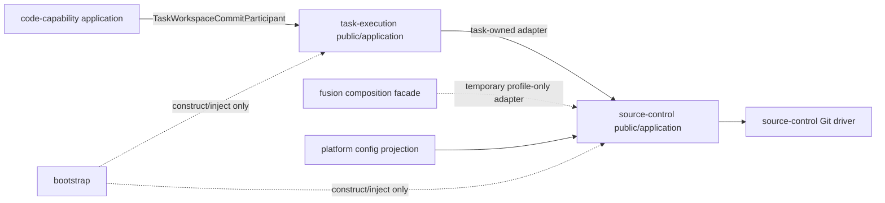

# RFC-308 任务 Git 提交、平台工作目录与自动排除规则归一——技术设计

> 产品行为见 [proposal.md](./proposal.md)，实施拆分见 [plan.md](./plan.md)。
> 强序：PR-1 先交 workspace/ignore/commit 架构归一；PR-2 才接管理员排除规则；PR-3 接 UI、可见性与 E2E。
> 本 RFC 的“统一”遵守 RFC-294 §1.2：统一机制，不抹平领域差异。

> **实现收口（2026-08-17；若与后续起草期候选 API 冲突，以本节与 plan 实施账为准）**：最终实现把 Git
> 机制收进 `source-control/application/repositoryCommit.ts`，由 composition-only repository binder 绑定 absolute path；
> task-execution 对 code-capability 只暴露四方法 `preview/freeze/publish/release` participant。普通任务保留既有
> NodeRun/message/repair orchestrator，但 add/index/commit/push/history argv 均已移出。代码能力 `freeze` 在同一调用里完成
> prepare+commit+keep-ref，人工确认只推该 immutable commit；publish 再按当前 policy 扫 outgoing history。因用户明确旧名字
> 零使用且禁止兼容读取，未实现 production pre-ready legacy scanner，而以 migration 0173 + production source zero-ratchet
> 硬切。配置由 task-execution 每个 commit/freeze operation 读取一次，失败回落 launch snapshot；不建立 daemon-global revision
> singleton。更重的 durable `WorkspaceRef`、artifact receipt codec 与 facade 文件搬迁仍属于 RFC-294 W5，不是本功能的第二套实现。

## 0. 设计原则与不变量

1. **一个仓内平台 namespace**：生产读写点只能落 `/.agent-workflow/{inputs,runs,fusion}/`；旧隐藏根在 cutover 后引用为 0。
2. **一个 platform ignore owner**：task、repo-group、Fusion 统一由 `WorkspaceExcludeManager` 管 per-worktree profile；
   新代码不得写业务仓 `.gitignore` 或 common `.git/info/exclude`。
3. **一个候选选择内核**：所有平台代理 commit 的 path inventory、Gitignore 匹配、selection digest、stats/diff 与
   outgoing-history scan 只有一个实现。
4. **两个业务 orchestrator**：普通 task auto-publish 与 code-capability artifact/push 保留独立状态机；禁止为“统一”
   创造带 30 个 optional 字段的 `commitAnything(options)`。
5. **任务拥有 workspace authority**：code-capability 不拿绝对路径调用 Git；它只拿 task-execution 铸造的 opaque、task/repo/fence-bound
   `TaskWorkspaceCommitCapability`。
6. **source-control 拥有 Git 机制**：task-execution 不解析 porcelain、不匹配 ignore、不组 pathspec、不直接发 commit/push。
7. **preview = freeze 的可验证前像**：preview receipt 带 policy + selection digest；freeze 必须重算并 exact-equality check，
   不允许“看见 A、提交 B”。
8. **push 前检查历史**：只过滤 index 不能阻止祖先 commit 泄漏；所有平台代理 push 都在最后一步扫描 outgoing commits。
9. **内部恢复完整**：node isolation/full-state snapshot 不吃用户排除规则；内部 commit 若最终可能上远端，由第 8 条阻断。
10. **平台 profile 不是最终防线**：per-worktree excludes 只改善 Git status/add 的 untracked 视图；strict candidate/history
    guard 直接消费 typed hard rules，agent 改 Git config 也绕不过。
11. **配置一次读取**：一个 operation 固定一份 config slice；hot apply 只影响下一次 operation。
12. **新增 path 为 repo-relative**：本 RFC 新增的 participant/exclusion receipt、日志与 UI 字段不出现 host absolute path；
    absolute binding 只能存在于 composition/infrastructure。RFC-075 既有 `CommitPushMeta.repoPath` 为兼容债，本 RFC 不扩大也不
    借机删除，留后续 wire-cleanup RFC。

## 1. RFC-294 对齐

### 1.1 Bounded context 与层次落位

本 RFC 是 RFC-294 W5 “Source-control 边界”的一个可独立验收 vertical slice，同时把 RFC-304 已声明却尚未兑现的
`code-capability → source-control.public` 依赖收成更窄的 task-owned workspace capability。

目标文件形状：

```text
packages/shared/src/workspaceConvention.ts # canonical root/subdirs/path helpers

modules/source-control/
  domain/
    workspaceExcludeProfile.ts  # canonical + dynamic mounts hard rules
    taskCommitPolicy.ts          # 规则规范化、Gitignore matcher、policy digest
    taskCommitSelection.ts       # path-status/rename group → included/excluded
    outgoingCommitGuard.ts       # commit-by-commit changed-path 判定
  application/
    workspaceExcludeManager.ts   # install/ensure/remove per-worktree profile
    repositoryCommit.ts          # inspect/stage/freeze/push/release 机制编排
    ports/gitCommitDriver.ts     # source-control-owned Git/profile SPI
  composition/required-ports.ts  # TaskCommitSettingsProjection（consumer-owned SPI）
  infrastructure/
    gitCommitDriver.ts           # runGit、porcelain/raw diff、index/ref/push
  public/
    participants.ts              # candidate/publication/workspace-profile participants
    types.ts                     # JSON-safe receipt；不含 path/Db/git vendor type
  composition.ts                 # 组装 matcher/driver/projection；无业务 if/switch

modules/task-execution/
  application/
    taskCommit/
      autoPublish.ts             # RFC-075：NodeRun、message agent、repair loop
      taskWorkspaceCommit.ts     # task/repo/fence 校验 + public participant
  infrastructure/cross-context-adapters/
    sourceControlCommitAdapter.ts
  public/
    participants.ts              # TaskWorkspaceCommitParticipant
    types.ts
  composition.ts                 # 注入 source-control participant/config projection

modules/code-capability/
  application/...                # artifact/work-item 语义不动
  composition/...                # 注入 TaskWorkspaceCommitParticipant + capability
  ports/gitPort.ts               # 只保留 fetch/checkout/disposable-worktree 等非提交面

services/fusion.ts               # 迁 manifest path；exclude 安装改调 SC participant
services/task.ts                 # repo-group 物化改装 profile，不写/提交 .gitignore
```

`services/commitPushRunner.ts` 在切换期只能成为 `task-execution/application/taskCommit/autoPublish.ts` 的一跳 facade；
`modules/code-capability/infrastructure/gitAdapter.ts` 删除 `readWorktreeDiff/commitWorktree/pushCommit/pushNewBranch/deleteRef`
实现，只保留 MR fetch/checkout/review shard worktree 这类非提交操作。消费者归零后删 facade，不能让旧路径继续持有业务分支。

### 1.2 依赖方向



- `code-capability` 不 import task-execution internal/source-control internal，也看不到 repository/worktree absolute path；
- `task-execution` application 只依赖 source-control public participant，不 import Git driver；
- source-control 不读 `tasks/task_repos/node_runs/code_artifacts` 表，不决定 task/work-item 状态；
- bootstrap 只装配 module composition entrypoint 和 typed projection，不按 task kind/capability/push policy 分支。

### 1.3 本 RFC 的受控过渡 seam

RFC-294 W5 尚未交付 durable、source-control-owned `WorkspaceRef`，当前权威路径仍在 `task_repos.repo_path/worktree_path`。
本 RFC 不把 absolute path 暴露到 public DTO，而使用一条 composition-only binder：

```ts
interface RepositoryWorkspaceBinder {
  bind(input: RepositoryWorkspaceBinding): RepositoryWorkspaceCapability
}

interface RepositoryWorkspaceBinding {
  readonly repoPath: string
  readonly worktreePath: string
  readonly repositoryKey: string
  readonly profile: WorkspaceExcludeProfileRef
}
```

- `RepositoryWorkspaceBinding` 只在 task-execution infrastructure → source-control composition adapter 内可见；
- binder canonicalize 路径、验证 worktree 属于预期 repository common dir，并对拍 durable profile receipt 与 Git
  worktree-config/profile digest 后铸 unique-symbol capability；
- capability deep-frozen、不可序列化、无 public field、不能 spread/cast 重组；
- task application 只见 task-owned wrapper capability，不见 binding；
- code-capability 只见更外层 `TaskWorkspaceCommitCapability`；
- exact ledger 将该 seam 标为 `removeAfterWave: RFC-294-W5-workspace-ref-cutover`。

第二条过渡 seam 是 Fusion：RFC-294 的终局要求 knowledge-evolution 通过 task-execution `InternalWorkspacePreparationPort`
取得 pre-materialized workspace，再由 TE→SC；当前 `fusion.ts` 仍自己 `git init`。本 RFC 不新增 KE→SC public DAG edge，
而在 fusion composition facade 里注入一个只含 `ensureWorkspaceProfile(capability)` 的临时 adapter；它只能为 fusion 自己刚创建的
standalone repo 铸 capability，不能取得 task commit/push。删除目标登记为
`removeAfterWave: RFC-294-W4-E3-fusion-workspace-preparation`。

两条 seam 都比现状前进：绝对路径/Fusion Git 从业务实现收缩到 composition/infrastructure；W4/W5 正式 port/ref 落地后
替换，不改 task/code public 合同，也不把临时 adapter 升格为跨域 API。

### 1.4 临时 public-surface 账本

| owner          | entrypoint/symbol                                            | direction      | production consumer                                    | authority                                           | tx/effect                 | data class            |
| -------------- | ------------------------------------------------------------ | -------------- | ------------------------------------------------------ | --------------------------------------------------- | ------------------------- | --------------------- |
| task-execution | `public/participants.TaskWorkspaceCommitParticipant`         | offered        | code-capability composition                            | task execution capability + current workspace fence | effect；caller 不持 DB tx | confidential metadata |
| task-execution | `public/types.TaskWorkspaceCommitCapability`                 | offered opaque | code-capability code-round runner                      | task/repo/ownership generation bound；不可 wire     | ephemeral                 | confidential          |
| source-control | `public/participants.RepositoryCommitCandidateParticipant`   | offered        | task-execution SC adapter                              | repository workspace capability                     | effect                    | confidential metadata |
| source-control | `public/participants.RepositoryCommitPublicationParticipant` | offered        | task-execution SC adapter                              | repository workspace + commit artifact capability   | effect                    | confidential metadata |
| source-control | `public/participants.WorkspaceExcludeParticipant`            | offered        | task workspace-prep adapter；fusion composition facade | repository workspace capability                     | effect                    | metadata              |
| source-control | `public/types.RepositoryWorkspaceCapability`                 | offered opaque | task-execution SC adapter                              | composition binder bound；不可 wire                 | ephemeral                 | confidential          |
| source-control | `composition/required-ports.TaskCommitSettingsProjection`    | required       | platform config adapter                                | none；read-only                                     | operation snapshot        | metadata              |

预算：每个跨 context interface ≤ 5 methods；DTO top-level ≤ 12；所有 union exact codec/unknown-key reject；无 `any`、
`Record<string,unknown>`、DbClient/Drizzle/Hono/FS/Git types、absolute path。

## 2. 合同设计

### 2.1 Platform workspace convention 与 profile

Neutral shared contract：

```ts
export const PLATFORM_WORKSPACE_DIR = '.agent-workflow' as const
export const PLATFORM_WORKSPACE_SUBDIRS = {
  inputs: 'inputs',
  runs: 'runs',
  fusion: 'fusion',
} as const

platformWorkspacePath('inputs', ...segments) // POSIX repo-relative, validates every segment
platformWorkspacePath('runs', 'code-capability', roundId, stageName)
platformWorkspacePath('fusion', 'result.json')
```

Helper 对 segment 做 NFC、拒绝 empty/`.`/`..`/slash/backslash/control/absolute/drive prefix；round/stage/port 等动态值在 domain
边界先转 stable safe segment，不能把用户文本直接拼路径。`repoGroupLayout.normalizeMountPath` 只拒绝 canonical root 为首段；
被删除的旧平台名字不进入 shared/production 常量，用户可正常使用。普通业务目录可以叫 `agent-workflow`（无 leading dot），不误伤。

在创建任何 task worktree 前，source-control 对选定 ref 的 tree 运行 `findTrackedPathUnderMounts(...,['.agent-workflow'])` 同级
检查；命中即 `platform-workspace-root-occupied`，点名 tracked path 并拒绝启动。Ignore 对 tracked 无效，放过会让平台输入/
run manifest 覆盖业务文件或让 strict hard rule吞掉合法修改。该检查覆盖主仓、每个 repo-group member 与 submodule selected
commit；Fusion repo 是平台新建空仓，无冲突。

所有实际目录写入再经 source-control infrastructure 的 `ensurePlatformWorkspaceDirectory(binding, kind, segments)`：从 canonical
worktree root 解析、逐级 `lstat` 拒 symlink/非目录、`realpathInside` containment、0700 mkdir，并在每次写前复验；返回的 absolute
path 只在 task/code/fusion infrastructure adapter 内使用，不进 public DTO。这样统一名字不会复活“预先放一个
`.agent-workflow` symlink，让 daemon 写出 worktree”的路径逃逸。

Hard cutover 先执行只读 inventory：扫描非终态 tasks/fusions 的 frozen snapshot/inputs/params、已记录 worktree、Git refs 与
实际目录，查 `.aw-run/.agent-inputs/.agent-workflow-inputs/__fusion__` 及 `gitignore_commit IS NOT NULL`。任一命中就以
`workspace-convention-cutover-blocked` 阻止 pre-ready，输出有界 task/fusion ids + reason；不自动重写/迁移数据。分母为 0 后，
为仍可恢复、但未使用旧名字的非终态 task worktree 安装 v1 profile并写 receipt；随后旧名字不进入 production
constant/reader/writer/fallback，相关旧测试删除或改成“production 零命中”ratchet。Terminal history不需要 profile/目录 reader。

Hard profile：

```ts
interface WorkspaceExcludeProfileV1 {
  readonly version: 1
  readonly canonicalRoot: '/.agent-workflow/'
  readonly directChildMounts: readonly RepoRelativeDirectory[]
  readonly inheritedExcludeDigest: string | null
  readonly digest: WorkspaceExcludeProfileDigest
}
```

`directChildMounts` 由 RFC-248 `exclusionPlanFor` 的纯布局代数迁名/迁 owner 而来；只含当前仓的直接子 mount，继续转义
Gitignore 元字符。Profile 的 Gitignore 文本有 fixed header/version/digest：先保留 Git 原本 effective 的 global/system/common
`core.excludesFile` 内容，最后写平台 hard roots 与动态 mounts；hard rules 总在同一 profile 末尾。这样启用 worktree override 不会
静默丢掉运维已有 global ignore。Inherited file/path 只在 infrastructure 读取，profile receipt 仅持 content digest，不把 host path
上送。同 profile 重复 ensure byte-identical。

Installer algorithm（平台拥有的 task mirror/worktree 或新建 Fusion repo）：

1. `rev-parse --git-common-dir` / `--git-dir` canonicalize，并验证 common dir 属 app-home platform repo，Fusion 则验证是本次
   operation 刚 `git init` 的 standalone repo；
2. common repo `extensions.worktreeConfig` unset/true → 幂等设 true；显式 false 或 common dir 非平台所有 → fail closed，
   不覆盖用户仓；
3. 用 `git config --show-origin` 区分 effective excludes 来源：global/system/common 配置可读其文件（有界 1 MiB）并合入 profile；
   已有 worktree-scoped 非平台值拒绝，不能覆盖；
4. 解析 per-worktree git dir，在其下原子写 `agent-workflow/excludes/v1`（0600、no symlink、temp+rename）；
5. 读现有 `git config --worktree --get core.excludesFile`：unset/等于本 manager 路径可写；其它值拒绝
   `workspace-exclude-config-conflict`，绝不覆盖；
6. `git config --worktree core.excludesFile <canonical profile path>`；
7. `git status --porcelain --untracked-files=all` + `git check-ignore` 验证 canonical root/direct mounts 实际被排除；失败回滚本次
   worktree materialization，不降级到写 `.gitignore`；
8. 返回 profile digest 给 `RepositoryWorkspaceCapability`；strict commit engine 使用同一 hard profile object，不把 inherited
   user ignore 升格为 tracked/history hard deny，也不回读 Git config决定平台规则。

管理员 `taskCommitExcludePatterns` **不写进 Git profile**：它们属于平台代理提交策略，需要覆盖 tracked/history 并在 commit
详情里统计 only-excluded；写进 `core.excludesFile` 会让 untracked path 在 dirty inventory 前消失，也会让一次全局配置保存修改
所有在途 worktree 的 Git 视图。它们只进入 §2.3 strict policy；profile 只收系统 hard rules/动态 mounts/继承的原 Git excludes。

Task start/resume/retry/boot recovery 在进入 scheduler/agent 前只 ensure v1 profile；cutover inventory 已保证没有旧 convention
consumer，所以不存在 legacy 分支。Worktree remove 会连 per-worktree gitdir/profile/config 一起回收；standalone Fusion GC
显式删除整个 workdir。

RFC-248 materialization 调整：父 worktree 建好后、创建下一层 child 前先 ensure profile（维持原 depth ordering）；删
`commitGitignorePreset` / `repoGroupGitignore.ts`，不改 `.gitignore`，不移动 HEAD/baseCommit；`gitignore_commit` DB 列、shared wire、
mapper/reader/tests 在同一 migration/consumer cut 删除，不留 legacy surface。

Fusion 调整：`SCAFFOLD='__fusion__'` / `.git/info/exclude` 及旧 reader 全删；manifest 只落
`.agent-workflow/fusion/result.json`，copy/publish 明确跳过整个 canonical root。

Upload 调整：

- `agentInputUploadDir` 直接返回完整 canonical `.agent-workflow/inputs/agent/<port>`，让前端 hint、frozen snapshot、packed
  value 与磁盘同名；group resolver 识别已-canonical target，不重复加 prefix；
- repo-group generic upload prefix 从 `.agent-workflow-inputs` 改 canonical inputs root；
- single-repo ordinary workflow 的显式 `targetDir` 不加 prefix，保持现有产品合同；
- authored `targetDir` 若已以 `.agent-workflow/` 开头（现有文档曾示例 `.agent-workflow/uploads`），group 路径也视为显式
  canonical-root target、不再二次套 `inputs/.agent-workflow/...`；它仍受 root hard deny；
- `applyUploadsToWorktree` 返回 packed path 必须使用 actual `effectiveTarget`，确保 prompt/port 指向真实文件；
- cutover inventory 必须先证明非终态 frozen snapshot/inputs 中旧 Agent/group target 为 0；随后旧 target reader/path helper 删除。

### 2.2 Config

Shared config 新增：

```ts
const TaskCommitExcludePatternSchema = z.string().min(1).max(1024)

taskCommitExcludePatterns: z.array(TaskCommitExcludePatternSchema).max(256).default([])
```

`ConfigPatchSchema` 同字段允许 array / `null`（null = 删除键、回落空数组）。保存前做语义校验：UTF-8 总量 ≤ 64 KiB、
无 NUL/内嵌换行/host absolute/越界 `../`。注释行保留原文，空行在 TextArea → array 映射时丢弃。

运行期模块不调用 `loadConfig()`。Bootstrap 用现有 config-applied 通知构建一个 typed projection：

```ts
interface TaskCommitSettingsV1 {
  readonly version: 1
  readonly configuredPatterns: readonly string[]
}

interface TaskCommitSettingsProjection {
  read(): {
    readonly revision: number
    readonly settings: TaskCommitSettingsV1
  }
}
```

初始 boot 读取一次；`PUT /api/config` 成功持久化、`notifyConfigApplied` 之后才替换 slice。revision 只在该 slice 逐字变化时 +1；
一次 commit operation 只调用一次 `read()`。直接修改 config 文件/不触发通知的 CLI 保持仓库现有语义：重启后生效，
不在本 RFC 内虚构文件 watcher。

### 2.3 有效策略与 digest

```ts
const TASK_COMMIT_BUILTIN_POLICY_VERSION = 1

interface EffectiveTaskCommitPolicy {
  readonly version: 1
  readonly configRevision: number
  readonly builtinVersion: number
  readonly workspaceProfile: WorkspaceExcludeProfileV1
  readonly configuredPatterns: readonly string[]
  readonly ignoreCase: boolean
  readonly digest: TaskCommitPolicyDigest
}
```

canonical digest：

```text
sha256(canonical-json({
  version,
  configRevision,
  builtinVersion,
  workspaceProfileDigest,
  configuredPatterns, // 保序；Gitignore last-match-wins
  ignoreCase
}))
```

配置 matcher 与 workspace hard matcher 分开执行，最终
`excluded = workspaceHardIgnored || configuredIgnored`；所以用户的 `!` 只能反选 configured matcher 的前序规则，不能挖穿
canonical root 或 direct child mounts。Git profile 与 strict matcher 都由同一个
`WorkspaceExcludeProfileV1` 渲染，不能各手抄一份规则。

### 2.4 Task public participant

```ts
declare const taskWorkspaceCommitCapabilityBrand: unique symbol
interface TaskWorkspaceCommitCapability {
  readonly [taskWorkspaceCommitCapabilityBrand]: 'task-workspace-commit-v1'
}

interface TaskWorkspaceCommitParticipant {
  inspect(
    capability: TaskWorkspaceCommitCapability,
    input: InspectTaskWorkspaceChange,
  ): Promise<TaskWorkspaceChangePreview>

  freeze(
    capability: TaskWorkspaceCommitCapability,
    input: FreezeTaskWorkspaceChange,
  ): Promise<FreezeTaskWorkspaceChangeResult>

  publish(
    capability: TaskWorkspaceCommitCapability,
    input: PublishTaskWorkspaceCommit,
  ): Promise<PublishTaskWorkspaceCommitResult>

  release(
    capability: TaskWorkspaceCommitCapability,
    artifact: TaskWorkspaceCommitArtifactRef,
  ): Promise<TaskWorkspaceCommitReleaseReceipt>
}
```

Capability 由 code-round task engine 在 current task ownership/write-fence scope 内铸造，绑定 exact task、repoIndex、
ownership/driver generation 与 workspace binding。Methods 不再接受 taskId/repoPath/worktreePath/repoIndex；错误 capability、stale
generation、readonly repo 在进入 source-control 前失败。

Public inputs/outputs：

```ts
interface InspectTaskWorkspaceChange {
  readonly version: 1
  readonly maxDiffBytes: number
}

interface TaskWorkspaceChangePreview {
  readonly version: 1
  readonly selectionDigest: TaskCommitSelectionDigest
  readonly policyDigest: TaskCommitPolicyDigest
  readonly diff: string
  readonly filesChanged: number
  readonly insertions: number
  readonly deletions: number
  readonly exclusions: TaskCommitExclusionSummary
}

interface FreezeTaskWorkspaceChange {
  readonly version: 1
  readonly purpose: 'code-artifact' | 'ci-fix' | 'requirement' | 'invoke-seed'
  readonly operationKey: string
  readonly message: string
  readonly author?: { readonly name: string; readonly email: string }
  readonly expectedSelection?: {
    readonly selectionDigest: TaskCommitSelectionDigest
    readonly policyDigest: TaskCommitPolicyDigest
  }
}

type FreezeTaskWorkspaceChangeResult =
  | {
      readonly kind: 'frozen'
      readonly artifact: TaskWorkspaceCommitArtifactRef
      readonly commit: CommitRef
      readonly preview: TaskWorkspaceChangePreview
    }
  | { readonly kind: 'no-changes' }
  | { readonly kind: 'only-excluded'; readonly exclusions: TaskCommitExclusionSummary }
  | { readonly kind: 'selection-stale'; readonly reason: 'policy' | 'workspace' }
  | { readonly kind: 'failed'; readonly safeCode: TaskCommitSafeCode }

type PublishTarget =
  | {
      readonly kind: 'compare-and-swap'
      readonly branch: GitBranchName
      readonly expectedRemote: CommitRef
    }
  | {
      readonly kind: 'new-branch'
      readonly branch: GitBranchName
      readonly base: CommitRef
    }

interface PublishTaskWorkspaceCommit {
  readonly version: 1
  readonly artifact: TaskWorkspaceCommitArtifactRef
  readonly target: PublishTarget
}
```

`TaskWorkspaceCommitArtifactRef` 是可持久化、versioned 的 branded id（不是 capability）：绑定 task/repo/commit/purpose/
policy digest，keep-ref 名由 source-control 对 `(task, repo, purpose, operationKey)` 做 canonical hash 后确定性派生。Caller
不能传任意 SHA/ref 去 push/delete；daemon 重启后 source-control 可从 ref id + 当前 task capability 重建并验证 exact keep-ref，
不需要 process-local Map。`release` 只能释放该 capability 产生且仍 live 的 artifact ref。Artifact 的 durable DB lifetime仍由
code-capability `code_artifacts` 管理；task participant 不成为第二个 artifact aggregate owner。

### 2.5 Source-control participant 与 task internal use case

Source-control 对 task adapter 提供两个窄 participant，均只接受 `RepositoryWorkspaceCapability`：

```ts
interface RepositoryCommitCandidateParticipant {
  inspect(...): Promise<RepositoryChangePreview>          // temp index；code preview
  prepare(...): Promise<PreparedCommitCandidateRef>       // live index；普通 auto-publish
  commitPrepared(...): Promise<RepositoryCommitArtifact>  // 只提交 prepare 冻结的 index tree
}

interface RepositoryCommitPublicationParticipant {
  publish(...): Promise<RepositoryPublishReceipt>         // working/CAS/new closed union
  amendMessage(...): Promise<RepositoryCommitArtifact>    // RFC-075 repair only
  release(...): Promise<RepositoryCommitReleaseReceipt>   // 自己签发的 keep-ref only
}
```

每个 interface 3 methods，不再扩出 generic `runGit(args)`。普通 task auto-publish 是 task-execution internal application use case：

```text
top-level node done
  → mint commit container NodeRun
  → source-control.prepare(live index under write fence)
  → release write fence；candidate index tree 已冻结
  → task-execution commit-message agent
  → source-control.commitPrepared(verification=normal)
  → source-control.publish(target=working-branch)
  → task-execution persist CommitPushMeta / child sessions / outcome
```

code-capability 则只使用 2.4 的四方法；task adapter 把 `inspect` 映射到 candidate participant，把 `freeze` 组合成
`prepare + commitPrepared`，再把 publish/release 映射到 publication participant。它不能选择 RFC-075 的 non-FF merge/message
repair，也不能把 `verification:'normal'|'artifact'` 当用户 input。

### 2.6 提交身份与 verification policy

统一 identity resolver：

```ts
type TaskCommitIdentity =
  | { kind: 'task'; name: string; email: string }
  | { kind: 'code-author'; name: string; email: string }
  | { kind: 'platform' }
```

优先级：code-author（RFC-304 明确作者）→ task identity → `AW_INTERNAL_GIT_IDENTITY`。所有 commit/amend/merge class command 都
显式注入 `GIT_AUTHOR_*` + `GIT_COMMITTER_*` env，压过 daemon ambient env；不再让 `-c user.*` 被 ambient author 覆盖。

Verification policy 是 application 固定映射：

| use case                                                     | Git args                              | 保真理由                            |
| ------------------------------------------------------------ | ------------------------------------- | ----------------------------------- |
| RFC-075 auto publish                                         | `git commit -m`（不附 `--no-verify`） | 保留业务仓 hooks 与现有 push repair |
| RFC-304 frozen artifact / CI Fix / requirement / invoke seed | `--no-verify --no-gpg-sign`           | 保留确定性 artifact 与现有行为      |
| internal snapshot/commit-tree                                | 原实现                                | 不进入 unified user commit policy   |

调用方不能在 public input 自选 verification policy，防止 code-capability 借普通路径绕过自己的 artifact 合同，或普通任务静默
关闭仓库 hook。

## 3. 候选选择算法

### 3.1 Path inventory

Git driver 以 NUL-delimited porcelain/raw records 读取所有 change kind，解析为 closed union：

```ts
type ChangedPathGroup =
  | { kind: 'single'; status: GitChangeStatus; path: RepoRelativePath }
  | {
      kind: 'pair'
      status: 'rename' | 'copy'
      from: RepoRelativePath
      to: RepoRelativePath
    }
```

禁止按换行/split 解析文件名；path 可含空格、tab、newline、leading dash、glob 字符。所有 Git argv 使用 literal pathspec +
NUL pathspec file/chunked stdin-safe adapter，绝不把用户路径解释成 revision/option/pathspec magic。

### 3.2 Matcher

实现使用直接依赖的 `ignore` Gitignore matcher（已有 lock 版本，backend package 显式声明依赖），并用真实 `git check-ignore`
fixtures 做 oracle 对拍。输入只允许 repo-relative、POSIX `/` path；Windows Git 输出先规范化分隔符，case behavior 取
`git config --bool core.ignoreCase`。

对 pair group：`from` 或 `to` 任一被 effective policy 排除，整个 group excluded。这样 rename/copy 不会只提交一半。

### 3.3 Preview index

`inspect` 使用独立 `GIT_INDEX_FILE`：

1. 从 HEAD/current index 建临时 index；
2. `git add -A` 捕获 working tree；
3. 对 staged records 运行 matcher；
4. 从临时 index 恢复 excluded groups；
5. 由剩余 index 生成 numstat/stat/diff；
6. 计算 `selectionDigest = sha256(HEAD + policyDigest + binaryDiff)`；
7. finally 删除临时 index。

这替代 code-capability 当前对 live index 的 `add -A --intent-to-add`，预览不再污染真实 index。

### 3.4 Prepare / freeze index

两种业务共享 path inventory/filter/digest，但锁窗口不同，不能互换：

**普通 auto-publish：`prepare → commitPrepared`**

1. 在 task write fence 内固定 policy slice，并保存 live index 的进入前 fingerprint；
2. 对 live index `git add -A`，inventory + filter，excluded groups 恢复到 HEAD，working tree 不动；
3. included=0 时按 no-change/only-excluded 返回；否则签发绑定 `HEAD + index tree + policy/selection digest` 的
   `PreparedCommitCandidateRef`；
4. 释放 write fence，task-execution 用该 candidate 的 stat/diff 运行慢速 commit-message agent；
5. `commitPrepared` 先验证 live index tree 仍等于 candidate（sibling writer 只能改 working tree，不能改已冻结 index），再执行
   normal commit；writer 在第 4 步之后产生的文件保持 unstaged，留给下一次 commit。

这保持 RFC-076 C4 的现有语义：写锁只覆盖 stage+diff，不覆盖 LLM/commit/push；不能改成“先 temp preview、LLM 后再
live stage”，否则 message 生成期间到达的 sibling change 会被混进本 commit 或制造无穷 stale retry。

**Code-capability：`inspect → freeze`**

1. `inspect` 用 §3.3 temp index 返回 expected policy/selection；
2. `freeze` 在 task write fence 内保存 live index 进入前 snapshot，再执行与 prepare 相同的 add/inventory/filter；
3. 重算 selection digest；若 expected 不等，把 live index 恢复到进入前 byte-exact snapshot，释放 fence并返回
   `selection-stale`；
4. 相等则在同一 fence 内以 artifact verification policy commit，签发 opaque artifact/keep-ref，并从**实际 commit**返回 exact
   diff；artifact digest 继续由 code-capability 对该 diff 计算。

任何 add/inventory/reset/diff/index-tree verify 失败都是 `failed`，不能降级成 `only-excluded` 或 `no-changes`。普通
auto-publish 在 message child unreaped/commit 失败时保留现有“candidate 已 staged、供人诊断/恢复”的语义；code selection-stale
则必须恢复进入前 index，不能把一次未提交的 preview 校验改变用户 staging 状态。所有 early return/failure 路径仍 finally 释放
fence/temp index。

### 3.5 Exclusion summary

```ts
interface TaskCommitExclusionSummary {
  readonly version: 1
  readonly policyDigest: TaskCommitPolicyDigest
  readonly excludedPathCount: number
  readonly paths: readonly {
    readonly path: RepoRelativePath
    readonly source: 'platform' | 'configured'
  }[] // max 100, stable lexical order
  readonly truncated: boolean
}
```

同一 rename/copy group 的两个 path 各自计数/展示，但 `excludedPathCount` 是 unique path count；UI 不声称 group count。
日志只写 count/digest/truncated，path 清单只进入 actor-filtered task/code view。

## 4. Publish 与 outgoing-history guard

### 4.1 为什么 stage filter 不够

以下现有路径都会产生“index 已过滤但 push 仍泄漏”的情况：

- agent 在工作树中自己先 `git commit`；
- nodeIsolation 为 submodule 工作内容生成内部 commit，后续 RFC-210 把 clean-ahead HEAD 推走；
- code-capability 在一个已有 local-ahead HEAD 上再 freeze；
- excluded path 在前一笔 commit 出现、后一笔又删除，净 diff 看起来为空。

因此 guard 必须看 commit history，而不是只看 `git diff base..tip`。

### 4.2 Guard 输入与算法

```ts
interface OutgoingCommitGuardInput {
  readonly workspace: RepositoryWorkspaceCapability
  readonly base: CommitRef
  readonly tip: CommitRef
  readonly policy: EffectiveTaskCommitPolicy
}
```

1. 验证 base/tip 是 commit 且 base 是目标 push 语义允许的边界；
2. 枚举 `base..tip` 中每笔 commit 的 raw changed path groups（含 root commit/new branch 特例）；
3. 不做 net collapse；逐 commit 匹配；
4. 任一命中返回 `blocked` + bounded summary + offending commit count；
5. 无命中返回带 `base/tip/policyDigest/historyDigest` 的 receipt；push 必须消费同 receipt；
6. push 前 tip/ref/remote expectation 任一变化，receipt stale，重新 resolve/scan。

Working branch：凭 push credential resolve/fetch remote branch exact tip；不存在则使用**远端已可达 publication base**。
Cutover 已删除 `gitignore_commit` consumer/列并证明非终态 preset consumer=0；v1 `task_repos.base_commit` 始终就是 remote base，
不存在 legacy range 分支。

非快进路径 fetch/merge 之后以新 remote tip 和 merge tip 重扫再 push。CAS 使用 caller 的 `expectedRemote`，Git
`--force-with-lease` 仍作第二层原子门。New branch 必须携 `base`，禁止默认 HEAD^ 或 default branch 猜测。

### 4.3 Outcome

Shared `COMMIT_PUSH_OUTCOME` additive 新增：

- `skipped-excluded`：工作树有变化，但全部被策略排除；NodeRun done，无 commit/push；
- `commit-local-excluded-history`：本地 commit 已存在，但 outgoing history 命中；NodeRun failed，不 push；
- 既有 outcome wire/value 不改。

`CommitPushMetaSchema.exclusions` optional，旧行继续 parse。Code-capability 使用 typed safe code：
`only-excluded | policy-stale | excluded-history`，不复用 RFC-075 outcome 字符串污染工作项 domain。

## 5. Submodule 语义

递归顺序仍 bottom-up，但在进入子仓前先判父仓 mount path：

1. 父仓 effective policy 命中 submodule mount → 整棵 subtree `excluded`，不 checkout branch、不 commit、不 push；
2. 未命中 → 进入子仓，先为 platform-owned submodule checkout ensure canonical profile（不把 tracked gitlink 本身当
   repo-group dynamic mount），再按子仓 root/core.ignoreCase 重新构建 effective policy；
3. dirty 内容走统一 freeze selection；
4. clean-but-ahead 内容不补 commit，但 outgoing-history guard 必须通过；
5. child excluded-only 不算 push failure；结果记录 exclusions；
6. child excluded-history/真实 Git error 仍按 RFC-210 withheld parent；
7. parent gitlink 只有 child commit 成功发布后才可进入 parent candidate。

`SubrepoPushResultSchema` additive 新增 optional `exclusions` / `skippedReason:'excluded-mount'|'only-excluded'`，存量字段不改。

## 6. Code-capability 切换

### 6.1 Port 缩窄

当前 `GitPort` 同时拥有 fetch、checkout、disposable worktree、commit、diff、push、ref lifecycle。PR-1 后拆为：

- `CodeReviewGitPort`：fetch ref、checkout detached、add/remove disposable review worktree；仍属 code-capability port；
- `TaskWorkspaceCommitParticipant`：inspect/freeze/publish/release；来自 task-execution public。

生产负扫描要求 `modules/code-capability/**` 不再出现 `['add','-A']`、`commit`、`push`、`update-ref/delete-ref` 任务提交 argv
（MR fetch/checkout/worktree argv 合法）。

### 6.2 各阶段映射

| 现有调用                                     | 新调用                                    | selection consistency         |
| -------------------------------------------- | ----------------------------------------- | ----------------------------- |
| `readWorktreeDiff` in validate/decide        | `inspect(capability)`                     | receipt 写入 stage artifact   |
| `freezeArtifact → commitWorktree`            | `freeze(expectedSelection)`               | frozen result 自带 exact diff |
| CI anti-cheat read → push freeze             | inspect receipt → freeze expected receipt | policy/workspace 变动即 stale |
| requirement `commitWorktree + pushNewBranch` | freeze → publish(new-branch, base)        | base 必填                     |
| invoke seed `commitWorktree`                 | freeze(purpose=invoke-seed)               | 子序列 finally release        |
| `deleteRef`                                  | `release(artifactRef)`                    | caller 无 raw ref delete 能力 |

ArtifactStore 仍持久 `commitSha/baseSha/digest/keepRef` 吗？迁移期为 wire/恢复兼容可以继续存现有列，但新代码不再根据
`keepRef` 字符串直接删 ref，而把 task commit artifact opaque receipt 的 durable codec 一并存入 artifact metadata。
旧行走 versioned legacy release adapter；新行只走 participant。不能先停写 keepRef 再让旧 awaiting artifact 无法释放。

### 6.3 Code-round capability 注入

`runOneNode`/code-round execution entry 从 current task state 铸 `TaskWorkspaceCommitCapability` 并注入 code-capability runner；
`capabilityWiring` 不再自行 `createGitAdapter()` 获得 commit 权限。Resume/recovery 重新从当前 task ownership mint，旧 capability
因 generation stale 失效。

## 7. 普通 auto-publish 切换

`maybeRunCommitPush` 的触发矩阵、parent NodeRun 归属、readonly skip、多 repo 顺序不改。迁移分两刀：

1. PR-1 先把 `runCommitPush` 内的 stage/commit/push Git 机制替换为 source-control participant，结果逐字段对拍；
2. consumer 全绿后把 orchestrator 移入 `modules/task-execution/application/taskCommit/autoPublish.ts`，旧 service 一跳转发；
3. PR-2 只在 source-control selection/history guard 接 policy，task orchestrator 只消费新增 receipt/outcome；
4. PR-3 consumer 归零后删旧 facade。

Commit-message agent、session child NodeRun、repair prompt、language/runtime/max retries/diff budget 留 task-execution；source-control
只接最终 message 和 amend receipt，不依赖 runtime/resource injection。

## 8. Settings 与前端

### 8.1 Settings scope

`SETTINGS_CONFIG_SCOPE_KEYS.git` 加 `taskCommitExcludePatterns`；`systemAgents` 不加，防止同一字段被两个 draft owner 保存。
`GitTab` 新增 `SettingsCard`：

- `<Field>` label/hint；
- `<TextArea monospace>`；
- `value = patterns.join('\n')`，onChange 只保存在 local draft string，保存时再 parse，避免每键入一个换行就丢格式；
- field-adjacent validation，Save invalid 时禁用并聚焦；
- 文案明确“应用于下一次平台代理提交；不删除文件；强于 `.gitignore`，也排除 tracked；不拦 runtime 自己 push”；
- 显示不可编辑的 canonical rule `/.agent-workflow/`，并说明仓库组直接子 mount 由平台按工作树自动追加；
  复用 muted/read-only 表现，不把 hard rules 混进可编辑文本导致用户以为能删除。

### 8.2 Task detail

`CommitRunRow` 在 subrepo 列表邻位加入 exclusions disclosure；复用 `StatusChip` / `<details>` / data-table muted styles，不新增
modal/chrome。`skipped-excluded` 用 info/neutral，不显示 success push；`commit-local-excluded-history` 用 danger，明确“本地保留、
未推送”。路径 `<code>` 渲染，最多 100，truncated 显示剩余 count。

Code-capability 活动面沿现有 stage error/reason 展示 safe summary；MR 评论只在该能力原本就需要回复时写一句有界说明，
不广播全部 path。

## 9. 失败模式与恢复

| 场景                                                        | 结果                                                                                                                                           |
| ----------------------------------------------------------- | ---------------------------------------------------------------------------------------------------------------------------------------------- |
| platform-owned common-dir 验证失败                          | `workspace-exclude-owner-mismatch`，拒绝安装，不碰 repo config/.gitignore                                                                      |
| worktree scope 已有非平台 `core.excludesFile`               | `workspace-exclude-config-conflict`，不覆盖；global/system/common effective exclude 则有界合入 profile                                         |
| profile 写入/config/verify 任一步失败                       | 本次 workspace materialization 回滚；绝不 fallback 到 `.gitignore`/common exclude                                                              |
| 业务 `.gitignore` 高优先级 `!` 重包含 hard path             | `workspace-exclude-overridden`，启动失败并点名冲突 path；不修改业务文件，strict guard仍不可绕过                                                |
| canonical root/ancestor 被换成 symlink/非目录               | `platform-workspace-root-unsafe`，本次写入前失败，绝不 follow 到 worktree 外                                                                   |
| resume 时 profile 丢失/被改                                 | current task authority 下幂等重建；strict engine仍以 DB receipt+typed profile为准                                                              |
| cutover inventory 发现旧目录/`gitignoreCommit` 非终态消费者 | `workspace-convention-cutover-blocked`，pre-ready 拒绝；不迁移、不双读、不自动改任务数据                                                       |
| 配置 pattern 非法                                           | PUT 422 `task-commit-pattern-invalid`，不持久、不 hot apply                                                                                    |
| preview 临时 index 失败                                     | typed `selection-failed`，不把 live index 当 fallback                                                                                          |
| live `git add`/filter/reset 失败                            | commit node/freeze failed；excluded path 不误报为 empty                                                                                        |
| policy 在 preview→freeze 间变化                             | `selection-stale:policy`，重新 inspect                                                                                                         |
| workspace 在 preview→freeze 间变化                          | `selection-stale:workspace`，重新 inspect                                                                                                      |
| only excluded                                               | 普通任务 `skipped-excluded`；代码能力 `only-excluded`，不 mint artifact                                                                        |
| outgoing history 命中                                       | local commit/ref 保留诊断，push fail closed                                                                                                    |
| remote 在 guard→push 间移动                                 | normal push 进入原 non-FF loop 并重扫；CAS 由 lease 拒绝                                                                                       |
| submodule mount excluded                                    | 整棵 skip，不 checkout/push remote branch                                                                                                      |
| submodule history blocked                                   | parent withheld，保留现有原子性                                                                                                                |
| daemon crash after freeze before artifact row               | 现有 orphan `refs/aw/*` reclaim 扫描继续负责；新 opaque receipt codec 可重建                                                                   |
| daemon crash after local auto commit before push            | commit 后、网络前先持久化 `local-committed` attempt receipt；恢复只续推该 exact平台代理 commit，不把任意 agent clean-ahead commit 当作平台待推 |
| config listener 丢事件                                      | current process 保持旧 immutable slice；重启从 durable config 修正，日志/health 暴露 revision                                                  |

最后一条要求修当前 auto-publish 的 dirty-only blind spot，但**不能**把它修成“只要 branch local-ahead 就平台代理 push”。
Source-control freeze 成功后、任何网络调用前，task-execution 先在 commit NodeRun 上持久化 versioned
`local-committed {commitSha, branch, policyDigest, selectionDigest}` attempt receipt；恢复只续推这个已证明由平台生成的 exact
commit。没有 receipt、只有 agent 自己 clean local-ahead 的工作树仍保持现状：不单独触发 push；若后续另一次平台代理 push
确实发生，那些祖先才进入 outgoing-history guard。

## 10. 测试策略

### 10.1 Domain / pure

- pattern validation：root/glob/directory/negation/comment/escaped space/escaped `#`/`!`；absolute/`../`/NUL/limit 拒绝；
- configured last-match-wins，workspace profile hard roots/mounts 不可反选；
- workspace convention：canonical path/safe segment、tracked-root admission、symlink/non-dir containment、canonical mount
  reservation、profile digest/render stable；cutover inventory 对四旧名/`gitignoreCommit` 正反样本；
- path groups：single + rename/copy pair，任一端命中整组 exclude；
- policy digest 对顺序/config revision/ignoreCase/builtin version 敏感；相同 canonical input 稳定；
- outgoing per-commit scan：出现后还原仍 block，baseline 已有但未改变不 block。

### 10.2 Source-control real Git matrix

- untracked/tracked/staged/modified/deleted/type-change；
- rename/copy old/new 命中；文件名含空格/tab/newline/leading dash/`[`/`!`；
- existing `.gitignore` + configured negation + workspace hard-profile precedence；
- per-worktree profile：worktreeConfig 隔离、existing excludes conflict、sparse/nested mounts、resume ensure、profile tamper 后 strict guard；
- admission：selected tree tracked canonical root、业务 `.gitignore` re-include hard root/mount、non-platform common-dir 均在写入前拒绝；
- RFC-248 新物化全链 `.gitignore` content/index/HEAD 零变化、schema/wire 无 `gitignoreCommit`；旧 writer/reader source=0；
- canonical directory mapping：Agent/group upload packed path、code round/stage、Fusion manifest/copy/restore；四旧名 production=0；
- preview temp index 不改变 live index；freeze excluded 后 working tree 仍 dirty；
- mixed/all-excluded/no-change 三分支；add/filter/reset failure 各自 fail；
- identity ambient env shield；normal vs artifact hook/gpg policy保真；
- outgoing normal/CAS/new-branch history block；remote race 后重扫；
- nested submodule、mount excluded、dirty child、clean-ahead child、blocked child withheld parent；
- Windows `core.ignoreCase`、path separator 与 pathspec literal。

### 10.3 Characterization / architecture

- 复跑并扩展 `commit-push-runner.test.ts` 全 12 类现有行为；
- 复跑 RFC-304 artifact/freezing/push authority/invoke/CI Fix/requirement suites；
- mutation test：恢复任意旧 `add -A` commit path，architecture ratchet 必红；
- import gate：code-capability 只能 import task-execution exact public participant；task application 不 import runGit/source-control infra；
- public surface ledger、recursive field budget、capability forge/cast/spread、unknown-key codec；
- `services/commitPushRunner.ts` facade 只能转发，不能含 Git argv/DB/state branch；consumer=0 后删除。

### 10.4 Frontend / E2E

- Settings TextArea roundtrip 保留逗号/escape/注释/顺序；null 清空；非法 pattern 禁 Save；内置规则不可编辑；
- task detail mixed/all/history-block/submodule/truncated；ACL 不可见时 API 本身 404/403，前端不泄 path；
- E2E 普通 auto commit：生成 `.agent-workflow/` 运行物 + tracked excluded + business file，远端只有 business file；
- E2E code-capability CI Fix：anti-cheat diff/frozen comment/remote commit 三处都不含 canonical platform root；
- E2E repo-group：nested mount + canonical inputs 对 outer `status/add -A/diff` 不可见，业务仓 `.gitignore` 与远端历史零平台改动；
- E2E Fusion：canonical manifest 可消费，`.git/info/exclude` 不写，skill content 不含 `.agent-workflow`；
- E2E config hot apply：任务运行中保存规则，下一次 commit attempt 生效；已经开始的 attempt receipt digest 不变；
- Chromium + WebKit Settings/Task detail；视觉基线仅在确有 UI 变化时更新。

## 11. Cutover、迁移与回滚

### 11.1 Wire/DB

- Config additive default `[]`，旧 config 自动 backfill；
- `CommitPushMetaSchema.exclusions`、`SubrepoPushResult.exclusions/skippedReason` optional；旧 `commit_push_json` 无需 backfill；
- `COMMIT_PUSH_OUTCOME` additive，新前端认识；旧前端按 default/fallback 展示但不影响任务状态；
- code artifact opaque receipt 以 versioned optional metadata additive 写入，旧 artifact 保留 legacy keepRef release adapter；
- `task_repos` additive `workspace_profile_version/digest`、`fusions` additive
  `workspace_convention_version/profile_digest`；profile install receipt 与 workspace/task row 同一 admission/iteration commit 持久；
- 同一 migration rebuild `task_repos` 删除 `gitignore_commit`，shared `TaskRepoSchema`/mapper/API 字段同步删除；pre-ready inventory
  先保证非终态消费者=0，terminal historical row 无需 profile reader；
- 不改变 `auto_commit_push` 默认/任务启动 wire；旧 frozen workflow JSON 仍可作为历史 blob 返回，但 task engine 不含旧目录
  特判/reader。

### 11.2 PR-1 回滚

PR-1 同时含显式获批的 workspace behavior change，必须 inventory→cutover：先落只读 zero-use inventory、canonical profile
installer、schema receipt 与旧行为 characterization；inventory=0 后在一个 cutover commit 直接删旧 reader/writer/schema并切
canonical，绝不双读/双写目录、`.gitignore` commit 或 push。新 convention row 一旦产生，旧二进制不能常规回滚；只允许停止
新 admission并向前修复。Cutover commit 前可整批 revert。

### 11.3 PR-2 回滚

关闭 configured pattern consumption不能关闭 workspace hard profile/canonical root 而谎称安全；若排除引擎本身有缺陷，回滚整个 PR-2 并在版本说明
明确保护失效。已经写出的 local commit/ref 保留；不重写远端历史。Config key additive 可暂时无人消费，不能 downgrade config。

### 11.4 PR-3 回滚

UI/metadata projection 可独立回滚；后端防线继续生效。不能因前端回滚删除 unknown optional fields 或把 blocked outcome 映射成 pushed。

## 12. 实现门不变量

- `rg "\['add', '-A'\]|\['commit'|\['push'" modules/code-capability` 在任务提交面为 0；合法 fetch/worktree 需 exact allowlist；
- `rg "taskCommitExcludePatterns"` 必须闭合 Config schema/default/patch → Settings draft → typed projection → source-control engine；
- main repo、每个 submodule、preview、freeze、normal/CAS/new push 的 policy digest 必须可追到同一 helper；
- 所有 push 调用都要求 `OutgoingCommitGuardReceipt`，没有 receipt 的 overload 不存在；
- public Task/SC participant 不含 `string path`、DbClient、Git argv、callback、options bag；
- code-capability 不持 raw keep-ref delete 权；
- internal snapshot 测试证明排除路径仍可跨节点恢复，但 remote E2E 证明它最终不上远端；
- route/config 只负责持久化与通知，规则语义不在 route/frontend 重写；
- `rg "commitGitignorePreset|buildGitignoreBlock"` production consumer=0；`fusion.ts` 不写 `info/exclude`；任何 `.gitignore`
  production write/add/commit 只有业务显式编辑路径，task/source-control 平台路径为 0；
- canonical path 写点只 import `workspaceConvention.ts`；四个旧根字面量只允许出现在 cutover inventory/negative source-ratchet，
  production reader/writer/fallback=0；
- profile install receipt 在 task/fusion DB 可追，Git config/profile digest 对拍；agent tamper 不改变 strict policy digest；
- 新增 architecture ledger debt只能是 §1.3 的 workspace binder + Fusion composition adapter，退出时 unknown debt=0。
