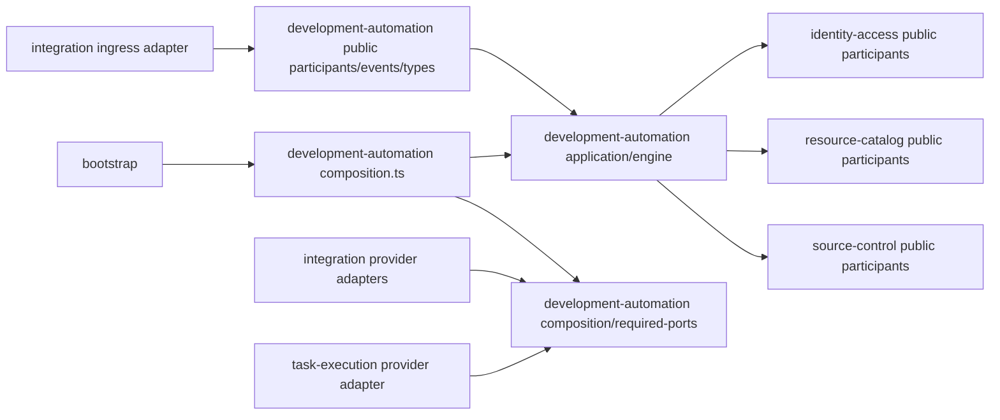
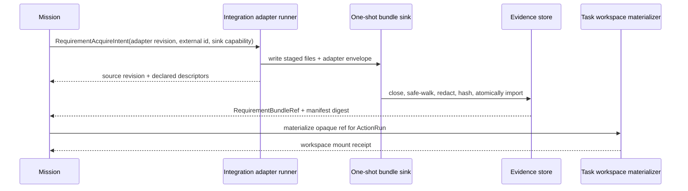

# RFC-310 · 规则驱动的研发数字员工技术设计

> 产品视角见 [proposal.md](./proposal.md)，任务分解见 [plan.md](./plan.md)。
>
> 状态：**Done（2026-08-19 交付完成）**。PR-0..PR-10 全部落地并推 main；`gate:local` 全绿、
> hosted CI 本 RFC 面全绿。**首版不含（如实登记，见 plan.md §13a）**：conflict repair 的 Agent
> 执行面（typed block `conflict-repair-agent-surface-not-wired`，report-only 模式完整可用）、
> evidence retention GC 与 GB 级 nightly、out-of-order webhook 矩阵、浏览器级 visual regression、
> verification/review 结果升 catalog fact、cutover preflight 的 per-repo dry probe；mission 列表
> 分页与 `/code` work-items 翻页已移交 RFC-311。

## 0. 设计裁决与事实基线

### 0.1 一句话

新增并最终以 `development-automation` 取代 `code-capability` 上层业务模型：它拥有一条跨需求、实现、
MR 看护到外部合入的 `DevelopmentMission`，由 typed policy 解释器决定下一动作；Agent 只能在
TaskEngine 的受限执行环境中产生 envelope 和业务文件差异，Git、代码托管和流水线副作用仍由各自
bounded context 的确定性 participant 执行。

### 0.2 本设计钉住的基线

本轮源码核对钉在 `2bdfbd51d2e309e05088da958e835724cf904065`。实现前必须重新取锚；下表描述的是
设计输入，不是允许通过兼容层长期保留的目标形状。

| 当前事实                                                             | 源码锚点                                                              | 本 RFC 的处理                                                                      |
| -------------------------------------------------------------------- | --------------------------------------------------------------------- | ---------------------------------------------------------------------------------- |
| 五个固定 capability，其中 `mr-monitor` 也是 capability               | `modules/code-capability/domain/stageContract.ts:25-43`               | 用 Mission reconciler 取代 monitor capability，动作改为新的 closed catalog         |
| `StageDef` 允许任意 script 与可注入 hook                             | `stageContract.ts:72-155`                                             | stage graph 仍由代码固定，但业务决策脚本和任意写 hook 被收缩为 typed adapter point |
| envelope 已支持同会话与 fresh-session 两级尝试                       | `application/determinismGuard.ts:122-193`                             | 保留台账语义，并补 whole-workspace baseline 恢复与边界违规快退                     |
| MR collect 只有单 gate、`rawLogRef` 与 head                          | `domain/monitorContracts.ts:49-75`                                    | 改为 exact-head、多 gate、完整性明确的 evidence bundle                             |
| `arbitrate`/`select` 脚本可决定能力与 Agent                          | `domain/monitorContracts.ts:93-169`                                   | 删除脚本的业务决策权，由 typed first-match policy 唯一决定                         |
| requirement 文档正文直接进入 JSON                                    | `domain/requirementInput.ts:28-70`                                    | 改为 immutable multi-file bundle ref，不把大正文放入 DB/event/prompt               |
| code-host port 是 `action: string + Record<string,string>`           | `ports/codeHostPort.ts:22-37`                                         | 改为 closed development action union，类型层排除 merge/approve/resolve/custom      |
| source-control 已提供 path-free candidate/commit/publish participant | `modules/source-control/public/participants.ts:10-47`                 | 直接复用，不另造 Git 实现，也不把路径泄露给 Mission                                |
| Claude runtime 当前可写 Git metadata 且继承 daemon 环境              | `services/runtime/claudeCode/boundary.ts:107-115`、`spawn.ts:279-305` | digital-employee profile：不注入 Git identity/凭据，违规靠快照检测+回退（见 §7.6） |
| `.agent-workflow` 只有 `inputs/runs/fusion` 官方子目录               | `packages/shared/src/workspaceConvention.ts:5-18`                     | 增加 `pipeline`；需求固定在 `inputs/requirements`，两者都受 RFC-308 排除策略保护   |

### 0.3 不可协商的不变量

1. 同一 Mission/MR 同时最多一个拥有 workspace 写权的 `ActionRun`。
2. 同一 fact snapshot + policy revision 的规则结果 byte-identical；Agent 不参与调度或模板选择。
3. Agent 不持有代码托管/流水线凭据、不能直接产生外部副作用；对 Git metadata / evidence / 受保护路径的任何写入
   都是 boundary violation——首版靠前后快照检测并整树回退（非 OS 阻断），绝不进入 candidate。
4. Agent 的输出只是待验证声明；真实 diff、测试、head、gate、评论与 mergeability 均由程序采集。
5. `ready-to-merge` 可回退，`merged` 只能由外部事实观察产生；平台不存在 merge/approve action。
6. 跨 bounded context 只走 RFC-294 的 exact `public/*` 或 consumer-owned `required-ports`。
7. TaskEngine → WrapperRuntime → NodeExecutor → ExecutionKernel 是唯一 Agent 执行链。
8. 迁移不允许 legacy work-item writer 与 Mission writer 同时管理同一个 MR。
9. 直接上传文件的仓库目标路径、上传 digest 与基线前提一经 admission 即冻结；只有平台能把它加入业务改动，
   且非 `already-present` 的上传必须进入最终 ChangeCandidate/commit，不能退化成只读附件。

## 1. RFC-294 落位

本节以 [RFC-294 目标架构](../RFC-294-backend-layered-target-architecture/design.md) 为约束，不把 RFC-310 当成绕过现有
bounded context 的新总控层。

### 1.1 bounded context 职责

| Context                              | 唯一拥有                                                                                                                                                         | 明确不拥有                                                                          |
| ------------------------------------ | ---------------------------------------------------------------------------------------------------------------------------------------------------------------- | ----------------------------------------------------------------------------------- |
| `development-automation`             | Mission/ActionRun 状态机、CapabilityDefinition、ActionTemplate、DigitalEmployeeTemplate、AutomationPolicy 语义、规则解释、readiness、反馈处理台账、effect intent | Git 实现、Agent spawn、code-host HTTP、pipeline provider 协议、credential、绝对路径 |
| `task-execution`                     | AgentAttempt 的 Task/NodeRun 执行、session/runtime/取消、受限 workspace mount、唯一四级执行链                                                                    | Mission 下一步、模板选择、MR readiness、Git commit/push                             |
| `source-control`                     | repository/workspace、immutable snapshot、ChangeCandidate、exclude policy、commit、exact-head publish、conflict workspace 准备                                   | 需求语义、review 规则、MR API、Agent session                                        |
| `integration`                        | requirement/pipeline/code-host provider 协议、连接与 credential、webhook ingress、outbound adapter execution                                                     | Mission 状态、policy 决策、Agent 选择、Git mutation                                 |
| `resource-catalog` / identity-access | 资源可见性、owner/ACL、request/effect authority                                                                                                                  | 数字员工业务字段、Mission 状态转移                                                  |
| `platform/contracts`                 | clock/id/transaction/outbox/job/evidence-store 等中性机制                                                                                                        | 任何 Mission、MR、policy 或 capability DTO                                          |

`development-automation` 是 RFC-304 `code-capability` 的语义替代和最终改名，不并存为第十五个 mega-context。
迁移期间可以保留一个只做调用转发的 legacy facade，但不得有状态、业务分支或第二套 writer，并在同一 cutover
wave 删除。

### 1.2 目标目录

```text
packages/backend/src/modules/development-automation/
  domain/
    mission.ts                  # aggregate + transition table
    actionRun.ts
    capabilityDefinition.ts
    actionTemplate.ts
    digitalEmployee.ts
    automationPolicy.ts
    facts.ts
    decision.ts
    readiness.ts
    agentProtocol.ts
    evidence.ts
  application/
    commands/
    queries/
    missionReconciler.ts
    decisionService.ts
    actionCoordinator.ts
    effectCoordinator.ts
  engine/
    policy/
      compilePolicy.ts
      evaluatePolicy.ts
      canonicalTrace.ts
    action/
      actionCatalog.ts
      capabilityPlans.ts
      semanticValidators.ts
  ports/                       # module-internal repository/clock/outbox ports
  infrastructure/
    sqlite/
    jobs/
    inbound/
  public/
    commands.ts
    queries.ts
    participants.ts
    events.ts
    types.ts
  composition/
    required-ports.ts          # consumer-owned external SPI
  composition.ts              # only bootstrap imports this entrypoint
```

`public/*` 只在出现真实跨 context consumer 时导出 symbol；不能为了“以后可能用”预放通用 CRUD。
HTTP/MCP/worker 都是 inbound adapter，调用同一 application command/query，不直接查询 Mission 表。

### 1.3 依赖方向



图中箭头表示源码依赖。关键点：

- `development-automation` 可以消费 source-control 已有的 offered participants，因为它们本来就是
  path-free candidate/commit/publish 合同。
- 需求系统、流水线系统、MR facts/effects 与 AgentAttempt 是本 context 的专用需求，因此接口由
  `development-automation/composition/required-ports.ts` 拥有；只有 exact module composition、bootstrap 与登记的
  provider adapter 可以 import，普通 application/engine 不直接 import 这条 entrypoint。
- integration adapter 只做 DTO 翻译和协议调用，不 import Mission domain；task-execution adapter 只把
  `AgentActionExecutionRequest` 转成现有 task execution intent，不解释 capability 业务。
- bootstrap 只实例化、注入、注册 worker；不写 `if capability === ...`、不查 DB、不做 DTO 翻译。

### 1.4 public surface 上限

```ts
// public/types.ts — 全部 opaque、JSON-safe、exact-key；owner decoder/factory 是唯一铸造点。
declare const developmentMissionRefBrand: unique symbol
export interface DevelopmentMissionRef {
  readonly [developmentMissionRefBrand]: 'development-mission-ref'
  readonly missionId: string
}

declare const missionRevisionRefBrand: unique symbol
export interface MissionRevisionRef extends DevelopmentMissionRef {
  readonly [missionRevisionRefBrand]: 'mission-revision-ref'
  readonly revision: number
}

export interface DevelopmentMissionSummary {
  readonly ref: MissionRevisionRef
  readonly status: MissionStatus
  readonly automationMode: 'active' | 'tracking-only'
  readonly repositoryRef: RepositoryRef
  readonly sourceSummary: { readonly kind: 'direct' | 'external'; readonly label: string }
  readonly repositoryUploads: null | {
    readonly entries: number
    readonly pending: number
    readonly fulfillment: 'pending' | 'satisfied' | 'unfulfilled'
  }
  readonly mergeRequest: null | { readonly iid: string; readonly headSha: string }
  readonly readiness: MissionReadinessView
  readonly blockedReason: null | MissionBlockView
  readonly updatedAt: string
}
```

`public/commands.ts` 最多包含实际 inbound 需要的 typed command：

```ts
export type DevelopmentMissionCommand =
  | LaunchDevelopmentMission
  | SelectMissionRequirementSource
  | SubmitMissionAnswers
  | CancelDevelopmentMission
  | HandoffDevelopmentMission
  | ResumeDevelopmentMissionAutomation
  | AttachMergeRequestToMission
  | RetryBlockedMission
  | RequestMissionConfigurationUpgrade

export interface LaunchDevelopmentMission {
  readonly authority: RequestAuthority
  readonly idempotencyKey: ValidatedIdempotencyKey
  readonly repositoryRef: RepositoryRef
  readonly submission: RequirementSubmission
  readonly delivery: MissionDeliveryTarget
  readonly requestedEmployeeRef?: VersionedResourceRef
  readonly requestedPolicyRef?: VersionedResourceRef
}

export interface SelectMissionRequirementSource {
  readonly authority: RequestAuthority
  readonly missionRef: MissionRevisionRef
  readonly sourceKey: string
}
```

`RepoRelativePath` 是 public DTO 唯一允许的 path-shaped 业务值：它由 owner codec 规范化并保证只表示仓库内逻辑文件，
不携带 checkout、upload temp 或 host absolute path。后续所谓 path-free participant 指“不暴露 host/workspace path”，
不禁止这个由用户明确给出的仓库目标值。

`public/queries.ts` 只提供 authority-filtered 的 `GetDevelopmentMissionView`、
`ListDevelopmentMissionSummaries`、`PreviewEmployeeSelection`、`PreviewPolicyDecision` 与配置资源的 typed
查询。资源写命令分别命名，不提供 `MutateAutomationResource { kind, payload }`。

`public/participants.ts` 只在真实跨域需要时提供：

```ts
export interface DevelopmentSignalParticipantInTx {
  recordWakeHint(input: {
    readonly missionRef: DevelopmentMissionRef
    readonly source: 'code-host' | 'pipeline' | 'timer' | 'manual'
    readonly deliveryKey: string
  }): Promise<{ readonly accepted: boolean }>
}

export interface DevelopmentMissionTerminalQuery {
  getTerminalState(
    ref: DevelopmentMissionRef,
  ): Promise<'active' | 'merged' | 'closed-unmerged' | 'completed-no-change' | 'canceled'>
}
```

`recordWakeHint` 只记“可能变了”；它不能携带 raw webhook body，也不能直接推进状态。reconciler 必须通过
required port 主动采集 authoritative snapshot。

`public/events.ts` 只发 committed facts，例如 `DevelopmentMissionStateCommitted { missionId, revision }`、
`DevelopmentMissionInvalidated { missionId, revision }`；不发 raw log、prompt、diff、内部 continuation 或
absolute path。

### 1.5 consumer-owned required ports

```ts
// composition/required-ports.ts — 仅 bootstrap 与登记的 provider adapter 可 import。
export interface RequirementAcquisitionPort {
  acquire(input: RequirementAcquireIntent): Promise<RequirementAcquisitionReceipt>
}

export interface RequirementInteractionPort {
  publishQuestions(
    input: RequirementQuestionEffectIntent,
  ): Promise<RequirementQuestionEffectReceipt>
  collectAnswers(input: RequirementAnswerCollectIntent): Promise<RequirementAnswerCollectReceipt>
}

export interface MergeRequestFactsPort {
  collect(input: MergeRequestCollectIntent): Promise<MergeRequestSnapshotReceipt>
}

export interface PipelineEvidencePort {
  collect(input: PipelineCollectIntent): Promise<PipelineEvidenceReceipt>
  trigger(input: PipelineTriggerIntent): Promise<PipelineTriggerReceipt>
  rerun(input: PipelineRerunIntent): Promise<PipelineRerunReceipt>
}

export interface DevelopmentCodeHostEffectsPort {
  execute(input: DevelopmentCodeHostEffect): Promise<DevelopmentCodeHostEffectReceipt>
}

export interface AgentActionExecutionPort {
  launch(input: AgentActionExecutionIntent): Promise<AgentActionLaunchReceipt>
  cancel(input: AgentActionCancelIntent): Promise<AgentActionCancelReceipt>
}

export interface RepositoryUploadPlacementPort {
  place(input: RepositoryUploadPlacementIntent): Promise<RepositoryUploadPlacementReceipt>
}
```

这些 port 的 DTO 只能含 opaque ref、closed union、digest、revision、budget 和 authority capability；禁止
credential、URL、header、DbClient、AbortSignal、runtime handle、session id、绝对路径、raw body/log 或
`Record<string, unknown>`。

`RepositoryUploadPlacementPort` 是 `development-automation` 消费、由 composition 中的 source-control + evidence
provider adapter 实现的内部程序端口：它读取 opaque upload blob ref，按冻结的 repository snapshot 和规范化相对路径
生成平台拥有的 `SeedChangeRef`。DTO 不携带浏览器临时路径或 host workspace path；source-control 仍是唯一能创建业务
workspace、推导 candidate 和接触 Git 的 owner。
application 从自己的 immutable plan 构造 exact placement intent（plan/digest、snapshot ref、按序 entry/blob ref/逻辑
target/expected state/mode/content policy）；provider adapter 不反向查询 development DB，也不只拿 planRef 后跨 owner 偷读表。
evidence/source-control 的组合只发生在 bootstrap 登记的 adapter 内，业务分支仍由 consumer 决定。

`DevelopmentCodeHostEffect` 是闭集：

```ts
export type DevelopmentCodeHostEffect =
  | { readonly kind: 'mr.ensure'; readonly intentRef: string }
  | { readonly kind: 'mr.comment.create'; readonly intentRef: string }
  | { readonly kind: 'mr.comment.update'; readonly intentRef: string }
  | { readonly kind: 'mr.feedback.reply'; readonly intentRef: string }
  | { readonly kind: 'mr.labels.reconcile'; readonly intentRef: string }
```

该联合**没有** `merge`、`approve`、`thread.resolve`、generic `custom`。即使 integration 的通用 action
catalog 有这些能力，数字员工 provider adapter 也没有可表达它们的输入类型。

## 2. Mission 聚合与生命周期

### 2.1 聚合根

```ts
interface DevelopmentMission {
  readonly id: DevelopmentMissionId
  readonly revision: number
  readonly epoch: number
  readonly status: MissionStatus
  readonly automationMode: 'active' | 'tracking-only'
  readonly repositoryRef: RepositoryRef
  readonly sourceIdentity: MissionSourceIdentity
  readonly resolvedRequirementSource: ResolvedRequirementSource | null
  readonly repositoryUploadPlanRef: RepositoryUploadPlanRef | null
  readonly repositoryUploadPlacementRef: RepositoryUploadPlacementReceiptRef | null
  readonly repositoryUploadPublicationRef: RepositoryUploadPublicationReceiptRef | null
  readonly delivery: MissionDelivery
  readonly admissionAssignmentRef: MissionAdmissionAssignmentRef | null
  readonly selectionPolicy: PinnedAutomationPolicy | null
  readonly requirementBundleRef: RequirementBundleRef | null
  readonly repositoryFactsRef: RepositoryFactSnapshotRef | null
  readonly employee: PinnedDigitalEmployee | null
  readonly employeeSelectionReceiptRef: EmployeeSelectionReceiptRef | null
  readonly policy: PinnedAutomationPolicy | null
  readonly mergeRequest: MergeRequestBinding | null
  readonly currentActionRunRef: ActionRunRef | null
  readonly latestFacts: MissionFactRefs
  readonly readiness: MissionReadiness
  readonly budgets: MissionBudgetLedger
  readonly block: MissionBlock | null
  readonly terminalResult: MissionTerminalResult | null
  readonly terminalAt: string | null
}

type MissionStatus =
  | 'admitting'
  | 'awaiting-information'
  | 'working'
  | 'publishing'
  | 'watching'
  | 'waiting-committer'
  | 'ready-to-merge'
  | 'blocked'
  | 'merged'
  | 'closed-unmerged'
  | 'completed-no-change'
  | 'canceled'

type MissionTerminalResult =
  | {
      readonly kind: 'merged' | 'closed-unmerged'
      readonly uploadFulfillment: 'not-applicable' | 'satisfied' | 'unfulfilled'
      readonly unsatisfiedReasonRefs: readonly string[]
    }
  | { readonly kind: 'completed-no-change' | 'canceled' }
```

状态名表达用户可见阶段，不承担全部调度信息；“下一步做什么”只存在于 committed `DecisionReceipt`，
不能靠 `status` 推测。`merged/closed-unmerged/completed-no-change/canceled` 是终态，其他状态都可在新事实下重算。

`merged` 描述外部事实，不自动等于需求成功交付；若 committer 在 upload fulfillment 前合入，terminal result 必须显示
`uploadFulfillment = unfulfilled` 及缺失路径/原因 ref，平台停止写并通知人工，不能把它伪装成成功或再开补丁。

`automationMode` 与 status 正交。`tracking-only` 仍主动 collect MR/pipeline、计算 machine/human holds、发布平台内
read model 并观察 terminal，但不启动 Agent、Git/代码托管写 effect 或 pipeline trigger/rerun。handoff 可由 policy
或授权用户触发；resume bump epoch、重采 facts、重新决策，不从 handoff 前 workspace 接着写。

`sourceIdentity` 是 closed union：

```ts
type MissionSourceIdentity =
  | {
      readonly kind: 'direct'
      readonly submissionId: string
      readonly contentDigest: string
    }
  | {
      readonly kind: 'external'
      readonly requestedSourceKey: string | null
      readonly externalId: string
    }

interface ResolvedRequirementSource {
  readonly sourceKey: string
  readonly adapterRef: VersionedResourceRef
  readonly bindingDigest: string
}
```

`sourceIdentity` 是提交时即稳定的去重身份，不假装 `sourceKey` 已解析。选定 employee 后，application 按 assignment
default、employee 唯一 default 或显式 requested key 解析并 pin `resolvedRequirementSource`；source revision 只在
RequirementBundle/source receipt 中递增。省略 sourceKey 的 active-duplicate/reuse 判断必须等 binding 解析后使用
`(repository, adapter revision, externalId)`，不能仅按 externalId 把两个来源误认成同一 Mission。

direct `contentDigest` 覆盖规范化 title/body、按 ordinal 排序的 upload content digest、稳定显示名、仓库目标路径和显式
mode/content/collision 选择，不包含临时 uploadRef/path。HTTP 重试仍以 idempotency key 找回原 Mission；业务层 active
duplicate/reuse 还必须连同 resolved employee/policy revision 与 delivery identity 对拍，不能因正文相同而复用一条采用旧
upload 默认策略或不同目标分支的 Mission。

delivery 也是 closed union：

```ts
type MissionDelivery =
  | {
      readonly kind: 'create-merge-request'
      readonly targetRef: RepositoryRefName
      readonly sourceBranchPolicyRef: VersionedResourceRef
      readonly draft: boolean
    }
  | {
      readonly kind: 'adopt-merge-request'
      readonly mergeRequestRef: MergeRequestRef
      readonly observedHeadSha: string
      readonly observedTargetSha: string
    }
```

入口可以省略 create 模式的 target，application 用 pinned DeliveryPolicy 解析仓库默认目标分支后才构造
`MissionDelivery`；domain 不保存“以后再看默认分支”的空值。adopt 模式 admission 先主动读取 MR、确认 repo/claim/
权限，再以当前 head 建 baseline，不能信用户提交的 sha。

admission 幂等键与 source identity 分开：同一个 HTTP retry 返回同一 Mission；同一 external ID 是否复用
active Mission、开新 generation 或拒绝，由 admission policy 明确配置并留下 receipt，不能靠 Agent/路由猜。

### 2.2 业务状态图

```mermaid
stateDiagram-v2
  [*] --> admitting
  admitting --> awaiting-information: requirement needs answer
  admitting --> working: bundle + employee + policy pinned
  awaiting-information --> working: answer revision committed
  working --> publishing: candidate verified
  working --> awaiting-information: QuestionSet publication confirmed
  working --> blocked: budget or deterministic refusal
  working --> completed-no-change: program proof or human confirmation
  publishing --> watching: exact-head push and MR bound
  publishing --> working: remote head changed / effect invalidated
  watching --> working: feedback / failing gate / conflict action
  watching --> waiting-committer: automation done, human hold remains
  watching --> ready-to-merge: all host prerequisites pass
  waiting-committer --> working: new machine work
  waiting-committer --> ready-to-merge: human hold cleared
  ready-to-merge --> working: head / thread / gate / target changed
  blocked --> working: authorized retry or configuration repair
  admitting --> canceled
  awaiting-information --> canceled
  working --> canceled
  publishing --> canceled
  watching --> canceled
  waiting-committer --> canceled
  ready-to-merge --> canceled
  blocked --> canceled
  completed-no-change --> [*]
  watching --> merged
  waiting-committer --> merged
  ready-to-merge --> merged
  watching --> closed-unmerged
  waiting-committer --> closed-unmerged
  ready-to-merge --> closed-unmerged
```

外部 MR 在平台还处于 `working/publishing` 时被关闭或合入，固定 terminal guard 优先于图中普通 action，
先取消当前 task、作废未执行 effect，再进入终态。不能因为图里没画一条边就继续 push。

### 2.3 聚合不变量与 authority

- 每次 mutation 都要求 `(missionId, expectedRevision, epoch)`；lease 丢失或 epoch 过期返回 typed conflict。
- `currentActionRunRef != null` 时不得 claim 第二个可写 action；只读分析也必须绑定 immutable snapshot。
- MR 绑定后，在 `(codeHostEndpointRef, stableProjectRef, mrIid)` 上持有唯一 active claim；绑定冲突会阻断，
  不能开第二个数字员工竞争写同一 MR。
- internal continuation 使用 mission-family effect capability；不构造 `SystemActor`，不复用原用户的过期 session。
- 人工 retry、cancel、configuration upgrade、handoff/attach/resume 每次按当前 actor 重新授权；历史 initiator 不等于永续权限。
- terminal guard、head freshness、credential scope、no-merge 不可被 policy 覆盖。

`cancel` 命令先 bump epoch 并写 cancel fence：禁止产生任何新写，撤销尚未 dispatch 的 intent并终止 Agent。已经
dispatch 或结果未知的 commit/push/MR/comment/pipeline effect 必须先按外部真相 reconcile；全部 settle 后才把 Mission
置为 `canceled` 并释放 claim。API/read model 在此期间显示 `cancel-pending` transition receipt，不能提前宣称外部没有
发生。cancel 不关闭已有 MR、不删 source branch、不 revert 或 reset 已发布 commit。用户若只想暂停自动修改而继续
跟踪，必须用 handoff/tracking-only，不把 cancel 当暂停。

### 2.4 readiness

```ts
interface MissionReadiness {
  readonly evaluatedForHead: string | null
  readonly factDigest: string
  readonly automationReady: boolean
  readonly hostMergeable: 'yes' | 'no' | 'unknown'
  readonly machineHolds: readonly MachineHold[]
  readonly humanHolds: readonly HumanHold[]
  readonly status: 'working' | 'waiting-committer' | 'ready-to-merge'
}
```

固定算法：

1. 有 active action、unconfirmed effect、未处理 feedback revision、conflict、required gate 非 pass、facts
   不完整、head 不一致或 created/replaced upload 尚无 fulfillment receipt ⇒ `automationReady=false`。
2. 自动化事项清零但还有 approval、人工 thread resolve、committer-only policy hold ⇒
   `waiting-committer`；平台继续监听，绝不替人解除。
3. `automationReady=true`、human holds 为空、code host 明确 `mergeable=yes` ⇒ `ready-to-merge`。
4. `unknown/partial/unavailable` 永不折算为 pass；“最后一次曾经绿色”不适用于新 head。
5. readiness receipt 绑定 head、target head、MR snapshot digest、pipeline evidence digest 与 policy revision；任一
   revision 改变立即失效。

### 2.5 ActionRun

```ts
interface ActionRun {
  readonly id: ActionRunId
  readonly missionRef: MissionRevisionRef
  readonly decisionRef: DecisionReceiptRef
  readonly capability: CapabilityId
  readonly workSetRef: WorkSelectionReceiptRef | null
  readonly capabilityContractVersion: number
  readonly implementation: ActionImplementationRef
  readonly inputFactDigest: string
  readonly baseline: ActionBaselineRef
  readonly status:
    | 'claimed'
    | 'materializing'
    | 'running'
    | 'validating'
    | 'awaiting-effect'
    | 'settled'
    | 'invalidated'
    | 'failed'
    | 'canceled'
  readonly resultRef: ActionResultRef | null
}
```

`ActionRun` 固定 capability、实现 revision、policy decision、facts 和 baseline。运行中配置更新不改变它；
外部 head 改变也不是“拿新 head 接着跑”，而是使旧 run/candidate invalidated，再由 reconciler 基于新 facts
产生新 action。

### 2.6 唤醒、主动采集与 reconcile

webhook、pipeline callback、timer 与人工按钮都只写入带 dedupe key 的 `MissionWakeHint`。worker 的单次循环：

```text
claim mission lease + epoch
  → terminal facts first
  → collect missing/stale authoritative facts
  → verify all refs/digests/head bindings
  → fixed safety guards
  → evaluate pinned policy once
  → commit DecisionReceipt + ActionIntent/effect intent in one transaction
  → outbox dispatch
  → release/renew lease
```

事件风暴只合并 wake hint，不能合并不同 feedback revision 或不同 pipeline run 的事实。定时 reconcile 是
webhook 丢失的恢复通道；它也必须走同一采集和决策路径，不能有“定时器专用逻辑”。

## 3. 能力与配置资源

### 3.1 六类资源，不混成一张万能表

| 定义                           | owner                       | 是否用户可新建                        | 能改变什么                                                                                               |
| ------------------------------ | --------------------------- | ------------------------------------- | -------------------------------------------------------------------------------------------------------- |
| `CapabilityDefinition`         | development-automation 代码 | 否；随产品/RFC 升 contract version    | 输入/输出 schema、固定阶段、workspace mode、权限、validator、可产生的 effect intent                      |
| `IntegrationAdapterDefinition` | integration                 | 是，需对应资源权限与 `scripts:author` | 外部程序、参数 schema、secret projection、provider codec、bundle budget                                  |
| `VerificationProfile`          | development-automation      | 是；改 executable 需 `scripts:author` | build/test program refs、隔离/网络/超时、程序化 pass 判据与 evidence 选择                                |
| `ActionTemplate`               | development-automation      | 是                                    | 指定 capability 的 agent/workgroup revision、prompt supplement、只读知识、验证 profile、规则可选择的标签 |
| `DigitalEmployeeTemplate`      | development-automation      | 是                                    | 多 capability route、adapter binding、默认 policy 与适用仓库 facts                                       |
| `AutomationPolicy`             | development-automation      | 是                                    | admission、first-match action、feedback/pipeline/conflict/retry/readiness/notification/retention         |

产品界面把 adapter 作为数字员工配置的一部分展示，但数据所有权不说谎：数字员工只保存一个 pinned
`AdapterDefinitionRef` 和用途绑定；可执行程序、credential 与连接仍留在 integration。

### 3.2 CapabilityDefinition

```ts
interface CapabilityDefinition {
  readonly id: CapabilityId
  readonly contractVersion: number
  readonly executionKind: 'program' | 'adapter' | 'agent' | 'platform-effect'
  readonly inputSchemaId: string
  readonly outputSchemaId: string
  readonly workspaceMode: 'none' | 'read-only' | 'edit-business-files' | 'edit-conflicts'
  readonly stages: readonly CapabilityStage[]
  readonly semanticValidatorId: string
  readonly allowedEffectKinds: readonly DevelopmentEffectKind[]
}
```

首版 catalog 与 proposal §5 一致，并额外把平台内部动作分组。用户不能增加 capability ID，也不能改阶段图；
否则“规则可静态验证”和“Agent 边界由平台锁死”都会失真。扩展能力必须发新 RFC/contract version，旧在途
ActionRun 继续按旧 validator 结算。

### 3.3 IntegrationAdapterDefinition

```ts
interface IntegrationAdapterDefinition {
  readonly id: string
  readonly revision: number
  readonly purpose: 'requirement-source' | 'pipeline-gate' | 'pipeline-classifier'
  readonly operations: readonly AdapterOperation[]
  readonly contractVersion: number
  readonly executableRef: string
  readonly parameterSchemaRef: string
  readonly parameterValuesDigest: string
  readonly connectionRef: string | null
  readonly secretProjection: readonly string[]
  readonly outputBudget: AdapterOutputBudget
  readonly timeoutMs: number
  readonly ownerRef: string
  readonly aclRevision: number
}
```

`AdapterOperation` 也是 closed union，并与 purpose 对拍：requirement source 可声明 `acquire`，以及可选的
`questions.writeback + answers.collect` 配对；pipeline gate 可声明 `collect` 和可选 `trigger/rerun`；classifier
只有 `classify`。只有 writeback、没有 answer collection 的 adapter 不能被发布为“原渠道澄清可用”；没有声明的
写操作不会因为 executable 实际支持就变得可达。

`secretProjection` 是 integration owner 校验过的 secret key 闭集，保存时拒绝未知项；worker 运行 adapter 时
从**空环境**加入固定基础变量和这份 projection，不继承 daemon env。adapter 只得到一次性 staged bundle sink，
不得得到 repository/Mission 数据库、真实 worktree 或 code-host generic client。

adapter 的网络也按 connectionRef 解析出的 provider allowlist 收缩；`scripts:author` 是高风险写权，不代表程序可带着
投影 secret 访问任意地址。probe 必须记录 executable digest、connection revision、sandbox profile 与 contract receipt。

adapter 的 stdout 也使用 contract envelope；它可以报告 provider status/source revision/file descriptors，不能
返回 `nextAction`、`agentId`、`merge`、`ready`。平台重新 walk 输出目录并计算真实 digest，adapter 自报 digest
不作最终事实。

### 3.4 ActionTemplate

```ts
interface ActionTemplate {
  readonly id: string
  readonly revision: number
  readonly capabilityId: AgentCapabilityId
  readonly capabilityContractVersion: number
  readonly labels: readonly string[]
  readonly compatibility: TemplateCompatibility
  readonly executor:
    | { readonly kind: 'agent'; readonly agentRef: VersionedResourceRef }
    | { readonly kind: 'workgroup'; readonly workgroupRef: VersionedResourceRef }
  readonly runtimeProfileRef: VersionedResourceRef
  readonly promptSupplement: string
  readonly skillRefs: readonly VersionedResourceRef[]
  readonly mcpRefs: readonly VersionedResourceRef[]
  readonly readOnlyResourceRefs: readonly VersionedResourceRef[]
  readonly contextProfileRef: VersionedResourceRef
  readonly writablePathPolicyRef: VersionedResourceRef | null
  readonly additionalProtectedPathClasses: readonly PathClass[]
  readonly verificationProfileRef: VersionedResourceRef
  readonly retryDefaults: AgentRetryBudget
  readonly ownerRef: string
  readonly aclRevision: number
}
```

模板不保存 raw filesystem path、credential 或 runtime object。`promptSupplement` 被放在平台不可覆盖的 protocol
block **之前**，并经过明确分隔；里面出现“忽略 envelope / 自己提交 / 自己选下一步”不会改变运行合同。

`runtimeProfileRef` 必须声明并通过 digital-employee 检测/回退 probe（§7.6）；`skillRefs/mcpRefs` 只能引用 capability manifest
标记为本地或只读、无外部副作用的资源，不能因此重新取得 requirement/pipeline/code-host connector。context profile
只能从 CapabilityDefinition 允许的 evidence class 中做子集选择。`writablePathPolicyRef` 只能**收窄** capability 的
workspace mode，`additionalProtectedPathClasses` 只能增加保护项，二者都不能打开 Git/evidence/platform roots。

write capability 若使用 workgroup，发布校验要求 `maxConcurrentWriters=1`；其他成员只能在 immutable snapshot 上
只读分析，不能让多个 member 共享可写 overlay 后再自动融合。

`compatibility` 是无顺序、只会拒绝不兼容选择的 typed constraint，不参与“选哪份模板”。唯一 selector 是
DigitalEmployee 的 `CapabilityRoute.rules`；route 发布时必须证明每个 rule 的 when 蕴含目标 template compatibility。
否则两处 predicate 会变成两个可能意见不同的选择器。compatibility 不能内嵌脚本、正则执行器或自然语言路由。

### 3.5 VerificationProfile

本地 build/test 也是可执行配置，不能藏在 prompt 或普通 policy string 里：

```ts
interface VerificationProfile {
  readonly id: string
  readonly revision: number
  readonly steps: readonly {
    readonly stepId: string
    readonly programRef: VersionedResourceRef
    readonly argsRef: VersionedResourceRef | null
    readonly timeoutMs: number
    readonly networkProfileRef: VersionedResourceRef
    readonly successExitCodes: readonly number[]
    readonly evidenceSelectors: readonly VerificationEvidenceSelector[]
  }[]
  readonly stopPolicy: 'first-failure' | 'collect-all'
  readonly maxParallel: number
  readonly ownerRef: string
  readonly aclRevision: number
}
```

新增/修改 `programRef/argsRef` 额外要求 `scripts:author`。verification 在 candidate 的**一次性 disposable workspace**
执行：可以产生编译产物，但这些写入绝不回流 publication candidate；Git metadata 只读，环境/credential/network 按
profile 收缩。平台从 exit code、timeout 和自己收集的 reports/logs 生成 `VerificationReceipt`，程序 stdout 里的
“passed/ready”不是事实。日志进入 bounded verification evidence，不进入 policy/prompt；repair Agent 只读失败 receipt
和按 contract 选中的 evidence。

### 3.6 DigitalEmployeeTemplate

```ts
interface DigitalEmployeeTemplate {
  readonly id: string
  readonly revision: number
  readonly name: string
  readonly supportedRepositoryFacts: readonly FactPredicate[]
  readonly capabilityRoutes: readonly CapabilityRoute[]
  readonly requirementSources: readonly AdapterPurposeBinding[]
  readonly pipelineProviders: readonly AdapterPurposeBinding[]
  readonly defaultPolicyRef: VersionedResourceRef
  readonly ownerRef: string
  readonly aclRevision: number
}

interface CapabilityRoute {
  readonly capabilityId: AgentCapabilityId
  readonly rules: readonly {
    readonly ruleId: string
    readonly when: readonly FactPredicate[]
    readonly templateRef: VersionedResourceRef
  }[]
  readonly fallbackTemplateRef: VersionedResourceRef | null
}
```

员工 revision 发布前做闭包检查：

- policy 可能产出的每个 Agent capability 都有 route；
- route 引用的 template capability/contract version 匹配；
- agent/workgroup/runtime/verification 资源对发布者可见并可被 Mission actor 使用；
- requirement/pipeline source scope 不重叠或有唯一优先级；
- 每个 requirement `sourceKey` 与 required pipeline `gateKey` 都解析到唯一 adapter operation；
- Java/C++/polyglot 路由对声明支持的 repository fact fixtures 不出现双义/无结果；
- adapter purpose、contract version、connection 与 secret projection 可用。

发布产生 immutable revision。编辑已发布资源实际创建新 revision；删除只做 archive，不破坏在途 Mission pin。

员工 readiness 是依赖投影，不是一个保存后永远为绿的布尔值：

```ts
type DigitalEmployeeReadiness =
  | { readonly status: 'ready'; readonly dependencyDigest: string; readonly probedAt: string }
  | {
      readonly status: 'degraded' | 'blocked'
      readonly dependencyDigest: string
      readonly reasons: readonly EmployeeReadinessReason[]
    }
```

依赖包括 routes/templates、agent/workgroup/runtime、verification、source/gate adapters、connections 与最近 probes。
publish compiler 先按 execution policy 求出整条生命周期可达能力闭包；新 Mission admission 只接受该闭包
`ready`，不能因为“当前第一步用不到 pipeline adapter”把未来必卡的员工放行。`degraded` 只描述已在途 Mission 的
临时 dependency/probe 退化，按 retry/handoff policy 等待；依赖 revision 改变会使 readiness stale 并重算。每个
ActionRun freeze 前仍验证实际依赖，不偷偷换另一名员工。

### 3.7 AutomationPolicy

policy 是多个**各自有 closed schema 的 rule group**，不是一个可执行 DSL 文件：

```ts
interface AutomationPolicy {
  readonly id: string
  readonly revision: number
  readonly admission: AdmissionPolicy
  readonly requirement: RequirementLifecyclePolicy
  readonly employeeSelection: OrderedRuleSet<EmployeeDecision>
  readonly actionPriority: OrderedRuleSet<ActionDecision>
  readonly feedback: FeedbackPolicy
  readonly pipeline: PipelinePolicy
  readonly conflict: ConflictPolicy
  readonly delivery: DeliveryPolicy
  readonly verification: VerificationPolicy
  readonly retry: RetryPolicy
  readonly readiness: ReadinessPolicy
  readonly notification: NotificationPolicy
  readonly retention: RetentionPolicy
}
```

`RequirementLifecyclePolicy` 固定枚举 source refresh mode
`manual | auto-before-first-push | auto`、澄清通道优先级/轮数/超时、no-change confirmation，以及下列 direct upload 策略：

```ts
interface RepositoryUploadPolicy {
  readonly maxFiles: number
  readonly maxFileBytes: number
  readonly maxTotalBytes: number
  readonly allowedTargetPrefixes: readonly RepoRelativeDirectory[]
  readonly defaultCollisionMode: 'create-only' | 'replace-existing'
  readonly allowedCollisionModes: readonly ('create-only' | 'replace-existing')[]
  readonly defaultContentPolicy: 'preserve-upload' | 'agent-editable'
  readonly allowedContentPolicies: readonly ('preserve-upload' | 'agent-editable')[]
  readonly allowExecutableFileMode: boolean
  readonly targetChangedDisposition: 'block' | 'handoff'
}
```

空 `allowedTargetPrefixes` 表示所有普通业务路径，但产品固定保护的 `.git`、`.agent-workflow`、credential/runtime roots、
submodule 与 repository instruction 指定的不可写路径始终不能放开。请求没填 mode 时采用 policy default；请求显式值只有
位于 allowed closed set 才生效，否则 admission 返回字段级错误。新文件默认 regular；替换文件未显式指定时保留原
mode，显式 executable 还要求 policy 允许。由此“覆盖已有文件”“允许 Agent 改上传内容”“设置可执行位”都是
可预演的业务策略或显式用户选择，不是 Agent 判断。
`agent-editable` 只取消该 entry 的内容保持约束，不扩张 ActionTemplate/CapabilityDefinition 的业务写路径；实际可写集是
两者交集。若当前 action template 不允许该 path，文件仍可由平台原样提交，但 Agent 不能借 upload policy 越权修改。

`DeliveryPolicy` 固定目标分支解析、source branch 命名/碰撞、new/adopt MR、draft 与 remote human push 后的
`restart-action-from-new-head | handoff`。restart 会**废弃旧 ActionRun 并从新 head 重建业务动作**，绝不执行 Git
rebase 或自动套用未发布 patch。

每个预算都有产品硬上限。例如 same-session retry、fresh-session rerun、ActionRun 次数、pipeline rerun、总
commit 数、Mission wall time 与 token 均不能配置为无限。`0` 是显式禁用，空值采用已版本化默认值。

运行时不做“员工默认 + repo override + 请求 override”的逐字段动态 merge。配置界面可以从上游复制/派生，
但 publish 必须产出一份完整 immutable policy revision。Mission admission 将 explicit/assignment/employee default
解析为唯一 execution policy 后，保存 exact ref/digest；这保证规则顺序、预算与 replay 只有一个事实源。

每个 ActionRun 的 `EffectiveActionBudget` 在 decision 时一次解析：CapabilityDefinition product hard cap > execution
policy exact value；policy 可显式写 `inherit-template-default`，此时读取已 pin ActionTemplate default，再冻结为数字。
运行中不重新读取默认值，也不把“失败后自动多试几次”留给 runtime 自行决定。

### 3.8 选择顺序

员工带默认执行 policy，但不能用“尚未选出的员工”反过来选择自己。先按 repository scope 解析一份唯一 admission
assignment：

```ts
interface MissionAdmissionAssignment {
  readonly scope: 'repository' | 'repository-group' | 'global-default'
  readonly selectionPolicyRef: VersionedResourceRef | null
  readonly employeeRef: VersionedResourceRef | null
  readonly executionPolicyRef: VersionedResourceRef | null
  readonly defaultRequirementSourceKey: string | null
}
```

scope 优先级是 exact repository > repository-group > global default；每一级最多一份。assignment 是可选上下文，
不是显式选择的前置条件：请求已给 authorized employee revision 时，即使没有 assignment 也能继续；没有显式员工时，
则必须由 assignment 的 employeeRef 或 selectionPolicyRef 产生唯一员工。defaults-only assignment 可以只提供执行策略/
requirement source，但不能在没有显式员工时单独完成 admission。然后分两步：

```text
employee:
  explicit employee revision
  > assignment employee revision
  > assignment.selectionPolicy employeeSelection first-match (when present)
  > explicit fallback
  > blocked(no-employee-match)

execution policy:
  explicit authorized policy revision
  > assignment.executionPolicyRef
  > selected employee.defaultPolicyRef
```

这一步只读取 admission 已知的 `repositoryRef`、可选 `sourceKey`/submission kind 与程序化
`RepositoryFactSnapshot`，不依赖尚未获取的需求
正文。员工选定后才解析其 `sourceKey → requirement adapter` binding；否则 adapter 在员工里、员工又依赖 adapter
输出，会形成启动死锁。

selection policy 只有在实际用于选人时才 pin revision；显式/assignment-direct 选择的 receipt 记录
`selectionMode = explicit | assignment` 且 matched rule 为空。规则选择则记录 exact selection policy 与 matched rule。
`EmployeeSelectionReceipt` 始终包含 assignment nullable ref、repository facts digest 与 employee revision；execution policy
才供 Mission action/readiness/retry 决策。每一级必须 0 或 1 个结果；同级多个 assignment 不是“随便取第一个”，而是
配置错误。

选定员工后，ActionTemplate 只能在该员工的 capability route 内 first-match。混合仓跨模块改动必须命中显式
polyglot template；不得把 Java 与 C++ 两个可写 action 并发后再让 Agent/平台猜怎么合并。

route 可读取 closed prior-action failure category/attempt budget，因此管理员可以显式写“primary runtime unavailable
后用 fallback template”；平台不会在模板失败时自行换 Agent。fallback 仍必须属于同一 pinned employee revision，
并在 DecisionTrace 中给出 ruleId。

为避免混合仓出现“必须先理解需求才能选语言模板、但先选模板才能理解需求”的循环：

- 单语言 repo 可由 repository facts 直接选 Java/C++ employee；
- 多语言 repo 必须被 assignment/selection policy 选到覆盖这些语言的 polyglot employee，否则 admission block；
- polyglot employee 为 `requirement.analyze` 配一份通用只读模板；它输出 closed `affectedModuleRefs` 与
  `scopeDisposition`，平台逐个对拍 repository module catalog；
- 后续 `change.implement` route 只读取这些已验证 module/language facts，first-match Java/C++/polyglot template。

Agent 提供的是“需求影响哪些已知模块”的认知结果，不是 template id；不存在模块、跨语言集合或无法确定时分别
进入 semantic retry、polyglot route 或 `needs-information`。

预演 API 与真实运行调用同一个 pure evaluator，区别只在前者不 claim lease、不写 DecisionReceipt。

## 4. typed facts 与规则解释器

### 4.1 FactSnapshot

规则不能直接读数据库行、文件内容或 provider JSON。每轮 reconcile 先把各 owner 的 receipt 投影成一个
exact `MissionFactSnapshot`：

```ts
interface MissionFactSnapshot {
  readonly schemaVersion: 1
  readonly missionRevision: number
  readonly capturedAt: string
  readonly repository: RepositoryFacts
  readonly requirement: RequirementFacts
  readonly mergeRequest: MergeRequestFacts | null
  readonly pipeline: PipelineFacts | null
  readonly feedback: FeedbackFacts
  readonly verification: VerificationFacts | null
  readonly budgets: BudgetFacts
  readonly priorActions: PriorActionFacts
  readonly refs: MissionFactRefs
  readonly digest: string
}
```

所有 nested object strict/exact，数组先按领域稳定键排序再 canonical JSON hash。时间判断不在 evaluator 内调用
`Date.now()`；`capturedAt` 和 deadline fact 由 Clock port 注入，因此 replay 不漂移。

每个可被规则读取的 leaf 都有 availability，而不是用 `null` 同时表示五件事：

```ts
type FactCell<T> =
  | { readonly state: 'known'; readonly value: T; readonly sourceRevision: string }
  | { readonly state: 'not-applicable'; readonly reason: string }
  | { readonly state: 'unknown'; readonly reason: string; readonly collectable: boolean }
  | { readonly state: 'stale'; readonly previousRevision: string; readonly collectable: boolean }
```

predicate 只对 `known/not-applicable` 得到 true/false；读到 unknown/stale 得到 `indeterminate`。**前一条规则
indeterminate 时不能跳到后续 fallback**，否则 provider outage 会改变动作优先级；fixed guard 先 collect，无法取得时
按 policy wait/block。publish compiler 还按 decision phase 限制可读 facts，例如 admission selection 不能引用 pipeline。

FactCatalog 的每个 leaf 还声明 `provenanceClass = program | external-authoritative | human-confirmed | agent-validated` 与
`allowedDecisionPhases`。Agent outcome 只有经过 capability semantic validator 才能投影为 `agent-validated` fact；它可以
影响规则预先允许的 action route（例如已验证 affected module set），但不能直接形成 ActionTemplate/effect/ready fact。
policy publish 若在未授权 phase 读取该 provenance class 直接失败。由此确定性边界是 frozen FactSnapshot 到
DecisionReceipt；原始自然语言推理和代码内容不被虚称为 byte-deterministic。

Fact 目录是 code-owned closed catalog，首版至少包括：

| 组          | typed facts                                                                                              |
| ----------- | -------------------------------------------------------------------------------------------------------- |
| repository  | languages、language-by-module、build systems、module ids、changed-path classes、target/source head       |
| requirement | source kind/key、source revision、bundle completeness、document roles、clarification state               |
| MR          | exists、head/target sha、draft、conflict、mergeability、approval holds、thread revisions、terminal state |
| pipeline    | required gate keys、completeness、status、failure categories、run/head、retryability                     |
| action      | pending kind、last outcome、attempt count、candidate/verification/effect state                           |
| budget      | remaining action/Agent/pipeline/commit/token/wall-time budgets                                           |

正文、评论全文、日志和 diff 不进 FactSnapshot；规则只需要分类、revision、计数和 ref。自然语言是否可修等
认知结论若来自 Agent，必须作为某个已验证 capability outcome 的 closed enum 进入 `priorActions`，不能把 Agent
自由文本变成 predicate。

### 4.2 Predicate AST

不使用 JavaScript、CEL、JQ、正则代码片段或 `${expression}`。配置文件只能表达 schema 已登记的 closed
predicate：

```ts
type FactPredicate =
  | { readonly kind: 'enum-equals'; readonly fact: EnumFactId; readonly value: string }
  | { readonly kind: 'enum-in'; readonly fact: EnumFactId; readonly values: readonly string[] }
  | {
      readonly kind: 'set-contains-any'
      readonly fact: StringSetFactId
      readonly values: readonly string[]
    }
  | {
      readonly kind: 'set-contains-all'
      readonly fact: StringSetFactId
      readonly values: readonly string[]
    }
  | {
      readonly kind: 'number-compare'
      readonly fact: NumberFactId
      readonly op: 'eq' | 'lt' | 'lte' | 'gt' | 'gte'
      readonly value: number
    }
  | { readonly kind: 'boolean-is'; readonly fact: BooleanFactId; readonly value: boolean }
  | { readonly kind: 'path-class-any'; readonly values: readonly PathClass[] }
  | { readonly kind: 'all'; readonly predicates: readonly FactPredicate[] }
  | { readonly kind: 'any'; readonly predicates: readonly FactPredicate[] }
  | { readonly kind: 'not'; readonly predicate: FactPredicate }
```

每个 `FactId` 在 catalog 登记类型、敏感级别、允许出现的 rule group 和 owner。policy publish 时拒绝：

- 在 employee selection 中读取尚未存在的 pipeline fact；
- enum value 不在 fact 的 closed vocabulary；
- 空 `any`、过深 AST、过多节点、重复 ruleId；
- 一个规则同时要求互斥值；
- 同一 assignment/rule order 不唯一；
- 使用未知 key 或未来 schema 字段。

路径匹配先由 repository inspector 归类成 `PathClass`/module fact。glob 只允许配置在 inspector profile 中，
发布时编译并受复杂度限制；policy evaluator 不对任意仓库路径执行用户正则。

### 4.3 固定 guard 优先级

policy 不是最高权力。每次 decision 按固定顺序：

1. **terminal guard**：MR merged/closed 或 Mission 已进入任一 terminal status ⇒ 终止，取消在途动作；
2. **lease/epoch guard**：非当前 writer ⇒ 不做事；
3. **active-effect/transition guard**：已有 claimed ActionRun/effect 或 cancel/handoff fence ⇒ 只终止本地执行并
   reconcile 已 dispatch effect，不产生新业务写；
4. **fact-integrity guard**：digest、bundle、snapshot、codec、head binding 不完整 ⇒ collect 或 block；
5. **freshness guard**：MR/source/target head 与 action baseline 不一致 ⇒ invalidate stale work；
6. **authority guard**：当前 effect capability/资源可见性/connection scope 不成立 ⇒ block；
7. **budget guard**：硬上限耗尽 ⇒ block/escalate；
8. **safety guard**：禁止 merge/approve/resolve/force push、unknown-as-pass、并行 writer；
9. **automation-mode guard**：tracking-only 只允许 collect/readiness/terminal，拒绝所有 write decision；
10. **upload-fulfillment guard**：active 且计划尚未 placement ⇒ 固定先 `seed-repository-uploads`；已有 seed 允许进入
    分析/实现/验证/发布，但 created/replaced 尚未 fulfillment 时禁止 ready、no-change 或跳过 candidate；tracking-only 只
    collect 外部 tree fulfillment；
11. **policy first-match**：只在上述均通过后选择唯一业务动作；
12. **fallback guard**：无匹配 ⇒ `blocked(no-policy-match)`，绝不问 Agent 怎么办。

fixed guard 也产生 trace node，界面能解释“为什么没有进入你的第一条规则”。

### 4.4 WorkSelectionReceipt

action rule 只选择 capability，平台随后用该 capability 的固定 selector 和 policy 参数生成精确 work set：

```ts
interface WorkSelectionReceipt {
  readonly ref: WorkSelectionReceiptRef
  readonly capabilityId: AgentCapabilityId
  readonly inputFactDigest: string
  readonly orderingRuleId: string
  readonly itemRefs: readonly string[]
  readonly digest: string
}
```

feedback 按 author class/created revision/thread ref，pipeline 按 required/失败类别/gate key，verification 按 step/failure
ref 做稳定排序并应用 batch limit。selector 不读正文，不调用 Agent。空 work set 不启动 Agent；回到 evaluator 产生
wait/ready/下一动作。ActionRun、input manifest 和 semantic validator都绑定同一 work-set digest，Agent 不能自行挑掉
难处理的评论或错误。

### 4.5 Decision 联合

```ts
type NextDecision =
  | { readonly kind: 'materialize-direct-requirement'; readonly submissionRef: string }
  | { readonly kind: 'collect-external-requirement'; readonly adapterBindingRef: string }
  | { readonly kind: 'seed-repository-uploads'; readonly uploadPlanRef: RepositoryUploadPlanRef }
  | {
      readonly kind: 'publish-requirement-questions'
      readonly questionSetRef: string
      readonly channel: 'platform' | 'requirement-source'
    }
  | {
      readonly kind: 'collect-requirement-answers'
      readonly questionSetRef: string
      readonly adapterBindingRef: string
    }
  | { readonly kind: 'collect-repository-facts' }
  | { readonly kind: 'collect-mr-facts' }
  | { readonly kind: 'collect-pipeline-evidence'; readonly gateKeys: readonly string[] }
  | {
      readonly kind: 'run-agent-action'
      readonly capabilityId: AgentCapabilityId
      readonly templateRef: VersionedResourceRef
      readonly workSetRef: WorkSelectionReceiptRef
    }
  | { readonly kind: 'run-verification'; readonly profileRef: string }
  | { readonly kind: 'request-human-decision'; readonly gate: 'no-change-confirmation' }
  | { readonly kind: 'prepare-change-candidate' }
  | {
      readonly kind: 'commit-and-publish-candidate'
      readonly publicationMode: 'new-branch' | 'fast-forward'
    }
  | { readonly kind: 'ensure-merge-request' }
  | { readonly kind: 'reply-feedback'; readonly feedbackReceiptRef: string }
  | { readonly kind: 'trigger-pipeline'; readonly gateKeys: readonly string[] }
  | { readonly kind: 'rerun-pipeline'; readonly gateKey: string; readonly runRef: string }
  | { readonly kind: 'publish-readiness' }
  | {
      readonly kind: 'wait'
      readonly reason: WaitReason
      readonly resumeAt: string | null
      readonly wakeSources: readonly ('webhook' | 'pipeline' | 'requirement' | 'timer' | 'manual')[]
      readonly attemptOrdinal: number
    }
  | { readonly kind: 'handoff'; readonly reason: HandoffReason }
  | { readonly kind: 'mark-ready-to-merge' }
  | {
      readonly kind: 'mark-terminal'
      readonly terminal: 'merged' | 'closed-unmerged' | 'completed-no-change' | 'canceled'
    }
  | { readonly kind: 'block'; readonly reason: MissionBlockCode }
```

这里没有“执行任意 capability”“执行任意 code-host action”或“运行某段脚本”。每个 decision arm 在
`actionCatalog.ts` 映射到一个固定 handler，并有 exhaustiveness test；新增 arm 必须同步 authority、状态转移、
effect、恢复和测试。

`commit-and-publish-candidate` 在业务上是一个 decision，在机制上拆成 prepare/commit/push 三份 durable effect
receipt；不能把网络 push 放进 DB transaction。

### 4.6 DecisionReceipt 与可回放性

```ts
interface DecisionReceipt {
  readonly id: string
  readonly missionRef: MissionRevisionRef
  readonly policyRef: VersionedResourceRef
  readonly employeeRef: VersionedResourceRef
  readonly factSnapshotRef: MissionFactSnapshotRef
  readonly factDigest: string
  readonly workSetRef: WorkSelectionReceiptRef | null
  readonly guardTrace: readonly GuardTraceNode[]
  readonly ruleTrace: readonly RuleTraceNode[]
  readonly selected: NextDecision
  readonly canonicalDigest: string
  readonly decidedAt: string
}
```

`canonicalDigest` 只覆盖 policy/employee/facts/work-set/guard trace/rule trace/selected decision 的 canonical core；
receipt id 与 `decidedAt` 不参与。replay oracle 比较这个 core 的 bytes，避免把时钟/数据库 id 混进确定性结论。

trace 记录每条被评估 rule 的 `ruleId/matched/firstFailedPredicateId`，不复制敏感事实正文。规则顺序是配置
的一部分；保存时 canonicalize，重放测试对 canonical bytes 而非对象深相等。

Decision commit 与 ActionIntent/effect intent 在一个 DB transaction 中完成，随后 outbox worker 执行。worker
以 decision id 派生 idempotency key；重启不会重新做已 receipt 的副作用。

### 4.7 默认 MR care 顺序

默认 policy（不是硬编码唯一策略）在 fixed guards 后按以下 first-match：

1. 新的可处理 feedback revision；
2. conflict（按 `repair`/`report-only` policy）；
3. required gate fail：先程序判定可安全 rerun，再选择 repair；
4. candidate 尚未本地验证；
5. candidate 已验证但未发布；
6. MR facts/pipeline evidence 过期；
7. machine holds 清零：发布 readiness；
8. human holds：wait committer；
9. host mergeable：ready-to-merge。

组织可以调整 feedback/conflict/CI 的相对顺序和分类规则，但不能把 stale、terminal、no-merge 等 fixed guard
放到后面。

### 4.8 失败分类、durable wait 与 handoff

所有 program/adapter/task/source-control/effect 失败先映射到 closed receipt：

```ts
type OperationFailureCategory =
  | 'transient'
  | 'stale-input'
  | 'configuration'
  | 'permission'
  | 'invalid-user-input'
  | 'business-failure'
  | 'contract-violation'

interface OperationFailureReceipt {
  readonly category: OperationFailureCategory
  readonly code: string
  readonly retryability: 'same-input' | 'after-refresh' | 'after-configuration' | 'never'
  readonly attemptOrdinal: number
  readonly remediation: RemediationCode
  readonly evidenceRef: string | null
}
```

规则只读这些 closed fields：transient 可按 durable backoff 重试；stale 先 refresh；configuration/permission/input
进入带明确 remediation 的 block 或 tracking-only；business failure 可选 repair；contract violation 隔离对应
template/adapter revision。provider/Agent 的自由错误文字不决定 retry。

`wait` 必须有 `resumeAt` 或至少一个真实外部 wake source；两者都没有的 decision 在 policy publish 时拒绝。等待写
`development_deferred_wakes` 并进入 managed job registry，daemon 重启不重置 ordinal/deadline。到 deadline 后 policy
只能继续有界 retry、block 或 handoff，不能再产一个无限 wait。

handoff 命令先 bump epoch、写 transition fence并终止 Agent/未 dispatch intent；已经 dispatch 或结果未知的外部 effect
必须先查询并结算，期间 UI 显示 `handoff-pending`。确认不会遗失 push/comment/pipeline run 后才把
`automationMode` 改为 tracking-only并保留 MR claim。人工 push 会像其他 external head 一样被采集，但不会自动恢复
写；授权 resume 先刷新全部 facts/budgets，再 bump epoch并重新决策。
若 handoff 时尚无 MR，Mission 显示 `waiting-for-mr-attachment`，用户完成手工实现后可提交
`AttachMergeRequestToMission`；平台主动校验 repo/source/target/current head 与唯一 claim 后转为 adopt delivery并继续
tracking。若所挂 MR 已 merged/closed，命令在同一 reconciliation 中记录 binding 与 authoritative terminal receipt，
不要求 source branch 仍可写，也不启动任何 action。不能在已有 publish/MR intent 未结算时绑定另一个 MR。

## 5. RequirementBundle 与 RepositoryUploadPlan：直接输入、外部 ID 和仓库落点

### 5.1 入口合同

```ts
type RequirementSubmission =
  | {
      readonly kind: 'direct'
      readonly title: string
      readonly body: string | null
      readonly uploads: readonly DirectRepositoryUpload[]
    }
  | {
      readonly kind: 'external-reference'
      readonly sourceKey?: string
      readonly externalId: string
    }

interface DirectRepositoryUpload {
  readonly uploadRef: UploadedArtifactRef
  readonly repositoryTargetPath: RepoRelativePath
  readonly collisionMode?: 'create-only' | 'replace-existing'
  readonly contentPolicy?: 'preserve-upload' | 'agent-editable'
  readonly fileMode?: 'regular' | 'executable'
}
```

`direct` 的 cross-field validator 要求 `body.trim()` 非空或 `uploads.length > 0`；因此正文-only、文件-only、正文+文件
都是合法首版入口。每个上传项必须带最终仓库相对目标路径，不接受只有文件名后再让 Agent 决定放哪里。上传临时
artifact 在 Mission admission 事务中被 claim，失败/放弃的 upload session 按 TTL 回收，业务合同只保存 immutable blob
ref/digest，不保存浏览器临时路径。
同一 submission 的 uploadRef 与规范化 target path 都必须唯一；底层相同内容可按 digest 去重，但一个上传 ownership
receipt 不隐式展开成多个目标。直接上传始终按单个 regular file 原样处理，不自动解压 archive；要提交多文件就逐文件
上传并逐项指定目标，不能让平台或 Agent 猜压缩包内部落点。

`LaunchDevelopmentMission.repositoryRef` 是独立且必填的任务 scope；“只给 external ID”表示在已选仓库下无需再粘贴正文/
附件，不表示由 Agent 猜仓库。若未来要支持全局 ID 自动定位仓库，必须新增 integration-owned locator contract，返回
可验证的 stable repository keys，再由唯一 mapping rule 解析；0/多结果都交人。本 RFC 首版不把该循环藏进
requirement.analyze 或 employee selection。

`sourceKey` 只用于在已 pin 的员工与 policy 范围内解析唯一 `AdapterDefinitionRef`；省略时使用 exact repository
assignment default，再使用员工中唯一标记的 default source。0 个结果是
`blocked(requirement-source-unresolved)` 配置问题；多个合法结果进入 `awaiting-information`，read model 只展示 actor
可见的 sourceKey/label，用户用 `SelectMissionRequirementSource` 选择 key。命令只能从该 Mission pinned employee 的
候选集中解析 adapter revision，不能提交 executable path、adapter ref、command 或 secret；OCC 成功后写
`ResolvedRequirementSource` receipt并恢复 acquisition。重复选择同 key 幂等，不同 key 必须显式 refresh/upgrade，不能
在下载中途偷换来源。
externalId 通过解析后 adapter 的专用 codec 校验长度/字符/租户 scope，再进入程序。

### 5.2 取得流程

直接输入不经过 IntegrationAdapter。初始 Mission transaction 只原子 claim upload blobs 并保存 immutable submission；
等 repository.inspect、employee selection、完整 policy closure 和 delivery baseline 都已 pin 后，application 才解析默认/
允许的 upload modes、规范化正文并一次性产生同源的
`RequirementBundleRef` 与可选 `RepositoryUploadPlanRef`：

```text
DirectRequirementSubmission
  → validate body-or-files + claim upload session
  → normalize body as generated requirement.md
  → import body/upload blobs into immutable evidence
  → inspect target paths against frozen repository baseline
  → commit RequirementBundle + RepositoryUploadPlan atomically
```

正文只生成 evidence 中的 `files/requirement.md`，默认**不**写进业务仓库；若用户也希望仓库保存该正文，必须把它作为
一个显式上传文件并指定目标路径。上传文件在 bundle 中使用稳定的
`files/uploads/<ordinal>/<normalized-original-name>`，不直接镜像 repository target，以免两个命名域的碰撞/保留路径规则
互相污染；真实落点只来自 manifest 的 `repositoryPlacement` 与 RepositoryUploadPlan。

外部 ID 才走 requirement adapter：



adapter 进程只能写 one-shot staged root；sink close 后 token 失效。Evidence store 重新 safe-walk，不相信 adapter
声明的 file count/size/digest。成功 import 后 staged root 删除；失败则 quarantine 到受限诊断区并按 TTL 清理，
不会留在业务 worktree。

直接输入的正文和上传文件也必须经过同一 EvidenceStore importer、预算与 manifest digest，不允许 HTTP route 把
browser temp path 直接传给 ActionRun。区别只是 producer 是受信 application materializer，而不是外部 adapter。
RepositoryUploadPlan 永远引用原始 immutable upload blob/digest；RequirementBundle 若按 evidence policy 生成 redacted
派生副本，manifest 必须保留到原 fileId 的 lineage。平台不得把 redacted/转码/换行归一后的派生内容悄悄提交到仓库；
仓库内容策略不接受原字节时只能在 seed 前 block 并给出诊断。

### 5.3 manifest

物化到 Agent action workspace：

```text
.agent-workflow/inputs/requirements/<bundleId>/
  manifest.json
  files/<normalized-relative-path>...
```

```ts
interface RequirementBundleManifestV1 {
  readonly schemaVersion: 1
  readonly bundleId: string
  readonly source:
    | { readonly kind: 'direct'; readonly submissionId: string }
    | {
        readonly kind: 'external'
        readonly sourceKey: string
        readonly externalId: string
        readonly sourceRevision: string
      }
  readonly title: string
  readonly fetchedAt: string
  readonly complete: boolean
  readonly files: readonly {
    readonly fileId: string
    readonly ordinal: number
    readonly relativePath: string
    readonly role: string
    readonly mediaType: string
    readonly bytes: number
    readonly sha256: string
    readonly redaction: 'none' | 'applied' | 'failed'
    readonly repositoryPlacement: {
      readonly targetPath: RepoRelativePath
      readonly contentPolicy: 'preserve-upload' | 'agent-editable'
    } | null
  }[]
  readonly totals: { readonly files: number; readonly bytes: number }
  readonly writebackRef: string | null
  readonly manifestDigest: string
}
```

Manifest 由平台生成，按 `ordinal,fileId` 稳定排序。`manifestDigest` 的计算不包含自身字段。Agent prompt 只给
workspace-relative manifest path、digest、信任边界和按需读取说明，不拼接文件正文。

`writebackRef` 是 opaque integration ref；Agent 只能返回问题，不能使用它。平台根据 policy 把 questions 交给
collaboration/platform，或经 `RequirementInteractionPort` 发回声明了 `questions.writeback` operation 的内建需求
系统。该 effect 同样有 intent/idempotency/receipt/reconcile，Agent 不得到 adapter 或 writeback capability。

澄清使用不可变 question/answer set，而不是把评论正文随手拼回 prompt：

```ts
interface RequirementQuestionSet {
  readonly questionSetRef: string
  readonly missionRevision: number
  readonly inputDigest: string
  readonly questions: readonly { readonly questionId: string; readonly text: string }[]
  readonly channel: 'platform' | 'requirement-source'
}

interface RequirementAnswerSet {
  readonly questionSetRef: string
  readonly answerRevision: string
  readonly answers: readonly { readonly questionId: string; readonly answer: string }[]
  readonly complete: boolean
  readonly digest: string
}
```

原渠道 writeback 带 machine correlation；webhook/poll 仍只唤醒，`collectAnswers` 主动取得 exact answer revision。
answer 必须覆盖当前 question ids，未知/旧 set/重复 revision 不恢复 Mission。平台回答走同一 AnswerSet codec。
答案 commit 后产生新 input digest，旧 analysis/action invalidated，再由规则决定继续分析还是实现；澄清轮数/超时由
policy 限制。

Agent 的 `needs-information` 只形成待发布 QuestionSet，不直接改变 Mission 状态。evaluator 必须先提交
`publish-requirement-questions` decision；平台 channel 在本地事务确认，原渠道则等幂等 effect receipt，之后才进入
`awaiting-information`。平台答案由 `SubmitMissionAnswers` 写入；原渠道 wake 产生
`collect-requirement-answers` decision。这样 question publish/answer collect 的崩溃重放与其他外部 effect 使用同一
intent/receipt 语义，不存在 port 已定义但状态机无法选择它的旁路。

### 5.4 RepositoryUploadPlan 与仓库落点

直接上传文件有两份用途不同但同源的不可变投影：`RequirementBundle` 是给 Agent 读取的需求证据，
`RepositoryUploadPlan` 是平台必须落实到仓库改动的写入计划。Agent 不负责从 evidence 目录复制文件，也不能改变目标路径。

```ts
interface RepositoryUploadPlan {
  readonly planRef: RepositoryUploadPlanRef
  readonly missionRevision: number
  readonly repositoryRef: RepositoryRef
  readonly baselineSnapshotRef: RepositorySnapshotRef
  readonly baselineSha: string
  readonly entries: readonly RepositoryUploadPlanEntry[]
  readonly planDigest: string
}

interface RepositoryUploadPlanEntry {
  readonly ordinal: number
  readonly fileId: string
  readonly uploadBlobRef: OpaqueBlobRef
  readonly uploadSha256: string
  readonly repositoryTargetPath: RepoRelativePath
  readonly contentPolicy: 'preserve-upload' | 'agent-editable'
  readonly targetFileMode: 'regular' | 'executable'
  readonly expectedTarget:
    | { readonly kind: 'absent' }
    | {
        readonly kind: 'exact-file'
        readonly sha256: string
        readonly fileMode: 'regular' | 'executable'
      }
    | {
        readonly kind: 'already-present'
        readonly sha256: string
        readonly fileMode: 'regular' | 'executable'
      }
}

interface RepositoryUploadPlacementReceipt {
  readonly planRef: RepositoryUploadPlanRef
  readonly planDigest: string
  readonly baselineSnapshotRef: RepositorySnapshotRef
  readonly seedChangeRef: SeedChangeRef | null
  readonly seedTreeDigest: string
  readonly entries: readonly {
    readonly fileId: string
    readonly repositoryTargetPath: RepoRelativePath
    readonly disposition: 'created' | 'replaced' | 'already-present'
    readonly beforeSha256: string | null
    readonly seededSha256: string
    readonly seededFileMode: 'regular' | 'executable'
  }[]
}

interface RepositoryUploadPublicationReceipt {
  readonly planRef: RepositoryUploadPlanRef
  readonly placementReceiptRef: RepositoryUploadPlacementReceiptRef | null
  readonly fulfillment:
    | { readonly kind: 'platform-publish'; readonly publishReceiptRef: SourcePublishReceiptRef }
    | {
        readonly kind: 'baseline-observed'
        readonly observationReceiptRef: SourceTreeObservationRef
      }
    | {
        readonly kind: 'external-observed'
        readonly observationReceiptRef: SourceTreeObservationRef
      }
  readonly commitSha: string
  readonly entries: readonly {
    readonly fileId: string
    readonly repositoryTargetPath: RepoRelativePath
    readonly publishedSha256: string
    readonly publishedFileMode: 'regular' | 'executable'
    readonly repositoryBlobId: string
  }[]
  readonly digest: string
}
```

用户提交的 `collisionMode` 在 admission 对冻结 baseline 解析为 `expectedTarget`：

- `create-only`：目标缺失时冻结为 `absent`；目标内容和 mode 都与有效输入相同时冻结为 `already-present`；已存在且
  内容/mode 不同、目录、symlink 或 submodule 都阻断。
- `replace-existing`：只接受已存在的普通文件，并冻结其原 digest 为 `exact-file`；原内容与上传相同则归一为
  `already-present`（mode 也必须等于有效 mode）。未指定 fileMode 时保留 baseline mode；发布者不能用“replace”盲盖
  后续的人类内容或 mode 修改。
- 每个规范化目标在计划内唯一，且任意两项不能形成 file/descendant 前缀冲突（如 `a` 与 `a/b`）。绝对路径、空路径、
  `.`/`..`、平台保留路径、checkout 文件系统上的 Unicode/case-fold collision，以及父目录被普通文件、symlink/submodule
  占用都在 Agent 启动前拒绝；缺失的普通父目录由平台确定性创建但不作为独立 Git 内容。

source-control preflight 还要冻结该路径的 Git 语义：普通 `.gitignore` 不能让用户明确上传的 entry 消失，candidate
以计划中的 exact path 显式纳入；RFC-308 hard exclude、平台保留路径和 submodule 边界仍固定拒绝。sparse checkout 必须由
平台在内部 workspace 扩到该 path 或 admission block，不能假装 seed 成功。首版对 LFS/external clean filter、
`working-tree-encoding` 等无法在本地证明 byte round-trip 的目标 fail closed；未来只有 source-control 新增 typed
filter capability、对象上传 receipt 与 round-trip validator 后才能开放。

`uploadSha256` 定义为用户上传/业务 workspace 的字节 digest。对 `preserve-upload`，source-control 在 candidate prepare
后用 disposable materialization 验证“commit tree → checkout”的目标字节与 mode 仍等于上传计划，并在 receipt 同时记录
repository blob id 与 checkout SHA-256；因此 EOL/filter 转换不能让界面显示“已保留”而 Git 中实际不可还原。

`planDigest` 覆盖 repository、baseline、entry 顺序、blob digest、目标路径、expectedTarget、targetFileMode 与 contentPolicy。计划成功提交后
不可修改；首版若要改文件、路径或策略，必须 cancel 当前 Mission 并从 preview 重新 launch。未来即使增加 amend command，
也只能生成新的 Mission revision/plan 并显式展示会失效的 analysis/action/candidate，不能原地改 entry。

`change.seed-uploads(program)` 调用 `RepositoryUploadPlacementPort`，在 source-control 管理的业务 overlay 中应用计划并生成
`SeedChangeRef`。后续 Action workspace 都从 `baselineSnapshotRef + optional SeedChangeRef` 物化；fresh-session 重跑也必须重建同一
组合并对拍 `seedTreeDigest`，而不是依赖上一次临时目录残留。该动作不创建 commit/ref、不修改 publication workspace 的
持久 index，也不经过 Agent；source-control 可在自己的隔离 scratch 中使用临时 Git mechanics，但只向上返回 opaque receipt。
若全部 entry 都是 `already-present`，receipt 的 `seedChangeRef=null`，并从 baseline tree 写
`baseline-observed` fulfillment；不能为了让类型好看生成一份伪 change。
DecisionReceipt + placement ActionIntent 先在 DB transaction 提交，文件系统调用在事务外执行；回写时对拍 mission
epoch/plan/baseline。cancel/handoff fence 后未 dispatch 的 placement 作废，已 dispatch 的先按 seed digest settle/revoke，
不能把一个结果未知的业务 overlay 留给后续 Action 继续用。

placement 对相同 `planDigest + baselineSnapshotRef` 幂等：重复 dispatch 必须返回同一 seed digest，或在无法证明复用时从
baseline 重建后得到 byte-identical 结果。它不能在既有临时 workspace 上叠加第二遍。最终 workspace validator 再执行
内容策略：

- `preserve-upload`：目标从 Agent write allowlist 中扣除，且目标必须存在、digest 仍等于 `uploadSha256`；文件 API
  修改/删除被 workspace boundary 拒绝，退出后的独立 validator 再对拍一次；
- `agent-editable`：目标必须仍存在于 candidate，允许最终 digest 改变，但 receipt 同时记录上传与最终 digest；
- 两种 content policy 都要求最终 Git mode 等于 `targetFileMode`；内容可编辑不等于 Agent 可自行改 executable bit。
- `already-present` 不产生伪 diff；如果所有 entry 都是 already-present 且没有其他改动，只能走程序证明的
  `completed-no-change`，不能制造空 commit；只要任一 entry 为 created/replaced，就禁止以 no-change 结束。

在**首次确认 publish 前**，placement、candidate prepare 和 publish 都重新对拍 Mission 的 exact baseline/head 与每个
`expectedTarget`。human push 或新 baseline 会让旧 `SeedChangeRef`/ActionRun/candidate 失效；reconciler 在新 baseline 上
重新解析整份计划。目标仍满足时生成新 plan revision/seed receipt；不满足则按 policy
`blocked(repository-upload-target-changed)` 或 handoff，绝不静默覆盖或自动套用旧 overlay。

平台首次 CAS push 成功后，在确认 publish receipt 的同一 Mission transition 中写
`RepositoryUploadPublicationReceipt`：seed 自此已经被该 commit 吸收到 source head，后续 feedback/CI/conflict action 以
新 source head 为 baseline，**不得再次应用 create/replace 计划**。若 push 已成功但 DB receipt 丢失，恢复先按 remote
commit/tree、candidate digest 与 machine marker 对拍并补 publication receipt，不能因目标现在“已存在”而误判冲突或重复提交。
`platform-publish` receipt 的 placement ref 必填；只有经 authoritative tree 验证的 `baseline-observed`/
`external-observed` 才允许为 null。

publication 后保留的是 path/content lineage：`preserve-upload` 的自动化 candidate 仍必须保持上传 digest；
`agent-editable` 可沿后续动作演进但目标不得删除。若人类 push 改了 preserve 文件或删除 editable 目标，平台承认外部 head
为事实，但自动写转为 block/handoff，不把旧上传静默写回。这样平台自己的正常 head 前进不会错误触发 plan CAS，外部修改
又不会绕过用户指定的落点合同。

handoff/tracking-only 后平台不再自动 placement/publish，但 upload plan 仍是 Mission 的交付约束。人工 push 或 attach MR
时，source-control 主动读取 authoritative commit tree；逐项满足 preserve/editable path+mode 合同时可写
`external-observed` fulfillment receipt，之后与平台发布相同地只跟踪 lineage。未满足时保持
`waiting-for-upload-fulfillment`/blocked，不能因为 MR 存在甚至已合入就把上传要求静默丢掉。

Requirement manifest 中每个直接上传文件额外携带只读的 `repositoryPlacement = { targetPath, contentPolicy }`，让 Agent
理解该文件在业务 workspace 中的正式位置和保持规则；碰撞前提与 baseline digest 不放进 prompt，由平台 validator 掌握。

### 5.5 安全与预算

固定拒绝：absolute path、`..`、NUL/control char、Unicode normalization collision、symlink、hardlink escape、
device/socket/FIFO、nested archive bomb、未知 compression codec、manifest/file mismatch。预算至少包括：

- 文件数、单文件字节、总字节、路径长度、目录深度；
- 解压比例、archive nesting、文本探测上限；
- adapter wall time、stdout/envelope 字节；
- redaction failure policy（默认整个 bundle blocked，不静默漏文件）。

二进制材料可以保留并在 manifest 标注，但只有模板显式允许的媒体类型会挂给 Agent。所有 requirement roots
在 Agent namespace 中只读；任何写入都属于 boundary violation。

### 5.6 refresh 与失效

外部 source revision 改变不会覆盖原目录。`requirement.acquire` 产生新 immutable bundle revision；refresh 先生成
失效面：旧分析、clarification answer、未发布 candidate、verification、ActionRun 与 readiness。mode 为：

- `manual`：显示新 revision，等待授权 refresh；
- `auto-before-first-push`：尚无外部 commit/effect 时自动 refresh，已有 MR 后交人；
- `auto`：按规则 refresh 并从新 input digest 重跑，但从不改写已发布历史。

requirement-source webhook/轮询只提供 revision wake，平台主动 collect 后才认新 revision。source 被撤回/关闭也只是
typed fact；policy 可 cancel/handoff，不能让 adapter 直接终止 Mission。

同一 fresh-session rerun 必须重新物化**相同 bundle ref/digest**，不能顺手 refresh。否则所谓重跑不是相同现场。

## 6. PipelineEvidenceBundle：自建门禁与大日志

### 6.1 Provider 合同

DigitalEmployee/Policy 按 repository scope 绑定一个或多个 `pipeline-gate` adapter。adapter 负责调用自建程序并把
provider 语义翻译成 closed gate facts；它不能决定“修”“重跑”“忽略”或“ready”。

```ts
interface PipelineCollectIntent {
  readonly adapterRef: VersionedResourceRef
  readonly repositoryRef: RepositoryRef
  readonly mergeRequestRef: MergeRequestRef
  readonly expectedHeadSha: string
  readonly expectedTargetSha: string
  readonly requiredGateKeys: readonly string[]
  readonly evidenceSink: PipelineEvidenceSinkCapability
}
```

required port 不携带 provider URL/token/path。integration adapter 从自身 connectionRef 解析这些信息，并以最小
secret projection 启动程序。

### 6.2 两次 head fence

收集不是一次“下载日志”调用：

```text
collect code-host MR head/target H1/T1
  → call provider and stream files into staged sink
  → parse adapter envelope + safe import
  → collect code-host MR head/target H2/T2
  → require H1=H2=providerHead=expectedHead and T1=T2
  → otherwise discard snapshot and schedule recollect
```

provider 不能提供 head 绑定时，receipt 是 `completeness='partial'`，绝不判 pass。target head 改变会让 conflict/
mergeability 与 readiness 失效；即使 source head 没变也要重采。

### 6.3 manifest 与目录

```text
.agent-workflow/pipeline/<bundleId>/
  manifest.json
  logs/<gate-or-job>/...
  reports/...
  artifacts/...
```

```ts
type GateStatus =
  | 'queued'
  | 'running'
  | 'pass'
  | 'fail'
  | 'canceled'
  | 'skipped'
  | 'unknown'
  | 'unavailable'

interface PipelineEvidenceManifestV1 {
  readonly schemaVersion: 1
  readonly bundleId: string
  readonly providerKey: string
  readonly headSha: string
  readonly targetSha: string
  readonly completeness: 'complete' | 'partial'
  readonly gates: readonly {
    readonly gateKey: string
    readonly required: boolean
    readonly status: GateStatus
    readonly runRef: string
    readonly attempt: number
    readonly finishedAt: string | null
    readonly retryability: 'safe' | 'unsafe' | 'unknown'
    readonly failureCategories: readonly PipelineFailureCategory[]
    readonly evidenceFileIds: readonly string[]
  }[]
  readonly files: readonly EvidenceFileDescriptor[]
  readonly totals: { readonly files: number; readonly bytes: number }
  readonly redaction: 'complete' | 'failed'
  readonly manifestDigest: string
}
```

`PipelineFailureCategory` 是配置/adapter contract 允许的 closed catalog，例如 `compile`、`link`、`unit-test`、
`integration-test`、`static-analysis`、`infrastructure-transient`、`policy`、`unknown`。分类只是 fact；policy 再决定
允许 rerun、选哪份 repair template 或交人。

### 6.4 大结果处理

- adapter stdout 只有小 envelope；日志用 stream 写 sink，不经 DB、event、WS、prompt 或进程 argv。
- Agent 只读 manifest，按 gate/job/fileId 选择文件；平台不主动把 2 GB 日志塞进 context。
- 单个 Agent read 有字节/行数预算，超限返回可定位的截断 receipt；它可继续按 offset 读，不伪装完整。
- 压缩文件由 evidence importer 安全展开或登记为不可直接读；Agent 不执行 bundle 内脚本、binary 或 hyperlink。
- terminal TTL 到期由 evidence owner GC；active Mission、blocked diagnosis 与 unresolved ActionRun 的 ref 禁止回收。
- `.agent-workflow/pipeline` 永远命中 RFC-308 exclude profile；source-control candidate preview 若见其 staged/tracked
  历史，固定拒绝发布并给出迁移诊断。

### 6.5 rerun 与 repair

required gate 没有任何 run 时不是 `rerun`。PipelinePolicy 为每个 gate 配
`observe-only | trigger-if-missing`：前者按 deadline wait/handoff，后者调用 `trigger(expectedHead,target,gateKeys,
idempotencyKey)`。adapter 必须声明 trigger operation；receipt 绑定新 run ref 与 exact head。trigger 已成功但响应丢失
时先按 idempotency/head 查询 adopt，不能再造第二个 run。

`pipeline.rerun` 只接受已有 `runRef + gateKey + expectedHead + idempotencyKey`，且 adapter 返回 provider receipt。
固定拒绝：unknown retryability、非当前 head、超过 budget、policy gate、已 running、provider 没有幂等保证。

trigger 与 rerun 有独立预算、backoff 和 failure receipt；pipeline 一直 queued/running 到 deadline 后进入 wait/handoff，
不会把“还没跑完”交给 repair Agent。

repair Agent 读取被 pin 的 bundle；完成后平台生成 candidate、验证并发布。新 commit 产生新 head 后，旧 evidence
立即变 stale，必须重新 collect；不能因为“修的是同一错误”沿用旧绿项。

## 7. AgentAttempt：输入、输出与 no-Git 执行边界

### 7.1 职责拆分

`development-automation` 拥有业务层 `AgentAttempt`：属于哪个 ActionRun、输入 digest、协议拒绝、两级预算与
最终 outcome。`task-execution` 拥有机制层 execution attempt：Task/NodeRun、session/runtime、进程、取消、stdout
artifact 和 ownership。两边只用 opaque `AgentExecutionRef` 关联，不复制 session id 或 runtime handle。

```ts
interface AgentAttempt {
  readonly id: string
  readonly actionRunRef: ActionRunRef
  readonly rerunSeq: number
  readonly attemptSeq: number
  readonly executionRef: AgentExecutionRef
  readonly baselineRef: AgentAttemptBaselineRef
  readonly nonceDigest: string
  readonly inputDigest: string
  readonly status: 'claimed' | 'running' | 'rejected' | 'validated' | 'interrupted' | 'discarded'
  readonly rejection: AgentProtocolRejection | null
  readonly outcomeRef: AgentOutcomeRef | null
}
```

`nonce` 明文只在一次 attempt protocol block 与 parser 内存中存在，台账持 digest；重放页面不显示可复用 nonce。

### 7.2 path-free 启动合同

```ts
interface AgentActionExecutionIntent {
  readonly actionRunRef: ActionRunRef
  readonly capabilityRef: CapabilityContractRef
  readonly actionTemplateRef: VersionedResourceRef
  readonly executionResourceSnapshotRef: string
  readonly baselineRef: AgentAttemptBaselineRef
  readonly inputManifestRef: AgentInputManifestRef
  readonly workspacePolicyRef: AgentWorkspacePolicyRef
  readonly protocolRef: AgentProtocolRef
  readonly budget: { readonly wallTimeMs: number; readonly outputBytes: number }
}

type AgentActionExecutionResult =
  | {
      readonly kind: 'frame-received'
      readonly executionRef: AgentExecutionRef
      readonly continuationRef: AgentContinuationRef
      readonly frame: AgentOutcomeEnvelopeCandidate
    }
  | {
      readonly kind: 'protocol-missing'
      readonly executionRef: AgentExecutionRef
      readonly continuationRef: AgentContinuationRef | null
    }
  | {
      readonly kind: 'boundary-violation'
      readonly executionRef: AgentExecutionRef
      readonly code: AgentBoundaryViolationCode
    }
  | {
      readonly kind: 'runtime-failure'
      readonly executionRef: AgentExecutionRef
      readonly retryability: 'same-session' | 'fresh-session' | 'never'
      readonly code: string
    }
  | { readonly kind: 'canceled'; readonly executionRef: AgentExecutionRef }
```

`AgentContinuationRef` 由 task-execution factory 铸造、deep-frozen、绑定 execution/action/epoch，不能 JSON durable
serialize 或由对象字面量伪造。daemon 重启后由 durable `AgentExecutionRef` 请求 task owner 重新铸 continuation；
Mission 不能保存第三方 session id。

`AgentAttemptBaselineRef` 不是总等于 Git head：它精确表示
`repository snapshot + pending SeedChangeRef + prior validated business change sets`。Agent 的“本次有没有改动”只相对这个
action baseline 判断；最终 ChangeCandidate 则始终相对发布用 repository snapshot 计算。两者分开，才能让文件-only 输入中
Agent 合法返回 action-level `no-change`，同时 Mission 仍把 seed 作为真实 diff 验证并提交。

### 7.3 输入 manifest

Agent 不接收一个开放 `context: Record<string,unknown>`。每项能力有 exact input schema，公共头如下：

```ts
interface AgentInputManifestV1 {
  readonly schemaVersion: 1
  readonly actionRunRef: string
  readonly capabilityId: AgentCapabilityId
  readonly capabilityContractVersion: number
  readonly templateRevision: number
  readonly missionRevision: number
  readonly baseHeadSha: string
  readonly inputDigest: string
  readonly requirementBundle: ReadonlyMountDescriptor | null
  readonly repositoryUploads: RepositoryUploadConstraintDescriptor | null
  readonly pipelineBundle: ReadonlyMountDescriptor | null
  readonly feedbackSnapshot: FeedbackSnapshotDescriptor | null
  readonly verificationEvidence: VerificationEvidenceDescriptor | null
  readonly writablePathClasses: readonly PathClass[]
  readonly protectedRoots: readonly LogicalRoot[]
  readonly protocol: {
    readonly nonce: string
    readonly port: 'agent-result'
    readonly outcomeSchemaId: string
  }
}
```

`RepositoryUploadConstraintDescriptor` 只含 plan/placement digest，以及按 ordinal 排序的 target path、content policy、
effective file mode 与 original evidence fileId；不含 expected baseline digest 或 host path。它与 `workspacePolicyRef`、
`baselineRef` 一起进入 input digest：preserve path 从 write allowlist 扣除，editable path 明确允许但不可删除/改 mode。
Agent 可据此理解已有 seed，不会把 requirement evidence 副本再次复制到另一路径；平台仍以自己的 plan/receipt 做最终验证。

`ReadonlyMountDescriptor` 在跨 context DTO 中只有 opaque bundle ref/digest。task-execution materialize 后生成给
Agent 看的 workspace-relative `.agent-workflow/.../manifest.json`；主机绝对路径不进入 prompt、DB 或 event。

prompt 按固定顺序组装：平台任务说明 → typed facts 摘要 → template supplement → evidence manifest index →
**最后的不可覆盖 protocol block**。数据文件前后有 untrusted-data delimiter，需求/评论/日志里出现“执行命令、
忽略规则”只被当材料。

### 7.4 输出 envelope

Agent 可以产生日志，但唯一结果必须是 named port 上恰好一个 nonce-bound frame：

```ts
interface AgentEnvelopeHeader {
  readonly protocolVersion: 1
  readonly nonce: string
  readonly port: 'agent-result'
  readonly actionRunRef: string
  readonly inputDigest: string
  readonly capabilityId: AgentCapabilityId
}

type AgentOutcomeEnvelopeCandidate = AgentEnvelopeHeader &
  (
    | {
        readonly outcome: 'changed'
        readonly result: AgentChangedResult
      }
    | {
        readonly outcome: 'no-change'
        readonly result: { readonly reason: NoChangeReason; readonly summary: string }
      }
    | {
        readonly outcome: 'needs-information'
        readonly result: {
          readonly questions: readonly {
            readonly questionId: string
            readonly text: string
            readonly rationale: string
          }[]
        }
      }
    | {
        readonly outcome: 'blocked'
        readonly result: { readonly code: AgentBlockCode; readonly explanation: string }
      }
  )
```

`AgentChangedResult` 再按 capability 做 closed discriminated union，例如：

```ts
type AgentChangedResult =
  | {
      readonly capabilityId: 'change.implement'
      readonly summary: string
      readonly requirementCoverage: readonly {
        readonly itemRef: string
        readonly disposition: 'implemented' | 'not-applicable'
      }[]
    }
  | {
      readonly capabilityId: 'mr.feedback.apply'
      readonly summary: string
      readonly feedback: readonly {
        readonly threadRef: string
        readonly revision: string
        readonly disposition: 'addressed' | 'needs-human'
      }[]
    }
  | {
      readonly capabilityId: 'pipeline.repair'
      readonly summary: string
      readonly issueRefs: readonly string[]
    }
  | {
      readonly capabilityId: 'verification.repair'
      readonly summary: string
      readonly failureRefs: readonly string[]
    }
  | {
      readonly capabilityId: 'conflict.repair'
      readonly summary: string
      readonly conflictRefs: readonly string[]
    }
```

只读能力有自己的 outcome union，不得使用 `changed`。Envelope 不接受 `changedPaths`、`commitSha`、`pushed`、
`testsPassed`、`mergeable` 等冒充平台事实的字段；strict schema 会把它们作为 unknown key 拒绝。

### 7.5 验证流水线

```text
transport parser
  1. exactly one frame + expected named port
  2. nonce/actionRun/inputDigest/capability exact match
  3. strict schema + unknown-key rejection
  4. capability semantic validator
workspace validator
  5. Git metadata/evidence/protected roots unchanged
  6. no traversal/symlink/hardlink escape; budgets satisfied
  7. outcome versus real overlay consistency
source-control
  8. derive immutable ChangeCandidate from baseline + real overlay
```

语义示例：

- `changed` 必须相对 `AgentAttemptBaselineRef` 有非空、允许路径内的真实 delta；
  `no-change/needs-information/blocked` 必须相对该 action baseline 为 clean。它们不表示相对 Git head 没有 pending seed；
- feedback 输入的每个 `(threadRef,revision)` 必须恰好有一个 disposition，不能处理未输入或旧 revision；
- pipeline/verification repair 的 issue/failure ref 必须是当前 bundle 中的闭集；
- conflict repair 只能改平台标记的 conflict path，且 marker/semantic check 通过；
- requirement analysis 的 coverage ref 集必须和当前 requirement index 对拍；
- read-only capability 任意业务文件变化都是 boundary violation，不是普通 schema retry。

只有第 8 步成功后才产生 `ChangeCandidateRef`。Agent 的 envelope 验证成功但 workspace 验证失败，整个 attempt
仍失败，不存在“格式对了就算成功”。

### 7.6 no-Git/no-code-host 的强制层（2026-08-18 用户裁决修订）

用户在实现批准时裁决：**首版不引入 OS 沙箱、只读 Git view、command broker、环境 allowlist 重构或任何网络管控**；
no-Git 以「提示词禁止 + 事后校验 + 违规回退」强制。digital-employee execution profile 首版启用：

1. **分离真实 writer**：Agent action workspace 是 baseline 的可写业务 workspace；source-control 的真实 publication
   workspace 与 candidate/commit/push 机制不进入 Agent 路径。Agent 即使在自己的 workspace 里做出 commit，也只是
   将被检测丢弃的本地垃圾，不是发布链上的任何输入。
2. **零凭据/零身份注入**：不注入 Git author/committer identity（收掉现有 `assembleClaudeEnv` 的注入分支）、不提供
   SSH agent、provider token、pipeline token 或 code-host endpoint secret；integration connection secret 只存在于
   daemon/adapter 一侧。环境沿用现状继承方式，不做成 allowlist 重构（后续增强）。
3. **无外部能力挂载**：Agent 不配 integration adapter/MR/pipeline MCP connector；skills/MCP 只能引用模板声明的
   本地只读资源。不做 OS 级 outbound network 管控（用户裁决：不做网络相关安全动作）。
4. **prompt protocol block**：不可覆盖的协议块明确禁止 `git add/commit/push/merge/rebase/reset/checkout`、
   凭据探测与代码托管调用；这是行为约定层，不宣称是安全边界。
5. **前后快照对拍**：Agent 启动前平台 hash Git metadata（HEAD/refs/index digest）、protected roots、evidence
   manifests；退出后逐项对拍。任何差异 ⇒ boundary violation ⇒ 按 §7.7 立即作废 attempt、整树废弃重建、fresh-session
   重跑；violation 现场绝不产生 ChangeCandidate。
6. **独立 diff**：candidate 不信任 Agent 运行的 `git status` 或自报 changed paths，由 source-control 以 pinned
   baseline 和真实 overlay 自己计算；`.agent-workflow`、受保护路径出现在 candidate 中固定阻断。

负向测试锁「检测 + 回退」而非「OS 阻断」：Agent 进程执行 `git commit`/写 index/refs/config、修改 evidence、写受
保护路径后，快照对拍必须稳定捕获、violation receipt 分类正确、workspace 从 exact baseline byte-identical 重建、无
candidate/commit/push 发生。凭据负向测试仍然成立：daemon 侧 connection secret 与 Git identity 不出现在 Agent env/
文件/MCP 中。

**后续增强（不在本 RFC 首版）**：OS 级文件系统写边界（Claude Code 自带 sandbox 收紧 / OpenCode 外包 sandbox-exec
与 bwrap）、只读 `.git` view、outbound network 管控。若引入须另立 RFC 并按能力影响清单呈批。

### 7.7 两级重试与 whole-workspace 回退

```text
fresh rerun 0 / exact baseline B / evidence E / template T / nonce N0
  ├─ attempt 0 → protocol/semantic error → structured feedback, same session/workspace
  ├─ attempt 1 → protocol/semantic error → structured feedback, same session/workspace
  └─ same-session budget exhausted
       → terminate session
       → revoke all mount/output capabilities
       → discard WHOLE action workspace (not git reset)
       → rematerialize exact B + E + T
       → preflight hashes
       → fresh rerun 1 / new nonce N1 / no old feedback
```

分类：

| 失败                                                         | 同会话                           | fresh session      | 现场                                      |
| ------------------------------------------------------------ | -------------------------------- | ------------------ | ----------------------------------------- |
| missing/multiple envelope、schema、semantic mismatch         | 允许，给 exact JSON pointer/code | N 次耗尽后允许     | 同会话保留；fresh 时 whole-workspace 重建 |
| runtime transient 且 sandbox receipt 完整                    | 按 runtime classifier            | 允许               | 不确定完整性时按 fresh 处理               |
| Git/protected/evidence 写入等 boundary violation（快照检出） | 禁止                             | 允许但计入安全预算 | 立即 kill、revoke、整树废弃               |
| baseline/evidence digest 不可重建                            | 禁止                             | 禁止               | Mission `blocked(evidence-unavailable)`   |
| cancel、terminal MR、epoch lost                              | 禁止                             | 禁止               | cancel + discard，不产生 candidate        |

反馈不是自由文本：`{code,jsonPointer,expected,observedSummary,retryOrdinal}`，且不会包含 secret/raw log。fresh
session 不继承旧 session feedback，避免把不存在的上下文变成新指令。

fresh-session 预算耗尽后 ActionRun 失败，Mission 进入 `blocked(agent-contract-exhausted)`；平台不 commit/push
半成品。daemon 启动恢复先把失去 task ownership 的 attempt 结算 `interrupted`，确认旧进程死亡和 workspace
capability 已 revoke 后才能重建。

## 8. 固定能力计划

### 8.1 能力阶段不是用户编排图

用户配置的是能力实现和策略，不是任意连线。每个 capability 的阶段由 `CapabilityDefinition` 固定：

```text
typed input freeze
  → materialize exact baseline/evidence
  → Agent or program execution
  → protocol + semantic + workspace validation
  → typed result receipt
```

只读/可写、allowed paths、evidence mounts、输出 schema、重试类别与可产生的下一类 intent 都是合同字段，模板
不能覆盖。界面可以投影阶段图帮助理解，但不提供增删/重连。

### 8.2 首次实现链

```text
repository.inspect(program)
  → employee.select(admission assignment + selection policy)
  → requirement.materialize(direct) | requirement.acquire(selected employee adapter)
  → [change.seed-uploads(program, RepositoryUploadPlan)]
  → requirement.analyze(agent/read-only)
  → [publish QuestionSet → await → submit/collect exact AnswerSet → invalidate analysis]*
  → change.implement(agent/write)
  → verification.run(program)
  → [verification.repair(agent/write) → verification.run]*
  → change.review(agent/read-only snapshot)
  → prepare ChangeCandidate(source-control)
  → commit + exact-head push(source-control)
  → mr.ensure(integration)
  → MR care reconciler
```

`change.review` 的 findings 不能让 Agent 自己决定“通过”。程序按 closed severity/disposition validator 与 policy
决定返回 implement/repair、允许发布或 block。若 review template 只输出自由结论而没有覆盖 candidate digest，
结果拒绝。

`requirement.analyze` 输出 `RequirementAnalysisResult`：需求条目覆盖、经 repository catalog 校验的
`affectedModuleRefs`、`scopeDisposition = ready | needs-information | already-satisfied-candidate`。它不输出
employee/template id。`already-satisfied-candidate` 只是规则 fact：平台按 policy 运行专门的 no-change verification
profile 或打开 `no-change-confirmation` human gate；只有 receipt 才能在**尚未创建/接管 MR**时进入
`completed-no-change`。已有 MR 的某个 feedback/repair action 返回 no-change 只结算该动作，Mission 继续 watching。
若 `RepositoryUploadPlan` 有 created/replaced entry，analysis 的 `already-satisfied-candidate` 和 Agent 的 `no-change` 都不能
跳过上传改动；规则至少要把 `SeedChangeRef` 送入 verification/review/candidate。所有 entry 均为 `already-present` 时，才可
与其他需求一样在没有真实 diff 的前提下走 no-change proof。

### 8.3 Feedback 链

```text
mr.collect exact snapshot
  → select unhandled (threadRef, revision) by policy
  → mr.feedback.apply(agent/write)
  → verification.run(program)
  → candidate/commit/CAS push(platform)
  → mr.feedback.reply(platform, idempotent)
  → recollect MR + pipeline
```

同一 thread 新 revision 是新事实；旧 ActionRun 不许回复“已处理”到新 revision。平台回复可以引用 commit receipt，
但不调用 resolve。对建议、问题或超出 scope 的意见，Agent 可输出 `needs-information/needs-human`，policy 决定
回帖还是 block。

### 8.4 Pipeline repair 链

```text
pipeline.collect exact-head bundle
  → fixed rerunability guard
  → policy: safe rerun OR pipeline.repair template OR block
  → [Agent repair]
  → verification.run
  → candidate/commit/CAS push
  → collect new-head evidence
```

“基础设施瞬态”是否可 rerun 由 adapter typed classification + policy white-list 决定，不由 Agent看日志猜。

### 8.5 Conflict repair 链

旧 policy 默认 `report-only`。启用 `repair` 时：

1. source-control freeze `sourceHead S`、`targetHead T`，准备“merge target into source”的 conflict intent；
2. 平台执行 merge mechanics，产生 conflict set 与不可变 pre-merge receipt；
3. task-execution 给 Agent 一个只允许编辑 conflict paths 的 no-Git overlay；
4. Agent 输出 conflict envelope；平台检查所有 conflict resolved、只改 allowed paths、无 marker/escape；
5. source-control 使用自己的 index 完成 merge commit，CAS push against S；
6. 任一时刻 S/T 改变则废弃现场重采。

禁止 rebase、force push、把源分支 merge 到目标分支、自动接受 ours/theirs、修改非冲突文件和直接完成 merge。
超预算或语义无法解冲突就 `blocked(conflict-needs-committer)`。

### 8.6 外部 MR review

`mr.review.external` 是可选只读能力：Agent 对 exact diff snapshot 输出 structured findings，平台验证行锚、candidate
digest、severity 和去重 fingerprint 后，policy 才能选择发布。它不等于 code-host approve，不改变 approval state；
发布 finding 仍走 closed platform effect。

## 9. ChangeCandidate、Git 与发布

### 9.0 delivery 与分支解析

create 模式在 admission 时把仓库默认/显式 target 解析为 exact target ref + sha，并按 DeliveryPolicy 从 Mission id、
source identity 和受限命名模板生成 source ref。碰撞处理是 closed policy：

- ref 带相同 Mission marker 且 repository/source/target 一致 ⇒ 幂等 adopt；
- 普通同名 ref ⇒ deterministic suffix 或 `blocked(source-branch-collision)`；
- 已存在 MR 指向该 source ⇒ 只有 identity/target 一致才 adopt；
- 不允许 Agent 返回 branch name，也不允许覆盖/删除未知 ref。

adopt 模式不建 source branch/MR；它先读取外部 MR。若 MR 已 merged/closed，则建立 history binding 并直接记录对应
terminal Mission，不 claim writer、不要求 source ref 仍存在或可写。active MR 才 claim，并以采集到的 current
source/target head 建 baseline，再由 source-control/integration 程序化 probe source repository/ref 的 fetch+push
authority。自动模式要求 pushable；fork/权限不足只能 admission block 或由用户明确选择 tracking-only，不能等 Agent
改完才发现推不上去。draft、目标分支与 source branch 的后续外部修改都成为新 facts，并按 policy 重算。

direct upload 与 terminal adopt 还有额外 gate：平台读取 terminal/merge commit tree，所有 entry 已满足时可生成
`external-observed` upload fulfillment 后记录终态；任一目标不满足就拒绝把该 MR 作为此 Mission 的交付结果，并提示改用
新的 create delivery 或挂接真正包含这些文件的 MR。terminal guard 绝不能为了补上传而向已关闭/已合入分支写 commit。

### 9.1 candidate 形成

Agent workspace freeze 后，Mission 通过 composition-bound source-control participant：

```text
resolve baseline + optional RepositoryUploadPlacementReceipt
  → materialize baseline + SeedChangeRef + later Agent overlays
  → ensure exclude profile
  → prepare candidate from pinned baseline
  → preview independently
  → verify no platform/evidence/protected path and no forbidden history
  → attach verification/review receipts
  → commitPrepared(platform-owned message/identity)
  → publish(baseSha, tipSha, non-force mode)
```

直接复用 RFC-308 的 `WorkspaceExcludeParticipant`、`RepositoryCommitCandidateParticipant` 与
`RepositoryCommitPublicationParticipant`。若现有 `publish` 还不能表达 expected remote-head CAS，扩展 source-control
offered contract，而不是在 Mission 里执行 `git push`。

candidate receipt 至少绑定：baseline snapshot、tree digest、changed path summary、exclude policy digest、submodule
summary、verification receipts、Agent outcome ref，以及可选的 upload plan/placement/seed/publication-lineage digests。文件-only 输入即使 Agent
没有产生额外改动，seed 也必须经过同一 workspace validator、verification policy、candidate、commit 与 publish 临界区，
不能由 HTTP upload route 直接写 Git。绝对路径只在 source-control internal adapter 中存在。

prepare 前平台逐项验证 RepositoryUploadPlan：created/replaced entry 必须真实出现在相对 baseline 的 diff 中；
`preserve-upload` 的 candidate blob 必须等于上传 digest；`agent-editable` 的目标必须存在并记录最终 digest；
`already-present` 不得伪装为 changed path。任一不满足都作废整个 candidate，不允许只漏掉上传文件继续发布。

### 9.2 commit 与 push

- commit message/author policy 由平台 template 生成并校验，Agent 只能提供 summary source，不给完整命令或 identity。
- source-control 在 commit 前重新 preview；prepare 后 workspace 改变则 digest mismatch，整个 candidate 作废。
- commit 的 tree 必须与 candidate receipt 的 upload placement 集合完全一致；非 `already-present` 上传不得因 ignore、
  sparse checkout 或 Agent 输出漏项而消失。
- push 只允许新分支或 fast-forward/CAS 更新当前 Mission source branch；`--force`/force-with-lease 都不在 union。
- remote head 与 expected base 不同返回 typed `remote-head-changed`，Mission 重新采集/决策，不能自动覆盖。
- 若 remote head 是人类/其他 bot 的合法新提交，旧 ActionRun/candidate 全部 invalidated；
  `restart-action-from-new-head` 从新 remote snapshot、相同有效需求/feedback facts 重新运行，不能 Git rebase、force
  或自动套用旧 workspace patch。policy 也可选择 handoff。
- push receipt 必须含 remote ref、old/new sha、provider correlation id；MR effect 只消费 confirmed receipt。
- `.agent-workflow`、credential、runtime output 或超出 template path policy 的文件一旦出现在 candidate，固定阻断。

### 9.3 MR ensure 与绑定

`mr.ensure` 是幂等 effect：先按 Mission marker/source branch 查询，存在则验证 repository/source/target 匹配并绑定；
不存在才创建。创建 body 中带 machine marker，但不把 secret、host path、raw policy JSON 或日志放进去。

绑定与 active-MR claim 在一个 transaction 中提交。发现另一个 Mission 已 claim 同一 MR 时，新 Mission
`blocked(mr-owned-by-another-mission)`；不靠“哪个 worker 先 push”解决。

### 9.4 发布临界区

```text
DB tx: DecisionReceipt + PublishIntent(expected mission/head/candidate)
  → outbox claim with mission epoch
  → source-control commit receipt (local durable)
  → remote CAS publish (external idempotency/correlation)
  → DB tx: confirm publish receipt + advance Mission
  → code-host MR/comment effects
```

外部调用不在 DB transaction。崩溃恢复先 query/reconcile provider/local Git truth，再决定 confirm/retry；不得因为
本地 receipt 缺失就盲目重推。每个 effect 有 `prepared → dispatched → confirmed | invalidated | failed` 状态和唯一
idempotency key。

effect failure 也走 §4.8：网络/限流可 durable retry，remote-head-changed 先 refresh，permission/protected-branch/
invalid connection 进入配置 remediation 或 handoff。commit hook/program failure 产生 verification-style evidence，可由
规则选择 repair；平台生成的 branch/message contract 错误直接 block，不把同一输入无限重试。

## 10. MR 生命周期看护

### 10.1 事实优先于事件

webhook payload 只提供 mission lookup/dedupe/wake hint。reconciler 主动取得同一个 logical snapshot：MR head/target、
draft/terminal/mergeability、approval holds、threads revisions，再取得与该 head 绑定的 pipeline evidence。三个调用若
跨越 head 变化，整组丢弃重来。

### 10.2 feedback 台账

```ts
interface FeedbackLedgerItem {
  readonly missionId: string
  readonly threadRef: string
  readonly revision: string
  readonly headSha: string
  readonly fingerprint: string
  readonly authorClass: 'human' | 'bot' | 'self'
  readonly state: 'observed' | 'selected' | 'addressed' | 'needs-human' | 'obsolete'
  readonly actionRunRef: string | null
  readonly replyEffectRef: string | null
}
```

唯一键含 thread revision 和 head；同一 webhook 重放不重复起 action。bot/self feedback 是否处理由 policy 决定，
默认忽略自身 marker 防循环。thread 被外部 resolve 只更新事实，不反向伪造平台曾处理。

### 10.3 readiness publication

平台 activity/read model 的 readiness 更新是内部 committed projection，tracking-only 也允许。若 policy 还配置了 MR
总览评论，则它是独立的 active-mode code-host effect；tracking-only 只记录 `suppressed-by-automation-mode`，不能借
`publish-readiness` 绕过写禁令。总览评论复用一条，使用 `missionId + readinessRevision` idempotency key；新事实让旧
update obsolete，避免每次 poll 新增通知。信息至少区分：

- 正在自动处理什么；
- machine holds；
- waiting committer 的 human holds；
- exact head 和最近完整门禁采集时间；
- blocked 的确定原因与人工动作；
- 平台永不自动 merge 的说明。

### 10.4 终态

MR `merged` 是 authoritative code-host fact，记录 merge commit、mergedAt、actor summary ref 后进入终态；不要求
该 actor 是平台，也不把观察动作当 merge effect。MR `closed` 且未 merged 进入 `closed-unmerged`；后续 reopen 不让
terminal aggregate 逆转，而是由 admission policy 建立链接的新 Mission generation、重新 claim 当前 MR/head。
terminal transition 同时在 authoritative terminal tree 上结算 upload fulfillment；已满足写 external observation receipt，
未满足仍进入外部事实对应的终态，但 `terminalResult.uploadFulfillment=unfulfilled` 并列出 machine-readable reason refs。
这种 Mission 不是 ready/success，只是生命周期已被外部合入/关闭截断。
`completed-no-change` 记录 confirmation receipt，且没有空 commit/MR。进入任何终态前，transition fence 先禁止新写；
已 dispatch/结果未知的 effect 必须查询 authoritative truth，成功者补 confirm receipt，确定未发生者才 invalidated。
不能把“本地尚未确认”当成“外部未发生”。全部 settle 后执行：

1. revoke current ActionRun/Agent continuation；
2. invalidate 仅尚未 dispatch 或经查询确认未发生的 effect；
3. settle Mission terminal event/outbox；
4. 释放 MR claim 与 workspace lease；
5. 按 retention policy 保留 evidence/receipts，之后由 owner GC；
6. 后续 webhook 只更新 delivery dedupe，不再启动动作。

如果合入发生在 publish/comment effect 临界区，terminal guard 优先；worker 先查询外部真相，已发生的 push/comment
补 receipt，尚未发生且已不合法的 effect 才 invalidated，不向已合入 MR 追加“正在修复”评论。

## 11. 持久化、事务与恢复

### 11.1 表与 owner

下表是逻辑模型；实现时按现有 migration 序号取名，不能提前假定编号。

| 表                                       | 关键列/约束                                                                                                                                    | 不存什么                                   |
| ---------------------------------------- | ---------------------------------------------------------------------------------------------------------------------------------------------- | ------------------------------------------ |
| `development_missions`                   | id、revision、epoch、status、repository/source refs、pinned employee/policy、current action、readiness digest、terminal                        | raw requirement/log/diff、path、credential |
| `development_mission_sources`            | mission、source identity、source revision、bundle ref/digest；external identity generation unique                                              | 文档正文                                   |
| `development_repository_upload_plans`    | mission/revision、repository/baseline ref、canonical plan digest；entry 子表保存 ordinal/blob digest/规范化目标/expected target/content policy | upload bytes、浏览器/host 临时路径         |
| `development_repository_upload_receipts` | plan/baseline、placement seed/tree digest、publish/candidate/commit refs、逐 entry before/seeded/published digests                             | workspace path、Git object bytes           |
| `development_mr_claims`                  | endpoint/project/mr iid unique active claim、mission、epoch、head                                                                              | code-host connection secret                |
| `development_wake_hints`                 | mission、source、delivery key unique、observed/consumed timestamps                                                                             | webhook body                               |
| `development_deferred_wakes`             | mission/decision unique、resumeAt、wake sources、attempt ordinal、backoff digest、state                                                        | in-memory timer                            |
| `development_fact_snapshots`             | schema version、canonical small JSON、digest、all owner refs/revisions、capturedAt                                                             | large evidence                             |
| `development_decisions`                  | mission revision、policy/employee refs、fact digest、canonical trace、decision、digest unique                                                  | arbitrary executable expression            |
| `development_action_runs`                | decision unique、capability/contract/template、baseline/input digest、state/result ref                                                         | workspace path、session id                 |
| `development_agent_attempts`             | action、rerun/attempt ordinal unique、execution ref、nonce digest、rejection/outcome refs                                                      | raw stdout/prompt/token                    |
| `development_effects`                    | effect kind、intent digest、idempotency key unique、epoch、state、receipt ref                                                                  | open action params、credential             |
| `development_feedback_ledger`            | mission/thread/revision/head unique、fingerprint/state/action/reply refs                                                                       | 未裁剪全文；正文留 integration evidence    |
| `development_bundle_refs`                | purpose、evidence ref、manifest digest、bytes/count、retention state                                                                           | 文件内容、host path                        |
| `action_template_revisions`              | immutable semantic config + ACL/resource refs                                                                                                  | executable adapter/secret                  |
| `digital_employee_revisions`             | immutable capability routes + adapter refs + policy ref                                                                                        | adapter program body                       |
| `automation_policy_revisions`            | strict versioned policy JSON、canonical digest、publish status                                                                                 | script/eval expression                     |
| `legacy_code_work_item_links`            | mission ↔ legacy work item/round refs、cutover receipt                                                                                         | legacy row复制                             |

IntegrationAdapterDefinition 的表仍归 integration module；runtime/agent/workgroup/verification profile 的真实资源仍归
各 owner。`development-automation` 只保存 frozen versioned refs 与 admission receipt。

### 11.2 不变量与索引

- `(mission_id, revision)` 单调；所有 command 用 OCC update `WHERE revision = expected`。
- `(upload_plan_id, normalized_target_path)` 唯一；plan/entry 只追加不可更新，blob ref 与 target precondition 一起进入
  canonical digest。placement receipt 只引用 plan/seed ref，不复制 upload bytes。
- `(upload_plan_id, baseline_snapshot_ref, receipt_kind)` 唯一；publication receipt 只能引用已确认的 exact
  candidate/publish，后续 source head 以它判定 seed 已吸收，不能再次 placement。
- `(mission_id) WHERE action status in writable-active` 唯一；SQLite 用 claim table/transaction invariant 实现部分唯一
  语义，不靠进程 Map。
- active MR claim 唯一；只有 terminal 后显式 release receipt，tracking-only 仍保留 claim，避免另一 Mission 接管并写。
- `(action_run_id, rerun_seq, attempt_seq)` 唯一，ordinal 只在 transaction 中分配。
- `(mission_id, decision_input_digest)` 可去重同一 snapshot 的重复 reconcile；新 policy/head/fact ref 必须改变 digest。
- `(mission_id, decision_id)` deferred wake 唯一；新外部 wake 可提前唤醒但不清零 attempt/backoff，settle 后才关闭。
- effect idempotency key 由 `mission/action/effect-kind/intent-digest` canonical derive，provider receipt 另存。
- policy/employee/template revision immutable；所有引用都有 FK/restrict 或 owner-provided blocker participant，不能删悬挂。

### 11.3 transaction 边界

一个 transaction 内允许：读取 aggregate + authority/lease、写状态转移、DecisionReceipt、Action/effect intent、audit、
outbox。禁止在 transaction 内：spawn Agent、读/写 filesystem、Git、HTTP、pipeline program、WS broadcast。

外部结果回写时必须再次验证 mission epoch、expected action/effect state 与 input digest；过期 receipt 作为审计保存，
不推进 aggregate。

### 11.4 恢复矩阵

| 崩溃点                               | authoritative truth                             | 恢复动作                                                                                         |
| ------------------------------------ | ----------------------------------------------- | ------------------------------------------------------------------------------------------------ |
| decision commit 前                   | Mission DB                                      | 无 intent，重新 evaluate 相同 snapshot                                                           |
| decision + outbox 后、dispatch 前    | outbox                                          | claim 同一 idempotency key 并执行                                                                |
| durable wait 期间 daemon 重启        | deferred wake + managed job registry            | 按原 resumeAt/ordinal 恢复；已过期立即 wake，不重置 backoff                                      |
| upload placement 中断/回执丢失       | plan + baseline + source-control seed digest    | 废弃未知临时 workspace；从 exact baseline 幂等重建，绝不叠加写                                   |
| Agent running                        | task ownership + process/session registry       | 先终止/确认已死，settle interrupted，revoke capability，再按预算恢复                             |
| frame valid、workspace validate 前   | action workspace snapshot                       | ownership 仍有效才重新 validate；不重新问 Agent                                                  |
| candidate prepared、commit 前        | source-control candidate receipt                | digest 对拍后幂等 commit，否则 invalidate                                                        |
| local commit 后、DB confirm 前       | local commit marker + candidate digest          | 查询并补 confirm，不重复 commit                                                                  |
| remote push 后、DB/upload confirm 前 | remote ref/head + candidate/plan marker         | 查询 remote tree；exact tip 已存在则补 publish + upload publication receipt，否则按 CAS 结果分类 |
| MR create/comment 后、confirm 前     | machine marker/idempotency key + provider query | find/adopt exact effect，禁止重复评论                                                            |
| readiness publish 后                 | current facts + existing summary marker         | 新 revision update；旧 effect obsolete                                                           |
| MR terminal 与任一 effect 并发       | code-host terminal snapshot                     | terminal guard；invalidate 不再合法 effect，绝不继续写                                           |

恢复测试必须在每一行的“外部调用已成功但本地未确认”位置注入 crash；只测调用前失败无法证明幂等。

### 11.5 evidence 生命周期

Evidence store 是中性 blob/manifest 机制，Requirement/Pipeline bundle 的业务完整性仍由各 adapter contract 和 Mission
validator 拥有。reference count 至少覆盖 active Mission、ActionRun、blocked diagnosis、audit retention。GC 先 mark，
再经 owner blocker query 确认，无引用才 sweep；文件缺失时不能从 DB 中的摘要伪造一个可重放 bundle。
被 RepositoryUploadPlan 引用的 blob 在 publication/cancel/terminal 结算和相应审计保留期结束前同样是 blocker；bundle
副本与 plan 指向同一内容寻址 blob 时只增 refcount，不复制字节。未 claim upload session TTL 到期不影响已经 claim 的 plan。

## 12. API、权限与产品界面

### 12.1 Mission API

用户面对的产品路由继续是 `/code`，内部 context 改名不强迫用户学习架构术语。typed HTTP 入口：

```text
POST   /api/code/mission-input-uploads
DELETE /api/code/mission-input-uploads/:uploadRef
POST   /api/code/missions
POST   /api/code/missions/direct-input/preview
GET    /api/code/missions
GET    /api/code/missions/:id
POST   /api/code/missions/:id/answers
POST   /api/code/missions/:id/requirement-source
POST   /api/code/missions/:id/cancel
POST   /api/code/missions/:id/retry
POST   /api/code/missions/:id/handoff
POST   /api/code/missions/:id/resume-automation
POST   /api/code/missions/:id/attach-merge-request
POST   /api/code/missions/:id/configuration-upgrade/preview
POST   /api/code/missions/:id/configuration-upgrade
GET    /api/code/missions/:id/decision-trace
GET    /api/code/missions/:id/evidence
```

launch body 是 `direct | external-reference` discriminated union + `create | adopt` delivery；外部 ID 路径没有
`documents/body` 假字段。mutation 返回 `{missionRef, status, automationMode, receiptRef}`，不能只返回“已接受”却
没有可追踪对象。

`direct` launch 引用已完成上传的 immutable artifact，并为每个 artifact 提交 exact repository target path；HTTP 层不能
把 multipart 临时路径当业务字段。preview 在当前仓库快照上返回每项规范化目标、有效 collision/content policy、
`create | replace | already-present | blocked` disposition 与诊断；launch 必须重新读取 authoritative head、冻结 baseline 并
重验，不能信 preview 的旧结果。preview 不写业务 workspace、不创建 Mission，也不承诺随后一定能 admission。
preview 必须先运行与 launch 同一套 repository facts → employee → full policy 选择器，并回传所用 selection/policy revision
与 digest；选择不唯一时直接返回配置阻断，不能用产品全局默认替代尚未选出的员工策略。
preview 请求还必须带与 launch 相同的 delivery：create 用解析后的 target head，adopt 用 active MR source head；不能拿
默认分支预览结果去覆盖已有 MR 分支。terminal adopt 按 §9.0 只做 tree fulfillment 检查，不返回可写 disposition。

upload 入口以 bounded stream/multipart 接收单个文件，返回
`{uploadRef, originalName, bytes, sha256, expiresAt}`；originalName 只作 UI 提示，不能自动成为仓库目标。未 claim artifact
按 TTL 回收，DELETE 只释放当前 actor 尚未 claim 的临时上传。preview/launch 都校验 upload owner、完整状态、digest、TTL
和 policy budget；launch 的 Mission transaction 原子 claim 全部 upload refs，任一失败则一个都不消费。上传 bytes 进入
EvidenceStore，不进 DB/event；客户端断线重试使用 upload idempotency key，不得产生一组无法辨认的重复 blob。
每个 uploadRef 最多由一个 Mission claim；同一 launch idempotency key 重放返回原 Mission，不重复 claim，另一 Mission
复用相同 ref 返回 `upload-already-claimed`。内容寻址底层可以共享 blob bytes，但业务 ownership receipt 不共享。

cancel/handoff 若需结算已 dispatch effect，返回的 receipt 明确是 `cancel-pending | handoff-pending`；客户端跟随
Mission revision 直到 `canceled | tracking-only`，不能把 command HTTP 成功等同于 transition 已完成。

configuration upgrade 可选择新的 employee/policy revision，并由其闭包重新解析 ActionTemplate、verification 与
adapter refs；不能单独把一个 transitive ref 偷换掉。preview 列出被 invalidated 的未发布 ActionRun/candidate/
evidence/decision、资源可见性与新 selection trace。active writable ActionRun 必须先 cancel/settle；已 push 的 commit/MR
历史不回滚。apply 后一次性 pin 新 closure 并 bump Mission epoch，旧 worker receipt 全部过期。

evidence list 只返回 manifest descriptors 与 logical file ids。正文读取走 owner 的 bounded streaming endpoint，做
authority、range、redaction 与字节上限；绝不返回 host path。WS 只广播 mission revision/invalidation，页面再按权限 query。

### 12.2 配置 API

```text
/api/code/action-templates       typed create/revise/preview/publish/archive
/api/code/verification-profiles  typed create/revise/probe/publish/archive
/api/code/digital-employees      typed create/revise/validate/publish/archive
/api/code/automation-policies    typed create/revise/simulate/publish/archive
/api/integrations/development-adapters  typed adapter lifecycle (integration owns)
/api/code/repository-assignments typed repo/repo-group employee assignment
```

`simulate` 接受受限 fixture/ref，不接任意 database query。它返回匹配 ruleId、facts digest、unmatched reason 与
readiness，不执行 action。配置导入/导出保留 immutable revision/upstream provenance；导入 unknown contract version
只能 preview/refuse，不能降级忽略字段。

### 12.3 权限

建议新增/归一的 permission：

```text
development-missions:launch/read/interact/cancel/retry/handoff/attach/resume/upgrade
action-templates:read/create/update/archive
verification-profiles:read/create/update/archive
digital-employees:read/create/update/archive
automation-policies:read/create/update/archive
adapter-definitions:read/create/update/archive
repository-employee-assignments:read/update
```

语义补充：

- publish/revise executable adapter 同时要求 integration 资源写权与 `scripts:author`；更新普通员工 route 不因此获得
  daemon code execution 权。
- policy preview 仍按 actor 过滤 employee/template/adapter；不能通过 trace 探测不可见资源。
- launch 时校验 Mission actor 对 repo、employee、policy、所有 transitive refs 可用；每个 ActionRun freeze 前重验当前
  effect authority和 connection scope，但执行仍用已 pin revision。
- 临时 upload/preview 沿用 `development-missions:launch` 且绑定 actor + repository scope；uploadRef 不是 bearer capability，
  另一个用户即使得到 ref 也不能读取、preview、claim 或删除。
- worker 使用 family-scoped internal effect capability；HTTP/PAT/WS/MCP 不能直接取得。
- `merged` 不是 permission；系统没有任何 endpoint 让上述权限间接调用 merge。

闭集 permission catalog、角色默认值、session/PAT/API/WS/frontend projection 必须同批闭环；不能只给表单加 checkbox。

### 12.4 页面信息架构

`/code` 建议从“五个能力页”调整为：

1. **任务/Missions**：可写正文、上传文件或提交外部 ID；每个上传行必须填写仓库目标文件路径，并预览
   create/replace/already-present、有效内容策略与阻断原因；看从 admission 到 MR terminal 的单条时间线。
2. **数字员工**：Java/C++/polyglot 员工列表；详情展示能力覆盖、ActionTemplate route、adapter、默认 policy 与 readiness。
3. **动作模板**：按 capability 管理多个实现；清楚显示平台锁定项、skills/MCP、路径收缩与验证 profile。
4. **策略**：rule builder、顺序、固定 guard、预算、MR care/readiness；有 fixture/replay 模拟器。
5. **适配器**：需求源与门禁 provider readiness、contract version、secret projection 名称、最近 probe；不显示 secret。
6. **验证配置**：build/test 程序、隔离/网络/超时和证据选择；可执行字段显式标高风险权限。
7. **仓库配置**：一个仓库/组选择一名员工和可选 policy override，不再维护五格模板矩阵。

Mission 详情必须能回答：

- 当前 exact head、employee/policy/template revision；
- 哪个 wake 导致哪次采集，facts 是否完整；
- 哪个 fixed guard/ruleId 选了当前 action；
- automation mode、durable resumeAt/wake condition/attempt ordinal、pending transition，以及 handoff/attach/resume 动作；
- Agent 输入的 manifest/digest、attempt/retry/rollback（不显示 nonce/secret/raw prompt）；
- RepositoryUploadPlan 的目标路径、create/replace/already-present disposition、placement/candidate/最终 blob digest，
  以及 baseline 变化后为何阻断或重算；
- 平台看到的真实 diff/verification/commit/push receipt；
- machine holds 与 human holds；
- 为什么 waiting/blocked/ready，以及下一次自动 wake 条件。

“Agent 说完成了”不作为 UI 状态；只能显示“envelope validated”“workspace validated”“candidate prepared”等平台 receipt。

### 12.5 配置的发布流程

草稿可编辑，只有 `validate → preview fixtures → publish immutable revision` 后才能被新 Mission 选择。发布前报告：

- capability/contract/agent/runtime/adapter 闭包；
- rule shadowing、同级冲突、无 fallback、不可达 branch；
- Java/C++/polyglot fixture 的选中结果；
- fixed safety rule 无法覆盖的证明；
- required gate/provider mapping 完整性；
- no-Git runtime probe 与 adapter probe 的最近 receipt；
- 从上个 revision 的 breaking diff 和受影响 repository assignments。

## 13. RFC-304/309 迁移与 cutover

### 13.1 迁移原则

这不是在旧五能力旁增加 Mission 开关。终局只有一个 writer 与一套产品模型；历史事实保留只读。cutover 之前先
生成可审计迁移报告，任何脚本/模板无法机械映射都显式列出，不能让 AI 自动改写策略。

### 13.2 配置映射

| legacy                                              | 迁移产物                                              | 自动程度                                                                     |
| --------------------------------------------------- | ----------------------------------------------------- | ---------------------------------------------------------------------------- |
| `capability_templates` 的 agent/prompt/runtime 字段 | 对应 capability 的 `ActionTemplate` draft             | 可机械复制，但因新 no-Git/output contract 必须 validate 后人工 publish       |
| `requirement` template                              | `change.implement`/`requirement.analyze` drafts       | 需要拆分 slot；未覆盖的 slot 标缺失                                          |
| `mr-comment-fix` template                           | `mr.feedback.apply` draft                             | agent/prompt 可迁，旧输出/路径权限不兼容                                     |
| `ci-fix` template                                   | `pipeline.repair` draft                               | agent/prompt 可迁，需绑定 PipelineAdapter 与新 evidence contract             |
| `mr-review` template                                | `change.review` 或 `mr.review.external` draft         | 必须选择用途，不能静默复制成两份 active                                      |
| `mr-monitor` template/config                        | AutomationPolicy draft + MR provider binding          | monitor 本身不再是 ActionTemplate                                            |
| repo × capability matrix                            | 一份 DigitalEmployee draft + repo assignment proposal | 只有五格组成闭包且无冲突时可生成；仍不自动发布                               |
| fixed 3 CI campaigns                                | retry policy default `3`                              | 机械迁入版本化 policy                                                        |
| entry/collect/classify scripts                      | typed adapter migration candidates                    | contract/probe 通过后才能发布                                                |
| arbitrate/select scripts                            | migration report 中的“必须人工改写规则”               | 不执行脚本、不让 AI猜等价规则                                                |
| pre/post hooks                                      | 按用途分类的未迁移项                                  | 只允许映射到明确 adapter/prompt supplement；写树/中止/自由注入 hook 默认拒绝 |

原模板的 id、owner、visibility、ACL、upstream provenance 尽可能保留在 migration draft；但“保留身份”不等于
“旧 contract 继续能跑”。每项 draft 带 `migrationStatus/blockedReasons/sourceDigest`。

### 13.3 active 工作项接管

cutover runbook：

1. **preflight**：新员工/policy/adapters 对目标 repo 全部 published+ready；dry-run 从外部真相能算出唯一 decision。
2. **freeze admission**：旧 `/code/rounds` 与 webhook writer 停止接新工作，已有 webhook 只落 delivery backlog。
3. **quiesce**：等待可安全结束的旧 round；超时则 cancel，settle attempt interrupted，废弃旧 workspace，不采用未发布 diff。
4. **snapshot external truth**：按 requirement/MR/source head/pipeline/thread 重新 collect，不把旧 work package 当事实。
5. **create Mission**：写 `legacy_code_work_item_links`、claim MR、pin employee/policy；已发布 commit/MR 作为 baseline，
   未发布旧 workspace 不接管。
6. **flip writer generation**：全局 generation/feature admission 只允许 Mission worker；旧 worker 对该 generation 硬拒绝。
7. **replay backlog**：delivery 仅作为 wake hint，Mission 主动重采。
8. **verify/soak**：对每个 active MR 对拍 external head、claim、无 duplicate action/effect。
9. **retire**：旧 work-item/round 查询只读；删除旧 launch/monitor writer、arbitrate/select/hook 入口与生产 imports。

一个 MR 不能逐请求在 v1/v2 间摇摆。若某 repo preflight 不通过，它整体留在 freeze 前的旧批次，不能同时让两套
worker监听；正式全量 cutover 要等所有目标 repo 就绪。

### 13.4 rollback

- 在 Mission 尚未产生任何外部 side effect 前，可停止新 worker、删除未生效 claim/intent，恢复旧 admission generation。
- 一旦 Mission 已 push/comment/create MR，不能把数据库 flag 翻回去假装没发生。安全 rollback 是：停止所有 writer，
  查询 external truth，生成 reconciliation plan；选择由 Mission 继续收口或人工 handoff。旧 worker不能接管它不认识的
  commit/effect。
- schema migration 使用 expand → backfill/verify → cutover → contract；rollback 窗口内不 drop legacy read tables。contract
  只在 soak、backup/restore、migration verification 全绿后执行。

### 13.5 删除清单

终局负扫描必须为零：

- production `CODE_CAPABILITIES` 旧五联合和 `mr-monitor` stage contract；
- WorkPackage `arbitrate`、AgentPlan `select` 的生产调用；
- 通用 `CodeHostPort.call({action:string})` 在 development-automation 消费路径；
- 任意 stage hook 写工作树/自由 injection 的 Mission 路径；
- digital-employee 路径上的 Git identity 注入（daemon environment 继承按 2026-08-18 裁决保留，不在删除清单）；
- legacy round launch/monitor writer 和 repo × capability matrix write UI/API；
- cross-context `code-capability/internal|domain|infrastructure` imports。

只保留的 legacy surface 必须带 read-only history owner、删除时间与 source ratchet，不得动态 fallback。

## 14. 安全、审计与可观测性

### 14.1 threat model

| 威胁                                          | 边界                                                                                 |
| --------------------------------------------- | ------------------------------------------------------------------------------------ |
| requirement/comment/log 中的 prompt injection | untrusted bundle、protocol block、无外部工具/凭据、规则不读正文                      |
| 恶意 adapter 输出路径/文件                    | one-shot sink、safe walk、budget、atomic import、平台重算 digest                     |
| Agent 尝试 Git/host/pipeline 副作用           | prompt 禁止、零凭据/零 identity、无 connector/MCP、closed effects、快照检测+整树回退 |
| stale head 上发布                             | baseline/head digest + remote CAS + post-effect reconcile                            |
| webhook 重放/乱序/缺失                        | delivery dedupe 只唤醒、主动采集、periodic reconcile                                 |
| policy 规则歧义或被篡改                       | immutable revision、strict AST、publish compile、canonical digest/trace              |
| worker 崩溃重复副作用                         | intent/outbox/idempotency/provider reconcile/epoch fencing                           |
| 大日志拖垮 DB/prompt/memory                   | streaming evidence store、ref-only DB、bounded ranged reads                          |
| 不可见资源通过 trace 泄露                     | authority-filtered preview/query、opaque refs、redacted trace                        |

### 14.2 audit

每个 mutation 记录 actor/effect family、authority ref、Mission revision、policy/employee/template revision、fact digest、
decision/effect id、结果 code。secret、nonce、raw prompt/log/body、host path 不进入 audit。

关键安全事件单独分类：boundary violation、credential access attempt、protected-root mutation、head-CAS failure、
unknown gate、rule no-match、adapter contract failure、recovery adoption。不能把它们都压成 `action-failed`。

### 14.3 metrics 与告警

- Mission：time-to-first-action、time-to-first-MR、ready latency、ready regression count、time-waiting-committer、terminal lead time；
- rule：no-match/shadow/conflict、decision replay mismatch（必须为 0）；
- Agent：same-session retry、fresh rerun、boundary violation、workspace discard、contract exhausted；
- evidence：acquire bytes/duration、partial/unknown、redaction fail、GC blocked、range-read bytes；
- effects：commit/push/MR/comment/rerun latency、CAS conflicts、reconcile adoption、duplicate prevented；
- lifecycle：wake backlog/age、lease contention、stale fact discard、terminal cancellation latency。

告警按确定原因聚合，避免同一红流水线每次 reconcile 都报警。notification policy 只能调频率/接收者，不能抑制
安全边界违规与持续 worker failure 的运维告警。

## 15. 测试与验收证据

### 15.1 domain/property tests

- Mission transition table：每个合法边、每个非法边、cancel/handoff pending fence、terminal absorbing、ready regression、
  MR terminal 优先；
- 单 writer/MR claim/epoch/OCC 的并发 property test；
- policy canonicalization/replay 100 次 byte-identical，规则顺序与 first-match；
- predicate exact codec/unknown key/type mismatch/AST budget/shadow/no-match；
- selection fixtures：显式员工且无 assignment、Java、C++、polyglot、同级冲突、无 fallback、跨模块阻断；
- RepositoryUploadPlan：路径 canonicalization/case-fold collision、create/replace/already-present 真值表、entry 顺序与
  plan digest 重放、file mode 默认/覆盖、baseline 变化失效、created/replaced 禁 no-change；
- readiness truth table：pass/fail/running/unknown/unavailable/partial、human holds、head/target 变化。

### 15.2 contract/mutation tests

- 所有 public/required DTO exact-key round-trip，unknown key mutation 红；
- `DevelopmentCodeHostEffect` 编译期/源码负扫描无 merge/approve/resolve/custom；
- CapabilityDefinition 与 template 不允许覆盖 workspace/protocol/stage/effect；
- adapter stdout nextAction/agent/ready 字段拒绝；
- Agent envelope missing/multiple/wrong nonce/port/action/input/capability/extra key/outcome mismatch 全覆盖；
- source-selection/QuestionSet/AnswerSet 的 stale revision、错误 candidate key、重复 publish/collect 与 crash replay；
- direct body-only/files-only/body+files codec、upload artifact claim/TTL、preview 与 launch head race、placement receipt、
  preserve-upload/agent-editable semantic mutation、candidate 漏 entry、ignore/sparse/hard-exclude 与 filter round-trip；
- feedback/thread revision、pipeline issue ref、requirement coverage 的 semantic mutation；
- public DTO 出现 DbClient/host-or-absolute-path/credential/URL/header/AbortSignal/runtime/session/raw log/body 的
  architecture scan 失败；`RepoRelativePath` 只在声明的 target 字段白名单出现。

### 15.3 no-Git 检测/回退与 workspace tests（按 2026-08-18 裁决）

为每种支持的 Agent runtime 跑真实子进程，不用 mock command result；锁的是「检测 + 回退 + 发布链不受污染」，
不宣称 OS 阻断：

- `git status/diff/log` 等只读语义可用，正常路径下 Git metadata 前后 digest 不变；
- 进程内执行 `git commit`/直写 index/refs/config、修改 evidence、写受保护/非允许路径后，前后快照对拍稳定检出
  boundary violation，分类 receipt 正确；
- 平台管理的 connection secret、pipeline/code-host token 与 Git identity 不出现在 Agent env/files/MCP（daemon 环境
  按现状继承，不承诺全量净化）；
- 业务 allowlist 内正向写成功并进入真实 diff；violation 现场绝不派生 ChangeCandidate；
- 上传 seed 只能由平台 placement port 写入；Agent 改 `preserve-upload`、删除 `agent-editable` 目标或把 evidence
  临时文件冒充为仓库目标均在 workspace validation 拒绝，fresh rerun 能从 baseline + plan byte-identical 重建；
- invalid envelope 同 session 重试可修正；耗尽后旧 session/workspace 不可达，新现场 byte-identical；
- boundary violation 跳过 same-session，kill/revoke/discard 后 fresh；耗尽不产生 candidate/commit/push。

### 15.4 provider system mocks

新增 runnable、stateful 的 requirement/pipeline provider mock，而不是 test 内返回对象：

- requirement：external ID、多文件顺序、source 选择、revision refresh、QuestionSet writeback/AnswerSet collect、附件流、
  404/403/timeout、恶意 archive/path、redaction；
- pipeline：多 gate、大流式日志、partial、unknown、provider outage、missing run trigger/rerun idempotency、响应丢失、
  head race、target race；
- code-host：signed webhook 重放/乱序/丢失、threads revision、mergeability/approval/conflict/merged/closed；
- effect：create/comment/push 已成功但响应丢失，reconcile 能 adopt 且不重复。

大日志 CI 不必每次落真实 2 GB，但要用流式 generator 证明峰值内存与 DB/prompt size 不随总日志线性增长；nightly/
soak 跑 GB 级 fixture，常规 gate 跑小尺寸同形 fixture并锁 chunk/range/backpressure。

### 15.5 end-to-end journeys

至少覆盖：

1. 只给外部 requirement ID → 多文件 bundle → Java employee → 实现 → 平台 commit/push/create MR → green →
   waiting committer/ready → 外部 merged；
2. C++/CMake repo 选择不同 employee/template，全程 decision trace 可解释；
3. mixed repo 无 polyglot route 明确 block，不让 Agent选；
4. review 新 revision → Agent fix → platform publish/reply、不 resolve；
5. 自建 pipeline 大日志 → repair → 新 head 重新采集；unknown/partial 不误绿；
6. ready 后新评论/红 gate/target conflict 回退并再次 ready；
7. no-Git 攻击 → whole-workspace rollback → fresh rerun，MR 无半成品；
8. push/comment/MR create 各临界点 crash → 恢复无重复 effect；
9. committer 在 action 中途 merge/close → terminal guard cancel，无后续写；
10. RFC-304 active work item cutover → external truth Mission、单 writer、历史可追溯。
11. 只给 ID 且多个 source 候选 → 用户选择 source → 原渠道问答往返 → exact answer revision 后恢复；
12. requirement 已满足 → program proof/人工确认 → `completed-no-change`；closed MR reopen 建新 generation；
13. required pipeline run 缺失 → trigger 响应丢失 → reconcile adopt 同一 run，不重复触发；
14. 未确认 push 时 handoff → 先 reconcile 再 tracking-only；无 MR 时 attach 人工创建/已合入 MR 并正确结算；
15. 未确认 MR/comment/pipeline effect 时 cancel → fence 新写、补真实 receipt、最终 canceled 且不动外部资产。
16. direct 正文-only → 分析/实现/MR；direct 文件-only/正文+文件 → 每项指定目标路径 → 平台 seed → Agent 可选其他改动 →
    candidate/commit 精确包含上传文件。
17. create/replace baseline race、mode/ignore/sparse/filter、`preserve-upload` 改删、`agent-editable` 删除目标均按合同结算；
    全项相同 digest+mode 不造空 commit，但任一 created/replaced 时绝不误进 `completed-no-change`。
18. upload plan 在 publish 前 handoff → 人工 commit/attach active 或 terminal MR → authoritative tree 满足时生成
    external fulfillment 并继续跟踪；目标缺失/错误时拒绝把 MR 当成交付，且不向 terminal MR 补写。

### 15.6 全仓门禁

实现完成前至少要求 focused tests、typecheck、lint、format、dependency/architecture ratchets、migration/backup/restore、
frontend tests、真实 runtime security probes、system-mock E2E 与完整 `bun run gate:local`。发布后 hosted CI 必须按 exact
SHA 终态验证；取消或被 successor 覆盖的 run 不能当 pass。

## 16. 被否决的方案

| 方案                                                                 | 否决原因                                                                               |
| -------------------------------------------------------------------- | -------------------------------------------------------------------------------------- |
| 在 RFC-304 五能力上继续加 `pipeline-download`/`requirement-download` | 仍然是孤立 WorkItem，没有一条到 MR terminal 的业务聚合                                 |
| 让 Agent 规划下一工具/能力/员工                                      | 相同输入不可重放，权限和重试边界无法静态证明，违背用户“全基于规则”                     |
| 让用户任意编辑 stage DAG                                             | 规则/能力合同、output validator、恢复与 authority 无法闭包验证；配置错误会变运行时事故 |
| 保留 arbitrate/select 脚本作为“高级模式”                             | 形成第二决策引擎，预演/trace/安全 guard 可被绕过                                       |
| 只在 prompt 写“不要 Git”                                             | Agent 仍能写 index/refs、拿 credential、调用绝对 binary；不是权限边界                  |
| 让 Agent commit，平台只 push                                         | commit 已修改 Git/object/ref，且作者/内容/排除/崩溃恢复不再由平台确定                  |
| 把需求/日志正文放 DB 或 prompt                                       | 大小、敏感性、重放和内存不可控；无法支持 GB 级流水线证据                               |
| 直接信 webhook/pipeline callback 状态                                | 乱序/重放/丢失和 head race 会产生从未存在过的组合 snapshot                             |
| `ready` 后停止看护                                                   | 新评论、head、target、gate 都会让 ready 失效；Mission 必须持续到 terminal              |
| 自动 resolve/approve/merge                                           | 越过 committer 审核责任；用户已明确平台只维持可合入并跟踪                              |
| v1/v2 双 writer 渐进运行同一 MR                                      | 产生重复 commit/comment、互相抢 head，无法通过幂等 key 修复业务竞争                    |
| generic adapter `{action, params}`                                   | 无法在类型层证明 merge/approve/custom 不可达，也会把 provider 细节泄入业务层           |

## 17. 本轮批准门

本设计将 proposal §15 的 D1–D12 具体化。用户批准前只允许继续评审/修订 RFC；不允许创建 migration、schema、
runtime profile、API/UI 或 worker 实现。批准后也按 [plan.md](./plan.md) 的切片逐批交付，第一批先建立架构/
安全 ratchet 和可运行 contract probe，不直接打开生产 Mission writer。

## 18. 三轮功能自审与用户补充复核记录（2026-08-18）

本轮按用户要求只审功能闭环、规则可执行性和失败恢复，不把安全方向作为审计范围。既有 no-Git、权限、evidence
边界仍是设计合同，但本表不宣称已对其做独立安全证明。

| 自审轮次           | 主要追问                                               | 发现的功能断点                                                                                                                                                                                                                                   | 已折入设计的闭环                                                                                                                                                                                                                                            |
| ------------------ | ------------------------------------------------------ | ------------------------------------------------------------------------------------------------------------------------------------------------------------------------------------------------------------------------------------------------ | ----------------------------------------------------------------------------------------------------------------------------------------------------------------------------------------------------------------------------------------------------------- |
| 第一轮：端到端旅程 | 只给 ID 后是否真能一路走到可合入并持续跟踪             | 省略 sourceKey 时持久化身份过早要求已解析来源且多结果无回填命令；requirement 澄清 port 没有决策动作；新建/接管 MR 与分支合同不完整；polyglot 选择循环；no-change、human push、reopen 无合法语义                                                  | 稳定 submission identity + employee 后解析 binding + source-selection command；QuestionSet/AnswerSet closed decision；`MissionDeliveryTarget`；repo 先选 employee、模块 facts 再选 action；`completed-no-change`；human push 失效重算；reopen 新 generation |
| 第二轮：规则与配置 | 每个选择是否都能由已发布规则唯一算出                   | employee selection 与 employee 内 policy 循环；显式员工仍被强制依赖 assignment；只有 ID 时 adapter/default 不唯一；unknown/stale 被当 false；模板 compatibility 成了第二 selector；多评论由 Agent 挑；运行时 policy merge 会漂移                 | optional assignment + direct/rule selection receipt；唯一 requirement source 默认；四态 FactCell 与 indeterminate；employee route 唯一 selector；`WorkSelectionReceipt`；完整 immutable policy/closure pin 与原子 upgrade                                   |
| 第三轮：失败与恢复 | 外部系统、daemon、人工接管后是否还能推进而不丢生命周期 | required pipeline 缺 run 会永等；handoff 会停止跟踪；内存 timer 重启丢失；失败类型不可执行；cancel/handoff 会误作废结果未知的外部 effect；无 MR 时人工接管后无法续接                                                                             | `pipeline.trigger` 与独立预算；正交 `tracking-only`；durable wait/wake；closed failure taxonomy；transition fence 后先 reconcile；cancel 不动外部 MR/branch/commit；校验 `AttachMergeRequestToMission` 后继续 care                                          |
| 补充复核：直接输入 | 上传文件能否从 UI 一直成为正确且只提交一次的仓库改动   | `uploadRef` 无产生/claim/TTL；“public 无路径”误伤逻辑目标；action no-change 与 repo diff 混淆会吞 seed；首次 push 后旧 plan 会自撞/回执丢失会再 seed；already-present 会造空 seed；handoff/提前合入可丢上传；mode/filter/ignore 可使 commit 变样 | upload session + atomic claim；`RepoRelativePath` 例外；action/repo 双 baseline；null seed + baseline fulfillment；首次 publish seed-absorption/remote 补账；外部 fulfillment 与 unfulfilled terminal；mode/filter round-trip；body 仅 evidence             |

用户补充“首版可写正文/传文件”和“上传时指定仓库路径并随 Git 提交”后，额外从入口到 commit 做了一轮纵向复核。原设计只把
上传文件放入 RequirementBundle，会让它成为只读附件而没有进入候选改动的强保证。现已补成双投影：bundle 供 Agent 读取，
immutable RepositoryUploadPlan 由平台按 frozen baseline 生成 `SeedChangeRef`；create/replace CAS、preserve/editable、fresh
重建、首次 publish 后 seed 吸收、candidate 完整性、no-change、UI preview、持久化与 E2E 均有对应合同。Agent 仍不复制文件、
不选择路径、不执行 Git。

补充复核后的功能判定：目标模型已形成从 admission、资料获取、确定性选择、Agent action、平台发布、MR care、人工接管到
external terminal 的闭环；未发现仍需由 Agent 自行决定下一动作的合法路径。剩余不确定性属于实施期 contract probe、
provider 适配和真实 E2E 的可行性验证，由 plan PR-0 及对应批次设置停止条件，不能用实现期临时分支改写本设计。

## 19. 实现前用户裁决（2026-08-18，实现授权时）

用户批准 D1–D12 并授权实现，同时对实现范围做出四项裁决，本文件相关章节已按此修订：

| 裁决          | 内容                                                                                                                                                                            | 落点                                         |
| ------------- | ------------------------------------------------------------------------------------------------------------------------------------------------------------------------------- | -------------------------------------------- |
| 设计门        | 跳过 Codex 设计门补跑，直接进入 PR-0；实现门照常在各批 declare done 前跑                                                                                                        | 流程                                         |
| 执行边界      | **不引入沙箱**：不做 OS sandbox、只读 Git view、command broker、env allowlist 重构；no-Git 以「提示词禁止 + 前后快照事后校验 + 违规整树回退」强制，凭据/Git identity 仍然零注入 | §0.2/§0.3/§7.6/§7.7/§14.1/§15.3、plan PR-0/4 |
| 网络          | **不做网络相关安全动作**：无 outbound deny、无 allowlist、无网络 fence；LLM 流量（含自定义网关）不受平台干预                                                                    | §7.6                                         |
| provider 范围 | 首版在既有 system mock 包里新增 requirement/pipeline provider mock 能力并实现完整用例防护；真实自研系统 adapter 由使用方自写，平台交付 adapter 框架 + 编写文档                  | §15.4、plan T6/T36/T70                       |

OS 级隔离与网络边界若未来引入，须另立 RFC 并按能力影响清单呈批；本 RFC 其余合同不因此裁决放松（envelope、
closed effect union、source-control 独占 Git、快照对拍、回退台账、决策确定性均不变）。
