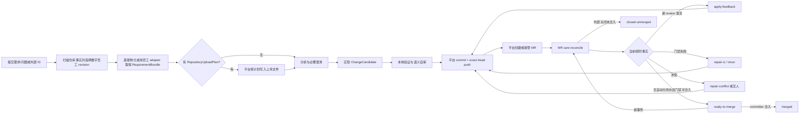

# RFC-310 · 规则驱动的研发数字员工与 MR 生命周期看护（产品视角）

> 技术设计见 [design.md](./design.md)，任务分解见 [plan.md](./plan.md)。
>
> 状态：**Done（2026-08-19 交付完成）**。PR-0..PR-10 全部落地并推 main；`gate:local` 全绿、
> hosted CI 本 RFC 面全绿。**首版不含（如实登记，见 plan.md §13a）**：evidence retention GC 与
> GB 级 nightly、浏览器级 visual regression、verification/review 结果升 catalog fact、
> cutover preflight 的 per-repo dry probe；mission 列表分页与 `/code` work-items 翻页已移交
> RFC-311。2026-08-20 补齐：out-of-order webhook 矩阵（T82）、conflict repair 的 Agent
> 执行面（T78）。
>
> **2026-08-21 数字员工操作系统实现（待 hosted 验证）**：用户确认产品目标升级为“数字员工操作系统”，
> 本文新增 §0A 作为目标产品模型；它优先于本文后续与其冲突的 `DevelopmentMission`、有序步骤、Mission-local
> wake/poll 与 child Mission 特例。PR-14..PR-18 已实现公共 `digital-employee` / `event-center`、研发类型包、
> 分类节点工具箱、固定全景画布、全局执行策略、跨员工通道与单 writer 切换。完整 `gate:local` 已于
> 2026-08-21 以四个随机化后端分片、frontend 6660、shared 2219、system-mock 35 全绿；当前仅剩 exact-SHA hosted CI
> 的发布验证，最终证据写入 plan/STATE。
>
> 架构总纲：[RFC-294](../RFC-294-backend-layered-target-architecture/proposal.md)。
> 可复用底座：[RFC-304](../RFC-304-code-capability-platform/proposal.md)、
> [RFC-308](../RFC-308-unified-task-git-commit-exclusions/proposal.md)、
> [RFC-309](../RFC-309-capability-template-unification/proposal.md)。

## 0A. 规范性架构修订：数字员工操作系统

### 0A.1 产品裁决与优先级

平台的上层产品不再是“代码能力平台”或“长期运行的研发工作流”，而是一个可程序化扩展的**数字员工操作系统**。
代码员工只是首个员工类型包；后续设计、测试、运维等数字员工复用同一套 Context、Event、关注、职责、协作与执行内核。

数字员工不持续占用进程，而是持续承担责任：它保存一份可恢复的案件 Context，收到 Event 后完成一轮有限工作，更新
Context 并重新休眠。完整闭环为：

```text
Context 变化
→ AttentionRule 计算期望关注范围
→ Event Center 建立或取消订阅
→ Webhook / Observer 产生 Event
→ Event Delivery 进入 EmployeeCase 队列
→ ReactionRule 确定本轮工作项与 exact 工具注册
→ 既有 Workflow / Agent / Script / 平台能力执行
→ 外部 Effect + Context 更新
→ 重新计算关注范围并休眠
```

本修订对后文旧模型作以下规范性替代：

| 后文既有形状                                             | 新目标形状                                                            | 裁决                                  |
| -------------------------------------------------------- | --------------------------------------------------------------------- | ------------------------------------- |
| `DevelopmentMission` 是数字员工运行时总抽象              | 通用 `EmployeeCase` 持有 Context Graph、Event Queue 与 Reaction Round | Mission 降为代码员工兼容投影/迁移来源 |
| 有序 `EmployeeStepDefinition`、`onSuccess` 与阶段下拉框  | `AttentionRule + ReactionRule`；Context 产出自动扩张关注范围          | 步骤图不再是业务 authoring 主模型     |
| Mission 自己保存 wake hint、`resumeAt`、`pollIntervalMs` | Event Center 统一注册 Event/Source/Subscription，按订阅激活 Observer  | 轮询与被动事件成为公共机制            |
| `invoke-employee` 是研发员工的一种特殊步骤               | OS 级 `EmployeeInvocation + EmployeeChannel`                          | 父子员工通过持久事件通道协作          |
| ActionTemplate/Adapter/Profile 是用户首先面对的对象      | 用户只选择分类、岗位、工作项工具与适用范围；技术资源进入分类工具箱    | UI 不暴露实现层术语                   |

Context + Event 是一次运行的输入抽象；数字员工的完整定义还必须包含确定性职责规则：

```text
DigitalEmployeeType = ContextTypes
                    + EventTypes
                    + WorkScopeContract
                    + WorkItems
                    + WorkContracts
                    + AttentionRules
                    + ReactionRules
                    + InvocationContracts
                    + AuthoringManifest

EmployeeJobTemplate = TypeRevision
                    + DefaultToolBindings

DigitalEmployeeDefinition = TypeRevision
                          + JobTemplateRevision
                          + NameAndEnabledState
                          + ExactToolBindings
                          + WorkScope

EmployeeCase = ContextGraph
             + DesiredAttention
             + EventQueue
             + ReactionRounds
             + EmployeeChannels
             + GlobalExecutionPolicyRevision
```

这里的“工具”是人类工作语义中的工具，不是新的执行器：Agent、Workflow、程序、平台内置能力分别仍由原 owner 定义和
发布，工具库只统一展示可被某项职责选择的已发布对象。另一名数字员工是协作对象，不伪装成普通工具。

### 0A.2 Context、关注范围与阶段解耦

Context 是数字员工的持久案卷和当前权威状态，不是 prompt，也不要求通过全部 Event 重建。不同 Context 以 typed link
关联，不把完整可变对象互相复制。首个代码员工至少使用：

- `WorkItemContext`：问题单/需求正文、外部 ID、上传文件目标路径与多文件材料引用；
- `IssueHandlingContext`：本员工承担的目标、员工 revision、仓库、验收条件、轮次与交付物关联；
- `MergeRequestContext`：代码平台、仓库、MR、head、readiness 与外部生命周期事实；
- `ReactionEvidenceContext`：某轮流水线、评论或审批证据及 artifact refs，大内容不进入 Event/DB/prompt；
- `DelegationContext`：调用其他员工的 channel、完成条件、deadline 与返回 receipt。

一个职责产出的 Context 自动决定后续关注范围。例如任何来源只要形成 `status=open` 的
`MergeRequestContext`，代码员工的 AttentionRule 就应自动订阅 MR 生命周期、检视、mergeability 和流水线门禁事件；
MR merged/closed 或 Context 解绑后自动取消。它不依赖“上一阶段成功后跳到哪一步”，所以人工接管、恢复时重新发现、
其他员工创建的 MR 都能进入同一套看护逻辑。

Attention 采用期望状态对账，不在外部 Effect 后临时调用一次 `subscribe()`：

```text
desiredSubscriptions = evaluateAttentionRules(employeeRevision, contextGraph)
actualSubscriptions  = EventCenter.listSubscriptions(employeeCase)

reconcile(desiredSubscriptions, actualSubscriptions)
```

Context 变更与“需要重新对账关注范围”的 outbox event 同事务提交。即使服务在“MR 已创建、订阅尚未激活”之间崩溃，
恢复后仍可从 Context 重新推导并补建订阅。

MR 描述和 commit message 可携带机器可读的 Context Envelope，但只作为可移植关联与恢复线索，不是可变 Context 的
权威存储。至少包含稳定 `EmployeeCaseRef`、`ContextRef`、schema version 与原问题单引用；平台仍保存
`(codeHost, repository, mrIid) → ContextRef` 的权威绑定。这样 MR 看护阶段只依赖 Context 合同，不依赖创建 MR 的
工作流或 Agent。

### 0A.3 Event Center 与按订阅激活的主动观察

Event Center 是公共产品能力，严格区分：

- **Event Type**：发生了什么，定义稳定技术 ID、国际化业务名称与描述、subject type 与 payload schema；
- **Event Source**：如何观察，支持 `push | poll | hybrid | stream`；
- **Subscription**：哪个 EmployeeCase 关注哪类 Event、哪个 subject；
- **Event Record**：一次不可变、可去重的标准事件；
- **Event Delivery**：按订阅投递给某个 EmployeeCase 的队列项。

Event Center 决定事件应投递给谁；员工的版本化规则决定同一案件中先处理哪个。相同外部 revision 被 Webhook 与轮询
同时发现时只形成一个标准 Event，但可向多个订阅者分别投递。

程序化 ID 只用于 API、存储、去重和高级技术详情，不能成为业务 UI 的主文案。每个 Event Type 必须随类型包或公共
owner 注册所有受支持语言的 `displayNameKey + descriptionKey`；缺少任一语言时拒绝发布。运行队列显示“收到新的检视
意见——MR 中出现尚未处理的评论”，而不是 `review.comment.created`。事件名称描述“为什么员工被唤醒”，工作项名称
描述“员工要做什么”；例如事件“收到新工作”触发工作项“准备工作材料”，不得在同一区域重复展示两份同义信息。

主动轮询遵循“有订阅才激活、无人订阅就停止”的产品语义，但默认不为每个订阅保持一个长驻脚本进程。平台按
`EventSourceRef + ConnectionRef + ObservationScope + ObservationProfile` 合并为 `ObserverActivation`：

1. 第一个有效订阅出现后持久化 activation、cursor、lease 与 nextRunAt；
2. 到期后通过现有 Script Envelope 执行系统启动一次短 Observer Run；
3. Run 输出 `ObservationEnvelope + nextCursor` 后退出；
4. 仍有订阅才安排下一次；最后一个订阅取消后停止调度；
5. 支持批量查询的来源一次观察多个 subjects，再由 Event Center fan-out；
6. 新订阅必须立即执行一次 baseline observation，弥补订阅建立前可能错过的 Webhook；
7. 取消订阅后迟到的观察结果可以入 Event Record，但不得产生已取消订阅的 Delivery。

问题单、流水线和审批的大文件由 Context materializer/evidence collector 下载到约定临时目录；例如流水线材料进入
`.agent-workflow/pipeline/<bundleId>`。Event 只保存 subject、revision、摘要和 artifact ref，不承载大日志。

### 0A.4 Employee Event Queue 与 Reaction

每个 EmployeeCase 有持久事件队列；同一案件首版严格串行，只允许一个 active Reaction Round。一次 Round 固定：

```text
ContextSnapshotRefs + ContextRevisions + Event + EmployeeRevision + RuleRevision
```

运行中的输入不被新 Event 修改。新 Event 进入下一轮 pending 队列；规则可按 subject/type/revision 去重、合并或标记
obsolete。每次 claim 下一轮时按 type package 优先级重新排序；新到的高优先级事件排到下一轮首位，但不抢占已经运行的普通
Round。队列每次 committed 变更都更新任务页实时投影，因此评论与红门禁同时到达时，用户能看见“当前处理 + 后续待办”。
每轮真正执行前重新收集外部事实；Event 是唤醒原因，不冒充当前事实。MR merged/closed 等终态在新外部
Effect 前形成 transition fence，普通低优先级事件不得覆盖终态。

ReactionRule 用 typed Event、Context facts 和闭集 predicate 选择唯一工作合同及其 exact Tool Binding 与允许 Effect。
ReactionRule、队列优先级与业务失败分支由员工类型包程序化定义；业务用户不在员工页面配置事件、规则顺序或重试。
执行失败后的同现场重试、全新现场恢复、backoff 与停止条件来自平台全局 `ExecutionPolicyRevision`，由“设置 → 执行策略”
统一维护并在 Case/Reaction 中精确 pin。无匹配、多匹配、事实不完整均显式阻断，不让 AI 自主选择下一步。

### 0A.5 数字员工之间的持久事件通道

员工调用员工不是同步函数调用，也不是父 Agent spawn 子 Agent。父员工产生 typed `EmployeeInvocationIntent`，OS 幂等
创建独立子 EmployeeCase 与 `EmployeeChannel`；父 Case 写入 `DelegationContext`、自动订阅子 Case 的公开里程碑事件，
随后结束当前 Round 并释放 Agent/script/workspace 资源。

调用合同必须声明：

- 精确目标员工 revision，或可确定唯一结果的能力 + 目标分类 WorkScope 选择规则；
- typed input envelope 与只读 artifact/context refs；
- 完成条件，例如 deliverable-created、ready-to-merge、merged、completed-no-change 或 typed milestone；
- typed result envelope、deadline、失败/超时/交人分支；
- 多子员工时 `all | any | quorum(n)` join；
- ancestry、最大深度、child budget 与静态/动态循环阻断；
- 父 Case 取消/hand off 后 `detach` 或显式请求取消的传播规则，绝不擅自删除 child MR。

子员工完成一轮或达到里程碑后，经 Event Center 产生 `employee.milestone.reached`、`employee.work.completed`、
`employee.work.blocked` 等内部事件；父队列收到 Delivery 后重新唤醒。返回不是调用栈 return，而是幂等、可重放的
`EmployeeResultEnvelope/Receipt`。父子各有独立仓库、workspace、branch、MR claim 与生命周期，只通过 typed
Context/Envelope/Event/ArtifactRef 协作；对研发员工而言各自 WorkScope 才具体投影为仓库、workspace、branch 与 MR claim。

### 0A.6 执行底座与平台能力复用

数字员工 OS 是控制面和状态系统，不新增第三套 Agent/Script runtime。ReactionPlan 仍交给 RFC-294 唯一执行链：

```text
TaskEngine → WrapperRuntime → NodeExecutor → ExecutionKernel
```

- Agent 通过现有 nonce Envelope 系统读取限定 Context/文件并编辑授权业务文件；不能 commit/push、不能调用代码平台、
  不能调用其他员工，也不能选择下一动作；
- Script 通过现有 Script Envelope 系统承担采集、轮询、分类、验证和确定性修改；脚本退出码、schema 与 semantic
  validator 共同结算；
- Workflow 只是 Agent、Script 与平台 Effect 的已有组合，不是第四种执行器；
- Git diff/candidate/commit/CAS push 继续由 `source-control` 公共能力执行；
- MR、评论、流水线等调用继续使用平台注册的代码平台能力、repository binding、Connection 与 Token；数字员工只产生
  typed call intent，Context/Envelope 不保存 Token；
- 平台即使存在 merge/approve API，代码员工允许的 action closure 仍排除 merge/approve，只观察到 committer 合入。

所谓“确定性 AI 执行”指同一 frozen facts + rules + tool binding + global execution policy 得到同一工具、Envelope、
validator、重试、回退和 Effect closure，不承诺模型每次生成字节相同的代码。

### 0A.7 公共产品能力与 bounded-context 所有权

“公共”指多个员工类型复用，不等于把所有能力塞进 RFC-294 的技术 `platform` mega-module：

| 公共能力                                                                                                    | 目标 owner                                         |
| ----------------------------------------------------------------------------------------------------------- | -------------------------------------------------- |
| Employee Type SDK、员工定义/revision、EmployeeCase、Context Graph、Attention/Reaction、EmployeeChannel/Join | 新通用 `digital-employee` bounded context          |
| Event Type/Source、Subscription、ObserverActivation、Event Record 与 delivery contract                      | 新通用 `event-center` bounded context              |
| Agent、Workflow 与其已发布资源 revision                                                                     | `resource-catalog` 各 typed aggregate              |
| 分类工作项工具注册；ProgramTool 的版本化程序规范                                                            | `digital-employee`；程序仍交给既有 Script executor |
| Workflow/Agent/Script 的实际运行                                                                            | `task-execution`                                   |
| Webhook、代码平台/自建系统 provider adapter、Connection 与 Token registry                                   | `integration`                                      |
| Git workspace/diff/commit/push                                                                              | `source-control`                                   |
| transaction/outbox/lease/timer/process/durable queue kernel                                                 | 技术 `platform`                                    |
| 首个代码员工的 Context/Event/职责/规则/调用合同与默认编排                                                   | `development-automation` 员工类型包                |

`event-center` 与 `digital-employee` 是对 RFC-294 bounded-context 清单的目标扩展；实施前必须同步 RFC-294 架构总纲与
依赖棘轮，不能在 `development-automation` 内先做一套临时公共实现。

每个数字员工分类拥有自己的**分类工具箱**。已发布 Agent、Workflow 以 opaque revision ref 注册为某分类某份 WorkContract 的
工具，不取得其底层写模型；ProgramTool 直接在当前工作项工具箱内定义版本化程序规范，并仍通过既有 Script executor 运行，
不会新增执行器。外部 provider/Connection/Token 仍由 integration 拥有，ProgramTool 只能引用；平台内置能力由类型包程序化注册
且只读；另一名数字员工是协作对象，不伪装成普通工具。同一底层 Agent 若分别通过研发/测试工作合同，可以同时出现在两个分类
工具箱，但注册关系独立。

### 0A.8 程序化定制、工作合同与最小业务配置

平台提供版本化 SDK/manifest，让上层程序化注册员工类型：

```text
defineEmployeeType({
  contextTypes,
  eventTypes,
  workItems,
  workContracts,
  attentionRules,
  reactionRules,
  invocationContracts,
  resultContracts,
  authoringManifest
})
```

阶段是固定生命周期的视觉分组；真正可配置的是阶段内的**工作项**。例如“处理 MR 变化”是阶段，“处理检视意见”和
“处理流水线问题”是两项不同工作。每个工作项引用一份版本化 `WorkContract`：

- 业务名称与说明；
- 确定性的输入 Context/artifact schema；
- 确定性的输出 envelope/Context patch schema；
- 完成标准、允许的 Effect closure 与 semantic validator；
- 允许的工具种类及兼容合同版本。

工具定义必须声明实现哪些 `WorkContract` revision，并通过对应 contract test/probe；不能只写自由文本标签。一个工具可以
实现多份合同，一个工作项也可以有多个兼容工具，但员工节点只能从合同兼容集合中选择。工具不拥有阶段、事件、队列或
下一步；同一个工具若跨员工类型复用，仍要分别对每份工作合同证明兼容。

业务用户创建员工时只配置：员工分类、岗位模板、名称/启停、适用范围，以及没有被模板填满的工作项工具绑定。普通工作项只需
选择一个工具；问题处理工作项按分类包声明的“识别工具 / 修复工具”槽位选择工具，`问题类型 → 槽位` 路由仍由分类包固定；
协作工作项只选择允许的另一名员工或审批目标，输入输出和完成标准只读。
事件、Context mapping、规则顺序、重试/回退、Effect、stage 和连线均不进入员工表单。运行时只执行编译冻结后的 revision。
首个研发员工类型包只负责定义“需求/问题到 MR”“MR 看护修绿”“跨仓委派/审批”等工作合同与默认岗位模板，不拥有
Event Center、Context 存储、队列、Token、Git 或执行器实现。

“适用范围”同样由分类包声明 `WorkScopeContract`：研发分类可用仓库/仓库组，设计分类可用产品/设计域，测试分类可用应用/
环境。通用 OS 只保存已验证的 opaque scope revision 和唯一 assignment，不在 core DTO 中硬编码 repository 字段。

### 0A.9 确定性画布与运行态界面

员工类型包声明固定生命周期区域、Context/Event 内部合同、职责工作项与允许的输出关系；业务用户在一个全量展开的画布
上只补齐工具，不编辑运行时拓扑：

- 生命周期区域固定作为视觉背景，默认一次看见完整员工职责全景；
- 不提供连线拖拽、阶段下拉框或任意新增边；Context 产出与 Attention 关系由类型包合同投影；
- 平台自动节点灰显“无需配置”；可配置节点只显示工作名称、业务说明、已选工具与是否完整；
- 右侧面板普通节点只有“使用的工具”；“平台自动提供的材料”和“完成标准”由 WorkContract 投影为只读业务文案；
- 不显示 Event selector、Context type、Effect、失败重试或技术 ID。Event 只在运行队列/Event Center 以国际化名称和描述出现；
- “调用另一名员工”节点显示协作员工、目标仓库和完成标准；程序化 input/output/channel contract 保持只读；
- 员工节点只从当前分类工具箱选择 Agent/Workflow/ProgramTool 的 exact registration；ProgramTool 只在工具箱工作项页面定义，
  Agent/Workflow 仍回原资源库管理；
- 通用画布只读取类型包 manifest，不出现 `if employeeType === development`；研发、设计、测试员工共享同一套 UI；
- 运行态仍并入 `/tasks`：同页展示业务化工作信息、当前关注、国际化事件队列、正在使用的工具、低优先级待办、child
  channel、MR/交付物状态以及唯一下一步；成效继续归“运行与仓库”。

Event Center 提供事件目录、Event Source、当前订阅和 Observer health 的公共可观察面。业务用户只看可理解的 Event
名称、描述与观察方式；原始 ID、Observer Script、Connection、Token 和 provider 细节只在有权限的技术详情中出现。

### 0A.10 分类工具箱、工作项归属与全局执行策略

“数字员工”按程序化注册的员工分类（技术对象为 Employee Type）组织，每个分类拥有自己的员工、工具箱与适用范围：

```text
数字员工
  ├─ 研发数字员工 / 员工 | 工具箱 | 适用范围
  ├─ 设计数字员工 / 员工 | 工具箱 | 适用范围
  └─ 测试数字员工 / 员工 | 工具箱 | 适用范围
```

工具箱的规范层级固定为 `数字员工 → 数字员工分类 → 工作项 → 工具`。工具箱首页直接复用该员工分类的固定职责图；用户
先点工作项节点，再查看或增加该节点的工具。由于入口已经确定 `EmployeeTypeRef + WorkItemRef + WorkContractRef`，新增工具
时不得再要求选择阶段，也不得展示一个跨工作项的平铺工具大表。系统自动工作项只显示“平台自动、无需配置”，没有增加工具
入口。

同一份 manifest 职责图固定复用四次，节点位置和业务名称完全一致：分类“工具箱”模式管理节点可用工具；“岗位模板”模式为
各 slot 选择默认工具；“员工”模式显示模板默认并只允许必要覆盖；任务“运行”模式只读显示当前/待办/完成与实际使用工具。
用户在四个页面看到的是同一个人、同一组职责，而不是四套名字相似但无法对应的表单。

每个类型工具箱只注册该类型、该工作项合同兼容的工具：

- Agent 工具：引用“能力资源 → 代理”中的已发布 Agent；
- Workflow 工具：引用“编排 → 工作流”中的已发布 Workflow；
- ProgramTool：在当前工作项内填写程序名称、运行种类、版本化程序内容/引用、参数与所需 Connection；输入输出由合同自动带出且只读，
  发布 executable 字段额外要求 `scripts:author`；
- 平台工具：Git 提交、创建 MR、事件对账等由类型包注册，只读且不出现在可替换选择器中；
- 协作员工：从数字员工目录选择，使用 InvocationContract，不进入普通 ToolDescriptor。

工具创建的最小字段固定为：业务名称/说明、工具种类与真实资源引用，以及 ProgramTool 所需 Connection；员工类型、工作项
与 WorkContract revision 由当前节点自动带入。工具不能自定义输入输出 schema、重试、Git/Token 权限、事件或下一步。
流水线问题等需要两类参与者的工作项，可在同一节点下按“识别工具 / 修复工具”展示，但仍属于同一工作项，不引入新的业务
资源层。员工节点选择器只读取本节点的 `TypeToolRegistration`；不兼容项根本不显示，不能靠运行时试错。

“设置 → 执行策略”维护一个版本化的平台全局策略，统一 Agent/Workflow/ProgramTool 的协议错误重试、fresh-scene 恢复、
边界违规处理、程序 transient backoff、外部 Effect unknown-result reconcile 与预算上限。员工、岗位模板、工作项和工具均
不得覆盖这些字段。策略更新默认只影响新 EmployeeCase；在途 Case 必须显式 preview/apply 并记录新旧 policy revision。

### 0A.11 首个研发数字员工分类的确定性职责图

研发分类严格只有两项人的职责，职责区域作为固定背景；区域内再放可配置工作项和只读系统节点：

```text
职责一：交付一个 MR
  收到新工作(Event)
    → [准备工作材料] → [分析并实现] → [验证改动] → [平台提交并创建 MR]
                                                        │
                                                        └─ 产出 MergeRequestContext
                                                           自动建立 MR 关注

职责二：持续看护 MR
  [等待 MR 变化·系统] → Event Queue 按规则选下一项
    ├→ [处理检视意见] ─┐
    ├→ [处理流水线]   ─┼→ [平台验证并发布修复] → [等待 MR 变化·系统]
    ├→ [处理合并冲突] ─┤
    └→ [跨员工协作/审批]┘
  merged / closed(Event) → [结束关注·系统]
```

连线和循环由研发 Type Package 固定。`MergeRequestContext` 一产生就通过 AttentionRule 扩张关注范围，不需要用户再配置
“创建 MR 后去监控 MR”。一轮只处理队列中的一个已选工作集；新评论与红流水线并存时，低优先级项留在下一轮。

首版工作项合同如下；业务界面显示中文名称和摘要，括号内 ID 只供技术合同：

| 职责区域    | 工作项                                   | 确定性输入                                                 | 确定性输出/完成标准                                                             | 工具槽位                                                         |
| ----------- | ---------------------------------------- | ---------------------------------------------------------- | ------------------------------------------------------------------------------- | ---------------------------------------------------------------- |
| 交付一个 MR | 准备工作材料 (`work.materials.prepare`)  | 正文/上传文件/外部 ID 的 `WorkSubmissionContext`           | 完整 `RequirementBundleRef + IssueHandlingContext`；上传路径计划已校验          | 外部取件 ProgramTool；直接正文/文件由系统处理                    |
| 交付一个 MR | 分析并实现 (`change.implement`)          | IssueHandlingContext、材料 refs、exact repo snapshot       | 合法 Agent envelope + 真实业务文件 delta，或 closed no-change/needs-information | `primary`，岗位模板默认 Java/C++/polyglot Agent 或 Workflow      |
| 交付一个 MR | 验证改动 (`change.verify`)               | candidate snapshot、验收条件                               | 程序化 `VerificationReceipt` 完整且通过；失败产出 typed ProblemSet              | `verification` ProgramTool/Workflow                              |
| 交付一个 MR | 平台提交并创建 MR                        | validated candidate、上传履约计划、exact remote head       | commit/push/MR receipt + `MergeRequestContext`                                  | 系统节点，无可替换工具                                           |
| 持续看护 MR | 处理检视意见 (`mr.feedback.handle`)      | exact head、未处理 thread revisions、feedback artifacts    | 每条 revision 有处理结果，修复 delta 已验证                                     | `primary` Agent/Workflow                                         |
| 持续看护 MR | 处理流水线 (`mr.pipeline.handle`)        | exact-head `PipelineEvidenceBundle` 与 required gate facts | 完整 ProblemSet；分配的问题已修复并重采，unknown 不误绿                         | `recognizer` + compile/unit-test/static-analysis 等 repair slots |
| 持续看护 MR | 处理合并冲突 (`mr.conflict.handle`)      | 平台准备的 exact conflict workspace                        | conflict envelope 合法且冲突集合清零，禁止 rebase/force push                    | `primary` Agent/Workflow                                         |
| 持续看护 MR | 跨员工协作/审批 (`mr.dependency.handle`) | DelegationContext/审批证据                                 | child/approval typed receipt 满足 completion contract                           | 协作员工；审批准备/观察 ProgramTool，不作为普通 repair tool      |
| 持续看护 MR | 平台验证并发布修复                       | validated repair delta、当前 MR head                       | exact-head commit/push/comment receipt，随后重新关注                            | 系统节点，无可替换工具                                           |
| 持续看护 MR | 等待并跟踪终态                           | MergeRequestContext、Attention subscriptions               | readiness 实时更新；merged/closed 后 terminal Context 并取消订阅                | 系统节点，无可替换工具                                           |

岗位模板只给上述工具槽位填默认注册，不复制这张图。C++、Java 的区别体现在 `change.implement`、verification 和各 repair slot
选择的工具；两者的职责、Event、输入输出合同与系统发布节点完全相同。

## 0. 摘要裁决

> 本节及 §1-§5 中的 `DevelopmentMission`、`ActionTemplate` 与长生命周期步骤描述是已交付研发实现的迁移基线；公共 OS 的
> 产品抽象以 §0A 和 §6 为准。Envelope、证据、Git/Effect 边界仍复用，但不得据此恢复旧业务配置术语。

本 RFC 把 `/code` 从“若干可单独起跑的代码能力”改造成一名**规则驱动的研发数字员工**：

1. 用户提交需求、问题或其外部系统 ID；
2. 平台先取得仓库事实，并按可选 sourceKey、仓库 assignment 与已发布规则选择一套数字员工精确 revision；
3. 平台再用该员工 pin 的 adapter 程序化取得完整需求材料，之后持续取得 MR 与流水线门禁事实；
4. Agent 只在被点名的能力边界内理解、写代码或做语义审查；
5. 平台独占 Git、代码托管、流水线重试、评论与 MR 写操作；
6. 平台持续处理新反馈、红流水线和冲突，使 MR 保持“随时可由 committer 合入”；
7. 平台**绝不自动合入、绝不自动批准**，只跟踪到 committer 在外部系统完成合入。

RFC-304/309 的**上层产品模型被替换**，但其已验证底座不推倒重写：固定且版本化的阶段合同、nonce
envelope、同现场新 host task 重试/全新现场重跑台账、任务执行内核、MR lease、发布意图、source-control 的
candidate/commit/publish 与 `.agent-workflow` 排除规则继续复用。

一句话概括新边界：

> **规则决定做什么、何时做、用哪套能力；Agent 只完成规则已经点名的认知或编码动作；平台验证事实并执行一切有权限的副作用。**

## 1. 为什么 RFC-304/309 不是目标产品

[RFC-304](../RFC-304-code-capability-platform/proposal.md) 已把五条能力跑通，
[RFC-309](../RFC-309-capability-template-unification/proposal.md) 已把模板与流程统一；问题不是“它不能运行”，而是它
表达的业务对象不对。

| 当前模型                                                                      | 目标模型                                                                | 当前模型造成的后果                                       |
| ----------------------------------------------------------------------------- | ----------------------------------------------------------------------- | -------------------------------------------------------- |
| `mr-review / mr-comment-fix / requirement / ci-fix / mr-monitor` 五条并列能力 | 一名数字员工的一条 `DevelopmentMission`                                 | 同一需求、同一 MR 被拆成多个工作项，生命周期无法天然贯通 |
| 仓库 × 能力矩阵，每格只选一个模板                                             | 仓库选择一套数字员工；数字员工内部按事实路由 Java/C++ 等 ActionTemplate | 无法表达“这名员工会 Java、C++，并会按模块选择”           |
| `mr-monitor` 是第五条能力                                                     | Mission reconciler 是常驻生命周期引擎                                   | “监视”被当成可执行动作，而不是所有动作的调度者           |
| `arbitrate` / `select` 脚本决定下一能力和 Agent                               | 声明式规则产生唯一 `NextDecision`                                       | 决策藏在任意脚本里，平台无法预演、解释或静态验证         |
| 需求正文和多文档直接塞进输入对象                                              | 外部 ID 经适配器物化成不可变多文件 bundle                               | 外部引用目前无法取回，大材料也不适合进入 DB/prompt       |
| 门禁只有 `status/runId/rawLogRef`                                             | 自建门禁适配器产出 exact-head、完整性和本地证据 bundle                  | 无法表达门禁不完整、多个 gate、大日志和自研系统细节      |
| Agent 输出 envelope，但工作区与 Git 权限仍沿用普通任务                        | AgentAttempt 有显式输入、输出、工作区和 Git 权限合同                    | 输出格式可控，不等于执行边界可控；失败也未必恢复原现场   |
| 固定三轮 CI campaign                                                          | 每类动作有规则化预算、退避、解除条件                                    | 不同项目、错误类型和责任边界无法按业务配置               |

因此，本 RFC 不是给现有五个能力再加几个表单，而是重建它们上方的业务抽象。

## 2. 六条产品宪法

### 2.1 决策只能来自规则

- Mission 下一步做什么、动作优先级、选哪名数字员工、选哪份 ActionTemplate、是否重试、何时交人，全部由版本化规则计算。
- 规则只能读取平台程序化取得、带 revision 与 digest 的 typed facts。
- Agent 不得返回“下一步调用哪个能力”“换哪个 Agent”“是否推送”“是否重跑流水线”等调度决定。
- 规则无匹配、事实不完整或多义配置一律显式阻断，不让 Agent 猜。

这里的“规则驱动”锁的是**业务动作与副作用选择**，不是假装 AI 的代码理解本身是确定性程序。Agent 可以在已选定
Action 内决定如何理解和修改代码，也可以输出 capability contract 预先声明的闭集认知事实；这些结果必须先经 schema/
semantic validator 固化为带 provenance 的 receipt，之后规则才能读取。Agent 不能输出 template/action/effect id，
其自由文本也不能成为 predicate。确定性承诺是“同一 frozen facts + policy 得到同一决策”，不是“同一自然语言每次
必然得到相同代码”。

### 2.2 程序优先，Agent 只做不可程序化的工作

程序负责：外部材料下载、仓库识别、模板选择、状态采集、分类映射、优先级、去重、Git、门禁执行、发布、重试计数、readiness 计算与终态跟踪。

Agent 只负责：理解自然语言、分析代码语义、编写业务文件、解释 review 意见、修复无法由程序直接修复的问题、语义自审。

### 2.3 Agent 没有 Git 和外部副作用权限

- Agent 可以按能力合同读取或编辑授权的业务文件；不得 `git add/commit/push/merge/rebase/reset/checkout`，不得改 refs/index/config/object database。
- Agent 不持有代码托管、流水线、SSH、Git credential；不能创建/更新 MR、评论、批准、合入或重跑流水线。
- `commit/push/comment/MR/pipeline retry` 只能由平台 action 执行，并且必须消费已验证 receipt。
- **首版强制机制（2026-08-18 用户裁决）**：不引入 OS 沙箱、只读 Git facade、command broker 或网络管控；边界由
  「prompt protocol block 禁止 + 零凭据/零 Git identity 注入 + 前后快照对拍与事后验证 + 违规整树回退」构成。
  Agent 对 Git metadata / evidence / 受保护路径的写入不被 OS 阻止，但必被检测为 boundary violation：attempt 作废、
  workspace 废弃重建，绝不进入 candidate/commit。OS 级隔离与网络边界列为后续增强，另立 RFC。

### 2.4 Agent 输出必须被 envelope 封死

- 每个 Agent stage 有唯一 nonce、唯一输出 port、exact schema、closed outcome union 和 semantic validator。
- 没有合法 envelope 就没有结果；普通 stdout、解释文字和 Agent 自报“已完成”都不是事实。
- envelope 合法之后，平台仍独立检查真实 diff、Git 元数据、授权路径、门禁结果与外部 head。

### 2.5 Mission 持续到外部终态，但永不自动合入

- `ready-to-merge` 是**非终态**：新提交、新评论、红流水线、目标分支变化都可让它回退到工作态。
- `merged`、`closed-unmerged`、`completed-no-change`、`canceled` 才是终态。
- 无需代码变化时不能伪造 MR：Agent 的 `no-change` 需由程序证据或人工确认，之后才进入
  `completed-no-change`。
- 平台不提供 `merge` / `approve` decision，不向数字员工 adapter 暴露 `mr.merge` / `mr.approve`。
- committer 在代码托管系统审核并合入；平台只负责让 MR 保持可合入并跟踪最终结果。

### 2.6 所有执行都钉住版本和事实

每个 Mission 固定：数字员工 revision、策略 revision、能力合同 version、每次动作的 ActionTemplate revision、需求 bundle revision、仓库基线、MR head、pipeline run 与 evidence digest。配置更新只影响新 Mission；在途 Mission 的升级必须是显式命令并重新评估下游失效面。

## 3. 业务对象

| 对象                      | 定义                                                                                       | 谁能改                                   |
| ------------------------- | ------------------------------------------------------------------------------------------ | ---------------------------------------- |
| `CapabilityDefinition`    | 平台内置、版本化的可执行能力合同：输入、阶段、Agent 权限、输出、验证、失效与副作用边界     | 仅产品代码随 RFC 升版                    |
| `AdapterDefinition`       | 外部系统程序适配：需求取件、门禁采集、日志分类等；只产 typed facts/evidence，不作业务决策  | `scripts:author` + 资源写权              |
| `VerificationProfile`     | 本地 build/test 程序、隔离、超时与证据选择；程序化产生 VerificationReceipt                 | profile owner；改程序需 `scripts:author` |
| `ActionTemplate`          | 某项 Agent 能力的具体实现，例如 `change.implement/cpp-cmake@4`                             | 模板资源 owner                           |
| `DigitalEmployeeTemplate` | 一名数字员工的能力包：ActionTemplate 路由、适配器引用、默认策略                            | 模板资源 owner                           |
| `AutomationPolicy`        | 触发、选择、动作优先级、重试、门禁、反馈、冲突、通知和保留规则                             | 策略资源 owner                           |
| `ProblemTypeDefinition`   | 员工可识别的问题类型，例如编译、单测、静态检查、检视意见和冲突；定义证据合同与未知类型回退 | 数字员工 owner                           |
| `ProblemProducer`         | 从冻结的 MR/门禁/验证证据产出 typed `ProblemSetEnvelope`；实现可以是只读 Agent 或程序      | 数字员工 owner；程序实现需脚本写权       |
| `ProblemHandlingRule`     | `问题类型 + typed facts → 处理者` 的有序规则；处理者可以是 Agent 或程序                    | 数字员工 owner                           |
| `DevelopmentMission`      | 一次需求/问题到 MR 外部终态的业务聚合根                                                    | 平台命令按 authority/OCC 修改            |
| `ActionRun`               | Mission 的一次确定性动作，固定 capability/template/facts/baseline                          | Mission engine                           |
| `AgentAttempt`            | 一次独立 host task；同现场与 fresh-scene 尝试均有独立序号和 receipt                        | Task execution + Mission engine          |
| `RepositoryUploadPlan`    | 上传 blob、仓库目标路径、碰撞方式、内容策略与冻结基线前提                                  | 平台从用户输入生成；后续不可变           |
| `ChangeCandidate`         | 平台从上传 seed 与可选 Agent 业务改动的真实工作区推导的候选改动                            | source-control 生成，Mission 引用        |

`CapabilityDefinition` 与执行实现必须分开：前者定义**能做什么且边界是什么**，后者定义**这套 Java/C++ 员工如何实现它**。实现不能改变能力 schema、阶段顺序、权限、下一动作或合入边界。

上述 `ActionTemplate`、`VerificationProfile`、`AdapterDefinition` 是发布编译器和 bounded context 使用的技术资源，
不是业务用户必须先理解的产品导航。产品主对象只有“数字员工”：用户在一张员工说明书里配置步骤、触发条件、
执行者、问题类型和失败处理；发布时平台把它编译并 pin 到这些内部资源的精确 revision。

## 4. Mission 生命周期



Mission 只允许一个可写 ActionRun。只读分析可以在不可变 snapshot 上并行，但不能让 Java/C++ 两个可写 Agent 同时改同一工作树。

### 4.1 两层 readiness

- `automationReady`：平台已处理当前 head 上所有按策略可自动处理的事项，没有待执行 action、待确认 effect 或未处理反馈。
- `readyToMerge`：在 `automationReady` 之外，程序化收集到的 mergeability 完整、无冲突、required gates 全绿、当前 head 未过期；若代码托管仍要求 committer approval 或人工 resolve，则显示 `waiting_committer`，不能伪报 ready。

`ready-to-merge` 只有在 `readyToMerge=true` 时成立。任何 `unknown/partial/unavailable` 门禁事实都不能当 pass。

## 5. 首批能力目录

### 5.1 程序/适配器能力

| Capability ID             | 作用                                                 | 产物                                  |
| ------------------------- | ---------------------------------------------------- | ------------------------------------- |
| `requirement.materialize` | 平台正文/上传文件 → 规范化并冻结需求与仓库落点       | bundle + optional upload plan receipt |
| `requirement.acquire`     | 外部 ID → 通过 adapter 下载并冻结多文件需求          | `RequirementBundleRef`                |
| `change.seed-uploads`     | 按 RepositoryUploadPlan 把上传 blob 放入业务 overlay | `UploadPlacementReceipt`              |
| `repository.inspect`      | 扫描语言、构建系统、模块、工具链与 contributor 指令  | `RepositoryFactSnapshotRef`           |
| `employee.select`         | 规则选择员工与精确 revision                          | `EmployeeSelectionReceipt`            |
| `mr.collect`              | 主动收集 MR head、mergeability、approval、threads    | `MergeRequestFactSnapshotRef`         |
| `pipeline.collect`        | 调自建程序取得门禁详情并下载大日志                   | `PipelineEvidenceBundleRef`           |
| `policy.decide`           | 固定 guard + 声明式规则计算下一动作                  | `DecisionTraceRef`                    |
| `verification.run`        | 按项目配置执行本地门禁；结果由程序判定               | `VerificationEvidenceRef`             |

### 5.2 Agent 参与能力

| Capability ID         | 工作区权限            | 合法用途                                               |
| --------------------- | --------------------- | ------------------------------------------------------ |
| `requirement.analyze` | read-only             | 理解材料、形成方案或提出澄清问题                       |
| `change.implement`    | edit-business-files   | 首次实现需求/问题                                      |
| `change.review`       | read-only             | 对真实 candidate 做语义自审；不能发布 MR review        |
| `verification.repair` | edit-business-files   | 修复本地验证失败                                       |
| `mr.feedback.apply`   | edit-business-files   | 处理固定 thread revision 的检视意见                    |
| `pipeline.repair`     | edit-business-files   | 读取本地 pipeline bundle 并修失败                      |
| `conflict.repair`     | edit-conflicted-files | 在平台已准备的 merge-conflict workspace 中只改冲突文件 |
| `mr.review.external`  | read-only             | 可选：对外部 MR 产出结构化 findings，发布仍由平台完成  |

### 5.3 平台副作用能力

| Capability ID                   | 唯一 authority                            | 说明                                                           |
| ------------------------------- | ----------------------------------------- | -------------------------------------------------------------- |
| `change.publish`                | source-control                            | prepare/preview/commit/exact-head CAS push；禁止 force push    |
| `mr.ensure`                     | integration code-host adapter             | 创建或查找 MR，幂等绑定 Mission                                |
| `mr.feedback.report`            | integration code-host adapter             | 回帖处理结果；不自动 resolve 人类 thread                       |
| `requirement.questions.publish` | Mission application / requirement adapter | 按 policy 发布不可变 QuestionSet；原渠道使用幂等 effect        |
| `requirement.answers.collect`   | integration requirement adapter           | wake 后主动取得 exact AnswerSet revision，不信 callback 正文   |
| `pipeline.rerun`                | integration gate adapter                  | 仅规则命中的可重试类别和预算内执行                             |
| `pipeline.trigger`              | integration gate adapter                  | required run 缺失且 policy 允许时按 exact head 幂等触发        |
| `mission.readiness.publish`     | Mission application                       | 更新平台内 read model；外部总览评论是另一个 active-mode effect |
| `mission.track-terminal`        | Mission reconciler                        | 观察 merged / closed，绝无 merge action                        |

`mr-monitor` 不再是 CapabilityDefinition。它被 `DevelopmentMissionReconciler` 取代：事件只是唤醒，主动采集才是事实，规则决定下一步。

## 6. 数字员工与策略配置项

产品配置面采用唯一的四层层级：

```text
数字员工（顶层产品模块）
  └─ 数字员工分类（例如研发、设计、测试）
       └─ 工作项（职责流程中的确定性节点）
            └─ 工具（该工作项可选择的已发布实现）
```

“阶段”只是在职责流程图上帮助用户理解生命周期的视觉背景，例如“接收工作”“完成交付”“持续关注”，不是第五层配置对象，
也不得出现在“增加工具”表单的下拉框中。用户点击哪个工作项，平台就已经知道工具属于哪个分类、哪个工作项以及哪一版输入输出合同。

业务用户只回答四个问题：**创建哪类员工、它叫什么并负责哪里、每个工作项使用哪个工具、是否启用**。事件订阅、Context
映射、流程连线、effect、重试与回退不是员工实例配置项。`ActionTemplate`、`VerificationProfile`、`adapter`、`profile`、资源
ID/revision 也不得成为业务界面的概念。

### 6.1 三层业务定义

四层信息架构背后只有三类可发布业务定义：

1. `EmployeeTypeRevision`（数字员工分类）由程序化 Type Package 定义职责、固定工作项、工作合同、事件反应规则与业务文案。
2. `EmployeeJobTemplateRevision`（岗位模板）为某个分类预选一组默认工具，例如“Java 服务研发”“C++ CMake 研发”；它只是一键起步方案，
   不复制底层 Agent、Workflow 或 Program。
3. `DigitalEmployeeDefinitionRevision`（具体员工）只保存名称、启用状态、分类与岗位模板 revision、负责范围，以及用户对默认工具的显式替换。

岗位模板不是第五层导航或另一套流程。在分类的“员工”页内以次级“岗位模板”列表管理；创建模板仍复用同一固定职责图，只填写
模板名称/说明并为各工作项槽位选择默认工具。模板不能新增工作项、改变 WorkContract 或写路由规则，发布后具体员工可一键采用并
只覆盖个别工具。Java、C++、polyglot 因此是同一研发分类下的三个已发布岗位模板。

新建员工的最短链固定为“选分类 → 选岗位模板 → 填名称和负责范围 → 检查各工作项工具 → 发布”。如果模板已把工具填全，
用户无需逐节点确认；发布页只列出未满足合同或不可见的工具，不要求理解内部依赖图。

### 6.2 工作项与确定性工作合同

工作项才是可配置节点。每个 `WorkItemDefinition` 至少声明业务名称、职责说明、所在视觉阶段、顺序、是否为系统节点，以及不可变
`WorkContractRevision`。工作合同必须声明：

- 确定性的输入 envelope/schema 与材料摘要；
- 确定性的输出 envelope/schema 与完成标准；
- 允许的工具种类：`agent | workflow | program`；
- 允许的副作用种类和语义验证器；
- 合同 fixture 与兼容性规则。

输入、输出、完成标准和系统副作用均由分类包定义，员工创建者不可修改。系统节点（例如建立 MR 关注、等待事件、平台提交推送）
可以显示在全景图中，但不提供“增加工具”。业务节点只要求 manifest 标为 required 的工具槽位全部填满；可选槽位可由系统路径
跳过。required 工具未绑定、合同版本不兼容或同一 exactly-one 槽位多绑定时，发布直接阻断。

### 6.3 分类工具箱与工作项工具注册

每个数字员工分类拥有独立工具箱，工具箱不是全局平铺的“执行者库”。页面复用该分类的完整职责流程图：点击一个工作项，右侧只显示
这个节点的工具列表和“增加工具”；点击其他节点，列表随之切换。增加工具时平台自动带出
`EmployeeTypeRef + WorkItemRef + WorkContractRef`，用户只需：

1. 选择已有 Agent/Workflow，或在当前节点定义一个 ProgramTool；
2. 选择业务角色（普通主工具，或问题识别/修复/审批等该工作项允许的角色）；
3. 选择已发布连接（仅当该工具需要外部系统）；
4. 运行合同校验并发布注册。

Agent 和 Workflow 本体继续由原 owner 管理；分类工具箱只保存其引用与兼容注册，不复制也不现场改写。ProgramTool 没有额外的全局
资源层，直接作为当前工作项 `TypeToolRegistration` 的版本化程序实现定义，并复用 Script 执行系统；外部 Adapter/Connection 仍只引用
integration 已发布资源。工作项中选择另一个数字员工属于协作关系，通过事件通道与 Join 定义，不伪装成普通工具。

同一个底层实现可以分别注册到多个分类或工作项，但每次注册都必须独立通过目标 `WorkContractRevision` 的 fixture、输入输出 schema、
权限可见性与连接探测。员工实例的工具选择器只读取“当前分类 + 当前工作项 + 当前合同版本”下已发布且兼容的注册，绝不回退到全局资源列表。

### 6.4 MR 问题类型、生产者与处理规则

MR 看护中的流水线失败、验证失败、合并冲突和检视意见统一投影为 `ProblemSetEnvelope`：

```ts
interface ProblemSetEnvelopeV1 {
  readonly protocol: 'aw-problem-set@1'
  readonly producerRef: string
  readonly evidenceDigest: string
  readonly headSha: string
  readonly complete: boolean
  readonly problems: readonly {
    readonly problemRef: string
    readonly typeId: string
    readonly subjectRefs: readonly string[]
    readonly summary: string
  }[]
}
```

- **问题类型**由数字员工分类包定义，至少含稳定 `typeId`、业务名称、适用证据域、是否可修复和 unknown 回退；例如
  `compile`、`unit-test`、`static-analysis`、`review-change-requested`、`merge-conflict`。
- **问题生产者**可以是 script 或只读 Agent。它只读 exact head 对应的 evidence bundle，只能产出配置允许的 typeId；
  平台校验 evidence digest、subject 闭集、覆盖性、唯一 problemRef 和 envelope 后才形成 fact。
- **问题处理规则**按稳定顺序把 `typeId + repository/module/gate facts` 映射到一个修复生产者。修复生产者也可以是
  Agent 或 script；两者都不能 commit/push，业务改动由平台从真实 workspace 推导并统一验证、提交和推送。
- 多问题由程序按 `(type priority, subjectRef, problemRef)` 生成工作集；规则明确逐类还是成批处理，Agent 不挑问题。
- producer/handler 输出错误时按全局执行策略同现场重试；耗尽后从 exact baseline 重建现场。只有分类包的确定性规则显式配置了
  下一 producer/handler 才能换实现，否则阻断并交人。
- 每轮固定为“采集证据 → 产出问题 → 规则选处理者 → 修复 → 程序化验证 → 重采”；unknown 不得当作已修复或通过。

流水线处理仍是一个工作项。该节点的工具列表可按“问题识别工具”和“问题修复工具”分组；分类包定义稳定的
`problem type → recognition registration → repair registration` 路由，业务用户只选择已验证注册，不手写 predicate 或下一动作。

### 6.5 调用其他数字员工与外部审批

数字员工分类包可以声明跨仓库、跨系统的协作工作项，但不允许 Agent 自己递归启动 Agent 或持有会话轮询。业务实例只绑定
manifest 允许的目标员工/审批目标与适用范围，以下输入映射、完成分支、幂等和恢复合同由分类包程序化定义：

- `invoke-employee` 步骤配置目标仓库解析规则、目标员工 exact revision、输入 envelope 映射、完成条件、子任务预算和
  失败/超时分支。平台以 `(parentMission, stepAttempt, targetRepository, employeeRevision, inputDigest)` 幂等创建 child
  Mission；父子各有独立 workspace、branch、MR claim 和生命周期，只传 typed envelope/artifact ref。
- `approval.prepare` 可由 Agent 读取冻结证据并产出 `ApprovalRequestDraftEnvelope`；它不持有审批系统 credential。
- `approval.submit` 由 script/integration effect 消费已验证 draft，按 idempotency key 向外部系统提交并返回
  `ApprovalReceipt(correlationRef, externalRequestRef, submittedRevision)`；响应丢失时先按 key 查询 adopt。
- `approval.observe` 是短执行程序：按 correlation ref 返回 `pending | approved | rejected | expired | unavailable` 及
  authoritative revision。`pending` 转成 durable wait，释放 Agent/script/仓库资源，由 webhook 或 `resumeAt` 再次唤醒，
  绝不保持一个轮询进程或 Agent 会话。
- 多个 child/approval 依赖必须配置 `all | any | quorum(n)` join、deadline、拒绝/超时/部分成功分支；没有分支就阻断。
- publish compiler 拒绝静态可见的调用环和没有 deadline/wake source 的等待；运行时还以最大调用深度、总 child budget
  和 ancestry receipt 阻止动态环。父 Mission 取消/hand off 不擅自关闭外部审批或 child MR，只停止新写并继续结算真相。

典型规则链：`修当前仓 → 调用门禁配置员工修改另一仓 → 准备审批 → 程序提交审批 → 程序等待批准 → 重跑当前门禁`。

### 6.6 负责范围、系统连接与全局执行策略

员工说明书同时选择服务的仓库/仓库组、需求输入方式和门禁系统。界面显示连接的业务名称；外部 ID 下载程序、
门禁采集程序、大日志目录、credential connection 等 integration 字段留在管理员技术配置。员工只 pin 已发布连接。

重试、fresh-scene 回退、退避、单轮/总预算、外部等待 deadline 与最终 handoff 统一位于“设置 → 执行策略”。策略发布为不可变
`GlobalExecutionPolicyRevision`，新建 Case 默认 pin 最新已发布版本；在途 Case 不被静默改变，只有显式预览影响并升级才切换。
分类、工作项、工具注册和具体员工页面都不重复出现重试配置。

### 6.7 发布编译结果（平台内部）

分类包、岗位模板、工具注册和员工定义发布后，平台编译内部 reaction plan 与完整资源闭包。以下仅用于运行、审计与技术诊断，
不是业务 authoring 表单：

| 策略组                | 配置项                                                                                                |
| --------------------- | ----------------------------------------------------------------------------------------------------- |
| Mission admission     | 允许的提交来源、仓库范围、外部 ID sourceKey、幂等/重复提交策略                                        |
| Requirement           | 直接/外部入口、上传预算与目标路径类、碰撞/内容默认、source refresh、澄清与 no-change                  |
| 数字员工选择          | 显式选择、repo assignment、repo-group assignment、typed fact rules、无匹配处置                        |
| 工作项工具路由        | 分类/工作项/合同下 exact registration、问题类型路由、模块/路径/language/build-system predicates       |
| MR care 优先级        | 固定安全 guard 之后，feedback / conflict / CI / self-review 的有序规则                                |
| Feedback              | 哪些作者/线程进入处理、每批上限、最新 revision 规则、需要澄清时回帖策略                               |
| Pipeline              | required gate、complete、缺失时 observe/trigger、失败分类、rerun/fix、exact-head freshness            |
| Conflict              | `repair` 或 `report-only`、最多尝试次数；repair 固定 merge target into source，禁止 rebase/force push |
| Delivery / MR         | 新建或接管已有 MR、目标分支、源分支命名/碰撞、draft、远端 human push 后的重新基线策略                 |
| Verification          | 必需 profile/step、超时/并发/失败证据策略；可执行程序归 VerificationProfile，Agent 自报不作事实       |
| Retry/budget          | pin 的全局执行策略 revision、Agent/动作/effect 预算、backoff/deadline、总 token/时长/提交次数         |
| Readiness             | required gates、允许的 warning、未处理 feedback 判据；核心安全条件不可关闭                            |
| Notification          | 自动触发静默、人工指令 receipt、总览评论复用、告警升级对象和频率                                      |
| Evidence retention    | RequirementBundle/PipelineBundle/AgentAttempt/ActionRun 的 active 与 terminal TTL                     |
| Configuration upgrade | 新 Mission 默认生效；在途 employee/policy 闭包升级必须显式、预览失效面并原子重新 pin                  |

旧 `ActionTemplate`、`VerificationProfile` 和 `AutomationPolicy` 只能作为迁移输入或编译产物保留，不再是数字员工产品中的一等概念。

### 6.8 固定策略，不开放配置

以下不是“默认值”，而是产品宪法：不自动 merge/approve、不让 Agent 改 Git或调用代码托管、不接受无 envelope 输出、不把 unknown gate 当 pass、不对 stale head 发布、不 force push、不自动 resolve 人类 review thread。

预算耗尽、长期外部故障或 source branch 不可写时，policy/用户可把 Mission 切到 `tracking-only`：停止 Agent、Git、
评论与 pipeline 写操作，但继续主动采集 MR/gate/readiness 并跟踪 merged/closed；显式 resume 才恢复自动写。

## 7. 多套数字员工与确定性选择

Java/C++ 不是新的能力 ID，也不是另一套任意工作流；它们是“研发数字员工”分类下的岗位模板。岗位模板为固定工作项预选不同工具：

```text
研发数字员工
  ├─ Java 服务研发岗位模板
  │    ├─ 需求开发 → Java 开发 Agent
  │    └─ 流水线处理 → Java 问题识别 / Java 修复工具
  ├─ C++ CMake 研发岗位模板
  │    ├─ 需求开发 → C++ 开发 Agent
  │    └─ 流水线处理 → CMake 问题识别 / C++ 修复工具
  └─ 多语言研发岗位模板
       └─ 每个工作项 → 分类包规定的 typed-fact 路由
```

选择分两层：

1. **Mission 建立时选数字员工**：请求显式选择 > repository assignment > repository-group assignment > 员工选择规则。每一级只有一个结果；同级冲突或无 fallback 就阻断。
2. **执行工作项时选工具注册**：只在已 pin 的员工定义及当前工作项工具集合内，按模块、changed paths、语言、build system、
   pipeline category 等 closed typed facts 依顺序 first-match。

规则有稳定 `ruleId` 和唯一顺序；首条匹配即终止。平台保存 fact digest、匹配 rule、精确 `TypeToolRegistration` revision 和完整
decision trace。规则由分类包程序化定义，岗位模板只选择规则允许的候选工具；不存在“让 AI 看一下该用 Java 还是 C++”。

混合仓库按模块 facts 路由；跨模块改动必须命中显式多语言岗位模板或阻断。两个可写工具不得并发操作同一 workspace。

## 8. 直接输入、外部 ID、多文件需求和大流水线结果

### 8.1 需求输入

```text
RequirementSubmission =
  direct {
    title,
    body?,
    uploadedFiles[] {
      uploadRef,
      repositoryTargetPath,
      collisionMode?: create-only | replace-existing,
      contentPolicy?: preserve-upload | agent-editable,
      fileMode?: regular | executable
    }
  } // body 与 uploadedFiles 至少一项非空
  | external-reference { externalId, sourceKey? }

DeliveryTarget =
  create-merge-request { targetRef? }
  | adopt-merge-request { mergeRequestRef }
```

`targetRef` 省略时按已 pin policy 解析仓库默认目标分支；分支命名、碰撞和已有 MR 接管都由 Delivery policy
决定，不能由 Agent 自己建分支或选择目标。

界面先选仓库，再以“一个文件 + 一个精确目标文件路径”为一行上传；上传完成显示 blob digest、有效
create/replace、preserve/editable 策略和基于当前 head 的预览。临时上传绑定当前用户并有 TTL，Mission 建立时一次性
原子 claim；preview 与真正 launch 之间 head 变化会在 launch 重验，不能拿旧预览覆盖新内容。

首版直接输入必须完整支持三种形态：只写正文、只上传一个或多个文件、正文加文件。标题必填；正文按统一换行与
编码规范生成 `requirement.md`。每个上传文件必须指定仓库相对目标路径；上传 blob 同时进入只读 RequirementBundle 和
不可变 RepositoryUploadPlan。正文为空且文件为空固定拒绝，不能创建一个没有需求内容的 Mission。
生成的 `requirement.md` 只属于 Agent 输入，不会偷偷提交到业务仓库；若正文也要作为仓库文件，用户必须显式上传并指定
目标路径。

平台按计划把上传文件写入业务 overlay，最终由 source-control 与 Agent 产生的其他改动一起形成 candidate、commit、
push 和 MR。默认 `create-only + preserve-upload`：目标不存在才创建，Agent 不能删除或改写上传内容；用户/策略显式选择
`replace-existing` 时，平台在 admission 冻结目标原 digest，发布前 CAS 对拍，避免覆盖其间的人类修改；显式
`agent-editable` 才允许 Agent 在保留目标路径的前提下继续编辑。多个文件目标路径重复、目标是目录、目标越界或当前
内容与冻结前提冲突都在 Agent 启动前阻断。若目标已是相同 digest，则记录 `already-present`，不制造空 commit。
新文件默认 regular；替换文件默认保留原 mode，只有策略允许且用户显式选择时才设置 executable。

只给 ID 同样是合法入口：`sourceKey` 省略时按 exact repository assignment 的 default source，再按所选员工唯一
default source 解析；多个或没有默认值就显式要求用户选择，不能让 Agent 识别 ID 属于哪个系统。

`requirement.acquire` 通过配置的 RequirementSourceAdapter 取得 source revision、标题、正文、附件/设计文档顺序、回写通道，并物化到：

```text
.agent-workflow/inputs/requirements/<bundleId>/
  manifest.json
  files/...
```

Mission 只持久化 bundle ref、source revision、manifest digest、文件统计和生命周期；不把大正文复制进 DB。Agent prompt 只包含 manifest 路径与数据边界说明，由 Agent 按需读文件。

外部需求变更不会静默替换旧材料。refresh 生成新 bundle revision，并让基于旧 digest 的分析、candidate 和验证失效。
policy 可配置 `manual / auto-before-first-push / auto` refresh；即使是 auto，也先产生新 revision 与失效 receipt，
不能原地覆盖。在原需求系统反问时，adapter 还必须声明 `questions.writeback + answers.collect`，用 question-set
correlation 回收答案；只有回写没有回收能力时，问题只能落平台回答。

### 8.2 流水线证据

PipelineGateAdapter 主动收集自建系统的 required gates、run/job、exact head、完整性与大日志，物化到：

```text
.agent-workflow/pipeline/<bundleId>/
  manifest.json
  logs/...
  reports/...
  artifacts/...
```

大日志不进入 prompt、DB、event 或 envelope。Agent 只读 bundle；平台用 manifest 中的 path、digest、size、media type、redaction 状态和 run/head binding 验证读取边界。

Requirement 与 pipeline 文件都视为不可信数据：禁止 symlink/device/hardlink 逃逸，安全解包，限制文件数/单文件/总字节/嵌套深度，规范化路径，执行 secret redaction；文件内容绝不作为程序或指令自动执行。

## 9. Agent 输入、输出、失败与回退

### 9.1 输入边界

每个 AgentAttempt 只得到：

- Mission/ActionRun 的 opaque ref；
- 当前工作项、`WorkContractRevision` 与 `TypeToolRegistrationRevision` 的精确 ref；
- exact base head、workspace baseline ref、input manifest digest；
- 按能力 allowlist 选择的 requirement/pipeline/feedback/verification artifact refs；
- workspace mode、可写业务路径、只读 evidence roots、受保护路径；
- 唯一 nonce、输出 port、JSON schema 与 outcome 说明；
- 禁止 Git、代码托管与外部副作用的 protocol block。

### 9.2 输出边界

所有 Agent capability 使用 closed outcome：

```text
changed | no-change | needs-information | blocked
```

各能力再声明自己的 payload。例如 feedback action 必须逐条覆盖输入的 thread revision；`needs-information` 必须带结构化 questions；`changed` 只能描述意图，真实 changed paths/diff 由平台计算。

### 9.3 验证顺序

1. nonce 与唯一 envelope；
2. 唯一 port、JSON、exact schema；
3. capability semantic validator；
4. Git metadata、evidence roots、受保护路径和 symlink 边界；
5. outcome 与真实 workspace 一致性；
6. 由平台生成 `ChangeCandidate`。

典型拒绝：`changed` 但 diff 为空、`no-change` 但业务文件变化、`needs-information` 却留下改动、声称处理不存在的 thread revision、修改 `.agent-workflow/pipeline` 或 Git index。

### 9.4 重试与现场回退

- 本节所有 N/M、退避和总预算均来自 Case 已 pin 的 `GlobalExecutionPolicyRevision`，任何分类、工作项、工具或员工实例都不能覆盖。
- 协议/schema/semantic 错误：把精确错误反馈给**同一 session**，最多 N 次；保留上下文与当前 workspace。
- N 次仍失败：销毁 session 和整个 action workspace，从 `AgentAttemptBaseline` 重新物化相同代码、相同 evidence digests、相同模板 revision；新 session 使用新 nonce，不继承旧 session 错误。
- Git/权限/受保护路径边界违规：立即杀 session、废弃 workspace，直接进入 fresh-session 恢复，不在已受污染的 session 继续。
- fresh session 最多 M 次；耗尽后 Mission 进入 `blocked(agent-contract-exhausted)`，不 commit、不 push。
- daemon 重启把悬挂 attempt 结算为 `interrupted`，恢复 exact baseline 后才可继续。

## 10. Authority 与权限

- `development-missions:launch/read/interact/cancel/retry/handoff/attach/resume/upgrade`：Mission 操作；`interact` 覆盖选择
  需求源与提交澄清答案，`upgrade` 只授权在途配置升级命令；每次仍按当前 actor 重授权。
- `digital-employee-types:*`、`digital-employee-toolboxes:*`、`digital-employees:*`、`global-execution-policies:*`：分类包、
  分类工具注册、具体员工和全局执行策略分别授权；注册 Agent/Workflow 不自动获得底层资源写权，发布 ProgramTool 的 executable
  字段还必须通过 `scripts:author`。
- `adapter-definitions:*` 之外，写 executable/secret mapping 仍需 `scripts:author`；但 adapter 只得到声明的 secret projection，不再继承 daemon 全环境。
- Agent 资源可见性在 Mission admission 与每次 action freeze 时重验；在途 action 使用 frozen revision，不能因模板被换掉而漂移。
- Mission internal continuation 使用 family-scoped effect capability + mission lease/epoch，不伪造 SystemActor。
- integration 只向本 bounded context 暴露 closed `DevelopmentCodeHostAction`，明确排除 `mr.merge`、`mr.approve`、`thread.resolve` 与 generic `custom`。

## 11. 能力影响清单

本 RFC 会收缩或改名既有能力，按仓库强制门槛逐项呈报：

| 既有能力/概念                                       | 变化                                         | 用户可见影响                                               | 迁移                                                                    |
| --------------------------------------------------- | -------------------------------------------- | ---------------------------------------------------------- | ----------------------------------------------------------------------- |
| 五条 capability + 每能力一个 WorkItem               | 替换为一条 DevelopmentMission + 多 ActionRun | `/code` 不再让用户逐能力起孤立轮次                         | 历史只读；active anchor 由 cutover reconciler 接管                      |
| `mr-monitor` capability                             | 删除为配置项/模板项                          | 不再有“监视器模板”；所有 Mission 默认被生命周期看护        | 监视配置迁为 AutomationPolicy                                           |
| `arbitrate` / `select` 任意脚本                     | 删除决策权                                   | 用户改为可预演的声明式规则                                 | 能机械映射的默认优先级迁移；自定义脚本需人工改写规则                    |
| 任意 stage pre/post hook 可写工作树、注入数据、中止 | 收缩为固定 `adapter` extension point         | 不能在任意阶段插入 daemon 脚本                             | entry/collect/classify 等迁成 typed AdapterDefinition；其余导出迁移报告 |
| `capability_templates` 一份模板实现一项能力         | 重命名/迁为 `ActionTemplate`                 | 模板列表按动作组织，并被 DigitalEmployeeTemplate 组合      | 尽量保留 id、ACL、upstream relation 与 agent/prompt 字段                |
| 仓库 × 能力矩阵单选模板                             | 改为仓库/组 assignment 选择数字员工 + 策略   | 不再维护五个格子；看到一名员工的整体 readiness             | 生成一份迁移草稿，冲突/缺项明确标红，不静默猜                           |
| 固定三轮 CI campaign                                | 改为规则预算                                 | 默认迁移为 3，但可按类别配置                               | 迁入 policy revision                                                    |
| 冲突只报告                                          | 增加可选 `conflict.repair`                   | 默认建议启用“merge target into source”；可配置 report-only | 新能力，不自动启用旧配置                                                |
| Agent 继承普通任务 Git 可达性                       | no-Git profile：检测+回退（首版无 OS 阻断）  | Agent 中依赖 Git 写操作的旧 prompt/hook 会触发违规回退     | readiness 预检 + 违规检测/回退测试；平台承担所有 Git                    |
| 通用 code-host action string                        | 收缩为 closed 数字员工 action union          | 数字员工永远无法调用 merge/approve/custom                  | 源码负扫描与 action catalog 测试                                        |

RFC-304/307/309 保持 `Done` 作为历史交付事实；RFC-310 只声明它们的**产品上层被取代**，不会篡改历史状态。

## 12. 用户故事

1. **直接写需求或上传文件。** 我可以只写正文；也可以上传一个或多个文件，并为每个文件指定例如
   `docs/spec.md`、`src/config/default.json` 的目标路径。平台先形成可预览的 placement plan，再把文件与 Agent 产生的
   其他改动一起 commit/push；默认保持上传字节不被 Agent 改写。
2. **只给一个需求 ID。** 我在已选仓库的任务入口提交 `REQ-1042`，不再上传正文或附件；Java 数字员工调用内建系统 adapter，把正文、接口文档和验收附件下载为多文件 bundle，分析后不清楚兼容范围，就在原渠道或平台反问。回答后继续，不要求我重新上传材料。
3. **同一套系统有 Java/C++ 员工。** 仓库事实显示改动落在 CMake 模块，规则命中 `cpp-cmake@4`；另一个 Spring 模块命中 `java-spring@3`。活动页能看到命中的 ruleId 与 facts，不是 Agent 自己选的。
4. **Agent 写代码但不碰 Git。** Agent 只编辑业务文件并输出 envelope；平台验证真实 diff、跑门禁、创建 candidate，随后由 source-control commit/push。Agent 即使尝试 `git commit`，也会被前后快照对拍检测为违规、现场整树回滚并 fresh-session 重跑，其 Git 写不会进入任何 candidate。
5. **流水线日志很大。** 自研门禁 adapter 把 2 GB 编译日志下载并整理进 `.agent-workflow/pipeline/<bundleId>/`，prompt 只给 manifest。修复 Agent 按需读相关日志；平台按 run/head/digest 判断结果，绝不把截断日志当完整事实。
6. **reviewer 提意见后自动跟进。** 新 thread revision 唤醒 Mission；规则选择 feedback 模板，Agent 修改代码，平台验证/提交/推送并回复结果。thread 仍由 committer 决定是否 resolve。
7. **MR 一度 ready 又变红。** 平台显示 `ready-to-merge`；目标分支更新造成冲突后状态回退，规则选择 conflict repair。修复并重新过门禁后再次 ready。最终 committer 合入，Mission 记录 `merged` 终态。
8. **接管已有 MR 或无需改动。** 用户可指定已有 MR，让 Mission 从其当前 head 开始看护；若需求经程序证明
   已满足，则以 `completed-no-change` 结束，不创建空 commit/空 MR。已关闭 MR 后来 reopen 时建立链接的新 Mission
   generation，不篡改旧终态历史。
9. **同一个红灯由不同专家处理。** 门禁采集后，程序生产者把编译日志归为 `compile`，只读 Agent 生产者把另一个
   复杂失败归为 `api-contract`；两份结果都先通过 closed envelope 校验。员工规则把前者交给 C++ 修复程序、后者交给
   Java Agent。修复者只处理平台分配的问题集合，完成后平台重跑验证并重采证据；未知类型直接交人，不随便挑一个 Agent。
10. **门禁依赖另一仓和外部审批。** 当前 MR 的门禁报配置缺失后，规则调用“门禁配置员工”在另一仓建立 child Mission；
    child MR ready 后，Agent 只生成审批材料，程序幂等提交审批并持久化申请号。父 Mission 在不占用 Agent 的情况下等待
    authoritative approved receipt，随后重跑原门禁；daemon 重启、重复 webhook 都不会再建 child 或重复提交审批。

### 12.1 无指导操作链

上述故事不以“后台能力存在”为完成。每条 User Case 都必须在产品上形成连续、可恢复、无需另查文档的操作链：

| User Case          | 进入页面              | 同页必须看见                                                         | 唯一推荐的下一步                                 | 完成出口                                   |
| ------------------ | --------------------- | -------------------------------------------------------------------- | ------------------------------------------------ | ------------------------------------------ |
| 首次启用           | `/digital-employees`  | 可用数字员工分类、各分类员工/工具箱/适用范围，以及后续完整步骤       | 进入目标分类创建数字员工                         | 可直接发起第一条任务                       |
| 配置分类工具箱     | 分类的“工具箱”页      | 固定职责全景图；所选工作项的输入、输出、完成标准和已有工具           | 为当前工作项增加/验证工具                        | 岗位模板所需工作项均有兼容工具             |
| 定义岗位模板       | 分类“员工 → 岗位模板” | 同一职责图、每个 required slot 的可选工具和当前默认                  | 填模板名称并选择默认工具后发布                   | Java/C++/polyglot 等模板可供员工选择       |
| 创建员工           | 分类的“员工”页        | 分类固定职责图、岗位模板、默认工具、负责范围和缺失项                 | 填名称/范围并发布；随后设置适用范围              | 已发布且至少绑定一个有效范围               |
| 正文/文件任务      | 新建任务              | 仓库 → 正文/文件及目标路径 → 员工 → 预检四步，当前步和后一步一直可见 | 完成当前步；预检后发起                           | 自动进入刚创建的任务详情                   |
| 外部 ID 任务       | 新建任务/任务详情     | 需求系统业务名称、ID、材料下载状态；仅在歧义时出现来源选择           | 选择来源或无需操作等待下载                       | 材料完整后自动进入开发                     |
| 自动开发和 MR 看护 | 任务详情              | 当前工作项、当前工具、平台下一次自动动作/唤醒条件、MR readiness      | 无需人工时明确显示“系统自动继续”                 | MR 随时可由 committer 合入                 |
| 回答/阻断恢复      | 任务详情              | 为什么停、谁能解除、表单或恢复动作本身，不把动作藏在页头             | 回答、重试、挂接 MR 或恢复自动化之一             | 回到自动执行链                             |
| 跨仓数字员工       | 父任务详情            | child 仓库、员工、child MR、完成条件、当前状态和父任务为何等待       | 默认无人工动作；child 阻断时直达 child           | child receipt 满足规则后父任务自动继续     |
| 外部审批           | 父任务详情            | 准备、提交、等待三个独立步骤，审批系统/申请号/状态/deadline          | pending 时显示自动观察；需要人审批时显示审批入口 | approved/rejected/expired 按已配置分支继续 |
| MR ready 到合入    | 任务详情              | machine holds=0、剩余 human holds、MR 入口、平台永不自动合入         | committer 检视并合入                             | 平台观察到 merged 后生命周期终结           |

所有页面统一使用一个“下一步”区块，固定显示 `当前位置 / 下一步 / 负责人 / 触发条件或阻断原因`。如果负责人是平台、
其他数字员工或外部系统，区块明确说“无需你操作”并给出下一次观察条件；如果负责人是当前用户或 committer，主按钮就在
该区块内，不能只放在页头、时间线末尾或另一个页面。创建/保存成功必须导航到链路下一页，不能把用户丢回列表猜下一步。
技术 ID、revision、adapter/profile 和 JSON 不参与这条主路径。

顶层导航固定增加“数字员工”分类，位于“编排”和“运行与仓库”之间。进入后先选数字员工分类，每个分类固定提供“员工 / 工具箱 /
适用范围”；工具箱再按职责流程中的工作项节点组织工具。实际 Mission 一律进入 `/tasks` 统一管理并可按“数字员工”筛选，成效进入
“运行与仓库”下的 `/outcomes`。新产品页不放机械“← 返回”按钮；用左侧导航定位、用同页“下一步”继续 User Case。

员工编辑器只能从当前工作项的已发布工具中选择，不提供全局“执行者库”，也不在员工草稿里现场创建 Agent/Workflow/Program。
缺少工具时，空态动作直达当前分类工具箱的对应工作项，并携带草稿返回位置；工具发布后回到原草稿即可选择，已编辑内容不会丢失。

## 13. 目标与非目标

### 13.1 目标

- 从直接正文、上传文件、正文加文件或外部 ID 到一个持续维护的 MR，形成单一 Mission 生命周期。
- 决策可配置、可预演、可解释、可回放；同 facts + 同 policy revision 得到同 decision。
- 支持研发、设计、测试等可横向扩展的数字员工分类；Java/C++/polyglot 作为研发分类的岗位模板和工作项工具路由。
- 业务用户只配置分类、岗位模板、名称/启停、负责范围和各工作项工具；职责、事件反应、输入输出合同与技术资源由分类包和发布编译器管理。
- MR 问题生产与修复均支持 Agent 或程序实现，并共享 exact input/output envelope、工作区验证和现场回退合同。
- 自建需求系统、流水线系统通过 typed program adapter 接入。
- 大材料落本地 evidence bundle，Agent 按需读，平台持久化 ref/digest 而非大正文。
- Agent no-Git/no-code-host，输出/工作区/重试/回退均有可执行合同。
- MR 保持 ready，跟踪到 merged；绝不自动 merge/approve。

### 13.2 非目标

- 不让 Agent 自由规划工具链、创建新能力或改变 Mission 状态机。
- 不允许用户修改职责流程拓扑、拖拽连线，或把“阶段”当作工具归属配置。
- 不把构建日志或需求附件全文塞进数据库、event、WS 或 prompt。
- 不用 Agent 判断 pipeline status、mergeability、head freshness 或权限。
- 不自动解决人类 review thread，不代替 committer 审核。
- 不管理主干流水线，不向 main 直接推修复。
- 本 RFC 设计批不实现任何生产代码。

## 14. 验收标准

### 14.1 规则与模板

- **AC-1** 同一 fact snapshot + policy revision 重放 100 次得到 byte-identical decision 与 trace；不存在 Agent 参与的 action/employee/template selection。
- **AC-2** Java、C++、polyglot 三套岗位模板可并存；同一工作项可有多份兼容工具注册，first-match 只在当前分类、工作项和
  `WorkContractRevision` 的闭集内选择精确 revision。
- **AC-3** 无规则匹配、同级 assignment 冲突、岗位模板缺工作项工具、工具合同不兼容均在 publish/admission/decision 阶段显式阻断。
- **AC-4** 配置变更不影响在途 Mission；显式升级会列出被失效的 action/candidate/evidence。

### 14.2 输入与证据

- **AC-5** 首版同时支持正文-only、文件-only、正文+文件、外部 ID 四种入口，并统一生成
  `.agent-workflow/inputs/requirements/<bundleId>/`。直接输入要求正文或文件至少一项非空；外部 ID 可省略
  `sourceKey`，唯一 binding 自动 pin，多结果通过 typed source-selection command 回收选择；四条路径的 manifest
  顺序、revision、digest 均可回放。
- **AC-6** 自建门禁 adapter 能把大日志物化到 `.agent-workflow/pipeline/<bundleId>/`；Agent prompt 不含日志正文。
- **AC-7** bundle 拒绝 traversal/symlink/device/超预算/未知 codec；Agent 对 requirement/pipeline roots 只有只读权限。
- **AC-8** pipeline snapshot 与 exact head 绑定；采集前后 head 改变、partial/unknown/unavailable 均不判 pass。

### 14.3 Agent 边界

- **AC-9** 每个 Agent stage 都有 nonce、唯一 port、exact schema、closed outcome、semantic validator；无合法 envelope 不产生 action result。
- **AC-10** 同现场的新 host task 收到精确错误后重试 N 次；每次有新 nonce/独立 receipt。耗尽后整个 workspace
  从 exact baseline 重建并 fresh-scene 重跑 M 次。
- **AC-11** `git add/commit/push/merge/rebase/reset/checkout`、Git metadata 写、evidence 写、受保护路径写均被前后快照
  对拍检测为 boundary violation：attempt 作废、workspace 整树回退、绝不产生 candidate/commit；负向测试覆盖检测与回退
  （首版不承诺 OS 级写阻断，见 §2.3）。
- **AC-12** Agent 不可取得代码托管/流水线/Git credential；任何 Agent 自报 changed files/tests/commit 都由平台事实覆盖。
- **AC-13** 相对 AgentAttemptBaseline 的 `changed + empty delta`、`no-change + dirty delta`、
  `needs-information + edits`、错误 feedback revision 均被拒绝；action-level no-change 不吞掉 baseline 中尚待发布的 upload seed。

### 14.4 发布、看护与终态

- **AC-14** 只有 source-control participant 能 prepare/commit/push；push 使用 exact remote-head CAS，禁止 force push。
- **AC-15** 数字员工 code-host action union 编译期不存在 `mr.merge`、`mr.approve`、`thread.resolve`、`custom`。
- **AC-16** feedback、CI、conflict 三类新事实按固定 guard + policy 决策，单 Mission/MR 同时最多一个可写 ActionRun。
- **AC-17** `ready-to-merge` 可因新评论、head、gate、target branch 变化回退；MR merged 后进入终态且不再启动动作；
  若合入时仍有未满足上传落点，终态如实标记 `upload-unfulfilled`，不能把外部合入等同于任务成功。
- **AC-18** 平台从不自动 resolve 人类 thread；只回帖处理 receipt，committer 保留最终审核权。
- **AC-19** daemon 在 Agent、commit、push、外部 comment 的任一临界点崩溃后，reconcile 不重发已完成副作用、不丢失未完成副作用。

### 14.5 RFC-294 与迁移

- **AC-20** `code-capability` 上层迁为 `development-automation` bounded context；新增代码按 domain/application/engine/ports/infrastructure/public/composition 落位。
- **AC-21** 跨 context 只走 exact public/required-port 合同；除经 codec 铸造的仓库相对业务目标外，public DTO 无
  DbClient、host/absolute path、credential、AbortSignal、raw log/body 或 open record。
- **AC-22** TaskEngine → WrapperRuntime → NodeExecutor → ExecutionKernel 保持唯一执行链；数字员工不直接 spawn Agent。
- **AC-23** active legacy work items 在 cutover 时 cancel/drain、按外部真相建立 Mission；历史 rounds/attempts 可只读追溯且没有双 writer。
- **AC-24** migration/cutover/rollback、正向与所有能力收缩分支均有测试；完整 `bun run gate:local` 与真实 system-mock E2E 通过。

### 14.6 功能闭环

- **AC-25** Mission 可确定性新建 MR 或接管 active/terminal MR；目标/源分支、碰撞和 human push 都有 typed receipt，
  CAS 失败后从新 remote head 重建 action，不覆盖人类提交；已 terminal 的 MR 只记录终态，不启动动作。
- **AC-26** 澄清在平台或原需求系统均可闭环；QuestionSet 发布与 AnswerSet 收集都是 closed decision/effect，原系统
  通道用 correlation 收集 exact answer revision，重放不会重复提问或错配答案。
- **AC-27** 混合仓不出现“先选语言模板还是先分析模块”的循环：repo 级选多语言研发员工，通用分析产生经
  repository catalog 校验的 affected-module facts，再由分类包规则选择当前工作项的 Java/C++/polyglot 工具注册。
- **AC-28** `no-change` 不直接相信 Agent；有程序证据/人工确认才能进入 `completed-no-change`。closed MR reopen
  创建链接的新 generation，旧 terminal Mission 不复活。
- **AC-29** rule 读取 unknown/stale fact 得到 indeterminate 并先 collect/wait/block，不能当 false 落入后续规则；
  多评论/多 gate/多 failure 由程序生成有序 `WorkSelectionReceipt`，Agent 不挑工作项。
- **AC-30** `WorkContractRevision` compatibility 只做约束，分类包的工作项路由是唯一工具 selector；运行时使用完整 pinned
  employee/type/tool/global-policy closure，不做多层字段 merge。在途闭包只能经带失效预览的 configuration upgrade 原子替换。
- **AC-31** required pipeline run 缺失时按 policy `observe-only | trigger-if-missing`；trigger/rerun 都绑定 exact head、
  有幂等 receipt 和独立预算，不会永久静默等待或重复触发。
- **AC-32** Mission 有正交 `active | tracking-only` automation mode；handoff 请求立即 fence 新写，已 dispatch/未知结果的
  effect 先 reconcile 后再进入 tracking-only；仍更新 facts/readiness/terminal。尚无 MR 时可校验并 attach 人工创建的
  MR，resume 显式重算后才写。
- **AC-33** transient adapter/runtime/effect wait 持久化 `resumeAt + wake conditions + attempt ordinal`；daemon 重启后
  继续相同 backoff，永久/权限/配置失败给出确定 remediation，不形成内存定时器死角。
- **AC-34** cancel 请求立即 fence 新写，已 dispatch effect 先按外部真相结算；它不关闭 MR、不删分支、不撤销已发布
  commit。adopt existing MR 在 admission 证明 source branch 可写，否则拒绝自动模式或明确 tracking-only。
- **AC-35** 每个直接上传文件都绑定规范化仓库相对目标路径，并生成 immutable RepositoryUploadPlan。平台按 frozen
  baseline 应用 create/replace CAS；上传文件进入真实 ChangeCandidate 和最终 commit。`preserve-upload` 下 Agent 改删文件
  会被拒绝，`agent-editable` 仍要求目标路径存在；相同 digest 不制造空 commit。首次 publish receipt 明确标记 seed 已被
  commit 吸收，后续 MR care 不重复应用计划；Git mode/ignore/filter 不得让 entry 漏失或不可还原，push 成功但回执丢失
  可从 remote tree 补账而不重复提交。
- **AC-36** 数字员工主界面只出现分类、岗位模板、名称/启停、负责范围和每个工作项选择的工具；创建与详情不出现事件选择、
  Context 映射、effect、重试/回退、阶段下拉、连线编辑、`ActionTemplate`、`VerificationProfile`、`adapter/profile`、裸资源
  ID 或 JSON。管理员可在折叠的技术详情中查看编译 receipt；页面骨架和交互复用仓库/Webhook 的 operations 视觉体系。
- **AC-37** 问题类型为员工 revision 内的稳定闭集；script/只读 Agent 生产者对 exact head/evidence digest 产出同一
  `ProblemSetEnvelope`。未知 type、遗漏 required subject、重复 problemRef、陈旧 head 或不完整输出均不形成事实。
- **AC-38** 每个可修复问题类型都有分类包定义的显式有序处理规则，handler 可为 Agent 或 program；两者都不 commit/push，
  真实 workspace delta 由平台验证并发布。多问题工作集顺序可回放，无规则不猜；重试只取 Case pin 的全局执行策略，耗尽后
  按 exact baseline 重建，只有分类包定义了 fallback registration 才切换实现。
- **AC-39** `invoke-employee` 幂等建立独立 child Mission，父子分别 pin 仓库/员工/策略并只通过 typed envelope/artifact
  ref 交换结果；重复 reconcile 不重复建 child，静态/动态环和深度/child budget 耗尽得到具名阻断。join 的 all/any/quorum、
  deadline、部分成功和取消/handoff 行为全部由规则定义。
- **AC-40** 审批准备、提交、等待拆成独立步骤：Agent 只能产 draft；script/effect 按 idempotency key 提交并可查询 adopt；
  observe 每次短执行并返回 closed status。pending 写 durable wait + webhook/resumeAt，重启不重复申请、不占用执行会话；
  rejected/expired/unavailable 精确进入所配分支。
- **AC-41** 首次空环境、创建员工、发布、仓库绑定、任务发起、等待自动执行、人工回答/恢复、跨仓 child、外部审批、
  committer 合入十条页面状态都有同页“下一步”投影；负责人是人时动作按钮同区块可达，负责人是系统时显示自动 wake 条件。
  创建/保存后自动进入下一页，任一状态都不存在必须依赖说明文档才能发现的后继动作。
- **AC-42** User Case 浏览器 E2E 从零配置开始，只按页面当前高亮动作即可走到第一条 Mission；另一条 E2E 覆盖父仓门禁失败 →
  child 仓 MR ready → 审批 pending/approved → 父门禁重跑 → 父 MR ready → 外部 merged。每一停点断言当前位置、下一步、
  负责人和可执行动作，刷新/daemon 重启后投影不丢失。
- **AC-43** 产品层级固定为“数字员工 → 数字员工分类 → 工作项 → 工具”。工具箱复用分类的全量职责流程图；点击工作项后列表
  只返回该节点工具，“增加工具”自动携带分类、工作项和合同，不出现阶段选择。系统节点没有增加工具入口；普通/识别/修复等
  role 与各问题类型 slot 由分类 manifest 定义，岗位模板/员工只为 slot 选择兼容工具。
- **AC-44** 每个工作项 pin 不可变 `WorkContractRevision`，其输入 schema、输出 schema、完成标准、允许工具种类和语义验证器
  均由分类包定义。任何工具只有通过该合同 fixture 才能发布，员工实例只能选择当前节点的兼容已发布注册。
- **AC-45** 事件目录至少支持业务显示名、说明和 locale fallback；业务画布、任务和活动记录不得把 `work.accept` 等 machine ID
  当作主文案。Event 只解释“为何唤醒”，工作项只解释“要做什么”，两者不得用同义标签重复占据节点信息层级。
- **AC-46** 重试、same/fresh-scene、退避、总预算和 handoff 只在“设置 → 执行策略”定义；分类、工作项、工具和员工页面无覆盖项。
  新 Case pin 已发布策略 revision，在途 Case 只有显式升级才变化。
- **AC-47** 研发、设计、测试三个 fixture 分类由同一通用 manifest/画布/工具箱组件渲染；前端不得按 `development` 写类型分支。
  Agent/Workflow 仍在原 owner 创建；ProgramTool 直接在分类工作项工具箱定义但复用既有 Script executor；三者都保存合同校验 receipt。
- **AC-48** 岗位模板在分类“员工”页内创建和发布，只保存名称/说明与工作项默认工具，不形成新导航层、流程图或规则层。Java、C++、
  polyglot 模板可被多个员工采用；模板升级不静默改变已发布员工，员工显式升级时显示默认工具差异和覆盖项。
- **AC-49** 分类或 WorkContract 升版不自动把旧工具判为兼容；新 revision 必须重新注册/验证工具并升级岗位模板和员工。retired 工具
  不进入新选择和新 Case admission；active Case 保持原 pin，资源仍可执行时完成当前生命周期，硬失效时具名阻断而不偷偷换工具。
- **AC-50** 通用 employee/type/assignment/invocation DTO 不含 repository 专用字段；适用范围由分类 WorkScopeContract 铸造。
  canonical 页面路由为 `/digital-employees`，旧 `/code` 只兼容跳到研发分类；设计/测试分类不经过代码专用页面。
- **AC-51** 分类工具箱、岗位模板、员工定义和任务运行四个页面复用同一 manifest 图及 workItem identity；节点几何与文案不漂移，
  仅右侧面板分别执行“注册工具 / 选默认 / 覆盖默认 / 查看运行”。深链和刷新保持同一选中工作项。
- **AC-52** 研发分类 manifest 只呈现“交付一个 MR / 持续看护 MR”两个职责背景及 §0A.11 的工作项。创建 MR 的系统节点产出
  `MergeRequestContext` 后自动建立关注；评论/流水线/冲突修复发布后回到等待节点；merged/closed 取消订阅并终结。

## 15. 本轮已批准的设计决策

以下 D1-D17 记录前序设计演进；D18-D27 是 2026-08-20 讨论后的规范性收口，冲突时以后者为准。本轮只落设计，生产实现需在
RFC-294 同步和实现门批准后另行开始。

- **D1**：用 `DevelopmentMission` 取代“五条能力各自一个 WorkItem”，`mr-monitor` 降为 Mission reconciler。
- **D2**：用声明式、typed、first-match 规则取代 `arbitrate/select` 脚本的业务决策权。
- **D3**：保留固定 CapabilityDefinition；ActionTemplate 与 DigitalEmployeeTemplate 分层，Java/C++ 是模板路由而非新能力 ID。
- **D4**：Agent 一律 no-Git/no-code-host；平台从真实 workspace 生成 ChangeCandidate 后才 commit/push。
- **D5**：需求与 pipeline 外部程序成为 typed AdapterDefinition，只写分配的 bundle root、只得到声明的 secret projection。
- **D6**：`ready-to-merge` 非终态；平台不暴露 merge/approve/resolve/custom action，生命周期只观察到 committer 合入。
- **D7**：冲突修复成为可选能力；启用时只允许“把目标分支 merge 进源分支”，禁止 rebase/force push，旧配置默认仍为 report-only。
- **D8**：active RFC-304 work items 在一次性 cutover 中由新 Mission 接管；不让 v1/v2 同时写同一 MR。
- **D9**：Mission delivery 同时支持平台新建 MR 与接管已有 MR；合法无改动以 `completed-no-change` 终结，
  closed MR reopen 建链接的新 generation，不复活旧终态。
- **D10**：automation mode 与业务状态正交；handoff 先 fence 并 reconcile 已 dispatch effect，再进入 `tracking-only`
  持续跟踪；必要时可校验挂接人工创建的 MR，只有显式 resume 才恢复自动写。
- **D11**：required pipeline 缺失可按 policy 幂等触发；所有退避等待持久化，daemon 重启不重置预算或遗失唤醒。
- **D12**：直接上传文件不仅是 Agent 只读附件；每个文件必须指定仓库目标路径，并由平台按 RepositoryUploadPlan 写入
  业务 overlay，随其他改动一起 commit/push。默认 create-only、保持上传字节，覆盖或允许 Agent 编辑都必须显式声明；
  首次 publish 后 seed 被 commit 吸收，MR 后续动作只跟踪 lineage，不重复落盘。
- **D13**：产品 authoring aggregate 是一名数字员工及其有序步骤；ActionTemplate、VerificationProfile、AdapterDefinition
  和 AutomationPolicy 降为发布编译器使用的内部 revision，不作为业务用户的一级导航与术语。
- **D14**：MR/门禁/验证/冲突统一使用可配置 ProblemType + ProblemProducer + ProblemHandlingRule；producer 与 handler
  均可选 Agent 或 script，但下一步选择、问题排序、验证、Git 和 MR 副作用仍只归平台规则与 participants。
- **D15**：步骤模型支持幂等调用其他数字员工以及 Agent-prepare + script-submit/observe 的外部审批 saga；child Mission、
  approval receipt 和 durable wait 都是一等状态，禁止用长驻 Agent/脚本轮询或提示词内隐式递归代替。
- **D16**：每个 User Case 必须由服务端事实投影出唯一“下一步”；主动作与解释同页可见，创建/保存后连续导航。页面不能让
  用户从资源列表、技术详情或活动图中自行推断后继动作。
- **D17**：顶层“数字员工”只管能力构建；Mission 并入任务列表，成效归“运行与仓库”。数字员工/任务/成效页不放机械返回按钮。
- **D18**：数字员工产品的唯一配置层级是“数字员工 → 数字员工分类 → 工作项 → 工具”；阶段只是固定流程图的视觉背景。
- **D19**：每个工作项有分类包拥有的确定性 WorkContract；输入、输出、完成标准、允许工具种类和 effect 均不可由员工实例修改。
- **D20**：每个分类拥有自己的工具箱。工具箱按工作项节点展示，增加工具自动绑定分类/工作项/合同；不再提供全局执行者库或阶段下拉。
- **D21**：Agent、Workflow 在各自原始 owner 中定义，工具箱只注册引用；ProgramTool 在分类工作项工具箱定义但复用既有 Script
  executor；三者都要合同校验 receipt。其他数字员工通过协作通道调用，不作为普通工具。
- **D22**：用户只配置分类、岗位模板、名称/启停、负责范围和工具绑定；事件、Context、流程、effect、失败路由由分类包程序化定义。
- **D23**：事件目录必须国际化并提供业务说明；Event 表示唤醒原因，工作项表示职责动作，业务界面隐藏 machine ID。
- **D24**：所有重试、fresh-scene、退避与预算统一进入全局执行策略；节点、工具、分类和员工不得覆盖。
- **D25**：适用范围由分类 WorkScopeContract 定义，公共 OS 不硬编码仓库；新产品 canonical route 使用
  `/digital-employees`，`/code` 仅为研发旧入口兼容跳转。
- **D26**：分类工具箱、岗位模板、员工定义和任务运行复用同一职责图与 workItem identity，分别只改变右侧面板操作语义。
- **D27**：首个研发分类只有“交付一个 MR / 持续看护 MR”两个职责背景；内部工作项和 Context→Attention 循环由类型包固定，
  Java/C++ 只改变工具绑定。

实现按 [plan.md](./plan.md) 的后续 PR 批次验收，并完成 RFC-294 bounded-context 同步后，才可将本 RFC 再次置为 Done。
