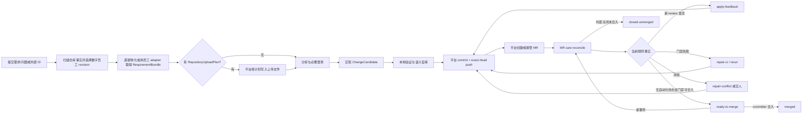

# RFC-310 · 规则驱动的研发数字员工与 MR 生命周期看护（产品视角）

> 技术设计见 [design.md](./design.md)，任务分解见 [plan.md](./plan.md)。
>
> 状态：**In Progress（2026-08-18 用户批准 D1–D12 并授权实现；实现前四项裁决见 design.md §19）**。
>
> 架构总纲：[RFC-294](../RFC-294-backend-layered-target-architecture/proposal.md)。
> 可复用底座：[RFC-304](../RFC-304-code-capability-platform/proposal.md)、
> [RFC-308](../RFC-308-unified-task-git-commit-exclusions/proposal.md)、
> [RFC-309](../RFC-309-capability-template-unification/proposal.md)。

## 0. 摘要裁决

本 RFC 把 `/code` 从“若干可单独起跑的代码能力”改造成一名**规则驱动的研发数字员工**：

1. 用户提交需求、问题或其外部系统 ID；
2. 平台先取得仓库事实，并按可选 sourceKey、仓库 assignment 与已发布规则选择一套数字员工精确 revision；
3. 平台再用该员工 pin 的 adapter 程序化取得完整需求材料，之后持续取得 MR 与流水线门禁事实；
4. Agent 只在被点名的能力边界内理解、写代码或做语义审查；
5. 平台独占 Git、代码托管、流水线重试、评论与 MR 写操作；
6. 平台持续处理新反馈、红流水线和冲突，使 MR 保持“随时可由 committer 合入”；
7. 平台**绝不自动合入、绝不自动批准**，只跟踪到 committer 在外部系统完成合入。

RFC-304/309 的**上层产品模型被替换**，但其已验证底座不推倒重写：固定且版本化的阶段合同、nonce
envelope、同会话重试/新会话重跑台账、任务执行内核、MR lease、发布意图、source-control 的
candidate/commit/publish 与 `.agent-workflow` 排除规则继续复用。

一句话概括新边界：

> **规则决定做什么、何时做、用哪套能力；Agent 只完成规则已经点名的认知或编码动作；平台验证事实并执行一切有权限的副作用。**

## 1. 为什么 RFC-304/309 不是目标产品

[RFC-304](../RFC-304-code-capability-platform/proposal.md) 已把五条能力跑通，
[RFC-309](../RFC-309-capability-template-unification/proposal.md) 已把模板与流程统一；问题不是“它不能运行”，而是它
表达的业务对象不对。

| 当前模型                                                                      | 目标模型                                                                | 当前模型造成的后果                                       |
| ----------------------------------------------------------------------------- | ----------------------------------------------------------------------- | -------------------------------------------------------- |
| `mr-review / mr-comment-fix / requirement / ci-fix / mr-monitor` 五条并列能力 | 一名数字员工的一条 `DevelopmentMission`                                 | 同一需求、同一 MR 被拆成多个工作项，生命周期无法天然贯通 |
| 仓库 × 能力矩阵，每格只选一个模板                                             | 仓库选择一套数字员工；数字员工内部按事实路由 Java/C++ 等 ActionTemplate | 无法表达“这名员工会 Java、C++，并会按模块选择”           |
| `mr-monitor` 是第五条能力                                                     | Mission reconciler 是常驻生命周期引擎                                   | “监视”被当成可执行动作，而不是所有动作的调度者           |
| `arbitrate` / `select` 脚本决定下一能力和 Agent                               | 声明式规则产生唯一 `NextDecision`                                       | 决策藏在任意脚本里，平台无法预演、解释或静态验证         |
| 需求正文和多文档直接塞进输入对象                                              | 外部 ID 经适配器物化成不可变多文件 bundle                               | 外部引用目前无法取回，大材料也不适合进入 DB/prompt       |
| 门禁只有 `status/runId/rawLogRef`                                             | 自建门禁适配器产出 exact-head、完整性和本地证据 bundle                  | 无法表达门禁不完整、多个 gate、大日志和自研系统细节      |
| Agent 输出 envelope，但工作区与 Git 权限仍沿用普通任务                        | AgentAttempt 有显式输入、输出、工作区和 Git 权限合同                    | 输出格式可控，不等于执行边界可控；失败也未必恢复原现场   |
| 固定三轮 CI campaign                                                          | 每类动作有规则化预算、退避、解除条件                                    | 不同项目、错误类型和责任边界无法按业务配置               |

因此，本 RFC 不是给现有五个能力再加几个表单，而是重建它们上方的业务抽象。

## 2. 六条产品宪法

### 2.1 决策只能来自规则

- Mission 下一步做什么、动作优先级、选哪名数字员工、选哪份 ActionTemplate、是否重试、何时交人，全部由版本化规则计算。
- 规则只能读取平台程序化取得、带 revision 与 digest 的 typed facts。
- Agent 不得返回“下一步调用哪个能力”“换哪个 Agent”“是否推送”“是否重跑流水线”等调度决定。
- 规则无匹配、事实不完整或多义配置一律显式阻断，不让 Agent 猜。

这里的“规则驱动”锁的是**业务动作与副作用选择**，不是假装 AI 的代码理解本身是确定性程序。Agent 可以在已选定
Action 内决定如何理解和修改代码，也可以输出 capability contract 预先声明的闭集认知事实；这些结果必须先经 schema/
semantic validator 固化为带 provenance 的 receipt，之后规则才能读取。Agent 不能输出 template/action/effect id，
其自由文本也不能成为 predicate。确定性承诺是“同一 frozen facts + policy 得到同一决策”，不是“同一自然语言每次
必然得到相同代码”。

### 2.2 程序优先，Agent 只做不可程序化的工作

程序负责：外部材料下载、仓库识别、模板选择、状态采集、分类映射、优先级、去重、Git、门禁执行、发布、重试计数、readiness 计算与终态跟踪。

Agent 只负责：理解自然语言、分析代码语义、编写业务文件、解释 review 意见、修复无法由程序直接修复的问题、语义自审。

### 2.3 Agent 没有 Git 和外部副作用权限

- Agent 可以按能力合同读取或编辑授权的业务文件；不得 `git add/commit/push/merge/rebase/reset/checkout`，不得改 refs/index/config/object database。
- Agent 不持有代码托管、流水线、SSH、Git credential；不能创建/更新 MR、评论、批准、合入或重跑流水线。
- `commit/push/comment/MR/pipeline retry` 只能由平台 action 执行，并且必须消费已验证 receipt。
- **首版强制机制（2026-08-18 用户裁决）**：不引入 OS 沙箱、只读 Git facade、command broker 或网络管控；边界由
  「prompt protocol block 禁止 + 零凭据/零 Git identity 注入 + 前后快照对拍与事后验证 + 违规整树回退」构成。
  Agent 对 Git metadata / evidence / 受保护路径的写入不被 OS 阻止，但必被检测为 boundary violation：attempt 作废、
  workspace 废弃重建，绝不进入 candidate/commit。OS 级隔离与网络边界列为后续增强，另立 RFC。

### 2.4 Agent 输出必须被 envelope 封死

- 每个 Agent stage 有唯一 nonce、唯一输出 port、exact schema、closed outcome union 和 semantic validator。
- 没有合法 envelope 就没有结果；普通 stdout、解释文字和 Agent 自报“已完成”都不是事实。
- envelope 合法之后，平台仍独立检查真实 diff、Git 元数据、授权路径、门禁结果与外部 head。

### 2.5 Mission 持续到外部终态，但永不自动合入

- `ready-to-merge` 是**非终态**：新提交、新评论、红流水线、目标分支变化都可让它回退到工作态。
- `merged`、`closed-unmerged`、`completed-no-change`、`canceled` 才是终态。
- 无需代码变化时不能伪造 MR：Agent 的 `no-change` 需由程序证据或人工确认，之后才进入
  `completed-no-change`。
- 平台不提供 `merge` / `approve` decision，不向数字员工 adapter 暴露 `mr.merge` / `mr.approve`。
- committer 在代码托管系统审核并合入；平台只负责让 MR 保持可合入并跟踪最终结果。

### 2.6 所有执行都钉住版本和事实

每个 Mission 固定：数字员工 revision、策略 revision、能力合同 version、每次动作的 ActionTemplate revision、需求 bundle revision、仓库基线、MR head、pipeline run 与 evidence digest。配置更新只影响新 Mission；在途 Mission 的升级必须是显式命令并重新评估下游失效面。

## 3. 业务对象

| 对象                      | 定义                                                                                      | 谁能改                                   |
| ------------------------- | ----------------------------------------------------------------------------------------- | ---------------------------------------- |
| `CapabilityDefinition`    | 平台内置、版本化的可执行能力合同：输入、阶段、Agent 权限、输出、验证、失效与副作用边界    | 仅产品代码随 RFC 升版                    |
| `AdapterDefinition`       | 外部系统程序适配：需求取件、门禁采集、日志分类等；只产 typed facts/evidence，不作业务决策 | `scripts:author` + 资源写权              |
| `VerificationProfile`     | 本地 build/test 程序、隔离、超时与证据选择；程序化产生 VerificationReceipt                | profile owner；改程序需 `scripts:author` |
| `ActionTemplate`          | 某项 Agent 能力的具体实现，例如 `change.implement/cpp-cmake@4`                            | 模板资源 owner                           |
| `DigitalEmployeeTemplate` | 一名数字员工的能力包：ActionTemplate 路由、适配器引用、默认策略                           | 模板资源 owner                           |
| `AutomationPolicy`        | 触发、选择、动作优先级、重试、门禁、反馈、冲突、通知和保留规则                            | 策略资源 owner                           |
| `DevelopmentMission`      | 一次需求/问题到 MR 外部终态的业务聚合根                                                   | 平台命令按 authority/OCC 修改            |
| `ActionRun`               | Mission 的一次确定性动作，固定 capability/template/facts/baseline                         | Mission engine                           |
| `AgentAttempt`            | 一次 Agent 会话尝试；同会话重试与 fresh-session 重跑均有独立序号和 receipt                | Task execution + Mission engine          |
| `RepositoryUploadPlan`    | 上传 blob、仓库目标路径、碰撞方式、内容策略与冻结基线前提                                 | 平台从用户输入生成；后续不可变           |
| `ChangeCandidate`         | 平台从上传 seed 与可选 Agent 业务改动的真实工作区推导的候选改动                           | source-control 生成，Mission 引用        |

`CapabilityDefinition` 与 `ActionTemplate` 必须分开：前者定义**能做什么且边界是什么**，后者定义**这套 Java/C++ 员工如何实现它**。模板不能改变能力 schema、阶段顺序、权限、下一动作或合入边界。

## 4. Mission 生命周期



Mission 只允许一个可写 ActionRun。只读分析可以在不可变 snapshot 上并行，但不能让 Java/C++ 两个可写 Agent 同时改同一工作树。

### 4.1 两层 readiness

- `automationReady`：平台已处理当前 head 上所有按策略可自动处理的事项，没有待执行 action、待确认 effect 或未处理反馈。
- `readyToMerge`：在 `automationReady` 之外，程序化收集到的 mergeability 完整、无冲突、required gates 全绿、当前 head 未过期；若代码托管仍要求 committer approval 或人工 resolve，则显示 `waiting_committer`，不能伪报 ready。

`ready-to-merge` 只有在 `readyToMerge=true` 时成立。任何 `unknown/partial/unavailable` 门禁事实都不能当 pass。

## 5. 首批能力目录

### 5.1 程序/适配器能力

| Capability ID             | 作用                                                 | 产物                                  |
| ------------------------- | ---------------------------------------------------- | ------------------------------------- |
| `requirement.materialize` | 平台正文/上传文件 → 规范化并冻结需求与仓库落点       | bundle + optional upload plan receipt |
| `requirement.acquire`     | 外部 ID → 通过 adapter 下载并冻结多文件需求          | `RequirementBundleRef`                |
| `change.seed-uploads`     | 按 RepositoryUploadPlan 把上传 blob 放入业务 overlay | `UploadPlacementReceipt`              |
| `repository.inspect`      | 扫描语言、构建系统、模块、工具链与 contributor 指令  | `RepositoryFactSnapshotRef`           |
| `employee.select`         | 规则选择员工与精确 revision                          | `EmployeeSelectionReceipt`            |
| `mr.collect`              | 主动收集 MR head、mergeability、approval、threads    | `MergeRequestFactSnapshotRef`         |
| `pipeline.collect`        | 调自建程序取得门禁详情并下载大日志                   | `PipelineEvidenceBundleRef`           |
| `policy.decide`           | 固定 guard + 声明式规则计算下一动作                  | `DecisionTraceRef`                    |
| `verification.run`        | 按项目配置执行本地门禁；结果由程序判定               | `VerificationEvidenceRef`             |

### 5.2 Agent 参与能力

| Capability ID         | 工作区权限            | 合法用途                                               |
| --------------------- | --------------------- | ------------------------------------------------------ |
| `requirement.analyze` | read-only             | 理解材料、形成方案或提出澄清问题                       |
| `change.implement`    | edit-business-files   | 首次实现需求/问题                                      |
| `change.review`       | read-only             | 对真实 candidate 做语义自审；不能发布 MR review        |
| `verification.repair` | edit-business-files   | 修复本地验证失败                                       |
| `mr.feedback.apply`   | edit-business-files   | 处理固定 thread revision 的检视意见                    |
| `pipeline.repair`     | edit-business-files   | 读取本地 pipeline bundle 并修失败                      |
| `conflict.repair`     | edit-conflicted-files | 在平台已准备的 merge-conflict workspace 中只改冲突文件 |
| `mr.review.external`  | read-only             | 可选：对外部 MR 产出结构化 findings，发布仍由平台完成  |

### 5.3 平台副作用能力

| Capability ID                   | 唯一 authority                            | 说明                                                           |
| ------------------------------- | ----------------------------------------- | -------------------------------------------------------------- |
| `change.publish`                | source-control                            | prepare/preview/commit/exact-head CAS push；禁止 force push    |
| `mr.ensure`                     | integration code-host adapter             | 创建或查找 MR，幂等绑定 Mission                                |
| `mr.feedback.report`            | integration code-host adapter             | 回帖处理结果；不自动 resolve 人类 thread                       |
| `requirement.questions.publish` | Mission application / requirement adapter | 按 policy 发布不可变 QuestionSet；原渠道使用幂等 effect        |
| `requirement.answers.collect`   | integration requirement adapter           | wake 后主动取得 exact AnswerSet revision，不信 callback 正文   |
| `pipeline.rerun`                | integration gate adapter                  | 仅规则命中的可重试类别和预算内执行                             |
| `pipeline.trigger`              | integration gate adapter                  | required run 缺失且 policy 允许时按 exact head 幂等触发        |
| `mission.readiness.publish`     | Mission application                       | 更新平台内 read model；外部总览评论是另一个 active-mode effect |
| `mission.track-terminal`        | Mission reconciler                        | 观察 merged / closed，绝无 merge action                        |

`mr-monitor` 不再是 CapabilityDefinition。它被 `DevelopmentMissionReconciler` 取代：事件只是唤醒，主动采集才是事实，规则决定下一步。

## 6. 数字员工与策略配置项

### 6.1 DigitalEmployeeTemplate

一套 Java 或 C++ 数字员工至少配置：

- 名称、说明、owner/visibility/ACL、不可变 revision；
- 支持的语言、构建系统、仓库/模块事实 predicate；
- 每项 Agent capability 的有序 ActionTemplate route；
- requirement source adapter 映射（`sourceKey → AdapterDefinition revision`）；
- pipeline gate adapter 映射（provider/repository scope → AdapterDefinition revision）；
- 默认 `AutomationPolicy` revision；
- 可用性检查结果：缺模板、缺 adapter、agent 不可见、合同版本不兼容时逐条列出。

### 6.2 ActionTemplate

可配置：

- capability ID + contract version；
- agent/workgroup exact revision；
- prompt supplement（只能补充领域知识，不能覆盖 protocol block）；
- runtime/profile、skills、MCP、只读参考目录；
- 本能力允许的业务文件路径和受保护路径；
- 本地 build/test profile；
- bounded same-session/fresh-session retry 默认值；
- context assembly 与 evidence 选择规则。

不可配置：stage 顺序、input/output schema、nonce、workspace mode、Git 权限、代码托管权限、semantic validators、下一动作、是否合入。

### 6.3 AutomationPolicy

| 策略组                | 配置项                                                                                                |
| --------------------- | ----------------------------------------------------------------------------------------------------- |
| Mission admission     | 允许的提交来源、仓库范围、外部 ID sourceKey、幂等/重复提交策略                                        |
| Requirement           | 直接/外部入口、上传预算与目标路径类、碰撞/内容默认、source refresh、澄清与 no-change                  |
| 数字员工选择          | 显式选择、repo assignment、repo-group assignment、typed fact rules、无匹配处置                        |
| 动作路由              | capability 内有序 first-match 规则、fallback template、模块/路径/language/build-system predicates     |
| MR care 优先级        | 固定安全 guard 之后，feedback / conflict / CI / self-review 的有序规则                                |
| Feedback              | 哪些作者/线程进入处理、每批上限、最新 revision 规则、需要澄清时回帖策略                               |
| Pipeline              | required gate、complete、缺失时 observe/trigger、失败分类、rerun/fix、exact-head freshness            |
| Conflict              | `repair` 或 `report-only`、最多尝试次数；repair 固定 merge target into source，禁止 rebase/force push |
| Delivery / MR         | 新建或接管已有 MR、目标分支、源分支命名/碰撞、draft、远端 human push 后的重新基线策略                 |
| Verification          | 必需 profile/step、超时/并发/失败证据策略；可执行程序归 VerificationProfile，Agent 自报不作事实       |
| Retry/budget          | Agent/动作/effect 预算、durable backoff/deadline、CI campaign、总 token/时长/提交次数、handoff 条件   |
| Readiness             | required gates、允许的 warning、未处理 feedback 判据；核心安全条件不可关闭                            |
| Notification          | 自动触发静默、人工指令 receipt、总览评论复用、告警升级对象和频率                                      |
| Evidence retention    | RequirementBundle/PipelineBundle/AgentAttempt/ActionRun 的 active 与 terminal TTL                     |
| Configuration upgrade | 新 Mission 默认生效；在途 employee/policy 闭包升级必须显式、预览失效面并原子重新 pin                  |

### 6.4 固定策略，不开放配置

以下不是“默认值”，而是产品宪法：不自动 merge/approve、不让 Agent 改 Git或调用代码托管、不接受无 envelope 输出、不把 unknown gate 当 pass、不对 stale head 发布、不 force push、不自动 resolve 人类 review thread。

预算耗尽、长期外部故障或 source branch 不可写时，policy/用户可把 Mission 切到 `tracking-only`：停止 Agent、Git、
评论与 pipeline 写操作，但继续主动采集 MR/gate/readiness 并跟踪 merged/closed；显式 resume 才恢复自动写。

## 7. 多套数字员工与确定性选择

Java/C++ 不是新的能力 ID，而是同一能力的多个 ActionTemplate：

```text
change.implement
  ├─ java-spring@3
  ├─ java-general@5
  ├─ cpp-cmake@4
  ├─ cpp-bazel@2
  └─ polyglot@1
```

选择分两层：

1. **Mission 建立时选数字员工**：请求显式选择 > repository assignment > repository-group assignment > 员工选择规则。每一级只有一个结果；同级冲突或无 fallback 就阻断。
2. **每次动作选 ActionTemplate**：只在已 pin 的数字员工内，按 capability、模块、changed paths、语言、build system、pipeline category 等 typed facts 依顺序 first-match。

规则有稳定 `ruleId` 和唯一顺序；首条匹配即终止。平台保存 fact digest、匹配 rule、精确 template revision 和完整 decision trace。不存在“让 AI 看一下该用 Java 还是 C++”。

混合仓库按模块 facts 路由；跨模块改动必须命中显式 `polyglot` 模板或阻断。两个可写模板不得并发操作同一 workspace。

## 8. 直接输入、外部 ID、多文件需求和大流水线结果

### 8.1 需求输入

```text
RequirementSubmission =
  direct {
    title,
    body?,
    uploadedFiles[] {
      uploadRef,
      repositoryTargetPath,
      collisionMode?: create-only | replace-existing,
      contentPolicy?: preserve-upload | agent-editable,
      fileMode?: regular | executable
    }
  } // body 与 uploadedFiles 至少一项非空
  | external-reference { externalId, sourceKey? }

DeliveryTarget =
  create-merge-request { targetRef? }
  | adopt-merge-request { mergeRequestRef }
```

`targetRef` 省略时按已 pin policy 解析仓库默认目标分支；分支命名、碰撞和已有 MR 接管都由 Delivery policy
决定，不能由 Agent 自己建分支或选择目标。

界面先选仓库，再以“一个文件 + 一个精确目标文件路径”为一行上传；上传完成显示 blob digest、有效
create/replace、preserve/editable 策略和基于当前 head 的预览。临时上传绑定当前用户并有 TTL，Mission 建立时一次性
原子 claim；preview 与真正 launch 之间 head 变化会在 launch 重验，不能拿旧预览覆盖新内容。

首版直接输入必须完整支持三种形态：只写正文、只上传一个或多个文件、正文加文件。标题必填；正文按统一换行与
编码规范生成 `requirement.md`。每个上传文件必须指定仓库相对目标路径；上传 blob 同时进入只读 RequirementBundle 和
不可变 RepositoryUploadPlan。正文为空且文件为空固定拒绝，不能创建一个没有需求内容的 Mission。
生成的 `requirement.md` 只属于 Agent 输入，不会偷偷提交到业务仓库；若正文也要作为仓库文件，用户必须显式上传并指定
目标路径。

平台按计划把上传文件写入业务 overlay，最终由 source-control 与 Agent 产生的其他改动一起形成 candidate、commit、
push 和 MR。默认 `create-only + preserve-upload`：目标不存在才创建，Agent 不能删除或改写上传内容；用户/策略显式选择
`replace-existing` 时，平台在 admission 冻结目标原 digest，发布前 CAS 对拍，避免覆盖其间的人类修改；显式
`agent-editable` 才允许 Agent 在保留目标路径的前提下继续编辑。多个文件目标路径重复、目标是目录、目标越界或当前
内容与冻结前提冲突都在 Agent 启动前阻断。若目标已是相同 digest，则记录 `already-present`，不制造空 commit。
新文件默认 regular；替换文件默认保留原 mode，只有策略允许且用户显式选择时才设置 executable。

只给 ID 同样是合法入口：`sourceKey` 省略时按 exact repository assignment 的 default source，再按所选员工唯一
default source 解析；多个或没有默认值就显式要求用户选择，不能让 Agent 识别 ID 属于哪个系统。

`requirement.acquire` 通过配置的 RequirementSourceAdapter 取得 source revision、标题、正文、附件/设计文档顺序、回写通道，并物化到：

```text
.agent-workflow/inputs/requirements/<bundleId>/
  manifest.json
  files/...
```

Mission 只持久化 bundle ref、source revision、manifest digest、文件统计和生命周期；不把大正文复制进 DB。Agent prompt 只包含 manifest 路径与数据边界说明，由 Agent 按需读文件。

外部需求变更不会静默替换旧材料。refresh 生成新 bundle revision，并让基于旧 digest 的分析、candidate 和验证失效。
policy 可配置 `manual / auto-before-first-push / auto` refresh；即使是 auto，也先产生新 revision 与失效 receipt，
不能原地覆盖。在原需求系统反问时，adapter 还必须声明 `questions.writeback + answers.collect`，用 question-set
correlation 回收答案；只有回写没有回收能力时，问题只能落平台回答。

### 8.2 流水线证据

PipelineGateAdapter 主动收集自建系统的 required gates、run/job、exact head、完整性与大日志，物化到：

```text
.agent-workflow/pipeline/<bundleId>/
  manifest.json
  logs/...
  reports/...
  artifacts/...
```

大日志不进入 prompt、DB、event 或 envelope。Agent 只读 bundle；平台用 manifest 中的 path、digest、size、media type、redaction 状态和 run/head binding 验证读取边界。

Requirement 与 pipeline 文件都视为不可信数据：禁止 symlink/device/hardlink 逃逸，安全解包，限制文件数/单文件/总字节/嵌套深度，规范化路径，执行 secret redaction；文件内容绝不作为程序或指令自动执行。

## 9. Agent 输入、输出、失败与回退

### 9.1 输入边界

每个 AgentAttempt 只得到：

- Mission/ActionRun 的 opaque ref；
- capability definition 与 ActionTemplate 的精确 revision；
- exact base head、workspace baseline ref、input manifest digest；
- 按能力 allowlist 选择的 requirement/pipeline/feedback/verification artifact refs；
- workspace mode、可写业务路径、只读 evidence roots、受保护路径；
- 唯一 nonce、输出 port、JSON schema 与 outcome 说明；
- 禁止 Git、代码托管与外部副作用的 protocol block。

### 9.2 输出边界

所有 Agent capability 使用 closed outcome：

```text
changed | no-change | needs-information | blocked
```

各能力再声明自己的 payload。例如 feedback action 必须逐条覆盖输入的 thread revision；`needs-information` 必须带结构化 questions；`changed` 只能描述意图，真实 changed paths/diff 由平台计算。

### 9.3 验证顺序

1. nonce 与唯一 envelope；
2. 唯一 port、JSON、exact schema；
3. capability semantic validator；
4. Git metadata、evidence roots、受保护路径和 symlink 边界；
5. outcome 与真实 workspace 一致性；
6. 由平台生成 `ChangeCandidate`。

典型拒绝：`changed` 但 diff 为空、`no-change` 但业务文件变化、`needs-information` 却留下改动、声称处理不存在的 thread revision、修改 `.agent-workflow/pipeline` 或 Git index。

### 9.4 重试与现场回退

- 协议/schema/semantic 错误：把精确错误反馈给**同一 session**，最多 N 次；保留上下文与当前 workspace。
- N 次仍失败：销毁 session 和整个 action workspace，从 `AgentAttemptBaseline` 重新物化相同代码、相同 evidence digests、相同模板 revision；新 session 使用新 nonce，不继承旧 session 错误。
- Git/权限/受保护路径边界违规：立即杀 session、废弃 workspace，直接进入 fresh-session 恢复，不在已受污染的 session 继续。
- fresh session 最多 M 次；耗尽后 Mission 进入 `blocked(agent-contract-exhausted)`，不 commit、不 push。
- daemon 重启把悬挂 attempt 结算为 `interrupted`，恢复 exact baseline 后才可继续。

## 10. Authority 与权限

- `development-missions:launch/read/interact/cancel/retry/handoff/attach/resume/upgrade`：Mission 操作；`interact` 覆盖选择
  需求源与提交澄清答案，`upgrade` 只授权在途配置升级命令；每次仍按当前 actor 重授权。
- `digital-employees:*`、`action-templates:*`、`automation-policies:*`：三类资源独立 ACL。
- `adapter-definitions:*` 之外，写 executable/secret mapping 仍需 `scripts:author`；但 adapter 只得到声明的 secret projection，不再继承 daemon 全环境。
- Agent 资源可见性在 Mission admission 与每次 action freeze 时重验；在途 action 使用 frozen revision，不能因模板被换掉而漂移。
- Mission internal continuation 使用 family-scoped effect capability + mission lease/epoch，不伪造 SystemActor。
- integration 只向本 bounded context 暴露 closed `DevelopmentCodeHostAction`，明确排除 `mr.merge`、`mr.approve`、`thread.resolve` 与 generic `custom`。

## 11. 能力影响清单

本 RFC 会收缩或改名既有能力，按仓库强制门槛逐项呈报：

| 既有能力/概念                                       | 变化                                         | 用户可见影响                                               | 迁移                                                                    |
| --------------------------------------------------- | -------------------------------------------- | ---------------------------------------------------------- | ----------------------------------------------------------------------- |
| 五条 capability + 每能力一个 WorkItem               | 替换为一条 DevelopmentMission + 多 ActionRun | `/code` 不再让用户逐能力起孤立轮次                         | 历史只读；active anchor 由 cutover reconciler 接管                      |
| `mr-monitor` capability                             | 删除为配置项/模板项                          | 不再有“监视器模板”；所有 Mission 默认被生命周期看护        | 监视配置迁为 AutomationPolicy                                           |
| `arbitrate` / `select` 任意脚本                     | 删除决策权                                   | 用户改为可预演的声明式规则                                 | 能机械映射的默认优先级迁移；自定义脚本需人工改写规则                    |
| 任意 stage pre/post hook 可写工作树、注入数据、中止 | 收缩为固定 `adapter` extension point         | 不能在任意阶段插入 daemon 脚本                             | entry/collect/classify 等迁成 typed AdapterDefinition；其余导出迁移报告 |
| `capability_templates` 一份模板实现一项能力         | 重命名/迁为 `ActionTemplate`                 | 模板列表按动作组织，并被 DigitalEmployeeTemplate 组合      | 尽量保留 id、ACL、upstream relation 与 agent/prompt 字段                |
| 仓库 × 能力矩阵单选模板                             | 改为仓库/组 assignment 选择数字员工 + 策略   | 不再维护五个格子；看到一名员工的整体 readiness             | 生成一份迁移草稿，冲突/缺项明确标红，不静默猜                           |
| 固定三轮 CI campaign                                | 改为规则预算                                 | 默认迁移为 3，但可按类别配置                               | 迁入 policy revision                                                    |
| 冲突只报告                                          | 增加可选 `conflict.repair`                   | 默认建议启用“merge target into source”；可配置 report-only | 新能力，不自动启用旧配置                                                |
| Agent 继承普通任务 Git 可达性                       | no-Git profile：检测+回退（首版无 OS 阻断）  | Agent 中依赖 Git 写操作的旧 prompt/hook 会触发违规回退     | readiness 预检 + 违规检测/回退测试；平台承担所有 Git                    |
| 通用 code-host action string                        | 收缩为 closed 数字员工 action union          | 数字员工永远无法调用 merge/approve/custom                  | 源码负扫描与 action catalog 测试                                        |

RFC-304/307/309 保持 `Done` 作为历史交付事实；RFC-310 只声明它们的**产品上层被取代**，不会篡改历史状态。

## 12. 用户故事

1. **直接写需求或上传文件。** 我可以只写正文；也可以上传一个或多个文件，并为每个文件指定例如
   `docs/spec.md`、`src/config/default.json` 的目标路径。平台先形成可预览的 placement plan，再把文件与 Agent 产生的
   其他改动一起 commit/push；默认保持上传字节不被 Agent 改写。
2. **只给一个需求 ID。** 我在已选仓库的任务入口提交 `REQ-1042`，不再上传正文或附件；Java 数字员工调用内建系统 adapter，把正文、接口文档和验收附件下载为多文件 bundle，分析后不清楚兼容范围，就在原渠道或平台反问。回答后继续，不要求我重新上传材料。
3. **同一套系统有 Java/C++ 员工。** 仓库事实显示改动落在 CMake 模块，规则命中 `cpp-cmake@4`；另一个 Spring 模块命中 `java-spring@3`。活动页能看到命中的 ruleId 与 facts，不是 Agent 自己选的。
4. **Agent 写代码但不碰 Git。** Agent 只编辑业务文件并输出 envelope；平台验证真实 diff、跑门禁、创建 candidate，随后由 source-control commit/push。Agent 即使尝试 `git commit`，也会被前后快照对拍检测为违规、现场整树回滚并 fresh-session 重跑，其 Git 写不会进入任何 candidate。
5. **流水线日志很大。** 自研门禁 adapter 把 2 GB 编译日志下载并整理进 `.agent-workflow/pipeline/<bundleId>/`，prompt 只给 manifest。修复 Agent 按需读相关日志；平台按 run/head/digest 判断结果，绝不把截断日志当完整事实。
6. **reviewer 提意见后自动跟进。** 新 thread revision 唤醒 Mission；规则选择 feedback 模板，Agent 修改代码，平台验证/提交/推送并回复结果。thread 仍由 committer 决定是否 resolve。
7. **MR 一度 ready 又变红。** 平台显示 `ready-to-merge`；目标分支更新造成冲突后状态回退，规则选择 conflict repair。修复并重新过门禁后再次 ready。最终 committer 合入，Mission 记录 `merged` 终态。
8. **接管已有 MR 或无需改动。** 用户可指定已有 MR，让 Mission 从其当前 head 开始看护；若需求经程序证明
   已满足，则以 `completed-no-change` 结束，不创建空 commit/空 MR。已关闭 MR 后来 reopen 时建立链接的新 Mission
   generation，不篡改旧终态历史。

## 13. 目标与非目标

### 13.1 目标

- 从直接正文、上传文件、正文加文件或外部 ID 到一个持续维护的 MR，形成单一 Mission 生命周期。
- 决策可配置、可预演、可解释、可回放；同 facts + 同 policy revision 得到同 decision。
- 支持多套 Java/C++/polyglot 数字员工和能力级路由。
- 自建需求系统、流水线系统通过 typed program adapter 接入。
- 大材料落本地 evidence bundle，Agent 按需读，平台持久化 ref/digest 而非大正文。
- Agent no-Git/no-code-host，输出/工作区/重试/回退均有可执行合同。
- MR 保持 ready，跟踪到 merged；绝不自动 merge/approve。

### 13.2 非目标

- 不让 Agent 自由规划工具链、创建新能力或改变 Mission 状态机。
- 不允许用户任意重连 CapabilityDefinition 的阶段图。
- 不把构建日志或需求附件全文塞进数据库、event、WS 或 prompt。
- 不用 Agent 判断 pipeline status、mergeability、head freshness 或权限。
- 不自动解决人类 review thread，不代替 committer 审核。
- 不管理主干流水线，不向 main 直接推修复。
- 本 RFC 设计批不实现任何生产代码。

## 14. 验收标准

### 14.1 规则与模板

- **AC-1** 同一 fact snapshot + policy revision 重放 100 次得到 byte-identical decision 与 trace；不存在 Agent 参与的 action/employee/template selection。
- **AC-2** Java、C++、polyglot 三套员工可并存；同一 capability 可有多份 ActionTemplate，first-match 选精确 revision。
- **AC-3** 无规则匹配、同级 assignment 冲突、模板缺能力、adapter 不兼容均在 admission/decision 阶段显式阻断。
- **AC-4** 配置变更不影响在途 Mission；显式升级会列出被失效的 action/candidate/evidence。

### 14.2 输入与证据

- **AC-5** 首版同时支持正文-only、文件-only、正文+文件、外部 ID 四种入口，并统一生成
  `.agent-workflow/inputs/requirements/<bundleId>/`。直接输入要求正文或文件至少一项非空；外部 ID 可省略
  `sourceKey`，唯一 binding 自动 pin，多结果通过 typed source-selection command 回收选择；四条路径的 manifest
  顺序、revision、digest 均可回放。
- **AC-6** 自建门禁 adapter 能把大日志物化到 `.agent-workflow/pipeline/<bundleId>/`；Agent prompt 不含日志正文。
- **AC-7** bundle 拒绝 traversal/symlink/device/超预算/未知 codec；Agent 对 requirement/pipeline roots 只有只读权限。
- **AC-8** pipeline snapshot 与 exact head 绑定；采集前后 head 改变、partial/unknown/unavailable 均不判 pass。

### 14.3 Agent 边界

- **AC-9** 每个 Agent stage 都有 nonce、唯一 port、exact schema、closed outcome、semantic validator；无合法 envelope 不产生 action result。
- **AC-10** 同会话收到精确错误后重试 N 次；耗尽后整个 workspace/session 从 exact baseline 重建并 fresh-session 重跑 M 次。
- **AC-11** `git add/commit/push/merge/rebase/reset/checkout`、Git metadata 写、evidence 写、受保护路径写均被前后快照
  对拍检测为 boundary violation：attempt 作废、workspace 整树回退、绝不产生 candidate/commit；负向测试覆盖检测与回退
  （首版不承诺 OS 级写阻断，见 §2.3）。
- **AC-12** Agent 不可取得代码托管/流水线/Git credential；任何 Agent 自报 changed files/tests/commit 都由平台事实覆盖。
- **AC-13** 相对 AgentAttemptBaseline 的 `changed + empty delta`、`no-change + dirty delta`、
  `needs-information + edits`、错误 feedback revision 均被拒绝；action-level no-change 不吞掉 baseline 中尚待发布的 upload seed。

### 14.4 发布、看护与终态

- **AC-14** 只有 source-control participant 能 prepare/commit/push；push 使用 exact remote-head CAS，禁止 force push。
- **AC-15** 数字员工 code-host action union 编译期不存在 `mr.merge`、`mr.approve`、`thread.resolve`、`custom`。
- **AC-16** feedback、CI、conflict 三类新事实按固定 guard + policy 决策，单 Mission/MR 同时最多一个可写 ActionRun。
- **AC-17** `ready-to-merge` 可因新评论、head、gate、target branch 变化回退；MR merged 后进入终态且不再启动动作；
  若合入时仍有未满足上传落点，终态如实标记 `upload-unfulfilled`，不能把外部合入等同于任务成功。
- **AC-18** 平台从不自动 resolve 人类 thread；只回帖处理 receipt，committer 保留最终审核权。
- **AC-19** daemon 在 Agent、commit、push、外部 comment 的任一临界点崩溃后，reconcile 不重发已完成副作用、不丢失未完成副作用。

### 14.5 RFC-294 与迁移

- **AC-20** `code-capability` 上层迁为 `development-automation` bounded context；新增代码按 domain/application/engine/ports/infrastructure/public/composition 落位。
- **AC-21** 跨 context 只走 exact public/required-port 合同；除经 codec 铸造的仓库相对业务目标外，public DTO 无
  DbClient、host/absolute path、credential、AbortSignal、raw log/body 或 open record。
- **AC-22** TaskEngine → WrapperRuntime → NodeExecutor → ExecutionKernel 保持唯一执行链；数字员工不直接 spawn Agent。
- **AC-23** active legacy work items 在 cutover 时 cancel/drain、按外部真相建立 Mission；历史 rounds/attempts 可只读追溯且没有双 writer。
- **AC-24** migration/cutover/rollback、正向与所有能力收缩分支均有测试；完整 `bun run gate:local` 与真实 system-mock E2E 通过。

### 14.6 功能闭环

- **AC-25** Mission 可确定性新建 MR 或接管 active/terminal MR；目标/源分支、碰撞和 human push 都有 typed receipt，
  CAS 失败后从新 remote head 重建 action，不覆盖人类提交；已 terminal 的 MR 只记录终态，不启动动作。
- **AC-26** 澄清在平台或原需求系统均可闭环；QuestionSet 发布与 AnswerSet 收集都是 closed decision/effect，原系统
  通道用 correlation 收集 exact answer revision，重放不会重复提问或错配答案。
- **AC-27** 混合仓不出现“先选语言模板还是先分析模块”的循环：repo 级选 polyglot employee，通用分析产生经
  repository catalog 校验的 affected-module facts，再由规则选择 Java/C++/polyglot action template。
- **AC-28** `no-change` 不直接相信 Agent；有程序证据/人工确认才能进入 `completed-no-change`。closed MR reopen
  创建链接的新 generation，旧 terminal Mission 不复活。
- **AC-29** rule 读取 unknown/stale fact 得到 indeterminate 并先 collect/wait/block，不能当 false 落入后续规则；
  多评论/多 gate/多 failure 由程序生成有序 `WorkSelectionReceipt`，Agent 不挑工作项。
- **AC-30** ActionTemplate compatibility 只做约束，DigitalEmployee route 是唯一模板 selector；运行时使用完整 pinned
  policy，不做多层字段 merge。在途 employee/policy 闭包只能经带失效预览的 configuration upgrade 原子替换。
- **AC-31** required pipeline run 缺失时按 policy `observe-only | trigger-if-missing`；trigger/rerun 都绑定 exact head、
  有幂等 receipt 和独立预算，不会永久静默等待或重复触发。
- **AC-32** Mission 有正交 `active | tracking-only` automation mode；handoff 请求立即 fence 新写，已 dispatch/未知结果的
  effect 先 reconcile 后再进入 tracking-only；仍更新 facts/readiness/terminal。尚无 MR 时可校验并 attach 人工创建的
  MR，resume 显式重算后才写。
- **AC-33** transient adapter/runtime/effect wait 持久化 `resumeAt + wake conditions + attempt ordinal`；daemon 重启后
  继续相同 backoff，永久/权限/配置失败给出确定 remediation，不形成内存定时器死角。
- **AC-34** cancel 请求立即 fence 新写，已 dispatch effect 先按外部真相结算；它不关闭 MR、不删分支、不撤销已发布
  commit。adopt existing MR 在 admission 证明 source branch 可写，否则拒绝自动模式或明确 tracking-only。
- **AC-35** 每个直接上传文件都绑定规范化仓库相对目标路径，并生成 immutable RepositoryUploadPlan。平台按 frozen
  baseline 应用 create/replace CAS；上传文件进入真实 ChangeCandidate 和最终 commit。`preserve-upload` 下 Agent 改删文件
  会被拒绝，`agent-editable` 仍要求目标路径存在；相同 digest 不制造空 commit。首次 publish receipt 明确标记 seed 已被
  commit 吸收，后续 MR care 不重复应用计划；Git mode/ignore/filter 不得让 entry 漏失或不可还原，push 成功但回执丢失
  可从 remote tree 补账而不重复提交。

## 15. 本轮请求批准的设计决策

批准 RFC-310 表示接受以下目标，不表示授权实现：

- **D1**：用 `DevelopmentMission` 取代“五条能力各自一个 WorkItem”，`mr-monitor` 降为 Mission reconciler。
- **D2**：用声明式、typed、first-match 规则取代 `arbitrate/select` 脚本的业务决策权。
- **D3**：保留固定 CapabilityDefinition；ActionTemplate 与 DigitalEmployeeTemplate 分层，Java/C++ 是模板路由而非新能力 ID。
- **D4**：Agent 一律 no-Git/no-code-host；平台从真实 workspace 生成 ChangeCandidate 后才 commit/push。
- **D5**：需求与 pipeline 外部程序成为 typed AdapterDefinition，只写分配的 bundle root、只得到声明的 secret projection。
- **D6**：`ready-to-merge` 非终态；平台不暴露 merge/approve/resolve/custom action，生命周期只观察到 committer 合入。
- **D7**：冲突修复成为可选能力；启用时只允许“把目标分支 merge 进源分支”，禁止 rebase/force push，旧配置默认仍为 report-only。
- **D8**：active RFC-304 work items 在一次性 cutover 中由新 Mission 接管；不让 v1/v2 同时写同一 MR。
- **D9**：Mission delivery 同时支持平台新建 MR 与接管已有 MR；合法无改动以 `completed-no-change` 终结，
  closed MR reopen 建链接的新 generation，不复活旧终态。
- **D10**：automation mode 与业务状态正交；handoff 先 fence 并 reconcile 已 dispatch effect，再进入 `tracking-only`
  持续跟踪；必要时可校验挂接人工创建的 MR，只有显式 resume 才恢复自动写。
- **D11**：required pipeline 缺失可按 policy 幂等触发；所有退避等待持久化，daemon 重启不重置预算或遗失唤醒。
- **D12**：直接上传文件不仅是 Agent 只读附件；每个文件必须指定仓库目标路径，并由平台按 RepositoryUploadPlan 写入
  业务 overlay，随其他改动一起 commit/push。默认 create-only、保持上传字节，覆盖或允许 Agent 编辑都必须显式声明；
  首次 publish 后 seed 被 commit 吸收，MR 后续动作只跟踪 lineage，不重复落盘。

实现必须在本 RFC 获得用户显式批准后才能开始。
