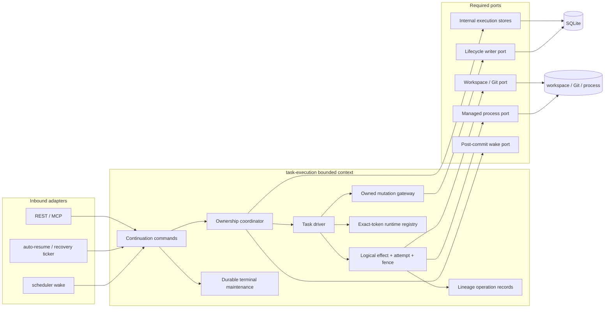
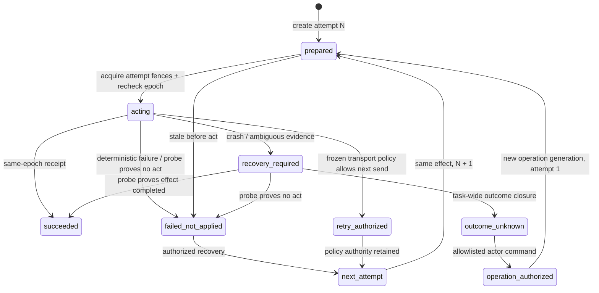

# RFC-328 详细设计：持久化任务执行所有权与 fencing

> 状态：Done（production）；用户已批准 [`proposal.md`](./proposal.md) 的 D1～D12、能力影响 1～12 与 [`code-host-recovery-matrix.md`](./code-host-recovery-matrix.md)。
> 落地证据：主实现 `650ced2528fcf16c48e1743127394463ca747dc5`，修复链收口于 `6af560df7`；包含二者的 `5c762c19715f167a8796bf08d661ad9c43b4349f` 已由 CI `32998902223` 与 visual `32998902239` 验绿。本次文档收口已获用户授权发布；其自身的远端与 CI 结果由发布流程核验，不在提交内递归自证。
> 架构位置：RFC-294 N2 / P0-D；本 RFC 不领取 W2 的解环或目录迁移 credit。

## 1. 一句话设计

把“可以继续驱动 task”收敛成 `task-execution` bounded context 内唯一的一条持久事实：worker 必须先通过 durable intent 取得单调递增的 `OwnershipToken`，之后所有 execution-plane 数据库写入与 task-owned FS/Git/process/非幂等 outbound 动作都用该 token 做 fail-closed fence；进程内 registry 只保存 exact token 对应的 handle，不再拥有授权语义。

## 2. 现状证据与问题边界

### 2.1 三套既有机制没有共同线性化点

| 机制                           | 当前用途                                 | 当前边界                                    | 本 RFC 处理                                 |
| ------------------------------ | ---------------------------------------- | ------------------------------------------- | ------------------------------------------- |
| `InMemoryTaskDriverSupervisor` | 防本进程重复 driver、signal/await handle | daemon 重启后丢失；stop 仅按 `taskId`       | 降格为 exact-token runtime registry         |
| `services/driverLease.ts`      | auto-resume/repair/reconcile 的本地互斥  | 人工路径不 acquire；进程外不可见            | 删除生产授权用途，迁入 durable owner/intent |
| `tasks.status` CAS             | scheduler claim、resume/retry 的先手锁   | status 是业务状态，不证明外部 writer 已停止 | 继续表达 lifecycle，不再表达 ownership      |

源码基线中的关键事实：

- `packages/backend/src/services/driverLease.ts:1-19` 明示它是 in-process safeguard，人工 resume/retry 不 acquire，完整原子性仍需要 ownership epoch。
- `packages/backend/src/services/scheduler.ts:740-751` 仍用 `pending → running` CAS 充当 driver claim。
- `packages/backend/src/services/task.ts:269-291` 的 attach 只对拍状态、source fence 与进程内 registry。
- `packages/backend/src/services/task.ts:3297,4181,4797,5713` 附近存在四条独立 kick/attach 路径。
- `packages/backend/src/services/runner.ts:1728-1746` 吞掉 PID receipt 写库错误，健康 child 继续运行。
- `packages/backend/src/services/execution/managedProcess.ts:316-345` 在 durable spawn receipt 之前即可向 child 写 stdin，且 `onSpawned` 是 optional best-effort callback。
- `packages/backend/src/db/schemaAdmission.ts:159-218` 已对 migration receipt 做 fail-closed prefix 校验；新 binary 升级过的数据库会让缺少该 migration 的旧 binary 因 extra receipt 拒绝启动，不需另造降级旗标。

### 2.2 本 RFC 关闭什么

本 RFC 只关闭一个 correctness 缺口：**同一 task 的多个 continuation 或旧/新 daemon 交叠时，谁有权写、谁有权执行外部动作，以及接管需要什么证据。**

它不试图顺手重写 scheduler、workflow runtime、human gate 或全站 background registry。入口仍可暂时位于 legacy `services/*`；但入口只能调用本 RFC 的 application use case，不能再自行拼 status CAS、Map 与 side effect 形成第二套 authority。

### 2.3 Current cutover denominator（T0）

第一轮设计门把原先只看 FS/Git/process 的分母纠正为以下六族；这是请批前的 source inventory，不是实现完成后的 machine ledger：

| 族                                 | current source evidence                                                                                                                                                                      | P0-D 归类                                                                         |
| ---------------------------------- | -------------------------------------------------------------------------------------------------------------------------------------------------------------------------------------------- | --------------------------------------------------------------------------------- |
| continuation / driver kick         | `services/task.ts` 的 start/resume/retryRepoPreparation/retryNode 四点（基线约 `:3297/:4181/:4797/:5713`），`services/scheduler.ts:627-751` 的 runTask/status claim                          | 全部 command→intent→claim；不得保留第五条 direct run                              |
| auto / recovery / terminal control | `services/driverLease.ts:1-25` 四类 auto op，`autoRepair.ts`、`autoKill.ts`、`orphanReconcile.ts`、`shutdown.ts:24-73`，`modules/task-execution/application/applySourceTerminationEffect.ts` | intent/control/recovery-proof；不再以 Map/status授权                              |
| execution DB writer                | `services/lifecycle.ts`、`nodeRunMint.ts`、`task.ts`、`scheduler.ts`、`runner.ts`、question/review continuation、recovery、`taskDelete.ts:160-252` 与 GC/retention                           | `worker-epoch / control-revision / recovery-proof / terminal-maintenance` 四分法  |
| process / runtime                  | `services/execution/managedProcess.ts:316-345`、`agentProcess.ts:111-181`、`runner.ts:1705-1746`、`scriptRun.ts:445-495`                                                                     | process logical effect + pre-activation + exact receipt/reap                      |
| workspace / Git / publication      | `task.ts` materialization/repo-prep/rollback、`isolatedAgentRun.ts:45-82,201-289`、`nodeIsolation.ts`、`taskWriteLocks.ts:1-34`、commit/push、`taskDelete.ts:257-285` 与 workspace GC        | logical effect +真实多资源 set；delete/GC 属 terminal maintenance                 |
| managed outbound mutation          | `scheduler.ts` 的 code-host call（基线 `:4459` 已警告 duplicate POST，`:4597` 附近实际调用/事后 receipt）及 daemon直接调用的 code-host/integration/source-control mutation ports             | binding-level recovery class + record-before-act；unknown response不跨 effect继续 |

inherited child 的真实磁盘边界由 `scheduler.ts:4169-4202` 证明是借用父 call-node iso；sibling merge对 canonical root 的共同写由 `isolatedAgentRun.ts:258-289` 的 current shared `writeSem` 证明。故 fence 不能只按 task root，也不能只按 iso identity，必须是多资源集合。

code-host分母也不能只写成“评论/合并”：`packages/shared/src/codeHost/actions.ts:29-84`当前有29个action，其中`custom`可提交任意`GET/POST/PUT/PATCH/DELETE`；`services/codeHost/call.ts:88`当前把`GET/PUT/PATCH/DELETE`用于网络/5xx传输重试，`:684`又对所有method的429遵守Retry-After，`scheduler.ts:4469`明确保留人工retry node。用户已钉死“功能远大于安全、不得随便加安全策略”，因此本RFC必须逐provider binding登记可恢复语义、记录每次真实send并保留manual retry，而不能用一刀切`no-replay`删除现有能力或声称所有outbound都exactly-once。

设计时的 canonical seed 是 842 个 mutation entrypoint / 2 个 node-run insert site 与 231 个 transaction callback；hosted containing SHA `5c762c197` 的落地报告为 900 / 2 / 245，并把四类 authority、task-owned effect 与 corresponding guards 归入同一 canonical 生成链。当前 `main` 经 RFC-331～333 后为 924 / 2 / 263；后续增长归后续波次，不改变 T26/T27 已闭合、未另造平行手抄 JSON 的结论，也不把 W2 topology cut credit 记给本 RFC。

## 3. 目标架构与模块边界

### 3.1 组件图



入口只提交 continuation 或 control command；只有 ownership coordinator 能铸 token；只有 driver 持有 token；数据库 mutation 与外部 effect 各自通过一个窄门验证 token。图中的 `Lifecycle writer port` 是过渡期对既有 lifecycle 实现的 required port，不代表 `task-execution` 反向 import legacy service。

### 3.2 建议物理落位

本 RFC 在现有 `packages/backend/src/modules/task-execution/` 内增加以下职责；最终文件名可在实现期按仓内命名规范微调，但 owner 与依赖方向不能改变：

```text
modules/task-execution/
├── domain/
│   ├── ownership.ts              # token、状态、typed result；零 IO
│   ├── executionIntent.ts        # canonical intent kind/state
│   ├── executionEffect.ts        # operation family/generation + monotonic attempt
│   ├── terminalMaintenance.ts    # tree claim / retained cleanup state
│   └── executionLineage.ts       # retained family watermark / actor replay decision
├── application/
│   ├── commands/
│   │   ├── submitContinuation.ts # 授权后写 intent；不执行外部动作
│   │   ├── claimTaskExecution.ts # intent + owner 单事务 claim
│   │   └── recoverTaskExecution.ts # proof-before-takeover
│   ├── withOwnedTaskTx.ts        # DB execution write 唯一门
│   ├── executeOwnedEffect.ts     # record-before-act + multi-fence + receipt
│   └── ports/                    # 仅本模块 internal repository/store ports
│       ├── taskOwnershipStore.ts
│       ├── taskExecutionIntentStore.ts
│       ├── taskExecutionEffectStore.ts
│       └── terminalMaintenanceStore.ts
├── engine/
│   └── task/                     # TaskDriver / TaskExecutionContext owner
├── infrastructure/
│   ├── sqliteTaskOwnership.ts
│   ├── sqliteTaskExecutionIntent.ts
│   ├── sqliteTaskExecutionEffect.ts
│   ├── sqliteTerminalMaintenance.ts
│   ├── inMemoryTaskRuntimeRegistry.ts
│   └── cross-context-adapters/
│       ├── lifecycle-adapter.ts
│       ├── workspace-source-control-adapter.ts
│       ├── managed-runtime-adapter.ts
│       ├── code-host-adapter.ts
│       ├── recovery-audit-adapter.ts
│       └── task-wakeup-adapter.ts
├── public/
│   ├── commands.ts               # external continuation/control commands
│   ├── participants.ts           # provider-facing exact participant
│   └── types.ts                  # safe result/error；无 token factory
├── composition/
│   └── required-ports.ts         # lifecycle/workspace/runtime/code-host/audit/wakeup SPI
└── composition.ts                # module factory / lifecycle；唯一 bootstrap 调用点
```

过渡期 `services/task.ts`、`services/scheduler.ts`、`services/runner.ts` 与 `services/execution/*` 是 inbound consumer或 exact provider adapter：它们可以接 exact `public/{commands,participants,types}.ts` 暴露的 use case，或在 `infrastructure/cross-context-adapters/*` 实现 `composition/required-ports.ts` 的一个最小 SPI，但不能 import `domain/*`、SQLite adapter 或 owner factory。`application/ports/*` 只留本域 internal stores；workspace/source-control/runtime/code-host/lifecycle/audit/wakeup 等跨 context SPI 绝不落在那里。W2 再把 orchestration 主体搬入四级 execution chain；本 RFC 不用目录移动掩盖 authority 未收敛。

### 3.3 允许跨边界公开的最小 surface

exact public files 只允许导出：

- `submitTaskContinuation(command)`；
- `cancelOwnedTask(command)` / source-terminal control use case；
- `wakePendingTaskIntents(reason)`；
- `recoverTaskExecutions(reason)`；
- 不含 ownerId/epoch 的 typed command result/error。

不得公开：

- `mintWorkerIdentity`、`mintOwnershipToken`；
- owners/intents/effects/attempts/maintenance/lineage-operation-record 的 raw store；
- `withOwnedTaskTx` 的裸 transaction handle；
- runtime registry；
- 接受 caller-supplied ownerId/epoch 的任何 production constructor。

`TaskExecutionModule` 的 factory/lifecycle 类型只在 `composition.ts`，required SPI 只在 `composition/required-ports.ts`；不从 public surface 反向暴露装配能力。这一物理形状逐字对齐 RFC-294，而不是沿用当前 root `ports/` 或单一 `public.ts` 的过渡结构。

## 4. 词汇、能力类型与不变量

### 4.1 私有能力类型

以下是语义草图，不要求逐字作为最终 TypeScript：

```ts
declare const workerIdentityBrand: unique symbol
declare const ownershipTokenBrand: unique symbol
declare const ownedTaskTxBrand: unique symbol
declare const exclusiveDaemonLockProofBrand: unique symbol
declare const claimAttachPermitBrand: unique symbol

interface WorkerIdentity {
  readonly ownerId: string
  readonly daemonGeneration: string
  readonly [workerIdentityBrand]: true
}

interface OwnershipToken {
  readonly taskId: string
  readonly ownerId: string
  readonly daemonGeneration: string
  readonly epoch: number
  readonly leaseUntil: number
  readonly [ownershipTokenBrand]: true
}

interface TaskExecutionContext {
  readonly token: OwnershipToken
  readonly intentId: string
  readonly signal: AbortSignal
}

interface OwnedTaskTx {
  readonly taskId: string
  readonly epoch: number
  readonly revision: number
  readonly [ownedTaskTxBrand]: true
}

interface ExclusiveDaemonLockProof {
  readonly daemonGeneration: string
  readonly acquiredAt: number
  readonly lockReceiptDigest: string
  readonly [exclusiveDaemonLockProofBrand]: true
}

interface ClaimAttachPermit {
  readonly gateGeneration: string
  readonly [claimAttachPermitBrand]: true
}
```

brand 与 factory 都留在 module 内；测试使用显式 test fixture factory，生产 adapter 无法从 JSON/string 构造能力。

### 4.2 九条核心不变量

1. **Authority uniqueness**：一个 task 最多一行 owner，且只有 `state='claimed'` 的 current epoch 有写权限。
2. **Epoch monotonicity**：epoch 从 1 开始，只增不减；release、cancel、failure 后也不删除/reset owner row。
3. **Intent-before-worker**：任何 start/resume/retry/auto/recovery 都先提交 intent，再由 worker claim；request thread 永不先做 execution side effect。
4. **DB fence in the same transaction**：不能先在一个 transaction 验 token，再在另一个 transaction 写领域表。
5. **Effect record-before-act**：task-owned FS/Git/process/非幂等 outbound 动作必须先落 stable logical effect与单调 attempt，再由该 attempt原子竞争全部真实资源 fence并重验 token。
6. **Timeout is suspicion, not proof**：lease expiry 只使任务进入 recovery candidate；没有 stop/reap/probe 证据就不能发下一 epoch。
7. **Unknown needs authority, not permanent prohibition**：远端结果未知不等于“未发生”；自动恢复只能由确定性probe收编。task-wide closure在全部sibling execution静默后写replay decision；actor-authorized manual retry可审计后创建下一operation generation与attempt 1，不能用永久quarantine删除功能。
8. **Maintenance claims before IO**：archive/delete/retention/GC必须在任何移动/删除/导出外部资源前持久claim完整成员集；只在最终transaction重验谓词不是互斥协议。
9. **Operation continuity follows causal lineage**：每个settled family都在同事务推进retained generation watermark，故parent retry、新child与cascade在live effect已删除后仍从最高代次继续；unknown generation另由同一ledger中的replay decision约束。无actor的auto不能静默越过unknown，manual retry与独立新root都是可审计的新授权，不做provider-object全局猜测。

### 4.3 四类 mutation authority

不是所有 task 相关数据写入都由 worker 发起。实现必须把 writer 明确分成互斥的四类，不能用 optional token 混用：

```ts
type ControlRevisionAuthority =
  | {
      subtype: 'continuation-admission'
      expectedTaskRevision: number
      command: ContinuationCommandKind
    }
  | {
      subtype: 'terminal-control'
      expectedTaskRevision: number
      control: 'cancel' | 'source-terminal'
    }
  | {
      subtype: 'gate-control'
      expectedTaskRevision: number
      expectedGateRevision: number
    }
  | {
      subtype: 'membership-control'
      expectedTaskRevision: number
      expectedMembershipRevision: number
    }
  | {
      subtype: 'daemon-shutdown'
      expectedTaskRevision: number
      expectedOwnerRevision: number
      exactDaemonGeneration: string
    }
  | {
      subtype: 'recovery-candidate-revoke'
      expectedOwnerRevision: number
      exactOldOwner: {
        taskId: string
        ownerId: string
        daemonGeneration: string
        epoch: number
      }
      lockProof: ExclusiveDaemonLockProof
    }

type TaskMutationAuthority =
  | { kind: 'worker-epoch'; ownedTx: OwnedTaskTx }
  | { kind: 'control-revision'; control: ControlRevisionAuthority }
  | {
      kind: 'recovery-proof'
      proof: VerifiedTakeoverProof | VerifiedStopProof | VerifiedOutcomeUnknownClosure
      expectedOwnerRevision: number
      exactOldEpoch: number
    }
  | {
      kind: 'terminal-maintenance'
      claim: TerminalMaintenanceClaim
      expectedClaimRevision: number
      operation: 'archive' | 'delete' | 'retention' | 'workspace-gc' | 'repair-metadata'
    }
```

- `worker-epoch` 覆盖 driver 产生的 task/node/run/output/effect receipt。
- `control-revision`不是一个可任意写的兜底，而是上述discriminated subtype的总和。精确写面如下：
  - `continuation-admission`只允许lifecycle expected-revision CAS、canonical intent/event以及selected replay-decision authorization/binding；不得claim owner、settle effect或写attempt/hold；
  - `terminal-control`只允许task/node terminal transition、active intent terminalize、owner exact `claimed→revoked`、decision return与event append；
  - `gate-control`只允许既有gate/lifecycle revision、门答案与由该答案合法产生的canonical continuation intent；它本身不能授权unknown replay；
  - `membership-control`只允许既有membership与相关lifecycle revision写面，不得触碰owner/effect；
  - `daemon-shutdown`只允许本daemon generation的task interrupted、intent terminalize/authorization suspend、owner exact `claimed→revoked`、event，以及把exact既存active process attempt标为recovery-required并记录bounded unresolved evidence；不得创建新effect/attempt/hold或successor epoch；
  - `recovery-candidate-revoke`只允许在branded `ExclusiveDaemonLockProof`、从owner row重读的exact old owner tuple与revision均匹配时把old-generation owner `claimed→revoked`并append bounded recovery event；它不要求new daemon伪造旧`OwnershipToken`，也不得写task/node lifecycle、intent、effect/attempt/hold或直接takeover。
- `recovery-proof`是module内私有、一次性的branded capability，并进一步分型：`VerifiedTakeoverProof`只在exact stop/reap与全部effect-specific deterministic probes证明可继续后铸造，可结算旧代并推进新epoch；`VerifiedStopProof`只做revoke→released；`VerifiedOutcomeUnknownClosure`是**task-wide quiescence proof**，绑定exact owner revision、全部unresolved effect/attempt/hold、active node-run与runtime handle集合及digest。它先撤权并stop/await全部本地执行面；只有所有handle/process stopped、所有非unknown sibling terminal、待收口unknown attempts与其exact holds集合冻结且未漂移时才可铸造。closure transaction随后原子写unknown attempt/effect、插入lineage replay decision、释放proof中的exact holds、终止本轮task/intent并release owner；closure本身不创建recovery intent/epoch，但不剥夺之后actor-authorized manual retry。
- `terminal-maintenance` 只接受已经持久化、覆盖完整成员集的 `TerminalMaintenanceClaim`；claim transaction 已逐task证明 owner released/absent、unresolved attempt=0并冻结task/owner/topology revision，任何外部IO和最终写都对拍 exact claim revision。裸 expected count不是authority。

任何 writer 既不属于其中一类，或`control-revision`无法归入上述exact subtype，守卫立即失败；不设 `authority?: ...` 兼容默认值。manifest必须同时证明四个顶层kind穷尽writer denominator、每个control subtype的producer存在且write allowlist/revision predicate未越界。

## 5. 持久模型

实现时迁移号必须从当时 `origin/main` 的最新 journal 重新分配；当前基线最新为 `0209`，文中的 `0210` 仅是占位符。

### 5.1 `task_execution_owners`

| 列                                        | 语义                                                              |
| ----------------------------------------- | ----------------------------------------------------------------- |
| `task_id` PK/FK                           | 一个 task 恰好零或一行；零表示从未 claim                          |
| `owner_id`                                | bootstrap factory 生成的 opaque attempt ID                        |
| `daemon_generation`                       | 进程启动时生成，区分重启前后                                      |
| `epoch`                                   | 单调正整数；首次 claim=1                                          |
| `state`                                   | `claimed / revoked / released / recovery-required`                |
| `lease_until`                             | 当前 owner 的存活承诺；不是 takeover 许可                         |
| `revision`                                | owner 行每次 fence/heartbeat/state mutation 单调推进              |
| `last_heartbeat_at`                       | 诊断与恢复候选排序                                                |
| `recovery_code` / `recovery_proof_digest` | bounded code与最近确定性 proof摘要；不存 stack/secret/raw payload |
| `updated_at`                              | 诊断                                                              |

索引至少覆盖 `(state, lease_until)`。四态语义严格区分：

- `claimed`：current epoch 可写；
- `revoked`：写权已失效，但 stop/reap/probe 尚未证明资源释放；
- `released`：exact handle/process 已停、所有 effect 已结算，才允许新 claim或 terminal maintenance；
- `recovery-required`：旧执行面是否停止或效果结果仍不确定，禁止普通claim/delete/GC；等待确定性takeover probe，或先做task-wide outcome-unknown closure。closure后manual retry可重新授权，阻断不是永久安全策略。

normal release/cancel 都不删除行；下一次合法 claim 在同一行写新 owner并令 `epoch = epoch + 1`。owner `released` 的定义是 exact handle/process已停、所有 effect attempt terminal且所有 hold released；任一 sibling仍 acting/recovery-required时都不能 release。task tree只有先取得 §5.6/5.7 durable maintenance claim，才可进入 archive/delete/GC外部IO或最终transaction。

### 5.2 `task_execution_intents`

| 列                                                     | 语义                                                                                                                                    |
| ------------------------------------------------------ | --------------------------------------------------------------------------------------------------------------------------------------- |
| `id` PK                                                | continuation identity                                                                                                                   |
| `task_id` FK                                           | 所属 task                                                                                                                               |
| `kind`                                                 | `launch / resume / retry-repository-preparation / retry-node / sync-workflow / gate-continuation / recovery`                            |
| `state`                                                | `pending / claimed / completed / canceled / failed`                                                                                     |
| `source`                                               | bounded `rest / mcp / scheduler / auto / boot / internal`                                                                               |
| `request_hash`                                         | canonical request 的稳定 hash，防同 operation key 异载荷                                                                                |
| `payload_json`                                         | versioned、size-bounded、无 secret；只放 node/run reference 等最小输入                                                                  |
| `execution_lineage_id` / `continuation_slot_key`       | root task稳定lineage与本次call/retry/cascade的因果slot；child从parent intent继承，不由客户端提交                                        |
| `slot_path_json` / `operation_generation`              | 从root到本continuation的immutable ancestor-slot path与本次业务重跑代次；同时落内部task/node-run列，retry不能用新taskId重算              |
| `replay_authorization_id` / `authorization_scope_json` | 仅D11 allowlist的actor command生成；记录selected slot/cascade/frontier与digest，proof-backed recovery successor可继承，普通auto不能自造 |
| `expected_task_revision`                               | command admission 时绑定的 lifecycle revision                                                                                           |
| `claimed_epoch`                                        | 该 intent 的 claim 证据；不可由客户端提交                                                                                               |
| `failure_code`                                         | bounded failure/recovery code                                                                                                           |
| timestamps                                             | created/claimed/completed/updated                                                                                                       |

建立 partial unique index：同一 task 在 `state IN ('pending','claimed')` 时至多一行。intent 的业务输入 immutable，只有 state/claim/failure/timestamps 可变。

command transaction在插入intent前同时检查active maintenance member与`(execution_lineage_id,slot-path prefix)`将触达的全部lineage operation records：replay decisions决定unknown是否需actor，generation watermarks与仍存live effects共同决定每个selected family的highest/next generation。auto/recovery命中`requires-actor`时返回typed conflict且不迁移lifecycle；D11 allowlist内actor command铸一个`replay_authorization_id`，一次枚举selected scope全部decision，在同一transaction把它们推进`actor-replay-authorized`、绑定新intent/authorization并记录actor/source/expected revision，少一项或任一revision漂移则整笔失败。普通actor retry即使scope内没有unknown、甚至child/live effect已经hard delete，也用同authorization让selected target/cascade从`max(live effect, retained watermark)`推进到下一operation generation，不能去重已成功下游或把generation重置为0。崩溃owner对应的claimed intent不会原地伪装成“从未执行”：恢复coordinator在证明旧attempt/handle安全后，以同一个takeover-proof transaction把旧intent terminalize为`failed(owner-lost)`、把其零attempt的bound decisions原子rebind到继承同authorization的recovery intent，再推进epoch。无法证明可继续时绝不由actorless auto创建active recovery intent；若满足task-wide outcome-unknown closure，只终止本轮intent/task并release，等待manual decision，否则owner/attempt保持`recovery-required`。

### 5.3 `task_execution_effects`

| 列                                                                       | 语义                                                                                                                                                                                  |
| ------------------------------------------------------------------------ | ------------------------------------------------------------------------------------------------------------------------------------------------------------------------------------- |
| `id` PK                                                                  | 跨 intent/epoch稳定的 logical-effect identity                                                                                                                                         |
| `task_id` / `origin_intent_id` / `current_intent_id`                     | 当前归属、最初命令与当前 recovery/continuation                                                                                                                                        |
| `operation_key`                                                          | task内稳定logical operation key；同一未知/恢复动作必须复用                                                                                                                            |
| `execution_lineage_id` / `operation_family_key` / `operation_generation` | 跨parent/child重建稳定的causal identity；不含taskId/nodeRunId这类retry会变化的值。generation从0开始；普通actor retry scope可对known outcome +1，unknown outcome还必须消费D11 decision |
| `kind`                                                                   | `workspace-prepare / workspace-rollback / isolation-create / isolation-merge / repository / process / workspace-cleanup / code-host-mutation / outbound-mutation`                     |
| `request_hash`                                                           | 规范化、去 secret 的动作摘要                                                                                                                                                          |
| `state`                                                                  | logical `open / succeeded / failed / outcome-unknown`                                                                                                                                 |
| `last_attempt_no`                                                        | 本operation generation已分配最大attempt；只能由probe/convergent recovery或已批准transport policy单调+1                                                                                |
| `receipt_json`                                                           | logical outcome的versioned、bounded、redacted摘要；含aggregate result、applied attempt与`prior_ambiguity_count`，不得把success写成exactly-once                                        |
| `failure_code`                                                           | bounded code                                                                                                                                                                          |
| timestamps                                                               | prepared/acting/settled/updated                                                                                                                                                       |

唯一约束与 identity 规则：

- `(task_id,operation_key,operation_generation)` unique；`(execution_lineage_id,operation_family_key,operation_generation)` global unique。recovery换intent/epoch仍复用同一effect；D11 actor command为selected scope授权`max(live effect generation, retained family watermark)+1`，故parent retry重建child或普通cascade重跑known/succeeded下游都创建新effect；unknown family另须exact decision/authorization。live-effect unique与watermark revision CAS共同保证旧child与新child不能并发创建或在hard delete后复用同generation；
- 同 operation key 的 request hash immutable；不同 hash fail closed，不覆盖旧 row；
- root launch时生成`execution_lineage_id`并落内部task列；每个call/fan-out slot把`H(parentSlot,workflowRevision,stableNodeKey,frozenOccurrenceKey)`及从root开始的ordered ancestor slot path持久化到intent/task/node-run，effect再用`H(slot,effectKind,stableActionOrdinal)`得到operation family key。retry必须复制原durable slot/occurrence mapping，不能从新taskId/nodeRunId重新算；独立root才生成新lineage；
- 同一业务generation的probe/convergent/transport retry复用原effect并创建下一attempt；D11 allowlist内manual retry/resume/sync为selected scope创建下一operation generation。retry-node cascade必须给target与每个将重跑的known/succeeded下游加代；current wrapper canceled/interrupted revival是continue而非restart，保持同generation。结果未知不能借新intent/taskId绕过decision；
- logical effect无论结算为`succeeded / failed / outcome-unknown`，settle transaction都必须以expected record revision CAS upsert §5.8的`generation-watermark`，令`highest_settled_generation=max(old,current)`并保存last outcome/request/slot-path digest与soft anchors；effect terminal row与watermark不能一成一败。generation已低于watermark或同generation digest不一致均为invariant violation；
- `outcome-unknown`是该operation generation的terminal，不持有resource fence；同一transaction既推进上述watermark，又插入§5.8 retained replay decision。它不是`failed-not-applied`的同义词；actor manual continuation不重开旧row，而是在authorization下创建`operation_generation+1`的新effect并保留全部unknown历史；
- `current_intent_id`与`last_attempt_no`只能由claim/recovery transaction推进，origin不改。

`receipt_json` 可保存 PID/PGID、spawn binary fingerprint、workspace HEAD/index digest、worktree identity、provider object ID/marker、probe 结果等非敏感证据；绝不保存 token、环境变量、credential、prompt 或完整命令行。

### 5.4 `task_execution_effect_attempts`

| 列                                                                   | 语义                                                                                                                   |
| -------------------------------------------------------------------- | ---------------------------------------------------------------------------------------------------------------------- |
| `id` PK / `effect_id` FK                                             | 一次真实act的稳定identity与所属logical effect                                                                          |
| `attempt_no`                                                         | 对同effect从1开始严格递增；`UNIQUE(effect_id,attempt_no)`                                                              |
| `intent_id` / `epoch`                                                | 发起该attempt的intent与owner epoch                                                                                     |
| `state`                                                              | `prepared / acting / succeeded / failed-not-applied / retry-authorized / recovery-required / outcome-unknown`          |
| `candidate_id` / `request_hash`                                      | 本次真实send/act所用candidate与canonical request；fallback也逐candidate成独立attempt                                   |
| `recovery_class` / `classifier_version` / `transport_policy_version` | 该attempt冻结的binding/effect恢复与重试合同，不能跟随后来manifest静默漂移                                              |
| `application_evidence` / `retry_authority`                           | `applied/definitely-not-applied/ambiguous`及`none/probe/convergent/transport-policy`；允许下一send不等于上一send未发生 |
| `receipt_json` / `failure_code`                                      | versioned、bounded、redacted attempt证据                                                                               |
| timestamps                                                           | prepared/acting/settled/updated                                                                                        |

同一effect在`prepared/acting/recovery-required`中至多一个attempt。probe证明`definitely-not-applied`时，可把旧attempt写`failed-not-applied`并在同一recovery transaction分配`attempt_no+1`；convergent recovery与matrix允许的现有transport retry也逐send分配下一attempt，并把旧attempt写`retry-authorized`及exact authority。`retry-authorized`只表示“产品合同允许继续发”，不把`application_evidence=ambiguous`洗成未发生；effect settle必须汇总本operation generation的全部attempt。若later attempt明确`applied`，保持current成功结果，同时在effect receipt保留`prior_ambiguity_count>0`，只是不承诺exactly-once；若没有任何applied evidence且旧ambiguity也未被exact/state probe收编，later明确失败仍只能把本operation generation收口为`outcome-unknown`。只有全部attempt均definitely-not-applied时才可结算failed-not-applied。actor-authorized manual continuation创建下一operation generation的attempt 1，旧effect/attempt/holds永不重开、覆盖或改写。

### 5.5 `task_execution_effect_fences`

一个外部动作可能同时触及多个资源：isolation merge既写自己的 iso evidence，也写 canonical root；inherited child真正借的是父 call-node iso，不是父 task root。单个复合字符串无法表达资源集合的交集，因此使用独立 hold 表：

| 列                            | 语义                                     |
| ----------------------------- | ---------------------------------------- |
| `effect_attempt_id` FK        | 本次真实act；历史attempt各有自己的hold行 |
| `fence_key`                   | canonical resource identity              |
| `acquired_epoch`              | 哪个 owner epoch持有                     |
| `acquired_at` / `released_at` | durable hold窗口                         |

`(effect_attempt_id,fence_key)` unique，并对 `fence_key WHERE released_at IS NULL` 建 partial unique。attempt在同一SQLite transaction内按lexicographic order校验完整资源集、插入全部新hold、再转`acting`；任一key冲突则整个transaction rollback，不能先拿一半后等待。settle/recovery同事务只释放exact attempt的holds，旧epoch/旧attempt不能更新新attempt。历史hold不可重新激活或覆盖，消除stale-release ABA。精确多资源集保留sibling isolation各自在独立iso中执行的并行度，只在它们真正进入共同canonical merge root时串行。

### 5.6 `task_execution_maintenance_claims`

该表无`tasks` FK，因hard delete后仍要承载cleanup/recovery。主要字段：opaque `id`、`root_task_id`、`operation`、`state=claimed/io-complete/db-finalized/cleanup-pending/completed/recovery-required`、`member_set_digest`、`expected_tree_digest`、单调`revision`、versioned `cleanup_plan_json`与timestamps。cleanup plan只含完成物理清理所需的validated internal path/resource refs与redacted digests，不含credential/token；不得写日志。

claim transaction先枚举完整cascade task set或workspace真实owner set，重读每个task的lifecycle/parent topology、owner revision与unresolved attempt计数，再插入claim。外部IO只能由持有不可序列化`TerminalMaintenanceClaim`的worker执行。archive的tmp/final目录、hard-delete后的FS/Git cleanup、workspace GC phase均作为claim state machine的可恢复步骤；daemon重启按exact claim继续。

### 5.7 `task_execution_maintenance_members`

| 列                 | 语义                                                   |
| ------------------ | ------------------------------------------------------ |
| `claim_id` FK      | 所属maintenance claim；claim自身不随task删除           |
| `task_id`          | 冻结成员ID；刻意无task FK，删除后仍可恢复cleanup/audit |
| expected revisions | task/lifecycle/owner/topology revision与ledger digest  |
| `released_at`      | claim完成/放弃后的成员释放时间                         |

`(claim_id,task_id)` unique，并对`task_id WHERE released_at IS NULL`建active partial unique。任何continuation或重叠maintenance admission都先检查该索引；claim先赢则continuation返回`task-terminal-maintenance-conflict`+opaque claim reference，continuation先赢则maintenance claim transaction因owner/intent/revision不符零写。最终delete/archive/GC transaction必须匹配exact claim revision、完整member set与每个expected revision，不能只检查root。

### 5.8 `task_execution_lineage_operation_records`

这是无task FK的retained discriminated ledger，`record_kind`只有两类；一张表既承载所有settled family的代次连续性，也承载unknown generation的actor decision，避免hard delete把known与unknown两条恢复语义拆散：

1. **`generation-watermark`**：每个`(execution_lineage_id,operation_family_key)`恰好一行（partial unique），保存`highest_settled_generation`、last outcome/request hash/slot-path digest、root/ancestor/current anchor task IDs（soft refs）、单调record revision与timestamps。每个logical settle必须在同一transaction CAS推进它；下一generation严格取live effects与该watermark共同最大值+1。watermark不是“禁止再执行”的安全标记，它只防generation在child/effect删除后倒退或复用。
2. **`replay-decision`**：每个`(execution_lineage_id,operation_family_key,operation_generation)`至多一行（partial unique），保存request digest、provider/object redacted coordinate、bounded failure code、`state=requires-actor/actor-replay-authorized/actor-replay-authorized-suspended/consumed`、decision revision与timestamps。它另保存source task/effect/unknown-attempt IDs、initiating/current-bound intent ID与new effect ID、`replay_authorization_id`、actor/source、authorization scope digest与authorized next generation；所有ID都是soft refs，schema禁止FK。

两类row都保存`continuation_slot_key`、ordered immutable`ancestor_slot_path_json`及digest，以及compact causal tombstone需要的family/generation/outcome/actor摘要；不存body/token/secret。task-wide outcome-unknown closure与logical effect generation `outcome-unknown`在同一transaction推进对应watermark并插入`requires-actor` decision。对`(execution_lineage_id,record_kind,state)`等查询面建索引；D11 command先按lineage取watermark与未决decision，再以slot path prefix匹配selected node/cascade/frontier。这样`P→C→G`删除C/G后，P的call-slot既可精确命中G的unknown decision，也能让known/succeeded family从retained `N`创建`N+1`；不能退化为全lineage授权，不能把new child当fresh绕过，也不能把generation重置为0。

D11 allowlist内actor command一次枚举selected scope覆盖的全部`requires-actor` decisions，在同一command transaction铸`replay_authorization_id`、将它们CAS为`actor-replay-authorized`并绑定initiating intent；普通known/succeeded operation family也由同authorization/scope读取watermark获得下一operation generation，但不创建虚假decision。worker claim后，effect prepare transaction以exact authorization + expected watermark revision（unknown时再加exact decision revision）创建`max(live,watermark)+1`的新effect与attempt 1，再把对应decision写`consumed`并记录new effect ID；任一步失败整笔rollback。

`terminalizeIntentTx`是所有cancel/source/shutdown/recovery/normal-terminal路径共用的必经窄门：它枚举exact current-bound且未consumed decisions并纳入事务/proof digest。有proof-backed recovery successor时，零新attempt的decision原子rebind successor并保留同authorization；daemon-shutdown暂时没有successor时转`actor-replay-authorized-suspended`，只允许boot按既有auto-resume policy或下一次同scope manual command恢复同authorization，不得扩scope；cancel/source-terminal/normal-unused等明确无successor路径则退回`requires-actor`并append bounded authorization-unused audit。若对应next-generation attempt已经存在而decision仍未consumed，事务不得继续terminalize，owner进入invariant-violation/recovery-required。多decision scope允许已consume项保持consumed，但每个未consume项必须逐行rebind/suspend/return，不能在第一项后崩溃留下partial dangling state。完全独立root生成新lineage，因此不命中旧decision。

### 5.9 FK、retention、schema admission 与降级

owners、intents、effects、effect_attempts、effect_fences按顺序以task/effect FK cascade清理；hard delete前必须按family枚举全部settled effects，逐一证明`lineage_operation_records`的watermark存在、`highest_settled_generation`覆盖该family最大代次且request/slot digest一致；unknown另须retained replay decision/recovery tombstone，并把任何bound-but-unconsumed authorization退回`requires-actor`。maintenance claims/members、lineage operation records及现有`recovery_events`都不以task FK级联；record里的source/bound/new-effect/anchor IDs逐列断言为soft ref，禁止直接或间接cascade/RESTRICT FK。任一settled family缺watermark或watermark落后时，hard delete transaction必须零写，不能用删除live rows掩盖账本缺口。

maintenance cleanup完成后可按独立retention清理claim/member。lineage operation records采用correctness retention而非年龄retention：只要`continuation_anchor_task_ids`任一task仍存在且其现有manual入口可继续该lineage，watermark完整slot mapping、`requires-actor`与两种authorized decision不得GC；authorized/suspended还必须先按§5.8 terminalize规则reconcile。所有anchor消失且审计期限满足后，consumed decision与无anchor watermark才能**原位compact**掉diagnostic payload，但唯一causal key、highest settled generation、slot-path digest、generation/outcome/actor digest与compacted marker永久保留，防ABA；不物理delete key tombstone。其DB增长上限是每个settled operation family一条watermark、每个unknown generation一条decision，而不是每attempt/body一条永久记录。archive按§12.2带走相关lineage operation ledger，hard delete后live DB仍保留上述correctness row/tombstone。migration测试必须逐条断言FK、retention与compact方向，而不是只验证table存在。

本仓的 migration-history preflight 会拒绝 binary 不认识的 extra migration receipt。因此升级后用旧 binary 打开同一数据库会在 daemon admission 阶段失败，符合 D9。回滚路径是：停 admission/daemon，保留升级后数据库作取证，恢复升级前备份；不能删 migration receipt 或手改 journal 让旧 binary 勉强运行。

## 6. Worker identity 与 composition root

### 6.1 两级 identity

- `daemonGeneration`：每次 daemon bootstrap 生成，沿用/收敛当前 `services/daemonGeneration.ts` 的进程级 ULID 事实；测试由 clock/id factory 注入。
- `ownerId`：每次 claim attempt 由 `WorkerIdentityFactory` 生成，并绑定 daemon generation。它不是用户 ID、request ID、PID，也不从 env/body/header 恢复。

`OwnershipToken` 只能来自 SQLite owner adapter 成功返回的 claim row；先在内存造 token、后尝试写库是禁止路径。

### 6.2 每 daemon 单 module 与 closable claim gate

daemon bootstrap 是 `TaskExecutionModule` 的唯一 owner：

- 每次 daemon 只允许构造一个 module；重复 production construction fail fast；
- `createApp`、scheduler、auto/recovery ticker、source-terminal、shutdown 都只借用 bootstrap 注入的同一实例，不能各自 new registry/store coordinator；
- module 暴露 `dispose()` / `awaitIdle()` 给 bootstrap，不从 public command surface 暴露；
- test composition 显式 `createTaskExecutionTestModule`，并用 module ID canary 证明 HTTP/background/recovery/shutdown观察同一实例；
- process-local registry、claim gate 与 daemon generation 同 module生命周期，DB client仍由 application transaction显式传入/绑定，不藏进 ambient global locator。

module 内有一个 closable `TaskClaimGate`。每条 worker path在任何durable claim写入前取得不可外造的`ClaimAttachPermit`，permit覆盖“准备claim → durable claim提交 → exact registry attach成功，或claim被显式补偿/stop闭合”的整个窗口；claim成功后permit绑定exact token与owner revision。shutdown `seal()` 后新进入者立即拒绝；已经进入者必须完成attach/补偿后退出，`awaitIdle()`才返回。

同一module还维护按exact token索引的sticky stop tombstone。cancel/source/shutdown的`requestStop`先原子写tombstone，再查询handle并返回绑定该token/permit generation的ticket：stop先提交时，后续`tryAttach`在permit内重读owner state/revision并看到tombstone，必须拒绝attach或立即关闭传入handle；attach先提交时，ticket精确signal已登记handle。`awaitStopped`必须同时等待该exact permit drained、attached/rejected handle closed与effect/process reap/probe，不能把“snapshot时还没有handle”当作停止证明。这样shutdown与terminal control都不会漏掉暂停在pre-claim或post-claim/pre-attach的worker，同时没有引入task-wide process串行。

### 6.3 启动顺序

daemon composition root 的顺序固定为：

1. 获取既有 daemon PID lock；
2. 打开数据库并完成 migration/schema admission；
3. 唯一构造 daemon generation、TaskExecutionModule、claim gate 与 adapters；
4. 运行 boot ownership/effect/process reaper；
5. 执行wake-loss/orphan补偿：pending/running task转`interrupted`时同事务终止其active intent；旧intent不被无依赖地盲claim，manual或已启用的auto-resume再走正常command path提交fresh intent；
6. 才开放 HTTP/MCP admission，随后启动 scheduler 与 maintenance tickers。

boot recovery 未完成前不能让新 request 通过另一条 legacy kick 抢先启动任务。

## 7. Intent 提交与 claim 协议

### 7.1 Command transaction

Replay authorization是具名业务语义，不能写成`actor != null`：

| command/source                                     | 授权scope                                                    | 规则                                                                        |
| -------------------------------------------------- | ------------------------------------------------------------ | --------------------------------------------------------------------------- |
| actor `retry-node`                                 | 用户点选node；`cascade=true`时含冻结的downstream slot prefix | 授权known/succeeded重跑generation+1；命中unknown decision还须全量CAS        |
| actor `retry-repository-preparation`               | exact prep operation                                         | 只授权prep，不外溢到code-host/node后续                                      |
| actor manual `resume`                              | 当前failed/interrupted frontier及其既有可达continuation      | 可以授权该frontier的unknown；不能重跑已完成且不在frontier的分支             |
| actor manual `sync-workflow`                       | 新snapshot中从同步continuation可达、且能映射到旧slot的scope  | changed/new slot按新业务generation；removed slot的decision不自动consume     |
| fresh `launch`                                     | 新root lineage                                               | 不命中旧decision，无需replay authorization                                  |
| gate/clarify/question answer、cancel、source event | 无                                                           | 即使有actor也不能解释成远端重放同意                                         |
| scheduler/auto/boot/recovery/internal wake         | 无新授权                                                     | 可继承proof-backed既有authorization继续同一actor command，不能自造或扩scope |

`execution-effect-outcome-unknown`写入既有task/node failure detail与REST/MCP safe diagnostic，明确“远端结果未知，继续可能重复动作”；UI沿用现有retry/resume/sync control显示该提示，不新增确认弹窗或wire必填字段。用户在看到该终态后再次发出上表具名manual command即是显式授权。

`submitTaskContinuation`以`control-revision/continuation-admission` subtype在一个 `dbTxSync` 内执行；该subtype的expected revision与允许表必须覆盖下面每一步，不能借一个裸control capability写其他execution表：

1. 读取并校验 actor/source authorization；
2. 读取当前 task/node/gate lifecycle revision，绑定为 internal expected revision；
3. 从durable task/node slot-path列与retained lineage operation records解析root lineage、selected scope；对每个operation family读取watermark与live effect，冻结`next=max(live,watermark)+1`及expected record revision，并检查active maintenance member。只有上表allowlist actor command可铸authorization并把selected unknown decisions全量原子绑定待创建intent；普通known operation也据scope加代，即使其child/live effect已hard delete，其他路径不可；
4. 验证该 command 对当前业务状态合法；
5. 以 expected revision 做 lifecycle CAS；
6. 插入 canonical intent，利用 partial unique 解决并发；
7. append 既有 lifecycle/event 证据；
8. commit 后只发送 best-effort wake。

wake 丢失不丢任务：boot 与 bounded ticker 都从 `pending` intent 扫描。HTTP/MCP 不能在 commit 后直接调用 legacy `runTask` 绕过 claim。

并发 loser 的规则必须稳定：

- 若 active intent 的 `request_hash` 与本请求一致，返回 idempotent winner reference；
- 若不同，返回 typed `task-continuation-conflict`（REST 409；MCP 映射为同一 safe code）；
- 两种 loser 都不得执行 rollback/reap/mint/spawn。

### 7.2 Initial claim

worker 在单事务内：

1. CAS `intent pending → claimed`；
2. 若 owner row 不存在，insert epoch=1/state=claimed；
3. 若 owner row 为 released 且 task 仍可继续，update epoch+1/new identity/state=claimed；
4. 若 owner 为 claimed/revoked/recovery-required，或task是active maintenance member，initial claim失败；
5. 把返回的 exact row包装成 `OwnershipToken`。

intent claim 与 owner claim 不能拆事务；任一步失败均零 token。

### 7.3 Recovery claim

`recovery-required` 不能由普通 claim 离开。recovery coordinator先在transaction外完成exact stop/reap与每个unresolved effect attempt的deterministic probe。若能证明可继续，铸不可序列化、一次性的`VerifiedTakeoverProof`；proof绑定task、exact old owner/epoch/revision、全部effect/attempt/hold/handle/node-run及bound lineage-operation-record ID/kind/revision、receipt hash与采样时间。

随后在**一个** `dbTxSync` 内：

1. CAS exact old owner revision且 state 为 `revoked|recovery-required`；
2. 重读所有 unresolved effects/attempts/holds、active node-run与old intent bound-operation-record集合，逐项对拍proof digest，任何新增/漂移则rollback；
3. 按probe结论settle/adopt，或把`definitely-not-applied` attempt写`failed-not-applied`并为同effect分配下一attempt；释放的只能是proof中的exact旧attempt holds；
4. 预分配继承原`replay_authorization_id/scope`的 recovery intent ID；通过§5.8 `terminalizeIntentTx` terminalize旧claimed intent，并把零attempt、未consume decisions原子rebind该successor；已有attempt却未consume则rollback并转invariant recovery；
5. 插入并校验上述 recovery intent；
6. 写新 WorkerIdentity、`epoch+1/state=claimed` 并把 recovery intent claim到新 epoch；
7. 返回新 token。

若本operation generation没有任何definitive applied evidence，且至少一个attempt返回`unknown-final`或早期transport attempt仍保留未被probe收编的`application_evidence=ambiguous`，coordinator先CAS owner为revoked/recovery-required，向exact token请求task-wide stop并await全部handles；再逐项probe/settle所有sibling process/workspace/outbound attempts。若later attempt已明确applied，则任务保持成功，只在receipt/audit保留prior ambiguity，不进入本closure。需要closure时，只有全部本地handle/process已stop/reap、所有非unknown sibling已terminal、所有hold可由exact attempt释放，才能铸`VerifiedOutcomeUnknownClosure`。proof绑定完整集合与digest，而不是某一个effect。

closure进入另一条单事务分支：重验exact old owner revision与完整effect/attempt/hold/active-node-run/lineage-operation-record集合 → 将每个unknown operation generation及其尚未收编的attempt写`outcome-unknown`，CAS推进对应family watermark并插入带完整slot path的replay decision(`requires-actor`) → 在物理执行面已经静默的前提下经`terminalizeIntentTx`终止仍active的node-run、task与intent → 释放proof覆盖的exact holds → owner写released；**本closure不插入recovery intent、不推进epoch、不返回token**。任一sibling unkillable、另一个outbound仍ambiguous、集合漂移或hold不属于proof，整笔rollback并保持recovery-required。之后actor走§7.1 allowlist command原子授权decision并创建正常intent；worker claim后才按§5.8原子创建下一operation generation/attempt 1并consume decision。这不是recovery-proof绕行，也不会重开旧unknown row。

这两条transaction是`recovery-proof` authority唯一允许的写面。两类proof都不能铸造时，owner保持recovery-required且零新intent/epoch；outcome-unknown closure证明的是“旧本地执行面已静默、可以结束本轮”，不是“远端没发生”或“永远禁止用户重试”。

### 7.4 Heartbeat

默认 TTL 60 秒，heartbeat 周期不超过 15 秒，使用可注入 monotonic/wall clock adapter。heartbeat 的 SQL 必须匹配 exact `(task_id, owner_id, daemon_generation, epoch, state='claimed')`，成功时推进 owner revision 与 lease；零行返回 `stale-owner`，driver 立即 abort 本地 signal，后续 mutation/effect 仍会被各自 fence 拒绝。

TTL/周期是内部部署参数，不进入 REST/MCP/Task wire。实现期若观测证明需要调整，必须保持 `heartbeat <= TTL/4` 与 proof-before-takeover，不得用加长 TTL 替代正确性。

### 7.5 Release

正常 terminal、awaiting handoff、合法 driver yield 只有在本 epoch 的全部handle/process已停止或明确不存在、全部effect attempts已terminal且holds已释放后，才通过exact token把owner`claimed → released`，推进revision并terminalize intent。release与对应task/node/event write必须在同一owned transaction；不能先release再写terminal status。cancel/source-terminal/shutdown的异步stop路径先进入revoked，另见§12。

## 8. `withOwnedTaskTx`：数据库 stale-write fence

### 8.1 线性化 SQL

每个 execution-plane mutation 进入同一个同步 SQLite transaction，第一条语义写为：

```sql
UPDATE task_execution_owners
SET revision = revision + 1,
    updated_at = :now
WHERE task_id = :taskId
  AND owner_id = :ownerId
  AND daemon_generation = :daemonGeneration
  AND epoch = :epoch
  AND state = 'claimed'
RETURNING revision;
```

零行立即抛 typed `stale-owner`，transaction rollback；成功返回的 revision 被封装进 `OwnedTaskTx`，领域 writer 只接受这个 transaction-scoped capability。禁止：

- transaction 外先 `isCurrentOwner(token)` 再另开 transaction；
- 接受 `taskId + epoch` 原始参数的 writer；
- catch stale 后降级成无 fence 写；
- worker 直接调用 `db.update(tasks/nodeRuns/...)`。

### 8.2 纳入 execution fence 的写面

实现前必须从 canonical mutation manifest 重新生成 current denominator，至少覆盖：

- task lifecycle/frontier/wrapper/repository-preparation progress；
- node run mint/claim/settle/retry/skip；
- authoritative output、usage、runtime/session/process receipt；
- workspace/isolation/Git receipt；
- worker terminal event 与 intent/effect settlement。

控制面、recovery 与 terminal maintenance 不是漏网豁免：它们必须逐点登记为 `control-revision`、`recovery-proof` 或 `terminal-maintenance`，并由对应窄 API 验 revision/proof/ownership/effect state。清单里的 unknown 必须为 0。

### 8.3 与既有 lifecycle CAS 的关系

epoch fence 回答“这个 worker 是否仍有执行权”；lifecycle revision 回答“业务状态是否还是调用者读到的版本”。两者不能互相替代：

- worker mutation：exact epoch fence + 既有合法状态转换；
- control/gate mutation：actor authorization + expected revision；需要终止 execution 时同事务 invalidates current epoch；
- recovery mutation：VerifiedTakeoverProof或task-wide VerifiedOutcomeUnknownClosure + exact old owner与完整effect/attempt/hold/handle/node-run/bound lineage-operation-record digest；前者一次transaction内结算旧代、rebind既有actor authorization并推进新代，后者只能在task-wide quiescence后结束本轮、推进family watermark并创建requires-actor replay decision；
- terminal maintenance：不可序列化`TerminalMaintenanceClaim` + exact claim/member/revision；裸`owner released/absent + unresolved=0`只够成为claim transaction的输入，不够授权外部IO。

## 9. FS/Git/process/outbound effect 协议

### 9.1 通用状态机



通用执行顺序：

1. 在`withOwnedTaskTx`中按task、lineage operation family与operation generation upsert stable logical effect；已存在时必须对拍immutable request hash并复用同一effect ID。新generation必须由D11 authorization scope覆盖，并以command冻结的expected watermark revision重读`max(live effect, retained watermark)+1`：known/succeeded predecessor凭scope即可，unknown predecessor还必须在同一transaction消费匹配`replay_authorization_id`的exact decision revision；随后创建该next-generation effect与attempt 1。retry-node cascade中每个会重跑的已完成downstream逐family走本规则；
2. 若既有open effect无active attempt，只能凭上一attempt已确定`failed-not-applied`、convergent recovery或matrix冻结的transport policy创建单调`attempt_no=N`为prepared；allocation同时把candidate/request/classifier/transport policy与retry authority冻结。旧effect的`outcome-unknown`不能被auto或manual重开；
3. 解析完整canonical resource-key set，在同一transaction按稳定顺序为exact attempt插入全部`effect_fences`、再次验证exact epoch，再把attempt转`acting`；
4. transaction commit 后才调用外部port；
5. 长动作同时heartbeat owner与attempt；
6. 正常结果通过同epoch的owned transaction写attempt receipt，并汇总该generation的全部attempt evidence后才settle logical effect；同一settle transaction必须CAS推进family watermark，任一边失败整笔rollback。later applied保持成功并在logical receipt留prior-ambiguity audit，later failure不能把早期ambiguity覆盖成definitely-not-applied。崩溃后的adopt/failed-not-applied/outcome-unknown只能通过§7.3 recovery-proof transaction结算并同样推进watermark；
7. stale worker的迟到callback只产safe diagnostic，零authoritative receipt，也不能release后来attempt的hold。

record-before-act不承诺外部世界exactly-once。每种effect必须实现自己的`probe/adopt/compensate/retry`，generic coordinator只提供operation family/generation、attempt journal、多资源exclusive fence与authority状态机。新intent/epoch/taskId不是换operation family的理由；结果未知时必须命中原effect或retained replay decision，known/succeeded live effect已删除时仍必须命中retained family watermark。probe/convergent/matrix transport retry会在同一operation generation真实创建并执行`attempt+1`；D11 actor authorization会为selected known或unknown operation创建下一operation generation的attempt 1。两者都不能覆盖或重开旧attempt；wrapper continue/resume不因经过manual入口而错误restart。

### 9.2 多资源 fence set

- 单个受管进程：`process:<effectAttemptId>:node-run:<stableNodeRunIdentity>`；它只防同一process attempt重复spawn，不把同task互不依赖的agent/script/fan-out子进程串行为1；
- task 自有 canonical workspace：`workspace:<workspaceIdentity>:repo:<repoIdentity>`，不用未经校验的绝对路径作 key；
- isolation 内部写：`isolation:<isoIdentity>:repo:<repoIdentity>`；merge effect同时持有该 isolation key与目标 canonical workspace key；
- `spaceKind='inherited'` child：从 `parentNodeRunId`/durable iso provenance解析真实 borrowed call-node iso key，不笼统使用父 task root；
- repository remote mutation：增加 `remote:<provider/repo/ref identity>`，并保留 RFC-287/321 既有 operation idempotency 与 credential boundary；
- code-host mutation：增加 provider object/thread/merge-request 等最小冲突面 key；一个 effect 可同时持 remote ref与 discussion/resource key。

父 driver 等待 call child 时必须先 settle/release其 `acting` workspace effect；保留 owner token 不等于长期占住 workspace effect fence。

### 9.3 Git/FS probe

不同 effect 至少记录并核验：

- prepare/rollback：workspace identity、pre/post HEAD、index/worktree digest、目标 operation key；
- isolation create/merge/cleanup：isolation identity、base/head、目标 ref、路径 identity；
- repository preparation：RFC-287 已有 phase/window/receipt 与本 RFC effect row关联；
- cleanup：只处理本 operation 持有的 identity，不按 taskId 泛删目录。

probe若能证明目标已达成则adopt success；能证明未出手则把旧attempt写`failed-not-applied`并在同logical effect下分配`attempt+1`；处于第三种不确定状态则`recovery-required`。不允许用`git reset --hard`、删workspace或“重做一次看看”消除不确定性。

### 9.4 非幂等 outbound / code-host probe

task driver 发起的 comment、approval、merge、状态写、远端 ref mutation及其他非幂等网络写都进入同一 effect denominator。恢复能力落在**provider binding**，不能只落 action 名，也不能由 workflow 作者自报。每个 mutation binding 必须登记下列一种 `recoveryClass`：

| class                | 合同                                                                                              | 模糊结果后的唯一动作                                                                                 |
| -------------------- | ------------------------------------------------------------------------------------------------- | ---------------------------------------------------------------------------------------------------- |
| `native-idempotency` | provider接受 logical effect ID并保证同 key/同 request只产生一个结果                               | 以同 key probe/adopt；只有 provider合同允许时重发                                                    |
| `marker-probe`       | binding可在 provider metadata或语义允许的正文位置写 bounded marker，并能按 exact object scope回读 | marker唯一命中则 adopt，确定零命中才重发                                                             |
| `convergent-replay`  | exact canonical request重复执行收敛到同一可验证 postcondition                                     | 先 probe；未达成才重复 exact request                                                                 |
| `partial-probe`      | exact probe只能证明一个方向，另一方向仍可能有多个远端解释                                         | 只在已证明未执行的方向自动retry；其余进入actor-replay，不能拿对象缺失冒充成功                        |
| `actor-replay`       | 平台没有可验证postcondition，但功能合同保留人工重试                                               | 自动恢复停在outcome-unknown；task-wide closure后由actor manual retry显式授权下一operation generation |

每个binding candidate还必须声明canonical request、响应分类（`applied / definitely-not-applied / ambiguous`）、redaction、probe与transport retry policy；`actor-replay`的probe显式为none，不能用空字段冒充遗漏。分类单位包含compatibility fallback candidate，不能只挂父binding。429是否可重发由matrix/provider或明确保留的custom legacy contract决定，不再被generic recovery coordinator二次推导；凭“本地没有receipt”推断远端没发生是禁止路径。transport policy只产生“允许下一send”的authority：timeout/reset、违约429或其他ambiguous evidence仍留在原attempt；logical effect settlement必须聚合整个attempt history，或由exact/state probe一次收编整个业务postcondition。later applied可维持成功并附prior-ambiguity audit，later failure则不能覆盖早期ambiguity。

请批分母不是实现期才生成：[`code-host-recovery-matrix.md`](./code-host-recovery-matrix.md)在current source snapshot枚举29 actions的每个provider/candidate与custom method。矩阵按功能优先原则分为exact-object probe/convergent replay/partial probe/actor-replay，并逐项写transport policy；read/unsupported显式排除。current custom合同逐字保留：GET/PUT/PATCH/DELETE的network/5xx最多三次、所有method的429/Retry-After最多三次、POST不新增network/5xx retry。每次send都是持久attempt，manual node retry始终可用并在unknown时记录actor decision；若actor决定再试，创建下一operation generation而非擦掉旧ambiguity。future修改任何policy仍须更新矩阵和独立provider oracle，但不是用安全门默认降级全部写。

`mr.approve`在GitLab/GitHub两条binding都明确归`actor-replay`，不是`convergent-replay`：current请求分别没有发送GitLab `sha`或GitHub review `commit_id`来冻结被批准HEAD，response-loss后HEAD advance、approval reset或review dismissal都会让“当前HEAD当前actor已批准”的回读状态无法证明原请求发生过。功能优先选择是不新增HEAD pin或409、不改变normal request/success/429/manual retry，只在这个真实ambiguity窗口暂停actorless auto并让既有manual command重新授权。独立fixture必须分别模拟HEAD advance、GitLab approval reset与GitHub review dismissal；不能用matrix自身生成oracle。

模糊outbound首先把attempt/owner置recovery-required。exact-object/convergent class按独立probe得出succeeded或failed-not-applied；最终仍未知、`actor-replay`，或attempt history仍有未收编ambiguity时，§7.3执行task-wide quiescence closure：task写failed（safe code`execution-effect-outcome-unknown`）、本operation generation/相关attempt写`outcome-unknown`、插入lineage replay decision，且仅在全部sibling execution静默后release owner。auto/recovery不得自行越过；actor manual retry或覆盖该operation的parent retry按decision授权下一operation generation，独立root使用新lineage，三者均保留功能并留audit。hard delete/archive按§5.6～5.8保留证据。成功响应、read与现有transport/manual retry行为不减。

这里的 denominator 只覆盖 daemon 通过受管 code-host/integration/source-control port直接发出的 mutation。agent/script runtime内部自行联网的第三方动作对平台不可逐请求观测；本 RFC只能把整个 child lifecycle作为 process effect fence，不能虚构它内部 exactly-once。若某工具要求平台级幂等/恢复，必须把该写面提升为受管 port并登记，不能继续藏在 child内部。

### 9.5 Process pre-activation handshake

仅把 `onSpawned` 从 optional 改 required 还不够：OS child 可能在 receipt 落库前已经执行 runtime 命令。因此 process port 必须增加 pre-activation gate：

1. effect 已 `acting` 后，spawn 一个受管 bootstrap/launcher；
2. launcher 在控制管道未收到 activate 前不 exec 真实 runtime、不消费 task stdin；父端关闭/死亡则自退；
3. parent 得到 PID/PGID/spawn binary/launch nonce 后，通过 exact epoch 把 spawn receipt 持久化；
4. receipt commit 成功后才发送 activate；
5. receipt 失败立即关闭 gate并执行 TERM→KILL→reap；未证明 reap 则 effect/owner `recovery-required`；
6. runtime 启动后仍由既有 managed-process drain/timeout/reap 语义治理。

`managedProcess.onSpawned` 变为 required、不得吞错；stdin/output pump 在 durable receipt + activate 之后开始。boot reaper 优先使用 receipt + launch marker + process group/binary fingerprint；任何 identity 不吻合都不 signal，更不能凭 taskId kill successor。

## 10. Runtime registry：缓存 handle，不缓存权限

建议合同：

```ts
interface TaskRuntimeRegistry {
  tryAttach(
    token: OwnershipToken,
    permit: ClaimAttachPermit,
    handle: ActiveTaskHandle,
  ): 'attached' | 'stopped-before-attach' | 'stale-owner'
  get(token: OwnershipToken): ActiveTaskHandle | undefined
  requestStop(token: OwnershipToken, cause: TaskStopCause): StopTicket
  awaitStopped(ticket: StopTicket): Promise<StopReceipt>
  detach(token: OwnershipToken): boolean
  abortAll(cause: TaskStopCause): ReadonlyArray<StopTicket>
}
```

规则：

- key 至少包含 taskId + ownerId + daemonGeneration + epoch；
- taskId-only get/stop/detach 在 production type surface 中不存在；
- attach 前后都不铸授权；token 已由 durable claim 产生，`ClaimAttachPermit`由module gate在claim前发放并在claim后绑定exact token/revision；
- `requestStop`必须在同一module临界区先写exact-token sticky tombstone再看handle，ticket同时记住对应permit generation；不能用“handle absent”直接返回stopped；
- `tryAttach`必须持匹配permit、重验durable owner仍是exact claimed revision并检查sticky tombstone。stop先到则拒绝/立即关闭handle，attach先到则后续exact stop能找到它；permit只在attach完成或claim补偿/stop闭合后退出；
- `awaitStopped`只有在exact permit drained、handle已停止/拒绝并且process/effect reap/probe完成后才返回可用于`VerifiedStopProof`的receipt；
- `abortAll` cause 非 optional；shutdown 明确使用 `daemon-shutdown`；
- exact old token 的 detach/stop不能删除或 signal successor entry；
- registry 丢失不改变数据库 authority，只改变 same-daemon recovery 可用的证据。
- registry 由 daemon 唯一 TaskExecutionModule拥有；createApp/scheduler/ticker/recovery/shutdown只借用，重复 module construction fail fast；
- sticky tombstone在exact token不再可能attach且ticket/proof闭合前不得提前删除；它不是跨generation或按taskId永久封禁，successor token照常attach。

现有 `TaskDriverSupervisor` 可原地收紧并重命名，避免同时保留两个 registry。

## 11. 四条 kick 与自动路径的统一

| 入口                   | command transaction                                                  | worker claim 后才允许的动作                    | 兼容要求                                         |
| ---------------------- | -------------------------------------------------------------------- | ---------------------------------------------- | ------------------------------------------------ |
| `startTask`            | task/admission 提交时同事务写 `launch` intent                        | deferred repo prepare、assembly、mint/run      | 保留 pre-admission cleanup token 与 RFC-287 顺序 |
| `resumeTask`           | awaiting/interrupted → pending CAS + `resume` intent                 | reap/probe、rollback、assembly、run            | 并发 loser 零污染                                |
| `retryRepoPreparation` | 合法 failure/revision CAS + retry-prep intent                        | phase cleanup/probe/prepare                    | 保留窗口与 failure handoff                       |
| `retryNode`            | terminal node/task revision CAS + retry-node intent                  | child cleanup、rollback、placeholder mint、run | placeholder 不得在 claim 前出现                  |
| auto/recovery          | 只提交同一 canonical command；boot orphan补偿先终止旧代active intent | 与对应 kind 相同                               | 不再 acquire `driverLease`                       |

同daemon command worker在调用`scheduler.runTask`前先claim该command transaction写入的pending intent并attach exact-token driver；`scheduler.runTask`本身不再以status CAS领取driver。status仍按业务合同迁移，但不能单独启动execution。若崩在intent commit与claim之间，boot按§14.1补偿旧intent，随后manual或已启用的auto-resume重走同一command path；不会在缺失原始request/runtime deps时把持久payload误当成可直接执行的完整job。

同步 workflow、gate continuation 等内部后续路径同样提交 intent；实现 inventory 若发现第五条直接 `runTask` kick，必须先纳入表与 guard，不能以“内部调用”豁免。

## 12. Cancel、source terminal 与 shutdown

### 12.1 Cancel / source terminal

单个 control transaction 顺序：

1. actor/source authority 与 expected lifecycle revision 校验；
2. task/node 合法 terminal transition；
3. 通过`terminalizeIntentTx`终止active intent：cancel/source无successor，故零attempt的bound decisions逐行退回`requires-actor`并审计；已有attempt未consume则整笔拒绝并转recovery-required；
4. current owner `claimed → revoked`，推进 revision并立刻使 old token失去 DB/effect权限；
5. append lifecycle/source event；
6. 返回 `StopAfterCommit { exactOldToken, expectedRevokedRevision }`；
7. commit 后调用 registry `requestStop(exactOldToken, cause)`；该调用先写exact-token sticky stop，再等待与old token绑定的claim→attach permit排空。

事务内不 await child。exact `awaitStopped`只有在old token的permit drained、stop先于attach时的late handle已拒绝/关闭或attach先于stop时的exact handle已停止，并且process/effect probe成功后才返回receipt并铸 recovery authority 的窄能力 `VerifiedStopProof`。finalizer以exact revoked owner revision在单事务释放holds并转`released`；unreaped/unknown或permit无法排空则转`recovery-required`。stop失败不回滚已提交terminal事实，但也绝不声称released。cancel/source barrier tests必须把control commit精确卡在owner claim commit与registry attach之间，分别验证stop-first与attach-first都零漏handle、零误杀successor。

后来的successor（terminal状态下本就不应产生）不会被old token stop。archive/delete/GC也不能只在最后重验一个谓词；完整维护协议如下。

### 12.2 Durable terminal maintenance

archive、hard delete、retention、workspace GC、snapshot-ref cleanup在任何外部IO前执行一个claim transaction：

1. 枚举完整cascade task set或真实workspace owner/resource set，冻结tree digest；
2. 逐task重验terminal lifecycle、无active intent、owner released/absent、unresolved effect attempt=0；枚举bound/suspended replay authorization，先按exact decision revision退回`requires-actor`或证明已consumed，悬空authorization使claim零写；
3. 插入`maintenance_claims`与全部`maintenance_members`，利用active member partial unique解决resume/重叠maintenance竞态；
4. 返回不可序列化`TerminalMaintenanceClaim`；claim提交后continuation loser返回409与opaque winner reference，反向竞态则maintenance零写；
5. 之后每个IO step与最终transaction都匹配exact claim/member/revision，daemon crash由boot maintenance recovery继续同一claim。

archive在claim保护下从稳定DB snapshot导出owners/intents/effects/effect_attempts/effect_fences/lineage_operation_records**六份**self-contained execution/recovery ledger以及maintenance claim/member manifest；operation ledger同时含每个settled family的generation watermark、active/consumed decision完整slot path/authorization与compacted tombstone。每份row count/content digest写manifest，fsync后rename；最终删除transaction再对拍完整member/tree/ledger digest。途中崩溃可以从tmp/final与claim state恢复，不能让task继续存在却丢runs/logs/causal authorization/next-generation continuity，也不能删除与导出不一致的行。

hard delete在最终transaction中枚举全部members与每个family的全部settled effects，逐family验证retained generation watermark覆盖最大代次且request/slot digest一致；为每条outcome-unknown写现有retained`recovery_events` tombstone，确认对应replay decision已保存ancestor slot path/anchor soft refs且无bound authorization，将validated FS/Git cleanup plan写入无task FK的maintenance claim，然后删除task tree（前五表按FK cascade）并把claim推进`cleanup-pending`。任一settled family缺watermark则整笔零写。DB commit后cleanup worker执行磁盘/ref清理并最终complete；失败/崩溃保留claim重试，不能回到当前best-effort cleanup丢失语义。workspace GC也在claim下执行两阶段physical cleanup/finalize；它不删除retained operation records/audit。

这套互斥是防止archive/resume同时改同一task资源的correctness authority，不是永久安全策略；只要当前execution已released，用户功能照常。unkillable process无法达到released时maintenance会等待，因为此时并发搬/删真实资源会直接破坏仍运行的任务。

### 12.3 Daemon shutdown

shutdown coordinator：

1. 停 HTTP/MCP execution admission与 intent wake，`TaskClaimGate.seal()` 拒绝新 claim；
2. `awaitIdle()` 排空已经进入的pre-claim与post-claim/pre-attach worker；claim失败路径必须补偿，成功路径此时要么已在registry可见，要么因sticky stop被拒绝并已关闭/补偿，不能停在“claimed但尚不可stop”的中间态；
3. `abortAll({kind:'daemon-shutdown'})` 获取完整 exact ticket snapshot；
4. bounded await；正常退出路径在handle/process/effect settle后按owned transaction结算interrupted/released，并通过`terminalizeIntentTx`把未consume actor authorization转suspended，供既有boot auto-resume policy或后续manual同scope继续；
5. 超预算survivor只通过`control-revision/daemon-shutdown` subtype写interrupted、terminalize intent、`claimed→revoked`、记录unresolved process effect并把未consume authorization转suspended；subtype必须匹配exact daemon generation与owner revision，禁止借机创建successor epoch或改写其他effect；随后进入recovery-required；
6. 对 current daemon generation 做最终 DB sweep：不允许留下 state=claimed且不在已处理 ticket/settled receipt中的 owner；发现即 fail closed并转 revoked/recovery-required；
7. `module.dispose()` 后退出；下次 boot必须先 reaper，不能因 lease expired直接 resume。

保留 RFC-202/RFC-303 的 interrupted 语义与兼容 oracle。

## 13. Takeover 与恢复算法

### 13.1 Recovery candidate

以下只产生候选，不产生 token：

- owner `state='claimed' AND lease_until < now`；
- claimed intent 的 owner 不存在/不吻合；
- `acting` effect 无当前健康 heartbeat；
- process/workspace/outbound receipt 不完整；
- daemon generation 与本次 bootstrap 不同。

### 13.2 Same-daemon takeover

1. 以module持有的branded exclusive daemon-lock proof、从owner row读取的exact old owner tuple与revision进入`control-revision/recovery-candidate-revoke`，CAS old owner `claimed→revoked`，使旧 token立刻不能再写；same-daemon registry stop仍使用其已有exact token；
2. registry `requestStop(oldToken,cause)`；
3. `awaitStopped`；
4. effect-specific workspace/process/outbound probe + 全部 fence/lock proof；
5. 任一证据不确定则CAS`revoked→recovery-required`；可继续probe就等待，unknown-final则只允许task-wide `VerifiedOutcomeUnknownClosure`结束本轮并留下requires-actor decision；
6. 全部确定安全后铸 `VerifiedTakeoverProof`，执行 §7.3 单事务：结算旧 intent/effects/holds、创建并 claim recovery intent、epoch+1。

任何阶段无法证明则停在 recovery-required。不能为了可用性把 registry entry 删除后假定进程已停。

### 13.3 New-daemon takeover

新 daemon 没有可信 handle，必须在开放 admission 前：

1. bootstrap已取得本部署唯一daemon PID lock并由module内部factory铸`ExclusiveDaemonLockProof`；该proof不可序列化/外造，只证明旧daemon不能再持有进程级入口，不证明其child/effect已停止；
2. 枚举旧generation的active owners/effects。对每个`state=claimed` owner以`control-revision/recovery-candidate-revoke`进入exact `(task,ownerId,daemonGeneration,epoch,revision,state=claimed) → revoked` transaction；subtype必须同时匹配步骤1的branded proof与重读的exact old owner tuple，只允许推进owner revision并记录`daemon-lock-successor` recovery event。new daemon不能构造旧`OwnershipToken`，也不需要它。commit立即撤销旧DB写权但不声称released，也不得改task/node/intent/effect。若在commit前崩溃，下一daemon重试同CAS；commit后崩溃，下一daemon从revoked继续；
3. 用durable receipt、PID/PGID、binary fingerprint、launch marker、workspace/Git、provider probe及bound lineage-operation-record集合做identity-safe recovery，只signal能证明属于old token的process group；
4. 任一identity/effect不确定则以步骤2的新exact revision做`revoked→recovery-required`；outbound unknown-final只能task-wide closure，recovery自身不静默授权generation+1；
5. reap/probe全绿后铸绑定步骤2 revision及完整decision digest的`VerifiedTakeoverProof`，只通过§7.3 transaction结算旧intent（含authorization rebind）、创建/claim recovery intent并epoch+1。

`VerifiedTakeoverProof`不能直接接受遗留`claimed`输入；new-daemon green path必须先完成步骤2。T24/T30在revoke commit前与后各kill一次daemon，前者最终再次revoke、后者复用revoked revision，两者都可确定性走到exactly one epoch+1。

恢复错误对外只返回 bounded safe code；详细证据写结构化日志/审计，不泄露命令、token、路径内 secret。

## 14. Backfill、切换与回滚

### 14.1 Migration/backfill

迁移创建八表/索引（第八表为`task_execution_lineage_operation_records`，含watermark/decision两种record kind）及`tasks.execution_lineage_id/lineage_slot_path_json`、`node_runs.continuation_slot_key/lineage_slot_path_json/operation_generation`等内部列；这些列不进入shared/REST/MCP wire。迁移只回填可由既有行确定推出的 lineage/slot metadata，**不凭历史 status、PID 或 session 合成 owner/token/effect**：

- legacy root以root task ID派生稳定lineage；child task与node run以既有parent/call/fan-out provenance写入有界immutable slot seed，后续新写由生产factory写完整path；
- 新协议已经写出的旧daemon owner先在successor daemon PID lock下exact `claimed→revoked`，再进入process/effect probe；
- admission开放前，boot orphan barrier逐条处理历史pending/running task与pending/running node run：先完成PID/binary/reap证明，再把task转`interrupted`，并在同一task transition transaction把active RFC-328 intent终止为`failed/daemon-restart`；它不会留下active-intent unique阻塞后续manual/auto continuation；
- held runtime-session lease、既有cleanup/prune与RFC-328 terminal-maintenance claim分别由既有boot repair及exact-claim recovery收敛；不能证明旧child退出时boot拒绝开放服务，不伪造“已安全”；
- `autoResumeOnBoot`开启时或actor手工恢复时，`interrupted` task经正常command path提交**新的**canonical intent并竞争durable owner；关闭时保持现有“等待人工恢复”产品语义，不在migration中暗自执行；
- 新 task的task admission、root lineage与launch intent同事务。

对应fixture覆盖migration lineage、pending/running orphan、active intent terminalization、held process barrier以及后续manual/auto continuation；schema不接受未知TaskStatus/NodeRunStatus值。

### 14.2 一次切换，禁止双 authority

实现允许按小提交开发，但 production wiring 只有一个切换点：

- 在切换提交之前，new tables/纯 domain/adapter 可存在但不驱动任务；
- 切换提交必须同时让四 kick、scheduler/auto/recovery、runner、workspace/process 与 cancel/shutdown 全部受新 authority；
- 切换后 `driverLease` 与 taskId-only registry 不再有 production consumer；
- 不允许 `USE_DURABLE_OWNERSHIP=false`、失败时 fallback 旧 Map、按 endpoint 灰度两套 authority。

### 14.3 故障处理

升级后若发现问题：停新 admission，保留 ownership/intent/effect rows，使用新 binary forward-fix。确需二进制降级时恢复升级前备份；schema admission会阻止旧 binary 对升级 DB 静默写入。

## 15. Canonical manifests 与机器闭合

RFC-294 现有 canonical artifacts 是唯一机器事实源。本 RFC 扩展它们，不新增平行手抄账本：

1. mutation entrypoints：每个 task-execution writer 增 `authorityKind`、owner、symbol、consumer、data class；`control-revision` writer还必须登记`continuation-admission / terminal-control / gate-control / membership-control / daemon-shutdown / recovery-candidate-revoke` subtype、精确允许表/transition/revision predicate与required branded proof。intent terminalizer必须登记bound-decision处理；顶层kind与subtype两级unknown都为0。
2. external effects：每个task-owned FS/Git/process/非幂等outbound act增`effectKind`、`operationFamily/GenerationPolicy`、`journaledBy`、`attemptPolicy`、`resourceKeySetResolver`、`recoveryClass`、`responseClassifier`、`transportRetryPolicy`、`recoveryProbeOrActorReplay`、`auditRetention`；unknown=0。code-host candidate逐项与请批matrix对拍；custom current policy不可被安全默认值改写。
3. dependency/required-port ledger：登记新 public surface、consumer-owned port 与 infrastructure binding。
4. guard manifest：保护 forbidden imports、raw token construction、taskId-only stop、optional shutdown reason、unclassified writer/effect。

所有守卫必须同时具备：

- 非空语料/最小分母断言，避免扫描错目录时 0=0 假绿；
- negative fixture/变异实证，证明每条 guard 真能咬中；
- source SHA/digest/replay command 对齐 current candidate；
- 不把 historical pin 当 current snapshot。

## 16. Failure modes

| 故障窗口                                                 | 持久事实                                                                                        | 允许恢复动作                                                                                                                                                         | 禁止动作                                                                          |
| -------------------------------------------------------- | ----------------------------------------------------------------------------------------------- | -------------------------------------------------------------------------------------------------------------------------------------------------------------------- | --------------------------------------------------------------------------------- |
| intent commit 前崩溃                                     | 无 intent                                                                                       | 客户端重试                                                                                                                                                           | ticker 自造请求                                                                   |
| intent commit 后、claim 前                               | pending intent + pending/running task                                                           | boot orphan barrier同事务转task为`interrupted`并把active intent终止为`failed/daemon-restart`；manual或已启用auto-resume提交fresh intent                              | 无owner直接做rollback/mint/spawn，或缺原始runtime deps时盲claim旧payload          |
| owner claim 后、effect 前                                | claimed owner/intent                                                                            | fence old epoch、证明无 act后 recovery                                                                                                                               | 仅凭 TTL takeover                                                                 |
| owner claim commit后、registry attach前收到cancel/source | exact claimed/revoked owner + bound claim-attach permit + sticky stop tombstone                 | stop-first拒绝/关闭late attach，attach-first精确stop；permit drained后才可StopProof                                                                                  | 因snapshot无handle就released、或让late attach继续运行                             |
| new daemon取得PID lock、old owner仍claimed               | exact old owner row                                                                             | 先exact claimed→revoked并取得新revision；commit前后均可重入                                                                                                          | 直接拿claimed row调用只接受revoked的takeover                                      |
| effect prepared 后、acting 前                            | prepared                                                                                        | stale close或同 epoch继续                                                                                                                                            | 不记账直接 act                                                                    |
| process gate spawned、receipt 前                         | acting + launch marker，receipt可能缺                                                           | close/reap/probe；不确定则 recovery-required                                                                                                                         | 启动第二 runtime                                                                  |
| act 完成、receipt 前                                     | acting/unresolved                                                                               | effect-specific adopt/compensate/probe                                                                                                                               | 把超时当失败后盲重做                                                              |
| terminal DB commit 后、handle stop 前                    | owner revoked + terminal event                                                                  | exact old-token stop/reaper；proof后才 released                                                                                                                      | delete/GC evidence或taskId-only stop successor                                    |
| code-host 已落地、response 丢失                          | acting attempt + binding recovery/transport policy                                              | exact-object probe/convergent adopt；不确定先recovery-required，task-wide静默后outcome-unknown + requires-actor decision；manual retry可授权下一operation generation | auto无授权重发，或以永久安全策略删除manual retry                                  |
| `mr.approve` response丢失后HEAD推进/批准重置/评审dismiss | R-ACTOR attempt + frozen request/head evidence                                                  | task-wide closure后保留normal manual retry；不新增HEAD pin/409                                                                                                       | 用current HEAD当前approval状态伪证旧request已发生，或删除approve功能              |
| actor command已授权、bound intent在effect前终止          | authorized decision + authorization/scope + zero next attempt                                   | recovery successor原子rebind；shutdown suspend；cancel/source/unused退回requires-actor                                                                               | 留bound dead intent、让任意auto消费或永久拒绝新manual command                     |
| nested child hard delete后parent cascade retry           | retained operation ledger的lineage/ancestor slot path、known family watermark与unknown decision | known从highest `N`创建`N+1`；unknown按selected slot prefix精确授权同一next generation                                                                                | generation重置/复用、全lineage过度授权、因child ID消失而永久拒绝、或new child绕过 |
| maintenance claim后、archive move/delete前后崩溃         | retained claim/member/tree digest + step state                                                  | boot按exact claim继续导出/finalize/cleanup                                                                                                                           | 仅看task status重跑、让resume绕过claim、DB删后丢cleanup plan                      |
| shutdown seal前 worker已进 claim gate                    | in-flight permit                                                                                | awaitIdle后完整 snapshot/final sweep                                                                                                                                 | snapshot为空就退出                                                                |
| stale callback 到达                                      | old epoch                                                                                       | safe log + local abort                                                                                                                                               | 写 output/status/effect success                                                   |
| SQLite busy/throw                                        | transaction rollback                                                                            | bounded retry同 operation key                                                                                                                                        | 绕过 fence写                                                                      |

## 17. 测试与验证策略

### 17.1 纯 domain / adapter tests

- owner epoch/state transition property tests；
- intent active unique与 idempotent hash；
- operation family/generation + monotonic attempt state machine、多资源partial unique holds、跨intent/child hash mismatch、known/succeeded cascade generation+1、wrapper continue同generation、outcome-unknown→actor authorization transition；每种logical settle与family watermark同transaction原子推进；
- retained ancestor slot path/prefix selector、watermark/decision discriminated schema、source/bound/new-effect soft-FK、requires/authorized indefinite retention与watermark/consumed decision in-place compaction；组合fixture固定“child gen0成功→local retry gen1成功→hard delete→parent cascade gen2”；
- private capability construction/serialization negative tests；
- exact-token registry predecessor/successor ABA tests；
- schema migration、backfill classifier、old-binary extra-receipt admission fixture。

### 17.2 SQLite concurrency / stale-write tests

- 两连接并发 initial claim恰好一个成功；
- heartbeat vs invalidate、release vs new claim、old settle vs new epoch；
- fence CAS failure后用连接级statement/transaction spy断言stale token的领域statement commit=0；最终hash只作辅助；
- control revision各subtype/recovery proof与worker epoch交叉竞态；每个subtype只可写allowlist表/transition并满足revision predicate，缺producer或越界writer使manifest/negative fixture失败；terminalize intent对single/multi decision逐行rebind/suspend/return，任一中途fault整笔rollback；
- inherited parent/child borrowed-iso、sibling isolation→shared root多资源 `acting` partial unique；
- cancel/source commit后、exact stop前及owner claim commit→registry attach barrier证明sticky stop+permit drain闭合；maintenance claim失败且owner不是released；archive/resume与tree child recovery-required竞态winner/loser零半状态。

### 17.3 Outbound recovery matrix

- 当前29个code-host action逐supported mutation provider candidate的recovery class、响应分类、probe/actor-replay与transport policy全量对拍，read/unsupported显式排除；新增action/provider/candidate而漏登记必须失败；
- fake provider行为fixture与manifest声明来自不同源：exact-object/convergent action各有“已落地后断连”fixture；临时把class/probe改错必须测试红，避免声明自证；
- `mr.approve`两provider固定`R-ACTOR`，独立覆盖response-loss后HEAD advance、GitLab approval reset、GitHub review dismissal；正常request/success/429/manual retry调用与响应保持current，不新增HEAD pin或409；
- custom GET/PUT/PATCH/DELETE的network/5xx最多3次、所有method的429/Retry-After最多3次、POST无其他transport retry逐项锁现状；每次send都有attempt，不能在coordinator外隐形重发；
- actor-replay fixture断言auto调用不增加，task-wide sibling静默后owner released，随后existing allowlisted manual command成功创建下一operation generation/attempt 1并consume actor decision；parent retry/new child从retained ancestor slot path枚举selected scope而非按新taskId绕过或永久拒绝；
- transport aggregate fixture让attempt 1“远端已落地后断连”、attempt 2按current policy继续并返回明确失败；本operation generation仍必须是outcome-unknown，不能用last response抹掉attempt 1；
- 对称正向fixture让同一attempt 1 ambiguity后attempt 2明确成功；任务保持成功、调用次数不变，并在logical receipt留下`prior_ambiguity_count=1`，不能因新账本反向损伤当前成功路径；
- `custom outcome-unknown + sibling unkillable process`与双outbound sibling验证：任一sibling未静默时owner不released/holds不释放；
- normal retry-node(cascade) fixture从done task点击已完成target，证明target及每个current会重跑的succeeded downstream都真实generation+1/act；wrapper canceled/interrupted revival仍continue原row/generation；
- hard delete fault injection证明watermark/tombstone/delete/cleanup-pending同事务：缺任一settled-family watermark则零删除，成功删除后recovery audit/lineage operation records/cleanup job仍在；nested call/fan-out child先完成gen0、local retry完成gen1、delete后parent selected retry从watermark创建gen2，unknown分支仍命中exact decision；archive artifact逐表含六份ledger与maintenance manifest。

### 17.4 Process / crash tests

以可控barrier在七个execution窗口（intent commit、owner claim、effect attempt prepared、process gate spawned、spawn receipt committed、act completed、terminal committed），new-daemon revoke commit前/后，authorization command commit/intent claim/第一与第N个decision consume前，以及cancel/source恰落在claim commit→attach之间、cancel→stop/maintenance、shutdown pre-claim/post-claim-pre-attach、maintenance claim→archive move→DB finalize→cleanup窗口kill daemon。逐个验证：

- 不存在两个 runtime command；
- stale DB receipt=0；
- 未证明旧 handle stopped 时无新 epoch；
- receipt 失败必走 TERM→KILL→reap；
- PID reuse/binary mismatch 不误杀；
- shutdown reason 必传且 interrupted oracle保持。
- code-host服务端落地后丢response按matrix产生预期副作用/attempt；无法probe时auto重发=0但actor manual retry仍成功；
- new-daemon先revoked再green takeover，revoke前后crash最终都恰好一个epoch+1；actor intent丢失时decision恰好rebind/suspend/return之一、零dangling；
- 每 daemon module ID唯一，所有入口/恢复/停机使用同一 registry与 claim gate。

### 17.5 兼容回归

必须保持 `packages/backend/tests/rfc294-task-execution-compat-oracles.test.ts` 四条：

1. 两个 `runTask` kick 只产生一个 process/run；
2. resume vs retry 恰好一个 winner且 loser零污染；
3. shutdown interrupted 后 fresh resume；
4. pre-materialized failure handoff 早于 deferred repository preparation。

并回归 RFC-287 repository preparation/assembly、RFC-303 source-terminal/runtime ownership、call child/workgroup、manual + auto/recovery、REST/MCP safe error映射。对D11逐入口做正反矩阵：manual retry-node/retry-prep/resume/sync只授权各自scope；scheduler/boot/auto/recovery只能继承既有authorization；gate/clarify/question answer、source event与cancel绝不授权。UI failure detail显示风险但按钮/endpoint/wire保持可用。

### 17.6 架构守卫与 hosted evidence

- canonical writer/effect denominator current（含 outbound network）、unknown=0；
- forbidden raw DB write/side-effect call、taskId-only registry、optional reason、token export负 fixture；
- task/node wire snapshot零 breaking delta；
- 目标 candidate 的相关本地测试/守卫完成后，按共享 main 规则精确提交；最终 whole-repository verdict 以包含 exact SHA 的 hosted CI job 为准。

## 18. 可观测性与数据安全

结构化日志/指标至少包含：

- claim winner/loser、intent kind/source、epoch（可记录）与 daemon generation短摘要；
- heartbeat stale、takeover候选、proof outcome、recovery-required code；
- effect prepared/acting/settled延迟、fence conflict、unknown effect数；
- stale DB receipt拒绝数（成功标准要求 authoritative receipt恒为0，拒绝事件可以非0）；
- process receipt失败后的 TERM/KILL/reap结果；
- pending intent age与 boot recovery耗时。

不得记录 owner token全值、credential、env、prompt、完整 argv、未清洗路径或 effect payload。`ownerId` 是内部诊断 ID，不是鉴权凭据；真正能力来自 DB current row + 私有 brand + transaction fence三者组合。

## 19. 验收标准到设计机制映射

| AC        | 主要机制                                                                                         |
| --------- | ------------------------------------------------------------------------------------------------ |
| AC-1～5   | owners 唯一行、epoch、private factory、exact heartbeat、proof-before-takeover                    |
| AC-6～9   | canonical intent、partial unique、command transaction、durable wake-loss/orphan compensation     |
| AC-10～13 | `withOwnedTaskTx`、四类 authority、same-transaction fence                                        |
| AC-14～19 | logical effect journal、多资源 fence、operation-specific probe、process gate                     |
| AC-20～24 | exact-token registry、revoked/released分离、closable shutdown、recovery-proof、扩展 crash matrix |
| AC-25～27 | compatibility oracles、wire snapshot、legacy authority deletion                                  |
| AC-28～30 | canonical manifests、negative fixtures、W2 credit boundary                                       |
| AC-31～32 | 每 daemon单 module canary、code-host response-loss oracle                                        |

## 20. 已知残余与后续边界

完成 RFC-328 后仍然明确存在：

- W2：task↔scheduler 解环与四级 execution chain 物理归位；
- P0-C：human-gate common continuation与评审/反问全域原子性；
- W3：committed event/outbox 全切；
- W5/W7/W9：source-control owner、NodeRun v2 identity、managed background registry；
- pre-admission materialization 仍是 one-shot cleanup token，直到 W2-B 把它变成 task-owned step。

这些不能用本 RFC 的 token“顺手算完成”。RFC-328 的 Done 只由 proposal §9 五个成功判据与 AC-1～32 的证据决定。
