# RFC-328 实施计划：持久化任务执行所有权与 fencing

> 状态：Done（production）；用户已批准完整决策面，T0～T35 与 hosted production evidence 已闭合。用户已授权发布本次文档收口；该提交的 remote ancestry / exact-SHA docs jobs 由发布流程核验，不在提交内递归自证。
> 决策门：用户于2026-08-26明确批准实施，即批准 proposal D1～D12、能力影响 1～12 与完整 code-host recovery matrix；任何后续功能语义变化仍须退回设计门。本轮只做correctness fencing，不新增功能收缩型安全策略。
> 开发位置：共享主工作树 `/Users/wangbinquan/dev/proj/agent-workflow` 的 `main`；禁止分支/worktree/stash/rebase/reset。

## 1. 交付原则

1. 本 RFC 是 RFC-294 N2/P0-D，不拆借 W2 credit；RFC-328 Done 后才创建新号 W2 RFC。
2. 允许先落纯 domain、schema、未装配 adapter，但 production wiring 只能一次切换；不能让旧 Map/status authority 与 durable authority同时驱动不同入口。
3. 每个实现批次先重新 fetch/对拍 `origin/main` 与 migration journal；共享树中只改、只 stage、只提交本 RFC 路径，保留并发 RFC-319 等所有输出。
4. 不跑本地全量 Bun gate；按仓内当前规则以 GitHub Actions exact-SHA 为唯一全仓门禁。本地仅做与候选直接相关、可归因的 targeted test/静态检查。
5. 每个新 guard 都要有非空分母与 negative fixture/变异实证；“扫描为 0 所以绿”不算证据。
6. 所有 crash/recovery 测试使用 controllable barrier/clock/id/process fixture，不用 sleep 猜时序。
7. 用户原则是“功能远大于安全”：不得用笼统`no-replay`、永久quarantine或task级进程串行删除既有能力。correctness fence只阻断尚未证明旧writer已停的窗口；actor-authorized manual retry、现有custom transport retry与同task并行度必须有正向保真证据。

## 2. 任务分解

### 2.1 决策与 current inventory

| ID         | 任务                          | 依赖 | 产物 / 完成条件                                                                                                                                                                                                                                                                                                                                   |
| ---------- | ----------------------------- | ---- | ------------------------------------------------------------------------------------------------------------------------------------------------------------------------------------------------------------------------------------------------------------------------------------------------------------------------------------------------- |
| RFC-328-T0 | 刷新 current source inventory | 无   | fetch 后记录 exact `HEAD=origin/main`；重数全部 kick、task/node/output/process/workspace writer、FS/Git/process/非幂等 outbound act、runtime registry/driverLease consumer、删除/GC入口、最新 migration；形成 design §2.3 六族分母且未知类别=0，并明确 current canonical artifacts缺口。逐 site machine unknown=0归 T26/T27且硬前置于 cutover发布 |
| RFC-328-T1 | 设计门 findings 闭合复核      | T0   | 对RFC三件套与`code-host-recovery-matrix.md`做current-code可实现性、失败窗口、测试有效性与功能漂移复核；findings全部closed或转成显式user decision；记录四文档SHA-256                                                                                                                                                                               |
| RFC-328-T2 | 用户决策门                    | T1   | 用户针对T1产出的精确文档hashes显式批准D1～D12、能力影响1～12及action×provider×candidate recovery/transport policy；任一后续设计语义/能力变化都使批准失效并回到T1/T2                                                                                                                                                                               |

T0/T1已完成；用户于2026-08-26批准T2完整决策面，T3 ownership domain随后开始实施。若后续inventory/实现门发现新的direct kick、writer、effect或功能收缩，本RFC仍先补分母与设计并回到T1/T2，不带着unknown发布。

### 2.2 Domain、schema 与 adapters（暂不接生产入口）

| ID          | 任务                                                  | 依赖  | 产物 / 完成条件                                                                                                                                                                                                                                                                                                                                                                                                                                  |
| ----------- | ----------------------------------------------------- | ----- | ------------------------------------------------------------------------------------------------------------------------------------------------------------------------------------------------------------------------------------------------------------------------------------------------------------------------------------------------------------------------------------------------------------------------------------------------ |
| RFC-328-T3  | Ownership domain                                      | T2    | private`WorkerIdentity`/`OwnershipToken`/`ClaimAttachPermit`/branded`ExclusiveDaemonLockProof`/`VerifiedTakeoverProof`/`VerifiedStopProof`/task-wide`VerifiedOutcomeUnknownClosure`、claimed/revoked/released/recovery-required transition；same/new-daemon exact claimed→revoked proof revision；property tests锁epoch不倒退/不复用，closure不能铸token但actor manual权不被删除                                                                 |
| RFC-328-T4  | Intent/effect domain                                  | T2    | canonical intent、stable operation family/actor operation generation、per-send monotonic attempt、request hash、多资源key-set、root/ancestor call-slot/occurrence path与retained operation record union：每settled family一条`generation-watermark`、每unknown generation一条`requires-actor→authorized(bound authorization/intent)→suspended\|consumed` decision；known cascade/unknown replay、ABA/hash mismatch、parent-child/manual正反tests |
| RFC-328-T5  | 分配迁移并更新 schema                                 | T3,T4 | 从当时latest journal分配迁移；八表 + tasks/node_runs内部lineage/slot-path/generation列；前五cascade，maintenance/`lineage_operation_records`无task FK且record全部ID为soft ref；watermark/decision discriminated checks/partial unique/index；requires/authorized与family watermark correctness retention、watermark/consumed decision原位compact、migration/FK/schema admission/backfill tests                                                   |
| RFC-328-T6  | SQLite owner adapter                                  | T5    | initial/released claim、exact heartbeat、revoke/release、recovery-proof single transaction；两连接并发与 stale tests                                                                                                                                                                                                                                                                                                                             |
| RFC-328-T7  | SQLite intent adapter                                 | T5    | submit/idempotent conflict/claim/terminalize；active-intent unique竞态及boot orphan同事务terminalize→fresh continuation tests                                                                                                                                                                                                                                                                                                                    |
| RFC-328-T8  | SQLite effect/attempt/fence/lineage-operation adapter | T5    | operation family/generation + monotonic attempt；每logical settle同事务CAS推进family watermark，new generation取`max(live,watermark)+1`；probe/convergent/transport创建同generation attempt+1；actor scope对known operation加代，unknown还须exact decision；authorization绑定/consume与terminalize rebind/suspend/return同事务；all-key hold、旧attempt不可release新hold、跨intent/deleted-child scope/watermark guard                           |
| RFC-328-T9  | Exact-token runtime registry                          | T3    | 收紧现有 supervisor或替换为单一 registry；attach/get/stop/await/detach/abortAll全用 exact token；`requestStop`先写sticky tombstone，`tryAttach`持permit重验owner/tombstone，StopProof等待permit drained + handle/reap/probe；stop-first/attach-first/ABA/old-stop-new-owner tests                                                                                                                                                                |
| RFC-328-T10 | Composition root/bootstrap                            | T6-T9 | daemon generation + private worker/daemon-lock-proof factory + 每 daemon单 module + closable claim→attach gate + dispose/awaitIdle；boot recovery完成前不开放 admission；production无 global token/proof factory/重复 registry                                                                                                                                                                                                                   |

T3～T10 可以形成不驱动任务的 preparatory commits，但任何 adapter 都不能从 legacy service 被直接拿来拼第二条 execution path。

### 2.3 单一 continuation 与 owned DB mutation

| ID          | 任务                                   | 依赖        | 产物 / 完成条件                                                                                                                                                                                                                                                                                                                                                                                                                        |
| ----------- | -------------------------------------- | ----------- | -------------------------------------------------------------------------------------------------------------------------------------------------------------------------------------------------------------------------------------------------------------------------------------------------------------------------------------------------------------------------------------------------------------------------------------- |
| RFC-328-T11 | `submitTaskContinuation` use case      | T7,T8,T10   | 以`control-revision/continuation-admission`执行授权+expected revision+lifecycle CAS+intent/event同事务；D11 allowlist仅manual retry-node/retry-prep/resume/sync，按durable/retained slot path冻结scope、watermark revision、`max(live,watermark)+1`与authorization；known operation正常加代、unknown全量CAS decision；gate/answer/auto不授权；现有endpoint/wire保留并输出safe risk diagnostic                                          |
| RFC-328-T12 | Mutation authority gateways            | T6,T10      | `withOwnedTaskTx` exact-token CAS；顶层`worker-epoch/control-revision/recovery-proof/terminal-maintenance`四类窄门；control再穷尽`continuation-admission/terminal-control/gate-control/membership-control/daemon-shutdown/recovery-candidate-revoke` subtype，每类精确write allowlist/revision predicate，new-daemon revoke要求branded exclusive PID-lock proof；连接级statement/transaction spy证明stale/越界后领域statement commit=0 |
| RFC-328-T13 | Thread `TaskExecutionContext`          | T9,T12      | TaskEngine/assembly/runner/workspace/process/terminal callback拿同一 branded context；禁止裸 taskId/epoch constructor                                                                                                                                                                                                                                                                                                                  |
| RFC-328-T14 | Task lifecycle/frontier writer cutover | T12,T13     | worker task status、frontier、wrapper/repository progress全部走 OwnedTaskTx；control/maintenance writer分型                                                                                                                                                                                                                                                                                                                            |
| RFC-328-T15 | Node/run/output writer cutover         | T12,T13     | mint/claim/settle/retry/skip、output/usage/session/receipt全部fenced；epoch失效后old token逐callback CAS affected=0且领域statement commit=0，不能只看最终hash                                                                                                                                                                                                                                                                          |
| RFC-328-T16 | 四 kick command-only cutover           | T11,T13-T15 | start/resume/retry-prep/retry-node request thread只提交 intent；reap/rollback/mint/spawn迁到 claimed worker；四路径 canonical oracle                                                                                                                                                                                                                                                                                                   |
| RFC-328-T17 | Scheduler/auto/internal continuation   | T11,T16     | command worker在runTask前claim pending intent；auto/recovery/sync/gate提交同一种intent；boot orphan补偿同事务关闭旧active intent后由manual/已启用auto-resume提交fresh intent；status CAS/driverLease不再claim authority                                                                                                                                                                                                                |

T11～T17 必须作为同一个 production cutover候选闭合；中间状态若会让某入口无 owner或绕 fence，只能留在未装配代码中。该候选还必须继续完成 T18～T32 的 effect/recovery、authority删除、canonical guards与race/crash/compat/实现门，才允许发布行为切换。

### 2.4 外部效果、stop 与 recovery

| ID          | 任务                                        | 依赖               | 产物 / 完成条件                                                                                                                                                                                                                                                                                                                                                                                                    |
| ----------- | ------------------------------------------- | ------------------ | ------------------------------------------------------------------------------------------------------------------------------------------------------------------------------------------------------------------------------------------------------------------------------------------------------------------------------------------------------------------------------------------------------------------ |
| RFC-328-T18 | 通用 logical-effect coordinator             | T8,T12,T13         | 跨intent/task稳定operation family + actor operation generation + monotonic attempt；prepared→all-fences→acting→settled/retry-authorized/recovery-required/outcome-unknown，每次settle与family watermark同事务；matrix send逐attempt并聚合history；later applied成功+audit、later failure不抹ambiguity；known cascade generation+1与wrapper continue保真                                                            |
| RFC-328-T19 | Managed process pre-activation gate         | T9,T18             | required spawn receipt；durable receipt前不 exec runtime/不写 stdin；receipt失败 TERM→KILL→reap；PID reuse/binary mismatch tests                                                                                                                                                                                                                                                                                   |
| RFC-328-T20 | Workspace/Git/outbound effect cutover       | T18                | prepare/rollback/isolation/merge/repository/cleanup逐点journal+multi-fence；按已批准matrix接29 actions candidate的exact/convergent/partial-probe/actor-replay与transport policy；`mr.approve`两provider按R-ACTOR保留normal request/success/429/manual retry且不加HEAD pin/409；custom GET/PUT/PATCH/DELETE network/5xx、all-method 429和manual retry逐字保真；每次send有attempt，后续response不能抹掉早期ambiguity |
| RFC-328-T21 | Inherited/multi-resource fence              | T20                | child解析真实borrowed call-node iso；sibling独立iso可并行、merge root共享；process key按effect-attempt/node-run而非task，保留agent+script/fanout并行；等待child时parent不持acting lock；并发/崩溃tests                                                                                                                                                                                                             |
| RFC-328-T22 | Cancel/source-terminal/terminal maintenance | T5,T9,T12,T15,T18  | terminal+`claimed→revoked`+decision terminalize+event同事务；commit后先写exact sticky stop并drain claim→attach permit，proof成功才released；maintenance IO前claim完整成员且零dangling authorization；hard delete逐settled family验证watermark并同事务tombstone+cleanup-pending，保留slot-path operation records；archive导出六ledgers+claim manifest；中断按claim恢复                                              |
| RFC-328-T23 | Shutdown protocol                           | T9,T10,T12,T18,T19 | claim gate seal→awaitIdle（attach/拒绝/补偿闭合）→abortAll exact snapshot→bounded await→generation sweep；survivor仅经`control-revision/daemon-shutdown`，reason required且revoked/recovery-required；interrupted oracle保持                                                                                                                                                                                       |
| RFC-328-T24 | Boot/same/new-daemon recovery               | T6-T10,T18-T23     | same/new-daemon仅经`control-revision/recovery-candidate-revoke`先exact claimed→revoked，new-daemon必须持branded exclusive PID-lock proof，revoke前后crash可重入；stop/reap/effect/attempt/operation-record probe；takeover单事务结算旧代、rebind authorization、recovery intent+epoch+1；task-wide closure同事务推进watermark并写slot-path decision；manual operation-generation journey                           |

### 2.5 Authority 收口、机器守卫与证据

| ID          | 任务                                           | 依赖            | 产物 / 完成条件                                                                                                                                                                                                                                                                                                                                            |
| ----------- | ---------------------------------------------- | --------------- | ---------------------------------------------------------------------------------------------------------------------------------------------------------------------------------------------------------------------------------------------------------------------------------------------------------------------------------------------------------- |
| RFC-328-T25 | 删除 legacy authority                          | T16,T17,T22-T24 | `driverLease.ts` 零 production consumer；taskId-only stop/attach API消失；status CAS不再独立 kick execution；无 fallback feature flag                                                                                                                                                                                                                      |
| RFC-328-T26 | Canonical mutation ledger                      | T14,T15,T22,T25 | current task-execution writer逐项 `worker-epoch/control-revision/recovery-proof/terminal-maintenance`；control writer再逐项落六个discriminated subtype、exact write allowlist/revision predicate/branded-proof requirement；顶层与subtype两级unknown=0；非空/negative fixture                                                                              |
| RFC-328-T27 | Canonical effect/edge ledger                   | T19-T21,T25     | 所有task-ownedFS/Git/process/outbound act登记operation-family/generation/attempt/multi-fence/recovery/response/transport/aggregate/actor-scope/retention；intent terminalizer登记decision handling；required SPI只落composition/required-ports且binding在cross-context adapter；matrix exact对拍，unknown=0                                                |
| RFC-328-T28 | Architecture guards                            | T26,T27         | 禁 raw token construction、raw worker DB write、unregistered act、taskId-only stop、optional shutdown reason、跨 module internal import；逐条变异实证                                                                                                                                                                                                      |
| RFC-328-T29 | SQLite concurrency matrix                      | T14-T18,T22,T24 | initial claim、heartbeat/revoke、release/new claim、old/new settle、control/recovery/worker、borrowed iso/sibling multi-fence所有竞态确定性绿                                                                                                                                                                                                              |
| RFC-328-T30 | 扩展 crash/process/outbound/maintenance matrix | T19-T24         | 七barrier + new-daemon revoke前后 + authorization command/claim/第1/N decision consume + cancel/source恰落claim commit→attach + shutdown terminalize + maintenance/archive/delete/cleanup + response-loss；statement trace=0；later failure/applied双oracle；`mr.approve` HEAD advance/reset/dismiss；child gen0→local gen1→delete→parent gen2，auto零send |
| RFC-328-T31 | 兼容与 end-to-end journeys                     | T16-T24         | RFC-294四oracle、RFC-287/303、normal retry cascade重跑succeeded downstream、child-delete retained watermark continuation、wrapper continue、D11各manual/actorless入口矩阵、approve正常路径、safe diagnostic、REST/MCP/call child/workgroup/wire snapshot全绿                                                                                               |
| RFC-328-T32 | 实现门与 finding 修复                          | T25-T31         | Codex 实现门限定本 RFC文件；每条 finding核实、修复或记录用户裁决；修复后 targeted revalidation                                                                                                                                                                                                                                                             |
| RFC-328-T33 | 预发布证据包                                   | T32             | AC-1～32除hosted verdict外每条一行candidate evidence；记录candidate files/digests、targeted commands、implementation review与publication allowlist；文档仍不得写Done或伪造commit/job                                                                                                                                                                       |
| RFC-328-T34 | Production精确发布与hosted CI                  | T33             | 按共享main publication critical section只stage allowlist；push后`HEAD=origin/main`；包含production exact SHA的CI终态按job归因，相关红forward-fix到绿                                                                                                                                                                                                       |
| RFC-328-T35 | Hosted evidence文档收口                        | T34             | 回填production exact commits/jobs与AC-1～32；proposal/design/plan/STATE/design索引同步Done；精确发布doc-only closeout commit并验证remote ancestry及其exact-SHA hosted docs/required jobs                                                                                                                                                                   |

## 3. 依赖主链与可并行面

```mermaid
flowchart LR
  T0[T0 current inventory] --> T1[T1 design gate]
  T1 --> T2[T2 用户按 hash 批准]
  T2 --> T3[T3-T10 domain/schema/adapters]
  T3 --> T11[T11-T17 intent + DB cutover]
  T11 --> T18[T18-T24 effect + recovery]
  T18 --> T25[T25 legacy authority removal]
  T25 --> T26[T26-T28 canonical guards]
  T25 --> T29[T29-T31 race/crash/compat]
  T26 --> T32[T32 implementation review]
  T29 --> T32
  T32 --> T33[T33 pre-publication evidence]
  T33 --> T34[T34 production publish + hosted CI]
  T34 --> T35[T35 hosted evidence closeout]
```

在不突破四个并发槽和共享树写入协调的前提下，以下工作逻辑上可并行：

- T3 ownership domain 与 T4 intent/effect domain；
- T6/T7/T8 adapters（T5 migration稳定后）；
- T14 task writer inventory 与 T15 node/output writer inventory；
- T19 process 与 T20 workspace/Git（共同依赖 T18，合流前做跨 effect审计）；
- T26 mutation ledger、T27 effect ledger、T29 concurrency fixtures。

并行开发不授权并行 stage/commit/push；共享 index/history mutation仍按仓规短暂串行。

## 4. 测试矩阵

| 层级             | 必测合同                                                                                                                                                                                                                                           | 主要任务            |
| ---------------- | -------------------------------------------------------------------------------------------------------------------------------------------------------------------------------------------------------------------------------------------------- | ------------------- |
| Pure domain      | epoch不倒退、logical/attempt状态、hash/key稳定、family watermark单调、capability不可外造、outcome closure零token、actor replay正向能力                                                                                                             | T3,T4               |
| Migration/schema | 八表/约束/FK/retention/partial unique、lineage operation watermark/decision union、all-status/evidence/lineage backfill、old binary拒绝升级DB                                                                                                      | T5                  |
| SQLite race      | claim唯一、statement-traced stale commit=0、effect settle↔watermark原子性、effect attempt ABA、control六subtype/recovery/worker/maintenance交叉、multi-resource fence唯一                                                                          | T6-T8,T29           |
| Application      | command-only、idempotent winner/conflict loser、maintenance conflict、auto unknown stop + actor manual replay、wake丢失后的orphan terminalize→fresh continuation补偿                                                                               | T11,T16,T17         |
| Runtime          | exact-token ABA、单 module canary、claim→attach permit、sticky stop、heartbeat stale abort、shutdown reason、stop/reap                                                                                                                             | T9,T10,T23,T24      |
| Process          | pre-activation、receipt失败 kill、PID reuse、扩展 crash窗口                                                                                                                                                                                        | T19,T30             |
| Workspace/Git    | logical journal、probe/adopt/compensate、borrowed iso与multi-resource fence                                                                                                                                                                        | T20,T21,T30         |
| Outbound network | 29 actions逐provider candidate matrix、read/unsupported排除、`mr.approve` HEAD advance/reset/dismiss、custom current transport + all-method 429保真、服务端落地后response-loss、task-wide closure + actor manual replay、删除/归档/cleanup审计留存 | T20,T22,T24,T27,T30 |
| Compatibility    | 四 kick、RFC-287/RFC-303、call/workgroup、wire/safe errors                                                                                                                                                                                         | T31                 |
| Architecture     | writer/effect分母、forbidden imports/calls、negative fixtures                                                                                                                                                                                      | T26-T28             |
| Hosted           | type/lint/format/depcheck/backend/shared/frontend/binary/E2E                                                                                                                                                                                       | T34                 |

### 4.1 扩展 barrier matrix

每个窗口至少执行“kill old daemon → boot new daemon → probe/recover/resume attempt → 验 DB/OS”完整旅程：

1. intent transaction commit 后；
2. owner claim commit 后；
3. effect attempt prepared commit 后；
4. process gate spawn 后、receipt commit 前；
5. spawn receipt commit 后、activate/act 前；
6. 外部 act 完成后、effect receipt 前；
7. terminal DB commit 后、handle stop/detach 前。

另加三组跨协议 barrier：

8. cancel/source-terminal control commit恰落在owner claim commit后、registry attach前：stop-first与attach-first各一条；随后exact stop/reap前并发maintenance claim，以及maintenance claim后archive move/DB delete/retained cleanup各阶段；
9. shutdown seal前 worker已进入 pre-claim，以及 claim commit后/registry attach前；
10. code-host服务端mutation已落地、HTTP response/本地receipt前断连或kill daemon；覆盖exact-object/convergent/actor-replay与custom五method、network/5xx/429 current policy，并单列`mr.approve` HEAD advance/GitLab reset/GitHub dismiss；另覆盖unknown outbound + sibling unkillable process/第二outbound。

统一断言：current authority≤1、每个resource fence acting attempt≤1、真实runtime/workspace/outbound writer≤1且同task独立process仍保持并行；epoch失效后按token statement trace领域commit=0；旧执行面或claim→attach permit未静默时epoch/maintenance不前进。unknown-final task-wide closure只在全部sibling静默后released并写requires-actor decision；auto新增send=0，actor manual retry可成功；每个settle都有retained watermark，child gen0→local gen1→delete→parent gen2；hard delete/archive/cleanup后operation ledger与可恢复claim仍在。

### 4.2 Guard 变异清单

至少逐条做一次临时变异并确认目标测试红，再还原变异：

- 给 route schema 加 `ownerId`；
- 在 worker callback 直接 `db.update(tasks)`；
- 绕过 effect coordinator 直接调用 process/workspace/code-host mutation port；
- 恢复 taskId-only `requestStop(taskId)`；
- 把 `abortAll` reason 改 optional；
- 新增一个未登记 execution writer/effect；
- 删除 denominator source或把扫描路径改空；
- 让 stale epoch settle effect；
- 让stale callback先写再由successor覆盖，以证明最终hash oracle会被statement trace补住；
- 给同 operation key换 request hash；
- 让 recovery intent为同 operation创建新 effect ID；
- 让 inherited child使用父 root而非 borrowed iso key，或让 sibling merge漏拿 shared root key；
- 把process key改回`process:<taskId>`并观察同taskagent/script并行回归；
- 在第二处 composition root构造新 TaskExecutionModule；
- shutdown在 claim gate drain前做 abortAll snapshot；
- 让`requestStop`在handle absent时不写sticky tombstone就返回，或让`VerifiedStopProof`在claim→attach permit未drain时铸造；
- 让terminal maintenance只在最终transaction看status/owner，不先claim完整members；或让archive移走文件后并发resume；
- 给一个 provider binding删掉 recovery class/response classifier；
- 把任一`mr.approve`从`R-ACTOR`误改为`R-STATE`，或在正常路径偷偷加HEAD pin/409；
- 改动custom GET/PUT/PATCH/DELETE network/5xx或all-method 429的current调用次数；让真实HTTP send绕过attempt journal；
- 让auto跨过outcome-unknown decision，或反向删除actor manual retry能力；
- 让effect settle不推进family watermark，或在child live effect删除后把generation重置/复用；
- 删除`continuation-admission`、`daemon-shutdown`或`recovery-candidate-revoke` subtype producer，放宽其write allowlist/revision predicate，或让new-daemon revoke不持branded exclusive PID-lock proof；
- 让hard delete在缺settled-family watermark/outcome-unknown tombstone/cleanup-pending时删除task，或让archive漏导任一execution ledger/claim manifest。

## 5. AC → 任务 → 证据映射

| AC    | 实现任务                  | 最终证据                                                                                                                                                                                                                                                                                                                 |
| ----- | ------------------------- | ------------------------------------------------------------------------------------------------------------------------------------------------------------------------------------------------------------------------------------------------------------------------------------------------------------------------ |
| AC-1  | T5,T6,T29                 | 两连接 initial-claim race，winner=1/owner row=1/epoch=1                                                                                                                                                                                                                                                                  |
| AC-2  | T3,T6,T24,T29             | release/recovery-proof takeover property + DB sequence证明 epoch严格递增                                                                                                                                                                                                                                                 |
| AC-3  | T3,T10,T28                | route/schema搜索 + raw-construction negative fixture                                                                                                                                                                                                                                                                     |
| AC-4  | T6,T13,T29                | heartbeat/invalidate barrier；stale typed result + local abort                                                                                                                                                                                                                                                           |
| AC-5  | T24,T30                   | expired + unkillable fixture，new claim=0/recovery-required                                                                                                                                                                                                                                                              |
| AC-6  | T11,T16,T31               | 四 kick intent snapshot与同一 claim spy                                                                                                                                                                                                                                                                                  |
| AC-7  | T7,T16,T29,T31            | manual/auto/recovery race；loser FS/Git/process/outbound/node delta=0                                                                                                                                                                                                                                                    |
| AC-8  | T11,T16,T31               | request transaction fault/barrier证明副作用都在 worker claim 后                                                                                                                                                                                                                                                          |
| AC-9  | T7,T17,T24,T30            | wake drop + daemon kill后task转interrupted与active intent failed同事务；manual/已启用auto-resume可提交fresh intent，零active-intent unique楔死                                                                                                                                                                           |
| AC-10 | T12-T15,T26               | canonical writer ledger所有 execution writer均需要 OwnedTaskTx                                                                                                                                                                                                                                                           |
| AC-11 | T12,T29                   | fence CAS fault injection后领域表逐表零增量                                                                                                                                                                                                                                                                              |
| AC-12 | T12,T14,T15,T29           | 连接级statement/transaction trace逐stale callback：fence CAS affected=0、领域statement commit=0；含净零/被successor覆盖输入                                                                                                                                                                                              |
| AC-13 | T11,T14,T15,T26,T28       | control/gate required revision tests + no WorkerIdentity construction                                                                                                                                                                                                                                                    |
| AC-14 | T18-T20,T27,T28           | 含outbound的canonical operation-family/generation+attempt ledger与journal→all-fence→act顺序spy；每send有attempt、unknown=0                                                                                                                                                                                               |
| AC-15 | T8,T21,T29                | borrowed iso、sibling isolation+merge-root resource-set并发；每key acting≤1、同task独立agent/script process并行度保持                                                                                                                                                                                                    |
| AC-16 | T19,T30                   | receipt fail barrier；TERM→KILL→reap且 runtime未 activate                                                                                                                                                                                                                                                                |
| AC-17 | T18-T21,T24,T30           | act/receipt crash后unresolved；task-wide sibling+decision digest；未静默owner不released；closure零token，之后allowlisted actor manual continuation正向成功                                                                                                                                                               |
| AC-18 | T19,T24,T30               | unkillable/unknown identity fixture；第二 process/workspace writer=0                                                                                                                                                                                                                                                     |
| AC-19 | T8,T18,T20,T24,T30,T31    | 每个settle同事务推进watermark；next=`max(live,watermark)+1`；probe/convergent/transport建attempt+1；actor selected scope让known/unknown建generation+1，normal cascade重跑succeeded downstream、wrapper continue不加代；组合fixture child gen0→local gen1→delete→parent gen2；later applied/failure聚合与旧hold隔离       |
| AC-20 | T9,T25,T28                | registry type/API guard + ABA tests；taskId-only production调用=0                                                                                                                                                                                                                                                        |
| AC-21 | T9,T22,T29,T30            | cancel/source`claimed→revoked`+decision return；claim commit→attach barrier下sticky stop先写、permit drained、exact handle/reap/probe后StopProof→released；maintenance claim前零dangling authorization；完整tree winner；六ledger archive/delete/cleanup crash可恢复                                                     |
| AC-22 | T9,T10,T23,T30,T31        | reason required + claim gate pre/post-claim barriers + generation sweep + interrupted oracle                                                                                                                                                                                                                             |
| AC-23 | T6,T8,T11,T12,T24,T29,T30 | new-daemon exact revoke→takeover；proof含decision digest；old intent terminalize逐decision rebind/suspend/return；OutcomeUnknownClosure task-wide；proof漂移零新epoch；manual operation-generation journey                                                                                                               |
| AC-24 | T30                       | 七execution窗口 + new-daemon revoke前后 + authorization/partial-consume + cancel/shutdown/maintenance + archive/delete/cleanup + outbound/sibling response-loss逐行evidence                                                                                                                                              |
| AC-25 | T31                       | RFC-294/287/303 target suites exact命令与结果                                                                                                                                                                                                                                                                            |
| AC-26 | T11,T22,T31               | shared schema/REST/MCP wire snapshots无breaking delta；existing failure detail/control显示risk diagnostic且功能可用                                                                                                                                                                                                      |
| AC-27 | T17,T25,T28               | production consumer search=0 + negative guard                                                                                                                                                                                                                                                                            |
| AC-28 | T12,T23,T24,T26,T28       | current mutation denominator、四顶层kind总和=全部；control六subtype producer/allowlist/revision predicate/branded lock proof总和=全部；两级unknown=0                                                                                                                                                                     |
| AC-29 | T27,T28                   | current effect denominator、family/generation/attempt、multi-fence、recovery/response/transport/manual-scope/correctness-retention完整；请批matrix exact、unknown=0                                                                                                                                                      |
| AC-30 | T25-T28,T33               | dependency/edge ledger无新增环或第二lease；required SPI物理落位符合RFC-294；W2 credit显式为0                                                                                                                                                                                                                             |
| AC-31 | T9,T10,T23,T28,T31        | HTTP/background/recovery/shutdown同 module ID；重复构造变异 fail fast；dispose/awaitIdle闭合                                                                                                                                                                                                                             |
| AC-32 | T20,T22,T24,T27,T30,T31   | matrix/custom exact；`mr.approve` R-ACTOR及HEAD advance/reset/dismiss独立fake，normal approve不降级；attempt聚合；D11 manual allowlist/actorless正反；nested child delete/retention后unknown decision精确命中且known watermark生成N+1、auto零send；六ledger archive与hard-delete operation records/tombstone/cleanup仍在 |

## 6. 发布拆分

RFC workflow 默认单 RFC 单 PR；本仓直接在共享 `main` 上提交，不创建分支。为降低审阅与回滚认知面，建议按以下逻辑批次；**任何生产切换都必须等 canonical denominator、guards、race/crash/compat证据先在同一候选闭合，不能先发布 authority、后补证明**：

1. **批次 A / dormant preparatory**：T3～T10 的纯 domain、migration、未被旧入口消费的 adapters/runtime registry tests；只要 production path仍逐字旧行为，可以小提交发布。
2. **批次 B / unpublished cutover candidate**：T11～T31 共同完成——接通四 kick、DB/effect/process/outbound/recovery，删除 legacy authority，并同步生成 canonical artifacts、guards、concurrency/crash/E2E。candidate内可以有多个本地提交，但在 T26～T31 全绿和 T32 implementation review闭合前，**任何包含生产 wiring 的提交都不 push**。
3. **批次 C / T33 evidence + T34 production publication**：先完成不伪造hosted信息的candidate evidence包，再把已闭合B候选在一个publication critical section推入main；随即以exact SHA盯hosted CI，失败按owner归因并forward-fix。
4. **批次 D / T35 evidence closeout**：hosted终态后回填AC-1～32与STATE/index；精确提交doc-only closeout并验证remote ancestry及其exact-SHA required jobs。

每笔提交都必须 exact-path stage；若 task-related shared artifact（`STATE.md`、`design/plan.md`、canonical JSON）同时含并发 session 输出，只能在保留完整输出且进入 publication critical section后提交整文件，并在 handoff说明。

## 7. Stop gates

出现任一情况立即停止 production wiring/发布并回到设计或协调：

- current inventory 有未分类 writer/effect/direct kick；
- migration journal在实现中前进且不能安全重新分配；
- origin/main 与本地 diverged，或 fast-forward会覆盖共享 WIP；
- task-related shared file与另一 session发生不可无损合并的语义冲突；
- process spawn在 durable receipt前无法阻止真实 runtime act，且又无法证明 orphan退出；
- recovery probe只能给“可能安全”，不能给确定证据；
- epoch失效后产生任一 authoritative DB INSERT/UPDATE/DELETE；
- 同 workspace/process/outbound resource fence观测到两个 acting/writer；
- revoked/recovery-required task仍能 delete/GC，或 recovery-required 能由普通 claim离开；
- code-host response-loss后无matrix authority仍由auto重发，provider candidate无recovery/transport declaration，或真实send未记attempt；
- 任何“安全修复”删除现有custom method/429 retry、actor manual node retry或同task process并行度；
- OutcomeUnknownClosure在sibling未静默时release owner，auto越过requires-actor decision，或反向永久拒绝actor manual retry；
- terminal maintenance未在IO前claim完整member set，或hard delete/archive丢失outcome-unknown/replay-decision/cleanup evidence；
- 任意 production路径观察到第二个 TaskExecutionModule/registry，或 shutdown无法排空 claim→attach in-flight；
- hosted exact-SHA CI 的 task-owned job失败；
- 设计门/实现门发现能力收缩或用户可感知语义漂移而未获重新批准。

## 8. 设计门记录

### 8.1 第一轮（已完成，NOT-CLEAN）

- 评审会话：`01a03b69-f6ae-7d82-b9d4-144e7ddf1c9d`；只读、限定 RFC-328 三件套与明确引用源码/RFC。
- 证据基线：`HEAD=origin/main=43d1ba48a766d9514a1929e86ecf28362ea05cb6`；该区间相对 task-execution production基线 `b8c24a5c` 零 production delta。
- 被审文档 hashes：proposal `630fb223…c598d`、design `607fd5c5…6c7226`、plan `67fbce20…fe22267`。
- 结论：1×P0、7×P1、2×P2，D1～D9当时不可请批。

| Finding                                                                 | 修订                                                                                                                                                                                                                                     |
| ----------------------------------------------------------------------- | ---------------------------------------------------------------------------------------------------------------------------------------------------------------------------------------------------------------------------------------- |
| P0 cancel把撤权写成 released，可能在 stop前删除 task/workspace/evidence | 增 `revoked`；stop/reap/probe proof后才 released；delete/GC最终事务重验 released+unresolved=0；AC-21/24                                                                                                                                  |
| P1 recovery-required无合法离开 authority                                | 第一轮曾增 private `VerifiedTakeoverProof / VerifiedStopProof / VerifiedNoReplayClosure`；其中最后一项名称与单effect语义已由第二轮task-wide `VerifiedOutcomeUnknownClosure`取代。只有 takeover可 epoch+1；四类 mutation authority；AC-23 |
| P1 effect key只在 intent内 unique，可跨 intent ABA                      | logical effect与 `(taskId,operationKey)` 跨 intent/epoch稳定，hash immutable；AC-19                                                                                                                                                      |
| P1 单 fence_key不能表达 iso+root/borrowed iso交集                       | 增 effect_fences多资源原子 hold；真实 borrowed call-node iso与shared merge root；AC-15                                                                                                                                                   |
| P1 非幂等 code-host mutation漏出 effect分母                             | 第一轮把D5/D10扩到 outbound mutation并提出probe/no-replay；第二轮已按功能优先改为probe/convergent/actor replay + current transport/manual retry保真；AC-14/29/32                                                                         |
| P1 shutdown seal与 abortAll snapshot间可漏半途 claim                    | closable claim→attach gate、awaitIdle、generation sweep；AC-22/24                                                                                                                                                                        |
| P1 未锁每 daemon单 module，可构造双 registry                            | bootstrap唯一 owner、borrow-only、fail-fast、dispose/awaitIdle/module-id canary；AC-31                                                                                                                                                   |
| P1 先批准/切换、后做 inventory/证据                                     | 顺序改为 T0 inventory→T1 design gate→T2 hash-bound approval；T26～T31闭合前不发布 production wiring                                                                                                                                      |
| P2 root ports/public.ts违反 RFC-294                                     | 改为 application/ports、exact public files、composition/required-ports.ts与composition.ts                                                                                                                                                |
| P2 AC-12会把失效前合法历史 receipt判红                                  | 改为失效线性化点后的 INSERT/UPDATE/DELETE delta=0，并冻结逐表 content hash                                                                                                                                                               |

第一轮修订后又按 current `8ebb9c38d` 对拍了 code-host真实分母：registry有29个 action且含 arbitrary custom write，当前执行器把 custom PUT/PATCH/DELETE也做传输重试、失败节点还允许人工 retry。当时据此补了 binding recovery-class、custom write no-replay与`outcome-unknown` closure；**这只是第一轮历史修订，已被§8.2推翻并取代**：current方案按用户“功能远大于安全”的裁决保留现有custom transport/manual retry，以per-send attempt + task-wide closure + actor authorization解决恢复窗口，不做永久封禁。

### 8.2 第二轮（已完成，NOT-CLEAN）

- 评审会话：沿用`01a03b69-f6ae-7d82-b9d4-144e7ddf1c9d`；只读，对拍current source/RFC-294/287/303与删除/归档/GC/code-host边界。
- 证据基线：`HEAD=origin/main=8ebb9c38d809927df62b8235910a521bec356268`；相对production基线`b8c24a5c`仍零task-execution production delta。
- 被审hashes：proposal`d8b968d6…e3b8be`、design`098967ef…5aa4`、plan`e6427dbc…cd8c0`。
- 结论：上一轮10项为3 closed/7 partial；新增门禁仍为1×P0、7×P1、2×P2，不能进入T2。

| Finding                                                                      | 本轮修订                                                                                                                                                                                                                                                             |
| ---------------------------------------------------------------------------- | -------------------------------------------------------------------------------------------------------------------------------------------------------------------------------------------------------------------------------------------------------------------- |
| P0 single-effect closure会在sibling process/effect仍活跃时release task owner | `VerifiedOutcomeUnknownClosure`改task-wide，绑定完整effect/attempt/hold/handle/node-run digest；先stop/await/probe全task，任一sibling未静默则不released；新增双outbound与unkillable sibling barrier                                                                  |
| P1 logical effect无第二次act代次且旧hold unique阻断retry                     | 新`effect_attempts`；每个真实act/send单调attempt，fence FK到attempt且历史不可覆盖；probe/convergent/transport在同generation创建attempt+1，actor replay创建generation+1/attempt 1并保留旧unknown                                                                      |
| P1 `process:<taskId>`把现有并行度降为1                                       | process key改effect-attempt+node-run identity；workspace/iso/root另取共享key；回归agent+script/fan-out并行                                                                                                                                                           |
| P1 terminal maintenance只有检查、无durable claim                             | 新maintenance claims/members；IO前冻结完整tree/resource set，resume loser typed conflict；archive/delete/GC按exact claim恢复，hard delete同事务留下cleanup-pending                                                                                                   |
| P1 outcome unknown只按task，parent retry可重建child绕过                      | 引入root lineage + durable call/fan-out slot mapping与retained replay decision；parent重建child仍解析同operation generation，auto不可静默跨过。用户随后钉死“功能远大于安全”，故actor manual parent/child retry可全量授权下一operation generation，不做永久quarantine |
| P1 custom 429分支未受guard覆盖                                               | 不用安全策略删除功能；把current GET/PUT/PATCH/DELETE network/5xx与all-method 429 policy写入请批matrix，每次send入attempt并做正向保真/变异测试                                                                                                                        |
| P1 provider分类在T2后且fake可由声明自证                                      | 新增请批`code-host-recovery-matrix.md`，逐action×provider×candidate列class/classifier/probe/transport/依据；fake行为与manifest分源，错误class变异必须红                                                                                                              |
| P1 T33先要hosted evidence、T34后发布顺序不可能                               | 改T33 pre-publication evidence→T34 production publish/exact-SHA CI→T35 doc evidence closeout及doc-only publication                                                                                                                                                   |
| P2 required SPI错误落`application/ports`                                     | application/ports只留internal stores；lifecycle/workspace/runtime/code-host/audit/wakeup进`composition/required-ports.ts`，binding进exact cross-context adapters                                                                                                     |
| P2 AC-12最终hash可漏净零/被successor覆盖写                                   | 连接级statement/transaction trace逐stale callback断言fence CAS affected=0且领域statement commit=0；最终hash降为辅助                                                                                                                                                  |

### 8.3 第三轮（已完成，NOT-CLEAN）

- 评审会话：继续沿用`01a03b69-f6ae-7d82-b9d4-144e7ddf1c9d`；只读且固定同一source/RFC证据面。
- 证据基线：`854fc7bc9031555652cea7ad6ee6ca05356908b4`；相对task-execution production基线`b8c24a5c`仍为零production delta。
- 被审hashes：proposal`4968e62b60e27f80da819698744e28b4fa42d33bbb231d92e205eb608b7d6a1b`、design`6c1ac988e0464a387f6c3455ff237b59a2e4302cb43f79f81a1430400d0542bd`、plan`e647defc48eff36cf489c30cad12e36376f3c7836ef0c7612a475671c3b1a5f1`、matrix`f0543c69f54613a3bacdf721d1aa9f3b0c3ef244c52319d97c79acc224e25e7e`。
- 结论：0×P0、3×P1、2×P2；第二轮10项为8 closed/2 partial，仍不能进入T2。以下5项均已折入current草案，待第四轮逐项复核。

| Finding                                                                            | current修订                                                                                                                                                                                                                             |
| ---------------------------------------------------------------------------------- | --------------------------------------------------------------------------------------------------------------------------------------------------------------------------------------------------------------------------------------- |
| P1 new daemon取得PID lock时old owner仍为claimed，无法直接走只接受revoked的takeover | §13.3新增exact `claimed→revoked` control transaction及新revision；revoke commit前/后均有barrier，随后才stop/probe/takeover；T24/T30/AC-23/24                                                                                            |
| P1 actor authorization绑定intent后，intent若先终止会留下永久dangling decision      | 所有终止路径统一经`terminalizeIntentTx`；recovery successor原子rebind、shutdown suspend、无successor退回requires-actor，已有attempt却未consume视为invariant/recovery-required；proof含decision digest；多decision partial-fault fixture |
| P1 nested child hard delete/retention后，decision丢失可定位的因果scope             | tasks/node_runs保留immutable ancestor slot path，decision用soft refs + ordered slot path；未决行correctness-indefinite、consumed仅compact causal tombstone；parent cascade跨child delete仍按selected prefix授权                         |
| P2 archive未导出retained lineage ledger                                            | archive改为owners/intents/effects/effect_attempts/effect_fences及第六份retained lineage ledger（第四轮后现名`lineage_operation_records`）；D12/AC-32/T22/T30同步                                                                        |
| P2 actor authorization command边界和用户诊断未定                                   | allowlist精确限定现有manual retry-node/retry-prep/resume/sync；gate/clarify/question/actorless路径不授权；复用existing failure detail呈现风险并留audit，不新增必填wire/确认弹窗                                                         |

本轮后续源码自审还发现一项功能保真缺口：current `retryNode(cascade=true)`会重新执行已完成下游。current草案因此明确稳定operation family与actor operation generation分离；allowlisted manual cascade对selected known/succeeded动作也创建generation+1，wrapper canceled/interrupted continuation保持同generation，防止fence设计误把正常重跑去重。

### 8.4 第四轮（已完成，NOT-CLEAN）

- 评审会话：继续沿用`01a03b69-f6ae-7d82-b9d4-144e7ddf1c9d`；只读、固定source baseline并复核第三轮闭合与功能保真。
- 证据基线：`b5467bbce2456b8e7066a1c7c7c217e7f96ba29e`；评审期间主干后续只出现与本RFC执行/代码平台边界无关的任务列表前端改动，current pin待第五轮前刷新。
- 被审hashes：proposal`99ed8fd6811b63bfff184194ceacef73e283635f6972064d1f1a9a86f9de7385`、design`3c3198ef9a2211f56eea4ae6d58e405bff59d781c445c74ea66156385305b0c4`、plan`3e33766fb442c2c05bf274fcf262498ee143ae128627613457d88f24a5f1e171`、matrix`9446c61ae67e6f6f95c6fa882e0794793f87c76dafc6c8a0638ae2c28ee16080`。
- 结论：第三轮5项为5 closed/0 partial/0 missed；新结论0×P0、3×P1、1×P2，仍不能进入T2。第四轮同时确认custom retry、built-in normal path、manual retry与同task process并行均未被收缩，RFC-294物理边界及T33→T34→T35顺序成立。

| Finding                                                                                                           | current修订                                                                                                                                                                                                                        |
| ----------------------------------------------------------------------------------------------------------------- | ---------------------------------------------------------------------------------------------------------------------------------------------------------------------------------------------------------------------------------- |
| P1 known/succeeded child的live effect随hard delete消失后，parent cascade不知道下一generation，可能复用旧代        | 第八表重命名并扩成`lineage_operation_records` discriminated ledger；所有settled family同事务推进retained watermark，next=`max(live,watermark)+1`；hard delete逐family验证；新增child gen0→local gen1→delete→parent gen2组合fixture |
| P1 `mr.approve`按R-STATE会在response-loss后HEAD推进/批准重置/评审dismiss时误认旧请求                              | 两provider改为R-ACTOR；不新增HEAD pin/409，不改normal request/success/429/manual retry；三种漂移各用独立fixture锁定                                                                                                                |
| P1 cancel/source可能落在durable claim commit与registry attach之间，snapshot无handle却错误released                 | exact-token sticky stop + 覆盖claim→attach/补偿的permit；stop先到拒绝/关闭late attach，attach先到精确stop；permit drained + handle/reap/probe后才StopProof；新增两向barrier                                                        |
| P2 四类mutation authority缺continuation admission、shutdown survivor与new-daemon pre-proof revoke的可执行producer | 保留四个顶层kind；`control-revision`扩为六个discriminated subtype，逐类写死allowlist/revision predicate；new-daemon revoke要求不可外造的exclusive PID-lock proof；T12/T23/T24/T26/AC-28同步                                        |

### 8.5 第五轮（已完成，CLEAN）

- 评审会话：继续沿用`01a03b69-f6ae-7d82-b9d4-144e7ddf1c9d`，全程只读；固定 source baseline 为`f54699755a4c2ff725cded135d6871a5f93a9696`。
- 被审 hashes：proposal`f2d06a7cdb323e67c8ed6718dbce8101ec96b5fb0396ceb1a770efd119a11c35`、design`d07d5f230122f8750accbe1c0717156b385266e44192f110d07df6f17e94b2b7`、plan`cba05c4b547aa1e34174d9da932d4bc7683c4e1a48ca1a62719d88391220fbd1`、matrix`ea58434d18b39d0519d642cb65633b1292120d845e78e2e10edddf11f2ed208c`。
- 结论：**CLEAN，0×P0 / 0×P1 / 0×P2**。第四轮4项为4 closed/0 partial/0 missed，第三轮5项继续保持5 closed/0 partial/0 missed；未登记功能收缩为0。
- 功能保真：无 blanket`no-replay`、永久quarantine/provider-object全局禁用或task-wide process串行；custom transport retry、built-in normal success/429、manual node/parent cascade retry、child delete后的parent重跑、wrapper continue、同task agent/script/fan-out并行以及`mr.approve`正常路径均保留。unknown只暂停无actor auto，allowlisted actor manual command仍可审计地创建下一operation generation。
- 分母与边界：D1～D12、能力影响1～12、AC-1～32、T0～T35连续；29 actions与64行matrix集合精确相等；RFC-294 required SPI/public/adapter边界及T33→T34→T35依赖链闭合。
- 评审结束时共享`main`已前移并同步到`6cedf40324c927186af530d9bdf7905dcdf34002`；`f54699755a4c2ff725cded135d6871a5f93a9696..6cedf40324c927186af530d9bdf7905dcdf34002`在task-execution、task/scheduler/runner、execution/code-host、archive/delete/GC/shutdown、schema及RFC-294边界均为零delta，因此固定审计结论仍适用。
- 状态：T1闭合后，用户于2026-08-26明确批准实施；该批准覆盖未改变语义的D1～D12、能力影响1～12与完整matrix。后续实现没有引入blanket no-replay、永久quarantine、provider-object全局禁用或task-wide process串行。

## 9. 用户批准清单

用户于2026-08-26批准完整决策面；以下逐项回填为已批准：

- [x] D1：八表 + tasks/node_runs内部lineage/slot/generation列；前五cascade，maintenance/`lineage_operation_records`无task FK且record IDs全soft ref；每settled family一条watermark、每unknown generation一条decision；未决decision correctness-indefinite，watermark/consumed decision仅原位compact causal tombstone；不复用别域lease。
- [x] D2：daemon bootstrap唯一拥有 TaskExecutionModule/registry/claim gate并私有铸 worker identity；外部不能传 ownerId。
- [x] D3：四 kick及 auto/recovery一律先写 durable intent，request thread不做 execution effect。
- [x] D4：execution-plane DB mutation一律同事务 `withOwnedTaskTx` fencing。
- [x] D5：FS/Git/process/outbound统一operation family/actor operation generation + monotonic attempt；每次真实act/send record-before-act并持multi-resource fence；每次settle同事务推进family watermark，next取`max(live,watermark)+1`；normal manual cascade在child delete后也能重跑known/succeeded下游，wrapper continue不restart；旧ambiguity/hold不可覆盖。
- [x] D6：TTL只触发recovery；OutcomeUnknownClosure必须task-wide静默后才能结束本轮/release，本身零token/epoch，但不剥夺actor后续manual retry。
- [x] D7：cancel/source terminal事务内 `claimed→revoked`，commit后先写exact-token sticky stop并drain claim→attach permit；stop-first/attach-first都闭合，handle/reap/probe成功才released。
- [x] D8：现有客户端 wire不新增 revision；adapter内部绑定 required expected revision。
- [x] D9：一次切换、无双 authority fallback；升级 DB禁止旧 binary，降级恢复备份。
- [x] D10：批准`code-host-recovery-matrix.md`逐action×provider×candidate class/classifier/probe/transport policy；built-in优先probe/convergent保留恢复，`mr.approve`因current请求未冻结HEAD走R-ACTOR但normal request/success/429/manual retry不变且不加HEAD pin/409，custom current method+429 retry逐字保留，每send有attempt，unknown时auto停而manual权保留。
- [x] D11：授权allowlist为manual retry-node/retry-prep/resume/sync；gate/answer/auto不授权。retained ancestor slot path跨child delete精确选scope；authorization随recovery rebind、shutdown suspend、cancel/source return，零dangling；独立root允许，不做全局封禁。
- [x] D12：archive/delete/retention/GC在IO前durable claim完整成员并结算authorization；hard delete逐settled family验证watermark并留下slot-path operation records+tombstone+cleanup job；archive第六ledger为`lineage_operation_records`并带claim manifest，可崩溃恢复。
- [x] 能力影响 1：不确定 orphan时人工 resume/retry fail closed。
- [x] 能力影响 2：同 task并发命令只有一个 continuation，loser为409/winner reference。
- [x] 能力影响 3：旧 epoch迟到 receipt被拒绝，即使外部动作可能已发生。
- [x] 能力影响 4：升级 DB不能原地运行旧 binary。
- [x] 能力影响 5：无管理员手填 owner/epoch强行接管入口。
- [x] 能力影响 6：maintenance与continuation互斥；unkillable writer可让维护长期等待，但这是避免直接资源损坏，不是永久安全policy。
- [x] 能力影响 7：outcome unknown只暂停auto；既有manual retry/resume/sync保留，failure detail写风险/audit但不新增确认弹窗/必填wire。
- [x] 能力影响 8：built-in成功与可probe/convergent/既有429/manual retry能力保留。
- [x] 能力影响 9：custom GET/PUT/PATCH/DELETE network/5xx、all-method 429与manual retry保持current行为；POST不新增其他auto retry。
- [x] 能力影响 10：同lineage unknown auto需actor decision；manual parent/child cascade会真正重跑known/succeeded下游，即使child/live effect已删也从retained watermark的N创建N+1；独立root仍可再次写，不做provider-object全局去重。
- [x] 能力影响 11：每settled family长期保留一条bounded watermark，每unknown generation另有decision；只要任一continuation anchor存在，完整record correctness-indefinite保留；全部anchor消失后仍保留compact causal/highest-generation tombstone。
- [x] 能力影响 12：只有manual retry-node/retry-prep/resume/sync按scope授权；gate/clarify/question answer及所有actorless路径不授权。

## 10. T33 预发布候选证据

本节只记录本地候选事实，不预写 hosted 结论。候选基线为
`HEAD=origin/main=a23c1a4113ad849bfbded4524ae063ce1eacd6c1`；T34 的第一笔实现提交将把本节所述源码、迁移、测试、RFC 与 canonical artifacts 固定成不可变 Git tree，第二笔只回钉四份 RFC-294 provenance artifact。`STATE.md`、`design/plan.md` 与整个 `design/RFC-330-digital-employee-authoring-acl/` 不在本次 publication allowlist，避免把并发 RFC-330 输出归到本 RFC。

### 10.1 可复跑命令与候选结果

| 证据面           | 命令                                                                                                                                                                                                                                                                                           | 候选结果                                                                                                                                                                                      |
| ---------------- | ---------------------------------------------------------------------------------------------------------------------------------------------------------------------------------------------------------------------------------------------------------------------------------------------- | --------------------------------------------------------------------------------------------------------------------------------------------------------------------------------------------- |
| RFC-328 核心     | `bun test packages/backend/tests/rfc328-durable-ownership.test.ts packages/backend/tests/rfc328-codehost-attempt-ledger.test.ts packages/backend/tests/rfc328-process-preactivation.test.ts packages/backend/tests/rfc328-architecture-guards.test.ts packages/backend/tests/shutdown.test.ts` | 37 pass / 0 fail；ownership、intent/effect、exact registry、process pre-activation、code-host attempt、shutdown 与 source guard 全绿                                                          |
| RFC-294 正向旅程 | `bun test packages/backend/tests/rfc294-task-execution-compat-oracles.test.ts`                                                                                                                                                                                                                 | 4 pass / 0 fail；shutdown→resume 后 owner epoch 2 released，process generation 0/1 均 succeeded                                                                                               |
| 架构账本         | `bun run architecture:write`；`bun test packages/backend/tests/architecture/rfc294-canonical-manifests.test.ts --test-name-pattern '^(?!.*replays byte-equivalent payload).*$'`                                                                                                                | 8 份 canonical artifact 可复现；157 个 durable writer、6 个 control subtype、10 个 task effect act site、68 个 code-host binding，四类 unknown 均为 0；provenance replay 留给两阶段提交后执行 |
| 静态候选         | `bun run --cwd packages/backend typecheck`；RFC-328 exact TypeScript allowlist 的 ESLint；`git diff --check`                                                                                                                                                                                   | typecheck、lint、whitespace 均为 0 error                                                                                                                                                      |
| 兼容回归         | RFC-097 cancel/orphan/repair、RFC-165 GC、RFC-284 child、RFC-287 deferred prep、RFC-294、RFC-303 runtime ownership、RFC-311 archive/maintenance 与 shutdown 的 11 个 exact test files                                                                                                          | 114 pass / 0 fail / 502 assertions；在可绑定 loopback 的环境整批复跑，排除了先前受限 sandbox 的端口假失败                                                                                     |

### 10.2 AC-1～32 一行证据

| AC    | Candidate evidence（hosted verdict 待 T34）                                                                                                                           |
| ----- | --------------------------------------------------------------------------------------------------------------------------------------------------------------------- |
| AC-1  | `rfc328-durable-ownership` 的 one-pending-intent race 与 SQLite unique/CAS 断言只有一个 claim winner。                                                                |
| AC-2  | ownership transition oracle覆盖 initial→revoked/released→next claim，epoch 严格递增且 timeout 不能自行 takeover。                                                     |
| AC-3  | `rfc328-architecture-guards` 对 route/schema/raw constructor 做全 production corpus 正向扫描与可咬住的 negative fixture。                                             |
| AC-4  | exact heartbeat/revoke 路径用 owner token CAS；旧 token 返回 stale 且不进入领域写事务。                                                                               |
| AC-5  | successor recovery 只有在旧 owner 被证明可回收时继续；未知/不可停 process 留在 recovery-required。                                                                    |
| AC-6  | RFC-294 四 oracle 与 command cutover 源码证明 start/resume/retry-prep/retry-node 都先提交 durable intent。                                                            |
| AC-7  | pending-intent unique race、owned transaction fence 与 effect resource hold共同证明 loser 没有领域/effect 写入。                                                      |
| AC-8  | RFC-287 deferred preparation 与 process pre-activation证明 request thread 不先做 workspace/process effect。                                                           |
| AC-9  | orphan barrier关闭旧 active intent并把 task 标成 interrupted；之后 manual/已启用 auto-resume 可提交 fresh intent。                                                    |
| AC-10 | canonical mutation ledger覆盖 157 个 durable writer，unknown authority site=0。                                                                                       |
| AC-11 | revoked epoch 的 owned transaction fence affected=0，测试断言领域行增量为 0。                                                                                         |
| AC-12 | ownership/compat tests对 stale callback 使用 transaction result 与逐表断言，successor 不能掩盖旧写。                                                                  |
| AC-13 | 六个 control subtype均绑定 revision predicate；public API与 source guard禁止外部构造 WorkerIdentity/ownership token。                                                 |
| AC-14 | 10 个 task-owned act site全部在 architecture effect ledger登记 generation/attempt/resource/recovery；每次 code-host send先建 attempt。                                |
| AC-15 | multi-resource collision只有一个 acting winner；不同 process resource key的同 task agent/script仍可并行。                                                             |
| AC-16 | process pre-activation tests证明 receipt 前目标命令不运行，receipt 失败执行 stop/reap且目标 side effect=0。                                                           |
| AC-17 | task-wide unknown closure保留 decision，actorless send=0；allowlisted manual command可创建 generation N+1。                                                           |
| AC-18 | pre-activation、exact registry与 successor probe要求 process identity/receipt 可证；不确定时不启动第二 writer。                                                       |
| AC-19 | local/code-host effect tests覆盖 per-family retained watermark、same-generation attempt+1、manual generation+1及旧 ambiguity 保留。                                   |
| AC-20 | runtime registry只接受 exact token；sticky stop覆盖 stop-first/attach-first，source guard证明 taskId-only stop/attach=0。                                             |
| AC-21 | sticky stop、maintenance claim、delete recovery与 archive tests覆盖 revoke→stop/probe→release及六 ledger 留存。                                                       |
| AC-22 | module disposal先 seal/drain claim gate，再 exact abort/await；既有 shutdown suite保持 interrupted oracle。                                                           |
| AC-23 | successor-daemon tests覆盖 revoke/probe、decision rebind/return、fresh epoch及 manual operation generation。                                                          |
| AC-24 | intent、claim、prepared act、spawn receipt、response loss、terminal/maintenance恢复窗口由四个 RFC-328 suite与兼容 suite联合覆盖。                                     |
| AC-25 | RFC-287、RFC-294、RFC-303及相邻 RFC-097/165/284/311 targeted compatibility files全绿。                                                                                |
| AC-26 | 本候选未修改 shared REST/MCP/frontend schema；现有命令 wire 与 failure-detail surface保持兼容。                                                                       |
| AC-27 | `driverLease.ts`仅保留兼容 fixture，production consumer=0；删除旧 supervisor port/implementation且 negative guard可检出回归。                                         |
| AC-28 | canonical denominator为 157 writer / 6 control subtype，两级 unknown 均为 0；六 subtype均有非空 producer。                                                            |
| AC-29 | effect denominator为 10 act site / 68 provider binding，unknown 均为 0；29 action集合与批准 matrix一致。                                                              |
| AC-30 | canonical owner/import/facade artifacts与 RFC-294 projection可复现，无第二 lease/module authority；W2 credit=0。                                                      |
| AC-31 | production composition root创建唯一 module；dispose/awaitIdle与重复构造 negative fixture闭合 HTTP/background/recovery/shutdown生命周期。                              |
| AC-32 | code-host suite逐项覆盖 `mr.approve`三种漂移、normal success/429、custom 五 method transport、prior ambiguity聚合与 manual replay；archive/delete保留 causal ledger。 |

### 10.3 实现门 findings

| Finding                                                               | 处理与复核                                                                                                                                      |
| --------------------------------------------------------------------- | ----------------------------------------------------------------------------------------------------------------------------------------------- |
| 新增真实 act 可能遗漏正向登记                                         | 增加反向 `TASK_EFFECT_BOUNDARIES` source guard，当前 10/10 registered、unknown=0；插入未登记 `runAgentProcess` 的 negative fixture会失败。      |
| 迁移文案曾暗示能合成真实 owner                                        | 迁移只 backfill lineage/slot metadata；不伪造进程身份或 owner。boot recovery先补偿孤儿状态，再由有完整 runtime deps 的 continuation开始新一代。 |
| `listPending` port没有 production consumer，文案却宣称可恢复原 intent | 删除死 port/adapter API；AC-9收敛为 active intent failed + task interrupted 的同事务补偿，避免盲 claim 一个无法重建依赖的旧执行。               |
| 历史注释仍把 `driverLease`/status CAS称作执行所有权                   | production注释与兼容测试统一改为 durable intent/owner authority；`driverLease.ts`明确为被 guard 隔离的兼容 fixture。                            |
| 兼容旅程只断言最终 task status                                        | RFC-294 shutdown→resume 正向 oracle新增 durable owner epoch/state 与两代 process effect 均 settled 的断言。                                     |

实现门结论：未发现需要新增 blanket no-replay、永久 quarantine/provider-object全局禁用或 task-wide process串行的 correctness 缺口；没有删除 custom transport retry、built-in normal success/429、manual node/parent retry、child-delete retry continuity或同 task agent/script/fan-out并行能力。T34前仍以最终格式、类型、canonical replay与 exact staged diff为硬门。

## 11. 完成清单

- [x] T0～T35 全部完成，无跳号任务被“口头算过”；production hosted 证据已闭合，本次 doc-only 收口的发布回执不预写进自身。
- [x] proposal AC-1～32 每条有可复跑命令/测试/ledger证据。
- [x] durable ownership authority恰好 1。
- [x] epoch失效后的 stale authoritative DB mutation delta恰好 0。
- [x] 任一workspace/process/outbound resource fence key同时acting attempt≤1；同task独立process并行度不降。
- [x] revoked/recovery-required task maintenance=0；claim→attach stop窗口零漏handle；unknown outbound无actor auto重发=0，allowlisted manual generation成功且normal cascade在child delete后仍按watermark N+1、不被误去重；new-daemon/intent terminalize零dangling authorization；hard delete/六ledger archive/cleanup审计不丢。
- [x] manual/auto/recovery均不依赖 `activeTasks + status CAS` / `driverLease` 取得执行权。
- [x] production taskId-only stop=0、未分类 writer=0、未登记 effect=0。
- [x] Task/NodeRun REST/MCP/frontend wire零 breaking delta。
- [x] 设计门与实现门 findings闭合并记录。
- [x] production exact-path commits已入 `origin/main`；主实现 `650ced252` 与修复收口 `6af560df7` 均包含于 hosted-green `5c762c197`。
- [x] containing SHA `5c762c19715f167a8796bf08d661ad9c43b4349f` 的 CI `32998902223`、visual `32998902239` 终态为 `success`；未用取消 run 冒充全绿。
- [x] 已发布的 `STATE.md` 与 `design/plan.md` 均为 Done；本次提交只对齐 RFC 自身三件套，不重复修改总索引。
- [x] 后续已另立 RFC-331 承接 W2-A topology cut；RFC-328 没有自行继续目录解环。

## 12. T34/T35 托管证据收口（2026-08-27）

- production 主实现：`650ced2528fcf16c48e1743127394463ca747dc5`；durable intent/owner/effect/fence/maintenance/lineage、迁移 `0210`、exact-token registry、context/outbox 与 canonical guards 同批进入 `main`。
- 后续修复链：`4d028445a`、`0bf21a2da`、`9a1f6f642`、`b0aa3fadb`、`cc29ecc6d`、`8fa602a5f`、`1e1980a69`、`4040adcc7`、`bdb268676`、`6af560df7`；修复保持已批准的 normal/custom retry、manual retry 与同 task 并行能力。
- hosted 结论：`5c762c19715f167a8796bf08d661ad9c43b4349f` 同时包含上述实现/修复链与 RFC-329，CI run `32998902223`、visual run `32998902239` 均 `success`。
- 架构结论：P0-D / N2 完成；durable authority 与 committed lifecycle outbox 已成为后续输入；task SCC 六条债、TaskEngine/NodeExecutor/WrapperRuntime 仍归 RFC-331 与后续 W2 波次。
- 发布边界：本节与状态回填是 doc-only 收口，用户已于 2026-08-27 明确授权提交/推送；本次文档 commit 的 remote ancestry 与 exact-SHA hosted docs 证据由发布流程外部核验并在交付回执中报告，不在提交内递归自证。
