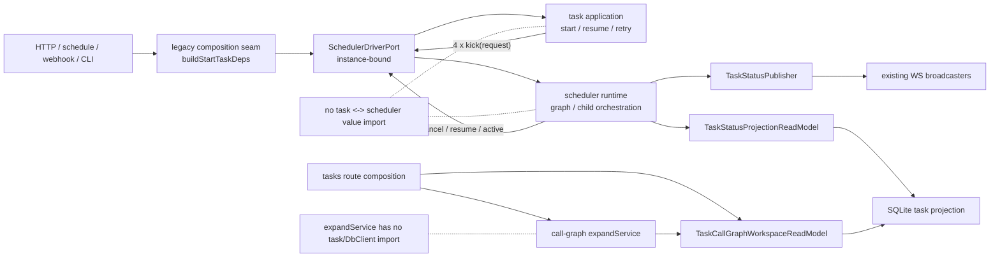

# RFC-331 技术设计：Task Execution 拓扑切割

> 状态：Done（2026-08-27）；T3～T12 已发布，最终 containing SHA
> `4152b377afa357e2e339f921dac09b21770cebc0` 的 exact-SHA CI `33034946053` terminal `success`（35/35 jobs）。
>
> 对齐：RFC-294 N3 / W2-A；复用 RFC-328 durable execution authority，不创建第二套 ownership、
> runtime registry、execution context 或 lifecycle outbox。

## 1. 当前依赖与最小切口

已发布基线 report 中 task SCC family 包含：

```text
agentLaunch
  └────► task ─────► scheduler ─────► execution/executor ─────► workgroup/launch
          ▲             │
          │             ├─ static emitTaskStatus/getTask
          │             └─ dynamic cancelTask/resumeTask/isTaskActive
          │
gc ─────► structuralDiff/callGraph/expandService
          └────────────────────────────► task.getTask
```

精确源码锚与处置：

| 当前边 / 调用         | current source                            | 本 RFC 处置                                          |
| --------------------- | ----------------------------------------- | ---------------------------------------------------- |
| task→scheduler        | `task.ts:194` + `:3723/:4676/:5389/:6317` | 四 kick 改用 `SchedulerDriverPort.kick`              |
| scheduler→task status | `scheduler.ts:244,10320-10323`            | 注入 status projection query + `TaskStatusPublisher` |
| scheduler→task cancel | `scheduler.ts:3841-3844`                  | `SchedulerDriverPort.cancelChild`                    |
| scheduler→task resume | `scheduler.ts:3882-3887`                  | `SchedulerDriverPort.resumeChild`                    |
| scheduler→task active | `scheduler.ts:3903-3907`                  | `SchedulerDriverPort.isTaskActive`                   |
| expandService→task    | `expandService.ts:12,156-180`             | `TaskCallGraphWorkspaceReadModel`                    |

断 A1 后前五条 depcheck 账同时失去闭环；E3 单独切掉第六条。scheduler→executor 的现有惰性
边不在最小充分集内，保持不动。

## 2. 模块与层次落位

| 产物                                       | owner / 层                                                          | 允许依赖                                       | 禁止依赖                                                   |
| ------------------------------------------ | ------------------------------------------------------------------- | ---------------------------------------------- | ---------------------------------------------------------- |
| `TaskDriveRequest` / `SchedulerDriverPort` | `task-execution/application/ports`；兼容期经 `public/topology` 导出 | 中性值类型、RFC-328 context type               | Hono、WS broadcaster、legacy task/scheduler implementation |
| `TaskStatusProjectionReadModel`            | `task-execution/application/queries`；合同经 `public/queries` 导出  | DB port / task-owned projection                | full Task DTO、route Actor                                 |
| `TaskCallGraphWorkspaceReadModel`          | `task-execution/application/queries`；合同经 `public/queries` 导出  | task/task_repos persistence projection         | structural-diff internals、full Task DTO                   |
| `TaskStatusPublisher`                      | `task-execution/application/ports`；兼容期经 `public/topology` 导出 | narrow event value                             | durable outbox writer、broadcaster singleton               |
| legacy topology adapter                    | composition-edge compatibility adapter                              | scheduler/task public functions + module ports | 状态、缓存、业务 fallback、global registrar                |
| WS publisher adapter                       | infrastructure compatibility adapter                                | existing broadcasters                          | durable lifecycle event insert                             |

本 RFC 允许保留一个无状态 compatibility adapter，因为 task/scheduler 主体尚未在 W2-B/C/D 迁位；adapter
必须登记 facade owner/removeAfterWave，且 task/scheduler 都不反向 import 它。它只做函数绑定和 shape 适配，不做
授权、状态判定、重试、异常吞噬或 DB 查询。

`public/topology` 与 `public/queries` 只是一跳 type/constructor surface，不复制 application contract；legacy
`services/*`、route 与 structural-diff consumer 只允许 import 这两处 public surface 或登记过的一跳 facade，新增
`modules/task-execution/application/**` / `infrastructure/**` deep import 直接由架构门阻断。public compatibility surface
在 W2-B/D consumer 迁完后按 facade ledger 删除，不能永久扩大模块 API。

**偏离项 DEV-1（随 proposal D4/D6 呈批）**：RFC-294 终局不允许 legacy facade，而本刀在现有
`services/startTaskDeps.ts` composition seam 内临时绑定 task/scheduler 函数，并增加两处 task-execution public compatibility
surface。原因是 W2-A 只切拓扑，task/scheduler 主体要到 W2-B/C/D 才迁位；本 RFC 不新增第二个 service facade 文件，
只给既有 composition seam 登记 exact owner/removeAfterWave。W2-B/D consumer 归零后必须删除该偏离，不能以“已公开”为由固化。

## 3. 合同

### 3.1 Task drive 请求

当前 `RunTaskOptions` 的字段集合机械迁到 application-owned `TaskDriveRequest`；本 RFC 不删除、改默认值或
重解释任何字段。为避免文档抄一份易漂移的 20+ 字段表，机器合同采用单一导出，scheduler 与四个 kick 共同 import。

关键硬字段如下：

```ts
interface TaskDriveRequest {
  readonly taskId: string
  readonly appHome: string
  readonly executionContext: TaskExecutionContextRef
  readonly signal: AbortSignal
  readonly ensureWorkspaceProfiles?: boolean
  // 其余 binary/config/runtime/commit-push/concurrency/timeout/capture 字段
  // 从现有 RunTaskOptions 原样迁入；source guard 锁字段集合等价。
}
```

`TaskExecutionContextRef` 只暴露 `intentId + OwnershipToken`；adapter 传递的仍是 RFC-328 铸造的同一
context instance，但不把其 daemon-internal `DbClient` 扩成 application port 合同。production request 的
`executionContext` 与 `signal` 必填。现有直接 scheduler unit fixtures 若需要 ownerless DB，必须
显式使用 test topology 生成的 fixture 请求；不能靠 production optional fallback 维持测试。

### 3.2 SchedulerDriverPort

```ts
interface ChildResumeRuntime {
  readonly triggerContext?: TriggerContext
  readonly actorUserId?: string
  readonly runConfig: InheritableRunConfig
}

interface SchedulerDriverPort {
  kick(request: TaskDriveRequest): Promise<void>
  cancelChild(input: { readonly taskId: string; readonly cascadeFromParent: true }): Promise<void>
  resumeChild(input: {
    readonly taskId: string
    readonly runtime: ChildResumeRuntime
  }): Promise<void>
  isTaskActive(taskId: string): boolean
}
```

port instance 绑定当前 DB 与应用依赖，不把 `DbClient` 暴露到调用合同。`InheritableRunConfig` 必须从现有
`INHERITABLE_RUN_CONFIG_KEYS` 单一注册表派生；不在此处手抄字段。task 侧只接收
`Pick<SchedulerDriverPort,'kick'>`，scheduler child path 只接收其余三方法的窄视图。

### 3.3 TaskStatusPublisher

```ts
interface TaskStatusProjection {
  readonly taskId: string
  readonly status: TaskStatus
  readonly errorSummary: string | null
  readonly canceledNodeRuns: readonly {
    readonly id: string
    readonly nodeId: string
  }[]
}

interface TaskStatusPublisher {
  publish(event: TaskStatusProjection): void
}
```

publisher adapter 必须逐字复刻当前 `emitTaskStatus`：

1. list channel `task.status {taskId,status}`；
2. task channel `task.status {status,errorSummary?}`；
3. terminal 时 task channel `task.done {status}`；
4. 每个 canceled node 发 `node.status`。

它是 ephemeral projection。RFC-328 已在 task lifecycle transaction 里调用
`enqueueTaskLifecycleEventTx`，并由 `createSqliteTaskLifecycleEventPublisher` 投递 Event Center；本 RFC 不从
`TaskStatusPublisher` 再写 outbox，否则会双发 durable lifecycle fact。

### 3.4 目的化读模型

```ts
interface TaskStatusProjectionReadModel {
  find(taskId: string): Promise<{
    readonly taskId: string
    readonly status: TaskStatus
    readonly errorSummary: string | null
  } | null>
}

interface TaskCallGraphWorkspace {
  readonly taskId: string
  readonly worktreePath: string
  readonly repos: readonly {
    readonly worktreeDirName: string
    readonly worktreePath: string
  }[]
}

interface TaskCallGraphWorkspaceReadModel {
  find(taskId: string): Promise<TaskCallGraphWorkspace | null>
}
```

`repoCount` 不单独持久投影；由 `repos.length` 推导，避免 row 字段与 hydrated rows 再造第二事实。
legacy 空 `task_repos` 行的单仓 fallback 必须与当前 `getTask` 保持等价。

## 4. Composition 与数据流

### 4.1 实例构造

`buildStartTaskDeps(db, configPath, actorUserId, secretBox)` 本来就是当前 launch 的 composition factory。
它在本 RFC 中显式构造无状态 `SchedulerDriverPort` adapter，并把必填窄端口放进 `StartTaskDeps`；不新增
`AppDeps` 字段，也不引入 global registration。

```text
route / schedule / webhook / CLI
  └─ buildStartTaskDeps(db, config, actor)
       └─ createLegacyTaskExecutionTopology(db)
            ├─ kick adapter ───────────────► scheduler.runTask
            ├─ child control adapter ──────► task cancel/resume/isActive
            └─ status query + publisher

task start/resume/retry
  └─ deps.schedulerDriver.kick(request)
       └─ runTask({...request, childControl, statusPublisher, statusReadModel})

route tasks.call-graph
  └─ createTaskExecutionReadModels({db}).callGraphWorkspace
       └─ getCallTargets(readModel, taskId, methodRef)
```

call-graph read model 不挂在 `StartTaskDeps`：它是独立 query consumer，不参与 task launch。route/composition 只从
task-execution public composition surface 取得绑定实例并注入 `getCallTargets`；不新增 `AppDeps` 字段，也不让
`expandService` import SQLite adapter 或 module internal。

直接构造 `StartTaskDeps` 或直接调用 scheduler 的测试，必须使用
`createTaskExecutionTestTopology({db, driver})` 明确选择真实 adapter、recording fake 或 poison fake。
没有 implicit no-op；某测试不关心调用时，也必须显式给 no-op fake，测试意图可见。

### 4.2 四条 kick 保真

| kick                   | current 特殊语义                                     | 切换后锁定                               |
| ---------------------- | ---------------------------------------------------- | ---------------------------------------- |
| initial start          | deferred prep、catch log、finally release            | 完整 options golden；后台/await 行为不变 |
| resume/retry task      | `ensureWorkspaceProfiles:true`、可选 await scheduler | 字段保留；返回时序不变                   |
| retry repo preparation | preparation 成功后 fire-and-forget                   | controller/context/finally 保持          |
| retry node             | runtime config 全量继承、fire-and-forget             | commit-push/concurrency/timeout 不掉字段 |

source guard 从语法上要求四点都只调用 port，且每次都带 current RFC-328 context。行为测试用 recording
driver 断言完整请求，不依赖真的启动 scheduler。

### 4.3 child control 保真

- cancel：只吞“child 已终态或竞态输掉”这类业务结果；adapter 装配缺失、未知异常不得 blanket catch 成成功。
- resume：保持“一次主动 resume；失败后重读状态；若另一 driver 已接管则 reattach”的顺序。
- active：继续读 RFC-328 exact-token runtime registry，不退回 task status 或第二张 Map。
- shutdown：child/parent interrupted 与 adoption 行为不变；port 不新增 abort reason 或状态映射。

### 4.4 call graph 保真

处理顺序固定：

1. `workspaceReadModel.find(taskId)`；null → `task-not-found`；
2. 单仓直接使用 task worktree；多仓按最长 `worktreeDirName/` prefix 匹配；
3. 无匹配 → `call-target-repo-unresolved`；
4. `isGitWorkTree` 失败 → `task-worktree-missing`，HTTP/domain status 410；
5. 扩展并把 repo label 重新加回返回 ref。

该顺序进入测试，避免“读模型变窄”时把缺任务误报成缺工作区，或把多仓路径选择悄悄改掉。

## 5. 两刀切换

### Cut A：A1 + B1～B4（前五条账）

一个 cohesive commit 完成：

1. 加入 ports/query/publisher 与 recording/poison fixture；
2. 四个 kick 改端口；
3. scheduler status、cancel、resume、active 改注入；
4. 删除 task↔scheduler 的全部 static/dynamic value imports；
5. 删除 `scripts/depcheck.ts` 前五条 task-family exact debt；
6. architecture report 重采，确认没有以新路径形成同构回边。

只切 A1 而保留 B1～B4 虽然可能让 Tarjan 已不成环，但会留下 scheduler 反向依赖 task application 的模块债；
本 RFC 选择同笔收口，避免“指标绿、边界没切完”的半态。

### Cut B：E3 call-graph query（第六条账）

1. 加入 `TaskCallGraphWorkspaceReadModel` SQLite projection、public composition factory 与 legacy single-repo fallback；
2. route/composition 注入 read model，`expandService` 只依赖 public query contract；
3. 删除 `expandService → task.ts`；
4. 删除第六条 depcheck exact debt；
5. current task SCC family 消失，`KNOWN_VIOLATIONS` 37→31。

Cut B 在设计上保持独立验证边界，且不移动 call-graph 或 GC owner。批准时计划独立提交；最终发布时 A/B 已在同一
candidate snapshot 共存，故由 `81d97d060` 单笔 cohesive commit 收口，不伪造中间历史。

## 6. 失败模式

| 失败                                     | 必须表现                                                            |
| ---------------------------------------- | ------------------------------------------------------------------- |
| production topology 未装配               | 编译期缺必填字段或 composition 立即抛；不得静默直接 import/fallback |
| recording/poison fake 被 production 引入 | source/ownership guard 转红                                         |
| driver kick 同步抛错                     | 保持各调用点当前 catch/return/finally 语义                          |
| child control 业务竞态                   | 继续走当前重读/reattach 判据                                        |
| child control wiring bug                 | 可见失败，不得被“already terminal” catch 吞掉                       |
| status query 返回 null                   | 不广播 ghost frame；按当前 logger/调用点处理                        |
| WS publisher 抛错                        | 不回滚 durable lifecycle；保持 ephemeral best-effort 分类           |
| call-graph task/repo/worktree 缺失       | 错误 code、status、判定顺序逐字保持                                 |

## 7. 测试策略

### 7.1 合同与接线

- recording driver 覆盖四 kick 的完整 request shape；poison driver 证明漏注入/走旁路会红；
- source guard 精确禁止三类回边，不以总数或前缀豁免；
- architecture guard 同时禁止新增 legacy→task-execution application/infrastructure deep import，只允许本 RFC 登记的 public/facade surface；
- production construction site inventory 覆盖 `buildStartTaskDeps` 的 HTTP、CLI、schedule、webhook、DE、DA 等调用方；
- direct fixtures 明确选真实/recording/no-op/poison，不保留 ownerless production fallback。

### 7.2 行为

- start/resume/retry-prep/retry-node：同步/异步、log、finally release、workspace profile 与 config 逐项；
- child call：cancel race、resume 一次、active reattach、shutdown adoption；
- WS golden：list status、task status、terminal done、canceled node 顺序与字段；
- durable event：同一 lifecycle revision 仍恰好一个 outbox row；
- call graph：单仓、多仓 longest-prefix、无匹配、task missing、worktree 410、结果 re-prefix。

### 7.3 架构

- Cut A 后前五条 exact ledger 消失、Cut B 后第六条消失；
- task SCC family 消失且其他 SCC/KNOWN 不新增；
- mutation fixture 分别重加 `task→scheduler`、`scheduler→task`、`expandService→task`，三条都会红；
- canonical report/manifests 与 committed source digest 同步，不能只手改计数。

## 8. 兼容与回滚

- 零 schema/API/MCP/WS 变化；两个 cut 保持独立 oracle/ledger 边界，最终 Git 发布单元为 cohesive commit `81d97d060`；
- 回滚必须恢复对应 exact ledger，不能保留未解释依赖；
- RFC-328 migration、ownership/effect ledger、runtime registry 与 lifecycle outbox 不回滚；
- 批准期允许 Cut A 先落、Cut B 失败时保留前五条下降；最终发布未产生该半态，回滚 `81d97d060` 时必须连同六条 ledger 一致恢复；
- 任一功能 oracle 变化先停实施、回到 proposal 能力影响与用户批准门。

## 9. 遗留债与后续

- W2-B：把 current frontier/drive/admission 分解为 TaskEngine；
- P0-C residual + W2-C：human-gate continuation 与 NodeExecutorRegistry；
- W2-D：WrapperRuntime；
- W3：统一 lifecycle committed events/continuation consumer；RFC-328 outbox 是输入，不是本 RFC 的新工作；
- W4/W5/W9：transport、source-control、composition root、worker/facade 清仓。

完成 RFC-331 只能标记 W2-A topology cut 完成，不能把 W2 或 RFC-294 总体标 Done。

## 10. 2026-08-27 已发布落地形状



落地边界：

- application port/query owner 在 `modules/task-execution/application/**`；SQLite/WS adapter 在
  `modules/task-execution/infrastructure/**`；legacy consumer 只经 `public/topology` 与 `public/queries`。
- `services/startTaskDeps.ts` 是唯一临时 legacy composition seam，只绑定函数与 shape；
  topology instance 自身无状态，无 global registrar、optional fallback 或第二个 durable writer。
- scheduler 继续拥有现有 graph/frontier/wrapper 行为；本刀没有把 W2-B/C/D 伪装成已拆分。
- 测试经 `tests/helpers/taskExecutionTestTopology.ts` 显式选择 real/recording/no-op/poison instance；
  production 禁止 import 该 test seam。

落地量化：backend production=848、module=333（`task-execution`=57）、backend SCC=4、
repo SCC=6、`KNOWN_VIOLATIONS=31`。公开面 292、facade 370；RFC-331 DEV-1 的五条 public
pilot debt 均有 exact owner 与 W2-B/W2-D `removeAfterWave`。已发布 report digest 为
`sha256:e9f8a0ec9d551929295bd43b5d271237448e099c6fdb1c60d2d43aa26ebd0cac`。

发布链：`81d97d060` 落主实现，`262f34bf7` 固定 canonical payload，`89b19057d` 以真实 payload commit
repin provenance，`11634edc7` / `2cad7c2f4` / `4152b377a` 逐项对齐 hosted CI 暴露的历史 source lock。
最终 `4152b377a` 的 run `33034946053` 35/35 jobs 全绿；因此本图是 W2-A 的已发布现状，不是候选目标图。
