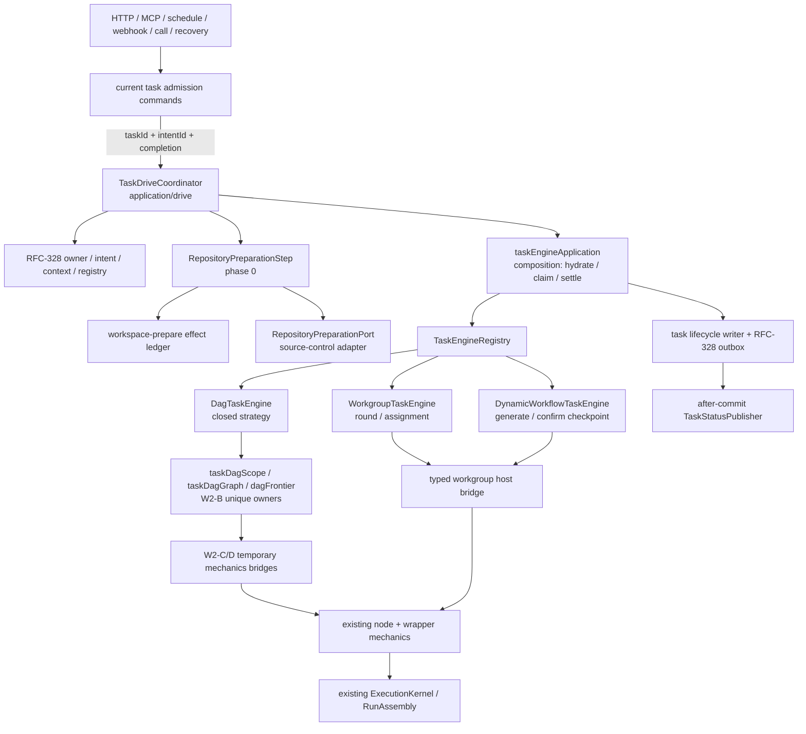

# RFC-332 技术设计：TaskEngine 拆分

> 状态：Done（2026-08-27；W2-B 实现、canonical provenance 与 exact-SHA hosted closeout 已完成）
>
> 对齐：RFC-294 W2-B；baseline source `b598d4a35e681d3623f44c15ef632d50a2b710d9`，最终功能快照
> `4dd30d034f1bcb0c6532301cec11bdd288702105`。
> 复用 RFC-328 durable authority/context/effect/outbox 与 RFC-331 topology ports，不建立平行权威。

## 1. 当前执行形状

```text
task admission / resume / retry
  ├─ tryAttachTaskDriver
  ├─ [initial/retry-prep only] runDeferredRepoPreparation
  ├─ SchedulerDriverPort.kick
  │    └─ startTaskDeps legacy adapter
  │         └─ scheduler.runTaskWithTopology
  │              └─ runTaskInner
  │                   ├─ hydrate + validate + pending→running
  │                   ├─ resolveTaskEngine
  │                   ├─ runScope | runWorkgroupEngine | runDynamicWorkflowGenerate
  │                   └─ inspect + task settle
  └─ releaseTaskDriverAndFinalizeWorkspace

boot auto-resume
  └─ CLI 查询 __repo_prep__ latest row
       ├─ retryNode(...)
       └─ resumeTask(...)
```

混合点有三类：

- application orchestration 重复：四个 drive 点各自管理 controller/context/catch/finally；
- engine ownership 混合：`runTaskInner`、`runScope`、node、wrapper、workgroup host mechanics 共处 scheduler；
- architecture truth 错位：canonical `/schedule/` 子串把 `scheduler.ts` 整文件误归 integration。

W2-B 后必须变成一个自上而下的单向链：

```text
admission command
  → TaskDriveCoordinator
    → RepositoryPreparationStep (phase 0, when required)
    → TaskEngineOrchestrator
      → TaskEngineRegistry
        → DagTaskEngine | WorkgroupTaskEngine | DynamicWorkflowTaskEngine
          → temporary W2-C/D mechanics bridges
            → existing NodeExecutor / Wrapper / Workgroup host implementations
```

## 2. 目标目录与 owner

```text
packages/backend/src/modules/task-execution/
  application/
    drive/
      taskDriveCoordinator.ts
      taskDriveTypes.ts
      repositoryPreparationStep.ts
    ports/
      taskEngine.ts
  domain/
    taskEngine.ts
  engine/
    task/
      taskEngineRegistry.ts
      dag/
        dagTaskEngine.ts
      workgroupTaskEngine.ts
      dynamicWorkflowTaskEngine.ts
  infrastructure/
    taskDriverLifecycle.ts
  composition/
    taskEngineApplication.ts
    taskDagScope.ts
    taskDagGraph.ts
    dagFrontier.ts
  public/
    commands.ts                  # drive/preparation/lifecycle 的 exact command contracts

services/execution/             # W2-C/D 完成前的有账 compatibility shapes
  taskEngineRuntimeOptions.ts
  taskMechanicsState.ts
```

文件名允许实现期按现有命名规范微调，但 owner/依赖方向不变：

| 产物                        | owner/layer                                            | 允许依赖                                                                  | 禁止依赖                                                    |
| --------------------------- | ------------------------------------------------------ | ------------------------------------------------------------------------- | ----------------------------------------------------------- |
| `TaskDriveCoordinator`      | task-execution/application                             | RFC-328 module、resolved config、engine orchestrator、prep port           | Hono/MCP/WS、legacy task DTO、global locator                |
| `RepositoryPreparationStep` | task-execution/application                             | persisted prep projection、effect store、SC participant、lifecycle writer | route input、raw `StartTaskDeps`、独立 worker               |
| `TaskEngineRegistry`        | task-execution/engine/task                             | closed engine kind + three strategies                                     | TaskSourceId、Catalog source、history code-round arm        |
| `DagTaskEngine`             | task-execution/engine/task/dag                         | frontier store、question projection、node/wrapper bridges                 | workgroup round tables、transport、direct task status write |
| `WorkgroupTaskEngine`       | task-execution/engine/task                             | existing workgroup engine port                                            | DAG frontier、wrapper topology ownership                    |
| `DynamicWorkflowTaskEngine` | task-execution/engine/task                             | existing dynamic generation port                                          | generated DAG execution body                                |
| `TaskEngineStore`           | application port / SQLite adapter                      | purpose-specific task/repo/run projection + owned CAS                     | full `getTask` DTO、route Actor                             |
| mechanics ports/adapters    | application required ports / composition compatibility | exact node/scope/host/replay/completion methods                           | `SchedulerState`/`StartTaskDeps`/arbitrary callbacks        |

实现候选的物理落位比概念图更严格地区分“目标 engine”与“兼容装配”：三路 closed registry/strategy 在
`engine/task`；DAG 的 scope、graph 与 frontier 已从 `scheduler.ts` 移除并由 `composition/taskDag*.ts`、
`composition/dagFrontier.ts` 唯一拥有，但在 W2-C/D/W3/W5 尚未获批前，它们仍通过 exact-symbol legacy
mechanics 依赖保持现有行为，不能冒充已经完成的 NodeExecutor/WrapperRuntime。`startTaskDeps.ts` 到
`taskEngineApplication#driveTaskEngineApplication` 保留一条 `introducedByRFC=RFC-332`、
`removeAfterWave=W2-D` 的 legacy composition edge；这样 exact public contracts 不反向 value-import
legacy-backed composition，backend/repo value SCC 保持 RFC-331 收口后的 `4/6`，不重新形成 task SCC。

## 3. Application contract

### 3.1 ResolvedTaskDriveConfig

当前 `TaskDriveRequest` 在四个调用点重复 spread live config。W2-B 把它改为 composition-time immutable profile：

```ts
interface ResolvedTaskDriveConfig {
  readonly appHome: string
  readonly runtime: TaskDriveRuntimeOptions
  readonly ensureWorkspaceProfiles: boolean
}
```

factory 每次为当前 launch/resume/retry 构造实例，仍读取现有 live config；“immutable”只表示一个 submission 内不会再
从全局配置重读或被调用点漏字段。`INHERITABLE_RUN_CONFIG_KEYS` 继续是 child inheritance 的单一登记，
不在本 RFC 复制字段表。

### 3.2 TaskDriveCoordinator

```ts
type TaskDriveCompletionMode = 'background' | 'await-settle'

interface TaskDriveSubmission {
  readonly taskId: string
  readonly intentId: string
  readonly completionMode: TaskDriveCompletionMode
}

type TaskDriveReceipt =
  | { readonly kind: 'accepted'; readonly taskId: string }
  | { readonly kind: 'settled'; readonly taskId: string }
  | { readonly kind: 'not-attached'; readonly taskId: string }

interface TaskDriveCoordinator {
  submit(input: TaskDriveSubmission): Promise<TaskDriveReceipt>
}
```

coordinator instance 已闭包绑定 DB、`ResolvedTaskDriveConfig`、RFC-328 module、engine orchestrator、logger 与
workspace finalizer。request 不带 `DbClient`、`AbortController`、context、driver 或 20+ config fields。

精确顺序：

1. 创建 task-owned controller；
2. 以 `intentId` 调 RFC-328 claim/attach，铸造同一 `TaskExecutionContext`；
3. `background` 在 attach 成功后启动受控 promise 并立即返回 `accepted`；`await-settle` 等到整条 drive 完成；
4. 受控 promise 内以 context 运行 `RepositoryPreparationStep → TaskEngineOrchestrator`；
5. catch 使用现有调用点的日志/状态规则，不让后台 rejection 裸奔；
6. finally 恰好一次执行 driver release + workspace finalization。

`not-attached` 保持当前“竞态赢家已改变 task/intent，调用方重读 task”的语义，不自动二次 claim。

### 3.3 与 command admission 的边界

`startTask`、`resumeKick`、`retryNode` 等仍在本波保留各自产品前置校验与 lifecycle/intent transaction；
它们在事务提交后只产出：

```ts
interface AdmittedTaskDrive {
  readonly taskId: string
  readonly intentId: string
  readonly completionMode: TaskDriveCompletionMode
}
```

它们不再 attach、构造 controller、调用 prep body、拼 scheduler request 或 finally release。W4 才把这些 legacy
functions 完整收为 command handlers；W2-B 不把它们合成 `StartAnything`。

## 4. Repository preparation 第 0 步

### 4.1 判定与 hydrate

`RepositoryPreparationStep` 只消费 persisted facts：task row、placeholder repo identity、task repo rows、
latest `__repo_prep__` row 与 `taskWorkspacePhase`。current `retryRepoPreparation` 已证明失败后可从持久数据重建 input；
W2-B 把这份 reconstruction 提成唯一 `RepositoryPreparationDescriptorReadModel`，initial/retry/boot 不再传临时
`StartTask input + MaterializedSpace + StartTaskOwnership` bag。

phase matrix：

| workspace/prep phase                                 | drive 行为                                         |
| ---------------------------------------------------- | -------------------------------------------------- |
| pre-materialized / scratch ready                     | skip phase 0，直接进入 task claim                  |
| deferred, no prep run                                | mint pending successor → running → execute         |
| latest prep running under exact handle               | 当前 driver 继续；其他 submission attach 失败      |
| latest prep failed/interrupted after retry admission | mint next retryIndex successor → execute           |
| latest prep done                                     | verify persisted workspace projection，skip effect |
| task canceled/terminal or prune tombstone            | 不执行 preparation，尊重现有 lifecycle winner      |

manual `resumeTask` 对 prep-incomplete 仍在 admission preflight 返回现有 `task-repo-prep-incomplete`；用户需要走
retry-node。boot recovery 可选择 retry-prep admission，但 admission 成功后与 initial 共用同一个 phase 0。

### 4.2 effect 与状态

继续使用 RFC-328：

```text
effect kind        = workspace-prepare
stable ordinal     = workspace-prepare:task-root
resource fence     = workspace-prepare:<taskId>
attempt owner      = exact TaskExecutionContext token/intent
```

不新增 schema。current `createLocalEffectAttemptObserver` 可迁成 module 内的 typed participant；operation family、generation、
attempt、retry authority 与 settle receipt 均复用现表。网络窗口、hard failure 分类、signal、multi-repo backfill、
workspace profile、cleanup lease 与 error diagnostics 逐项照搬现行 oracle。

成功时仍在同一 transaction 完成 task/task_repos/space projection 回填与 prep node `running → done`，commit 后才允许
task `pending → running`。失败/cancel/shutdown 的 task/run 状态和 driver release 顺序保持 current。

### 4.3 source-control 边界

W2-B 定义窄 participant，不移动 materialization owner：

```ts
interface RepositoryPreparationPort {
  prepare(input: RepositoryPreparationRequest): Promise<RepositoryPreparationOutcome>
  discard(input: RepositoryPreparationDiscardRequest): Promise<RepositoryPreparationDiscardReceipt>
}
```

request 只含 persisted descriptor ref、workspace operation ref 与 task-owned cancellation capability；TaskEngine 不读取
Git URL/token/cache implementation。当前 `materializeSpace` 由 composition adapter 实现，W5 再迁最终 source-control owner。

## 5. TaskEngine contract

### 5.1 闭合 outcome

```ts
type TaskEngineOutcome =
  | { readonly kind: 'ok' }
  | { readonly kind: 'failed'; readonly detail: TaskFailureDetail }
  | { readonly kind: 'canceled'; readonly detail?: TaskFailureDetail }
  | { readonly kind: 'awaiting_review'; readonly detail?: TaskFailureDetail }
  | { readonly kind: 'awaiting_human'; readonly detail?: TaskFailureDetail }

interface TaskEngineContext {
  readonly task: TaskEngineSnapshot
  readonly execution: TaskExecutionContext
  readonly signal: AbortSignal
  readonly runtime: ResolvedTaskDriveConfig
}

interface TaskEngine {
  readonly kind: TaskEngineKind
  drive(context: TaskEngineContext): Promise<TaskEngineOutcome>
}
```

strategy 不写 task terminal status；只写自己拥有的 engine state/node mechanics，并返回 current `ScopeResult` 同形 outcome。
`TaskEngineOrchestrator` 统一执行 readonly repo inspection、abort-last-check、park/terminal CAS、status projection 与日志。

### 5.2 registry 与选择

```ts
type TaskEngineKind = 'dag' | 'workgroup-turns' | 'dw-generate'

interface TaskEngineRegistry {
  resolve(input: TaskEngineSelectionSnapshot): TaskEngine
}
```

`resolveTaskEngine` 的 current truth table 原样迁入 registry：

| persisted task facts                 | selected engine   |
| ------------------------------------ | ----------------- |
| no workgroup                         | `dag`             |
| leader-worker/free-collab            | `workgroup-turns` |
| dynamic workflow, phase != executing | `dw-generate`     |
| dynamic workflow, phase = executing  | `dag`             |

phase=executing 但 snapshot 仍含 generation host 的 `dw-phase-invariant` 保持。registry 构造时验证 keys
恰好闭合；历史 `code-round` 不注册 active implementation。

### 5.3 TaskEngineOrchestrator

从 current `runTaskInner` 迁入：

1. task/repo/snapshot/trigger/workspace profile hydrate；
2. exact durable owner/context 对拍；
3. node-kind、duplicate id、wrapper containment、projected cycle preflight；
4. `pending → running` owned CAS + status projection；
5. 经 `TaskPreDriveReplayPort` replay pending merge / conflict-human resolution；
6. registry resolve + strategy drive；
7. readonly repo inspection；
8. failed/canceled/awaiting/done task settle。

所有 DB 读写通过 purpose-specific `TaskEngineStore` / existing lifecycle writer，不让 engine public contract 获得 full DB。
初次迁移允许 SQLite adapter 内复用现有 query/lifecycle functions；pending-merge/conflict-human mechanics 仍由有删除波次的
pre-drive replay adapter 实现，orchestrator 只决定调用顺序；legacy scheduler 不再是 task-level owner。

## 6. 三种 engine 的边界

### 6.1 DagTaskEngine

迁入 `deriveFrontier`、top-level/nested `driveScope` 与它们的纯 supporting types。每 tick 保持：

1. 读 narrow node-run projection；
2. 读 clarification/deferred-question facts；
3. 调纯 `deriveFrontier`；
4. ready nodes 经 node/wrapper mechanics bridge 分派；
5. race in-flight completion；
6. quiescent 时归约 park/failure/stall/ok；
7. top-level only 的 auto commit-push 保持 current 条件，并经 `TaskCompletionEffectsPort` 执行实际 effect。

wrapper nested scope 不反向 import engine singleton。DagTaskEngine 在调用 wrapper bridge 时提供 branded
`NestedScopeDriver` capability；wrapper 只能用它驱动自己声明的 child scope/iteration，W2-D 再把 bridge 收进正式
`WrapperRuntime`。这样保留 recursion，又不形成 scheduler ↔ task-engine 源码环。

### 6.2 WorkgroupTaskEngine

只适配既有 `runWorkgroupEngine`：round、assignment、cursor、message、completion gate、adoption/reconcile 都仍由
workgroup domain 实现。strategy 只把 `TaskEngineContext` 映射为 `WorkgroupEngineArgs` 并把 result 映回闭合 outcome。

host mechanics 经 typed `WorkgroupHostExecutionPort`；不得调用 DAG frontier，也不得把 assignment 写成 NodeRun 状态机。
W2-C 后 host node execution 改走共同 registry/kernel，workgroup domain 仍不消失。

### 6.3 DynamicWorkflowTaskEngine

只适配既有 `runDynamicWorkflowGenerate`；generate attempts、generated definition、reject round、confirm holder 与
`awaiting_confirm` checkpoint 保持。confirm command 仍原子 swap snapshot + phase=executing 后提交 resume intent；下一次
registry resolve 为 DAG。Dynamic engine 本身不执行 generated graph。

## 7. mechanics ports 与 compatibility adapters

### DEV-1（需随 RFC 批准）

W2-B 不能提前迁 node/wrapper/replay body，但 TaskEngine 需要调用它们。允许以下窄面：

```ts
interface LegacyNodeStepPort {
  execute(input: NodeStepRequest, nestedScope: NestedScopeDriver): Promise<NodeStepOutcome>
}

interface LegacyWorkgroupHostExecutionPort {
  execute(input: WorkgroupHostExecutionRequest): Promise<WorkgroupHostExecutionOutcome>
}

interface TaskPreDriveReplayPort {
  replayPendingMerges(input: TaskReplayRequest): Promise<void>
  replayConflictHumanResolutions(input: TaskReplayRequest): Promise<void>
}

interface TaskCompletionEffectsPort {
  inspectReadonlyRepositories(input: TaskCompletionRequest): Promise<void>
  maybeCommitAndPush(input: TaskCompletionRequest): Promise<void>
}
```

wrapper 仍作为 node step 的一种 current mechanics 被 legacy adapter 处理；`NestedScopeDriver` 是独立 capability，
避免把整个 engine/context 暴露给 bridge。各 adapter 在 composition 中按 task instance 闭包绑定 current DB/runtime/semaphore/
mechanics state，request 只携 engine-owned snapshot/ref；这让现有 `runOneNode` 所需状态可用，但不会把 `SchedulerState`
变成跨层合同。不允许：

- `SchedulerState`；
- full `StartTaskDeps`；
- raw `DbClient`；
- arbitrary callback map；
- task target status、ownership token reconstruction 或 transport actor。

facade ledger：node/host adapter `removeAfterWave=W2-C`；wrapper/nested-scope 与相关 replay adapter
`removeAfterWave=W2-D`。`TaskCompletionEffectsPort` 是长期 required port，W5 只把其 legacy implementation 换成最终
source-control adapter。每个 method 与 recursive field 都进入 consumer budget；新字段默认不允许，必须修改 RFC/ledger。

## 8. lifecycle 与事件

### DEV-2（需随 RFC 批准）

RFC-328 lifecycle outbox 已是唯一 durable event 通道；RFC-331 `TaskStatusPublisher` 只做 current after-commit WS projection。
W2-B 把 publisher 注入 `TaskEngineOrchestrator`，不在事务 callback 内 publish，不增加第二 outbox。

W3 前保留 compatibility adapter，行为如下：

```text
owned lifecycle CAS commits
  ├─ RFC-328 task lifecycle outbox row (durable, unique)
  └─ after commit → current TaskStatusPublisher → WS invalidate/status frames
```

park/done/fail/cancel 的 allowed-from、cancel-wins、lost-CAS handling、frame order 与 lifecycle event revision 全部按 current oracle。

## 9. Task metadata 与相邻 RFC 约束

| 事实                             | owner                                       | W2-B 用法                                                                      |
| -------------------------------- | ------------------------------------------- | ------------------------------------------------------------------------------ |
| RFC-301 `launch_origin`          | task admission persisted fact               | engine 只读，不在 resume/retry 重算                                            |
| TaskCatalog `catalog_visibility` | task admission/membership                   | root 保留 current public/internal 值；child 同 INSERT 继承；engine 不默认/反推 |
| RFC-300 prune claim              | task lifecycle + source-control participant | drive/finalize 尊重 pruning/pruned winner，不执行 physical delete              |
| RFC-303 source termination       | task-execution fence/effect                 | admission/revival/terminal current result保持，不另建停止状态                  |
| RFC-306 skipped/consumed         | task-execution domain/frontier              | DagTaskEngine 保留纯判定和 persisted provenance                                |
| RFC-310 AgentAttempt host        | DA link + ordinary task                     | 仍由 DAG/agent host drive，不成为第四 engine                                   |

`catalog_visibility` 只在现有两值 domain 中运行。实现门锁 existing root default、trusted internal writers、child inheritance 与
storage decode；本 RFC 不添加新可见性策略、权限判断或 transport 参数。

## 10. single-consumer 切换

### Cut 0：contracts 与 oracle（不发布长期半态）

1. 新增 coordinator/engine contracts、recording/poison test application；
2. 在 current owner 上补 `deriveFrontier`、resolver 与四 drive 的 characterization oracle，不迁 production import；
3. 修 canonical classifier 并加 architecture mutations；
4. 不改变 production consumer。

### Cut 1：repository preparation + coordinator

1. 把 reconstruction/phase 0 迁到 module；
2. initial/resume/retry-prep/retry-node/boot recovery 在各自 admission 后提交同一个 coordinator；
3. coordinator 唯一 attach/context/release；
4. 四个 legacy `.kick` 调用点一起清零；
5. `SchedulerDriverPort.kick` 与 `TaskDriveRequest` compatibility consumer 清零。

Cut 1 与 Cut 2 在同一个 production commit 发布，避免新 coordinator 仍调用旧 task-level scheduler 的双 drive 半态。

### Cut 2：TaskEngine bodies

1. 迁 `runTaskInner` 为 orchestrator；
2. 迁 `runScope/deriveFrontier` 为 DagTaskEngine；
3. 包装 workgroup/dynamic strategies；
4. composition 注入 W2-C/D bridges；
5. 删除 scheduler 中 task-level body、旧 resolver facade 与 drive export；
6. 更新 RFC-331 facade ledger 的 drive-side偏离为已关闭。

### Cut 3：canonical projection

1. `/schedule/` 改 token-boundary/exact match，加入 `scheduler` 反例；
2. exact assertions 固定 B/C/D key symbols owner/layer/remove wave；
3. 重放 owner/facade/cross-context/current-report artifacts；
4. 不修改或伪造其他 wave 指标，不把 W2-C/D 标完成。

## 11. canonical owner 修正

当前：

```ts
const value = `${path}#${symbol}`.toLowerCase()
if (/webhook|codehost|gitlab|github|integration|schedule/.test(value)) return 'integration'
```

`scheduler.ts` 因含 `schedule` 被命中。目标算法至少满足：

- `schedule` 只匹配独立 path/symbol token（如 `scheduleLaunch`、`scheduledTask`），不匹配 `scheduler`；
- explicit module location 优先；
- mixed legacy file 的 exact symbol token 可以覆盖 file fallback；
- `$file` fallback 对 scheduler 为 `task-execution/engine`；
- `runTaskInner/runScope/deriveFrontier` 在迁移后为 current module，无 remove wave；
- residual `runOneNode` 指向 task-execution node/W2-C，`runWrapperNode` 指向 wrapper/W2-D；
- code-host/schedule integration-specific symbols仍按自身 token归 integration。

测试必须直接调用 classification function 或生成 fixture；只断言最终 JSON 一次不足以证明 substring mutation 会红。

## 12. 测试与功能 oracle

### 12.1 coordinator/admission

- current RFC-331 四 drive request golden 改为 coordinator submission + resolved config golden；
- initial background、`awaitScheduler`、resume await/background、retry-node background、retry-prep immediate return；
- attach loss、claim/context mismatch、background throw、release/finalize exactly once；
- boot interrupted、answered clarify continuation、prep retry breaker/audit。

### 12.2 repository preparation

沿用 RFC-287 T13 全矩阵：task/prep row 可见、warm/cold/network window、retryIndex、cached/source/group/multi-repo、
cancel/shutdown、prune tombstone、atomic backfill、effect receipt、auto-resume、schedule/webhook parity。

### 12.3 engine parity

- `derive-frontier*`、`dispatch-frontier*` 与 scheduler audit/source-lock corpus迁移 import 后保持；
- nested loop/git/fanout scope、commit-push、deferred/manual questions、clarify/review park；
- RFC-164/186 workgroup core/engine/e2e/reconcile；
- RFC-167 dynamic generate/execute/confirm/reject/resume；
- RFC-243 resolver truth table；
- RFC-306 skipped/consumed/run-anyway；
- RFC-301 origin、RFC-300 prune、RFC-303 termination、RFC-310 internal host/catalog oracle。

### 12.4 architecture mutations

每条独立 mutation 必须确定转红：

1. 在 `task.ts` 恢复 direct `.kick({...})`；
2. 在 scheduler 放回 `runTaskInner` / `runScope` / `deriveFrontier` body；
3. registry 加第四 active `code-round`；
4. CLI 再次读取 latest prep row 并自行 dispatch；
5. bridge 接受 `SchedulerState`、`StartTaskDeps`、`DbClient` 或 index signature callback bag；
6. `schedule` regex 再次匹配 `scheduler`；
7. workgroup task进入 DAG frontier；
8. root/child catalog value被 engine默认或重算；
9. lifecycle/WS 增加第二 durable writer。

## 13. 失败处理与回滚

| 失败                              | 必须表现                                                            |
| --------------------------------- | ------------------------------------------------------------------- |
| coordinator composition 缺依赖    | 构造/编译期可见失败，无 silent fallback                             |
| durable attach 输竞态             | `not-attached`，重读 current task，绝不二次 drive                   |
| prep effect失败/取消/shutdown     | 保持 current node/task status、diagnostic、retry reachability       |
| engine throw                      | 统一映射 current `scheduler error`/task failed 路径，finally 仍执行 |
| registry unknown/mismatched phase | current precise invariant failure，不猜 DAG                         |
| bridge wiring缺失                 | poison fixture 可见失败，不吞成 terminal success                    |
| terminal CAS 输竞态               | 尊重 winner，不覆写 cancel/source termination/prune result          |
| canonical artifact漂移            | generator/check失败，不手改 JSON 绕过                               |

回滚单位是最终 W2-B production cutover commit：恢复旧 scheduler drive/frontier 与四 kick 时必须同步恢复 facade/owner ledger。
RFC-328 schema、owner/effect/outbox 不回滚；additive tests/contracts 可保留，但不能有第二 production consumer。

## 14. W2-B 完成后的架构图



W2-B 的边界成果是：TaskEngine/drive 与 DAG graph/frontier 的唯一生产 owner 已形成；node/wrapper mechanics
仍明确待 W2-C/D，status projection 待 W3，completion/source-control implementation 待 W5，而不是被整体搬进一个
改名后的 scheduler。该图已在 `4dd30d034f1bcb0c6532301cec11bdd288702105` 成为已发布事实：四份治理
artifact 重放到归一化快照 `a36fd94c28d1b8300e9b67c0b0ca5c3dcc6d0761`，canonical source digest 为
`sha256:db8ee412d9cb1d96fede43392faa65095ccd2447f5af16f88dd805325daa6084`；该 exact SHA 的 CI `33052994260`、
git-protocols-e2e `33052994263` 与 integration-opencode `33052994318` 均为 terminal `success`。

边界不因 Done 而扩张：`taskDriveLegacy` 只是 legacy `services/task.ts` 在 W4 前的单一 exact composition seam；
node/workgroup-host、wrapper/replay、status、completion 依次仍归 W2-C、W2-D、W3、W5。下一个必做的依赖节点是
P0-C residual，它和后续 wave 都不在 RFC-332 授权内。
