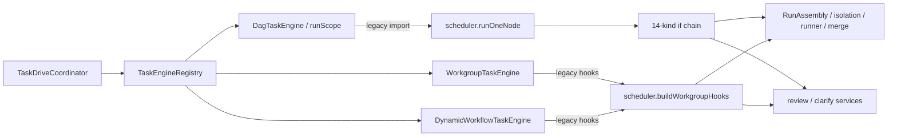
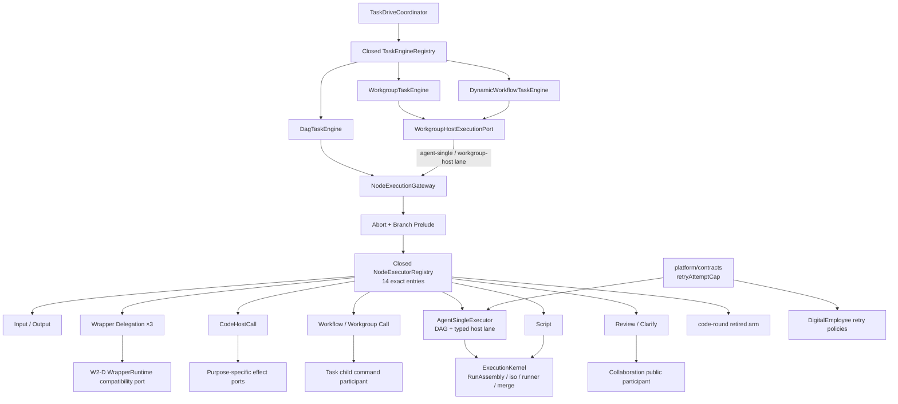

# RFC-334 技术设计：NodeExecutorRegistry

> 状态：Draft。本文固定 W2-C 的目标模块、closed registry、per-kind 边界、workgroup-host 共用方式、neutral retry-cap
> contract 与 cutover/rollback。生产代码必须在用户明确批准后实施。
>
> source pin：`0d296ff1bd72a7bf1e3fef8bcc506fa511e11b34`。文中的 `file:line` 均指该 committed blob；可用
> `git show 0d296ff1bd72a7bf1e3fef8bcc506fa511e11b34:<path> | nl -ba` 重放，禁止把后续 working-tree 行号冒充本设计事实。

## 1. 设计不变量

### I1：一个 NodeKind 恰有一个生产 executor entry

`NodeKind` 是 closed catalog。每个 kind 必须同时具备：

1. shared schema membership；
2. authorability/retirement 分类；
3. `NODE_KIND_BEHAVIORS` row；
4. `NODE_EXECUTOR_SPECS` entry；
5. per-kind intent test。

不得用 default executor、agent fall-through、字符串前缀或 runtime “unknown” 分支代替穷尽声明。

### I2：behavior table 与 executor registry 各自单源

`NODE_KIND_BEHAVIORS` 回答“这个 kind 如何参加跨切面的 lifecycle/retry/frontier”；`NODE_EXECUTOR_SPECS` 回答“ready
以后由哪个 task-execution executor 执行”。把 callback 塞进 shared behavior table 会让 shared 反向依赖 backend；把 behavior
字段复制进 executor metadata 又会形成第二事实源。因此两表不合并，只以 closed key-set oracle 对拍。

### I3：TaskEngine 不拥有 per-kind mechanics，executor 不拥有 task drive

- `TaskEngine`：task-level engine selection、frontier/scope、pause/cancel/terminal outcome；
- `NodeExecutionGateway`：一个 ready node 的公共 prelude、registry lookup 与 result return；
- `NodeExecutor`：一个 kind 的 mechanics；
- `ExecutionKernel`：pool/iso/spawn/retry/merge/settle primitives。

executor 不 claim/release task owner、不决定整个 task terminal、不启动第二 drive；TaskEngine 不按 NodeKind 分支。

### I4：公共 prelude 恰好一次且先于 effect

调用顺序固定为：

```text
abort check
  └─ if aborted → canceled
branch activation（settles-without-row family 跳过）
  └─ if inactive → branch-skipped
closed registry lookup
per-kind execute
```

任何 executor 不得重复做 branch judgment，也不得在 prelude 前 mint row、spawn、发请求、打开 gate 或创建 child task。

### I5：workgroup host 是 agent execution lane，不是新 kind/engine

workgroup leader/member 与 dynamic-workflow generation host 都运行 agent/runtime/iso mechanics，但它们不是 workflow
`agent-single` node，也不返回 DAG `NodeStepOutcome`。它们通过独立 host request/result 进入同一个 `agent-single` executor family，
继续由 WorkgroupTaskEngine 拥有 round/assignment。

### I6：human gate policy 不进入 node engine

review/clarify executor 只表达“此 node 请求打开/复用 gate，并把已提交 receipt 映射为 task-side park outcome”。documents、
questions、directives、revisions、idempotency、artifact journal 与 decision 顺序继续由 collaboration 拥有；task/node park 与
continuation 继续由 task-execution participant 拥有。

### I7：wrapper entry 穷尽，但 wrapper runtime 不在 W2-C

`wrapper-git | wrapper-loop | wrapper-fanout` 都必须出现在 registry；它们的 executor 是到
`WrapperNodeExecutionPort` 的窄 delegation。现有 wrapper outer shell、scope recursion、hydrate、merge、park、retry、replay
不复制、不迁入 node engine，留给 W2-D。

### I8：neutral retry contract 不拥有领域状态

platform contract 只接两个数并返回一个 cap；没有 config loader、failure classifier、followup reason、reaction/outbox/session state，
也不 import task/digital-employee。TaskExecution 和 DigitalEmployee 只共享算术，不共享 retry state machine。

### I9：功能行为优先于目录整洁

任何 status、error code/message、row cause、port output、WS、attempt/session、worktree、gate、child、outbound effect、并发或恢复
行为的变化都不是 W2-C 的隐含权限。需要变化时先停止 cutover、更新能力影响并重新请批；本 RFC 不加入任何安全策略。

## 2. current-source 结构

### 2.1 source inventory

| ID  | current fact                                                       | committed source anchor                                                                                                              | target owner                         |
| --- | ------------------------------------------------------------------ | ------------------------------------------------------------------------------------------------------------------------------------ | ------------------------------------ |
| C1  | 14-kind closed catalog                                             | `packages/shared/src/schemas/workflow.ts:36-81`                                                                                      | shared schema                        |
| C2  | behavior table 穷尽 14 kind                                        | `packages/shared/src/node-kind-behavior.ts:92-211`                                                                                   | shared behavior                      |
| C3  | DAG scope direct call legacy `runOneNode`                          | `packages/backend/src/modules/task-execution/composition/taskDagScope.ts:7,194-203`                                                  | task-execution node gateway          |
| C4  | task admission只靠 behavior membership；routing 仍靠 runtime guard | `packages/backend/src/modules/task-execution/composition/taskEngineApplication.ts:272-291`                                           | registry completeness                |
| C5  | workgroup/dw 四个构造点注入 legacy hooks                           | `packages/backend/src/modules/task-execution/composition/taskEngineApplication.ts:490-532`                                           | host execution port                  |
| C6  | workgroup host body 位于 scheduler                                 | `packages/backend/src/services/scheduler.ts:360-827`                                                                                 | agent executor host lane             |
| C7  | common abort/branch prelude 位于 runOneNode                        | `packages/backend/src/services/scheduler.ts:4087-4109`                                                                               | gateway prelude                      |
| C8  | 14-kind routing/agent body 位于 runOneNode                         | `packages/backend/src/services/scheduler.ts:4111-4413` 及其后 agent body                                                             | registry + per-kind executors        |
| C9  | review open 已跨 collaboration/task participant 原子停驻           | `packages/backend/src/services/review.ts:1006-1075`                                                                                  | collaboration request port + outcome |
| C10 | clarify open 已跨 collaboration/task participant 原子停驻          | `packages/backend/src/services/clarify/service.ts:286-363`                                                                           | collaboration request port + outcome |
| C11 | neutral cap 与 TE policy 同放 shared prompt                        | `packages/shared/src/prompt.ts:1250-1300,1303-1385`                                                                                  | platform cap + TE retry policy       |
| C12 | neutral cap 有两个生产 consumer                                    | `packages/backend/src/services/scheduler.ts:4484-4491`；`modules/digital-employee/application/runtimeService.ts:2187-2191,2675-2696` | platform contract                    |
| C13 | W2-C exact symbols/bridge 已有 canonical wave 账                   | `packages/backend/tests/architecture/rfc294Canonical.ts:383-400`；`architecture/cross-context-imports.json`                          | W2-C extinction oracle               |

### 2.2 current data flow



W2-B 已把上半段 task engine 归位；两条红色概念边（DAG→legacy node、workgroup/dw→legacy host）正是 W2-C 的删除对象。

## 3. 目标模块与依赖方向

### 3.1 目标目录

```text
packages/backend/src/
├── platform/
│   └── contracts/
│       └── retryAttemptCap.ts
└── modules/task-execution/
    ├── domain/
    │   ├── nodeExecution.ts
    │   └── envelopeRetryPolicy.ts
    ├── application/
    │   └── ports/
    │       ├── collaborationNodeGate.ts
    │       ├── wrapperNodeExecution.ts
    │       └── workgroupHostExecution.ts
    ├── engine/node/
    │   ├── nodeExecutionGateway.ts
    │   ├── nodeExecutor.ts
    │   ├── nodeExecutorRegistry.ts
    │   ├── agentNodeExecutor.ts
    │   ├── virtualIoNodeExecutors.ts
    │   ├── humanGateNodeExecutors.ts
    │   ├── childCallNodeExecutors.ts
    │   ├── scriptNodeExecutor.ts
    │   ├── codeHostCallNodeExecutor.ts
    │   ├── wrapperDelegatingNodeExecutors.ts
    │   └── retiredCodeRoundNodeExecutor.ts
    └── composition/
        └── nodeExecution.ts
```

文件可在实现期按真实共享度合并或拆分，但 owner/layer 不变。禁止把迁出的 body 暂存到 `services/nodeExecutor.ts` 或新增
`common.ts` god module。

### 3.2 依赖方向

```text
task engine
  → node execution gateway
    → closed registry
      → per-kind executor
        → task-execution domain/application ports
        → platform/contracts + execution kernel
        → injected collaboration/wrapper/child/source-control participants

workgroup engine
  → WorkgroupHostExecutionPort
    → node execution gateway.resolve('agent-single', lane='workgroup-host')
```

`engine/node` 不 import route/server、collaboration internal、workgroup strategy internal、concrete DB table repository、frontend/shared
UI 或 `services/scheduler.ts`。composition 可以绑定 legacy purpose-specific adapter，但不能把 `LegacyTaskMechanicsState` 整体注入。

## 4. 核心合同

以下是 shape 约束，不要求实现逐字使用相同命名：

```ts
type NodeOfKind<K extends NodeKind> = WorkflowNode & { readonly kind: K }

interface NodeStepRequest<K extends NodeKind> {
  readonly node: NodeOfKind<K>
  readonly task: NodeExecutionTaskRef
  readonly scope: NodeExecutionScopeRef
  readonly iteration: number
  readonly execution: TaskExecutionContextRef
}

interface NodeStepOutcome {
  readonly kind: 'ok' | 'failed' | 'canceled' | 'awaiting_review' | 'awaiting_human'
  readonly summary: string
  readonly message: string
  readonly processUnreaped?: true
}

interface NodeExecutor<K extends NodeKind> {
  readonly kind: K
  execute(request: NodeStepRequest<K>): Promise<NodeStepOutcome>
}

interface WorkgroupHostExecutionRequest {
  readonly lane: 'workgroup-host'
  readonly task: NodeExecutionTaskRef
  readonly host: WorkgroupHostRef
  readonly execution: TaskExecutionContextRef
}

interface AgentNodeExecutor extends NodeExecutor<'agent-single'> {
  executeHost(request: WorkgroupHostExecutionRequest): Promise<WorkgroupHostRunResult>
}
```

### 4.1 request 最小化

`NodeExecutionTaskRef` 只冻结 per-node mechanics 实际需要的 task facts，例如 task id、workflow snapshot identity、repo mount snapshot、
git commit identity 与 runtime policy ref；`NodeExecutionScopeRef` 只带 scope root/container refs。以下对象不得进入 request：

- raw `DbClient`；
- `SchedulerState` / `LegacyTaskMechanicsState`；
- `RunTaskOptions` 全对象；
- route actor/request/response；
- 任意 callback dictionary；
- task terminal target 或 owner claim mutation command。

每个 executor 的 ports/pools/resolvers 在 composition 构造时注入；request 只传本次执行事实。若某 kind 需要专属字段，使用
`NodeStepRequest<K>` 的 kind-specific extension，不把字段扩到全部 executor。

### 4.2 outcome 兼容

`NodeStepOutcome` 首轮直接保持 current `LegacyNodeResult` 的五种 kind、`summary/message/processUnreaped` 形状，避免 W2-C
连带改变 TaskScope/TaskEngine。W3/W5 若要进一步规范 event/completion，另按其 RFC 切换；W2-C 不提前改结果语义。

### 4.3 registry

```ts
type NodeExecutorSpecMap = {
  readonly [K in NodeKind]: NodeExecutor<K>
}

const NODE_EXECUTOR_SPECS = {
  'agent-single': agentSingleExecutor,
  input: inputNodeExecutor,
  output: outputNodeExecutor,
  'wrapper-git': wrapperGitExecutor,
  'wrapper-loop': wrapperLoopExecutor,
  'wrapper-fanout': wrapperFanoutExecutor,
  review: reviewNodeExecutor,
  clarify: clarifyNodeExecutor,
  'clarify-cross-agent': crossClarifyNodeExecutor,
  'call-workflow': callWorkflowNodeExecutor,
  'call-workgroup': callWorkgroupNodeExecutor,
  script: scriptNodeExecutor,
  'code-host-call': codeHostCallNodeExecutor,
  'code-round': retiredCodeRoundNodeExecutor,
} satisfies NodeExecutorSpecMap
```

production registry 由 composition root 一次构造为 immutable record；不支持运行时 plugin registration、last-write-wins override、
optional entry 或 default handler。constructor/runtime 还要对拍 `Object.keys` 与每个 `executor.kind`，让 JS/fixture 错装也可见失败。

## 5. NodeExecutionGateway

### 5.1 executeNode

```text
executeNode(request)
  1. execution.signal.aborted ? canceled
  2. nodeKindSettlesWithoutRow(kind) ? skip branch judgment
     : branchActivationPort.judge(...)
  3. inactive ? existing branch-skip writer + exact current outcome
  4. registry.resolve(kind).execute(kind-narrowed request)
```

branch-skip writer 保持 current row reuse/supersede/mint、consumed JSON、reason 与 WS。它是 gateway 的公共 collaborator，不复制到
14 个 executor，也不趁迁移改变 RFC-306 join/activation policy。

### 5.2 executeHost

```text
executeHost(request)
  1. signal.aborted semantics 由 current host contract 保持
  2. registry.resolve('agent-single')
  3. assert executor supports workgroup-host lane
  4. executor.executeHost(request)
```

host request 不走 workflow branch judgment，因为它由 WorkgroupTaskEngine 的 assignment/turn admission 产生，不是 DAG edge-ready
node；硬套 branch prelude 会凭空改变 workgroup 功能。它仍经 registry 选择 agent executor，从而消灭旁路，但保留独立 lane。

## 6. per-kind executor 设计

### 6.1 virtual I/O

`InputNodeExecutor` 与 `OutputNodeExecutor` 分开注册、可共享 virtual-row helper：

- input：校验 `inputKey`、读取 frozen inputs、mint `cause='io-virtual'` done row、写同名 port、广播；
- output：解析 wrapper boundary、读取每个 source port 的 content/kind/archive/active、记录 consumed provenance、mint done row、逐 port 投影、广播。

不得为了共享 helper 把两种 port contract 合成开放 `Record<string, unknown>`。

### 6.2 wrapper delegation

三个 executor 只传：exact wrapper kind/node、task/scope/iteration/execution refs，到同一个
`WrapperNodeExecutionPort.execute(kind, request)`。composition 暂时绑定 current `runWrapperNode + run*WrapperNode`；bridge 必须：

- owner=`task-execution/engine/wrapper`；
- `removeAfterWave=W2-D`；
- 不接 whole SchedulerState；
- 不允许 wrapper body 反调 registry 以外的 legacy node selector；nested scope 仍经 TaskDagScope → gateway。

W2-C 只消灭“顶层 kind 由谁选”的 legacy switch；wrapper mechanics 是否搬迁由 W2-D 决定。

### 6.3 review/clarify

`ReviewNodeExecutor` 通过 `CollaborationNodeGatePort.requestReview` 请求 current collaboration flow，返回 current
`ok/failed/canceled/awaiting_review`。`ClarifyNodeExecutor` 保持 graph no-op；真实 self clarify 继续由 agent runner emit 时请求
collaboration。`CrossClarifyNodeExecutor` 保持三段判定：

1. live pending/awaiting row → idempotent ok；
2. missing questioner → typed failed；
3. persistent stop → collaboration short-circuit receipt；否则 graph visit ok，等待 runner emit。

哪些 documents/questions 可见、如何算 iteration/directive、如何 prepare/commit/finalize，属于 collaboration port 实现；executor
只提供 node/task/scope facts并映射 outcome。不得重加 route-owned resume 或直接构造 continuation intent。

### 6.4 call nodes

`call-workflow` 与 `call-workgroup` 是两个 registry entry，可共享 current child-call executor implementation。它们不是 wrapper：

- 创建独立 child task；
- 不占父 node agent pool slot；
- child 自己选择 TaskEngine；
- parent node 只观察 child outcome/park/cancel/result。

kind-specific child source/identity/input mapping继续由现有 contract 决定，不合并成 `call-anything`。

### 6.5 script 与 code-host-call

两者保持独立 executor：script 有 subprocess/iso；code-host-call 是 daemon outbound effect、无 subprocess。共享的仅是既有
ExecutionKernel/effect observer primitive，不能因二者都 process-bearing 就合并 failure/retry policy。

### 6.6 retired code-round

executor 是常量行为：

```ts
return {
  kind: 'failed',
  summary: 'code-round execution was retired by RFC-310; use development missions',
  message: 'code-round-retired',
}
```

它不 import historical StageEngine、code-capability template、mission bridge 或 runtime runner。source guard 同时锁：

- only synthesized-only kind=`code-round`；
- user validation/palette继续不 author；
- active code-round writer/admission=0；
- registry arm只产生 typed retired failure。

### 6.7 agent-single DAG lane

现有 agent body 按责任迁入 executor 与若干私有 collaborators，保持原先先后序：

1. resolve exact agent ref；
2. RFC-127 borrow conflict check；
3. upstream inputs + consumed provenance；
4. injection/runtime/prompt/review/clarify context；
5. retry budgets/cap + retry-shape state；
6. row reuse/mint、frozen runtime/nonce；
7. pool + iso + runNode；
8. clarify gate request或 output validation；
9. merge/settle、output/events/WS；
10. typed outcome。

“拆文件”不能改变任何一项相对顺序。现有 RFC-287/188/210 source locks 指向 body 时，要先转换为语义 oracle，再删除旧源码锚；
不能只改测试字符串让迁移看似通过。

## 7. workgroup-host lane

### 7.1 保留的差异

| 维度          | DAG agent lane                | workgroup-host lane                                                            |
| ------------- | ----------------------------- | ------------------------------------------------------------------------------ |
| admission     | DAG frontier ready            | WorkgroupTaskEngine assignment/turn                                            |
| node identity | authored `agent-single` node  | `__wg_leader__` / `__wg_member__` host row + shard                             |
| prompt        | workflow template expansion   | framework-composed charter/roster/brief/messages，`expandPromptTemplate=false` |
| outputs       | agent declared business ports | role `wg_*` ports；host row不持久化 declared outputs                           |
| clarify       | workflow self/cross channel   | delegated voluntary ask-back + live autonomous suppression + shard queue       |
| writes        | ordinary DAG merge policy     | optional `discardWrites` for generation host                                   |
| merge throw   | current mainline disposition  | keep pending-merge for replay；human conflict abandon+failed                   |
| result        | `NodeStepOutcome`             | `WorkgroupHostRunResult`                                                       |

共用 agent executor 是为了共用 injection/runtime/runner/assembly owner，不是抹掉这些差异。

### 7.2 engine boundary

WorkgroupTaskEngine 仍负责：assignment CAS、leader/member strategy、turn retry、message/room projection、pause reason、reconcile、
wrap-up。host executor 只负责“一次已准入 host row 怎么跑完”。任何把 assignment status/cursor/strategy 放进 agent executor 的实现
都越过 W2-C 边界。

### 7.3 production cutover

`taskEngineApplication` 当前四个 `buildWorkgroupHooks(state)` 构造点改为注入同一个
`WorkgroupHostExecutionPort` instance；workgroup/dynamic engine tests 继续使用 fake hook/port。切换提交同时删除
`scheduler.buildWorkgroupHooks/runHostNode` export/body与对应 facade/owner/bridge entries，避免新旧 host mechanics 双活。

## 8. neutral retry-cap contract

### 8.1 platform shape

目标文件 `platform/contracts/retryAttemptCap.ts`：

```ts
interface RetryAttemptCapPolicyV1 {
  readonly schemaVersion: 1
  readonly followupBudget: number
  readonly restartBudget: number
}

const RetryAttemptCapPolicyV1Schema = z
  .object({
    schemaVersion: z.literal(1),
    followupBudget: z.number(),
    restartBudget: z.number(),
  })
  .strict()

const RETRY_ATTEMPT_CAP_CEILING = 99

function retryAttemptCap(followupBudget: number, restartBudget: number): number {
  const product = (1 + normalizeBudget(followupBudget)) * (1 + normalizeBudget(restartBudget))
  return Math.min(product, RETRY_ATTEMPT_CAP_CEILING)
}
```

exact codec 用于跨模块 named policy object，拒绝 unknown key；纯 arithmetic 继续是 total function并保持 current direct-call
normalization：非有限数→0、负数→0、小数 trunc、cap≤99。生产 config 已经提供普通有限数，codec 引入不改变用户配置行为；
NaN/Infinity golden仍直接锁 arithmetic，避免重构时丢失 totality。

### 8.2 consumer ownership

- TaskExecution：从 runtime config adapter 取得 `followupBudget/restartBudget`，用 neutral cap 决定 attempt count；
  `decideRetryShape`、`RetryShapeState`、restart notice、nonce/tree/session 处置迁到
  `task-execution/domain/envelopeRetryPolicy.ts`。
- DigitalEmployee：从 pinned execution policy 取得 `sameSceneAttempts/freshSceneAttempts`，只用 neutral cap 计算 outbox/round
  上限；scene selection、backoff、reaction/outbox state 留在 digital-employee。
- shared：`DEFAULT_PROTOCOL_RETRY_BUDGET` 继续作为 workgroup/dynamic/task 多引擎共同默认值；不因 W2-C 搬走。

### 8.3 不允许的抽象

platform contract 不得出现：`Task`、`NodeRun`、`EmployeeCase`、`ReactionRound`、`Outbox`、`Session`、`RunResult`、config path、
backoff、failure code、followup/restart/fresh 枚举、clock/store/runner。

## 9. collaboration 与 task-execution 边界

### 9.1 required port

task-execution 定义用途明确的 required port，不引用 collaboration internal type：

```ts
interface CollaborationNodeGatePort {
  requestReview(input: ReviewNodeGateRequest): Promise<NodeGateRequestOutcome>
  inspectCrossClarify(input: CrossClarifyNodeGateRequest): Promise<NodeGateRequestOutcome>
  openAgentClarify(input: AgentClarifyGateRequest): Promise<NodeGateRequestOutcome>
}
```

输入只包含现有 gate command 需要的 task/node/source snapshot/iteration facts；输出只包含 committed receipt 与 node outcome。
composition adapter 调用 collaboration public command，collaboration 再通过既有 task-execution participant 原子 park。此依赖由
composition root 绑定，不允许 engine deep-import collaboration infrastructure/service table。

### 9.2 decision 与 continuation

W2-C 不接触 review/clarify/questions decision routes。RFC-333 已锁三条 route direct `resumeTask=0`、exactly one
`gate-continuation` intent、claimed→pending handoff 与 recovery；这些测试是 W2-C mandatory regression。executor 只消费 open/park
outcome，不参与人工决定后的 task wake。

## 10. cutover 模型

### 10.1 additive skeleton

先增加 domain contracts、registry、gateway、neutral cap 与 characterization tests，但 production entry仍从 legacy
`runOneNode` 进入。additive 阶段不得执行 shadow node、写 shadow row 或比较双实现副作用；parity 由 test harness/fake ports 完成。

### 10.2 per-kind atomic switch

建议顺序按副作用和共享面由小到大：

1. neutral retry cap；
2. retired code-round；
3. input/output；
4. clarify/cross-clarify/review；
5. call-workflow/call-workgroup；
6. script；
7. code-host-call；
8. wrapper delegation arms；
9. agent-single DAG lane；
10. workgroup-host lane；
11. delete legacy selector/bridges并重放 architecture artifacts。

每一步“新 executor body 上线”与“旧 inline body 删除”同 commit；legacy selector 中只允许一行、按 exact kind 调用同一个
executor 的过渡 delegation，不能另留 fallback。全部 body 归位后，final cut 才把公共 prelude移到 gateway、把
`taskDagScope` 切到 registry并删除 selector shell。若多个 branch 共享一段无法安全拆开的 body，合并为一个更大的原子切换，
不能让一个 node 同时执行两路 effect。

### 10.3 source-lock conversion

现有多项测试以 `scheduler.ts` 函数名/源码片段保护行为。迁移时逐项分类：

- 真行为 oracle：改为从 public/composition seam 驱动真实结果；
- 架构 oracle：改为 AST/module/registry/owner exact assertion；
- 历史脆弱字符串：只有在对应行为已由更强 oracle 覆盖后才删除。

禁止仅把 `scheduler` 字符串替换成新文件名，或降低用例覆盖以便搬迁。

## 11. 兼容与回退

### 11.1 persisted compatibility

W2-C 不改表、status、row cause、workflow snapshot、nonce、retry index、merge state、gate operation、intent 或 child linkage。
因此在途 task 可由升级前/后 daemon 继续；选择新旧 executor 不依赖部署时间或新持久字段。

### 11.2 rollback

- additive、未接生产的 registry/contracts 可保留；
- 已切 kind 通过正常反向 commit 恢复其单一旧 branch；不得运行时 toggle/fallback，也不得让两路同时可命中；
- agent/workgroup host 若需回退，整体回退对应 atomic cutover，使 host mechanics 始终只有一个 production owner；
- neutral cap 回退必须两个 consumer同批回到旧 export，不能保留两份公式；
- 无 migration，所以不需要 schema down；不删除用户 task/node/artifact。

### 11.3 停止条件

出现以下任一情况立即停止并修订 RFC：

- 需要新增 kind/engine/status/schema/config 才能保持现有功能；
- 某 kind 只能靠新旧双 dispatch 才能切换；
- workgroup assignment 必须搬进 agent executor；
- wrapper body 必须在 W2-C 复制或重写；
- review/clarify 必须重建 gate policy/continuation；
- neutral cap 必须读取某一域 config/state；
- 现有正常功能必须被拒绝、限制或删除。

## 12. 测试与架构棘轮

### 12.1 closed-set tests

- key-set：`NODE_KIND == Object.keys(NODE_KIND_BEHAVIORS) == Object.keys(NODE_EXECUTOR_SPECS)`；
- kind identity：每个 entry `.kind === key`；
- classification：13 user-authored + 1 synthesized-only/retired；
- compile mutation：临时加入 synthetic kind，behavior/registry/classification/per-kind fixture 都必须报错；
- registry runtime wrong-key/wrong-kind/missing/extra mutation 必红。

### 12.2 per-kind behavior

按 proposal §6 能力矩阵锁：

- abort/branch first + clarify no-row；
- input/output exact rows/ports/provenance/active/WS；
- review single/multi/empty/reuse + RFC-333 fault/restart；
- clarify self/cross/live/missing/persistent-stop/shard；
- child calls done/failed/park/cancel/restart；
- script timeout/retry/merge/output；
- code-host provider/action/effect/recovery；
- code-round exact retired failure；
- wrappers nested/park/replay regression（body 未迁）；
- agent retry/clarify/review/nonce/iso/merge/process-unreaped；
- workgroup leader/member/dw host ports/clarify/discard/merge disposition。

### 12.3 retry contract

锁定：

- `(F,R)=(3,1) → 8`；`R=0 → 1+F`；
- negative、fraction、NaN、Infinity；
- `(50,10) → 99`；`99 < ASSEMBLY_MAX_ATTEMPTS=100`；
- exact codec unknown/missing/type mismatch；
- TaskExecution/DigitalEmployee call sites都只 import platform contract；
- task-execution shape table、suppressRestart、failure classes、scene/outbox behavior逐字保持。

### 12.4 architecture guards

- `taskDagScope → services/scheduler.runOneNode` edge=0；
- `taskEngineApplication → services/scheduler.buildWorkgroupHooks` edge=0；
- `scheduler.ts` W2-C symbols/body/facade/owner rows=0；
- W2-C exception ids=0，不新增 KNOWN；
- registry/executors target context/layer=`task-execution/engine`；
- neutral cap=`platform/contracts`，consumer恰为 TE/DE；
- wrapper legacy bridge精确属于 W2-D；
- collaboration gate policy owner不漂移；
- backend/repo value SCC≤`4/6`。

### 12.5 hosted closeout

生产实现候选必须完成 targeted behavior/architecture/canonical gates；最终发布 SHA 的主 CI 35/35 terminal success，并枚举、
dispatch、等待仓内全部带 `schedule` 的 workflow terminal success。失败归因到 job/test/path；queued、cancelled、ancestor 或
unrelated containing run 都不能宣称 W2-C 绿。

## 13. 目标架构图



### 13.1 最终模块边界

| 模块/层                               | 拥有                                                                 | 明确不拥有                                                    |
| ------------------------------------- | -------------------------------------------------------------------- | ------------------------------------------------------------- |
| `task-execution/engine/task`          | task engine selection/frontier/scope/outcome                         | NodeKind routing、workgroup assignment mechanics              |
| `task-execution/engine/node`          | ready-node prelude、closed registry、per-kind mechanics、host lane   | task claim/terminal、wrapper outer runtime、human gate policy |
| `task-execution/engine/wrapper` W2-D  | loop/git/fanout scope/hydrate/park/merge/retry/replay                | call-workflow、workgroup assignment、agent retry policy       |
| `task-execution/engine/kernel`        | pools/iso/spawn/retry loop/merge/settle primitives                   | NodeKind、gate/child/domain decisions                         |
| `collaboration`                       | review/clarify/questions policy、operation/artifact/decision/receipt | task engine、runtime/iso、route resume                        |
| `platform/contracts`                  | exact neutral cap codec/normalization/arithmetic                     | config、task/employee state、retry decision                   |
| `digital-employee`                    | scene/reaction/outbox retry policy/state                             | TaskExecution envelope/session policy                         |
| inbound/public/config/event 后续 wave | REST/MCP/UI facade、config projection、committed events              | W2-C 不提前领取                                               |

## 14. 与 RFC-294 的关系

RFC-334 完成后只关闭 RFC-294 W2-C：TaskEngine→NodeExecutor 四级执行架构形成前三层中的 node 层，W2-C 两条 exact legacy
bridge 删除。W2-D 仍需把 wrapper compatibility port 背后的 loop/git/fanout mechanics 归位；W3/W4/W5/W9 仍按各自前置和批准
推进。RFC-333 的 P0-C 继续作为 review/clarify 的 durable correctness oracle，不因 executor 迁位重新实现。
