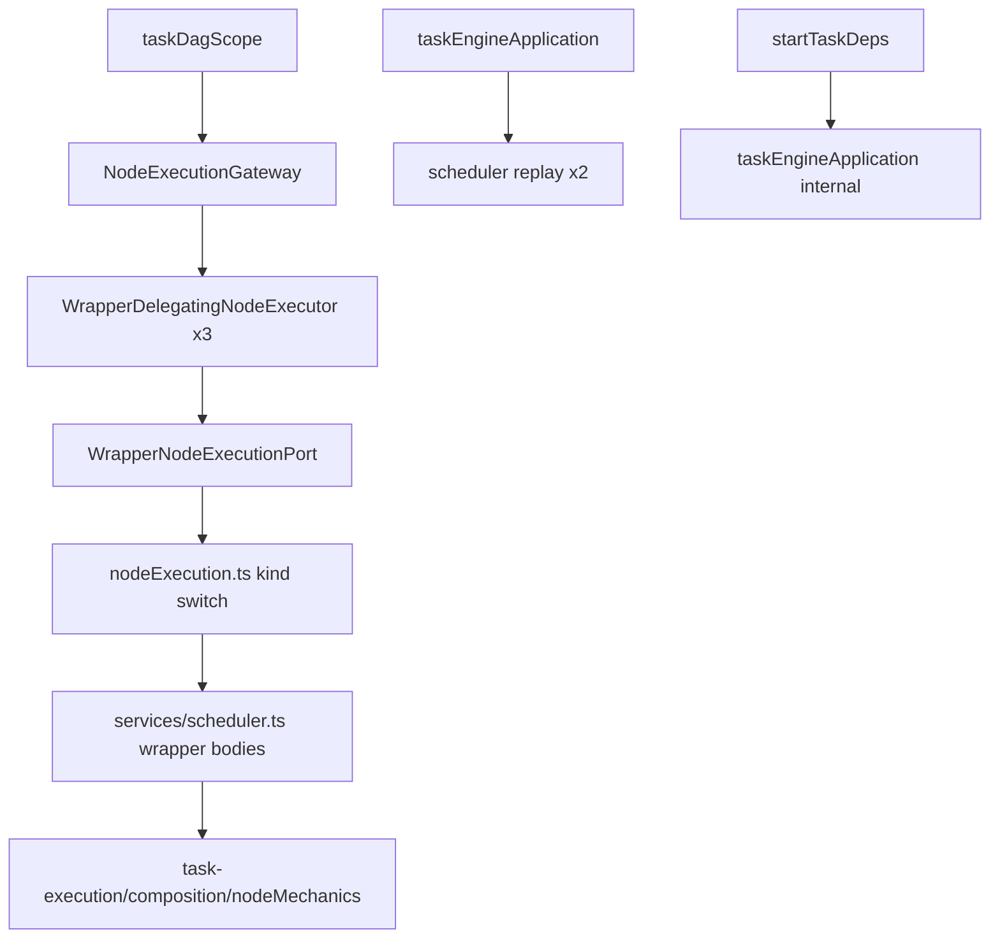
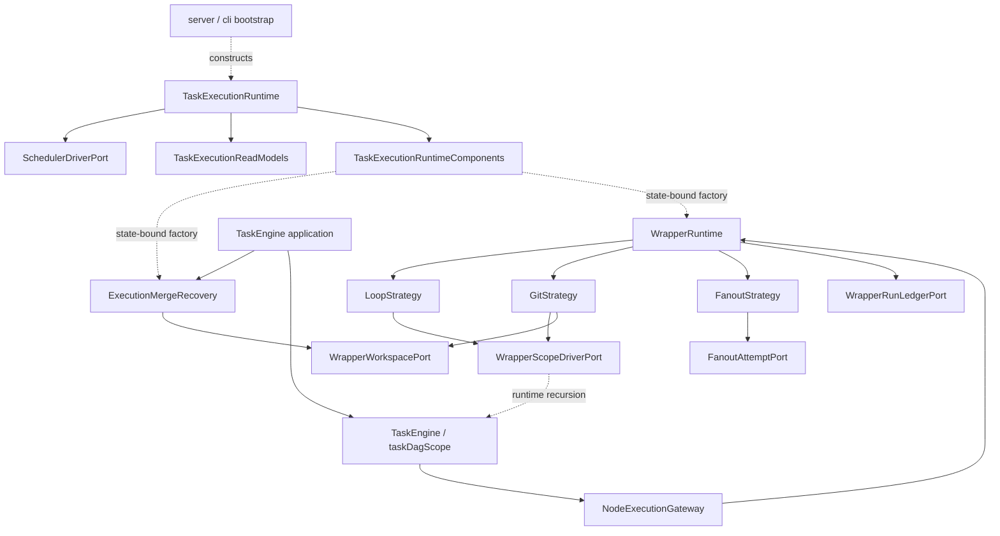

# RFC-339 技术设计 — WrapperRuntime 归位与 wrapper/replay mechanics cutover

- 状态：In Progress；2026-08-28 用户已批准 D1～D10 与 plan T2～T11
- current-source：`251b5d725ef731d15c17a01656fdc827f925e7c7`
- 对齐：RFC-294 `task-execution/engine/wrapper`（W2-D）
- 行为原则：功能逐字保持；不新增安全策略或功能收缩

## 1. 设计不变量

### I1：wrapper kind 与 runtime entry 一一对应

shared `WRAPPER_NODE_KINDS` 是 wrapper kind 的唯一事实源。Runtime registry 可以是独立执行表，但必须编译期/运行时与
shared catalog 双向穷尽，并要求 entry self-kind 与 key 相等。不存在 default/fallback wrapper。

### I2：TaskEngine、WrapperRuntime、NodeExecutor 各有一个 owner

- TaskEngine：root/nested scope frontier、task-level claim/settle；
- WrapperRuntime：wrapper generation、inner-scope orchestration、wrapper row settlement；
- NodeExecutor：普通 node mechanics 与 wrapper entry delegation；
- ExecutionKernel：iso/spawn/retry/merge 等机制。

WrapperRuntime 会通过注入 port 递归 drive nested scope，但源码不能反向 import TaskEngine implementation。

### I3：common shell 只统一真正相同的 phase

统一：open generation、resume、consumed provenance、running、park/terminal、publish、superseded。

不统一：loop exit、git baseline/diff/merge、fanout shard/aggregator。三者不得被压成含大量 optional callback 的“万能策略”。

### I4：持久事实和用户结果不变

`node_runs` / `node_run_outputs` 的 status、cause、iteration、shardKey、parent、progress、merge state、iso columns、output kind、
error/message 与 WS 顺序都保持。W2-D 不拥有 schema/wire 变更权。

### I5：scope index 只有一个

Task snapshot 通过 `analyzeWorkflowScopeTree` 后构造一个 immutable `ExecutionScopeIndex`。WrapperRuntime、nested scope、
NodeExecution request 与未来 W7 scope backfill 都从它取 parent/membership/path，不能另扫 raw `nodeIds`。

### I6：replay 是 execution recovery，不是 wrapper kind

pending merge 与 conflict-human completion 覆盖 agent、script、fanout child、aggregator、wrapper 等 row。它们进入通用
`ExecutionMergeRecovery`，不能伪装成 `ReplayRuntime` 或第四个 wrapper entry。

### I7：bootstrap 唯一装配

只有 daemon/server/test bootstrap 构造 concrete runtime、topology 与 driver。Route/service/helper 只接显式 port，不 import module
internal，不通过全局变量反向取 runtime。

### I8：功能优先

任何“简化”若改变正常输入、结果、错误、恢复、并发或停驻，都不属于本 RFC。安全/限制类 finding 不进入本轮实现门。

## 2. current-source anatomy

### 2.1 当前依赖图



运行调用方向本身合理；问题是源码 owner 形成 `module → legacy scheduler → module internal` 反向链。

### 2.2 canonical W2-D symbol inventory

当前 generator 把以下 scheduler symbol 投影到 W2-D：

| family               | symbols                                                             |
| -------------------- | ------------------------------------------------------------------- |
| common               | `runWrapperNode`                                                    |
| public wrapper entry | `runWrapperLoopNode` / `runWrapperGitNode` / `runWrapperFanoutNode` |
| strategy bodies      | `runLoopWrapperNode` / `runGitWrapperNode`                          |
| fanout attempts      | `dispatchFanoutShard` / `dispatchFanoutAggregator`                  |
| recovery             | `replayPendingMerges` / `replayConflictHumanResolutions`            |

`scheduler.ts:507-3643` 是当前 replay + wrapper owner。`services/wrapperProgress.ts` 与 `services/fanout.ts` 是纯逻辑，虽已
脱离巨型文件，仍处在 legacy 横向层。

### 2.3 current wrapper phase map

#### Common generation/lifecycle

```text
find resumable row
  ├─ found → decode progress → legal resume to running
  └─ absent → compute external consumed map → mint pending → running
        ↓
kind body
        ↓
park / failed / canceled / exhausted / done
        ↓
DB transition first → status publish second

finalization CAS loses to legal canceled/interrupted
  → WrapperSupersededSignal → wrapper outcome
```

#### Loop

```text
validate nodeIds/max/continue/exit
  → resume iteration or 0
  → persist progress
  → drive nested scope
  → bubble cancel/fail/awaiting
  → evaluate exit + output bindings
  → next iteration / done / exhausted
```

#### Git

```text
resume/fresh generation
  → create/rebuild wrapper-private canonical
  → capture or restore per-repo baseline + preDirty
  → drive nested scope
  → bubble cancel/fail/awaiting
  → compute changed paths + wrapper output
  → merge wrapper canonical to task canonical
  → merged / conflict-human / merge-failed
```

#### Fanout

```text
resume/fresh generation
  → resolve wrapper inputs + consumed gate
  → hydrate agents, split shard source, cartesian cap
  → compute scope + deterministic shard keys
  → dispatch current agent-single shards under pool
  → optional single aggregator
  → project outputs / __done__
  → wrapper terminal
```

### 2.4 current recovery order

`taskEngineApplication` 在任何 root scope drive 前依次执行：

1. `replayPendingMerges`；
2. `replayConflictHumanResolutions`；
3. TaskEngine root scope。

顺序是功能合同：frontier 只能看见 replay 后的 `merged` / `conflict-human` / failure 事实。

### 2.5 现有 SCC 事实

canonical report 当前 backend SCC 为：MCP/server、agent family、git/cache family、workflow validator family；repository 另含
frontend conversation 与 shared output-kind 两族。task-execution 不在其中。因此 W2-D 的量化目标是 exact edge extinction 与不回归，
不是虚构一个数值下降。

## 3. 目标目录与职责

```text
packages/backend/src/modules/task-execution/
├── domain/
│   ├── wrapperExecution.ts          # kind、settlement、generation 值对象
│   ├── executionScope.ts            # immutable ExecutionScopeIndex + path
│   ├── wrapperProgress.ts           # 现有 codec 原位迁 owner
│   └── fanoutScope.ts               # 现有 pure shard/scope 算法
├── application/
│   ├── recovery/
│   │   └── executionMergeRecovery.ts
│   └── ports/
│       ├── wrapperRunLedger.ts
│       ├── wrapperScopeDriver.ts
│       ├── wrapperWorkspace.ts
│       ├── wrapperData.ts
│       ├── fanoutAttempt.ts
│       └── wrapperStatusPublisher.ts
├── engine/
│   ├── wrapper/
│   │   ├── wrapperRuntime.ts
│   │   ├── strategySupport.ts
│   │   ├── loopStrategy.ts
│   │   ├── gitStrategy.ts
│   │   └── fanoutStrategy.ts
│   └── node/                         # RFC-334，保持
├── infrastructure/
│   └── sqliteTaskExecutionReadModels.ts
└── composition/
    ├── wrapperRunLifecycle.ts        # DB lifecycle + committed-status publisher adapters
    ├── wrapperMechanics.ts           # scope/workspace/data/fanout concrete adapters
    ├── executionMergeRecovery.ts     # persisted merge replay adapter
    ├── taskExecutionComponents.ts    # state-bound runtime/recovery factories
    ├── wrapperRuntime.ts             # strategy registry composition
    └── taskExecutionRuntime.ts       # bootstrap-facing composition
```

实现发现表明 ledger 与 workspace/fanout mechanics 都依赖同一份 task-bound legacy state；因此它们作为 composition adapter
集中落位，而不是为了目录对称制造只转发的 infrastructure 空壳。禁止把职责重新塞回 `scheduler.ts`。

## 4. scope/container 合同

### 4.1 值对象

```ts
import type { WrapperNodeKind } from './wrapperExecution'

export interface ExecutionScopeSegment {
  readonly wrapperId: string
  readonly kind: WrapperNodeKind
}

export interface WrapperScopeDescriptor<K extends WrapperNodeKind = WrapperNodeKind> {
  readonly wrapperId: string
  readonly kind: K
  readonly parentScopeId: string | null
  readonly directNodeIds: readonly string[]
  /** outermost → current wrapper，未来 W7 按同一顺序持久化。 */
  readonly path: readonly ExecutionScopeSegment[]
}

export interface ExecutionScopeIndex {
  readonly rootNodeIds: ReadonlySet<string>
  readonly parentOf: ReadonlyMap<string, string>
  readonly wrappers: ReadonlyMap<string, WrapperScopeDescriptor>
  scopeOf(nodeId: string): string | null
  pathOf(nodeId: string): readonly ExecutionScopeSegment[]
}
```

### 4.2 构造规则

1. 唯一输入是已经迁到 latest version 的 `WorkflowDefinition`；
2. 调 `analyzeWorkflowScopeTree`，`issues.length > 0` 时在执行前失败；
3. `directNodeIds` 保留 definition 中的稳定顺序，但去重/多 parent 不作容错，直接沿现有 invalid gate 失败；
4. path 从 outermost 到 immediate wrapper；wrapper 自身 descriptor 的 path 包含自己；
5. 不读取 UI 坐标/geometry 推断 containment；
6. 不在 W2-D 写 `node_runs.scope_path`，只冻结可被 W7 backfill 复用的语义。

### 4.3 runtime 使用

`NodeExecutionGateway` 为 wrapper request 从 index 取 descriptor；strategy 不再 `pickStringArray(node,'nodeIds')`。Nested scope drive
只接 descriptor 的 direct membership 与 iteration，fanout boundary 与 provenance 也使用同一个 parent/path。

`ExecutionScopeIndex` 仍是 task-execution domain 内部的完整 owner，不通过 public surface 暴露其 `ReadonlyMap`、root set 或泛型
descriptor。尚在 legacy `services/` 的 node mechanics 只持有 purpose-specific `WrapperExecutionScopeReadModel`：唯一方法
`find(wrapperId, kind)` 返回冻结的 wrapper scope DTO；composition 把该读模型绑定到同一个 index。这样 legacy caller 只依赖 exact
`public/types`，而 runtime membership/path 仍只有一份事实源，也不会为清 R1 边界账本复制第二张 containment map。

## 5. WrapperRuntime 合同

### 5.1 request 与 settlement

```ts
export interface WrapperExecutionRequest<K extends WrapperNodeKind> {
  readonly node: NodeOfKind<K>
  readonly task: { readonly taskId: string }
  readonly scope: WrapperScopeDescriptor<K>
  readonly iteration: number
  readonly execution: { readonly signal?: AbortSignal }
}

export interface WrapperSettlement {
  readonly rowStatus:
    | 'done'
    | 'failed'
    | 'canceled'
    | 'exhausted'
    | 'awaiting_human'
    | 'awaiting_review'
  readonly outcome: NodeStepOutcome
  readonly errorMessage?: string
}
```

`rowStatus` 与 outward `outcome.kind` 分开：例如 loop `exhausted` row 对外仍按 current `failed` scope outcome；不能为了类型漂亮
改用户结果。合法 external canceled/interrupted winner 不伪装成 strategy settlement，而由 ledger 抛出 typed
`WrapperSupersededSignal`，只在 runtime 边界收敛为既有 outcome。

### 5.2 strategy

```ts
export interface WrapperStrategy<K extends WrapperNodeKind> {
  readonly kind: K
  prepare(request: WrapperExecutionRequest<K>): Promise<
    | { readonly kind: 'rejected'; readonly outcome: NodeStepOutcome }
    | {
        readonly kind: 'ready'
        execute(context: OpenWrapperGeneration<K>): Promise<WrapperSettlement>
      }
  >
}
```

`prepare` 只做无需 durable generation 的 validation/hydration；拒绝时保持 legacy “不铸 row、不广播”语义。Strategy 不能自己
mint/resume wrapper row、不能直接广播 wrapper status、不能吞 `WrapperSupersededSignal`。它可以通过具名 port 写 progress/output、
drive scope、操作 workspace 或执行 fanout child。

### 5.3 closed registry

```ts
type WrapperStrategyMap = {
  readonly [K in WrapperNodeKind]: WrapperStrategy<K>
}

export class WrapperRuntime implements WrapperNodeExecutionPort {
  constructor(
    private readonly strategies: WrapperStrategyMap,
    private readonly ledger: WrapperRunLedgerPort,
    private readonly publisher: WrapperStatusPublisherPort,
  ) {}
}
```

实现必须另有 runtime key-set oracle 对拍 shared `WRAPPER_NODE_KINDS`，避免 type assertion 把 drift 藏掉。

### 5.4 common lifecycle template

```text
execute(kind, request)
  1. constructor/runtime assert registry key/self-kind
  2. strategy.prepare(request)
       - rejected → return existing failure outcome, no row/status
  3. ledger.openGeneration(request)
       - exact resumable selection
       - fresh consumed provenance + mint/enter-running
  4. publisher.publish(running) only when ledger entered running
  5. prepared.execute(generation)
  6. ledger.settle(generation, settlement)
  7. publisher.publish(settled)
  8. ledger clears fanout reuse gate only at current terminal points
  catch legal external canceled/interrupted CAS loss
       → read exact winner → superseded outcome
```

DB transition 始终先于 publish。`WrapperSuperseded` 只收敛当前允许的 canceled/interrupted winner，其余 illegal/concurrent transition
继续抛错。

## 6. application-owned ports

### 6.1 WrapperRunLedgerPort

职责：

- exact resumable lookup（task/node/outer iteration）；
- fresh generation consumed provenance；
- mint/enter-running/park/terminal/superseded read；
- terminal 时按既有规则清理 fanout reuse gate。

Port 返回 domain DTO，不泄漏 Drizzle row/table/query builder。Transaction/fence 继续复用现有 task-execution mutation participant。
progress/output 归 `WrapperDataPort`，fanout child/aggregator row 归 `FanoutAttemptPort`；不把这些能力再堆回 ledger bag。

### 6.2 WrapperScopeDriverPort

```ts
interface WrapperScopeDriverPort {
  drive(input: {
    readonly scope: WrapperScopeDescriptor
    readonly iteration: number
    readonly workspace?: WrapperWorkspaceScene
    readonly signal?: AbortSignal
  }): Promise<TaskScopeOutcome>
}
```

Composition 用现有 `runScope` 实现。运行时递归是预期行为；engine/wrapper 不 import `taskDagScope.ts`，从而源码 DAG 不成环。

### 6.3 WrapperWorkspacePort

包装既有 `nodeIsolation` / `isolatedAgentRun` / git primitives，只暴露 wrapper 用途：

- create/rebuild wrapper-private canonical；
- capture/restore per-repo baseline、preDirty 与 pinned trees；
- compute changed paths；
- merge back / complete human resolution；
- discard/keep；
- rebuild physical iso handle for replay。

WrapperRuntime 不 import `node:fs`、Git CLI、Paths 或 raw IsoHandle。

### 6.4 WrapperDataPort

承载 external consumed provenance、upstream input、iteration port read、output binding 与 prior output projection。纯判据（exit condition、
fanout split/scope）留 domain/shared；DB/port artifact read 由 adapter 实现。

### 6.5 FanoutAttemptPort

Fanout 当前 shard/aggregator 是特殊 child rows，不等同普通 ready DAG node。Port 保留当前：

- per-shard/aggregator mint/reuse/attempt；
- concurrency pool；
- existing agent execution assembly；
- salvage/undo/merge disposition；
- clarify/review/abort/result mapping。

W2-D 只迁 owner，不把 child 伪装成 NodeExecutor request。W8 若获批再另行设计 inner-chain。

### 6.6 WrapperStatusPublisherPort

只接已提交的 `{taskId,nodeRunId,nodeId,status}` receipt。W2-D 复用当前 WS publisher；W3 后可把 provider 换成 committed event consumer，
WrapperRuntime 不感知 WS。

## 7. strategy 设计

### 7.1 LoopStrategy

保留：

1. empty inner、missing/invalid max、invalid continue/exit 的 exact failure；
2. 从 `WrapperProgress{kind:'loop',iteration}` 恢复；
3. 每轮 drive direct inner scope；
4. canceled/failed/awaiting 原样 bubble；
5. exit condition 只读当轮 port；
6. output binding 取最终 iteration；
7. `continueOnMaxIterations` 与 exhausted row/outcome 分离；
8. nested scope 使用 wrapper workspace scene，并保持 `scopeRoot` 语义。

Template 负责 row lifecycle；LoopStrategy 负责 iteration/exit/output。任何改变 iteration window 的重构都必须被现有
approve/clarify/revival/nested-loop corpus 捕获。

### 7.2 GitStrategy

保留：

- fresh mint、merged re-entry、mid-generation resume 三种 generation 判据；
- `wrapperProgressJson === null` 才能证明 generation 未开始 inner work；malformed non-null 继续以 over-report、never-drop 回退；
- 每个可写 repo 的 baseline/preDirty map 与单仓 scalar compatibility；
- readonly repo 不进 diff/merge；
- wrapper-private canonical、inner node iso from wrapper canonical、final one-unit merge to task canonical；
- diff failure 显式 failed，不能降为空列表；
- conflict-human 保留 iso，merge-failed 显式失败，clean merge 后 discard；
- `git_diff` 继续是 newline `list<path<*>>`，multi-repo 以 mount path 前缀。

GitStrategy 不自己跑 Git CLI，所有物理操作经 WrapperWorkspacePort。

### 7.3 FanoutStrategy

保留：

- shardSource 必填且必须 `list<T>`；
- empty source 直接 done + current done signal/output；
- deterministic shard split/key de-collision；
- nested expectedShardCount cartesian cap；
- `computeShardScope + applyAutoPromote` pure oracle；
- current v1 inner 只允许 agent-single，aggregator 最多一个；
- non-shard wrapper input 广播到每个 shard；
- per-task fanout pool、retry、cancel、partial failure、reuseDisabled；
- shard/aggregator merge conflict current abandon/failed disposition；
- aggregator output rename 与 wrapper output provenance。

`services/fanout.ts` 的 pure logic 迁 `domain/fanoutScope.ts`；不改函数结果。Runtime 调共享 aggregator/output oracle 时必须走
`findFanoutAggregatorInScope` / `deriveWrapperFanoutOutputsInScope`，只消费 `WrapperScopeDescriptor.directNodeIds`；原 shared raw-definition
入口仅供编辑器/validator 等非 runtime consumer。Strategy 通过 FanoutAttemptPort 使用现有 assembly。

## 8. ExecutionMergeRecovery

### 8.1 API

```ts
interface ExecutionMergeRecovery {
  recoverBeforeScope(): Promise<void>
}
```

Composition 以 `(state, log) => ExecutionMergeRecovery` factory 绑定当前 task/runtime state；TaskEngine application 只持有该 factory
与 application interface，不直接 import replay 实现或 scheduler。

内部顺序固定：

1. pending-merge rows；
2. conflict-human rows；
3. return to TaskEngine。

### 8.2 pending merge

保留 per-repo current HEAD、persisted base/node trees、submodule topology fail-loud、physical iso identity、forced port paths、same merge
agent 与 discard behavior。缺 node tree/submodule topology 继续使 task 明确失败，不能跳过。

### 8.3 conflict-human completion

保留 preserved resolve-iso lookup、allResolved 判据、`complete-human-resolution` transition、未解决继续 parked、resolved 后 discard。

### 8.4 owner

Recovery 位于 task-execution application/recovery，workspace adapter 实现 physical mechanics。它不注册成 wrapper strategy；
TaskEngine application 只依赖 `ExecutionMergeRecovery` interface，不 import scheduler。

## 9. bootstrap 与 topology cut

### 9.1 target composition

```ts
interface TaskExecutionRuntime {
  readonly schedulerDriver: SchedulerDriverPort
  readonly topology: SchedulerRuntimeTopology
  readonly readModels: TaskExecutionReadModels
  readonly wrapperRuntimeFactory: WrapperRuntimeFactory
  readonly mergeRecoveryFactory: ExecutionMergeRecoveryFactory
}

function composeTaskExecutionRuntime(input: BootstrapTaskExecutionDeps): TaskExecutionRuntime
```

只有 `server.ts` / `cli/start.ts` / test composition 调用 concrete runtime factory。runtime 一次性构造并冻结 driver、topology、
read models 与两个 state-bound factory；`buildStartTaskDeps` 改为接收已构造
`SchedulerDriverPort`，不再从 DB 构造 topology。

`public/commands.ts` 暴露的 `InheritableRunConfig` 使用 explicit field interface，并与 `INHERITABLE_RUN_CONFIG_KEYS` 双向 type gate；
不能用 opaque `Pick` 隐藏字段矩阵。`SchedulerRuntimeTopology` 物理定义在 public types，application ports 不反向 import public surface。
Legacy frontier、structural diff 与 workflow validator 只通过 public query 读取 wrapper revival iteration、git baseline 与 exit-condition
validity；legacy mechanics state 只从 public types 读取 immutable execution-scope contract，不新增 service → domain 内部边。

REST 与 MCP 的两套路由表都只接收 `ComposedAppDeps`：`schedulerDriver` 与 `taskExecutionReadModels` 在该 mount boundary 为必填，
并且来自同一份 bootstrap runtime。`createApp` 负责生产 composition；直接构造 MCP dispatcher 的测试必须在 test bootstrap 显式
构造 runtime 后注入两项，不能等到首次 tool call 才暴露漏接，也不能在 `mountApiRoutes` 内临时补装配。

### 9.2 caller migration

current `buildStartTaskDeps` / `createLegacyTaskExecutionTopology` caller 包括 route launch/retry、questions/review/clarify、schedule、webhook、
workgroup、fusion、auto-repair、development automation、digital employee 与 CLI recovery。实施前以 AST/rg 生成完整 caller list；每个
caller 必须显式拿到同一 bootstrap driver 或其 test fixture。

### 9.3 禁止的替代方案

- 在 `public/commands.ts` re-export internal `driveTaskEngineApplication`；
- 按 `(db,transport)` 放 module-global memo；
- 让 route/service import `composition/taskExecutionRuntime`；
- 把 runtime 塞入 `Record<string,unknown>` / optional fallback；
- 缺 driver 时偷偷重建 legacy topology。

### 9.4 source termination adjacent edge

`TaskStopCause` 已是 `public/types.ts` 的正式 type；本 RFC 同批让 `taskStopProjection` 从同一 public surface 提供，scheduler 不再
import domain internal。它不改变 stop code/message，只关闭“scheduler 零 task internal”门。

## 10. cutover 顺序

### 10.1 additive red gates

先添加 source-lock、registry、scope index、phase order、legacy symbol/import extinction 的 red tests；不接 production。

### 10.2 contract + template

迁 pure progress/fanout codec、建 scope index/ports/template；characterization 全绿后仍无 production caller。

### 10.3 per-kind atomic cut

顺序 Loop → Git → Fanout。每个 kind 同一 commit：

1. strategy 完成；
2. registry entry 指向新 strategy；
3. 删除对应 scheduler export/body；
4. exact behavior corpus 通过；
5. 无 legacy fallback。

Common helper 只在最后一个 consumer 迁完时删除，不能复制后留两份。

### 10.4 recovery/topology cut

迁两条 replay、compose runtime、向 caller 注入 driver、删除 legacy topology factory。该批次不改变 W3 status/W5 commit-push owner。

### 10.5 extinction + canonical replay

删除 scheduler 对 nodeMechanics/domain internal import、legacy wrapper files/facades，重放 canonical artifacts。只删除真实消失的 exact
exceptions，不改 denominator/KNOWN 来迎合预期。

## 11. failure modes 与回滚

| failure                           | 预防/结果                                                       |
| --------------------------------- | --------------------------------------------------------------- |
| common template 改了 DB→WS 顺序   | phase-order unit + integration oracle；DB transition 必须先提交 |
| resume 误铸新 wrapper row         | old-progress/in-flight fixture 对拍 exact row id/generation     |
| Git resume 重采 baseline 吞写入   | malformed/non-null、park/resume、merged re-entry 三族分测       |
| fanout reuse 跨 generation 误命中 | reuseDisabled 持久 gate + hash/provenance mutation              |
| scope path 方向/成员漂移          | nested matrix + duplicate/multi-parent/cycle mutation           |
| replay 在 frontier 后执行         | source order guard + crash recovery integration                 |
| bootstrap caller 漏 driver        | exhaustive caller/source lock；不允许 optional fallback         |
| implementation 需要新限制         | 立即停止，更新能力影响并重新请批                                |

无 schema migration。回滚按 per-kind 正常反向 commit 恢复唯一 legacy entry；不能同时保留双 runtime，也不使用 feature flag。
若新进程已消费旧 progress，回滚仍读同一 codec/row/iso path。

## 12. 测试与架构棘轮

### 12.1 source/closed-set

- 3 wrapper kind 与 strategy key/self-kind equality；
- 10 个 scheduler W2-D symbols 开工基线，完成后 0；
- current bridge/reverse import exact list，完成后 0；
- missing/extra/wrong-kind/legacy-import mutation。

### 12.2 unit

- scope index direct parent/path/nesting/invalid tree；
- wrapper progress old payload/unknown forward field/malformed fallback；
- common lifecycle fresh/resume/park/terminal/superseded phase；
- loop exit/max/output；fanout scope/key/cap/reuse；Git baseline/preDirty projection。

### 12.3 integration regression

至少覆盖现有：

- `scheduler-wrapper-scope-dependencies`；
- `scheduler-rfc040-wrapper-await`；
- RFC-095/098/130/144 wrapper revival/private-canonical/stale/replay；
- RFC-187/193/210/230/248/287 fanout/git merge/review/multi-repo；
- fanout empty/shard/aggregator/concurrency/resume/collision/failure；
- loop exit/cycle/nesting/approve/clarify；
- pending merge、submodule、conflict-human、daemon restart/cancel/retry。

### 12.4 architecture

- engine/wrapper 禁 scheduler/DB schema/Hono/WS/AppDeps/LegacyTaskMechanicsState；
- scheduler 禁 task-execution internal；
- `nodeExecution.ts` 禁 scheduler wrapper import；
- `taskEngineApplication.ts` 禁 scheduler replay import；
- `startTaskDeps.ts` 禁 module internal/topology construction；
- canonical exceptions 精确减项、无新增 KNOWN；
- task-execution 不进入 SCC，global SCC 不高于 `4/6`。

### 12.5 hosted closeout

遵仓库现行规则，不要求本地 Bun 全量门禁。发布后按 exact SHA 跟踪主 CI 到 terminal success，并重新枚举当时仓库所有
`on.schedule` workflow，逐条 dispatch/验证全部 jobs terminal success。ancestor/queued/cancelled 不算证据。

## 13. 目标依赖图



源码方向保持 acyclic：`engine/wrapper → domain/application ports`，composition/infrastructure 实现 ports；runtime recursion 通过
注入 interface，不形成 import cycle。

## 14. 与 RFC-294 的关系

本 RFC 只关闭 W2-D：

- W2-A TaskExecution topology：RFC-331 Done；
- W2-B TaskEngine：RFC-332 Done；
- W2-C NodeExecutorRegistry：RFC-334 Done；
- **W2-D WrapperRuntime：RFC-339 In Progress，已批准实施**。

完成后 W3 才能另行启动 committed lifecycle events/common continuation；W4/W5/W6/W7/W9 仍按 RFC-294 DAG 独立批准。W8 继续可选且
只能在 W7 后另立新号。
