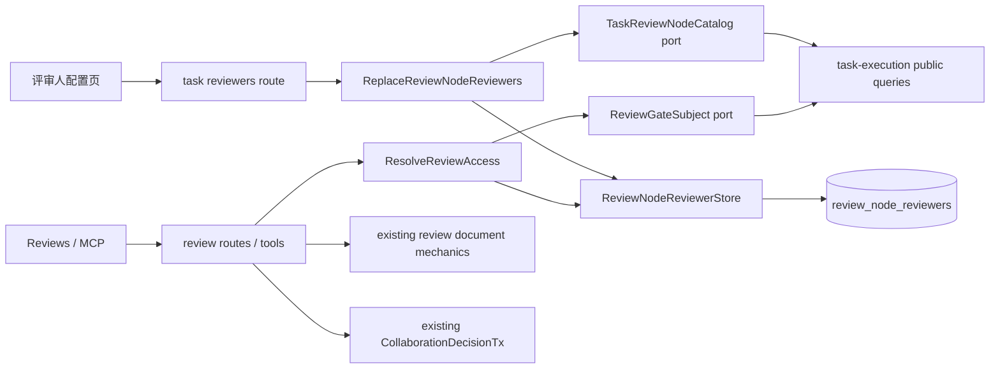

# RFC-340 技术设计 — 节点级意见型评审人授权与配置

- 状态：In Progress；候选实现完成，等待共享 main 同步、全门与 exact-SHA CI
- current-source：`5128efad55ba55fc95205c6dfd9b148916a181d1`
- 目标 owner：RFC-294 `modules/collaboration`
- 行为原则：扩展 assigned reviewer 的节点级意见能力；既有任务成员能力不回退

## 1. 设计不变量

### I1 — assignment identity 是 frozen review node

授权键是 `(taskId, reviewNodeId, reviewerUserId)`，不是 `nodeRunId` 或 `docVersionId`。同一 frozen review node 的新 iteration、
round、multi-document member、wrapper / shard node run 自动继承同一集合，不需要每次运行复制 assignment。

### I2 — reviewer assignment 不授予 task visibility

assignment 不写 `task_collaborators`，也不改变 `canViewTask`。reviewer 的入口只有 reviews list / detail / versions / rounds 和 comment
write；task detail、node runs、logs、diff、clarify、task WS 继续按原任务关系判定。

### I3 — comment 与 decision 是两种能力

`canAddComment` 不能推导出 `canSelectDocuments` 或 `canDecide`。尤其 `POST decision` 的 batch comments 仍属于 decision command；
assigned reviewer 不能以“只带 comments、不带有效决策”的方式进入该事务。

### I4 — 状态判据与 actor 判据正交

access projection 描述 actor 与目标 gate 的关系；pending / historical / decided 再限制当前可执行动作。前端和后端都按
`relation capability AND gate state` 判定，不能只靠按钮 disabled。

### I5 — 现有关系取并集，不做降级

先计算既有 task visibility / acting membership / admin bypass，再叠加 node assignment。observer + assigned reviewer 仍看整任务，但
只在被指派节点能评论；collaborator + assigned reviewer 继续拥有 collaborator 的 selection / decision 权。

### I6 — collaboration 是唯一策略 owner

`collaboration` 拥有 reviewer assignment、review access resolution 和 comment capability。task-execution 只通过 public query 提供
frozen node catalog 与 nodeRun → task / node identity；routes、MCP 和 frontend 不各自重写角色矩阵。

### I7 — 不改变人工门决策事务

RFC-333 `submitReviewDecision` / `CollaborationDecisionTx` 仍只接受 existing acting task member / admin。新增 reviewer 不进入 decision
manifest、receipt、continuation intent 或 scheduler。

## 2. 目标架构



### 2.1 目录与职责

```text
packages/backend/src/modules/collaboration/
├── domain/
│   └── reviewAccess.ts
│       # relationship、capability matrix、role union；无 DB / Hono
├── application/
│   ├── reviewNodeReviewers.ts
│   │   # config / single gate / batch list use cases
│   └── ports/
│       ├── reviewNodeReviewerStore.ts
│       └── reviewTaskAccess.ts
├── composition/
│   └── reviewNodeReviewerDependencies.ts
│       # legacy task relationship adapter + sqlite store + task-execution public read models
├── infrastructure/
│   └── sqliteReviewNodeReviewerStore.ts
└── public/
    ├── commands.ts
    ├── queries.ts
    └── types.ts
```

- `routes/tasks.ts` 的配置端点只 parse schema、构造 actor input、调用 public command / query、映射错误。
- `routes/reviews.ts` 只消费 `resolveReviewAccess` 的结果；RFC-326 MCP 工具继续 dispatch 同一 REST route，不复制判据；route / MCP
  均不得直接 join assignment 表。
- `services/review.ts` 继续拥有正文、锚点、意见行和版本 / 决策 mechanics；它接收已经解析的 comment authz，不成为 assignment owner。
- task-execution 的 catalog / subject 实现在既有 `sqliteTaskExecutionReadModels.ts` 内，经 public query interface 注入；collaboration 不 import
  task-execution internal。
- `createApp` 在 bootstrap 用同一份 task-execution read models 建立 `collaborationContext`；`ComposedAppDeps` 将 context、driver 与
  read models 一并设为 REST / MCP mount 的必填依赖。direct-dispatch 测试在 test bootstrap 显式装配，`mountApiRoutes` 不保留 fallback。
- 不借本 RFC 把全部 legacy review service 一次性搬家；新增能力从第一天落在目标 context。

### 2.2 task-execution 的窄 public vocabulary

collaboration 需要两个只读事实：

```ts
type TaskReviewNodeDescriptor = Readonly<{
  taskId: string
  reviewNodeId: string
  title: string
  description: string
}>

type ReviewGateSubject = Readonly<{
  nodeRunId: string
  taskId: string
  reviewNodeId: string
}>
```

task-execution public queries 提供：

- `listTaskReviewNodeDescriptors(taskId)`：从 task frozen workflow snapshot 返回全部 `kind='review'` 节点；
- `getReviewGateSubject(nodeRunId)`：从 canonical node run / doc projection 返回 task 与 frozen review node identity。

这些 query 不返回 task logs、输出正文或运行内部状态。collaboration 只能经 public entrypoint 使用，不能 import task-execution
infrastructure / schema helper。

## 3. 持久化

### 3.1 新表

```sql
CREATE TABLE review_node_reviewers (
  task_id             TEXT NOT NULL REFERENCES tasks(id) ON DELETE CASCADE,
  review_node_id      TEXT NOT NULL,
  reviewer_user_id    TEXT NOT NULL REFERENCES users(id) ON DELETE RESTRICT,
  assigned_by_user_id TEXT NOT NULL REFERENCES users(id) ON DELETE RESTRICT,
  assigned_at         INTEGER NOT NULL,
  PRIMARY KEY (task_id, review_node_id, reviewer_user_id)
);

CREATE INDEX idx_review_node_reviewers_actor
  ON review_node_reviewers(reviewer_user_id, task_id, review_node_id);

CREATE INDEX idx_review_node_reviewers_node
  ON review_node_reviewers(task_id, review_node_id);
```

`review_node_id` 来自 task frozen JSON snapshot，当前没有独立 workflow-node relation，故不造伪 FK。写 command 必须用
`TaskReviewNodeCatalog` 验证 node 存在且 kind 为 review。

### 3.2 不复活旧表 / 旧角色

- 不恢复 RFC-036 `node_assignments(kind, user_id)`；旧表是单人且把 reviewer 当决策者。
- 不给 `task_collaborators.role` 增 `'reviewer'`；否则会被现有任务 visibility 查询解释为整任务成员。
- 不迁移历史任务为“默认 reviewer = owner”；owner / collaborator 已有完整 review 权，不需要冗余 assignment。

### 3.3 replace 语义

PUT 使用完整替换，跟现有 task members 面一致：

1. 读 frozen review-node catalog；
2. 拒绝重复 node、重复 user、非 review node、未知 / 非 active user；
3. 把 request 归一化成按 `reviewNodeId, userId` 排序的集合；
4. 单事务删除该 task 旧 assignment 并插入新集合；
5. 返回重读后的 canonical config。

`nodes: []` 表示清空全部 reviewer。last-write-wins 与现有 members PUT 一致，本 RFC 不另造 revision/CAS 协议。

用户后来被 disabled 时保留 assignment 行和历史署名；配置页显示 disabled 状态供 owner 移除。disabled session 的既有登录失效语义
不在本 RFC 改动。

## 4. shared contracts

### 4.1 配置 wire

```ts
export const ReviewNodeReviewerSelectionSchema = z.object({
  reviewNodeId: z.string().min(1),
  reviewerUserIds: z.array(z.string().min(1)).max(256),
})

export const ReplaceReviewNodeReviewersBodySchema = z.object({
  nodes: z.array(ReviewNodeReviewerSelectionSchema).max(256),
})

export const ReviewNodeReviewerConfigNodeSchema = z.object({
  reviewNodeId: z.string(),
  title: z.string(),
  description: z.string(),
  reviewers: z.array(UserPublicSchema),
})

export const ReviewNodeReviewerConfigSchema = z.object({
  taskId: z.string(),
  nodes: z.array(ReviewNodeReviewerConfigNodeSchema),
  canManage: z.boolean(),
})
```

返回节点顺序与 frozen workflow snapshot 的 review node 顺序一致；reviewer 按 display name / username 稳定排序。后端仍独立验证，
不依赖 UI 过滤。

### 4.2 review access projection

```ts
export const ReviewAccessScopeSchema = z.enum(['task', 'review-node'])

export const ReviewCapabilitiesSchema = z.object({
  scope: ReviewAccessScopeSchema,
  canAddComment: z.boolean(),
  canEditOwnComments: z.boolean(),
  canDeleteOwnComments: z.boolean(),
  canManageAnyComments: z.boolean(),
  canSelectDocuments: z.boolean(),
  canDecide: z.boolean(),
})

export const ReviewDetailSchema = ExistingReviewDetailSchema.extend({
  capabilities: ReviewCapabilitiesSchema,
})
```

`scope='task'` 表示调用者已有 task visibility，页面可以保留 task detail link 与 task WS；`scope='review-node'` 表示只能渲染最小
review surface。capabilities 是 actor 关系能力；UI 还要与当前 `awaiting / historical / decided` mode 取 AND。

### 4.3 review-specific author role

```ts
export const ReviewAuthorRoleSchema = z.union([TaskActorRoleSchema, z.literal('reviewer')])

ReviewCommentSchema.authorRole = ReviewAuthorRoleSchema.nullable().optional()
```

`DocVersion.decidedByRole`、clarify submitted role、WS task actor role 继续使用 `TaskActorRoleSchema`；reviewer 永远不能成为 decider，
所以不能扩大这些全局 union。

## 5. access resolution

### 5.1 单节点 query

```ts
resolveReviewAccess(context, {
  actor,
  nodeRunId,
}): Promise<ReviewAccess | null>
```

解析顺序：

1. 用 `ReviewGateSubjectReader` 得到 `(taskId, reviewNodeId)`；
2. 计算现有 `canViewTask`、acting membership、owner role、admin / bypass；
3. 查询 `(taskId, reviewNodeId, actor.userId)` assignment；
4. 按矩阵合并能力；
5. 既无 task visibility 又无 assignment 时返回不可见；route 保持 current-source 的 missing-nodeRun 同形响应。

### 5.2 能力计算表

| relationship            | scope       | add | edit own | manage any | select | decide |
| ----------------------- | ----------- | --: | -------: | ---------: | -----: | -----: |
| owner                   | task        |   ✓ |        ✓ |          ✓ |      ✓ |      ✓ |
| collaborator            | task        |   ✓ |        ✓ |          — |      ✓ |      ✓ |
| observer                | task        |   — |        — |          — |      — |      — |
| assigned reviewer only  | review-node |   ✓ |        ✓ |          — |      — |      — |
| admin / existing bypass | task        |   ✓ |        ✓ |          ✓ |      ✓ |      ✓ |

多个 relationship 命中时逐列 OR；`scope` 只要已有 task visibility 就取 `task`。

### 5.3 batch list query

reviews list / pending count 不能逐行调用单节点 query。infrastructure 一次取候选 summaries 后：

- task-visible 分支沿用当前批量 task membership 投影；
- assigned 分支一次查询 `review_node_reviewers WHERE reviewer_user_id = actor`，按 `(taskId, reviewNodeId)` 建 set；
- 保留满足任一分支的 summary；
- 去重后再分页 / 计数，避免同一用户兼具 task membership + assignment 时重复。

分页必须在 actor-visible 集合上进行，不能先对全局候选 limit 再过滤，否则 reviewer 会得到稀疏或错误页。

## 6. HTTP 与 MCP

### 6.1 配置端点

| method | path                           | actor              | response                                |
| ------ | ------------------------------ | ------------------ | --------------------------------------- |
| GET    | `/api/tasks/:taskId/reviewers` | task owner / admin | `ReviewNodeReviewerConfig`              |
| PUT    | `/api/tasks/:taskId/reviewers` | task owner / admin | replace 后的 `ReviewNodeReviewerConfig` |

PUT 使用现有 route registry / body parser / permission envelope；最大节点与 reviewer 数由 shared schema 给出。因为路径在
`/api/tasks/*` 且用户未要求代理管理 assignment，本轮不新增 MCP parity tool。

### 6.2 现有 review reads

下列 REST 与 RFC-326 MCP query 均改为消费 `resolveReviewAccess` / batch visible query：

- list、pending count；
- detail；
- versions、version detail；
- rounds；
- `list_pending_gates` / `get_review` 等对应 MCP read。

assigned reviewer 能读取被指派节点的 current / historical body、全部 comments、multi-doc summaries 和 selection 状态；不能通过这些
response 获得 task logs / diff / sibling node data。

### 6.3 comment writes

新增 `requireReviewCommenter`：

- task owner / collaborator / admin：保持当前可加意见；
- assigned reviewer：仅被指派节点可加；写入 `authorRole='reviewer'`；
- observer / unrelated actor：不可加。

PATCH / DELETE 先要求 comment capability，再沿用服务层作者规则：

```text
owner or resourceAclBypass → any comment
else comment.author == actor.userId → own comment
else → reject
```

`add_review_comment` MCP 走相同 command，不复制一套 reviewer 判据。

### 6.4 selection 与 decision

- PATCH selection 继续只认 existing acting task member / admin；
- POST decision 继续只认 existing acting task member / admin；
- `submit_review` MCP 同上；
- decision body 内的 batch comments / selections 只随一次合法 final decision 执行，不接受 reviewer-only actor。

这保证“只能加评审意见”不会被 batch API 扩大成隐含决策权。

## 7. 前端

### 7.1 独立配置页

新增 `/tasks/:taskId/reviewers`：

- task detail header 仅在 members query `canManage=true` 时显示“评审人配置”；
- 页头有返回任务、标题和常驻说明：“评审人仅能查看对应节点并提交意见，不能通过、重新生成、退回或选择文档”；
- 每个 frozen review node 一张 section card：title、description、`reviewNodeId`、reviewer chips、多选 `UserPicker`；
- picker 结果和已选 chip 同时标注该用户现有 owner / collaborator / observer 关系；owner / collaborator 保留更强能力的提示常驻可见；
- 没有 review node 时使用共享 `EmptyState`；
- 保存期间显示 pending，失败在节点 / 页面字段附近展示；所有规则初始可见，不把约束只藏在 disabled button 中；
- 390px 使用单列、全宽 picker 与底部操作区；1280px 保持节点信息和人员选择的清晰层级；
- 使用共享 `PageHeader`、`Field`、`UserPicker`、`StatusChip`、`ConfirmButton` / `Button`，不造同义 primitives。

页面载入 / 保存 403 时使用现有无权限状态；assigned reviewer 没有 task detail，所以不会看到配置入口。

### 7.2 review detail 能力驱动

single-doc 与 multi-doc 共同消费 `detail.capabilities`：

- comment composer：`mode === awaiting && canAddComment`；
- comment edit：`mode === awaiting && (comment.author === actor.id && canEditOwnComments || canManageAnyComments)`；
- comment delete：`mode === awaiting && (comment.author === actor.id && canDeleteOwnComments || canManageAnyComments)`；reviewer 的 `canDeleteOwnComments=false`；
- copy：任何可见评论都保留；
- per-doc selection bar 与 Q / W hotkeys：`mode === awaiting && canSelectDocuments`；
- approve / iterate / reject controls 与快捷键：`mode === awaiting && canDecide`；
- rerun preview 只作为 decision control 的附属面，不向 reviewer 单独暴露操作入口。

这会同时修复 current-source “所有 pending comment 都显示 edit / delete，点后才 403”的失真。

### 7.3 节点级页面壳

当 `scope='review-node'`：

- task title / workflow title / node title仍可作为最小上下文显示；
- task title不渲染为 `/tasks/:taskId` 链接；
- 不发 task detail、node runs、diff 等 query；
- `useTaskSync(null)`，不连接 `/ws/tasks/:taskId`；
- detail / documents / comments 延续现有 8 秒 polling，multi-doc 页面补齐同一 cadence；写成功后立即 invalidate 当前 review query。

当 `scope='task'` 时保持当前 task link 与 task WS 行为。

### 7.4 inbox 与 attribution

- `/reviews` 和 pending badge 使用 server actor-filtered 结果，因此 reviewer 只看到 assigned nodes；
- comment attribution 支持“评审人”chip；existing owner / user / admin / manager 文案不变；
- assignment 被移除后，下一次 list poll 删除条目；已打开页面下一次 detail poll 进入现有 not-found / no-permission state。

## 8. 状态与生命周期

### 8.1 新 task / 未到达节点

task 创建后 frozen snapshot 已存在，owner 可立即配置尚未执行的 review node。assignment 与 node run 解耦，所以无需等待
`awaiting_review`。

### 8.2 iterate / reject / new round

decision 产生新 run / round 时不复制 reviewer rows。新 gate 只用 `(taskId, reviewNodeId)` 重新解析当前集合；此前 reviewer 自动看到新轮。

### 8.3 task terminal

task done / canceled 不删除 assignment；reviewer 仍可读被指派节点历史，但所有 comment / selection / decision 写均因 gate state 只读。
task 删除时 FK cascade 删除 assignment，review docs 随既有 task delete 语义处理。

### 8.4 assignment change during pending review

- add：新 reviewer 下一次 inbox / detail query 可见并可评论；
- remove：下一次 read / write 即失去 reviewer relationship；
- 不自动撤回、隐藏或改署名既有评论；
- 不暂停 gate、不改变 pending 状态、不自动触发 continuation。

## 9. migration 与兼容

1. 使用实施时 next available migration 编号，避免与共享 main 的并发 migration 争号。
2. migration 只加 `review_node_reviewers` 与 indexes，无 backfill、无 task / doc / comment 重写。
3. API 变化是新增配置端点和 ReviewDetail additive capabilities；同版本 frontend / backend 一起切换。
4. 历史 comment 的 `authorRole` 仍可为 null / 既有 TaskActorRole；`'reviewer'` 只出现在新写行。
5. 现有 PAT / session permission 点保持 `tasks:read` / `tasks:execute`；assignment 是 review 行级功能判据，不新增 coarse permission。
6. 无 review nodes 的 task、旧 task、single-doc、multi-doc、legacy round 均保持可读。

## 10. 测试设计

### 10.1 shared / domain

- config schema：空集合、多人、多节点、duplicate、limit、invalid shape；
- `ReviewAuthorRoleSchema`：既有四种 + reviewer + null history；
- relationship matrix exhaustive test；组合角色 OR test；missing relationship test。

### 10.2 backend

- owner/admin GET / PUT；collaborator / observer / reviewer 禁止管理；
- active user / disabled user / unknown user / non-review node / duplicate normalization；
- list + pending count 在分页前正确 union task-visible 与 assigned nodes；
- single-doc / multi-doc / versions / rounds / historical reads；
- reviewer add + own edit；delete 与他人意见编辑均禁止；owner/admin manage-any 不回退；
- reviewer selection / approve / iterate / reject / decision-batch comments 全部零效果；
- assignment add/remove/re-add 与 current/future iteration；
- task delete cascade；role snapshot `reviewer`；
- MCP list/get/add-comment/submit-decision 与 REST 同矩阵；
- architecture test：route 不直接读 assignment table；collaboration 不 import task-execution internal。

### 10.3 frontend

- config page load / edit / save / error / empty；
- capability-driven single-doc / multi-doc controls；
- reviewer 只看到自己意见的 edit，所有意见均可 copy，delete 全部隐藏；
- reviewer 不注册 Q/W 或 decision hotkeys；
- review-node scope 不渲染 task link、不调用 task queries、不连 task WS；
- reviewer attribution chip；
- 390px keyboard/focus/user-picker journey 与 1280px layout。

### 10.4 E2E

两名 reviewer + 一名 collaborator：

1. owner 在独立页按两个节点配置不同 reviewer 集合；
2. reviewer A inbox 只见节点 A，读全部意见，写 / 改自己的意见；
3. reviewer A 看不到 reviewer B 的节点，不能改 B 意见、selection 或 decision；
4. collaborator 看全部意见并完成 selection + iterate / approve；
5. owner 移除 reviewer A 后，A 的入口消失、直链失效、旧意见保留；
6. narrow viewport / keyboard / focus / error state 有真实浏览器断言。

## 11. 风险与取舍

### R1 — “reviewer”被误做成 task role

对策：schema 和 table 命名都用 `review_node_reviewers`；architecture test 禁止向 `TaskCollaboratorRoleSchema` 加 reviewer；UI 文案明确
“节点评审人”。

### R2 — route 继续各写一份授权条件

对策：单节点与 batch access 都由 collaboration public query 提供；REST / MCP 只消费 capability，不 join assignment。

### R3 — 前端藏按钮但快捷键仍能写

对策：controls、mutations、keyboard registration 三处都消费同一 capabilities；backend 仍独立拒绝。

### R4 — task WS 扩大 reviewer 可见面

对策：review-node scope 不订阅 task channel；使用现有 bounded polling。本轮不扩 WS 协议。

### R5 — 同一节点多 run 的身份漂移

对策：assignment 永远匹配 frozen `reviewNodeId`；nodeRun / docVersion 先解析 canonical subject，禁止用 title 或当前 workflow 草稿匹配。

### R6 — full replace 漏节点

对策：response 永远返回全部 frozen review nodes；UI 始终保存完整 map；保存确认和回读使用 canonical response。与 task members 同样采用
last-write-wins，不在本轮引入另一套 revision 协议。

## 12. 实施影响面（预估）

| 层             | 影响                                                                             |
| -------------- | -------------------------------------------------------------------------------- |
| shared         | reviewer config schema、review capabilities、ReviewAuthorRole                    |
| migration / DB | 新 assignment table + indexes；schema export                                     |
| collaboration  | domain policy、commands / queries / ports / sqlite adapter / public surface      |
| task-execution | 两个窄只读 public query / adapter，不改 runtime behavior                         |
| routes / MCP   | config endpoints；review reads / comment writes 接 capability；decision 不扩权   |
| frontend       | 独立配置 route；review UI capability-driven；polling / task-link scope；i18n     |
| tests / E2E    | capability matrix、assignment lifecycle、multi-user journey、architecture guards |

不修改 scheduler、review node definition、decision transaction、continuation intent 或 workflow execution semantics。
