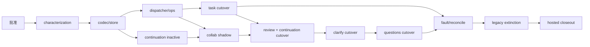

# RFC-341 实施计划 — 生命周期已提交事件与协作命令收口

状态：Draft（2026-08-29）；T0～T1 已完成，T2 用户生产批准门待通过，T3 以后不得提前实施。

current-source pin：`1947e1ad02d3eb3f8a0c062f2a2f42a1ce5f61ce`。

## 1. 实施原则

1. 只在共享 `/Users/wangbinquan/dev/proj/agent-workflow` primary checkout 的 `main` 工作；不建 branch/worktree/stash，
   精确保留所有并发产物。
2. RFC-341 是 RFC-294 W3 的完整 successor；只完成部分 family 不标 W3 Done。
3. 用户“按推荐”已确认范围与产品语义，不等于批准 schema/生产 cutover；T2 必须再次明确通过。
4. 每个 family 按 `legacy → shadow → dispatchable → legacy extinction` 前进；同一 epoch 只能一个 active delivery owner。
5. 正常路径保持 `commit < immediate projection/nudge < response`；request 不等待 long effect 或 continuation drive。
6. 任何正常功能、wire、frame、顺序、恢复结果变化先停下修订 RFC，不以架构整洁覆盖兼容事实。
7. W3-owned worker 从出生符合 managed definition，但不迁其他 background jobs、不领取 W9 credit。
8. 本轮只做功能、恢复、顺序与用户可见行为；不做任何安全类检查、加固或测试。
9. 不跑本地 Bun 全量门；本地只做 source/diff/文档一致性等轻检查，最终以每个 cutover exact-SHA GitHub CI 与相关 hosted
   fault/browser workflow 为权威。
10. canonical architecture artifact 只由仓内 generator 重放；不手改 digest、分母或 exception 数字。

## 2. 开工 baseline 与必须重采项

T3 开始前必须重新 fetch/sync，确认 source pin 或记录新 pin，并重采：

| family | 必须锁定的 current facts |
| --- | --- |
| task writer | `writeTaskStatusTx`、`enqueueTaskLifecycleEventTx`、所有 companion node/workspace/source-termination writers |
| task pilot | `task_lifecycle_event_outbox` schema、publisher claim/retry/dead-letter、Event Center projection、delete/cascade handling |
| task side effects | `emitTaskStatus` caller、`webSocketTaskStatusPublisher`、terminal hook/watch、child budget、prune、terminal sweep |
| collaboration transaction | RFC-333 open/decision participants、operation receipt、continuation intent、slow sibling/deferred question handoff |
| request wake | reviews/clarify/taskQuestions routes、CLI/test composition 与 `wakeHumanGateContinuation` production caller |
| collaboration WS | review open/comment/selection/decision、clarify answer/defer、question dispatch/answer direct broadcaster |
| workers | Event Center loop、maintenance `humanGateRecovery`、`ManagedWorkerDefinition` / `BackgroundJobDefinition` contracts |
| UI | Event Center events/deliveries page、filters/state/error DTO 与 route family |
| compatibility | REST/MCP result fixtures、WebSocket frame fixtures、current publish-before-response tests或可观测 oracle |

若 live inventory 改变 event schema、consumer分类、cutover或正常顺序，先更新 proposal/design并重新请批。

## 3. 任务分解

### T0 — current-source 调研与 successor 选题（Done）

- [x] fetch/sync shared `main`，确认 `main == origin/main == 1947e1ad0`、worktree/index clean；
- [x] 读取 RFC-294 W3、RFC-328/333/339 与 current Event Center/lifecycle/collaboration source；
- [x] 确认 RFC-339 已关闭 W2-D，W3 是下一架构节点；
- [x] 确认 RFC-341 编号未占用；
- [x] 识别 task outbox pilot、ambient side channels、request-owned wake、collaboration direct broadcasts与Event Center可见性缺口；
- [x] 明确 RFC-333 transaction 已完成，不在 W3 重做。

### T1 — 产品口径确认与 RFC 三件套（Done）

- [x] 用户确认完整 W3 一份 RFC：task lifecycle + review/clarify/questions 全部 current direct-broadcast writes；
- [x] 用户确认保持 `DB commit → immediate WS/wake nudge → HTTP response`；
- [x] 用户确认持续 worker 接管 continuation，request只返回 committed receipt；
- [x] 用户确认运维复用 Event Center 原页面；
- [x] 用户确认本轮只做功能/恢复/顺序，不做安全类工作；
- [x] 写 proposal/design/plan并登记 design index、STATE与RFC-294 successor；当前仅本地落盘，未commit/push。

### T2 — 用户生产实施批准门（Pending）

- [ ] 用户批准 proposal D1～D12；
- [ ] 用户批准 design §4～§13 的 schema、worker、cutover、Event Center与failure model；
- [ ] 用户批准 T3～T14 的顺序与 legacy 删除；
- [ ] 再次确认批准只覆盖 RFC-341/W3，不自动启动 W4以后 wave；
- [ ] 记录批准原文、日期与批准时 live source pin。

退出：只有明确“批准实施 RFC-341”或同义无歧义授权后才可修改 production/test/schema。

### T3 — characterization、source-lock 与 red architecture gates（Pending，Deps: T2）

- [ ] 重采 §2 全部 inventory与 live source pin；
- [ ] 建 `rfc341-current-lifecycle-event-inventory` 锁 writer/pilot/publisher/side-channel exact symbols；
- [ ] 建 collaboration route/wake/broadcaster inventory与 operation→event-family矩阵；
- [ ] 为 current HTTP/MCP response、task/review/clarify/questions WS frame与发送顺序补 golden fixtures；
- [ ] 锁 RFC-333 open/decision/intent/recovery/slow sibling/deferred question current行为；
- [ ] 新 architecture gates 先只因 canonical store/producer/consumer/worker尚未存在而 red；current功能 characterization必须绿；
- [ ] mutation证明 missing writer、extra broadcaster、wrong codec、response-first、worker no-stop 可被抓出。

退出：库存与兼容 oracle 可重放；无“凭记忆迁移”的 production edit。

### T4 — closed codecs、neutral store 与 cutover ledger（Pending，Deps: T3）

- [ ] 落 task/collaboration closed union与 exact codec registries；
- [ ] 落 producer consumer manifests与 bootstrap self-check；
- [ ] migration 新增 aggregate heads、committed events、deliveries、family cutovers；
- [ ] 四个 family 初始化 `legacy/epoch=1`，production行为不变；
- [ ] 实现 transaction sequence allocation、canonical bytes/digest、same-id replay/conflict；
- [ ] 实现 context-owned transaction participants与中性 SQLite store port；
- [ ] Event/delete/cascade/backup/restore schema路径纳入新表；
- [ ] migration upgrade/downgrade fixture与old DB fixture通过 hosted migration jobs。

退出：schema/codec/store存在但无 dispatchable event、无 production caller cutover。

### T5 — dispatcher、AfterCommitEventPump 与 Event Center 运维面（Pending，Deps: T4）

- [ ] 实现 per-consumer delivery row、claim epoch/lease/FIFO/retry/dead-letter；
- [ ] 实现 `CommittedEventDispatcherWorker` managed definition与bounded shutdown；
- [ ] 实现 `AfterCommitEventPump`，只允许 exact event projection+nudge；
- [ ] 接 Event Center publication consumer，保 current task public event v1；
- [ ] 扩 Event Center backend DTO/query/retry CAS；
- [ ] 扩现有前端页面的 stage/family/aggregate/consumer/attempt/error/retry，不建新页面；
- [ ] fault tests覆盖effect/settle crash、lease expiry、poison isolation、manual retry race；
- [ ] dispatcher SQL/source guard证明 shadow event永不可claim；
- [ ] workers保持 production inactive，family仍为legacy。

退出：机制/运维面可独立验收，但没有任何 family 切 production。

### T6 — 持续 HumanGateContinuationWorker（inactive build）（Pending，Deps: T4）

- [ ] 把 exact pending-intent scan/claim/drive/settle/handoff 放进 collaboration-owned worker；
- [ ] 实现 immediate nudge + periodic reconcile，证明丢 nudge仍会续跑；
- [ ] 注入 RFC-339后唯一 TaskDriveCoordinator/driver，不 import route/service global；
- [ ] 实现 ManagedWorkerDefinition readiness/health/stop与显式 test harness；
- [ ] daemon restart、lease expiry、active-owner handoff、slow sibling、deferred question corpus通过；
- [ ] 此任务只构建并注册 inactive definition，不删除 request wake、不同时启动第二 active owner。

退出：worker具备 production能力但 cutover gate关闭；current request wake仍唯一 active owner。

### T7 — task lifecycle shadow、cutover与 consumers（Pending，Deps: T5）

- [ ] task family `legacy → shadow`，同事务写 new shadow event且继续旧 outbox/emitter；
- [ ] shadow compare status/revision/nodeChanges/prune/source termination/public observation/WS fixtures；
- [ ] 接 terminal close、child budget、execution watch、workspace prune、terminal reconcile、WS consumers；
- [ ] drain旧 outbox pending/claimed，迁 unresolved dead-letter attempts/error，证明 completed EventRecord coverage；
- [ ] 原子翻 task family到 dispatchable，启 dispatcher/pump；
- [ ] 同一 cutover删除 task legacy direct emission、duplicate WS publisher、terminal hook active path；
- [ ] 把尚在legacy的collaboration broadcaster拆为“gate领域frame only”：其中task/node status部分同批删除，改由同事务task event
  唯一投影，避免后续collaboration shadow期双发；
- [ ] `writeTaskStatusTx`、task create、terminal repair全部产 canonical event；
- [ ] commit-pump crash、consumer crash、daemon restart、same-task FIFO/cross-task并行 hosted fault evidence通过。

退出：task lifecycle只有一个 active producer/delivery chain；旧表保留只用于待最终 cleanup的历史验证，不能再写/claim。

### T8 — collaboration shared participants与全 family shadow（Pending，Deps: T5, T6）

- [ ] Review/Clarify/Questions typed commands返回内部 committed receipt；public response不变；
- [ ] open/decision transaction append gate event；review standalone comment/selection、question dispatch append exact event；
- [ ] 三 family全部 `legacy → shadow`，active frame与continuation owner仍保持current legacy行为；
- [ ] 把三family current broadcaster藏到bootstrap注入的purpose-specific legacy projection ports；route/composition先归零direct
  broadcaster import，shadow pump调用port保持current frame；
- [ ] 对拍 review batch comment/selection/decision、clarify answer/defer、question dispatch/answer event payload与current frame；
- [ ] 接 collaboration Event Center、WS、distill、continuation nudge consumers但保持dispatcher不claim shadow；
- [ ] source guard禁止 event append落在 after-commit callback。

退出：所有 collaboration covered write有shadow事实且对拍一致；active行为仍legacy。

### T9 — review cutover + continuation ownership原子切换（Pending，Deps: T7, T8）

- [ ] review family shadow evidence满足后原子翻 dispatchable；
- [ ] review route/composition删除 direct broadcaster，全部由 pump/projector；
- [ ] 同一 publication stage启用 HumanGateContinuationWorker；
- [ ] 同时删除 reviews/clarify/taskQuestions/CLI 的 production request-owned claim/drive，避免双 owner；
- [ ] clarify/questions 尚为shadow时，pump只用receipt nudge worker，并经各自typed legacy projection port发current frame；shadow
  event本身不投影、不claim；
- [ ] 删除 boot-only `humanGateRecovery` active owner，initial scan归持续 worker；
- [ ] review open/comment/selection/approve/iterate/reject、distill、mid-run wrapper与restart hosted journey通过。

退出：所有 gate continuation只由持续 worker claim/drive；review event/WS只有新 owner；clarify/questions broadcast仍legacy待各自切换。

### T10 — clarify family cutover（Pending，Deps: T9）

- [ ] 原子翻 clarify shadow→dispatchable；
- [ ] 删除 clarify route/service covered direct broadcaster与answered/defer重复补发；
- [ ] clarify decision/open/node projection只由 committed event projector；
- [ ] inline/isolated、fallback、defer、answer、mid-run、daemon restart与response-order corpus通过；
- [ ] source lock确认 clarify legacy broadcast=0、request wake=0。

退出：clarify只有新 event/worker路径，review不回归，questions仍legacy broadcast。

### T11 — questions family cutover（Pending，Deps: T10）

- [ ] 原子翻 questions shadow→dispatchable；
- [ ] 删除 `taskQuestionDispatch` / route covered direct broadcaster；
- [ ] manual与auto-dispatch-deferred question open/answer/node projection走 committed event；
- [ ] deferred question不被initial manual park重停、slow sibling/handoff/restart corpus通过；
- [ ] source lock确认三 collaboration family direct broadcaster/request wake全部归零。

退出：review/clarify/questions全部由 committed events +持续 continuation worker；W3 collaboration scope功能完成。

### T12 — reconcile、顺序与整链 fault closeout（Pending，Deps: T7, T11）

- [ ] child budget boot/periodic rebuild、execution watch DB poll、workspace prune claim scan、terminal repair、distill reconcile全覆盖；
- [ ] 证明每个 rebuildable consumer的event nudge丢失后仍收敛；
- [ ] normal request锁 `commit < projection/nudge < response`，禁止response-first；
- [ ] commit后pump前crash、dispatcher crash、continuation crash、shutdown handoff、manual retry全链系统测试；
- [ ] Event Center producer/internal delivery/error/retry browser journey与窄屏检查；
- [ ] current REST/MCP/UI/WS capability matrix逐项无回退。

退出：正常即时性和故障耐久性同时成立，不靠“测试里手调wake”过关。

### T13 — legacy extinction、canonical replay与RFC-294 architecture gates（Pending，Deps: T12）

- [ ] 旧 task outbox nonterminal=0并完成历史digest/迁移receipt后删除table/publisher/schema owner；
- [ ] 删除 legacy/shadow runtime branches、transition facade、covered direct emitters与unused helper；
- [ ] `registerTerminalTaskHook=0`、duplicate task status publisher=0、route human wake/saga=0、covered broadcaster=0；
- [ ] producer/consumer/worker/source imports满足owner/public/bootstrap方向；
- [ ] 重放 canonical report/manifests，只删除真实消失exact ids，不新增临时KNOWN/exception；
- [ ] RFC-294 W3 exit mutation全部转绿，W4/W5/W9不倒签。

退出：仓内只有canonical committed-event/continuation生产链，无可达legacy owner。

### T14 — 发布、exact-SHA hosted closeout与文档关闭（Pending，Deps: T13）

- [ ] 每个publication critical section前fetch/sync、检查shared index并只精确stage本RFC paths；
- [ ] 验证commit path/message与实际contributor trailers，push后证明remote ancestry；
- [ ] 每个family cutover exact SHA required CI terminal success后才推进下一family；
- [ ] final exact SHA 主CI全部required jobs terminal success；
- [ ] dispatch当时相关scheduled fault/recovery/browser/Windows workflows并逐job terminal success；
- [ ] 回填 source/payload/provenance/digest、commit链、run id与failure/fix历史；
- [ ] proposal/design/plan、design index、STATE、RFC-294 W3同时置Done；
- [ ] 明确下一步才是W4，需另立successor并重新批准。

退出：remote `origin/main` 包含完整W3；工作区不遗留本RFC未提交内容；hosted证据可精确复查。

## 4. 建议 publication 边界

| stage | 内容 | production cutover |
| --- | --- | --- |
| C0 | RFC三件套 + index/STATE/RFC-294 successor | 否 |
| C1 | characterization/source locks | 否 |
| C2 | codecs/schema/store/cutover ledger | 否 |
| C3 | dispatcher/pump/Event Center ops | 否 |
| C4 | continuation worker inactive build | 否 |
| C5 | task shadow | 否 |
| C6 | task dispatchable cutover | 是：task lifecycle |
| C7 | collaboration shared participants + all-family shadow | 否 |
| C8 | review + continuation owner cutover | 是：review + all gate continuation ownership |
| C9 | clarify cutover | 是：clarify |
| C10 | questions cutover | 是：questions |
| C11 | reconcile/fault/UI closeout | 否；强化current path |
| C12 | legacy extinction + canonical artifacts | 是：删除rollback code |
| C13 | final docs/evidence | 否 |

每个 stage 是建议边界，不授权自动commit/push。实际publication仍需共享main短临界区、empty expected index、exact allowlist与
当时用户授权；不能把并发session staged/dirty paths带入。

## 5. 依赖图



## 6. 必须通过的功能矩阵

### 6.1 task lifecycle

- create/pending/running/awaiting/terminal/cancel/interrupted/retry；
- source termination与canceled node batch；
- terminal gate close、child budget、execution watch；
- workspace prune claim/physical failure/reconcile；
- terminal sweep repair；
- existing Event Center task status trigger/subscription。

### 6.2 collaboration

- review open、comment create/update/delete、selection、approve/iterate/reject、batch decision、distill；
- clarify open、answer、defer、inline/isolated/fallback；
- question manual/auto dispatch、answer、deferred park；
- wrapper内人工门、slow sibling、task owner handoff、daemon restart；
- HTTP/MCP/UI result与current frame兼容。

### 6.3 delivery/failure

- same-id replay/conflict、same-aggregate FIFO、cross-aggregate parallel；
- claim lease/fence、consumer effect/settle crash、retry/backoff/dead-letter；
- commit-pump crash、lost nudge、worker restart、shutdown；
- Event Center manual retry single-winner；
- shadow non-delivery与cutover single-owner。

## 7. 每阶段证据模板

每个 shadow/cutover stage 在 plan 中追加：

```text
source pin:
family / epoch / mode before → after:
candidate exact paths:
legacy pending / claimed / dead-letter before:
shadow compared / mismatch:
cutover commit:
remote ancestry:
exact-SHA CI run + required jobs:
fault/browser workflow run + jobs:
rollback readiness:
remaining legacy symbols:
```

queued、cancelled、retry-only、ancestor-only或无ancestry证明的later run都不能写成green。

## 8. Done 判据

以下全部成立才把 RFC-341 与 RFC-294 W3 置 Done：

- T2～T14全部完成且证据回填；
- 四个family均dispatchable并完成legacy extinction；
- task/collaboration event producer、consumer manifest、worker owner唯一；
- request-owned continuation wake与covered direct broadcaster归零；
- Event Center可观察并重试producer/consumer failure；
- normal order与crash recovery均有hosted证据；
- current功能矩阵无回退；
- final exact-SHA required CI与相关scheduled workflows terminal success；
- local main、origin/main与本RFC handoff状态明确；
- W4以后仍保持未授权。
