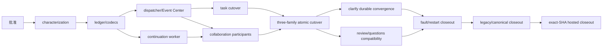

# RFC-341 实施计划 — 生命周期已提交事件与协作命令收口

状态：Done（2026-08-30）；T0～T14、完整 W3 cutover、canonical replay 与 exact-SHA hosted closeout 已完成。

开工 source pin：`1947e1ad02d3eb3f8a0c062f2a2f42a1ce5f61ce`。

Foundation / task / collaboration cutover：`19fba75442786210b0a0deab3f7795a8e1e0196f` →
`3bfa9d447e9d61d6dc4336771f093bd06055c066` → `5318db02d18ce321ed37317d1265020e1feab687`。

Durable clarify convergence / recovery lock：`275f661b73495971864bfd12d22707ab5466d3ef` →
`acb518f81337b19633b39081265ad75259baea51`。

Idle dispatcher repair / published exact SHA：`8f95c423fb594105cc136324e3b2f20397a465ed` →
`67a97480c5944c723d3ee08490631e4db768a5c6`。

Canonical payload / provenance / source digest：`f94290d715365ee6c46e927c211a00326834157b` →
`d2a4cc742c6dbb318b237ede15155b354cd79584` → `67a97480c5944c723d3ee08490631e4db768a5c6` /
`sha256:3714450fee40135133fb94fb846d6f4f32369d00625d8f7249e6049a80c73805`。

Hosted closeout：Main CI `33268925250` 与 8 个定时 workflow terminal success。

## 1. 实施原则

1. 只在共享 `/Users/wangbinquan/dev/proj/agent-workflow` primary checkout 的 `main` 工作；不建 branch/worktree/stash，
   精确保留所有并发产物。
2. RFC-341 是 RFC-294 W3 的完整 successor；task lifecycle 与 review/clarify/questions 全部 covered path 都完成后才置 Done。
3. 用户已于 2026-08-29 明确批准 D1～D12 与 T3～T14；授权只覆盖 RFC-341/W3，不外溢到 W4 以后 wave。
4. task lifecycle 先独立切换；三个 collaboration family 因共享同一个 continuation owner，在同一 migration 中原子共切，避免双 active。
5. 正常路径保持 `commit < immediate projection/nudge < response`；request 不等待 long effect 或 continuation drive。
6. continuation 的唯一 durable work identity 仍是 RFC-333 intent；event consumer只负责 durable observation/effect与可重建 nudge。
7. W3-owned worker 符合 managed definition，但不迁其他 background jobs、不领取 W9 credit。
8. 本轮只做功能、恢复、顺序与用户可见行为，不新增安全类检查、加固、策略或测试。
9. 按用户规则不跑本地 Bun/E2E/full gate；最终以 exact-SHA GitHub Actions 为权威，定向静态检查只验证候选文件。
10. canonical architecture artifacts 只由仓内 generator 重放；不手改 digest、分母、ledger 或 exception。

## 2. 开工 baseline 与最终差异

开工 baseline `1947e1ad02d3eb3f8a0c062f2a2f42a1ce5f61ce` 上已存在 RFC-310 task lifecycle outbox pilot与
RFC-333 human-gate transaction/intent；W3 缺口是 post-commit fanout、request-owned wake、collaboration direct broadcast、
持续 recovery owner与 producer failure 可见性。

最终差异：

| family / owner             | 开工                                                      | Done                                                                     |
| -------------------------- | --------------------------------------------------------- | ------------------------------------------------------------------------ |
| task lifecycle publication | legacy outbox publisher + duplicate WS/terminal callbacks | canonical committed event + per-consumer delivery；legacy owner extinct  |
| review/clarify/questions   | transaction 后 direct broadcaster/request wake            | collaboration committed events + exact projector + continuous worker     |
| continuation               | boot recovery + request-owned claim/drive                 | one managed continuous owner；nudge + periodic exact intent scan         |
| producer/consumer failure  | Event Center 看不到 producer 前失败                       | 原 Event Center 展示 stage/family/aggregate/consumer/attempt/error/retry |
| clarify commit edge        | post-seal functional dispatch只属于 HTTP stack            | fresh/replay/claimed pre-drive共用幂等 durable convergence               |
| cutover                    | task pilot active；collaboration无 durable family         | task `0219` 独立切；review/clarify/questions `0222` 原子共切             |

## 3. 任务终态

### T0 — current-source 调研与 successor 选题（Done）

- [x] fetch/sync shared `main` 并固定开工 source pin；
- [x] 读取 RFC-294 W3、RFC-310/328/333/339 与 Event Center/lifecycle/collaboration source；
- [x] 识别 task pilot、ambient side channels、request-owned wake、direct broadcast与可见性缺口；
- [x] 明确 RFC-333 transaction/intent 是复用前置，不在 W3 重做。

### T1 — 产品口径确认与 RFC 三件套（Done）

- [x] 用户确认一份 RFC 完整关闭 task lifecycle + review/clarify/questions W3；
- [x] 保持 `DB commit → immediate WS/worker nudge → HTTP response`；
- [x] continuous worker 接管 continuation，request只返回 committed receipt；
- [x] 运维复用 Event Center 原页面；
- [x] 本轮只做功能、恢复、顺序和用户可见行为。

### T2 — 用户生产实施批准门（Done）

- [x] 2026-08-29 用户明确要求“批准实施并完整实现，然后提交上库”；
- [x] 批准 proposal D1～D12、design §4～§13 与 T3～T14；
- [x] 批准 schema/codec、cutover、worker、Event Center、legacy extinction与 hosted closeout；
- [x] 批准范围只覆盖 RFC-341/W3，不自动启动 W4 以后 wave。

### T3 — characterization、source locks 与 architecture gates（Done）

- [x] 锁定 task writer/outbox/publisher/WS/terminal/watch/budget/prune/repair inventory；
- [x] 锁定 review/clarify/questions command、wake、broadcaster与 operation→event family；
- [x] 保留 current REST/MCP result、task/review/clarify/questions frame与 ordering corpus；
- [x] 建 RFC-341 codec/store/worker/collaboration/source-lock/migration corpus；
- [x] 最终 source locks证明 route/composition无 broadcaster/wake/driver、legacy task publisher与 boot recovery不回潮。

### T4 — closed codecs、neutral store 与 cutover ledger（Done）

- [x] `19fba75442786210b0a0deab3f7795a8e1e0196f` 落 task/collaboration closed union与 consumer manifest；
- [x] migration `0218_rfc341_committed_events.sql` 新增 aggregate heads、events、deliveries、family cutovers；
- [x] 四个 family 初始化为 `legacy/epoch=1`，foundation commit 不改变 production owner；
- [x] 实现 canonical bytes/digest、same-id replay/conflict、aggregate sequence与 append transaction participant；
- [x] migration/codec/store tests覆盖 immutable row、wrong family/aggregate/version与 duplicate ownership。

### T5 — dispatcher、AfterCommitEventPump 与 Event Center 运维面（Done）

- [x] 实现逐 consumer claim/lease/FIFO/retry/dead-letter与 observed-state CAS manual retry；
- [x] `CommittedEventDispatcherWorker` 实现 managed start/readiness/health/stop；
- [x] `AfterCommitEventPump` 只读取 exact refs、同步投影并 nudge dispatcher，不 claim/drive；
- [x] Event Center 原 route/page新增 producer/consumer stage、family、aggregate/seq、attempt/error/retry；
- [x] shadow/current epoch exclusion与 single-winner retry由 `rfc341-committed-event-store.test.ts` 锁定。

### T6 — continuous HumanGateContinuationWorker（Done）

- [x] 实现 immediate nudge + periodic pending-intent scan + bounded shutdown；
- [x] 复用 RFC-333 durable claim/fence/handoff；nudge不携带唯一 work identity；
- [x] daemon bootstrap只装配一个 collaboration-owned continuous worker；maintenance boot recovery退出；
- [x] initial/reconcile、lost nudge、shutdown handoff与 legacy gate exclusion均有回归锁。

### T7 — task lifecycle cutover 与 legacy migration（Done）

- [x] migration `0219` 把 task family切到 `dispatchable/epoch=2`；
- [x] unresolved legacy outbox row迁入 canonical event/delivery并保留 attempt/error，aggregate head不倒退；
- [x] task lifecycle/public Event Center、terminal gate、child budget、watch、prune、terminal repair与WS consumers接入；
- [x] 删除 legacy outbox publisher、duplicate task WS publisher与 terminal-hook active path；
- [x] migration `0220` 修复 rolling-upgrade FK rename，保留 delivery receipts与 task-delete 行为。

### T8 — collaboration participants 与 closed-family characterization（Done）

- [x] typed review/clarify/questions command返回 internal committed receipt，public HTTP/MCP response不变；
- [x] open/decision/comment/selection/question-dispatch 在领域 transaction 内 append exact event；
- [x] collaboration Event Center、WS、distill与 continuation-nudge consumers接入；
- [x] source guard禁止 covered event after-commit 补造与 route direct broadcaster；
- [x] production family在 cutover 前保持 legacy；shadow non-delivery由 store contract测试，不制造跨 commit dual owner。

### T9 — collaboration 三 family 与 continuation owner 原子切换（Done）

- [x] migration `0222` 在任何 UPDATE 前验证 review/clarify/questions 三行精确为 `legacy/epoch=1`；
- [x] 三行在同一 transaction 一起切到 `dispatchable/epoch=2`；missing/stale/partial input整批回滚；
- [x] 同一 publication stage启动 continuous worker并删除 review/clarify/questions request-owned claim/drive；
- [x] 删除 covered direct broadcasters，task/node frame继续由 task event唯一投影；
- [x] migration helper按真实 Drizzle statement breakpoints执行，happy/stale原子性双平台 hosted通过。

### T10 — clarify commit-edge 与 durable convergence（Done）

- [x] compiled restart barrier位于 seal `dbTxSync` 返回后的第一同步 edge，先于任何 await/yield/nested dispatch；
- [x] `finishCommittedClarifyAutoDispatch` 由 fresh、receipt replay、exact claimed pre-drive共用；
- [x] submitter user/role、answer attribution与 stop directive在 seal transaction内持久化；
- [x] pre-drive校验 exact intent/operation/manifest/task/gate/claim epoch，finish成功才drive；
- [x] failure把同一 intent保持/退回 pending，允许周期重试且不重复 mint rerun/intent；fresh response/replay重建实际 dispatch结果。

### T11 — review/questions compatibility 与 owner extinction（Done）

- [x] review open/comment/selection/decision与 question dispatch/answer只走 committed projector；
- [x] current frame shape、decision/cancel ordering与 projection dedupe保持；
- [x] RFC-333 pending successors在 orphan reap/owner release后仍可恢复；
- [x] legacy workgroup/dynamic-workflow gate payload从 continuous RFC-333 scan精确排除，保留其既有 coordinator owner；
- [x] review/clarify/questions direct broadcaster与 request wake最终均为 0。

### T12 — reconcile、fault 与 restart closeout（Done）

- [x] commit→pump、consumer/settle、lease expiry、lost nudge、daemon restart与 shutdown handoff均有 durable恢复路径；
- [x] stale collaboration cutover在 mutation前确定性失败，rolling upgrade与 FK rename corpus闭合；
- [x] task service/collaboration composition初始化环拆除，compiled daemon不再出现 TDZ/null destructure；
- [x] clarify commit-before-wake、review restart与 question-dispatch restart使用真实 SIGKILL 窗口，不改 E2E预期；
- [x] RFC-128 durable convergence与 RFC-123 directive single-source tests锁定 commit-edge与 transaction writer。

### T13 — legacy extinction 与 canonical architecture closeout（Done）

- [x] legacy task outbox publisher/table owner、duplicate task WS、terminal hook、boot recovery、covered broadcaster/request wake归零；
- [x] public participant/type seam消除 collaboration internal public-surface增长，不新增临时 architecture exception；
- [x] exact claimed-intent retry writer归入 worker-epoch authority（`75cfadfa85dd3cdd1de269b7dedf700e27c02f8b`）；
- [x] idle dispatcher 以 exact due preflight 保持空队列 reconcile 只读；有 candidate 时 transaction 内重查并 CAS，after-commit nudge
      与一秒 reconcile 仍闭合 read-false 后的新 event；
- [x] final canonical payload / initial pin / forward repin为 `f94290d715365ee6c46e927c211a00326834157b` →
      `d2a4cc742c6dbb318b237ede15155b354cd79584` → `67a97480c5944c723d3ee08490631e4db768a5c6`；
- [x] source digest为 `sha256:3714450fee40135133fb94fb846d6f4f32369d00625d8f7249e6049a80c73805`。

### T14 — publication、exact-SHA hosted closeout 与文档关闭（Done）

- [x] source/test/canonical commits按 shared-main短临界区 exact-stage、带实际 co-author trailer并推送；
- [x] final implementation exact SHA `67a97480c5944c723d3ee08490631e4db768a5c6` 已在 `origin/main`；
- [x] canonical replay与 provenance repin 已在 full source snapshot 上闭合，一次性 growth permit 已移除；
- [x] Main CI run `33268925250` terminal success，全部 static/build/frontend/backend/三平台 Playwright与 `CI required` 全绿；
- [x] Ubuntu/macOS backend shard1 的 RFC-128 两条 durable convergence assertion、shard3 的 RFC-123 source lock均绿；
- [x] RFC-294 restart spec三条 case在 Ubuntu/macOS/Windows 全绿；macOS RFC-319 DE-X1 timeout未复现；
- [x] 8 个定时 workflow 在同一 exact SHA 全部 terminal success：e2e-full `33268950624`（含 RFC-319 覆盖汇总）、e2e-webkit
      `33268950212`、evidence `33268949064`、git-protocols `33268950157`、integration-opencode `33268949548`、maintenance-soak
      `33268952181`（100-client/full/180s，同 SHA attempt 2）、visual `33268950915`、windows-platform `33268951134`；
- [x] RFC-341 proposal/design/plan回填实现、canonical与 hosted证据；RFC-294/design index/STATE的共享 closeout交给下一短临界区统一同步。

## 4. 实际 publication 链

| stage                 | commit                                                                                                                               | 内容                                                                          |
| --------------------- | ------------------------------------------------------------------------------------------------------------------------------------ | ----------------------------------------------------------------------------- |
| RFC                   | `7843100c30804e6ae57b1ed8460bdf91e3888795`                                                                                           | RFC-341 三件套与 W3 successor 设计                                            |
| foundation            | `19fba75442786210b0a0deab3f7795a8e1e0196f`                                                                                           | ledger/codecs/workers/Event Center，families仍legacy                          |
| task cutover          | `3bfa9d447e9d61d6dc4336771f093bd06055c066`                                                                                           | task lifecycle canonical cutover与legacy owner删除                            |
| task recovery         | `a486cc3a1aeed792e62565b11463aca598056436` / `6fac0b5bc97f57d0905b7b81c893d464c0bb6ce4`                                              | explicit public type imports、FK/rolling-upgrade修复                          |
| collaboration cutover | `5318db02d18ce321ed37317d1265020e1feab687`                                                                                           | review/clarify/questions committed delivery + `0222`                          |
| hosted repairs        | `9382d225481f525b7ade2f5c7141523287060090` → `1bf179b3fbeb055dce28cd27cf57260b10114e07`                                              | init/scan/order/migration/ownership/restart收口                               |
| commit-edge repair    | `890c3ad402c8b3cc5a9fdff38d77086532e1a6e7` → `fed0e04ce26416f22e3ab8512a47806581da4411`                                              | Drizzle migration fixture与真实 seal commit barrier                           |
| durable convergence   | `275f661b73495971864bfd12d22707ab5466d3ef` / `75cfadfa85dd3cdd1de269b7dedf700e27c02f8b`                                              | clarify finish/pre-drive与 exact retry authority                              |
| convergence canonical | `3c5bc933baab1413c465177aef3800d41f844df8` / `9148b82394905f0e321f12f39d73dd59eef7ddf2`                                              | clarify convergence payload与当时的 provenance pin                            |
| recovery locks        | `acb518f81337b19633b39081265ad75259baea51`                                                                                           | RFC-128 commit-edge fixture与 RFC-123 transaction source lock                 |
| idle claim repair     | `8f95c423fb594105cc136324e3b2f20397a465ed`                                                                                           | 空队列只读 preflight、transaction recheck/CAS 与 nudge/reconcile source locks |
| final canonical       | `f94290d715365ee6c46e927c211a00326834157b` / `d2a4cc742c6dbb318b237ede15155b354cd79584` / `67a97480c5944c723d3ee08490631e4db768a5c6` | payload、initial pin与 retired-permit forward repin                           |

所有提交均已进入 final exact SHA 的 ancestry；current canonical sourceDigest 与 full source snapshot 已闭合。

## 5. 实际依赖图

## 6. 功能矩阵终态

| matrix            | 结果 | 主要证据                                                                                            |
| ----------------- | ---- | --------------------------------------------------------------------------------------------------- |
| task lifecycle    | Done | `rfc341-committed-event-store`、`rfc310-task-lifecycle-events`、migration `0219/0220`、source locks |
| review            | Done | committed open/comment/selection/decision projector、batch/order/restart corpus                     |
| clarify           | Done | seal transaction、shared durable finish、claimed pre-drive、restart/SIGKILL corpus                  |
| questions         | Done | committed dispatch/answer、deferred park、restart/SIGKILL corpus                                    |
| delivery/failure  | Done | replay/conflict、FIFO、lease、dead-letter/retry、stale cutover、lost nudge                          |
| Event Center      | Done | committed-delivery backend route、原页面 filters/error/retry与 frontend test                        |
| legacy extinction | Done | `rfc341-collaboration-source-locks.test.ts` 与 task legacy file absence locks                       |
| hosted            | Done | exact SHA `67a97480` / Main CI `33268925250` + 8 scheduled workflows terminal success               |

## 7. AC 证据账本

| AC    | 主要任务   | 状态 |
| ----- | ---------- | ---- |
| AC-1  | T3         | Done |
| AC-2  | T4/T8      | Done |
| AC-3  | T4/T7/T8   | Done |
| AC-4  | T4/T5/T12  | Done |
| AC-5  | T5/T6/T12  | Done |
| AC-6  | T5/T10/T12 | Done |
| AC-7  | T5/T10/T12 | Done |
| AC-8  | T6/T9/T13  | Done |
| AC-9  | T7/T9/T13  | Done |
| AC-10 | T7～T12    | Done |
| AC-11 | T7/T8/T12  | Done |
| AC-12 | T5/T14     | Done |
| AC-13 | T7/T9/T12  | Done |
| AC-14 | T12/T14    | Done |

## 8. Done 判据与下一步

- 四个 family均处于 current dispatchable epoch，legacy active owner extinct；
- task/collaboration producer、consumer manifest、dispatcher与 continuation owner唯一；
- request-owned wake与 covered direct broadcaster归零；
- Event Center可观察 producer/consumer failure并对 dead-letter单项 retry；
- normal order、commit-before-wake crash、daemon restart与 exact claimed convergence都有三平台/双平台 hosted证据；
- current REST/MCP/UI/WS功能与 frame保持；
- canonical source digest与 provenance闭合；
- final exact SHA Main CI 与 8 个定时 workflow terminal success，remote ancestry明确。

RFC-341 据此 Done，并只关闭 RFC-294 W3。下一步是 W4 的独立 current-source 调研与 successor RFC；W4/W5/W6/W7/W8/W9
均未因本 RFC 完成而自动获得生产授权。
