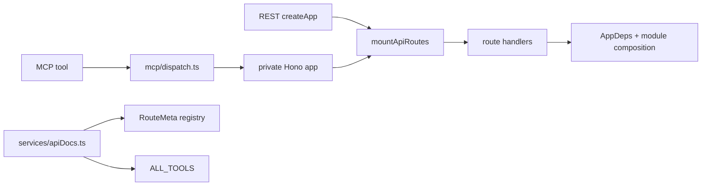
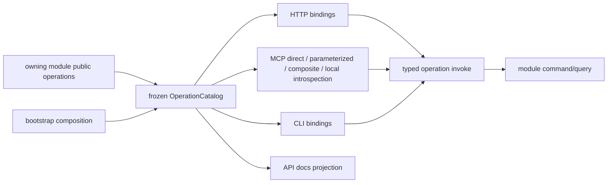

# RFC-344 技术设计 — OperationCatalog 与 transport cutover

- 状态：Approved / Implementation candidate（2026-08-30；等待 published exact-SHA hosted closeout）
- current-source pin：`fa244b0319581efc6aad3f3f216b917278fc17f7`
- parent wave：[RFC-294 W4-A](../RFC-294-backend-layered-target-architecture/plan.md#w4-a-operation-catalog-与-adapter-parity)

## 1. 当前拓扑



现状不是“一个 handler 被两个 transport 调用”，而是 MCP 把请求重新编码成 HTTP 后送进第二套完整 route stack。结果是：

- 同一进程两次执行 `mountApiRoutes`，函数体内 14 个 compose/create-store 调用也随之执行两次；
- MCP tool schema/permissions 与 RouteMeta 分开维护；
- `services/apiDocs.ts` 反向读取 routes/MCP registry；
- private Hono 的 lazy initialization 参与 `mcp/dispatch.ts ↔ mcp/server.ts ↔ server.ts` value SCC；
- composite/parameterized tool 的真实 dependency 只能通过运行 handler 后记录 URL 才被 RFC-329 guard 看见。

## 2. 目标拓扑



Catalog 是 bootstrap 对静态 descriptor 的一次收集与闭包验证。它可以向 inbound adapters 提供已类型化、冻结的 binding handle，但不向
业务模块提供字符串查找接口。模块间同步调用仍走 RFC-294 的 exact public command/query/participant，不经过 catalog。

## 3. Operation contract

### 3.1 Stable id

operation id 使用 `<bounded-context>.<verb>-<subject>.v<major>`，例如：

```text
identity-access.list-users.v1
identity-access.update-user-access.v1
development-automation.get-mission.v1
task-execution.get-task.v1
```

id 表示 application contract，不编码 transport、method、path、tool name 或实现文件。重命名 route/tool 不自动创建新 operation；输入、输出
或语义发生不兼容变化时才升 major。alias 只允许作为有删除任务的显式兼容 entry，不能静默一对多。

### 3.2 Closed descriptor union

沿用 RFC-294 §13.1 的 closed union，不另造较弱基类：

```ts
type OperationDescriptor<I, O> =
  | CommandOperationDescriptor<I, O>
  | IdempotentCommandOperationDescriptor<I, O>
  | QueryOperationDescriptor<I, O>
  | CredentialAuthenticationOperationDescriptor<I, O>
  | VerifiedIngressOperationDescriptor<IntegrationIngressSource, I, O>
  | BootstrapAdminOperationDescriptor<I, O>
  | PublicLivenessOperationDescriptor<O>
```

每一支都固定：

- stable id 与 kind/context kind；
- transport-neutral admission（适用时）；
- exact versioned input/output codec；
- closed public error codes；
- typed invoke。

codec 在进入 invoke 前 parse 一次，invoke result 在离开 application boundary 后再 parse 一次。identity pilot 使用 strict JSON codec；
development legacy wire 使用 exact top-level envelope + 既有 domain schema，嵌套动态 JSON 保持现有开放形状，留给 W4-E8 逐 DTO 收紧。
requirement file 的 HTTP-only ranged read 使用 exact runtime file-view codec（固定四字段与函数类型），不把该 handle暴露给 MCP/CLI。

### 3.3 Module ownership

descriptor 的 application contract 与 invoke 由 owning module public surface 导出；codec 可以复用 shared/domain schema，但不能把 Hono
context、MCP request、CLI flags、DB row、repository、process handle 或 `AppDeps` 放进 input/context。HTTP-only streaming query 可返回由
owning application 铸造的窄只读 file-view handle；它不能进入共享 JSON operation 或跨 transport binding。

neutral descriptor/binding types 归 `platform/contracts`；catalog collection/self-check 归 bootstrap。platform 不拥有业务 operation id
清单，bootstrap 也不实现业务 branch 或 DTO translation。

## 4. Binding model

### 4.1 HTTP

```ts
interface HttpOperationBinding<TOperationId extends OperationId> {
  readonly kind: 'http'
  readonly operationId: TOperationId
  readonly method: HttpMethod
  readonly path: string
  readonly tokenAccess: 'allow' | 'never'
  readonly decode: HttpInputProjection<TOperationId>
  readonly encode: HttpOutputProjection<TOperationId>
}
```

`decode/encode` 只能完成 path/query/header/body 与 descriptor DTO 的纯协议投影；不得查 DB、执行行级判据、写 audit 或调用另一个业务
handler。`RouteMeta` 由 descriptor admission + HTTP binding 投影：

```text
method/path/tokenAccess <- HttpBinding
permissions/publicReason <- OperationDescriptor
summary/schema/errors <- OperationDescriptor + binding presentation metadata
```

### 4.2 Direct MCP

```ts
interface DirectMcpBinding<TOperationId extends OperationId> {
  readonly kind: 'mcp-direct'
  readonly toolName: string
  readonly operationId: TOperationId
}
```

同一 operation 若同时有 HTTP 与 MCP binding，两端取得的是同一个 frozen typed invoke handle。MCP adapter 不再构造 URL、method、header
或 Hono request。兼容 tool 的既有 Zod input/presentation/audit 留在 `McpToolDef`，binding 只允许调用自己声明的 operation dependency；
descriptor-backed MCP surface 后续可直接复用 operation codec，不另写业务 schema。

### 4.3 Parameterized MCP

`resource_read/resource_write` 等工具保留现有一个 tool + discriminated input 的产品形态，但 selector 是 closed case table：

```ts
interface ParameterizedMcpCase<TSelector, TOperationId extends OperationId> {
  readonly selector: TSelector
  readonly operationId: TOperationId
  readonly decode: McpCaseInputProjection<TOperationId>
  readonly encode: McpOutputProjection<TOperationId>
}

interface ParameterizedMcpBinding<TSelector> {
  readonly kind: 'mcp-parameterized'
  readonly toolName: string
  readonly cases: readonly ParameterizedMcpCase<TSelector, OperationId>[]
}
```

self-check 证明 selector union 与 case table 双向相等。case 不保存 URL，不允许 wildcard/default 分支；新增 resource action 时漏 mapping 直接
编译或启动失败。

### 4.4 Composite MCP

`watch_task`、跨多个 read 的 summary 工具或需要 progress notification 的工具，不伪装成一条 HTTP route：

```ts
interface CompositeMcpBinding<TInput, TOutput> {
  readonly kind: 'mcp-composite'
  readonly toolName: string
  readonly dependencies: readonly OperationId[]
}
```

composite invoke 取得 binding-scoped typed handles；任何未声明 handle 在调用时 fail closed。progress/audit 属 MCP adapter，业务读取/写入仍由
每个 operation 拥有。它不通过 generic string invoker，也不能调用 HTTP router。dependency list 会进入 catalog/architecture guard，少报
或多报都会红。

### 4.5 Local MCP introspection

`describe_resource` 与 `describe_capabilities` 不映射业务 route；它们只读取 frozen catalog projection 与当前 actor snapshot，登记为
`mcp-local`。local binding 不得声明业务权限或被业务 tool 复用。

### 4.6 CLI

CLI binding 负责 argv/TTY/env-safe input projection、表格/JSON presentation 与 exit-code mapping；用户类 command/query 与 HTTP 共享
identity operation descriptor。first-admin 保留既有 bootstrap-only composition，明确不伪装 authenticated command；其完整
bootstrap-admin catalog 化属于 identity-access E0，不由本 transport cutover 改语义。

## 5. Invocation pipeline

descriptor-backed binding 的统一顺序：

```text
transport decode
  -> exact input codec
  -> resolve exact context factory for descriptor kind
  -> descriptor admission (when applicable)
  -> typed invoke
  -> exact output codec
  -> declared public error projection
  -> transport encode/audit
```

行级条件、OCC、transaction、audit 与 committed event 仍在 owning command/query 内；binding 不复制这些规则。context factory 的选择由
descriptor kind 决定，是 closed switch；operation 自己不能接收可伪造的 plain context object。

尚待 W4-B/C/E 的 compatibility operation 走另一条显式路径：stable operation id 定位同一已注册 handler chain，direct adapter 物化
path/query/body 后直接执行 route-owned middleware + gate + handler，不进入 Hono router，也不另建 app。其既有 handler validation/error
wire 保持原样；`legacyHttpAdapter=true` 防止把它冒充 descriptor cutover。

## 6. Error contract

`PUBLIC_ERROR_DEFINITIONS` 保持 descriptor public error category 的唯一闭集。每个 descriptor 再声明自己可能返回的 subset：

- operation 抛出已声明 category：保留既有 transport error，由现有 adapter 投影；
- operation 抛出未声明 category：视为 contract violation，由 HTTP error boundary 外投 `internal-error`；
- unknown/plain `Error` 只有在 descriptor 显式允许 `internal-error` 时可到既有 error boundary，否则先变为 contract violation；
- compatibility HTTP/MCP 调同一 handler/error boundary，对同一 operation/input 得到相同 status/body；
- private cause/stack/row 不进入 exact output codec。

本 RFC 锁定现有 404/409/410/412 行为，不借 cutover 改变错误文案或产品流程。

## 7. Catalog self-check

bootstrap freeze 前执行一次 deterministic validation：

1. operation ids 唯一，descriptor kind 与 invoke context 签名相符；
2. 每个 binding 的 operation id 存在，transport projection 与 codec 兼容；
3. empty permissions 必须有 exact `publicReason`，非空 permissions 不得同时声明 publicReason；
4. idempotent command 有唯一 key wire source、length 与 charset；
5. parameterized selector case 穷尽且无重复/default；
6. composite dependencies 全存在、无未声明 handle access；
7. RouteMeta projection、MCP tool table 与 API docs projection 都与 frozen binding set 同源；identity CLI 只持 typed descriptor handle；
8. 每条 compatibility route 都有 stable `legacy-http.*` declaration + `legacyHttpAdapter` 标记；stale/unknown/duplicate 均失败。

这些检查只验证 functional contract closure，不承担各业务 command 的行级规则。

## 8. Migration topology

### 8.1 Compatibility ledger

迁移期由 production registration 生成 exact inventory；未迁移 route 的 debt shape 为：

```ts
interface CompatibilityHttpOperation {
  readonly id: `legacy-http.${string}.v1`
  readonly method: HttpMethod
  readonly path: string
  readonly implementation: 'compatibility'
  readonly legacyHttpAdapter: true
}
```

禁止 path prefix、tool group 或“all other routes”豁免。每个实际 route leaf 逐条生成；W4-B/C/E 的 owner/remove wave 继续由 parent plan
逐域承担，不在 RFC-344 再抄一份 472 行 owner ledger。新增未登记 surface、重复 id/path 或伪装 descriptor 默认失败。

### 8.2 Cohort order

1. catalog contracts/self-check + characterization，无行为切换；
2. identity-access user HTTP/CLI pilot；
3. development mission/config/activity HTTP pilot；
4. MCP direct bindings，按只读→mutation cohort 切换；
5. parameterized/composite/local-introspection MCP bindings；
6. API docs/RouteMeta derivation；
7. 删除 private Hono/dispatcher/SCC，清 migration ledger。

每个 cohort 先锁 current success/error/audit/progress oracle，再切到 catalog path；mutation operation 不 shadow 双写。cohort 内 route/tool
与其 descriptor/binding/tests 同批，不能先登记一个打不开的 operation id。

## 9. Pilot contracts

### 9.1 Identity access

复用现有 identity-access public commands/queries 与 `DirectOperationContextFactory`，先覆盖：

- user list/detail/search/lookup；
- create managed user、update access、disable/enable、reset password 等现有公开能力；
- 对应 HTTP 与 `cli/user.ts` bindings。

CLI process edge 只负责打开 DB/identity composition，`cli/user.ts` 自身只投影参数并调用同一 user descriptors；bootstrap-only
first-admin 保留显式 bootstrap participant，不混入普通 user command。

### 9.2 Development automation

为 mission/config/activity 当前 route 提供最窄 public operation；descriptor DTO 不含 DB、repository、engine、process、absolute path、Hono
context 或 26-option service locator。route 只 decode/call/encode；完整 development writer/required SPI/worker cutover仍归 W4-E8/W5。

## 10. RFC-329 的继承与退役边界

RFC-329 的 route/tool inventory、permission parity 与 exemption reasons 保留为 current behavior oracle。RFC-344 分阶段替换其“动态调用
tool 后记录 URL”的 binding 推导：

- direct/parameterized/composite/local-introspection binding 进入生产 catalog 后，guard 直接读 binding；
- 380 条 no-tool exemption 继续有效，除非产品明确新增 tool；
- 最后一个 dynamic recording dispatcher consumer 归零后删除该推导路径，保留 exact coverage/self-check；
- exemption 数量下降不等于 catalog cutover，catalog cutover 也不要求给 HTTP-only route 新增 MCP tool。

## 11. API docs 与 RouteMeta

API docs projection 输入是 frozen catalog + binding tables，不 import `routes/registry.ts` 或 `ALL_TOOLS`。当前 HTTP 文档保持既有
method/path/admission/summary wire；MCP 文档读取同一次登记的 tool presentation。operation dependency/permissions 由 catalog closure校验；
只有 descriptor-backed surface 才宣称 versioned codec/public error 单一事实源，compatibility schema 的最终归并留给对应 W4 vertical slice。

`registerOperationRoute` 接收 descriptor + HTTP projection 并派生 RouteMeta；legacy `registerRoute` 同步生成 compatibility declaration。
手写 legacy permissions/summary 的 overload 只在 W4-B/C/E 全量 route cutover 后删除，本 RFC 不倒签该退出门。

## 12. Composition 与生命周期

- daemon module composition 在进程 bootstrap 构造一次；HTTP/MCP 共享同一 registered handler/module instance；CLI 是独立进程但复用同一
  descriptor factory/application command，不复制业务分支；
- MCP server 不再 lazy 调 `mountApiRoutes`；首次 MCP request 不创建第二套 module instance；
- catalog 是 immutable metadata + handler references，不持有 per-request state；
- request context、correlation id、idempotency key 与 cancellation 每次调用单独铸造；
- background worker/committed-event consumer 不经 transport catalog 调业务，继续使用自己的 typed ports/capabilities。

## 13. Rollback

在 private Hono 删除前，每个 cohort 可通过普通反向 commit 恢复旧 binding，但 catalog 与旧 path 不能同时 active。DB/wire 均无迁移，
所以回滚不需要 data rollback。private Hono 删除且 exact-SHA hosted gates 全绿后，恢复它会重新引入 duplicate composition root 与 SCC，
只允许 forward-fix。

## 14. 机器证据

- descriptor/binding closed-set type tests；
- catalog startup self-check 的 duplicate/unknown/stale/kind mismatch negative fixtures；
- HTTP/MCP same-operation success + 404/409/410/412 parity corpus；
- parameterized selector exhaustiveness 与 composite dependency access lock；
- RouteMeta/MCP/docs projection equality；
- compatibility declaration unknown/stale/duplicate 双向 census；
- `mcp/dispatch.ts`、private Hono mount、services→routes edge 与三文件 SCC absence locks；
- identity/development pilot 的 public-entrypoint/deep-import/AppDeps contraction locks；
- current REST/MCP/CLI regression、三平台 E2E、Main CI 与定时 workflows。

按用户约定，最终功能结论以 published exact-SHA hosted CI 为准；本地不以 Bun full gate 代替 hosted verdict。
