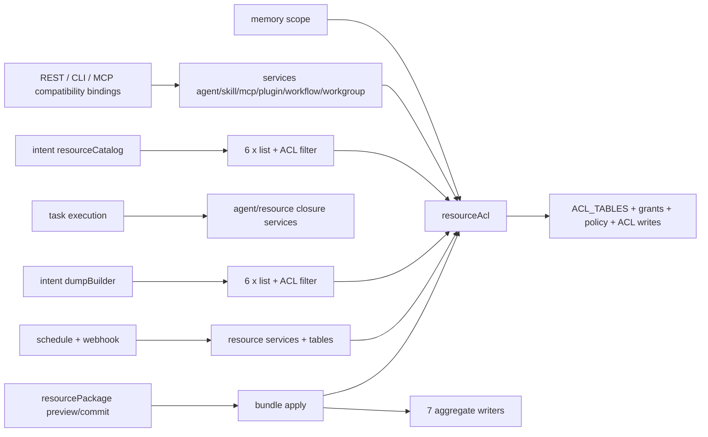
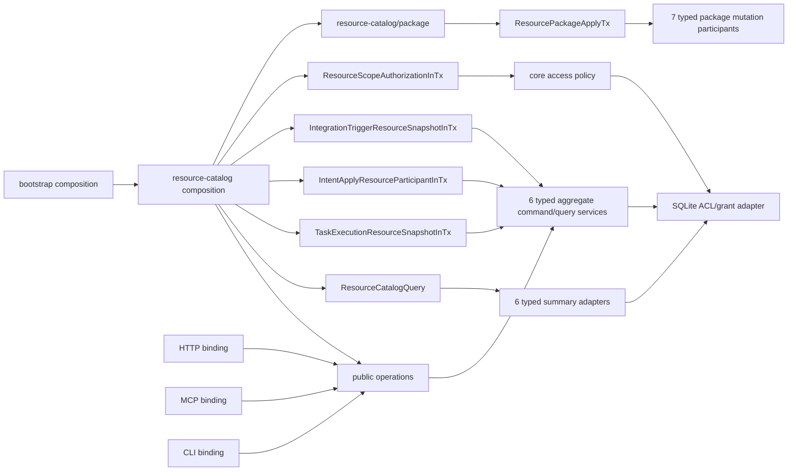
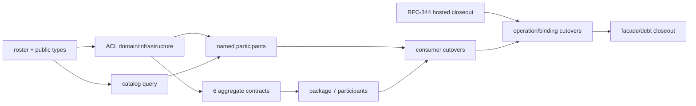

# RFC-345 技术设计 — Resource Catalog 与 ResourcePackage 合同归位

- 状态：Approved / In Progress（2026-08-30；D1～D10 已获用户明确批准）
- current-source pin：`625017c084db2f7eb6c9ec34c87eba41ffaf04cd`
- parent wave：[RFC-294 W4-C](../RFC-294-backend-layered-target-architecture/plan.md#w4-c-resource-catalog)

## 1. 当前拓扑



问题不是功能缺失，而是 public contract 与 infrastructure/application owner 混在一起：

- consumer 依赖“能拿到表/Actor/完整 row”，而不是依赖自己真正需要的 use case；
- `ACL_TABLES` 让任何 caller 都能按 `resourceType` 选择任意 Drizzle table；
- selector summary 与 full detail 没有边界，两份 Intent catalog 各自装载六个完整 aggregate；
- package engine 直接 import 七类 prepare/commit 内核，场景合同无法独立于 engine 生命周期演进；
- RFC-344 已能让 transport binding 指向 application descriptor，但 resource cohort 仍是 compatibility operation。

## 2. 目标拓扑



同步跨模块调用只走 `public/{commands,queries,participants,types}`；SQLite row/table、Hono context、MCP request、CLI flags、
BundleApply journal row 与 file-system stage handle 都不能进入 public contract。

## 3. 模块布局

```text
packages/backend/src/modules/resource-catalog/
├── domain/
│   ├── resourceRef.ts
│   ├── resourceAccess.ts
│   ├── resourceRevision.ts
│   └── packageModel.ts
├── application/
│   ├── catalogQuery.ts
│   ├── aclCommands.ts
│   ├── references/
│   ├── participants/
│   ├── agents/
│   ├── skills/
│   ├── mcps/
│   ├── plugins/
│   ├── workflows/
│   ├── workgroups/
│   └── package/
├── public/
│   ├── commands.ts
│   ├── queries.ts
│   ├── participants.ts
│   ├── operations.ts
│   └── types.ts
├── infrastructure/
│   ├── sqliteAclRepository.ts
│   ├── sqliteCatalogQuery.ts
│   ├── sqliteReferenceGraph.ts
│   └── aggregateAdapters/
└── composition/
    ├── resourceCatalogModule.ts
    └── resourcePackageModule.ts
```

目录表示最终 owner，不要求一次机械搬完所有 legacy 文件。迁移期 `services/resourceAcl.ts`、六类 `services/*.ts`、
`services/resourceRefs.ts`、`services/importRefs.ts`、`services/bundle/*` 与 `services/resourcePackage/*` 可以保留同名 facade；facade
只能做参数/result 适配或 re-export，不得继续新增业务 branch。

## 4. Roster 与类型模型

### 4.1 四个闭集

```ts
type AclCatalogKind = AclResourceType // canonical 15
type GrantTargetKind = GrantResourceType // canonical 16
type PackageResourceKind = BundleResourceType // canonical 7
type CatalogSelectorKind = IntentResourceType // canonical 6
```

这些 alias 必须直接从 `@agent-workflow/shared` canonical constants 推导。禁止声明另一份字面 union；compile-time equality test 与
runtime census 同时锁定 roster。`scheduled_task` 只进入 grant adapter；`capability_template` 进入 ACL/package，但不进入 Intent
selector；其余八类非经典 ACL resource 不进入本 RFC 的横向 selector。

### 4.2 Resource ref 与 summary

```ts
interface CatalogResourceRef<K extends CatalogSelectorKind = CatalogSelectorKind> {
  readonly kind: K
  readonly id: string
}

interface ResourceSummary<K extends CatalogSelectorKind = CatalogSelectorKind> {
  readonly ref: CatalogResourceRef<K>
  readonly kind: K
  readonly name: string
  readonly description: string | null
  readonly revision: ResourceSummaryRevision<K>
  readonly visibilityHint: 'public' | 'private'
}
```

`ResourceSummaryRevision<K>` 是逐 aggregate 的 equality-only revision projection；它不是通用 mutation fence。agent、skill、MCP、
plugin、workflow、workgroup 的 update command 继续接受各自 exact expected fields。summary 不含 definition、agent body、skill tree、
MCP config、plugin options、workgroup roster、owner/grant list、DB timestamps 或 runtime state。

### 4.3 Catalog query

```ts
interface ResourceSummaryQuery {
  readonly kinds?: readonly CatalogSelectorKind[]
  readonly search?: string
  readonly cursor?: string
  readonly limit: number
}

interface ResourceSummaryPage {
  readonly items: readonly ResourceSummary[]
  readonly nextCursor: string | null
}

interface ResourceCatalogQuery {
  listVisible(ctx: QueryContext, query: ResourceSummaryQuery): Promise<ResourceSummaryPage>
  getVisibleSummary(ctx: QueryContext, ref: CatalogResourceRef): Promise<ResourceSummary | null>
}
```

排序固定为 canonical kind rank（agent→skill→MCP→plugin→workflow→workgroup），kind 内由该 aggregate 的 stable query order + id
消歧。SQLite adapter 把 actor-visible condition、search 与 per-kind page 下推；跨 kind merge 只合并 summary，不加载详情。需要完整当前
列表的 legacy adapter 逐页读取至 `nextCursor=null`，不擅自添加产品上限。

Intent selector 直接投影 summary。dumpBuilder 先用 summary 建可见 ref set，再按 mount/closure 中实际命中的 ref 调用逐类 dump
query；不得为了一个名字列表预先加载六张完整表。

## 5. ACL 分层

### 5.1 Domain

`services/resourceAccessPolicy.ts` 的 `none/read/write/own` verdict、view/edit/govern projection、initial ACL value 与纯 name-change
规则迁入 `domain/resourceAccess.ts`。domain 只依赖 shared types；不 import Actor、DB、Drizzle、Hono、WS 或 table。

### 5.2 Application

```ts
interface GetResourceAcl {
  execute(ctx: QueryContext, input: GetResourceAclInput): Promise<ResourceAclView>
}

interface UpdateResourceAcl {
  execute(ctx: CommandContext, input: UpdateResourceAclInput): Promise<ResourceAclView>
}

interface ResourceAuthorizationInTx {
  accessOf(authority: ResourceCurrentAuthorityInTx, ref: AclResourceRef): ResourceAccess
  assertView(authority: ResourceCurrentAuthorityInTx, ref: AclResourceRef): void
  assertEdit(authority: ResourceCurrentAuthorityInTx, ref: AclResourceRef): void
  assertGovern(authority: ResourceCurrentAuthorityInTx, ref: AclResourceRef): void
}
```

`ResourceCurrentAuthorityInTx` 是 identity-access composition 提供的 branded current authority capability；public operation 接
`CommandContext/QueryContext`，不能接调用者构造的 `{userId, permissions}`。RFC-345 additive contract 可先落；任何 delegated
mutation binding cutover 仍以 RFC-294 W4-E0 current-authority seam 就绪为前置。

### 5.3 Infrastructure

`ACL_TABLES` 改为 `sqliteAclRegistry` 的 module-private constant，覆盖 canonical 15 类；grant repository 另接受 canonical 16 类。
table/column descriptors、owner-name partition、Drizzle query、`dbTxSync` 与 row mapper 全在 infrastructure。

WS revalidation/audit callback 作为 application output/event adapter 注入，不由 ACL domain/application import `ws/`。本 RFC只搬迁现有
调用顺序与结果，不增加新事件。

## 6. 经典六类 aggregate contract

每个 aggregate 至少导出：

```ts
interface AgentQueries {
  list(ctx: QueryContext, query: AgentListQuery): Promise<AgentPage>
  get(ctx: QueryContext, input: GetAgent): Promise<AgentView | null>
}

interface AgentCommands {
  create(ctx: CommandContext, input: CreateAgent): Promise<AgentMutationReceipt>
  update(ctx: CommandContext, input: UpdateAgent): Promise<AgentMutationReceipt>
  delete(ctx: CommandContext, input: DeleteAgent): Promise<AgentMutationReceipt>
}
```

skill/MCP/plugin/workflow/workgroup 使用各自 input/view/receipt/fence，不继承 generic CRUD interface。共享的只是 operation envelope、
context、resource ref 与 access policy。每类 adapter 的迁移退出门是：

1. route/CLI/MCP 只依赖该类 public operation；
2. Intent/package/task consumer 只依赖 named participant；
3. legacy service facade consumer=0 或只剩该 aggregate 内部；
4. public DTO 与 repository row 的双向 mapper 有 characterization；
5. current wire/error/ordering 不变。

## 7. 四个 named participant

### 7.1 Task execution

```ts
type TaskExecutionResourceRequest =
  | { readonly kind: 'workflow-launch'; readonly workflowId: string }
  | { readonly kind: 'agent-injection'; readonly agentId: string }
  | {
      readonly kind: 'call-workflow'
      readonly sourceWorkflowId: string
      readonly nodeId: string
      readonly name: string
      readonly idHint?: string
    }
  | {
      readonly kind: 'call-workgroup'
      readonly sourceWorkflowId: string
      readonly nodeId: string
      readonly name: string
      readonly idHint?: string
    }

interface TaskExecutionResourceSnapshotInTx {
  loadAuthorized(
    authority: ResourceCurrentAuthorityInTx,
    requests: readonly TaskExecutionResourceRequest[],
  ): readonly FrozenTaskExecutionResourceSnapshot[]
}
```

result 是 request-discriminated union：workflow 只带 version/definition/input contract；agent injection 只带 agent closure、managed skill
identity/version、MCP/plugin injection facts；workgroup 只带 version/runtime roster projection。它不返回 DB row，也不让 caller 指定
任意 snapshot type。现有 `resolveInjection`、`taskLaunchGate`、`freezeCallClosure` 逐 cohort 适配。

### 7.2 Intent apply

```ts
interface IntentApplyResourceParticipantInTx {
  authorizeAndCommit(
    authority: ResourceCurrentAuthorityInTx,
    plan: VersionedIntentResourceChangesetPlan,
  ): IntentResourceChangesetReceipt
}
```

`VersionedIntentResourceChangesetPlan` 只含 canonical six `INTENT_RESOURCE_TYPES`，每个 variant 保留当前 prepare/commit 所需 exact
fields。RFC-345 抽出逐类 participant 与 orchestration contract；`intent_apply_journal`、claim、artifact、converger 与 session receipt
仍由 Intent owner 运行，直到 W6。

### 7.3 Integration trigger

```ts
type IntegrationTriggerResourceRequest =
  | { readonly kind: 'scheduled-workflow'; readonly workflowId: string }
  | { readonly kind: 'scheduled-agent'; readonly agentId: string }
  | { readonly kind: 'scheduled-workgroup'; readonly workgroupId: string }
  | { readonly kind: 'webhook-workflow'; readonly workflowId: string }
  | { readonly kind: 'webhook-digital-employee'; readonly employeeDefinitionId: string }

interface IntegrationTriggerResourceSnapshotInTx {
  loadAuthorized(
    authority: ResourceCurrentAuthorityInTx,
    requests: readonly IntegrationTriggerResourceRequest[],
  ): readonly FrozenIntegrationTriggerResourceSnapshot[]
}
```

schedule/webhook 的 launch shape、input mapping、trigger preflight 与 digital-employee revision availability 仍由各 current owner提供。
resource-catalog 只编排 exact participant，不接管 digital-employee writer，也不把它加入 classic-six selector。现存 resource-kind mapping
与 error code 在 characterization 中锁定；本 RFC不顺带改判。

### 7.4 Memory scope

```ts
type ResourceMemoryScopeRef =
  | { readonly kind: 'agent'; readonly id: string }
  | { readonly kind: 'workflow'; readonly id: string }

interface ResourceScopeAuthorizationInTx {
  accessOf(
    authority: ResourceCurrentAuthorityInTx,
    scope: ResourceMemoryScopeRef,
  ): 'none' | 'read' | 'write' | 'own'
}
```

memory 自己保留 global/repo/repo_group 规则；只有 agent/workflow 分支调用该 participant。它不获得 name、body、definition 或通用资源
loader。

## 8. ResourcePackage application contract

### 8.1 Public operations

```ts
interface ResourcePackageOperations {
  readonly inspect: CommandOperationDescriptor<
    InspectResourcePackage,
    ResourcePackagePreviewReceipt,
    CommandContext
  >
  readonly apply: IdempotentCommandOperationDescriptor<
    ApplyResourcePackage,
    ResourcePackageApplyReceipt,
    IdempotentCommandContext
  >
  readonly getPreview: QueryOperationDescriptor<
    GetResourcePackagePreview,
    ResourcePackagePreviewView,
    QueryContext
  >
  readonly getReceipt: QueryOperationDescriptor<
    GetResourcePackageApplyReceipt,
    ResourcePackageApplyReceiptView,
    QueryContext
  >
}
```

HTTP multipart、download response 与 CLI plan/TTY 都是 binding projection；package bytes/secret one-shot input 通过窄 handle/sink 进入
application，不把 Hono `File`、CLI path 或 raw secret 放入 durable DTO。现有 `parse/preview/commit/export` 先由 composition adapter
包装，逐步迁入 application/package。

### 8.2 七类 mutation participant

```ts
interface ResourcePackageApplyTx extends ApplyScenarioTx {
  readonly operation: ResourcePackageOperationInTx
  readonly agents: AgentPackageMutationParticipantInTx
  readonly skills: SkillPackageMutationParticipantInTx
  readonly mcps: McpPackageMutationParticipantInTx
  readonly plugins: PluginPackageMutationParticipantInTx
  readonly workflows: WorkflowPackageMutationParticipantInTx
  readonly workgroups: WorkgroupPackageMutationParticipantInTx
  readonly capabilityTemplates: CapabilityTemplatePackageMutationParticipantInTx
  readonly events: ResourcePackageEventsInTx
  readonly audit: ResourcePackageAuditInTx
}
```

每个 mutation participant 只接受自己的 closed operation union；例如 `AgentPackageMutation` 不能承载 workflow payload，
`CapabilityTemplatePackageMutationParticipantInTx` 由 capability-template current owner 实现。`ResourcePackageApplyTx` 不提供
`repositoryFor(kind)`、`apply(kind, unknown)`、raw tx 或 `ACL_TABLES`。

### 8.3 与现有 BundleApply / W6 的关系

W4-C 的 adapter 将 current `PreparedOp` 分发移到七个 typed participant，但生命周期保持：

```text
current ResourcePackage application
  -> existing BundleApply claim/pre-stage/big-tx/tail/converger
  -> ResourcePackageApplyTx (7 participants)
```

本 RFC落下与 RFC-294 `ApplyScenarioProvider` 对齐的 scenario id、plan/artifact/receipt 类型和 provider adapter，但不实现
`platform/atomic-apply`。W6 切换后才变为：

```text
ResourcePackage operation -> AtomicApplyCommandPort -> ResourcePackageApplyProvider -> ResourcePackageApplyTx
```

两阶段共享同一 public package contract 与七 participant，因此 W6 不需要再次 deep-import aggregate writer。

## 9. OperationCatalog 与 transport binding

RFC-344 hosted closeout 的最终 published baseline 是 transport cohort 的前置。每个完成迁移的 resource use case 提供 stable
operation descriptor，例如：

```text
resource-catalog.list-resource-summaries.v1
resource-catalog.get-resource-acl.v1
resource-catalog.update-resource-acl.v1
resource-catalog.package.inspect.v1
resource-catalog.package.apply.v1
resource-catalog.agent.create.v1
resource-catalog.workflow.update.v1
```

HTTP/MCP/CLI binding 调同一 descriptor；method/path/tool/flags 保持 current wire。RFC-344 的 `legacy-http.*` compatibility identity 只在
对应 use case 切完后删除。RFC-345 不修改 catalog kernel、route registry、MCP root、`server.ts` 或 generic binding rules。

## 10. 实施顺序与并行边界



- T1/T2/T3 的新模块与 focused adapters 不需要触碰 RFC-344 root，可并行；
- task/Intent/integration/memory consumer 文件按 cohort 单 owner；
- package cohort 与 classic aggregate writer cohort不能同时编辑同一 writer；
- `design/plan.md`、`STATE.md`、RFC-294 与 architecture canonical 在 publication critical section 前协调；
- architecture JSON 当前属于 RFC-344 owner，本 RFC不编辑或代交。

## 11. 数据、兼容与回滚

- 无 schema/migration/backfill；
- public DTO 由 current row mapper产生，legacy route response 继续用 current shared schema；
- 每个 cohort 在旧 facade 删除前可普通反向 commit 回滚，任何时刻只保留一个 active application handler；
- package lifecycle/DB journal 不变，回滚不需 data conversion；
- consumer cutover 后若发现功能差异，整 cohort 回到旧 facade，不保留双写或 shadow mutation；
- facade consumer=0 且 hosted gates全绿后才删除；删除后只 forward-fix。

## 12. 测试与机器证据

### 12.1 Contract / source locks

- 15/16/7/6 roster type equality + runtime census；
- public entrypoint 只允许 `commands/queries/participants/events/types/operations`；
- `ACL_TABLES` 仅 infrastructure；Drizzle table/row 不出 public；
- classic-six summary 与 seven-package participant exhaustive switches；
- 禁止 generic `ResourceService`、`ResourceRepository<T>`、`load<TSnapshot>`、`apply(kind, unknown)`；
- four named participants 的 request/result field ledger；
- legacy facade 不得新增 branch/DB import；
- target operation descriptor 与 RFC-344 compatibility debt 双向闭合。

### 12.2 Characterization / focused regression

- 六类 list/get/filter/create/update/delete current success/error/ordering；
- ACL public/private/owner/read/write/bypass 与 ACL GET/PUT/transfer current matrices；
- Intent selector/dump/mount/closure exact projection；
- task workflow/agent/workgroup launch与 injection closure；
- schedule/webhook five launch-kind snapshots；
- memory agent/workflow list/detail/edit/move scope；
- ResourcePackage export/preview/new/reuse/overwrite/secret/human mapping/replay/recovery，包含 capability template；
- REST/MCP/CLI operation success/error parity，不改变 public wire。

### 12.3 最终证据

按项目约定不以本地 Bun full gate 作为最终结论。候选发布后核对 exact remote ancestry，并等待该 exact SHA 的 Main CI 与项目要求的
定时 workflows 全部 terminal success；只在证据完整后关闭 RFC-345 与 RFC-294 W4-C。
