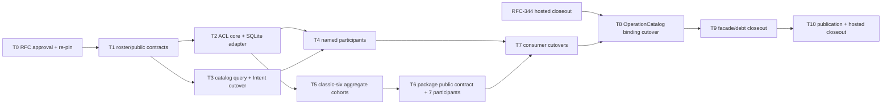

# RFC-345 实施计划 — Resource Catalog 与 ResourcePackage 合同归位

状态：Approved / In Progress（对账于 2026-09-02，HEAD `ea9a30187`）；D1～D10 已获用户明确批准。
T1～T3 完成；T4a～T4d、T5 六个 cohort 的 aggregate 面、T6 与 T8 已于 2026-08-31 进入 published `main`；
T7 主路径已切但 deep-import 未归零；**T9 未开始、T10 未做、AC-12 未满足**，RFC-345 / W4-C 不得标 Done。
逐条判据见 §7「2026-09-02 实施对账」。

Current-source pin：`625017c084db2f7eb6c9ec34c87eba41ffaf04cd`（`HEAD=origin/main`；RFC-344 published implementation
candidate）。生产实现开始前仍须 fresh fetch；OperationCatalog binding cohort 还必须等待 RFC-344 hosted closeout 后 re-pin 最终
exact SHA。

## 0. 批准与完成口径

- [x] 对照 RFC-294 W4-C 与 current ACL/catalog/package/consumer 源码；
- [x] 识别并修正 ACL=15、grant=16、package=7、Intent/selector=6 四个 roster；
- [x] 确认 Intent 两份 catalog、四个 named consumer 与 package 七类 writer 的 current path；
- [x] 写 proposal/design/plan 草案；
- [x] 用户明确批准 D1～D10；
- [x] 生产实现开始前 fresh fetch、确认 main/origin ancestry、共享 index 与 RFC-344 published baseline；
- [ ] AC-1～AC-12 与 published exact-SHA hosted closeout 全部满足后，RFC-345/W4-C 才能 Done。

本 RFC 可以拆成多个小 cohort commit，但它们共同关闭一个 W4-C。任何中间 contract、某一个 aggregate 或 package adapter 完成，都不能
提前标记 RFC-345/W4-C Done。

## 1. Baseline

| 指标/事实                                       | current | RFC-345 exit                                                          |
| ----------------------------------------------- | ------: | --------------------------------------------------------------------- |
| ACL resource kinds                              |      15 | canonical 15，core mechanism 覆盖；writer ownership 不被吞并          |
| grant-addressable kinds                         |      16 | canonical 16；`scheduled_task` 只在 grant adapter                     |
| package resource kinds                          |       7 | 7/7 exact mutation participant                                        |
| Intent/selector resource kinds                  |       6 | classic-six summary，不能随 ACL/package 自动扩张                      |
| `ACL_TABLES` 外部 importer                      |      13 | 0；仅 resource-catalog SQLite infrastructure                          |
| 直接 import legacy `resourceAcl` 的 source 文件 |      57 | named/aggregate cohort 逐步归零；最终只允许 explicit compatibility 面 |
| Intent 六路 visible catalog 实现                |       2 | 1 个 `ResourceCatalogQuery`                                           |
| package/Bundle apply lifecycle engine           |       1 | 仍为 1；W6 前不替换                                                   |
| package aggregate writer direct arms            |       7 | 0 direct import；改为 7 typed participants                            |
| AtomicApply lifecycle owner                     |       0 | 本 RFC仍为 0；只落 scenario/provider contract                         |
| DB migration                                    |       0 | 0                                                                     |

`resourceAcl` 57 个 direct importer 是全局迁移分母，不代表 57 个都归本 RFC：collaboration/development/digital-employee 等 writer
owner 可以暂经 explicit compatibility facade；RFC-345 closeout ledger 必须逐项写明“已迁/保留给哪个 W4 owner”，不能只报总数下降。

2026-08-30 live evidence：生产源码 `ACL_TABLES` 外部 importer 已由 13 降为 **0**；legacy `resourceAcl` 已由 1,064 行实现收成
re-export + WS composition wrapper；Intent 两份六路 loader 已归零并共同消费逐页 `ResourceCatalogQuery`。legacy `resourceAcl` direct
importer 当前 48 个，按 T4 named consumer、T5 aggregate、T6 package、T7 production cutover 与 T8 transport binding 继续清偿，不能据此
提前关闭 RFC。

## 2. 依赖图

T2、T3 和六个 T5 aggregate cohort 在 contracts 稳定后可以由不同 session 并行，但以下共享面需短暂串行：

- `services/resourceAcl.ts` facade 与 ACL infrastructure registry；
- 同一个 classic aggregate writer；
- `services/bundle/apply.ts` / `services/bundle/provider.ts`；
- OperationCatalog/MCP binding；
- shared RFC index/STATE/RFC-294 与 architecture canonical。

## 3. 任务

### T0 — RFC / current-source / 批准

- [x] 读取 RFC-294 W4-C target、RFC-271 package invariants、RFC-324 access verdict 与 RFC-344 operation contracts；
- [x] 逐源码核对 shared rosters、ACL registry、Intent catalogs、task/trigger/memory consumers、BundleApply/ResourcePackage；
- [x] 建立 source-backed baseline 与冲突矩阵；
- [x] 写 RFC-345 三件套并登记 Draft；
- [x] 用户批准 D1～D10；
- [x] 生产实现开始前 fresh fetch/re-pin；RFC-344 hosted closeout 前只启动 additive contract/core cohort；
- [x] 确认共享 index 为空，首个 cohort allowlist 为 `modules/resource-catalog/**`、RFC-345 contract guards 与本 RFC/父账本状态文档。

**退出门**：裁决与 source pin 明确；批准前 production diff=0。

### T1 — 四 roster、public types 与 contract guards

**前置**：T0 用户批准。

- [x] 从 shared canonical constants 派生 ACL=15 / grant=16 / package=7 / selector=6 aliases；
- [x] 新增 `CatalogResourceRef`、classic-six `ResourceSummary`、summary revision 与 page/cursor contracts；
- [x] 新增四 named participant request/result closed unions；
- [x] 新增 package seven-participant 与 future scenario/provider contracts；
- [x] public surface 不含 DB row/Drizzle/Actor/Hono/MCP/CLI/fs/journal artifacts；
- [x] type equality/runtime census、public entrypoint、forbidden generic negative fixtures；
- [x] RFC 草案阶段已修正 RFC-294 W4-C 13/6 漂移并链接 RFC-345 successor；production contract 仍待本任务其余项。

**退出门**：contracts additive、production behavior 不变；删除/新增任一 roster case 会在 compile/runtime guard 变红。

**回滚**：删除 additive module public types/tests 与文档修正；无数据影响。

### T2 — ACL domain/application/infrastructure 分层

- [x] 把 `resourceAccessPolicy.ts` 纯 verdict 迁入 `resource-catalog/domain`，保留旧入口 re-export；
- [x] 把 grant query、ACL get/update、initial ACL 与 owner/name handling 归 application + SQLite repository；
- [x] 将 `ACL_TABLES` / owner-name partition / Drizzle column selector 设为 infrastructure-private；
- [x] 建 current public command/query 与 `ResourceAuthorizationInTx`；
- [x] 当前 WS/audit callback 通过 composition adapter 注入，调用顺序/结果不变；
- [ ] 逐 caller 改用 public contract；未迁 caller 在 ledger 绑定 exact successor owner；
- [x] ACL matrix、ACL GET/PUT/transfer、list/access projection 与 existing error corpus不改判（实现与 source-lock 已落；按用户口径不跑本地
      Bun，最终以 hosted exact-SHA corpus 为准）。

**退出门**：`ACL_TABLES` 外部 importer 13→0；legacy `resourceAcl` 只 re-export/adapt，不拥有 table registry 或新增 branch。

**回滚**：在 facade 删除前整 cohort 回到旧 module；不触及 schema/data。

### T3 — `ResourceCatalogQuery` 与 Intent 两份 catalog 合一

- [x] 六个 aggregate 各提供 actor-filtered paged summary adapter；
- [x] SQLite 下推 visibility/search/pagination，跨 kind 按 canonical rank 合并；
- [x] `listVisibleIntentResources` 改投影 `ResourceCatalogQuery`；
- [x] dumpBuilder 改用同一 summary/ref set，并只按 closure 实际命中装载 typed detail；
- [x] current full-list adapter 逐页读完，不增加产品 cap；
- [x] 锁住 type order、name/description、mounted label、closure membership、hidden count 与 missing behavior；
- [x] 两份六路 `list* + filterVisibleRows` 复制归零。

**退出门**：Intent 两个 consumer 只有一个 actor-filtered catalog owner；full detail 不进入 `ResourceSummary`。

**回滚**：两 consumer 一起回旧 loader；不能长期双查并比较。

### T4 — 四个 named participant contracts 与 adapters

#### T4a — Task execution snapshot

- [x] 适配 workflow launch、agent injection、call workflow/workgroup freeze；（`2adacced3`）
- [x] 只返回 frozen task execution fields，保持 current launch/injection errors；
- [ ] `task-execution` 不再 deep import classic resource service/ACL/row loader。（未归零：`composition/agentActionExecution.ts`、
      `infrastructure/legacyCallClosure.ts`、`infrastructure/sqliteTaskRouteOperations.ts` 仍走 `@/services/resourceAcl`，
      `infrastructure/agentLaunchResourceOperations.ts` 仍 deep import RC `infrastructure/legacy/*`；见 §7.3）

#### T4b — Intent apply participant

- [x] 把 six prepare/commit arms包成 six closed variants；（`892dd1c32`）
- [x] Intent journal/claim/prestage/finalize/converger 留在 Intent；
- [ ] Intent apply 不 import `ACL_TABLES` 或 classic writer internals。（`ACL_TABLES` 已归零；但
      `modules/intent/infrastructure/postgresqlIntentApplyArtifactOwners.ts:20-33` 仍 import RC
      `infrastructure/legacy/{skillFsPublish,skillHash,skillIdentityPaths}`）

#### T4c — Integration trigger snapshot

- [x] 适配 scheduled workflow/agent/workgroup 与 webhook workflow/digital-employee exact variants；（`bc3d0f1b7`）
- [x] launch-shape/input mapping/trigger preflight 留各 current owner；
- [x] delegated mutation/binding cutover 以前置 current-authority seam 为门，不伪造 direct context。（前置 RFC-347/W4-E0 已 Done）

#### T4d — Memory scope authorization

- [x] agent/workflow scope view/edit 改走 `ResourceScopeAuthorizationInTx`；（`5bd020dee`）
- [x] global/repo/repo_group 分支留 memory/source-control owner；
- [x] memory 不获得 resource detail loader。（memory 侧只保留 `hasResourceAclBypass` 一个符号）

**退出门**：四个 consumer 的 cross-context edge 只指向具名 participant；每个字段 ledger exact，generic participant mutation 红。

**回滚**：每个 T4 子项是独立 cohort，可单独回旧 adapter；不改变 durable data。

### T5 — 经典六类 aggregate typed command/query cohorts

六类可以在 T1/T2 contract 稳定后分别认领；每一类重复同一迁移步骤，但不共享 mutation switch：

| cohort | current owner files                                     | package/Intent participant |
| ------ | ------------------------------------------------------- | -------------------------- |
| T5-A   | `services/agent.ts`、agent refs/deps/integrity          | agent                      |
| T5-S   | `services/skill.ts`、skill version/file/import adapters | skill                      |
| T5-M   | `services/mcp.ts`、MCP exact config operations          | MCP                        |
| T5-P   | `services/plugin.ts`、installer/publish adapters        | plugin                     |
| T5-WF  | `services/workflow.ts`、call/ref/query adapters         | workflow                   |
| T5-WG  | `services/workgroups.ts`、member/runtime adapters       | workgroup                  |

每个 cohort：

- [x] 建 public command/query/types/operation descriptor factory；（六 cohort commit 见 §7.1）
- [x] internal repository/mapper/prepare/commit 只留本 aggregate；
- [x] route/CLI/MCP current binding 改 public operation（T8 前可先经 compatibility adapter）；
- [x] Intent/task/package 引用改具名 participant；
- [ ] old service facade 只适配且 consumer 有 exact ledger；（agent/skill/workflow/workgroup 已收成 3～5 行 facade，
      `services/{skill,mcp,plugin}.ts` 已删除；但 plugin installer/closure/revision/GC 与 MCP probe/store/surface/closure/revision
      共 9 个文件、约 1.9K 行仍是 legacy implementation，逐条去向见 §7.3.1）
- [x] list/get/filter/create/update/delete 与 aggregate-specific error/fence corpus不改判。（`rfc345-*` 14 文件 71 用例绿）

**退出门**：六个 aggregate 各自 typed；不存在 universal CRUD switch/detail union/generic repository。

**回滚**：按 aggregate 整 cohort 回滚；共享 ACL contract 不回滚。

### T6 — ResourcePackage public operations 与七 participant adapter

- [ ] 把 parse/inspect/preview/apply/receipt/export 组织到 `resource-catalog/application/package`；（只落了
      `application/package/{packageApplication,ports}.ts`；`services/resourcePackage/**` 仍有 12 个文件）
- [x] 建 `ResourcePackageOperations` descriptor factory 与 REST/CLI 共用的 application handler；（`c609fd655`、`c19845794`）
- [x] 建 `ResourcePackageApplyTx` 七个 exact fields；（`public/participants.ts:350`）
- [x] 经典六类 participant 来自 T5，capability-template participant 来自 current writer owner；
- [x] `bundle/apply.ts` 不再 direct import 七类 writer，只调 typed participants；（`bundle/apply.ts` 已是 thin-facade）
- [x] 保持 current BundleApply claim/prestage/big-tx/tail/converger；
- [x] 落 future `ResourcePackageApplyProvider` scenario type/adapter，但不新增 AtomicApply engine/journal；
- [x] package current new/reuse/overwrite/export/secret/human/replay/recovery/capability-template corpus不改判。

**退出门**：7/7 exact participant；ResourcePackage public contract 与 engine lifecycle 分离；AtomicApply implementation 仍为 0。

**回滚**：恢复现有 package→BundleApply composition adapter；journal/schema不变。

### T7 — Named consumer production cutover

- [x] 按 T4a～T4d 逐 consumer 切 active path；（四个 consumer 均已走具名 participant）
- [ ] 每个 consumer 切换后删除自身 old deep import；（未完成，exact 残留见 §7.3.3）
- [x] 不保留 shadow read/double mutation；
- [x] source locks 防旧 cross-context edge复辟；（`rfc345-resource-acl-facade-retirement.test.ts` 等）
- [x] 更新 public symbol+field ledger、current owner 与保留债。

**退出门**：task/Intent/integration/memory 只经具名 participant；current用户行为保持。

### T8 — RFC-344 OperationCatalog binding cutover

**前置**：RFC-344 hosted closeout 的最终 published exact SHA + T5/T6/T7 对应 use case完成。

- [x] 为 catalog/ACL/classic aggregates/package 建 versioned exact operation descriptors；（`public/operations.ts` 513 行）
- [x] HTTP/MCP/CLI binding 指向同一 module operation；（`ffcff7428`、`ac93aba5e`）
- [x] 按 use case删除对应 `legacy-http.*` compatibility debt；（全仓 `legacy-http` 例外 = 0）
- [x] 保持 method/path/tool/command、input/output/status/public error；
- [x] 不修改 OperationCatalog kernel、route registry、MCP root 或 `server.ts`；若 existing binding API 不足，停止并另行协调 RFC-344 owner，
      不在本 RFC扩展 generic framework；
- [x] same-operation REST/MCP/CLI parity 与 descriptor codec tests。

**退出门**：RFC-345 cohort compatibility operation debt=0；全局其他 W4-B/E debt不冒领。

### T9 — Facade、imports 与 architecture debt closeout

- [ ] 删除 consumer=0 的 resource ACL/ref/catalog/package/aggregate legacy facade；
- [ ] 保留 facade 必须有 exact remaining consumer + remove owner，不用目录级/prefix exemption；
- [ ] public surface/cross-context/facade/mutation-entrypoint/transaction-effects ledgers重采；
- [ ] source-lock 防 `ACL_TABLES`、generic resource service、classic deep import 与 package writer direct arm复辟；
- [ ] RFC-294 W4-C 每一项建立 exact evidence；
- [ ] architecture canonical 只在 source freeze/publication critical section 由单 owner生成，不代交 RFC-344 当前 dirty JSON。

**退出门**：AC-1～AC-11 成立；W4-C debt归零或逐项转交已存在的 exact successor，不以“目录已建”代替生产 cutover。

### T10 — Publication / hosted closeout

- [ ] 按 shared-main policy fresh fetch；若 remote advance，安全同步并只做比例化复核；
- [ ] 确认 cached index为空；exact-stage 本 RFC allowlist，核对完整 staged path/diff；
- [ ] commit message 与实际 material contributors 的 trailers准确；
- [ ] commit 后核对 committed paths/message，push 前再 fetch/compare；
- [ ] push 后验证 `HEAD=origin/main`、divergence 0/0、remote ancestry；
- [ ] 跟踪 published exact SHA Main CI 与项目要求的定时 workflows；
- [ ] 全部 terminal success 后更新 RFC-345 三件套、RFC-294 W4-C、`design/plan.md`、`STATE.md` 为 Done。

## 4. 预计源码范围

最终 allowlist 按 cohort fresh 固定。当前预计：

- 新 module：`packages/backend/src/modules/resource-catalog/**`；
- legacy compatibility：`packages/backend/src/services/resourceAccessPolicy.ts`、`resourceAcl.ts`、`resourceRefs.ts`、
  `importRefs.ts`、六类 aggregate services、`services/intent/resourceCatalog.ts`、`intent/dumpBuilder.ts`、
  `services/bundle/**`、`services/resourcePackage/**`；
- named consumers：`services/execution/**`、`modules/task-execution/**`、`services/intent/**`、`services/scheduledTasks.ts`、
  `services/webhook/triggerValidation.ts`、`services/memory.ts`；
- adapters：六类 resource routes、`routes/resourceAcl.ts`、`routes/resourcePackages.ts`、`cli/package.ts`，以及 RFC-344
  published binding API 下的 focused operation binding；
- focused tests/source locks 与本 RFC文档。

默认不在 allowlist：

- DB schema/migrations；
- `server.ts`、`main.ts`、route registry、MCP server/root/tools catalog；
- architecture canonical JSON（当前已有 RFC-344 owner dirty output）；
- development-automation/digital-employee/integration aggregate writer implementation，除它们提供的 exact participant adapter；
- frontend（本 RFC零产品 UI/wire 变化；若 characterization 证明现有 UI 需适配，先单独回报精确路径）。

## 5. 冲突矩阵与并发纪律

| 路径/能力                                      | owner/风险                         | RFC-345 规则                                                         |
| ---------------------------------------------- | ---------------------------------- | -------------------------------------------------------------------- |
| RFC-344 local commit + architecture dirty JSON | RFC-344 publication owner          | 不编辑、不 stage、不代交；binding cohort 等 published re-pin         |
| `services/resourceAcl.ts` / ACL registry       | 全仓高扇入                         | T2 单 owner；其他 cohort 只消费 public contract                      |
| classic aggregate writer                       | T5 对应 aggregate owner            | 同一 aggregate 同时只一个 session写；不同 aggregate可并行            |
| Intent catalog / apply                         | T3/T4b owner                       | catalog 与 apply 分 cohort，避免同文件并写                           |
| BundleApply / ResourcePackage                  | T6 owner                           | 与 package writer direct-arm改造串行                                 |
| task/integration/memory consumer               | T4/T7 对应 owner                   | 每个 consumer独立，跨文件共享 facade只读                             |
| OperationCatalog/MCP binding                   | RFC-344 hosted closeout + T8 owner | hosted closeout 后单 cohort；不改 kernel/root                        |
| `design/plan.md` / `STATE.md` / RFC-294        | shared publication surface         | 只做保留式精确追加/修改；提交前协调 critical section                 |
| Git index/main ref                             | shared unowned critical state      | staging/commit/push短暂串行；index异常即停，不 reset/unstage他人内容 |

## 6. PR/commit 拆分建议

共享 main 不创建分支/worktree；以下只是 logical cohort/rollback point，不是并行 Git publication：

1. contracts + roster guards；
2. ACL core/infrastructure + compatibility facade；
3. catalog query + Intent two-consumer cutover；
4. four named participants（可按 consumer拆四个 commit）；
5. six aggregate cohorts（每类一个或数个小 commit）；
6. package public contract + seven participants；
7. RFC-344 operation binding cutovers；
8. facade/architecture debt cleanup；
9. docs/evidence closeout。

每个 commit exact-stage owned paths；不使用 `git add .`，不包含当前 RFC-344 architecture dirty files。发布时只有一个 session进入 Git
critical section，其他 session 可继续不冲突开发但暂避可能被同步/生成器更新的文件。

## 7. 2026-09-02 实施对账（HEAD `ea9a30187`）

本节是一次**事后对账**。2026-08-31 有一整批 cohort 直接进了 `main`，但本 RFC 文档最后一次改动停在 `fbc0ec093`（08-30），
`STATE.md` 也仍写着「下一 cohort 是 T5-M」。下面只记录当前事实并给可复跑判据，**不放宽 §0 的完成口径**——
T9 未开始、T10 未做、AC-12 未满足，RFC-345 / W4-C 仍是 In Progress。

### 7.1 已进入 published `main` 的实现

| 任务                             | 实现 commit                           | 现场判据（HEAD）                                                                                                                                                                                                                           |
| -------------------------------- | ------------------------------------- | ------------------------------------------------------------------------------------------------------------------------------------------------------------------------------------------------------------------------------------------ |
| T4a task execution snapshot      | `2adacced3`                           | `modules/resource-catalog/composition/taskExecution.ts` 构造 `createTaskExecutionResourceSnapshotInTx`；consumer 为 `task-execution` 的 `composition/triggerExecution.ts`、`application/taskExecutionCallClosure.ts`、`public/commands.ts` |
| T4b intent apply participant     | `892dd1c32`                           | `application/participants/intentApplyResourceParticipant.ts` + `infrastructure/aggregateAdapters/legacyIntentApplyResourceParticipants.ts`                                                                                                 |
| T4c integration trigger snapshot | `bc3d0f1b7`                           | `composition/integrationTrigger.ts`；consumer 为 `modules/integration/composition/scheduledTasks.ts`                                                                                                                                       |
| T4d memory scope authorization   | `5bd020dee`                           | `application/participants/resourceAuthorization.ts` → `composition/resourceAcl.ts#createResourceScopeAuthorizationInTx`                                                                                                                    |
| T5-A agent                       | `a39432577`、`2e298b8e9`              | `application/agents/`（9 文件）；`services/agent.ts` 收成 5 行 facade                                                                                                                                                                      |
| T5-S skill                       | `3edfa32b5`、`5e1161771`              | `application/skills/`（5 文件）；`services/skill.ts` 已删除                                                                                                                                                                                |
| T5-M MCP                         | `56fa9e88e`、`a07179869`              | `application/mcps/`（3 文件）；`services/mcp.ts` 已删除                                                                                                                                                                                    |
| T5-P plugin                      | `51808662c`、`c1987049b`              | `application/plugins/`（2 文件）；`services/plugin.ts` 已删除                                                                                                                                                                              |
| T5-WF workflow                   | `7ba2789cc`                           | `application/workflows/`；`services/workflow*.ts` 全部收成 3 行 facade                                                                                                                                                                     |
| T5-WG workgroup                  | `f8e23d54d`、`82d99ed59`、`19b86b450` | `application/workgroups/`（5 文件）；`services/workgroups.ts`、`services/workgroup/*.ts` 收成 3 行 facade                                                                                                                                  |
| T6 ResourcePackage               | `c609fd655`、`c19845794`              | `public/participants.ts:350` 的 `ResourcePackageApplyTx` 覆盖七类；`services/bundle/apply.ts` 已是 thin-facade                                                                                                                             |
| T8 operation binding             | `ffcff7428`、`ac93aba5e`              | `public/operations.ts`（513 行 descriptor）；`routes/{agents,skills,mcps,plugins,workflows,workgroups,workgroupTasks,resourcePackages}.ts` 与 `cli/package.ts` 只 import RC `public/`                                                      |
| T9 起手（非全部）                | `bd7a8a049`、`944e49528`、`2660044e5` | `services/resourceAcl.ts` 从 1064 行收成 70 行纯 re-export                                                                                                                                                                                 |
| RFC-349 叠加                     | `6474b3ec3`、`1e8799196`、`a5b61f059` | dual-provider catalog 组合；RC 因此多出一整套 `infrastructure/postgresql*` 镜像                                                                                                                                                            |

守卫现场：`bun test packages/backend/tests/rfc345-*.test.ts` = 14 文件 / 71 用例 / 0 fail（2026-09-02 本机）。

### 7.2 AC-1～AC-12 现状

| AC                                                 | 状态          | 判据                                                                                                                                        |
| -------------------------------------------------- | ------------- | ------------------------------------------------------------------------------------------------------------------------------------------- |
| AC-1 四 roster 15/16/7/6                           | ✅            | `rfc345-resource-catalog-contracts.test.ts` 绿                                                                                              |
| AC-2 `ResourceCatalogQuery` 只回 `ResourceSummary` | ✅            | `public/queries.ts:63-65` 的 `listVisible` / `getVisibleSummary`                                                                            |
| AC-3 Intent 两份 catalog 合一                      | ✅            | `services/intent/resourceCatalog.ts:15-20` 消费同一 query；`dumpBuilder.ts:50` 只用 RC public types                                         |
| AC-4 `ACL_TABLES` 仅 RC infrastructure 可见        | ✅            | 全仓 `ACL_TABLES` 外部 importer = 0（`platform/persistence/postgresqlForeignResourceAcl.ts` 的是同名前缀的 `FOREIGN_ACL_TABLES`，非本符号） |
| AC-5 四 named participant 字段闭合                 | ✅            | `public/participants.ts` 四个 `*InTx` 均为具名闭合类型，无 generic snapshot                                                                 |
| AC-6 经典六类各自 typed                            | ✅            | 六个 `application/<aggregate>/` 目录；无 universal CRUD switch                                                                              |
| AC-7 package 四操作走 module public                | ✅            | `routes/resourcePackages.ts` / `cli/package.ts` 均只 import RC `public/`                                                                    |
| AC-8 package participant 7/7                       | ✅            | `ResourcePackageApplyTx` 七臂 + `code-capability` 侧 capability-template owner                                                              |
| AC-9 package 既有语义不改判                        | ✅            | RFC-345 守卫组绿；无 schema/wire 变化                                                                                                       |
| AC-10 只在 RFC-344 最终 baseline 上切 binding      | ✅            | T8 commit 均晚于 RFC-344 final `c5c4faafc`                                                                                                  |
| AC-11 无 migration / 无 route/tool/CLI 增删        | ✅            | 本 RFC 提交无 `migrations/` 触及                                                                                                            |
| AC-12 exact-SHA hosted closeout                    | ❌ **未满足** | 未做：T9 未开始，也未按本 RFC 的 exact SHA 跟踪 Main + 定时 workflows                                                                       |

### 7.3 T9 exact 清单（本节即 T9 的输入）

#### 7.3.1 32 个 `removeAfterWave=W4-C` facade（13 thin / 19 legacy-implementation）

**32 个全部仍有 ≥1 生产 consumer，因此按 §T9 第一条「删除 consumer=0 的 facade」当前可删数为 0**；T9 的真实工作是逐条给出
remaining consumer + remove owner。

| 文件（`packages/backend/src/` 下）      | LOC | 账本 status           | 生产 consumer | consumer 归属                                        | 裁决                                                        |
| --------------------------------------- | --: | --------------------- | ------------: | ---------------------------------------------------- | ----------------------------------------------------------- |
| `services/agentDeps.ts`                 | 255 | legacy-implementation |             1 | W4-E1×1                                              | **改判**：执行面，targetContext 应为 task-execution → W4-E1 |
| `services/agentLaunch.ts`               | 470 | legacy-implementation |             3 | legacy-flat×2、W4-E1×1                               | **改判**：执行面，targetContext 应为 task-execution → W4-E1 |
| `services/agentLaunchReservation.ts`    |  40 | legacy-implementation |             3 | W4-C×1、W4-E1×1、legacy-flat×1                       | **改判**：执行面，targetContext 应为 task-execution → W4-E1 |
| `services/dynamicWorkflowRunner.ts`     | 475 | legacy-implementation |             5 | W4-E1×4、W4-C×1                                      | **改判**：执行面，targetContext 应为 task-execution → W4-E1 |
| `services/execution/agentInjection.ts`  | 403 | legacy-implementation |             9 | legacy-flat×9                                        | **改判**：执行面，targetContext 应为 task-execution → W4-E1 |
| `services/execution/agentProcess.ts`    | 221 | legacy-implementation |             3 | legacy-flat×3                                        | **改判**：执行面，targetContext 应为 task-execution → W4-E1 |
| `services/mcpClosure.ts`                |  75 | legacy-implementation |             1 | W4-E1×1                                              | → W4-E6（RFC-294 §8 已指定落点，未立项）                    |
| `services/mcpOperationRevision.ts`      |  16 | legacy-implementation |             2 | legacy-flat×2                                        | → W4-E6（RFC-294 §8 已指定落点，未立项）                    |
| `services/mcpProbe.ts`                  | 664 | legacy-implementation |             2 | route×1、legacy-flat×1                               | → W4-E6（RFC-294 §8 已指定落点，未立项）                    |
| `services/mcpProbeStore.ts`             |  96 | legacy-implementation |             4 | bootstrap×2、route×1、其它×1                         | → W4-E6（RFC-294 §8 已指定落点，未立项）                    |
| `services/mcpSurface.ts`                |  25 | legacy-implementation |             3 | route×2、其它×1                                      | → W4-E6（RFC-294 §8 已指定落点，未立项）                    |
| `services/mergeAgent.ts`                | 333 | legacy-implementation |             2 | W4-E1×1、legacy-flat×1                               | **改判**：执行面，targetContext 应为 task-execution → W4-E1 |
| `services/orchestratorAgent.ts`         | 348 | legacy-implementation |             8 | W4-E1×4、W4-C×2、bootstrap×1、legacy-flat×1          | **改判**：执行面，targetContext 应为 task-execution → W4-E1 |
| `services/pluginClosure.ts`             |  76 | legacy-implementation |             1 | W4-E1×1                                              | RC 未迁完实体 → 本 RFC T9 或紧邻 successor                  |
| `services/pluginGenerationGc.ts`        | 156 | legacy-implementation |             2 | 其它×2                                               | RC 未迁完实体 → 本 RFC T9 或紧邻 successor                  |
| `services/pluginInstaller.ts`           | 800 | legacy-implementation |             6 | legacy-flat×3、bootstrap×1、W4-E4a×1、W4-C×1         | RC 未迁完实体 → 本 RFC T9 或紧邻 successor                  |
| `services/pluginOperationRevision.ts`   |  16 | legacy-implementation |             2 | legacy-flat×2                                        | RC 未迁完实体 → 本 RFC T9 或紧邻 successor                  |
| `services/resourcePackage/skillTree.ts` |  17 | legacy-implementation |             3 | legacy-flat×3                                        | RC package 面 → 随 T6 尾巴收口                              |
| `services/systemAgentRun.ts`            | 821 | legacy-implementation |             6 | legacy-flat×5、其它×1                                | **改判**：执行面，targetContext 应为 task-execution → W4-E1 |
| `services/agent.ts`                     |   5 | thin-facade           |             6 | W4-E1×2、bootstrap×1、W4×1、W4-E9×1、其它×1          | consumer 迁走后删除（owner = 各 consumer wave）             |
| `services/skill-zip.ts`                 |   4 | thin-facade           |             1 | legacy-flat×1                                        | consumer 迁走后删除（owner = 各 consumer wave）             |
| `services/skillBootVerify.ts`           |   3 | thin-facade           |             1 | W4-E1×1                                              | consumer 迁走后删除（owner = 各 consumer wave）             |
| `services/workflow.ts`                  |   3 | thin-facade           |             7 | 其它×2、legacy-flat×2、bootstrap×1、W4-E9×1、W4-E1×1 | consumer 迁走后删除（owner = 各 consumer wave）             |
| `services/workflow.validator.ts`        |   3 | thin-facade           |             6 | legacy-flat×4、bootstrap×1、其它×1                   | consumer 迁走后删除（owner = 各 consumer wave）             |
| `services/workflow.yaml.ts`             |   3 | thin-facade           |             2 | W4-E7×1、其它×1                                      | consumer 迁走后删除（owner = 各 consumer wave）             |
| `services/workflowLaunchInputs.ts`      |   3 | thin-facade           |             4 | legacy-flat×3、W4-E1×1                               | consumer 迁走后删除（owner = 各 consumer wave）             |
| `services/workgroup/askerKey.ts`        |   3 | thin-facade           |             1 | W4×1                                                 | consumer 迁走后删除（owner = 各 consumer wave）             |
| `services/workgroup/constants.ts`       |   3 | thin-facade           |             1 | W4×1                                                 | consumer 迁走后删除（owner = 各 consumer wave）             |
| `services/workgroup/engine.ts`          |   3 | thin-facade           |             1 | W4-E1×1                                              | consumer 迁走后删除（owner = 各 consumer wave）             |
| `services/workgroup/launch.ts`          |   3 | thin-facade           |             2 | W4-E1×1、legacy-flat×1                               | consumer 迁走后删除（owner = 各 consumer wave）             |
| `services/workgroup/state.ts`           |   3 | thin-facade           |             1 | legacy-flat×1                                        | consumer 迁走后删除（owner = 各 consumer wave）             |
| `services/workgroups.ts`                |   3 | thin-facade           |             3 | bootstrap×1、W4-E1×1、其它×1                         | consumer 迁走后删除（owner = 各 consumer wave）             |

#### 7.3.2 19 处 `@/services/resourceAcl` import

共 19 处 import（`services/resourceAcl.ts` 已收成 70 行纯 re-export，零 DB/事务实现）：

| importer                                                                | 引用符号                                                                                                                                                | owner wave       |
| ----------------------------------------------------------------------- | ------------------------------------------------------------------------------------------------------------------------------------------------------- | ---------------- |
| `modules/collaboration/infrastructure/legacySqliteReview.ts`            | `resolveTaskRole`                                                                                                                                       | W4               |
| `modules/integration/composition/developmentAdapterConfigOperations.ts` | `assertNameUnchangedForEditor, canEditResource, canViewResource, filterVisibleRows, listGrantedResourceIds, requireResourceEdit, requireResourceGovern` | W4-B             |
| `modules/integration/composition/digitalEmployeeToolConnections.ts`     | `isVisibleToAudienceSnapshot`                                                                                                                           | W4-B             |
| `modules/task-execution/composition/agentActionExecution.ts`            | `initialBuiltinResourceAcl`                                                                                                                             | W4-E1            |
| `modules/task-execution/infrastructure/legacyCallClosure.ts`            | `isVisibleRow, listGrantedResourceIds`                                                                                                                  | W4-E1            |
| `modules/task-execution/infrastructure/sqliteTaskRouteOperations.ts`    | `canViewResource`                                                                                                                                       | W4-E1            |
| `modules/memory/infrastructure/sqliteMemoryCatalog.ts`                  | `hasResourceAclBypass`                                                                                                                                  | W4-E2            |
| `cli/postgresqlDaemonApplication.ts`                                    | `assertNameUnchangedForEditor`                                                                                                                          | W9 bootstrap     |
| `cli/start.ts`                                                          | `assertNameUnchangedForEditor`                                                                                                                          | W9 bootstrap     |
| `platform/persistence/sqlite/systemOverviewReadModel.ts`                | `visibleRowsCondition, type AclColumnRef`                                                                                                               | W9 platform      |
| `services/fusion.ts`                                                    | `hasResourceAclBypass`                                                                                                                                  | legacy flat      |
| `services/resourcePackage/closure.ts`                                   | `isVisibleRow`                                                                                                                                          | legacy flat      |
| `services/resourcePackage/export.ts`                                    | `isVisibleRow`                                                                                                                                          | legacy flat      |
| `services/resourcePackage/preview.ts`                                   | `isVisibleRow`                                                                                                                                          | legacy flat      |
| `services/scheduledTasks.ts`                                            | `canEditAccess, canGovernAccess`                                                                                                                        | legacy flat      |
| `services/taskLaunchGate.ts`                                            | `canViewResource`                                                                                                                                       | legacy flat      |
| `routes/fusions.ts`                                                     | `hasResourceAclBypass`                                                                                                                                  | 各域 route slice |
| `routes/memories.ts`                                                    | `hasResourceAclBypass`                                                                                                                                  | 各域 route slice |
| `routes/scheduledTasks.ts`                                              | `canEditAccess, canGovernAccess`                                                                                                                        | 各域 route slice |

#### 7.3.3 仍未归零的跨 context deep import（T7 尾巴）

外部模块对 RC 非 `public/` 层的 import：`composition` 65 处 / 11 文件、`infrastructure` 78 处 / 37 文件、
`application` 13 处 / 11 文件、`domain` 7 处 / 7 文件（`public/` 正常消费为 97 处 / 57 文件）。其中**不属于 bootstrap 且不属于
已登记 thin facade** 的真实违例样本：

- `modules/task-execution/infrastructure/agentLaunchResourceOperations.ts:8-14` → RC `application/resourceDefaults`、
  `infrastructure/legacy/agent`、`infrastructure/legacy/workflow.validator`、`composition/resourceAcl`；
- `modules/intent/infrastructure/postgresqlIntentApplyArtifactOwners.ts:20-33` → RC `infrastructure/legacy/skillFsPublish`、
  `skillHash`、`skillIdentityPaths`（即 T4b 第三条所说的 classic writer internals，未归零）；
- `modules/collaboration/infrastructure/sqliteReviewTaskAccess.ts:5-6` → RC `application/resourceDefaults`、`domain/resourceAccess`。

#### 7.3.4 账本分桶与本 RFC 的分母（B3/C3 的延伸）

1. `removeAfterWave` 由 `targetContextFor()`（`packages/backend/tests/architecture/rfc294Canonical.ts:407-451`）的**文件名关键词**
   派生，fallback 是 `task-execution`。因此当前分桶与实际归属存在系统性偏差，两个方向都有：
   - 归进 W4-C 但其实是执行面的：上表 9 个 agent/workflow 运行时文件（`agentLaunch` / `agentInjection` / `orchestratorAgent` /
     `systemAgentRun` / `dynamicWorkflowRunner` 等，合计约 3.4K 行）；
   - 真属 RC 却归进别处的：`services/resourceAcl.ts`→W4-E1（关键词全不匹配走 fallback）、`services/bundle/**` 与
     `services/resourcePackage/**` 多数→W4-E1、`resourcePackage/preview.ts`→W4（"preview" 命中 `review`）、
     `resourcePackage/commit.ts`→W5（命中 `commit`）、`resourcePackage/importPermissions.ts`→W4-E0（命中 `permission`）。
     这与 review-2026-08-30 §B3/§C3 是同一类问题，且已在该 review §6 列为「下一次由单一 owner 做 canonical 重生成时一并做」。
     **本 RFC 不单方面改生成器**；T9 收口时按上表给 exact 转交记录，分桶修正随那次重生成。
2. 分母已被 RFC-349 放大：`4aa832064`(08-31) → HEAD 的 canonical 分母为 cross-context 1926→6248、exception 1881→6044、
   public 596→946、owner 19960→25631。W4-C 桶从 212 涨到 915。**其中 RC 的 outbound 边 1054 条里，top target 是
   `db/schema.ts` 340、`util/errors.ts` 190、`db/client.ts` 80、`db/txSync.ts` 66、`postgresqlDatabaseClient.ts` 56、
   `auth/actor.ts` 49** —— 主要是双 provider 镜像与平台原语边，不是 RC 自身的业务耦合。T9 的退出门若照 915 逐条清，会把
   W9 平台合同的活提前吞进 W4-C；建议 T9 只认「inbound 504 条 + RC→非平台 outbound」，其余按 §7.3.4-1 转交。

### 7.4 下一步（不改变 §2 依赖图）

1. T9：按 §7.3.1 / §7.3.2 给出 exact 转交记录，清掉 consumer 已归零的 facade，并把三个 legacy 依赖桥
   （`services/intent/legacyIntentApplyResourceDependencies.ts` 50 条、`services/resourceAcl.ts` 49 条、
   `services/bundle/legacyResourcePackageMutationDependencies.ts` 47 条）与 bootstrap（`server.ts` 39 / `cli/*` 43）
   的 inbound 例外逐条定性；
2. T10：exact-SHA hosted closeout（Main + 8 条定时 workflow），然后才更新三件套 / `design/plan.md` / `STATE.md` 为 Done；
3. RFC-349 仍在途且其 `postgresql-evidence` 未绿，T10 的 exact-SHA 跟踪需避开其红窗口。
