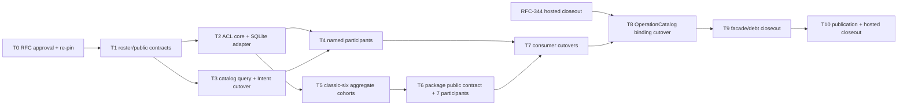

# RFC-345 实施计划 — Resource Catalog 与 ResourcePackage 合同归位

状态：Approved / In Progress（2026-08-30）；D1～D10 已获用户明确批准；T1、T3 已完成，T2 core/SQLite/facade 已完成且
caller cutover 随 T4/T5/T7/T8 继续。

Current-source pin：`625017c084db2f7eb6c9ec34c87eba41ffaf04cd`（`HEAD=origin/main`；RFC-344 published implementation
candidate）。生产实现开始前仍须 fresh fetch；OperationCatalog binding cohort 还必须等待 RFC-344 hosted closeout 后 re-pin 最终
exact SHA。

## 0. 批准与完成口径

- [x] 对照 RFC-294 W4-C 与 current ACL/catalog/package/consumer 源码；
- [x] 识别并修正 ACL=15、grant=16、package=7、Intent/selector=6 四个 roster；
- [x] 确认 Intent 两份 catalog、四个 named consumer 与 package 七类 writer 的 current path；
- [x] 写 proposal/design/plan 草案；
- [x] 用户明确批准 D1～D10；
- [x] 生产实现开始前 fresh fetch、确认 main/origin ancestry、共享 index 与 RFC-344 published baseline；
- [ ] AC-1～AC-12 与 published exact-SHA hosted closeout 全部满足后，RFC-345/W4-C 才能 Done。

本 RFC 可以拆成多个小 cohort commit，但它们共同关闭一个 W4-C。任何中间 contract、某一个 aggregate 或 package adapter 完成，都不能
提前标记 RFC-345/W4-C Done。

## 1. Baseline

| 指标/事实                                       | current | RFC-345 exit                                                          |
| ----------------------------------------------- | ------: | --------------------------------------------------------------------- |
| ACL resource kinds                              |      15 | canonical 15，core mechanism 覆盖；writer ownership 不被吞并          |
| grant-addressable kinds                         |      16 | canonical 16；`scheduled_task` 只在 grant adapter                     |
| package resource kinds                          |       7 | 7/7 exact mutation participant                                        |
| Intent/selector resource kinds                  |       6 | classic-six summary，不能随 ACL/package 自动扩张                      |
| `ACL_TABLES` 外部 importer                      |      13 | 0；仅 resource-catalog SQLite infrastructure                          |
| 直接 import legacy `resourceAcl` 的 source 文件 |      57 | named/aggregate cohort 逐步归零；最终只允许 explicit compatibility 面 |
| Intent 六路 visible catalog 实现                |       2 | 1 个 `ResourceCatalogQuery`                                           |
| package/Bundle apply lifecycle engine           |       1 | 仍为 1；W6 前不替换                                                   |
| package aggregate writer direct arms            |       7 | 0 direct import；改为 7 typed participants                            |
| AtomicApply lifecycle owner                     |       0 | 本 RFC仍为 0；只落 scenario/provider contract                         |
| DB migration                                    |       0 | 0                                                                     |

`resourceAcl` 57 个 direct importer 是全局迁移分母，不代表 57 个都归本 RFC：collaboration/development/digital-employee 等 writer
owner 可以暂经 explicit compatibility facade；RFC-345 closeout ledger 必须逐项写明“已迁/保留给哪个 W4 owner”，不能只报总数下降。

2026-08-30 live evidence：生产源码 `ACL_TABLES` 外部 importer 已由 13 降为 **0**；legacy `resourceAcl` 已由 1,064 行实现收成
re-export + WS composition wrapper；Intent 两份六路 loader 已归零并共同消费逐页 `ResourceCatalogQuery`。legacy `resourceAcl` direct
importer 当前 48 个，按 T4 named consumer、T5 aggregate、T6 package、T7 production cutover 与 T8 transport binding 继续清偿，不能据此
提前关闭 RFC。

## 2. 依赖图

T2、T3 和六个 T5 aggregate cohort 在 contracts 稳定后可以由不同 session 并行，但以下共享面需短暂串行：

- `services/resourceAcl.ts` facade 与 ACL infrastructure registry；
- 同一个 classic aggregate writer；
- `services/bundle/apply.ts` / `services/bundle/provider.ts`；
- OperationCatalog/MCP binding；
- shared RFC index/STATE/RFC-294 与 architecture canonical。

## 3. 任务

### T0 — RFC / current-source / 批准

- [x] 读取 RFC-294 W4-C target、RFC-271 package invariants、RFC-324 access verdict 与 RFC-344 operation contracts；
- [x] 逐源码核对 shared rosters、ACL registry、Intent catalogs、task/trigger/memory consumers、BundleApply/ResourcePackage；
- [x] 建立 source-backed baseline 与冲突矩阵；
- [x] 写 RFC-345 三件套并登记 Draft；
- [x] 用户批准 D1～D10；
- [x] 生产实现开始前 fresh fetch/re-pin；RFC-344 hosted closeout 前只启动 additive contract/core cohort；
- [x] 确认共享 index 为空，首个 cohort allowlist 为 `modules/resource-catalog/**`、RFC-345 contract guards 与本 RFC/父账本状态文档。

**退出门**：裁决与 source pin 明确；批准前 production diff=0。

### T1 — 四 roster、public types 与 contract guards

**前置**：T0 用户批准。

- [x] 从 shared canonical constants 派生 ACL=15 / grant=16 / package=7 / selector=6 aliases；
- [x] 新增 `CatalogResourceRef`、classic-six `ResourceSummary`、summary revision 与 page/cursor contracts；
- [x] 新增四 named participant request/result closed unions；
- [x] 新增 package seven-participant 与 future scenario/provider contracts；
- [x] public surface 不含 DB row/Drizzle/Actor/Hono/MCP/CLI/fs/journal artifacts；
- [x] type equality/runtime census、public entrypoint、forbidden generic negative fixtures；
- [x] RFC 草案阶段已修正 RFC-294 W4-C 13/6 漂移并链接 RFC-345 successor；production contract 仍待本任务其余项。

**退出门**：contracts additive、production behavior 不变；删除/新增任一 roster case 会在 compile/runtime guard 变红。

**回滚**：删除 additive module public types/tests 与文档修正；无数据影响。

### T2 — ACL domain/application/infrastructure 分层

- [x] 把 `resourceAccessPolicy.ts` 纯 verdict 迁入 `resource-catalog/domain`，保留旧入口 re-export；
- [x] 把 grant query、ACL get/update、initial ACL 与 owner/name handling 归 application + SQLite repository；
- [x] 将 `ACL_TABLES` / owner-name partition / Drizzle column selector 设为 infrastructure-private；
- [x] 建 current public command/query 与 `ResourceAuthorizationInTx`；
- [x] 当前 WS/audit callback 通过 composition adapter 注入，调用顺序/结果不变；
- [ ] 逐 caller 改用 public contract；未迁 caller 在 ledger 绑定 exact successor owner；
- [x] ACL matrix、ACL GET/PUT/transfer、list/access projection 与 existing error corpus不改判（实现与 source-lock 已落；按用户口径不跑本地
      Bun，最终以 hosted exact-SHA corpus 为准）。

**退出门**：`ACL_TABLES` 外部 importer 13→0；legacy `resourceAcl` 只 re-export/adapt，不拥有 table registry 或新增 branch。

**回滚**：在 facade 删除前整 cohort 回到旧 module；不触及 schema/data。

### T3 — `ResourceCatalogQuery` 与 Intent 两份 catalog 合一

- [x] 六个 aggregate 各提供 actor-filtered paged summary adapter；
- [x] SQLite 下推 visibility/search/pagination，跨 kind 按 canonical rank 合并；
- [x] `listVisibleIntentResources` 改投影 `ResourceCatalogQuery`；
- [x] dumpBuilder 改用同一 summary/ref set，并只按 closure 实际命中装载 typed detail；
- [x] current full-list adapter 逐页读完，不增加产品 cap；
- [x] 锁住 type order、name/description、mounted label、closure membership、hidden count 与 missing behavior；
- [x] 两份六路 `list* + filterVisibleRows` 复制归零。

**退出门**：Intent 两个 consumer 只有一个 actor-filtered catalog owner；full detail 不进入 `ResourceSummary`。

**回滚**：两 consumer 一起回旧 loader；不能长期双查并比较。

### T4 — 四个 named participant contracts 与 adapters

#### T4a — Task execution snapshot

- [ ] 适配 workflow launch、agent injection、call workflow/workgroup freeze；
- [ ] 只返回 frozen task execution fields，保持 current launch/injection errors；
- [ ] `task-execution` 不再 deep import classic resource service/ACL/row loader。

#### T4b — Intent apply participant

- [ ] 把 six prepare/commit arms包成 six closed variants；
- [ ] Intent journal/claim/prestage/finalize/converger 留在 Intent；
- [ ] Intent apply 不 import `ACL_TABLES` 或 classic writer internals。

#### T4c — Integration trigger snapshot

- [ ] 适配 scheduled workflow/agent/workgroup 与 webhook workflow/digital-employee exact variants；
- [ ] launch-shape/input mapping/trigger preflight 留各 current owner；
- [ ] delegated mutation/binding cutover 以前置 current-authority seam 为门，不伪造 direct context。

#### T4d — Memory scope authorization

- [ ] agent/workflow scope view/edit 改走 `ResourceScopeAuthorizationInTx`；
- [ ] global/repo/repo_group 分支留 memory/source-control owner；
- [ ] memory 不获得 resource detail loader。

**退出门**：四个 consumer 的 cross-context edge 只指向具名 participant；每个字段 ledger exact，generic participant mutation 红。

**回滚**：每个 T4 子项是独立 cohort，可单独回旧 adapter；不改变 durable data。

### T5 — 经典六类 aggregate typed command/query cohorts

六类可以在 T1/T2 contract 稳定后分别认领；每一类重复同一迁移步骤，但不共享 mutation switch：

| cohort | current owner files                                     | package/Intent participant |
| ------ | ------------------------------------------------------- | -------------------------- |
| T5-A   | `services/agent.ts`、agent refs/deps/integrity          | agent                      |
| T5-S   | `services/skill.ts`、skill version/file/import adapters | skill                      |
| T5-M   | `services/mcp.ts`、MCP exact config operations          | MCP                        |
| T5-P   | `services/plugin.ts`、installer/publish adapters        | plugin                     |
| T5-WF  | `services/workflow.ts`、call/ref/query adapters         | workflow                   |
| T5-WG  | `services/workgroups.ts`、member/runtime adapters       | workgroup                  |

每个 cohort：

- [ ] 建 public command/query/types/operation descriptor factory；
- [ ] internal repository/mapper/prepare/commit 只留本 aggregate；
- [ ] route/CLI/MCP current binding 改 public operation（T8 前可先经 compatibility adapter）；
- [ ] Intent/task/package 引用改具名 participant；
- [ ] old service facade 只适配且 consumer 有 exact ledger；
- [ ] list/get/filter/create/update/delete 与 aggregate-specific error/fence corpus不改判。

**退出门**：六个 aggregate 各自 typed；不存在 universal CRUD switch/detail union/generic repository。

**回滚**：按 aggregate 整 cohort 回滚；共享 ACL contract 不回滚。

### T6 — ResourcePackage public operations 与七 participant adapter

- [ ] 把 parse/inspect/preview/apply/receipt/export 组织到 `resource-catalog/application/package`；
- [ ] 建 `ResourcePackageOperations` descriptor factory 与 REST/CLI 共用的 application handler；
- [ ] 建 `ResourcePackageApplyTx` 七个 exact fields；
- [ ] 经典六类 participant 来自 T5，capability-template participant 来自 current writer owner；
- [ ] `bundle/apply.ts` 不再 direct import 七类 writer，只调 typed participants；
- [ ] 保持 current BundleApply claim/prestage/big-tx/tail/converger；
- [ ] 落 future `ResourcePackageApplyProvider` scenario type/adapter，但不新增 AtomicApply engine/journal；
- [ ] package current new/reuse/overwrite/export/secret/human/replay/recovery/capability-template corpus不改判。

**退出门**：7/7 exact participant；ResourcePackage public contract 与 engine lifecycle 分离；AtomicApply implementation 仍为 0。

**回滚**：恢复现有 package→BundleApply composition adapter；journal/schema不变。

### T7 — Named consumer production cutover

- [ ] 按 T4a～T4d 逐 consumer 切 active path；
- [ ] 每个 consumer 切换后删除自身 old deep import；
- [ ] 不保留 shadow read/double mutation；
- [ ] source locks 防旧 cross-context edge复辟；
- [ ] 更新 public symbol+field ledger、current owner 与保留债。

**退出门**：task/Intent/integration/memory 只经具名 participant；current用户行为保持。

### T8 — RFC-344 OperationCatalog binding cutover

**前置**：RFC-344 hosted closeout 的最终 published exact SHA + T5/T6/T7 对应 use case完成。

- [ ] 为 catalog/ACL/classic aggregates/package 建 versioned exact operation descriptors；
- [ ] HTTP/MCP/CLI binding 指向同一 module operation；
- [ ] 按 use case删除对应 `legacy-http.*` compatibility debt；
- [ ] 保持 method/path/tool/command、input/output/status/public error；
- [ ] 不修改 OperationCatalog kernel、route registry、MCP root 或 `server.ts`；若 existing binding API 不足，停止并另行协调 RFC-344 owner，
      不在本 RFC扩展 generic framework；
- [ ] same-operation REST/MCP/CLI parity 与 descriptor codec tests。

**退出门**：RFC-345 cohort compatibility operation debt=0；全局其他 W4-B/E debt不冒领。

### T9 — Facade、imports 与 architecture debt closeout

- [ ] 删除 consumer=0 的 resource ACL/ref/catalog/package/aggregate legacy facade；
- [ ] 保留 facade 必须有 exact remaining consumer + remove owner，不用目录级/prefix exemption；
- [ ] public surface/cross-context/facade/mutation-entrypoint/transaction-effects ledgers重采；
- [ ] source-lock 防 `ACL_TABLES`、generic resource service、classic deep import 与 package writer direct arm复辟；
- [ ] RFC-294 W4-C 每一项建立 exact evidence；
- [ ] architecture canonical 只在 source freeze/publication critical section 由单 owner生成，不代交 RFC-344 当前 dirty JSON。

**退出门**：AC-1～AC-11 成立；W4-C debt归零或逐项转交已存在的 exact successor，不以“目录已建”代替生产 cutover。

### T10 — Publication / hosted closeout

- [ ] 按 shared-main policy fresh fetch；若 remote advance，安全同步并只做比例化复核；
- [ ] 确认 cached index为空；exact-stage 本 RFC allowlist，核对完整 staged path/diff；
- [ ] commit message 与实际 material contributors 的 trailers准确；
- [ ] commit 后核对 committed paths/message，push 前再 fetch/compare；
- [ ] push 后验证 `HEAD=origin/main`、divergence 0/0、remote ancestry；
- [ ] 跟踪 published exact SHA Main CI 与项目要求的定时 workflows；
- [ ] 全部 terminal success 后更新 RFC-345 三件套、RFC-294 W4-C、`design/plan.md`、`STATE.md` 为 Done。

## 4. 预计源码范围

最终 allowlist 按 cohort fresh 固定。当前预计：

- 新 module：`packages/backend/src/modules/resource-catalog/**`；
- legacy compatibility：`packages/backend/src/services/resourceAccessPolicy.ts`、`resourceAcl.ts`、`resourceRefs.ts`、
  `importRefs.ts`、六类 aggregate services、`services/intent/resourceCatalog.ts`、`intent/dumpBuilder.ts`、
  `services/bundle/**`、`services/resourcePackage/**`；
- named consumers：`services/execution/**`、`modules/task-execution/**`、`services/intent/**`、`services/scheduledTasks.ts`、
  `services/webhook/triggerValidation.ts`、`services/memory.ts`；
- adapters：六类 resource routes、`routes/resourceAcl.ts`、`routes/resourcePackages.ts`、`cli/package.ts`，以及 RFC-344
  published binding API 下的 focused operation binding；
- focused tests/source locks 与本 RFC文档。

默认不在 allowlist：

- DB schema/migrations；
- `server.ts`、`main.ts`、route registry、MCP server/root/tools catalog；
- architecture canonical JSON（当前已有 RFC-344 owner dirty output）；
- development-automation/digital-employee/integration aggregate writer implementation，除它们提供的 exact participant adapter；
- frontend（本 RFC零产品 UI/wire 变化；若 characterization 证明现有 UI 需适配，先单独回报精确路径）。

## 5. 冲突矩阵与并发纪律

| 路径/能力                                      | owner/风险                         | RFC-345 规则                                                         |
| ---------------------------------------------- | ---------------------------------- | -------------------------------------------------------------------- |
| RFC-344 local commit + architecture dirty JSON | RFC-344 publication owner          | 不编辑、不 stage、不代交；binding cohort 等 published re-pin         |
| `services/resourceAcl.ts` / ACL registry       | 全仓高扇入                         | T2 单 owner；其他 cohort 只消费 public contract                      |
| classic aggregate writer                       | T5 对应 aggregate owner            | 同一 aggregate 同时只一个 session写；不同 aggregate可并行            |
| Intent catalog / apply                         | T3/T4b owner                       | catalog 与 apply 分 cohort，避免同文件并写                           |
| BundleApply / ResourcePackage                  | T6 owner                           | 与 package writer direct-arm改造串行                                 |
| task/integration/memory consumer               | T4/T7 对应 owner                   | 每个 consumer独立，跨文件共享 facade只读                             |
| OperationCatalog/MCP binding                   | RFC-344 hosted closeout + T8 owner | hosted closeout 后单 cohort；不改 kernel/root                        |
| `design/plan.md` / `STATE.md` / RFC-294        | shared publication surface         | 只做保留式精确追加/修改；提交前协调 critical section                 |
| Git index/main ref                             | shared unowned critical state      | staging/commit/push短暂串行；index异常即停，不 reset/unstage他人内容 |

## 6. PR/commit 拆分建议

共享 main 不创建分支/worktree；以下只是 logical cohort/rollback point，不是并行 Git publication：

1. contracts + roster guards；
2. ACL core/infrastructure + compatibility facade；
3. catalog query + Intent two-consumer cutover；
4. four named participants（可按 consumer拆四个 commit）；
5. six aggregate cohorts（每类一个或数个小 commit）；
6. package public contract + seven participants；
7. RFC-344 operation binding cutovers；
8. facade/architecture debt cleanup；
9. docs/evidence closeout。

每个 commit exact-stage owned paths；不使用 `git add .`，不包含当前 RFC-344 architecture dirty files。发布时只有一个 session进入 Git
critical section，其他 session 可继续不冲突开发但暂避可能被同步/生成器更新的文件。
