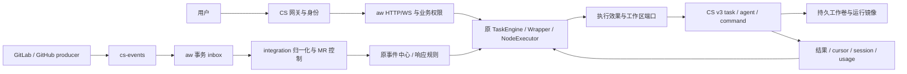

# RFC-370 技术设计

状态：In Progress · 2026-09-28。用户已批准实现、部署及上库；下列目标按阶段落地，实际进度见 plan。以下端口名／新增表／aw 路径是目标设计，CS v3 路径和 DTO 以固定源码基线为依据，详见 [evidence](./evidence.md)。

## 1. 基线与架构落位

- aw：`a53425b87bc6fa124d74829c278f52059ca04c93`，main 与 origin/main 对齐，开始时无本地改动。
- CS：`ae95d2e88e9337899955ffdf38ad49a0dc6c1928`，只读其已提交能力。本机其他会话的 console 与 e2e WIP 不作为合同证据。
- 对齐 RFC-294：保持 TaskEngine → WrapperRuntime → NodeExecutor → ExecutionKernel。新增宿主效果端口不替代 Task／Reaction／Event Center 的业务状态机。
- `task-execution/application/ports` 拥有执行需求，`source-control` 拥有 Git／workspace 效果，`runtime-management` 拥有 profile 映射；`integration` 拥有代码平台归一化，`event-center` 拥有 observation／response intent。
- `identity-access` 拥有外部身份映射；`system-operations` 拥有宿主模式／交接；各业务域通过自己的内容端口消费 `platform` 的存储机制。CS wire client 在 infrastructure，领域 DTO 不暴露 CS HTTP response 或 Kubernetes 对象。
- 跨域只依赖 exact `public/{commands,queries,participants,events,types}`；新增 composition 精确入口仅供 bootstrap 装配。当前 `cli/start.ts`、`server.ts` 和 legacy services 只保留委托接线，本 RFC 不再向其添加 CS 业务判断。



### 1.1 阶段 A：先形成可替换的适配切面

H1～H8 是职责清单，不是现有八个插件接口。先按下表普查每个调用者，记录现位置、owner、端口、adapter、composition 入口和行为回归用例。下列路径是目标结构；现有合格合同复用，缺失部分才抽取。

| 切面            | 当前基础与缺口                                                    | 阶段 A 的交付                                                                                                          | 阶段 B 的接入                                                   |
| --------------- | ----------------------------------------------------------------- | ---------------------------------------------------------------------------------------------------------------------- | --------------------------------------------------------------- |
| H1 启动／数据库 | 已有 PG provider；安装元数据、配置、generation 与本地启动仍耦合   | system-operations 拥有安装／启动需求；抽取配置、安装元数据与生命周期端口，保留文件及现 provider 实现                   | CS 配置／Secret、前台服务和 migration Job 装配；复用 PG         |
| H2 身份         | HTTP／WS 已有认证与 revalidation 接线，尚无统一外部身份适配       | identity-access 拥有身份合同；原登录方式经现有／抽出的 adapter 接线，复用 Actor／ACL                                   | CS 用户／服务身份适配与 subject 映射                            |
| H3 工作区       | 已有 Task／SC 读取与准备合同；物理 Git／FS 效果需继续收口         | SC-owned workspace／Git 效果端口与 local adapter；Task 继续依赖 SC public 合同                                         | SC 远程工作卷、命令、文件读写 adapter                           |
| H4 执行         | 现 AgentProcessRequest 仍暴露 cmd／cwd／env／PID                  | task-execution 拥有中立执行效果合同；本地 spawn、PID、管道和终止树封装入 local adapter，业务／系统执行入口全部接线     | CS 原生 agent／command、收据、流、取消与恢复 adapter            |
| H5 Runtime 材料 | 已有两种 RuntimeDriver，但 buildSpawn／文件物化与协议职责交织     | runtime-management 拥有冻结配置／能力需求；两种协议职责保留，分离本地启动物化与执行目标材料转换                        | profile／image 绑定、CS 材料编译与能力翻译                      |
| H6 内容         | Paths 下技能／插件／快照等本地事实尚未统一经内容合同访问          | 各域拥有内容引用与保留规则；platform 提供中立存储机制，原文件目录由 filesystem adapter 实现                            | 各 owner 的 CS 对象 adapter；AW PG 只存元数据、引用与效果日志   |
| H7 执行权／恢复 | 现单实例与 owner 规则存在，后台效果和启动恢复尚需统一接线         | system-operations 拥有执行权生命周期合同；local 实现保留现单实例／重启语义，各域消费必要 authority／恢复合同           | CS lease／handoff／recovery adapter；业务恢复仍归原域           |
| H8 事件入站     | 已有 verified webhook 受理、持久化与归一化；需分离 transport 信封 | integration 收口 transport-neutral 受理输入／事务参与者；GitLab／GitHub 直连入站 adapter 保持验签、去重、MR 与事件语义 | CS EventDelivery 入站 adapter、来源绑定及独立 transport receipt |

阶段 A 的执行引用和材料合同表达 aw 的逻辑执行身份、能力及结果；不得让业务层持有 CS task/subtask DTO。原 PID 只留本地实现，现有数据库或 UI 的兼容投影仍须保留。需要远程派发的 intent／binding 在阶段 B 增加，不为抽端口提前改变 standalone 的重试、恢复或事务语义。

重构采用“固定现有行为 → 抽取 owner-owned port → 将现实现移入 adapter → 切换全部调用者 → 清除已迁入口的直连效果”顺序。不能只套一个 facade 后仍让引擎或应用层直接调用 FS／spawn。系统 Agent、MCP 测试台、脚本／Git 和后台扫描器与主工作流同样属于普查范围。原公共 DTO、业务状态转换、取消与资源释放顺序均有行为回归；新增抽象不得以缩减原能力换取统一。

### 1.2 阶段 B：各模块独立 CS adapter

建议物理结构如下，路径是设计目标而非当前文件事实；同一结构按各 owner 重复，不强制空目录：

```text
packages/backend/src/
  modules/<owner>/
    application/ports/                 # owner 定义平台中立需求
    infrastructure/local/              # 阶段 A：现本地效果实现
    infrastructure/crewstation/        # 阶段 B：CS outbound 适配与领域翻译
    inbound/crewstation/               # 阶段 B：需要的 HTTP／事件等入站适配
    composition.ts                    # 仅向 bootstrap 导出精确装配入口
    public/                           # 既有受控跨域合同
  platform/crewstation/                # 阶段 B：中立 HTTP、wire codec、SSE 机制
  platform/storage/                   # 中立字节传输机制；域引用及恢复留各 owner
  bootstrap/                          # 按部署配置选择并注入实现
deploy/crewstation/                   # 仓库根目录：镜像、Manifest、发布材料
```

`platform/crewstation` 不 import 任何业务 module，不持有 Task／Reaction／事件中心状态机或业务表；它不是统管所有适配的 CrewStationService。各域 adapter 将 wire DTO 翻译成自己拥有的合同。模块间仍只走 exact public／已登记 SPI，不能互相 deep import CS adapter；bootstrap 通过 composition 入口装配，不能 deep import infrastructure，也不负责业务翻译。入站 adapter 调用本域 public command，不能直接落业务表。

独立性以导出边界、依赖守卫、替换测试和单写 owner 为准；本期不强制拆成多个 workspace／npm 包。部署模式判断集中于启动装配与产品需要的模式投影，domain／application／engine 不依赖 CS 客户端、环境变量、wire DTO，也不增加 `if (crewstation)` 分支。跨域共享内容机制属于 platform，内容业务规则仍留原域。

### 1.3 两阶段退出门

- **A 门（AC00）**：入口清单逐项完成；local／原 provider adapter 经真实行为回归，双 OS／双数据库 CI 与功能实现门通过；依赖守卫证明调用方向正确，无 CS 运行依赖；形成独立可发布的 standalone 版本和证据 SHA。A 门未通过，不开始 CS 生产 adapter、托管绑定表或 hosted 启动实现。
- **B 门（AC01～AC12）**：A 门通过后，按 B1～B4 对应条件实现 CS adapter、托管接线与数据迁移；两种 adapter 使用共同业务合同验收，并补 CS 特有失败／交接／重放场景。真实集群和浏览器验收完成才可标完整托管 Done。

阶段 A 可只读核对 CS 合同以避免设计遗漏，但不夹带 CS 生产实现；B1～B4 的远程能力／容量／迁移验证属于阶段 B 对应任务前置条件，不阻塞不依赖这些结果的本地切面重构。如果阶段 B 发现中立合同不足，先独立补合同和 local 回归、重新通过受影响的 A 门检查，再恢复依赖它的 CS 实现；不借平台特性把 wire 对象反向泄漏到业务层。

### 1.4 阶段 B 的可运行增量

阶段 B 不采用“完成全部 adapter 后统一部署”。先交付 M0 的必要适配并在实际 CS 安装验证，随后在同一测试安装增量接入 M1～M3，M4 才收口完整托管与旧实例迁移。每个增量同时交付 adapter、必要数据迁移、功能入口／诊断、相关合同测试与现场证据，不将 UI、部署脚本或恢复路径全部拖到最后。

- **M0 部署底座**：H1 前台服务、现 PG、配置／Secret、一次性迁移、探针；H2 CS 浏览器身份与必要业务管理员映射；H6 支撑已开放资源编辑的耐久内容。真实验收 CS 入口→登录→编辑／保存→服务 Pod 重建→再次读取。新安装只做当期容量和新身份验证，旧 PAT／用户迁移与大历史导入留到对应里程碑。
- **M0 执行边界**：复用 A 阶段抽出的执行能力／authority 合同，托管装配尚未就绪的执行端口返回明确的 unavailable 原因；不启动调度、系统 Agent 或有外部效果的后台 worker，不接收会产生执行的 CS 事件订阅。配置编辑／读取仍可用。不能用 local adapter 回退填补 CS 缺口。此时不宣称具备任务恢复或任意槽切换能力。
- **M1 最小执行闭环**：选一条代表性流程和一个已验证 profile，接远程仓库／工作卷、原生 Agent、材料、持久 requestKey／收据、结果流、取消／释放与服务重启对账。必须同时接入单 active authority、失租约停派发和旧 owner 结果处理；不能先开放任务、以后再补执行唯一性。该版本只声明已验证组合，其余组合在启动前提示未就绪。
- **M2 能力扩展**：按 H3～H5 调用者／能力矩阵逐项收编剩余 runtime、Git、脚本、插件、MCP、系统 Agent、DAG／循环／fan-out／call／fusion／工作组等；每项按本身依赖验证 B1／B2／B3，开通后即部署并跑通对应流程。M1 的端口与状态机复用，不为每个批次另建执行器。
- **M3 事件及运维扩展**：在目标 Task／Reaction 路径就绪后接 H8；在所需执行合同就绪后逐项开放 CS 恢复动作、完整蓝绿交接及其他后台功能。可与无依赖的 M2 条目穿插，但每条都要有可运行证据；未通过交接验收前采用停派发、排空在途任务、单槽维护发布，不能让两个版本同时执行。
- **M4 收口**：完整能力矩阵、所有 AC、旧身份／PAT／内容迁移、正式切换和回退完成后关闭 RFC；不能将 M0／M1 写成完整接入完成。

能力可用性由装配和已验证的 adapter 合同投影给 API／UI，使用平台中立的支持状态和缺失原因；不新建独立业务状态机。仅未接齐的组合受限，已接入能力持续可用；CS 平台临时故障按既有错误语义报告，不能伪装成未实现。每次发布记录新增可用项、仍未接入项、镜像／合同版本和验收结果。B1～B4 拆成具体能力检查项，不能用一个全局阻塞项卡住 M0 或不相关增量。

下文 H1～H8 描述两阶段完成后的目标行为，其中 CS 专属绑定、表、协议与部署均在阶段 B 落地。

## 2. H1：服务部署、配置与数据库

拟新增显式配置 `deployment.mode = standalone | crewstation`，默认 standalone。CS 必需值缺失时启动报错，不按发现环境变量自动切换模式。现有 `agent-workflow start` 已是前台启动（`main.ts` 命令说明及 `cli/start.ts` 的 `startCommand`／`serveDaemon`）；本 RFC 抽取的是宿主配置、安装元数据、控制文件与生命周期依赖，并增加托管启动装配，复用现有监听与 daemon provider session，不重复实现 HTTP 服务；保留 standalone CLI 行为。

托管入口读取 CS 的 PORT、CS_DATABASE_URL、CS_PLATFORM_API_URL、CS_JWKS_URL、CS_PROJECT、CS_SERVICE、CS_ENVIRONMENT；业务配置／Secret 的 definition UUID 由安装工具解析并写入 Manifest。CS_SLOT 仅作展示，不作为执行授权。

复用 RFC-359 PostgreSQL provider，**不新增 CS 专用 SQL 实现**。现 generation 文件、config.json、secret.key 和 demo marker 的事实分别迁为受控安装元数据／配置引用；启动仍核对 provider 与 schema generation，不能简单绕过 generation 校验或在临时盘生成新的主密钥。业务密钥由 CS Secret 注入并稳定续用；禁止输出 connection string 或明文密钥。

拟议交付物：`deploy/crewstation/Dockerfile`、Manifest 模板、配置／目录 UUID 解析工具、前台服务／migrate 命令、发布和回退 runbook。服务镜像含前端静态资源及控制面代码；不包含生产 Agent 凭据或通过特权宿主挂载执行任务。

Manifest 使用 `crewstation/v3` DigitalWorker、服务 replicas=1、startup/readiness/liveness probes 和 migrationCommand。CS Manifest 的 tasks 字段可选，M0 省略 tasks，并由 aw 装配保持执行未就绪；M1 起声明 tasks.executionControl=fenced、acceptedTaskContractVersions=[aw-task-v1]、defaultVolumeMode=persistent。recovery 为可选能力，随增量只声明已实现且已验收的动作；不以虚假任务合同或恢复声明填充 M0。所有占位 ID 在发布前必须从目标环境解析；本稿不提供可误部署的假 UUID Manifest。

`/live` 只证明进程可响应；`/ready` 证明配置、schema、内容存储和路由可用，**不等待获得 active 租约**，避免待命发布无法 ready／切流的循环。是否能提交执行由 H7 独立判定。迁移由 CS migration Job 单入口执行；业务进程不得各自启动迁移。滚动兼容采用 expand-only，删除列／缩窄状态另发版本完成，无法兼容的版本在交接前阻止切换。

## 3. H2：身份、授权与浏览器会话

拟新增 `HostedIdentityPort.authenticate` 与现有 revalidation 接线，由 HTTP 和 WS 共用，输出现 Actor 所需身份与 authority revision，继续通过原 authorization application。ActorSource 新增明确的 hosted 分支，不伪装成 daemon 或本地 password session；枚举相关审计／权限穷尽点并保持原语义。CS 模式将 identityToken 与 sourceToken 分为两种不可互换的认证入口。

- 用户请求按CS既有合同校验 `x-cs-identity-token`：固定 issuer=crewstation、JWKS 签名／允许算法／exp、aud=`service:<CS_PROJECT>/<CS_SERVICE>`、subject=`user:<UUID>`。配置 JWKS URL 不能来自请求。明文 user-id 与签名 subject 不一致即拒绝。
- 外部身份映射键为 `(installationId, issuer, subject)`，aw 用户继续使用自身 ID；不按 email 自动合并。新身份只取批准的最低业务权限。已有用户迁移由管理员显式映射并保留审计；首次业务管理员用部署时指定的 CS subject 白名单建立，不以“第一个访问者”晋升。
- 用户 token 只建立身份，不能绕 aw 对工作流、任务、资源、规则及恢复操作的授权。CS 的项目角色和 aw 的业务 ACL 分属两层。
- 事件入口仅接受已验证来源为配置的 cs-events 服务身份的 sourceToken，核对 kind／aud／trace 及绑定配置，不接受用户 token 冒充传输来源。
- 托管浏览器 API 改用同源网关会话，不把长期 aw bearer 放在查询串。WS 握手走同一认证与现有连接准入；令牌到期前重新经网关握手，失败关闭连接。aw 本地撤权仍使用现 revalidation hook。不得让一次握手的 token 无限延长连接权限；CS 撤权可见窗口上限不得超过所验短期令牌有效期。
- 登录失败引导 CS 登录并保留原业务返回地址；前端取消原本地token登录提示。复用现路由单门和 ACL kernel，本RFC不增加额外安全加固层。
- CLI／API 自动化不能靠硬编码用户 JWT；M0 仅开放已完成适配的调用面与浏览器入口，旧 PAT 客户端列入 C1 迁移阻塞，需明确合同后接入。

## 4. H3/H6：工作区与内容的持久边界

### 4.1 工作区

复用 Task `TaskWorkspaceReadPort` 和 SC 的来源封存／准备流程，扩展 SC-owned 物理效果端口的 remote 实现。逻辑引用为 `{workspaceRef, generation, relativePath, version?}`；本地实现才解析绝对路径。禁止把 CS `/work` 当成服务 Pod 内可读写路径。

一个 aw 根执行作用域绑定一个 persistent CS business task／volume，子任务是否共享工作区由现 call／fusion／wrapper 语义决定，不能一律按 aw task 行新建卷。隔离 node／fan-out 的 worktree 在卷内各自拥有稳定目录；merge 仍由 aw 现写锁和新 fence 串行裁决。多仓 URL、认证引用、分支、resolved commit 和准备 receipt 保留 RFC-363 的归属及两条 launch lane。

新任务的文件输入先发布到 RFC-035 对象空间，再随任务创建传入 `inputObjects[{objectId,sha256,path}]`；CS 持久 pin 并物化到任务卷。对象输入不是活跃卷的任意文件写 API。Git／脚本以及任务创建后的动态工作区写入经 v3 command 调用镜像中固定的 `aw-workspace-tool`，保留既有脚本节点本身的执行语义。确需动态传字节时，应用协议通过 argv 传有界 base64 chunk（单块原始内容≤16KiB，编码后单参数低于当前32768字符上限，请求总长低于2MiB），卷内工具按 operationId、digest、offset 写临时文件并在总摘要一致后 atomic rename。发布前对 actual body／argv 限额、二进制、执行位和断点做实测；不把新任务输入合同当成这条动态写入协议已通过。

读取使用 `/v3/business-tasks/:taskId/file` 和 `/files` 的版本化分页，续读必须带 version；Git diff／merge／checkout 等走远程命令而非下载全仓到服务容器。每个命令 outcome、输出工件 digest 与工作区 generation 持久关联，超时不能当“没执行过”重发新键。旧 generation 回执不能更新当前工作区。

源码仓库访问与 webhook 接收是独立能力：CS producer 不提供 Git clone／API 写凭据。SSH／HTTPS 私有仓库、host key、GitLab 私有 CA、出站 APIProxy 或获准网络路径须在安装预检中逐项确认；不假设任意公网 URL 都可访问。

### 4.2 非工作区内容

aw 还有 skills、plugins、snapshots、runs、attachments、archives 等本地事实。CS serviceSpec 没有持久服务卷字段，不能通过未声明 hostPath/PVC 偷补。

CS RFC-035 已提供服务域对象合同。本稿选定 CS 对象空间保存不可变 skills／plugins 版本、附件和归档内容，AW PG 保存配置、域版本、objectId／摘要、引用及持久效果日志，standalone 文件实现不变。原 PG 内容字节／chunk 方案不再作为实施目标。各 owner 的读／写／生命周期／恢复端口保持独立，在本模块 `infrastructure/crewstation/` 翻译对象协议；共同客户端只提供传输机制，不拥有 AW 的版本发布、保留或恢复决定。详细合同与阶段边界见 [RFC-035 存储接入](./rfc035-storage.md)。

资源包复用现有 record-before-act 工件与恢复合同，计划／暂存／安装／补偿／完成都在同一 AW apply 编排中等待；合同归 resource-catalog application，local 文件实现与后续 CS 实现分别装配。旧 journal 字段及兼容出口不变，物理引用只由所选存储解释；包读取的元数据、正文解析与稳定排序仍由 AW 投影，不建立 provider 或 CS 专属业务状态机。

对象 ready 并完成域引用／pin 后才发布可消费版本。AW 原 canonical tree `contentHash` 与归档字节 `sha256` 分别保存，目录、二进制文件、mode 位保持原语义。对象操作和 AW PG 提交不是单一事务；稳定 requestKey、operationId、uploadId 与阶段记录支持丢回执后沿原操作恢复，不因未知写结果换键重复上传。缓存可重建；Secret／主密钥仍由 H1 稳定提供。M0 验证已开放编辑路径跨服务副本及 Pod 重建的耐久性；大历史容量、对象备份和活跃任务卷恢复在对应里程碑验收，平台单独 acceptance 不替代 AW 联合证明。

## 5. H4/H5：执行传输、材料与 Runtime 能力

### 5.1 接口层次

保留 RuntimeKind=`opencode | claude-code`。新增 `executionTarget=local | crewstation` 与 Agent 协议正交；不实现 `RuntimeDriver.kind='crewstation'`，也不把 CS task UUID 塞进 PID 字段。

拟议 `ExecutionEffectPort` 由执行层调用，方法为 `submit(frozenRequest)`、`inspect(ref)`、`readEvents(ref,cursor)`、`sendMessage(ref,expectedAttempt,content)`、`cancel(ref,expectedAttempt,reason)`；返回 aw-owned 执行引用、attempt／generation 和能力信息。`local-process` 或 `remote-execution` 是效果实现的收据分支，业务调度不据此切换规则。本地 PID 与 CS wire ID 均封装在对应 adapter 的绑定中；CS 绑定至少包括 platformInstance、serviceId、taskId、subtaskId、attempt、executionId、generation、materialDigest，由 adapter 以中立执行引用解析，不允许任意 JSON payload 代替合同或把 CS response 暴露给引擎。

local adapter 保留 managedProcess 的 launch nonce／先收据后激活／TERM→KILL 语义；CS adapter 提交原生 `kind=agent` 或 `command` 并消费平台 lifecycle。**不是把旧 AgentProcessRequest 的 cmd/cwd/env 原样 POST 给 CS**。prompt、systemPrompt、skills、MCP、subagents 与 profile 要先在 H5 编译成平台材料，旧本地 buildSpawn 只留在 local 分支。

所有调用者必须枚举迁移：业务 Agent、工作组 host／member、脚本／Git，以及意图、记忆蒸馏、commit／review、MCP 测试台等系统 Agent。不得主任务远程、系统 Agent 仍偷偷在服务槽 spawn。系统执行拥有独立稳定 execution owner/ref，并复用同一传输机制，不能伪造用户 Task 或绕过现 Execution Contract。

### 5.2 持久派发与收据

拟议 `hosted_execution_bindings` 记录 aw owner/run、CS task/subtask、attempt、executionId、generation、cursor、profile/image revision、material digest；唯一键为 aw 的稳定执行身份与业务 attempt。`hosted_effect_intents` 记录 requestKey、canonical request digest、状态和响应，不使用一次 HTTP 请求的随机 UUID 作为重试键。

1. aw 现业务事务写 effect intent，检查本地 task ownership 与 H7 fence，提交后再调用 CS。
2. requestKey 是逻辑操作身份的有界编码／hash（≤128字符），例如 install+nodeRun+logicalAttempt+effectKind；HTTP 超时重用原键。
3. 创建 CS task 与提交 subtask 分别有持久键；先恢复已有 task binding，不能因未 ready／429 就再造一个父任务。
4. 收到 receipt 后用同一业务事务核对 fence、保存 binding、推进现有执行状态。崩溃窗口由原 requestKey 查重回执收敛。
5. CS terminal receipt 不直接写 Task done；原 envelope、输出合同、预算、merge 和 node supersession 判据仍由 aw 执行。

### 5.3 事件、恢复与结果

CS execution stream 与 CS EventDelivery 是两套合同，不共用去重表。前者用于运行日志／工具／session／usage／result，后者用于业务事件输入。

运行流采用稳定 sourceEventId + task/subtask/attempt 去重；aw 事件入库、usage 处理和消费 cursor 在同一事务提交。累计 usage 以 measurementId/scope 单调高水位处理，delta 按事实 ID 去重。业务结果要收齐 finalCursor；snapshot 里 succeeded 但尾流未取完不能提前丢弃取证。

断线先补页再续 SSE；`gap` 表示不完整历史，读取快照和有界结果进行对账，标记缺口，不生成不存在的 token／工具／inventory 数据。CS 当前默认保留7天，aw 必须在窗口内耐久归档，不能把 CS 当永久会话库。process=unknown 时暂停新 attempt并对账，不推断失败／成功。cancel 确认前不释放 aw 工作区和占用；失败原因区分 quota、transport、timeout、resource-reaped 与用户取消。

### 5.4 材料与能力闸门

aw 冻结自身 Agent／workflow／runtime 资源快照；安装绑定表把 runtime selection 映射为 CS agentProfileId／computeProfileId／profileRevision 和经过授权的 image。每次首次 dispatch 获取 capability，缓存按实际 revision 和 release 隔离；热编辑只影响新执行，resume 沿用历史材料与原生 session 策略。

| 需求                                                            | 当前 CS 可消费面                               | 设计判定                                                                                               |
| --------------------------------------------------------------- | ---------------------------------------------- | ------------------------------------------------------------------------------------------------------ |
| prompt、systemPrompt、skills、受控 env、MCP、subagents          | v3 material + agent submit                     | 做实际加载与 token／连接／依赖闭包对拍，不能仅 schema 成功                                             |
| 私有 binary／模型／extraArgs／provider 网关                     | 管理员 compute profile／运行镜像               | 逐值映射；没有等价配置则预检阻塞，不用 command 伪装平台 Agent                                          |
| 插件任意内容及 per-run 激活、AW startup inventory／子会话完整性 | 当前 materials/capabilities 未直接声明等价字段 | 阻塞 B1：先证明可由受控镜像+材料得到等价效果和取证；否则需要 CS 配套 RFC／合同增补                     |
| 任意 stdio MCP 或 aw task-scoped callback                       | connectionId 和授权 MCP 材料                   | 阻塞 B2：证明自定义服务、AW scoped token、撤权、依赖 Agent传播与回连网络可用；不能用平台管理员凭据代替 |
| 工作区输入、动态写入与持久内容                                  | RFC-035 对象／inputObjects；v3 command／文件读 | 验证 ready／pin／任务输入与 H3 动态写入；对象合同不等于活跃卷通用文件写 API                            |
| profile inventory、模型列表、probe／测试台                      | v3 capability 不等于现 aw 全部管理接口         | CS 模式 UI 显示实际平台绑定和只读能力，原编辑流须有明确迁移入口；不造成功 probe                        |

用户已选择完整接入。B1/B2未消除时试点只能算中间验证，AC03/AC05不得关闭，不能作为缩减范围的最终交付。需要的平台合同变更归 CS RFC，aw 不私改 Runner 内部协议。

## 6. H7：执行权与升级恢复

CS v3 control 的 epoch／leaseId／instanceId 是远程效果权限，aw 原 Task claim、launch/effect revision 是业务并发权限，**两者同时满足**，不能互相替代。租约剩余窗口不足时先续租再启动长事务；时钟回退／网络异常时停止新增效果。

拟增 `HostedExecutionAuthorityPort`，由单一生命周期组件 claim／renew／activate。以服务身份调用 `/v3/business-execution/control/*`。preview 不凭 CS_SLOT 领权；active 租约失效后停止调度、外部回写、轮询 observer、schedule、Event Center target dispatch、DE workers、distillation 和 GC 等后台效果，不能只停 NodeExecutor。

aw DB 中保存当前安装的 authority epoch／holder／lease，沿用执行正确性要求将受控写与该行锁定在同一原业务事务中；新拥有者等待旧事务排空、升 epoch 后再恢复 intent。不是另建一套权限事务。CS远程fence与aw业务事务不能跨库原子提交，派发intent及稳定requestKey专门处理这个窗口。租约丢失时不执行“把全部 running 标 interrupted并重跑”的 standalone 启动回收算法，也不拿失效身份全量 cancel；只能等有效新拥有者按 durable receipt 接管。

交接顺序：冻结 admission／后台派发 → 等受控写事务排空并持久水位 → 申报 preparation digest 与 aw-task-v1兼容版本 → CS 完成激活 → 新拥有者提升本地 fence、恢复 cursor、补未决 intent。业务迁移期间通过 CS migration ready 合同宣告 quiescence；迁移屏障同时排空会修改schema涉及业务表的HTTP写请求；期间新的写入及事件受理返回可重试503，不能仍由旧槽ACK到迁移中的表。迁移失败或 incompatible taskContractVersion 时阻止切换，保留旧版本恢复通道。stopAuthority 只用于该迁移的取消／暂停／关闭，不能借它启动新执行。

CS RFC-029 的五种恢复请求必须由 aw recovery handler 消费：先根据 CS requestedBy 映射 aw 用户，复核业务 ACL、目标 run、generation／attempt、materialDigest、volumeUid／native session，然后持久受理原 recovery request ID。aw 页面发起相同动作也经这一条业务恢复入口；不得 aw 和 CS 各重试一次。原卷缺失需要 restart 新 task并关联旧历史，不能把旧 nodeRun 当未执行而无提示重放。恢复成功取决于实际执行／工作区状态，收到 request ACK 不是完成。

## 7. H8：CS webhook 到 aw 事件中心

### 7.1 绑定、认证和映射

拟新增 `POST /integrations/crewstation/events`，只挂在 CS 模式；契约为 CS EventDelivery v1，成功返回204。安装时将实际 eventType UUID 写到 Manifest subscriptions，handlerPath 固定为该入口；不是由 aw 为每个响应规则另造 CS 订阅。

绑定键为 `(installationId, producerId)`，值含 provider、已批准的代码平台 instance／API base、仓库 allowlist 和 aw logical endpointId。source.project、payload URL 和 eventType 文本不能自行扩大权限。认证先验 sourceToken 的平台来源、aud 与配置，再对照 envelope 和 x-cs-delivery-id/type/attempt；EventProducer 身份取信封并检查已登记绑定，不把 producer 的 payload 当调用方身份。

CS 信封不携带原 webhook headers／签名字节，不能调用 githubVerify/gitlabVerify 重新“验上游签名”。该信任由已上线 producer 验签及 cs-events 服务来源承担。aw 增加 transport-specific 验证上下文；复用 provider normalize 时生成内部 HeaderBag，只表达事件种类及稳定身份，审计明确 `cs-delegated` 而非 `direct-signature`。

| CS 类型族                                          | 内部 normalize 所需事件头／aw 语义                                     |
| -------------------------------------------------- | ---------------------------------------------------------------------- |
| gitlab.push / tag-push                             | payload.object_kind + Push Hook／Tag Push Hook → push/tag_push         |
| gitlab.merge-request.\*                            | Merge Request Hook + 原 action/state → mr_opened/updated/closed/merged |
| gitlab.merge-request.comment / issue.comment       | Note Hook + noteable_type → note/issue_comment                         |
| gitlab.pipeline.\*                                 | Pipeline Hook + 原 status → succeeded/failed或按现规则忽略             |
| gitlab.issue.\*                                    | Issue Hook + 原 changes/labels → issue_labeled 或现支持语义            |
| github.push / tag-push                             | x-github-event=push                                                    |
| github.pull-request.open/reopen/update/close/merge | pull_request，保留 payload.action／merged                              |
| github.pull-request.comment / issue.comment        | issue_comment，以 issue.pull_request 区分                              |
| github.pull-request.review-comment                 | pull_request_review_comment，保留行位置与线程                          |
| github.issue.labeled                               | issues                                                                 |
| github.workflow-run.success/failure/timed-out      | workflow_run，以原 conclusion 归一化                                   |

这是映射族说明，实施时必须由两 producer 实际 produces × aw CODE_HOST_EVENT_TYPES 生成**穷尽矩阵**，显式标每个“映射／原有忽略／不支持／畸形”，不能用 wildcard 把 CS 的额外40类型全当 aw 必须启动的事件。未知版本或未知绑定不伪造 accepted；类型和 payload 家族冲突拒收。provider 纯归一化逻辑从 legacy adapter 收入 integration domain/application，直连入口共用。

### 7.2 持久 ACK 与两层去重

拟增 `cs_event_inbox`：主键 `(installationId, deliveryId)`，保存 eventId、producerId、eventTypeId、payloadDigest／payload、source binding revision、receivedAt、处理状态及 lastError。唯一事实键 `(installationId, producerId, eventId, logicalEndpointId)` 防止同一事件多订阅重复触发同一 source；同一 delivery ID 不同内容返回409并审计。

接收事务只做验证后入库／幂等命中，commit 后204。数据库失败503；签名／来源失败401/403；非法合同400；未知目录绑定422，不吞掉错误。ack不等待 workflow完成。commit 后丢ACK重投返回204；ACK后进程崩溃由 inbox worker恢复。

拥有 active fence 的 worker 从 inbox 归一化，调用 integration 现 verified-delivery 受理命令及 MR stream/effect 单事务语义，之后进入 `codeHostEventObservations` 的原 business + compatibility 两类观测。拟从 integration public/commands 精确暴露业务受理命令，不跨域 deep import persistence。原 event-center 幂等 observation／response intent 继续消费，不新增第二条 direct startTask 捷径。

新的稳定 eventUuid 使用受绑定作用域保护的 CS eventId，**不使用 deliveryId／attempt**。当前legacy accept的重复查询会排除failed/rejected行，不能只把CS eventId塞入eventUuid便声称崩溃安全。CS分支必须有永久transport receipt键，独立于业务投递终态；将inbox stage完成、规范化deliveryId绑定、现MR stream/effect受理纳入integration-owned同一UnitOfWork事务。为此把现受理逻辑提为域内可复用事务参与者，由新的public命令组合，原直连显式replay策略保持。任意失败/取消终态都不能删除CS受理receipt后重新创建业务事实。payloadArtifactRef 保留原有 webhook-delivery读取面，另关联 transport receipt；JSON重序列化的字节不得伪称原HTTP raw bytes。永久归一化失败保留 `rejected` 和可查询错误，不算“业务已处理成功”。

CS dead replay 是同一 transport delivery 的重试，不自动创造 aw 新业务执行。aw 用户“重新处理”是显式新业务命令，携带 replay request ID、原 observation及授权，沿用现 MR终态／replay控制。两个重放按钮显示不同对象。

### 7.3 直连迁移与双通道

原 webhook endpoint 与 CS binding 共用 logical source，但先建立影子接收（存储、归一化对拍、不派发）→ 暂停该 source admission → 记录直连水位和在途 delivery → 关闭旧上游地址／启用 CS 订阅 → 切换 transport mode → 对账补差后恢复规则。没有共同上游事件 UUID 时无法可靠自动合并两路，须按仓库、MR、评论/流水线ID及原payload清单人工／确定性补差；不宣称跨通道 exactly-once。CS回退到直连也走相同步骤。

## 8. 拟新增持久事实与 ID

| owner                           | 事实                                                 | 唯一性／并发约束                                                          |
| ------------------------------- | ---------------------------------------------------- | ------------------------------------------------------------------------- |
| system-operations               | hosted installation、配置引用、authority             | installation + 当前 epoch；租约拥有者 CAS                                 |
| identity-access                 | CS subject → aw user                                 | installation/issuer/subject 唯一；管理员映射审计                          |
| task-execution                  | hosted effect intent／execution binding／运行 cursor | 原 execution identity + logical attempt + operation；CS ID 不覆盖 aw ULID |
| source-control                  | remote workspace binding／准备及 chunk receipt       | workspaceRef + generation + operationId；继承现来源封存                   |
| runtime-management              | runtime/profile/image binding                        | aw runtime snapshot + platform revision；变更影响新 run                   |
| 各资源 owner + platform storage | object binding／域引用／持久效果日志；字节在 CS      | 稳定操作键；ready／pin 后发布；跨 CS／AW 提交沿原日志恢复                 |
| integration                     | cs_event_inbox／producer source binding              | delivery 唯一、event事实唯一、stage 可重放                                |

这些是逻辑表合同，阶段 B 各增量任务冻结所需schema与迁移编号后再编码；不能把多域 writer 合并进一个“CrewStationService”万能模块。新增 schema 必须遵循双 provider 迁移／测试基线；standalone 不启用托管 workers，但迁移不能破坏旧库。ULID、CS UUIDv7、上游仓库/评论ID及 native sessionId 保持各自命名空间。

## 9. 发布、迁移和回退

阶段 A 经 A-G 验收后才进入 CS adapter 实现。阶段 B 先以 H1/H2/H6 必要适配完成 M0 真实部署和持久性验收，再在已部署版本逐项接入 H3/H4/H5/H7 和 H8；首次部署不能依赖全量 runtime／MCP／事件／迁移完成。M0 记录为“控制面可用部署”，M1 为“远程任务闭环”，M4 才是“完整托管上线”。每个里程碑都有实际 release、配置及验收证据。

旧安装迁移：停所有业务写入及后台效果 → 在途执行完成或显式停机形成终态 → 导出一致的 DB＋内容＋配置引用／密钥映射 → 新 CS 项目导入并对账数量／摘要／身份／仓库绑定 → 无外部副作用的影子验证 → 配置CS producer和订阅 → 人工批准正式切换。禁止迁入一个仍有原生进程活着的 task 并立即 resume。

兼容升级支持 CS 切回旧服务镜像及旧 acceptedTaskContractVersion；内容对象采用不可变版本。一次迁移开始写入新的 aw 数据后，不能单靠“旧库还在”退回 standalone；先停写并执行经过验收的反向导出／回放，否则只允许在CS内回退兼容代码。Manifest版本、源码SHA、平台合同版本、配置revision与迁移报告进入发布清单。

## 10. 测试与完成判据

测试与 proposal AC 一一对应。纯协议／转换做单元测试；双provider真实事务覆盖冲突与崩溃窗口；实际CS合同测试覆盖认证、额度、lease、stream和恢复；实际集群覆盖蓝绿及卷重建；浏览器覆盖SSO、错误提示、状态、规则和恢复入口。fixture 不能代替真实协议或真实上游联网。

特别回归：老epoch迟到结果、MR close/reopen乱序、source supersession、Reaction丢回执、human gate等待后重启、call/fusion共享卷、native session恢复、后台observer重复派发、WS撤权、密钥轮换、二进制上传、插件／MCP／依赖Agent能力缺口。方法测试不能用“源码包含CrewStation字样”代替行为。

遵守aw当前规则：远端精确SHA CI为正式门禁，本设计阶段不启动本地全量测试／服务／容器。实现阶段复用现双OS／双数据库和架构守卫，对新增owner/public/composition边重采相关RFC-294账本，不因本RFC局部交付关闭父架构全部波次。

## 11. 未闭合项及禁止偷换

| 阻塞项                                         | 谁负责闭合                   | 阶段 B 对应任务实施前需要的结论                                                                     |
| ---------------------------------------------- | ---------------------------- | --------------------------------------------------------------------------------------------------- |
| B1 完整材料／插件／inventory／session取证等价  | aw runtime + CS Agent合同    | 实际可映射矩阵与失败用例；若不能等价，先给CS配套设计并补齐后再验收                                  |
| B2 MCP自定义入口及task-scoped回连／Git认证网络 | aw integration + CS授权/网络 | 授权、撤权、Secret、回连和私有仓访问证据；不借用管理员会话                                          |
| B3 对象消费／域引用恢复与H3输入／动态写入      | aw storage／SC + CS 对象合同 | 冻结 binding／pin／效果日志；实测当期容量、丢回执恢复与任务输入／动态写入，不以平台通过替代 AW 验收 |
| B4 托管身份迁移与PAT调用者                     | 用户／aw identity            | 批准业务管理员名单和旧自动化客户端替代方案                                                          |

架构目标无新增豁免；存量PID/FS/driver耦合在本次触及范围必须收敛到端口，未触及的RFC-294债务不顺带宣称清零。CS合同已具备的部分与以上待验证差异分开记账。
