# 利用工作流驱动 AI 和人，而不是相反

## ——为什么 在几百人团队 推广 AI 会这么难

> 这是 **AI Native 交付工作流** 系列的上篇。上篇讲述"把 AI 推给每一个工程师"这条路在几百人团队会遇到的困难，以及我们应该用什么样的产品形态来替代它；[下篇](./02-agent-workflow-how.md) 会讲我正在做的 Agent Workflow 工程如何把这一切落到工具流程上。

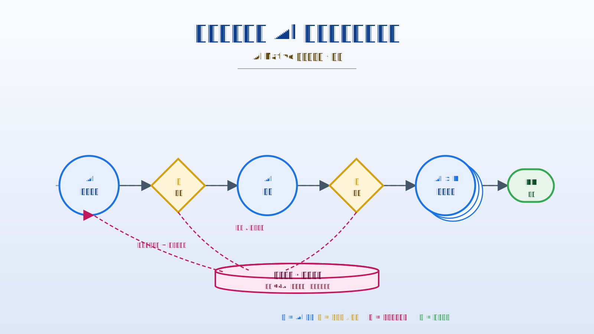

---

## 引子：那张漂亮的 AI 推广报表

过去两年，几乎每一个研发部门都做过同一件事：把某种 AI 编码工具发到每一个工程师手上，培训、宣讲、做几场实践分享，然后回头去统计数据——AI 工具的"使用率"、"代码补全采纳率"、"日均 prompt 数"。

但只要你随机打开一个普通工程师的 IDE 看 10 分钟，就会发现两个真相：

- 用得最多的还是那几个高手；
- 用得最深的几个高手，他们的用法没有第二个人能复刻。

把镜头拉到团队层面，那张"使用 80%"的报表就变成了：**80% 的人按了几次 Tab 接受了补全，5% 的人真的在用 AI 写功能，剩下的人在初次使用可能就被各种问题劝退了。**

更糟的是，那 5% 的高手在干什么、他们的最佳实践是什么，团队既看不见、也复用不上、更没法治理。我们当然知道 AI 应该带来跃迁式效率提升，但跃迁没有发生——发生的只是**少数人单点用的很好，多数人停在工具的浅层。**

这不是培训的问题。培训再多三次，结果依然是同一个分布。

> **这不是"工具落地不到位"，是"我们需要演进到一个更匹配AI的研发工程形态"。**

下面，让我们把这件事拆开看。

---

## 一、推广现场：AI 在几百人团队里到底卡在哪里

我这几个月一直在和各地域团队结对调研团队、也从各种平台帖子了解了其他部门、公司的情况。AI 推广卡住的不是一个原因，下面用三个**虚拟场景**把它们串起来——前两个看业务团队的痛，第三个看部门专家/装备团队这一侧的痛。

### 虚拟场景 A：高手电脑里的最佳实践

张工是我们组里出了名的 AI 重度用户。他自己琢磨出了一套"审计 prompt"——结合了项目里的安全规范、近半年的故障复盘和他自己的代码风格偏好。这套 prompt 跑出来的 review 结论质量很高：能 catch 出 PR 提交前 70% 以上的安全和性能问题，比人工 review 还稳定。

我们当然想把这套能力推到全组。张工很配合，给我们写了一份 markdown："这里是 prompt 原文。注意：你得先在 IDE 里把 codebase 索引建起来，然后把这段 paste 进去，再把这一段改成你自己仓的 path……另外，'扫一下'这个动词换成'检查'效果更好，我不知道为什么，但反复试就是这样。"

两周后，组里真的还在用这套审计能力的人不到 5%。

**这套能力没有任何技术含量上的复杂——它的全部价值就锁在一个工程师的电脑里、配合他自己沉淀下来的"手感"。**

> **📌 痛点 1：优秀实践被锁在个体电脑里。**
> 工具是分发出去了，能力没有分发出去；最佳实践没有载体，沉淀不下来，就只能依靠"高手亲自带"——而高手不可复制。

### 虚拟场景 B：复盘会上的那段空白

故障复盘：一行 NPE 让线上挂了 17 分钟。回溯到 MR，这段代码是 AI 重构生成的、有人 review 了、合进主干了。

复盘会上自然要问几个问题：

- "AI 当时是基于什么需求生成这段代码的？" —— 开发同学回忆："我当时只让它'把这块重构得更清晰一点'。"
- "AI 在生成前反问过开发者什么吗？" —— "好像问过一句'这里要不要保留对 null 的兼容？'，我说不用了。"
- "聊天记录还在吗？" —— "session 关了就没了。"
- "那当时为什么决定不保留 null 检查？" —— "记不清了，应该是觉得上游不会传 null。"

复盘的结论只能写成："今后开发者使用 AI 工具时需更加审慎。"——这就是我们能够对一次 AI 引发的故障所能做的全部治理。

这个场景暴露了两件事：

> **📌 痛点 2：产出不可审计、质量门失控。**
> AI 写的代码进入主干后，它的来路、上下文、AI 与开发者之间的关键问答，统统没有保留——它在治理上等同于一段"无主代码"。

> **📌 痛点 3：AI 仅停留在个体 IDE 小工具。**
> AI 没有进入团队的交付链路、没有进入审计链路、没有进入知识沉淀链路；它只在某一个工程师本地的某一个时刻活着，活完就死。

### 虚拟场景 C：装备部收到的的"零散炮火"（这是我现在和产品研发团队结对感受最深的）

王工是部门"AI 装备组"的同事——这个组的角色是把 AI 编码工具引进来、给业务团队做培训和兜底支持。最近几个月他的工作日历变成了这样：

- 周一 9:30，张工："CodeAgent 写新接口非要把现有 utils 改一遍，怎么让它别动？"
- 周一 10:15，李工："AI 生成的测试 mock 和我们仓的 mock 库不兼容，每次都要手改。"
- 周一 14:00，赵工："AI 写出来的代码 lint 全红，怎么让它先跑我们的 eslint config？"
- 周二 9:45，钱工："AI 重构换了一个 hidden hook 的调用顺序、引了一个 race condition——AI 当时反问过我，我没看出来。"

每个问题王工都能解决——告诉张工 `AGENTS.md` 该怎么写、告诉李工 README 里那段 AI 友好的 prompt 段、给赵工个 lint Skill、跟钱工聊"AI 反问关键约束时怎么谨慎对待"。**但故事到这里没完**：

- 一周后张工的同事孙工又来问完全一样的问题——同一答案从头讲一遍；
- 李工那段 mock 解法王工讲过五次，第六次自己都记不全了，又去翻聊天记录；
- 上次给赵工配的 lint hook 真的解决问题了吗？王工不知道——赵工没回应，也没数据可看；
- 钱工那条"AI 反问要谨慎对待"的口头提醒，全团队听不到，要等下次版本发布——而下次版本是两个月后，这两个月里同一类问题会被另外 50 个人各自踩坑一次。

装备部看到的画面：本月接到的 AI 支持工单 217 张，单工单平均解决时长 2.4 小时——数字看起来挺漂亮。但这只是**被工单系统记下来的那一截**，背后藏着的问题越往后越深：

- **看不到问题全景，只能在单点上解**（最深的那一层）：装备部和产品公共人力**没有任何一个地方能拿到大家遇到的所有问题**——同类问题分散在 Welink 群、邮件、工单、私聊、技术分享会的吐槽，谁也没法把"这一个月全公司遇到的 AI 痛点"摆到一张桌子上。**问题视图不存在，解决就只能停留在单点工单层面**——做不了"做一个更好的工具 / 写一份 SOP / 调一次推广策略 / 把某个高频问题改造成 agent 默认行为"这类系统级动作。这是后面三个问题的根因；
- **零散炮火、没有炮兵阵地**：即便是被记录下来的那 217 张工单，背后也是 217 次 1:1 对话——**没有任何一条解法被结构化沉淀到全体可见的地方**——装备部成了"个人版 ChatGPT"；
- **问题解决与否无法衡量**：工单关闭只意味着"王工回复了"，不意味着"这个人下次遇到同类问题能自助解决"；下次再来一张同样的工单，是新工单还是回归？没人知道；
- **经验传递严重滞后**：王工解决的好招式，全员要等下次 brown bag 才听得到——同一个问题在团队里被反复发明、反复踩坑，装备部的产能被消耗在 1:1 case 上、产生不了规模效应。

业务侧那边的"水深火热"和装备部这边的"工单永远拉不完"，其实是同一件事的两面——**两边谁也没有那张"全员究竟踩了哪些坑"的全景图**：

> **📌 痛点 5：装备部 + 产品公共团队缺一张"问题全景图"，AI 推广只能在单点上回工单。**
> 业务团队遇到的"AI 用不顺手"看似五花八门，本质上是一组**高度重复、可结构化的"经验缺口"**；但今天连这份"团队究竟踩了哪些坑"的全景图都不存在——问题分散在 IM、工单、聊天记录、培训提问里，没有汇聚点，**也就做不了系统级动作**。装备部被切成 217 块单点回工单，业务团队继续在"每个人各自踩同一个坑"的水深火热里。

这是另一种形态的"AI 仅停留在个体 IDE 小工具"——只不过这次卡住的不是单个工程师，是**整个支持 AI 推广的 产品专家 和 装备团队 本身**。

### 还有个当前不是大问题的症状

再加一个并不戏剧化、但腐蚀性最强的：

> **📌 痛点 4：环境碎片 + 部门治理失控。**
> 每个工程师本地装一套，agent / prompt / model 选型 / API key / MCP / skills 各人各样，每个人的判断都不一样。

我们以为自己分发了一套统一工具，实际上分发了几百套互不一致的"个人 AI 工作站"。

**当然，这从管理上看可能是问题，但是现阶段不是大问题**

### 同一个根：AI 还是"工具"，不是"参与者"

五个症状指向同一个根本问题：

**当我们把 AI 当作工具分发到每个人手上的时候，AI 永远只是某个人在某一时刻按下的"加速键"。**

工具的本质属性就是：被人调用，结果归调用者所有，过程不留痕。我们当然可以加日志、加监控、加报表——但这是在已经错了的产品形态上修修补补。

真正的问题在于产品定位：

> **AI 应该是工作流上的节点，不应该是工具栏上的按钮。**

---

## 二、工具思维的天花板

这件事在思维层面很微妙，我们花一点篇幅说清楚。

**工具思维**下，AI 的角色是这样的：

- 是人开始一件事；
- 人决定要不要用 AI；
- 用了 AI 之后，AI 的输出是人的私有材料；
- 人决定怎么把 AI 输出和自己的产出融合；
- 整个过程中，**流程不变**——流程依然是为人定的，AI 只是流程上某一格里的一个新选项。

这个模式下，AI 工具用得再好，团队效率的上限也就被流程本身锁死了。**决定团队效率的从来不是单点工具有多强，而是协作流程是怎么编排的。**

我们设想一下另一种产品形态：

> **如果交付链路上的每一步——理解需求、设计、写码、自测、写文档、审计、修复、复盘——本身就是一个"AI 节点 + 人审核"的协作单元，会怎样？**

下面把六种节点逐个画出来——形状各异，但有一个共同特征：**AI 主推、人在关键节点卡口、反问的答案被结构化沉淀**。

后面所有小图用统一配色：**蓝色 = AI 自主、黄色 = 人审核 / 反问、粉色 = 记忆沉淀**。

**需求节点** —— AI 拆解+对齐 → 关键问题反问产品经理 → 反问的答案被记录 → 形成结构化需求：

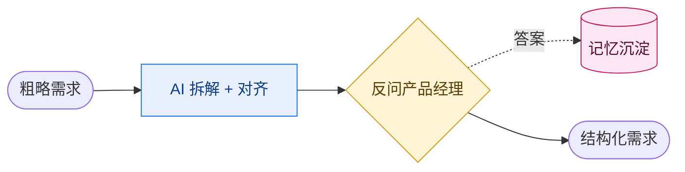

**设计节点** —— AI 出多个方案 → 反问架构师 → 反问的答案沉淀进设计决策记忆：

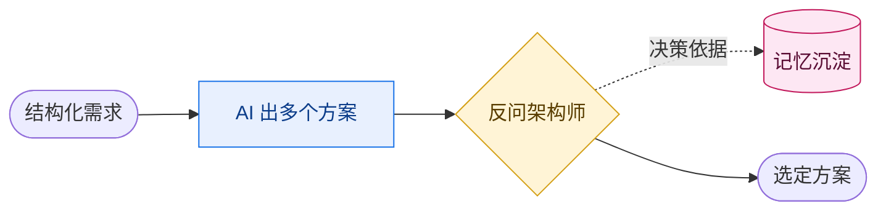

**编码节点** —— AI 写实现 → 反问开发者关键约束 → 答案沉淀：

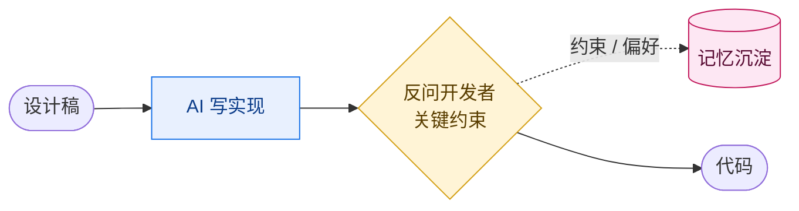

**审计节点** —— N 个 AI 并发审计不同切片 → 汇总结论 → 关键问题人 review：

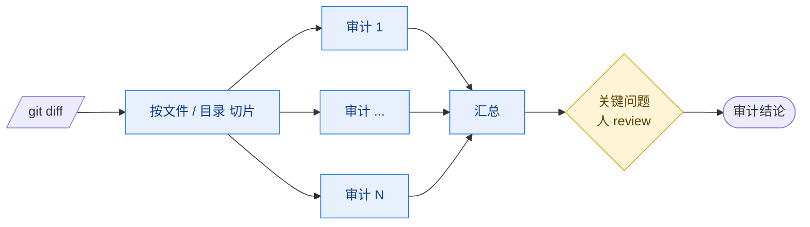

**修复节点** —— AI 根据审计修复 → 自动跑测试 → 失败循环 → 直到通过：

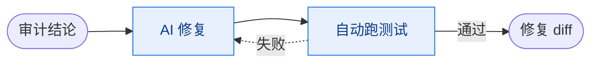

**文档节点** —— AI 根据已 merge 的 diff 自动生成 changelog / 内部 wiki：

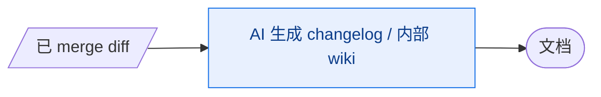

这种形态下，每一步都有 AI 的参与，但**每一步也都有明确的人审核、明确的产物、明确的可审计轨迹**。

更重要的是：**整条链路是一份可拖拽编排、可版本化、可复用的"工作流"**，而不是散落在每个人电脑里的若干 prompt 模板。

这才是我们说的 **AI Native 交付工作流**。

---

## 三、AI Native 交付工作流的三层定义

"AI Native 工作流"是一个被讲烂了的词。我们必须给它一个干净的定义，否则只是 buzzword。

我们的定义是三层、从小到大、互相搭脚手架：

### 第一层：最小协作单元 —— Code → Audit → Fix 闭环

这是 AI Native 工作流的**原子单元**。

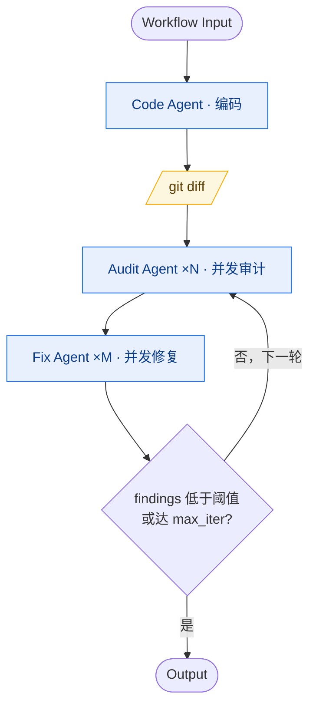

它有几个关键性质：

- **三类 agent、三个角色、三个清晰的产出**——每一步的责任都是单向、明确的；
- **agent 之间的数据传递是确定性的**（git diff、审计结果、修复 diff），**不需要一个上层 LLM 来调度**；
- **可以无脑跑很多轮**——audit → fix 循环直到 finding 数低于阈值，或者达到最大迭代次数才出手让人介入；
- **人在哪？**——在 Audit 之后的 Human Review 节点上 approve / 打回，**但不参与中间的搬运**。

听起来像 DevOps 流水线？是，又不全是。流水线是"代码进、构建出"，工作流是"诉求进、产物出"，中间每一步都可能有 LLM 推理和决策。

> **📌 为什么 Audit 必须是 ×N 并发，而不是一个 agent 看全部？**
>
> 这里要插一个我们反复观察到的真实失败模式：**当一个 session 一次性看到几百条问题**（几百行 diff、几百条 audit finding、几百个待修复点），**模型会直接"躺平"**——只挑最显眼的几条认真处理，后面的全部省略，最后给一句"剩余问题类似处理"草草收尾。这不是模型能力不够，是上下文压力 + 任务重复度上来之后推理质量的天然衰减；而且任务越枯燥重复（"看完所有 finding 全部修复"），躺平来得越快。
>
> **把任务切片到独立 session（每片一个独立 agent 进程，各自只看自己那一份），是目前最可靠的绕开方法。** 所以多进程 fan-out 在我们这里不只是为了快，更是**为了让模型不至于一看到大体量就放弃**——它是质量保证，不是性能优化。

### 第二层：端到端 pipeline —— 从需求进到 MR 出

把闭环单元串起来，得到一条端到端的交付管道：

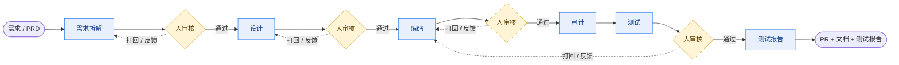

实线 = 通过，沿主线进入下游；虚线 = **打回 / 反馈**，人审核不通过时把评论意见带回上游 AI 节点重新生成。这条管道有几个关键性质：

- 每个节点由一个 agent 负责（不同的角色用不同的 system prompt、不同的 skill）；
- 节点之间的数据流由框架搬运，不是某一个 agent 在脑子里替我们记着；
- **关键节点上有人**——但人是被工作流"召唤"过来的，不是来回搬数据的人肉中转站；
- **人审核的"打回"不是一句口头反馈**——拒绝理由作为结构化输入注入到上游 agent 的下一次生成里，agent 不需要在自由对话里反复理解人的语气，直接吃到"重做指令"。这就是为什么这一层叫"工作流驱动 AI 和人"，而不是"人靠工作流通知 AI"。

这一层的关键不动点是：**整条 pipeline 本身是一份可拖拽编辑、可版本化、可复用、可在团队间共享的"产品"**。它和需求模板、设计模板、PR 模板一样，是团队的工程资产。

### 第三层：长期记忆飞轮 —— 每跑一次都让平台变聪明

这是 AI Native 工作流和"传统 DevOps + AI 插件"最大的不同点。

可能有人会反问："知识管理我们一直在做啊——代码仓里塞了一堆 README / docs / 架构图，Wiki / Confluence 上还有上百页设计文档。"是的，**大家也都意识到知识的重要性**，过去十年我们持续往代码仓和 Wiki 里堆文档。但仔细盘一下就会发现：

> **这些文档从存进去那一刻起，就已经开始老化。**

- 写文档的当下还对的内容，三个月后随着代码演进就过时了，但没有任何机制去触发更新；
- 文档作者离开团队的那天起，没人有动力维护它；
- 真正"为什么这么做"的决策依据从来没被写进去——它只活在某次设计会议纪要、某条 IM 消息、某个老员工的脑子里；
- 即便文档是新的、对的，**没人记得在某个任务起跑时主动去读它**——AI agent 更不会。

静态文档不是没用，是**没有发动机**——它需要人写、人维护、人主动查，每一个动作都要团队投入额外的、违反人性的纪律。靠这种纪律支撑的知识管理在小团队还能勉强转，到几百人规模就一定崩。

我们想要的不是又一份静态文档系统，是**一台自己转的飞轮**：

每跑完一次任务，平台都会异步触发一次"distill"作业，从这次任务的所有 events / outputs 里提炼出三类资产：

- **经验**：这种 agent 在这种类型的任务上倾向出错在哪些地方；
- **决策**：人在审查节点做了什么决定、为什么；
- **反问 Q&A**：agent 反问了什么、人怎么答的、答的依据是什么。

这些资产被结构化存储到平台记忆里，下一次类似任务起跑时，按 agent / 仓 / workflow 维度自动召回、注入到 agent 的上下文。整套提炼—存储—召回—注入的循环长这样：

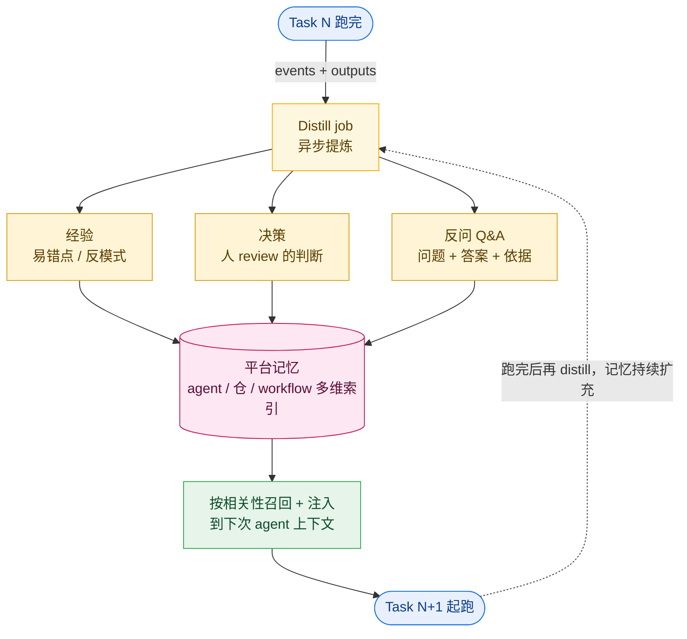

虚线那条回边是"飞轮"的关键——**Task N+1 跑完后再次触发 distill，扩充平台记忆，让 Task N+2 的起点又高一格**；跑得越多，平台越聪明，每个新任务的起点越高。

> **跑得越多，平台越聪明；平台越聪明，每个新任务的起点越高。**

并且——这是关键——**飞轮不依赖某一个工程师**。它依赖于"所有任务都跑在同一个平台上"。

这也是为什么我们坚持 AI 必须从"个体工具"升级为"团队平台"——只有这样，飞轮才转得起来。

---

## 四、那座被严重低估的金矿：反问

到这里我们要单独花一节谈反问，因为这是我认为**在 AI Native 工作流里被浪费丢掉的的知识**。

### 反问，而不是 prompt，决定 AI 产出的上限

业界关于"如何让 AI 产出更好"的讨论 95% 集中在 prompt engineering——怎么写更好的 prompt、怎么塞更多上下文、怎么用 few-shot 例子。

我的观点是：

> **人给AI的第一版输入一定是不准确的，如果不增加反问迭代环节来"蒸馏"作者，必然会引起最终输出与预期不一致**

举个例子。同样一个"实现一个登录接口"的任务：

- **A 路径**：开发者写了 1500 字的 prompt，把项目背景、约束、风格规范一股脑塞进去，AI 生成代码。
- **B 路径**：开发者写了 50 字的 prompt："实现一个登录接口"。AI 反问了 5 个问题：
  1. 是手机号 + 验证码还是用户名 + 密码？还是都要？
  2. 是否需要支持 SSO？如果支持，是 OAuth2、SAML 还是公司内部的 OIDC？
  3. 失败次数上限是多少？锁定策略是什么？
  4. session 是 JWT 还是 server-side？过期时间？
  5. 是否需要保留旧版兼容？

B 路径出来的代码质量远高于 A 路径——因为 prompt 写得再好，也覆盖不了"开发者自己没意识到要说"的东西。**反问，本质上是 AI 替我们拓展了问题空间。**

**通过反问，AI能够引导人去想到自己之前所没想到的方面，从而迭代补全**

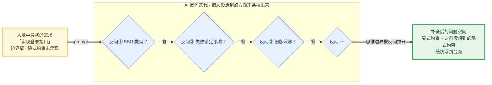

### 反问的答案才是真正的"团队知识"

但更重要的是反问得到的**答案**。

在 B 路径里，开发者的 5 个回答其实是这个团队、这个项目、这个模块的**真实约束**。这些约束从来没有被任何文档完整捕获——它们活在：

- 老员工的脑子里；
- 一年前的某次设计会议纪要里（已经没人翻了）；
- 一次产品和研发的微信群聊天里（已经被刷掉了）；
- 上一个负责这块的工程师的离职文档里（已经过期了）。

新人入职要被老员工口头讲半年的"我们这边的隐式规则"，本质就是这一类知识。

**AI 反问的过程，是第一次让这些隐式知识浮现到台面上的机会。**

但在今天的 IDE 内置 AI 工具模式下：

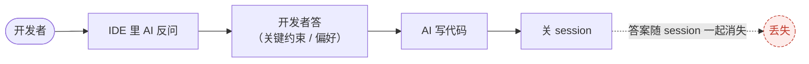

答案丢了，下次新需求来，AI 再问一次，开发者再答一次，再忘一次。

### AI Native 工作流的关键设计：捕获、沉淀、注入

我们的产品在这一点上做了三件事：

1. **捕获**：所有 agent 的反问与人的回答都被结构化记录到任务详情里，不会随 session 关闭丢失；
2. **沉淀**：任务跑完后的 distill 作业会专门提炼这些 Q&A，分类归档为"模块级约束"、"领域偏好"、"团队规范"等；
3. **注入**：下一次类似任务起跑时，相关 Q&A 自动注入到 agent 的上下文，agent 不会再问同一个问题，会基于上一次的答案直接做。

第一次跑某个领域的任务，agent 反问 5 次；第十次跑类似任务，agent 只反问 1 次——因为前 4 个问题在历史 Q&A 里都有答案了。

> **这一刻，AI Native 平台才真正变成了"团队的延伸大脑"，而不是"团队的提速工具"。**

这就是飞轮的真实形态。

---

## 五、观点：上云从个体能力到组织能力的扩展

讲到这里，可能有读者会说："你说的这些事，我在自己电脑上装个CodeAgent、Opencode工具也能干啊。

**可以是可以，但是核心是如何从个体延伸到组织**

这一节我们讨论为什么 AI Native 工作流需要演进到云端形态、它和"AI 桌面工具"的本质差别在哪里。

### 三步同一路线

我们的演进路径是：

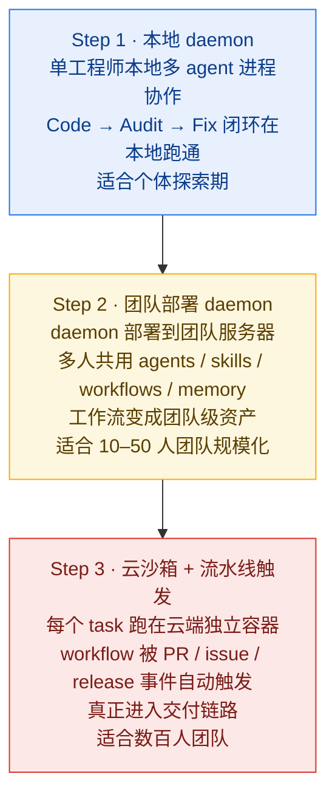

**这三步是同一条演进路线** 让我们逐步说为什么。

### 为什么从 Step 1 → Step 2

- 因为飞轮（团队记忆）的成立前提是"所有任务跑在同一平台"。如果每个人本地一份记忆，飞轮就在每个人的本地各转各的，相当于退化回"工具思维"；
- 因为工作流要成为团队资产，必须有一个共享的、版本化的存储；散落在每人本地是无法治理的；
- 因为审计与治理（哪些任务用了 AI、用的什么 agent、跑了什么 prompt、产出了什么）只有在共享 daemon 上才能聚合。

### 为什么从 Step 2 → Step 3

- 因为只有当工作流可以被 **"AI版本经理"** 的事件触发，AI 才真正"进入"交付链路；否则它只是"被人手动召唤的协作引擎"，价值上限就被"会主动召唤 AI 的人有多少"锁死了；
- 因为云端沙箱化是**安全与合规的硬要求**：审计日志、数据出域、模型 token 配额、企业凭证轮换……这些事情在本地形态下是治理不了的；
- 因为大规模并发执行（一次 release 触发 50 个 MR 自动审计）只能依靠云端弹性资源。

### 关键不动点：架构是连续的

让这条演进路线得以成立的关键不动点，是 Step 1 那套架构本身就是为云端而生的：

- **进程隔离**（每个 task 一个独立的执行环境）；
- **worktree per task**（每个 task 一个独立的代码工作区）；
- **deterministic engine 搬运数据**（agent 之间通过结构化 port 通信，不依赖共享状态）；
- **所有产物结构化落库**（不依赖本地文件系统语义）。

这套架构在 Step 1 用起来稍显"重"，但它让我们可以**无痛地一路演进到 Step 3 而不需要重写**。

我们看到的现实是：很多团队选择从一个"轻"的本地 AI 工具开始，结果两年后想做团队化和云化的时候，发现底子根本不支持，要重做。**大部分团队卡在 Step 1，因为他们没看清 Step 2、Step 3 的形态长什么样；看不清形态，就不会为它做架构上的准备。**

---

## 六、收尾：从"流程驱动人"到"工作流驱动 AI 和人"

回到开篇那个问题。

为什么"使用率 80%"的数据是漂亮的，但质变没有发生？

因为 **AI 在我们的旧范式里只是一个被人调用的工具**。流程是给人定的，AI 是流程上某一格里偷偷塞进去的一个新选项。塞得再多，流程不变；流程不变，效率上限不变。

我们要的新范式是：

> **流程本身变成一种"可执行的协作引擎"——AI 和人都是被它编排的执行单元，AI 在自己擅长的环节做事，人在自己擅长的环节做事，框架负责搬运数据、保留上下文、沉淀记忆。**

这不是把 AI 拟人化。是把"流程"从纸面文档升级成"工作流"——一种可以拖拽编辑、可以版本化、可以被事件触发、可以学习的、活的工程资产。

这就是 AI Native 交付工作流的全部含义。

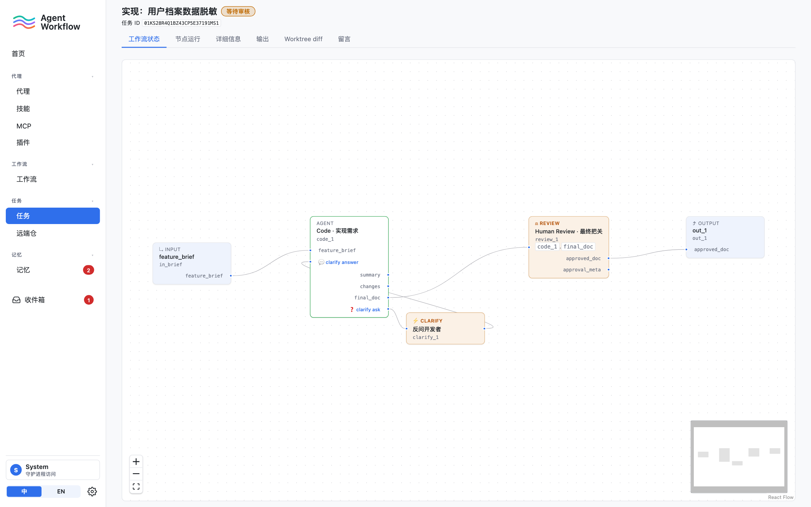

---

下篇我们会讲我正在做的 **Agent Workflow**（<https://github.com/wangbinquan/agent-workflow>）工程如何把这一切落地：它的能力拓扑、Workflow 编辑器、进程隔离的工程底座、Human Review 节点、记忆飞轮的实现，以及它如何按上面这三步路线一步一步演进。

> [继续阅读：Agent Workflow ——把 AI Native 交付工作流真的落到地上 →](./02-agent-workflow-how.md)
